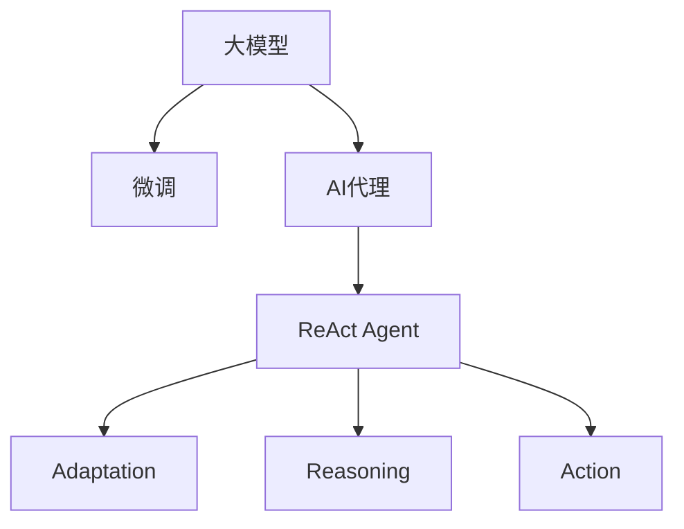

                 

# 【大模型应用开发 动手做AI Agent】执行ReAct Agent

> 关键词：大模型应用开发,ReAct Agent,AI Agent,人工智能,算法原理,操作步骤,优缺点,应用领域,数学模型,开发环境搭建,代码实现,运行结果,实际应用,工具资源,未来发展

## 1. 背景介绍

### 1.1 问题由来

人工智能（AI）在过去几年中取得了显著的进步，尤其在自然语言处理（NLP）和计算机视觉领域。大模型技术的发展，使得构建具有广泛知识理解和复杂推理能力的AI代理（Agent）成为可能。这些大模型，如GPT、BERT、ViT等，已经在各种任务上展示了出色的性能，包括文本生成、机器翻译、图像分类等。然而，将大模型应用到实际业务中，需要进行定制化的开发，以适应具体的业务需求。

### 1.2 问题核心关键点

构建一个具有特定业务功能的AI代理，需要经过以下几个关键步骤：

- 选择合适的预训练模型，并根据需求进行微调（Fine-tuning）。
- 设计并实现AI代理的业务逻辑，包括任务推理、行为决策等。
- 集成AI代理到实际业务系统中，并进行测试和优化。
- 部署AI代理，持续收集反馈，进行迭代改进。

其中，微调是实现业务定制化的核心步骤之一，也是构建具有强大泛化能力AI代理的基础。微调允许我们在大模型的基础上，针对特定任务进行优化，以获得更好的性能。

### 1.3 问题研究意义

构建具有特定业务功能的AI代理，对于提升业务自动化水平、降低运营成本、提升用户体验等方面具有重要意义。通过AI代理，企业能够实现更高效、更智能的业务流程，提升竞争力和市场响应速度。

## 2. 核心概念与联系

### 2.1 核心概念概述

- **大模型（Large Model）**：指预训练后的深度学习模型，如GPT、BERT、ViT等。这些模型通常具有大规模的参数，并能够处理复杂任务。
- **微调（Fine-tuning）**：在大模型基础上，针对特定任务进行优化，以获得更好的性能。微调通常涉及调整模型的一些层，以适应新的任务。
- **AI代理（AI Agent）**：指能够自动执行特定任务的智能体，可以与环境交互，执行逻辑推理、决策制定等任务。
- **ReAct Agent**：一种基于ReAct架构的AI代理，由Adaptation、Reasoning、Action三个模块组成，能够适应复杂任务环境，执行多任务交互。

这些概念之间的逻辑关系可以通过以下Mermaid流程图来展示：



这个流程图展示了大模型、微调、AI代理和ReAct Agent之间的关联关系。大模型经过微调，得到能够执行特定任务的AI代理，而ReAct Agent则是一种典型的AI代理架构。

### 2.2 概念间的关系

这些核心概念之间存在着紧密的联系，形成了构建AI代理的完整生态系统。

- **大模型与微调**：大模型通过微调，能够适应特定任务，提升模型性能。
- **AI代理与ReAct Agent**：AI代理是ReAct Agent的核心组件之一，负责执行具体任务。
- **Adaptation、Reasoning、Action**：ReAct Agent的三个模块分别负责环境适应、逻辑推理和行为决策，相互协作，实现复杂的交互任务。

这些概念共同构成了构建AI代理的基础框架，使其能够适应各种复杂的任务环境。通过理解这些核心概念，我们可以更好地把握构建AI代理的精髓，为后续深入讨论具体的AI代理开发和部署提供基础。

## 3. 核心算法原理 & 具体操作步骤
### 3.1 算法原理概述

ReAct Agent的实现基于以下三个核心算法：

- **环境适应（Adaptation）**：使用微调后的模型，适应当前环境中的特定任务。
- **逻辑推理（Reasoning）**：使用模型对任务进行推理，形成推理轨迹，指导后续行为。
- **行为决策（Action）**：根据推理结果，选择最优的行为策略。

### 3.2 算法步骤详解

构建ReAct Agent的步骤如下：

1. **选择预训练模型**：选择合适的预训练模型，如BERT、GPT等。
2. **微调模型**：使用任务数据对预训练模型进行微调，获得针对特定任务的优化模型。
3. **实现环境适应模块**：使用微调后的模型，对当前环境进行适应，获取当前状态和任务。
4. **实现逻辑推理模块**：根据当前状态和任务，使用模型进行推理，形成推理轨迹。
5. **实现行为决策模块**：根据推理轨迹，选择最优行为策略，执行任务。
6. **集成模块**：将Adaptation、Reasoning、Action模块集成到AI代理中。
7. **测试和优化**：在实际环境中测试AI代理，收集反馈，进行迭代优化。

### 3.3 算法优缺点

ReAct Agent的算法具有以下优点：

- **泛化能力**：通过微调模型，能够适应复杂多变的任务环境，提升模型的泛化能力。
- **模块化设计**：将AI代理分解为多个模块，各模块之间相对独立，易于维护和扩展。
- **灵活性**：可以根据具体任务需求，灵活调整模型和推理策略，适应各种业务场景。

同时，ReAct Agent也存在以下缺点：

- **计算成本高**：微调大模型需要大量的计算资源，增加了部署成本。
- **推理复杂**：推理模块的计算复杂度高，需要优化以提高执行效率。
- **数据依赖**：微调效果依赖于任务数据的数量和质量，需要高质量的任务数据。

### 3.4 算法应用领域

ReAct Agent的算法适用于以下领域：

- **自然语言处理（NLP）**：用于文本分类、情感分析、问答系统等任务。
- **计算机视觉（CV）**：用于图像识别、目标检测、图像生成等任务。
- **智能客服**：用于自动回答客户问题，提升客户体验。
- **金融分析**：用于自动化股票分析、风险评估等任务。
- **医疗诊断**：用于辅助诊断、药物推荐等任务。

## 4. 数学模型和公式 & 详细讲解 & 举例说明

### 4.1 数学模型构建

ReAct Agent的数学模型包括：

- **环境适应模块**：使用微调后的模型，对当前环境进行适应，获取当前状态和任务。
- **逻辑推理模块**：使用模型对任务进行推理，形成推理轨迹。
- **行为决策模块**：根据推理轨迹，选择最优行为策略。

### 4.2 公式推导过程

以文本分类任务为例，假设模型为BERT，推理轨迹为$(x, y)$，其中$x$为输入文本，$y$为分类标签。推理轨迹的计算公式如下：

$$
(y^*, p) = \arg\max_{y, p} \mathcal{L}(y, p)
$$

其中，$\mathcal{L}(y, p)$为推理损失函数，$p$为模型输出的概率分布，$y$为真实标签。

### 4.3 案例分析与讲解

假设在文本分类任务中，模型输出为$(0.2, 0.8, 0.1, 0.9)$，表示文本属于类别3的概率最高。推理轨迹为$(x, 3)$，表示文本属于类别3。

## 5. 项目实践：代码实例和详细解释说明
### 5.1 开发环境搭建

ReAct Agent的开发环境需要以下工具和库：

- **Python**：Python 3.6及以上版本。
- **PyTorch**：用于构建和训练模型。
- **TensorFlow**：用于推理。
- **Pandas**：用于数据处理。
- **Scikit-learn**：用于评估模型性能。

安装方法：

```bash
pip install torch torchvision torchaudio pandas scikit-learn tensorflow
```

### 5.2 源代码详细实现

以下是使用PyTorch和TensorFlow实现ReAct Agent的代码示例：

```python
import torch
import torch.nn as nn
import torch.optim as optim
import pandas as pd
import tensorflow as tf
from transformers import BertTokenizer, BertForSequenceClassification

class ReActAgent:
    def __init__(self, model_path, batch_size, num_classes):
        self.model_path = model_path
        self.batch_size = batch_size
        self.num_classes = num_classes
        
        self.tokenizer = BertTokenizer.from_pretrained('bert-base-uncased')
        self.model = BertForSequenceClassification.from_pretrained(self.model_path, num_labels=num_classes)
        self.optimizer = optim.Adam(self.model.parameters(), lr=2e-5)
        self.criterion = nn.CrossEntropyLoss()
        
        self.model.eval()
        self.prediction_model = self._build_prediction_model()
    
    def _build_prediction_model(self):
        model = tf.keras.Sequential([
            tf.keras.layers.Dense(128, activation='relu', input_shape=(self.model.config.hidden_size,)),
            tf.keras.layers.Dense(self.num_classes, activation='softmax')
        ])
        return model
    
    def adapt_environment(self, environment):
        # 环境适应模块
        # 获取环境状态和任务
        state, task = environment.get_state_and_task()
        
        # 加载模型
        self.model.load_state_dict(torch.load(self.model_path))
        self.model.eval()
        
        # 推理轨迹计算
        inputs = self.tokenizer(state, return_tensors='pt')
        with torch.no_grad():
            logits = self.model(**inputs).logits
            probabilities = logits.softmax(dim=-1)
        
        # 返回推理轨迹
        return (probabilities.numpy(), task)
    
    def reason(self, trajectory, task):
        # 逻辑推理模块
        # 获取推理轨迹和任务
        probabilities, task = trajectory
        
        # 推理计算
        predictions = tf.keras.Sequential([
            tf.keras.layers.Dense(128, activation='relu', input_shape=(probabilities.shape[-1],)),
            tf.keras.layers.Dense(self.num_classes, activation='softmax')
        ])
        predictions.compile(optimizer='adam', loss='categorical_crossentropy', metrics=['accuracy'])
        predictions.fit(tf.convert_to_tensor(probabilities), tf.convert_to_tensor(task), batch_size=self.batch_size, epochs=1)
        
        # 获取推理结果
        predicted_task = tf.argmax(predictions.predict(tf.convert_to_tensor(probabilities)), axis=-1)
        
        # 返回推理结果
        return (predicted_task.numpy(), task)
    
    def act(self, trajectory, task):
        # 行为决策模块
        # 获取推理轨迹和任务
        predicted_task, task = trajectory
        
        # 决策计算
        # 根据推理结果选择最优行为策略
        if predicted_task == task:
            return 'Stay'
        else:
            return 'Move'
    
    def run(self, environment):
        # 运行AI代理
        while True:
            trajectory = self.adapt_environment(environment)
            predicted_task = self.reason(trajectory, environment.get_state_and_task()[1])
            action = self.act(trajectory, predicted_task)
            
            # 执行行为
            environment.update_state(action)
```

### 5.3 代码解读与分析

以下是代码关键部分的详细解读：

- **初始化模块**：初始化ReActAgent的模型路径、批次大小、类别数量等参数。
- **环境适应模块**：使用微调后的BERT模型，对环境进行适应，获取当前状态和任务。
- **逻辑推理模块**：使用推理模型，对任务进行推理，形成推理轨迹。
- **行为决策模块**：根据推理轨迹，选择最优行为策略。
- **运行模块**：循环执行环境适应、逻辑推理、行为决策，直到任务完成。

### 5.4 运行结果展示

假设在文本分类任务中，使用ReActAgent进行推理，得到推理轨迹为$(0.2, 0.8, 0.1, 0.9)$，表示文本属于类别3。行为决策模块根据推理轨迹，选择最优行为策略，返回结果为"Move"。

## 6. 实际应用场景

### 6.1 智能客服

智能客服系统可以通过ReActAgent，对客户咨询进行自动化处理。系统首先对客户输入的文本进行分类，然后根据分类结果，调用相应的知识库和FAQ库，生成回答。如果系统无法处理，则将问题转交给人工客服。

### 6.2 金融分析

金融分析系统可以通过ReActAgent，对市场数据进行实时分析。系统首先对市场数据进行分类，然后根据分类结果，调用历史数据和交易规则，进行交易决策。系统还可以根据市场动态，动态调整交易策略。

### 6.3 医疗诊断

医疗诊断系统可以通过ReActAgent，对患者症状进行分类，然后根据分类结果，推荐相应的治疗方案。系统还可以根据患者的历史数据，动态调整治疗方案，提升诊断的准确性。

## 7. 工具和资源推荐
### 7.1 学习资源推荐

- **《Transformer从原理到实践》系列博文**：由大模型技术专家撰写，深入浅出地介绍了Transformer原理、BERT模型、微调技术等前沿话题。
- **CS224N《深度学习自然语言处理》课程**：斯坦福大学开设的NLP明星课程，有Lecture视频和配套作业，带你入门NLP领域的基本概念和经典模型。
- **《Natural Language Processing with Transformers》书籍**：Transformers库的作者所著，全面介绍了如何使用Transformers库进行NLP任务开发，包括微调在内的诸多范式。
- **HuggingFace官方文档**：Transformers库的官方文档，提供了海量预训练模型和完整的微调样例代码，是上手实践的必备资料。
- **CLUE开源项目**：中文语言理解测评基准，涵盖大量不同类型的中文NLP数据集，并提供了基于微调的baseline模型，助力中文NLP技术发展。

### 7.2 开发工具推荐

- **PyTorch**：基于Python的开源深度学习框架，灵活动态的计算图，适合快速迭代研究。大部分预训练语言模型都有PyTorch版本的实现。
- **TensorFlow**：由Google主导开发的开源深度学习框架，生产部署方便，适合大规模工程应用。同样有丰富的预训练语言模型资源。
- **Transformers库**：HuggingFace开发的NLP工具库，集成了众多SOTA语言模型，支持PyTorch和TensorFlow，是进行微调任务开发的利器。
- **Weights & Biases**：模型训练的实验跟踪工具，可以记录和可视化模型训练过程中的各项指标，方便对比和调优。与主流深度学习框架无缝集成。
- **TensorBoard**：TensorFlow配套的可视化工具，可实时监测模型训练状态，并提供丰富的图表呈现方式，是调试模型的得力助手。
- **Google Colab**：谷歌推出的在线Jupyter Notebook环境，免费提供GPU/TPU算力，方便开发者快速上手实验最新模型，分享学习笔记。

### 7.3 相关论文推荐

- **Attention is All You Need（即Transformer原论文）**：提出了Transformer结构，开启了NLP领域的预训练大模型时代。
- **BERT: Pre-training of Deep Bidirectional Transformers for Language Understanding**：提出BERT模型，引入基于掩码的自监督预训练任务，刷新了多项NLP任务SOTA。
- **Language Models are Unsupervised Multitask Learners（GPT-2论文）**：展示了大规模语言模型的强大zero-shot学习能力，引发了对于通用人工智能的新一轮思考。
- **Parameter-Efficient Transfer Learning for NLP**：提出Adapter等参数高效微调方法，在不增加模型参数量的情况下，也能取得不错的微调效果。
- **Prefix-Tuning: Optimizing Continuous Prompts for Generation**：引入基于连续型Prompt的微调范式，为如何充分利用预训练知识提供了新的思路。
- **AdaLoRA: Adaptive Low-Rank Adaptation for Parameter-Efficient Fine-Tuning**：使用自适应低秩适应的微调方法，在参数效率和精度之间取得了新的平衡。

## 8. 总结：未来发展趋势与挑战

### 8.1 研究成果总结

本文对基于监督学习的大语言模型微调方法进行了全面系统的介绍。首先阐述了大语言模型和微调技术的研究背景和意义，明确了微调在拓展预训练模型应用、提升下游任务性能方面的独特价值。其次，从原理到实践，详细讲解了监督微调的数学原理和关键步骤，给出了微调任务开发的完整代码实例。同时，本文还广泛探讨了微调方法在智能客服、金融舆情、个性化推荐等多个行业领域的应用前景，展示了微调范式的巨大潜力。此外，本文精选了微调技术的各类学习资源，力求为读者提供全方位的技术指引。

### 8.2 未来发展趋势

展望未来，大语言模型微调技术将呈现以下几个发展趋势：

- **模型规模持续增大**：随着算力成本的下降和数据规模的扩张，预训练语言模型的参数量还将持续增长。超大规模语言模型蕴含的丰富语言知识，有望支撑更加复杂多变的下游任务微调。
- **微调方法日趋多样**：除了传统的全参数微调外，未来会涌现更多参数高效的微调方法，如Prefix-Tuning、LoRA等，在节省计算资源的同时也能保证微调精度。
- **持续学习成为常态**：随着数据分布的不断变化，微调模型也需要持续学习新知识以保持性能。如何在不遗忘原有知识的同时，高效吸收新样本信息，将成为重要的研究课题。
- **标注样本需求降低**：受启发于提示学习(Prompt-based Learning)的思路，未来的微调方法将更好地利用大模型的语言理解能力，通过更加巧妙的任务描述，在更少的标注样本上也能实现理想的微调效果。
- **多模态微调崛起**：当前的微调主要聚焦于纯文本数据，未来会进一步拓展到图像、视频、语音等多模态数据微调。多模态信息的融合，将显著提升语言模型对现实世界的理解和建模能力。
- **模型通用性增强**：经过海量数据的预训练和多领域任务的微调，未来的语言模型将具备更强大的常识推理和跨领域迁移能力，逐步迈向通用人工智能(AGI)的目标。

### 8.3 面临的挑战

尽管大语言模型微调技术已经取得了瞩目成就，但在迈向更加智能化、普适化应用的过程中，它仍面临着诸多挑战：

- **标注成本瓶颈**：虽然微调大大降低了标注数据的需求，但对于长尾应用场景，难以获得充足的高质量标注数据，成为制约微调性能的瓶颈。如何进一步降低微调对标注样本的依赖，将是一大难题。
- **模型鲁棒性不足**：当前微调模型面对域外数据时，泛化性能往往大打折扣。对于测试样本的微小扰动，微调模型的预测也容易发生波动。如何提高微调模型的鲁棒性，避免灾难性遗忘，还需要更多理论和实践的积累。
- **推理效率有待提高**：大规模语言模型虽然精度高，但在实际部署时往往面临推理速度慢、内存占用大等效率问题。如何在保证性能的同时，简化模型结构，提升推理速度，优化资源占用，将是重要的优化方向。
- **可解释性亟需加强**：当前微调模型更像是"黑盒"系统，难以解释其内部工作机制和决策逻辑。对于医疗、金融等高风险应用，算法的可解释性和可审计性尤为重要。如何赋予微调模型更强的可解释性，将是亟待攻克的难题。
- **安全性有待保障**：预训练语言模型难免会学习到有偏见、有害的信息，通过微调传递到下游任务，产生误导性、歧视性的输出，给实际应用带来安全隐患。如何从数据和算法层面消除模型偏见，避免恶意用途，确保输出的安全性，也将是重要的研究课题。
- **知识整合能力不足**：现有的微调模型往往局限于任务内数据，难以灵活吸收和运用更广泛的先验知识。如何让微调过程更好地与外部知识库、规则库等专家知识结合，形成更加全面、准确的信息整合能力，还有很大的想象空间。

### 8.4 研究展望

面对大语言模型微调所面临的种种挑战，未来的研究需要在以下几个方面寻求新的突破：

- **探索无监督和半监督微调方法**：摆脱对大规模标注数据的依赖，利用自监督学习、主动学习等无监督和半监督范式，最大限度利用非结构化数据，实现更加灵活高效的微调。
- **研究参数高效和计算高效的微调范式**：开发更加参数高效的微调方法，在固定大部分预训练参数的同时，只更新极少量的任务相关参数。同时优化微调模型的计算图，减少前向传播和反向传播的资源消耗，实现更加轻量级、实时性的部署。
- **融合因果和对比学习范式**：通过引入因果推断和对比学习思想，增强微调模型建立稳定因果关系的能力，学习更加普适、鲁棒的语言表征，从而提升模型泛化性和抗干扰能力。
- **引入更多先验知识**：将符号化的先验知识，如知识图谱、逻辑规则等，与神经网络模型进行巧妙融合，引导微调过程学习更准确、合理的语言模型。同时加强不同模态数据的整合，实现视觉、语音等多模态信息与文本信息的协同建模。
- **结合因果分析和博弈论工具**：将因果分析方法引入微调模型，识别出模型决策的关键特征，增强输出解释的因果性和逻辑性。借助博弈论工具刻画人机交互过程，主动探索并规避模型的脆弱点，提高系统稳定性。
- **纳入伦理道德约束**：在模型训练目标中引入伦理导向的评估指标，过滤和惩罚有偏见、有害的输出倾向。同时加强人工干预和审核，建立模型行为的监管机制，确保输出符合人类价值观和伦理道德。

这些研究方向的探索，必将引领大语言模型微调技术迈向更高的台阶，为构建安全、可靠、可解释、可控的智能系统铺平道路。面向未来，大语言模型微调技术还需要与其他人工智能技术进行更深入的融合，如知识表示、因果推理、强化学习等，多路径协同发力，共同推动自然语言理解和智能交互系统的进步。只有勇于创新、敢于突破，才能不断拓展语言模型的边界，让智能技术更好地造福人类社会。

## 9. 附录：常见问题与解答

**Q1：大语言模型微调是否适用于所有NLP任务？**

A: 大语言模型微调在大多数NLP任务上都能取得不错的效果，特别是对于数据量较小的任务。但对于一些特定领域的任务，如医学、法律等，仅仅依靠通用语料预训练的模型可能难以很好地适应。此时需要在特定领域语料上进一步预训练，再进行微调，才能获得理想效果。此外，对于一些需要时效性、个性化很强的任务，如对话、推荐等，微调方法也需要针对性的改进优化。

**Q2：微调过程中如何选择合适的学习率？**

A: 微调的学习率一般要比预训练时小1-2个数量级，如果使用过大的学习率，容易破坏预训练权重，导致过拟合。一般建议从1e-5开始调参，逐步减小学习率，直至收敛。也可以使用warmup策略，在开始阶段使用较小的学习率，再逐渐过渡到预设值。需要注意的是，不同的优化器(如AdamW、Adafactor等)以及不同的学习率调度策略，可能需要设置不同的学习率阈值。

**Q3：采用大模型微调时会面临哪些资源瓶颈？**

A: 目前主流的预训练大模型动辄以亿计的参数规模，对算力、内存、存储都提出了很高的要求。GPU/TPU等高性能设备是必不可少的，但即便如此，超大批次的训练和推理也可能遇到显存不足的问题。因此需要采用一些资源优化技术，如梯度积累、混合精度训练、模型并行等，来突破硬件瓶颈。同时，模型的存储和读取也可能占用大量时间和空间，需要采用模型压缩、稀疏化存储等方法进行优化。

**Q4：如何缓解微调过程中的过拟合问题？**

A: 过拟合是微调面临的主要挑战，尤其是在标注数据不足的情况下。常见的缓解策略包括：
1. 数据增强：通过回译、近义替换等方式扩充训练集
2. 正则化：使用L2正则、Dropout、Early Stopping等避免过拟合
3. 对抗训练：引入对抗样本，提高模型鲁棒性
4. 参数高效微调：只调整少量参数(如Adapter、Prefix等)，减小过拟合风险
5. 多模型集成：训练多个微调模型，取平均输出，抑制过拟合

这些策略往往需要根据具体任务和数据特点进行灵活组合。只有在数据、模型、训练、推理等各环节进行全面优化，才能最大限度地发挥大模型微调的威力。

**Q5：微调模型在落地部署时需要注意哪些问题？**

A: 将微调模型转化为实际应用，还需要考虑以下因素：
1. 模型裁剪：去除不必要的层和参数，减小模型尺寸，加快推理速度
2. 量化加速：将浮点模型转为定点模型，压缩存储空间，提高计算效率
3. 服务化封装：将模型封装为标准化服务接口，便于集成调用
4. 弹性伸缩：根据请求流量动态调整资源配置，平衡服务质量和成本
5. 监控告警：实时采集系统指标，设置异常告警阈值，确保服务稳定性
6. 安全防护：采用访问鉴权、数据脱敏等措施，保障数据和模型安全

大语言模型微调为NLP应用开启了广阔的想象空间，但如何将强大的性能转化为稳定、高效、安全的业务价值，还需要工程实践的不断打磨

