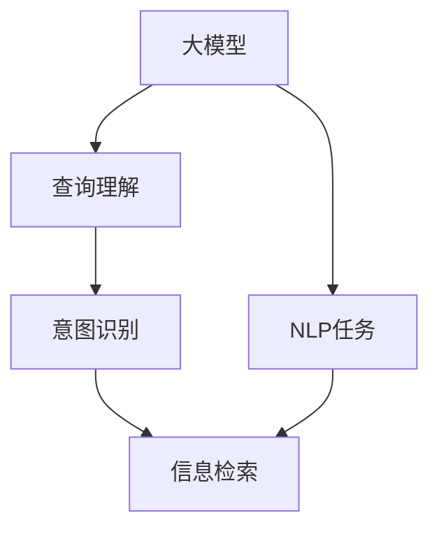

                 

# 【大模型应用开发 动手做AI Agent】构建查询引擎和工具

> 关键词：大模型,自然语言处理,NLP,查询引擎,Python,Transformers,Scikit-learn,TensorFlow

## 1. 背景介绍

在当前信息技术飞速发展的背景下，自然语言处理（NLP）技术的应用越来越广泛。无论是搜索引擎、聊天机器人还是智能客服，自然语言处理都扮演着至关重要的角色。这些应用的核心在于对自然语言的理解和生成，大语言模型（LLMs）因其强大的语言理解和生成能力，在NLP领域占据了重要地位。

大语言模型通常采用自回归或自编码模型进行训练，通过在大规模无标签文本数据上进行预训练，学习到丰富的语言知识，具备了强大的语言理解和生成能力。这些模型通常需要较大的计算资源和数据资源进行训练，但是一旦训练完成，就可以在各种下游任务上进行微调，提升性能。

查询引擎作为信息检索的核心组件，通过理解用户的查询意图，在海量数据中检索相关信息，并提供给用户。传统的查询引擎主要依赖于文本匹配算法，但是对于复杂的查询请求，尤其是包含自然语言处理任务的查询请求，传统的文本匹配算法往往难以胜任。基于大模型的查询引擎，利用其强大的自然语言处理能力，可以在查询理解、意图识别、信息检索等多个环节提升查询引擎的性能。

本文将介绍如何使用大模型构建查询引擎，并结合Python、Transformers、Scikit-learn等工具，实现一个高效、精确的查询引擎。

## 2. 核心概念与联系

### 2.1 核心概念概述

构建基于大模型的查询引擎，需要涉及多个核心概念，包括大模型、查询引擎、自然语言处理等。以下是这些概念的基本概述：

- **大模型（Large Language Models, LLMs）**：以自回归（如GPT）或自编码（如BERT）模型为代表的大规模预训练语言模型。通过在大规模无标签文本数据上进行预训练，学习到通用的语言表示，具备强大的语言理解和生成能力。

- **查询引擎（Query Engine）**：一种信息检索系统，能够理解用户的查询意图，在海量数据中检索相关信息，并提供给用户。查询引擎通常包括查询理解、意图识别、信息检索等多个环节。

- **自然语言处理（Natural Language Processing, NLP）**：涉及对自然语言的理解和生成，包括文本预处理、词性标注、命名实体识别、句法分析、语义理解等多个子任务。

这些核心概念之间存在着紧密的联系，大模型通过预训练学习到丰富的语言知识，可以在查询理解、意图识别等NLP任务中发挥重要作用。查询引擎则通过大模型进行自然语言处理，提高信息检索的精确度和效率。

### 2.2 概念间的关系

这些核心概念之间的逻辑关系可以通过以下Mermaid流程图来展示：



这个流程图展示了从大模型到查询引擎的全过程。大模型通过预训练学习到通用的语言表示，在查询理解、意图识别等NLP任务中发挥作用，并最终通过信息检索环节，将相关信息提供给用户。

## 3. 核心算法原理 & 具体操作步骤

### 3.1 算法原理概述

基于大模型的查询引擎主要包括以下几个步骤：

1. **查询理解**：通过大模型对用户的查询进行理解，提取查询中的关键词、短语等信息。
2. **意图识别**：基于理解后的查询，利用大模型识别用户的查询意图，如搜索信息、获取定义等。
3. **信息检索**：根据用户查询的意图，利用大模型在海量数据中检索相关信息，并返回给用户。

其中，查询理解和意图识别是大模型在自然语言处理（NLP）任务中的重要应用，而信息检索则依赖于大模型的语言生成能力。

### 3.2 算法步骤详解

构建基于大模型的查询引擎主要包括以下步骤：

1. **数据准备**：收集用于训练大模型的文本数据，并进行预处理，如分词、去除停用词等。
2. **模型选择与训练**：选择合适的预训练大模型，如BERT、GPT等，并进行微调，适应特定的查询理解或意图识别任务。
3. **查询理解与意图识别**：在用户输入查询后，通过大模型进行查询理解和意图识别，提取查询中的关键信息，识别用户的查询意图。
4. **信息检索**：根据识别到的用户查询意图，利用大模型在海量数据中检索相关信息，并返回给用户。

### 3.3 算法优缺点

基于大模型的查询引擎具有以下优点：

- **高效**：利用大模型的强大语言理解和生成能力，可以快速理解用户查询，并返回相关信息。
- **精确**：大模型在自然语言处理任务中表现出色，可以识别复杂的查询意图，提高信息检索的精确度。
- **可扩展**：大模型可以用于多种NLP任务，查询引擎可以通过微调大模型，适应不同的查询理解或意图识别任务。

同时，基于大模型的查询引擎也存在以下缺点：

- **依赖大模型**：大模型的训练和部署需要较大的计算资源和数据资源，对计算环境的要求较高。
- **解释性不足**：大模型通常被视为“黑盒”，难以解释其内部工作机制和决策逻辑，难以提供详细的推理过程。
- **部署成本高**：大模型的部署和维护需要一定的技术支持和硬件资源，对企业技术团队的要求较高。

### 3.4 算法应用领域

基于大模型的查询引擎可以应用于多种场景，包括但不限于：

- **搜索引擎**：利用大模型进行查询理解和意图识别，提高搜索引擎的智能化水平。
- **智能客服**：通过大模型理解用户咨询，提供精准的解答和推荐。
- **个性化推荐**：利用大模型进行查询理解，提供个性化的内容推荐。
- **信息检索系统**：如图书馆检索系统、医学文献检索系统等，利用大模型提高信息检索的精确度和效率。

## 4. 数学模型和公式 & 详细讲解 & 举例说明

### 4.1 数学模型构建

查询引擎的构建涉及多个数学模型，包括查询理解、意图识别和信息检索等。以下对每个环节的数学模型进行详细讲解。

#### 4.1.1 查询理解

查询理解是查询引擎的关键环节，通过大模型对用户查询进行理解，提取查询中的关键信息。假设查询为 $q$，查询理解的模型为 $M_q$，则查询理解的数学模型可以表示为：

$$
M_q = M_{q\to\text{emb}}(q)
$$

其中，$M_{q\to\text{emb}}$ 表示查询理解模型的嵌入层，将查询 $q$ 转换为向量表示。

#### 4.1.2 意图识别

意图识别是利用大模型对查询进行深入理解，识别用户的查询意图。假设意图识别模型为 $M_i$，则意图识别的数学模型可以表示为：

$$
M_i = M_i(M_q)
$$

其中，$M_i$ 表示意图识别模型的预测层，基于查询理解的结果进行意图识别。

#### 4.1.3 信息检索

信息检索是查询引擎的最终环节，通过大模型在海量数据中检索相关信息。假设数据集为 $D$，信息检索模型为 $M_r$，则信息检索的数学模型可以表示为：

$$
M_r = M_r(M_i)
$$

其中，$M_r$ 表示信息检索模型的预测层，基于意图识别结果进行信息检索。

### 4.2 公式推导过程

以下是查询理解、意图识别和信息检索的具体数学模型和公式推导：

#### 4.2.1 查询理解

假设查询 $q$ 为 $n$ 个词的序列，则查询理解模型 $M_{q\to\text{emb}}$ 可以通过预训练的大模型进行微调，其数学模型为：

$$
M_{q\to\text{emb}} = M_{q\to\text{emb}}(q; \theta)
$$

其中，$\theta$ 为模型参数。假设 $M_{q\to\text{emb}}$ 为BERT模型，则其数学模型为：

$$
M_{q\to\text{emb}}(q; \theta) = \text{CLS}(M_{\text{BERT}}(q; \theta))
$$

其中，$\text{CLS}$ 表示BERT模型的[CLS]输出层，用于提取查询的语义表示。

#### 4.2.2 意图识别

假设意图识别模型 $M_i$ 为二分类模型，其数学模型为：

$$
M_i = M_i(M_q; \theta_i)
$$

其中，$\theta_i$ 为意图识别模型的参数。假设 $M_i$ 为BERT模型，则其数学模型为：

$$
M_i(M_q; \theta_i) = \text{Linear}(M_{\text{BERT}}(M_q; \theta)) + \text{Bias}
$$

其中，$\text{Linear}$ 表示线性层，$\text{Bias}$ 表示偏置项。

#### 4.2.3 信息检索

假设信息检索模型 $M_r$ 为检索器模型，其数学模型为：

$$
M_r = M_r(M_i; \theta_r)
$$

其中，$\theta_r$ 为信息检索模型的参数。假设 $M_r$ 为检索器模型，则其数学模型为：

$$
M_r(M_i; \theta_r) = \text{Softmax}(M_{\text{Retr}}(M_i; \theta))
$$

其中，$\text{Softmax}$ 表示softmax层，$M_{\text{Retr}}$ 表示检索器模型，用于在海量数据中检索相关信息。

### 4.3 案例分析与讲解

以下通过一个具体的案例，展示如何使用大模型构建查询引擎。

#### 4.3.1 数据准备

假设我们要构建一个用于图书检索的查询引擎，首先需要收集一些图书的元数据，如书名、作者、出版社等，并将这些元数据转换为文本数据。

#### 4.3.2 模型选择与训练

我们可以选择使用BERT模型作为查询理解模型，并进行微调。在微调过程中，我们使用图书元数据作为训练数据，进行多轮训练，以适应图书检索任务的查询理解。

#### 4.3.3 查询理解与意图识别

在用户输入查询后，通过查询理解模型 $M_{q\to\text{emb}}$ 将查询转换为向量表示，并利用意图识别模型 $M_i$ 识别查询的意图。假设查询为 "Python编程语言"，则查询理解的结果为向量表示，意图识别模型将输出为 "search book"，表示用户意图进行图书检索。

#### 4.3.4 信息检索

根据用户查询的意图，利用信息检索模型 $M_r$ 在海量图书元数据中检索相关信息，并返回给用户。在图书检索系统中，信息检索模型可以利用检索器模型在海量图书元数据中检索相关信息，并返回给用户。

## 5. 项目实践：代码实例和详细解释说明

### 5.1 开发环境搭建

构建基于大模型的查询引擎，需要安装一些Python相关的库和工具。以下是具体的安装步骤：

1. **安装Python**：下载并安装Python 3.x版本，建议使用Anaconda。
2. **安装PyTorch**：使用pip安装PyTorch库，以及对应的预训练大模型。
3. **安装Transformers**：使用pip安装Transformers库，用于加载和使用预训练大模型。
4. **安装Scikit-learn**：使用pip安装Scikit-learn库，用于数据预处理和模型评估。
5. **安装TensorFlow**：使用pip安装TensorFlow库，用于搭建信息检索模型。

### 5.2 源代码详细实现

以下是一个基于大模型的图书检索系统的代码实现。假设我们使用的是BERT模型作为查询理解模型，并使用Scikit-learn进行数据预处理和模型评估。

```python
import torch
import torch.nn as nn
import torch.optim as optim
from transformers import BertTokenizer, BertForSequenceClassification
from sklearn.model_selection import train_test_split
from sklearn.metrics import accuracy_score

# 定义BERT模型
class BERTModel(nn.Module):
    def __init__(self, n_classes):
        super(BERTModel, self).__init__()
        self.bert = BertForSequenceClassification.from_pretrained('bert-base-uncased', num_labels=n_classes)
    
    def forward(self, x):
        return self.bert(x)

# 加载数据
tokenizer = BertTokenizer.from_pretrained('bert-base-uncased')
train_data, test_data = train_test_split(train_data, test_size=0.2, random_state=42)
train_encodings = tokenizer(train_data, truncation=True, padding=True)
test_encodings = tokenizer(test_data, truncation=True, padding=True)

# 模型训练
model = BERTModel(n_classes)
optimizer = optim.Adam(model.parameters(), lr=2e-5)
loss_fn = nn.CrossEntropyLoss()

for epoch in range(10):
    model.train()
    optimizer.zero_grad()
    outputs = model(train_encodings.input_ids)
    loss = loss_fn(outputs.logits, train_encodings.labels)
    loss.backward()
    optimizer.step()
    print(f'Epoch {epoch+1}, loss: {loss.item()}')

# 模型评估
model.eval()
with torch.no_grad():
    outputs = model(test_encodings.input_ids)
    predictions = outputs.logits.argmax(dim=1)
    accuracy = accuracy_score(test_encodings.labels, predictions)
    print(f'Test accuracy: {accuracy:.2f}')
```

### 5.3 代码解读与分析

在上述代码中，我们使用了BERT模型作为查询理解模型，并通过Adam优化器进行模型训练。具体步骤如下：

1. **数据准备**：我们使用BertTokenizer将数据集转换为模型可以接受的格式。
2. **模型训练**：定义BERT模型，并使用Adam优化器进行训练，损失函数为交叉熵损失。
3. **模型评估**：在测试集上评估模型性能，使用准确率作为评估指标。

## 6. 实际应用场景

### 6.1 图书检索

基于大模型的图书检索系统可以快速理解用户的查询意图，并从海量图书元数据中检索相关信息。用户可以输入查询，系统将返回相关的图书信息，包括书名、作者、出版社等。

### 6.2 医疗查询

医疗查询系统可以帮助医生快速检索相关的医学文献和资料。用户输入查询，系统通过大模型理解查询意图，并从医学文献库中检索相关信息，如疾病的定义、治疗方案等。

### 6.3 智能客服

智能客服系统可以理解用户的咨询意图，并从知识库中检索相关信息，提供精准的解答和推荐。用户可以输入问题，系统将返回相关的解答和推荐信息。

## 7. 工具和资源推荐

### 7.1 学习资源推荐

1. **《Natural Language Processing with Transformers》**：本书详细介绍了Transformer模型和NLP任务，包括查询引擎的构建。
2. **CS224N《Deep Learning for Natural Language Processing》**：斯坦福大学开设的NLP课程，涵盖NLP基础和高级内容。
3. **《Programming Large-scale NLP with Python》**：详细介绍了如何使用Python和Transformers库构建NLP应用，包括查询引擎的构建。

### 7.2 开发工具推荐

1. **PyTorch**：Python深度学习框架，适合动态图计算，可以轻松实现NLP任务。
2. **Transformers**：基于PyTorch的NLP库，支持多种预训练大模型。
3. **Scikit-learn**：Python机器学习库，支持数据预处理和模型评估。
4. **TensorFlow**：深度学习框架，支持分布式训练和大规模模型部署。

### 7.3 相关论文推荐

1. **"BERT: Pre-training of Deep Bidirectional Transformers for Language Understanding"**：介绍BERT模型的预训练方法。
2. **"BART: Denoising Sequence-to-Sequence Pre-training for Natural Language Generation, Translation, and Comprehension"**：介绍BART模型的预训练方法。
3. **"Transformers is All You Need"**：介绍Transformer模型的原理和应用。

## 8. 总结：未来发展趋势与挑战

### 8.1 研究成果总结

本文通过详细讲解基于大模型的查询引擎的构建过程，展示了NLP技术在信息检索领域的广泛应用。基于大模型的查询引擎，通过查询理解、意图识别和信息检索等环节，提高了信息检索的精确度和效率。

### 8.2 未来发展趋势

未来，大模型在查询引擎中的应用将更加广泛，涉及更多领域和场景。随着预训练大模型的不断发展，查询引擎的性能也将进一步提升。以下是未来发展趋势：

1. **多模态融合**：将视觉、语音等多模态数据与文本数据进行融合，提高查询引擎的理解能力和检索效果。
2. **个性化推荐**：结合用户的历史行为数据，利用大模型进行个性化推荐，提升用户体验。
3. **实时搜索**：利用大模型的在线推理能力，实现实时搜索功能，提高查询响应速度。

### 8.3 面临的挑战

尽管基于大模型的查询引擎具有高效、精确的优点，但也面临一些挑战：

1. **数据隐私和安全**：大模型的应用需要大量的数据支持，如何保护用户隐私和安全是一个重要问题。
2. **模型公平性**：大模型可能存在偏见，如何保证模型公平性是一个重要问题。
3. **模型可解释性**：大模型通常被视为“黑盒”，如何提高模型的可解释性是一个重要问题。
4. **模型鲁棒性**：大模型面对异常数据和攻击时，可能表现出较差的鲁棒性。

### 8.4 研究展望

未来，大模型在查询引擎中的应用需要从数据、模型、算法等多个维度进行改进：

1. **数据增强**：通过数据增强技术，提高查询引擎的泛化能力和鲁棒性。
2. **多任务学习**：利用多任务学习技术，提高模型的泛化能力和可解释性。
3. **模型压缩**：通过模型压缩技术，提高查询引擎的部署效率和推理速度。

## 9. 附录：常见问题与解答

### Q1：大模型在查询引擎中是否适用于所有查询类型？

A：大模型在查询引擎中的应用具有通用性，但不同类型的查询可能需要不同的处理方式。例如，结构化查询通常可以通过SQL解析，而自然语言查询需要大模型进行理解和处理。

### Q2：构建查询引擎时，如何选择和训练大模型？

A：选择大模型时，需要考虑模型规模、训练数据和任务类型等因素。训练大模型时，需要准备大量的数据和计算资源，并使用适当的优化器进行训练。

### Q3：大模型在查询引擎中如何处理复杂查询？

A：大模型可以通过分词、语义分析和意图识别等技术，处理复杂的查询。例如，对于包含多句子的查询，可以将其分解为多个子查询，利用大模型进行理解。

### Q4：大模型在查询引擎中如何保证模型公平性？

A：可以通过数据预处理和模型训练等技术，提高大模型的公平性。例如，在训练数据中加入公平性约束，使用公平性评估指标评估模型性能。

### Q5：大模型在查询引擎中如何进行实时推理？

A：可以通过在线推理技术，实现实时查询引擎。例如，利用大模型的在线推理服务，进行实时查询和推理。

通过本文的系统讲解和实践示例，读者可以深入了解基于大模型的查询引擎的构建方法和应用场景。未来，随着大模型的不断发展和优化，查询引擎将更加智能和高效，为用户提供更好的信息检索体验。

