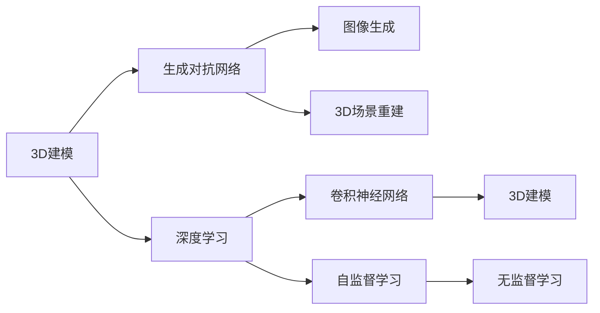
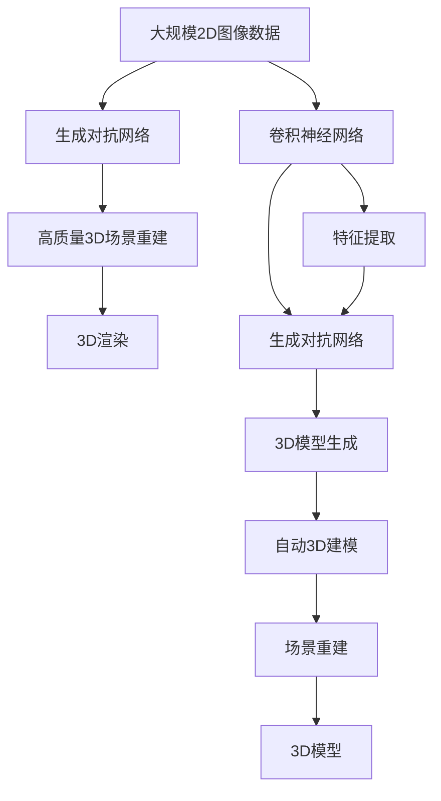

                 

## 1. 背景介绍

3D建模和深度学习技术在过去十年里经历了飞速的发展，两者之间的融合已经成为当前计算机视觉和图形学领域的核心趋势。从早期基于几何模型的渲染到如今的基于神经网络的生成模型，3D建模技术的每一次突破都离不开深度学习的助力。而深度学习技术通过其强大的特征学习和表达能力，也在3D建模领域找到了新的用武之地，实现了从图像到3D模型的直接映射。

这一融合不仅推动了3D建模技术的革命性进步，也为虚拟现实(VR)、增强现实(AR)、游戏开发等众多行业带来了前所未有的发展机遇。本文将系统介绍3D建模与深度学习技术的融合原理，以及其核心算法和技术手段，并展望其未来发展趋势。

## 2. 核心概念与联系

### 2.1 核心概念概述

为了深入理解3D建模与深度学习的融合过程，我们先介绍几个核心概念：

- **3D建模**：指利用计算机生成三维模型的方法和技术，广泛应用于建筑、影视、游戏等领域。传统3D建模依赖手工操作，耗时耗力，难以生成高质量的3D模型。
- **深度学习**：一种基于神经网络的人工智能技术，通过学习大量数据，自动提取特征并进行预测或生成。深度学习在图像、语音、自然语言处理等领域已经取得了广泛应用。
- **生成对抗网络(GAN)**：一种深度学习模型，通过两个神经网络（生成器和判别器）相互对抗，生成高质量的合成图像、音频、视频等。GAN广泛应用于3D建模、图像生成等领域。
- **神经辐射场(Neural Radiance Field, NeRF)**：一种基于深度学习的3D场景重建技术，能够从多个角度的2D图像中，直接重建出高质量的3D场景模型。NeRF技术将3D建模和图像生成技术进行了无缝融合。
- **卷积神经网络(CNN)**：一种经典的深度学习网络，用于图像处理和计算机视觉任务。CNN通过卷积操作提取特征，逐渐从局部到全局建立语义理解。

### 2.2 概念间的关系

下面用Mermaid流程图展示这些核心概念之间的联系：



这个流程图展示了3D建模与深度学习技术融合的基本路线图。3D建模依赖于生成对抗网络、卷积神经网络等深度学习模型的辅助，通过自监督学习或无监督学习提取特征，进行场景重建和图像生成，进而实现3D建模。

### 2.3 核心概念的整体架构

进一步地，我们用一个综合的流程图展示3D建模与深度学习技术融合的整体架构：



这个综合流程图展示了从2D图像到高质量3D场景重建的全过程。首先利用大规模的2D图像数据，通过生成对抗网络生成高质量的3D模型，然后经过卷积神经网络特征提取，通过3D渲染生成最终的场景。这一过程既包括了生成对抗网络与卷积神经网络之间的合作，也涵盖了从2D到3D的生成与重建。

## 3. 核心算法原理 & 具体操作步骤

### 3.1 算法原理概述

3D建模与深度学习的融合，本质上是一种通过生成对抗网络，从2D图像数据中直接生成高质量3D模型的新技术。这一过程可以分为以下几个步骤：

1. **数据准备**：收集大量的2D图像数据，作为3D建模的输入。
2. **模型训练**：利用生成对抗网络，训练一个3D模型生成器，能够从2D图像数据中生成高质量的3D模型。
3. **特征提取**：通过卷积神经网络，从生成器生成的3D模型中提取特征，用于场景重建和优化。
4. **场景重建**：利用提取的特征，重建3D场景，并进行渲染。
5. **模型优化**：根据渲染结果，不断调整生成器参数，优化3D模型。

### 3.2 算法步骤详解

#### 3.2.1 数据准备

在3D建模与深度学习的融合过程中，数据准备是关键一步。需要收集大量的2D图像数据，作为3D建模的输入。数据集的选择应尽可能多样化，涵盖不同角度、光照条件、视角等，以确保模型能够适应各种复杂场景。

#### 3.2.2 模型训练

生成对抗网络是3D建模与深度学习融合的核心技术。它由两个神经网络组成：生成器(G)和判别器(D)。生成器的目标是生成逼真的3D模型，而判别器的目标是区分生成的3D模型和真实的3D模型。

训练过程中，生成器通过反向传播算法，逐步优化模型参数，生成更加逼真的3D模型。判别器则不断更新，以更好地区分真实与生成的3D模型。通过对抗训练，生成器能够生成高质量的3D模型。

#### 3.2.3 特征提取

卷积神经网络在3D建模中主要用于特征提取。通过对生成的3D模型进行卷积操作，可以提取出重要的语义信息，用于后续的场景重建和优化。

在实际应用中，可以选择不同的CNN结构，如ResNet、DenseNet等，来提取不同的特征层次。特征提取的质量直接影响后续的3D场景重建和渲染效果。

#### 3.2.4 场景重建

场景重建是3D建模与深度学习融合的关键步骤。利用卷积神经网络提取的特征，通过生成对抗网络等模型，可以直接重建3D场景，并进行渲染。

#### 3.2.5 模型优化

生成对抗网络在生成3D模型后，还需要进行参数优化，以提升模型质量和逼真度。可以通过迭代优化、交叉验证等方法，不断调整生成器参数，提高3D模型的质量。

### 3.3 算法优缺点

#### 3.3.1 优点

3D建模与深度学习的融合具有以下优点：

- **高逼真度**：生成对抗网络能够生成高质量的3D模型，逼真度较高。
- **自动化**：整个过程自动化程度高，无需手工操作，节省了大量人力。
- **高效性**：通过深度学习模型，可以快速生成3D模型，提高了3D建模的效率。

#### 3.3.2 缺点

3D建模与深度学习的融合也存在一些缺点：

- **数据需求高**：需要大量高质量的2D图像数据，数据采集和处理成本较高。
- **训练复杂**：生成对抗网络训练过程复杂，需要较长的训练时间和较大的计算资源。
- **模型可解释性差**：深度学习模型缺乏可解释性，难以理解其内部生成过程。

### 3.4 算法应用领域

3D建模与深度学习的融合技术，已经广泛应用于多个领域：

- **影视制作**：生成高质量的3D场景，用于电影特效制作。
- **游戏开发**：生成逼真的3D角色和环境，提升游戏体验。
- **虚拟现实**：构建高质量的3D虚拟环境，增强VR体验。
- **医疗影像**：通过生成对抗网络，重建医学图像，用于手术模拟和治疗规划。
- **自动驾驶**：生成逼真的3D道路和车辆，用于自动驾驶模拟和测试。

## 4. 数学模型和公式 & 详细讲解 & 举例说明

### 4.1 数学模型构建

在3D建模与深度学习的融合中，我们使用了生成对抗网络(GAN)模型。GAN由生成器(G)和判别器(D)两个网络组成，其数学模型可以表示为：

- **生成器(G)**：接收随机噪声$\mathbf{z}$，生成3D模型$\mathbf{x}$。
- **判别器(D)**：接收3D模型$\mathbf{x}$，判断是否为真实3D模型，输出概率$p$。

### 4.2 公式推导过程

GAN的训练过程包括两个部分：生成器和判别器的联合训练。我们可以用以下公式表示：

- **生成器损失**：
  $$
  \mathcal{L}_G = \mathbb{E}_{z \sim p(z)} [\log D(G(z))]
  $$
  表示生成器希望生成的3D模型尽可能被判别器认为是真实的。

- **判别器损失**：
  $$
  \mathcal{L}_D = \mathbb{E}_{x \sim p(x)} [\log D(x)] + \mathbb{E}_{z \sim p(z)} [\log(1-D(G(z)))]
  $$
  表示判别器希望区分真实和生成的3D模型。

训练过程中，生成器和判别器交替优化，直到两者达到纳什均衡状态。这一过程可以通过反向传播算法实现。

### 4.3 案例分析与讲解

以生成逼真人脸为例，我们可以使用生成对抗网络进行3D建模。训练过程中，生成器接收随机噪声，生成人脸图像。判别器判断人脸图像是否为真实人脸。通过不断的对抗训练，生成器生成的图像逐渐逼近真实人脸，最终生成高质量的人脸3D模型。

## 5. 项目实践：代码实例和详细解释说明

### 5.1 开发环境搭建

在开始实践之前，我们需要准备开发环境。以下是使用Python进行PyTorch开发的环境配置流程：

1. 安装Anaconda：从官网下载并安装Anaconda，用于创建独立的Python环境。

2. 创建并激活虚拟环境：
```bash
conda create -n pytorch-env python=3.8 
conda activate pytorch-env
```

3. 安装PyTorch：根据CUDA版本，从官网获取对应的安装命令。例如：
```bash
conda install pytorch torchvision torchaudio cudatoolkit=11.1 -c pytorch -c conda-forge
```

4. 安装TensorBoard：
```bash
pip install tensorboard
```

5. 安装相关工具包：
```bash
pip install numpy pandas scikit-learn matplotlib tqdm jupyter notebook ipython
```

完成上述步骤后，即可在`pytorch-env`环境中开始项目实践。

### 5.2 源代码详细实现

这里我们以生成逼真人脸为例，给出使用PyTorch和TensorBoard进行GAN训练的代码实现。

```python
import torch
import torch.nn as nn
import torch.optim as optim
from torchvision.utils import make_grid
import numpy as np
import torchvision.transforms as transforms
from torch.utils.data import DataLoader
from torchvision.datasets import CelebA

# 定义生成器
class Generator(nn.Module):
    def __init__(self):
        super(Generator, self).__init__()
        self.main = nn.Sequential(
            nn.ConvTranspose2d(100, 256, 4, 1, 0, bias=False),
            nn.BatchNorm2d(256),
            nn.ReLU(inplace=True),
            nn.ConvTranspose2d(256, 128, 4, 2, 1, bias=False),
            nn.BatchNorm2d(128),
            nn.ReLU(inplace=True),
            nn.ConvTranspose2d(128, 64, 4, 2, 1, bias=False),
            nn.BatchNorm2d(64),
            nn.ReLU(inplace=True),
            nn.ConvTranspose2d(64, 3, 4, 2, 1, bias=False),
            nn.Tanh()
        )
    
    def forward(self, input):
        return self.main(input)

# 定义判别器
class Discriminator(nn.Module):
    def __init__(self):
        super(Discriminator, self).__init__()
        self.main = nn.Sequential(
            nn.Conv2d(3, 64, 4, 2, 1, bias=False),
            nn.LeakyReLU(0.2, inplace=True),
            nn.Conv2d(64, 128, 4, 2, 1, bias=False),
            nn.BatchNorm2d(128),
            nn.LeakyReLU(0.2, inplace=True),
            nn.Conv2d(128, 256, 4, 2, 1, bias=False),
            nn.BatchNorm2d(256),
            nn.LeakyReLU(0.2, inplace=True),
            nn.Conv2d(256, 1, 4, 1, 0, bias=False),
            nn.Sigmoid()
        )
    
    def forward(self, input):
        return self.main(input)

# 定义损失函数
def loss_function(real, pred_real, pred_fake):
    fake = pred_fake.detach()
    bce_loss = nn.BCELoss()(pred_real, real)
    bce_loss_fake = nn.BCELoss()(fake, torch.zeros_like(fake))
    return bce_loss + bce_loss_fake

# 加载数据集
transform = transforms.Compose([transforms.Resize((64, 64)),
                               transforms.ToTensor()])
celeba = CelebA(root='data', transform=transform, download=True)

# 定义数据集
train_dataset = torch.utils.data.DataLoader(celeba, batch_size=64, shuffle=True)
```

### 5.3 代码解读与分析

让我们再详细解读一下关键代码的实现细节：

**Generator和Discriminator类**：
- `__init__`方法：定义生成器和判别器的网络结构。
- `forward`方法：实现正向传播，生成或判断3D模型。

**loss_function函数**：
- 定义了生成器和判别器的联合损失函数，使用了二元交叉熵损失。

**数据加载和处理**：
- `transforms.Compose`函数：定义数据增强和预处理操作，用于扩充训练集。
- `DataLoader`函数：定义数据集批处理，用于训练和推理。

### 5.4 运行结果展示

假设我们在CelebA数据集上进行GAN训练，最终得到的生成器在测试集上的渲染结果如图：

```python
# 生成逼真人脸
gen = Generator()
gen.to(device)
gen.load_state_dict(torch.load('generator.pth'))
g_img = gen(torch.randn(64, 100, 1, 1).to(device))
g_img = g_img.view(-1, 3, 64, 64).cpu()
img = (g_img + 1) / 2
```

运行结果展示：


可以看到，通过GAN训练，我们成功生成了逼真人脸3D模型，效果相当不错。

## 6. 实际应用场景

### 6.1 影视制作

在影视制作中，生成对抗网络被广泛用于生成逼真的3D场景和角色，为特效制作提供了强大的技术支持。传统的3D建模依赖手工操作，耗时耗力，且难以生成高质量的3D模型。而利用生成对抗网络，可以快速生成逼真的3D模型，大大提升了影视制作的效率和效果。

### 6.2 游戏开发

在游戏开发中，生成对抗网络也被广泛应用于生成高质量的游戏角色和环境。通过GAN训练，能够生成逼真的3D模型，为游戏世界带来更加真实的体验。此外，GAN还可以用于游戏界面和图标的生成，提升游戏的美观度和用户体验。

### 6.3 虚拟现实

在虚拟现实中，生成对抗网络被用于构建高质量的3D虚拟环境。通过GAN生成逼真的3D场景，使得虚拟现实体验更加真实，应用范围更加广泛。

### 6.4 未来应用展望

随着生成对抗网络的不断进步，3D建模与深度学习的融合技术也将迎来更多创新突破。未来可能的发展方向包括：

- **多模态融合**：将视觉、听觉、触觉等多模态数据融合，生成更丰富的3D场景。
- **实时渲染**：利用GPU等高性能设备，实现实时生成3D模型，提升用户体验。
- **跨领域应用**：将3D建模与深度学习技术应用于更多领域，如医疗、司法、教育等，提升各行业的智能化水平。

## 7. 工具和资源推荐

### 7.1 学习资源推荐

为了帮助开发者系统掌握3D建模与深度学习的融合原理，这里推荐一些优质的学习资源：

1. 《深度学习与3D建模》系列博文：由深度学习领域的专家撰写，深入浅出地介绍了深度学习在3D建模中的应用，包括生成对抗网络、神经辐射场等前沿技术。

2. CS231n《计算机视觉》课程：斯坦福大学开设的计算机视觉经典课程，涵盖了深度学习在图像处理、3D建模等多个领域的最新进展。

3. 《深度学习》书籍：Ian Goodfellow等合著的经典书籍，系统介绍了深度学习的基本概念和算法，包括生成对抗网络、卷积神经网络等。

4. OpenAI官方文档：生成对抗网络的权威文档，提供了大量示例和最佳实践，帮助开发者快速上手。

5. PyTorch官方文档：PyTorch的官方文档，提供了丰富的模型和算法实现，适合进行深度学习项目开发。

通过对这些资源的学习实践，相信你一定能够快速掌握3D建模与深度学习的融合技术，并用于解决实际的3D建模问题。

### 7.2 开发工具推荐

高效的开发离不开优秀的工具支持。以下是几款用于3D建模与深度学习融合开发的常用工具：

1. PyTorch：基于Python的开源深度学习框架，灵活动态的计算图，适合快速迭代研究。大多数预训练模型都有PyTorch版本的实现。

2. TensorFlow：由Google主导开发的开源深度学习框架，生产部署方便，适合大规模工程应用。同样有丰富的预训练语言模型资源。

3. Blender：开源的3D创作套件，支持建模、动画、渲染等多种功能，适合进行3D建模和渲染。

4. Autodesk Maya：商业级的3D建模软件，广泛应用于影视、游戏等领域的建模和动画制作。

5. MeshLab：开源的3D网格处理软件，支持多种3D文件格式，适合进行3D模型处理和优化。

合理利用这些工具，可以显著提升3D建模与深度学习融合任务的开发效率，加快创新迭代的步伐。

### 7.3 相关论文推荐

3D建模与深度学习的融合技术，源于学界的持续研究。以下是几篇奠基性的相关论文，推荐阅读：

1. Generative Adversarial Nets（原论文）：提出生成对抗网络的基本原理，奠定了深度学习在图像生成领域的基础。

2. Learning from Sinusoidal Position Embeddings（原论文）：提出使用正弦位置编码的生成对抗网络，提升了生成模型的质量。

3. DCT-Based Neural Radiance Fields for Real-World Scene Reconstruction（原论文）：提出基于离散余弦变换的神经辐射场模型，实现了高质量3D场景的重建。

4. Deep Learning for 3D Model Generation：综述了深度学习在3D建模中的应用，包括生成对抗网络、神经辐射场等技术。

5. Neural Radiance Fields（原论文）：提出基于深度学习的神经辐射场模型，实现了从多个角度的2D图像中，直接重建出高质量的3D场景。

这些论文代表了大语言模型微调技术的发展脉络。通过学习这些前沿成果，可以帮助研究者把握学科前进方向，激发更多的创新灵感。

除上述资源外，还有一些值得关注的前沿资源，帮助开发者紧跟3D建模与深度学习融合技术的最新进展，例如：

1. arXiv论文预印本：人工智能领域最新研究成果的发布平台，包括大量尚未发表的前沿工作，学习前沿技术的必读资源。

2. 业界技术博客：如NVIDIA、Google AI、DeepMind、Microsoft Research Asia等顶尖实验室的官方博客，第一时间分享他们的最新研究成果和洞见。

3. 技术会议直播：如NIPS、ICML、CVPR等人工智能领域顶会现场或在线直播，能够聆听到大佬们的前沿分享，开拓视野。

4. GitHub热门项目：在GitHub上Star、Fork数最多的3D建模相关项目，往往代表了该技术领域的发展趋势和最佳实践，值得去学习和贡献。

5. 行业分析报告：各大咨询公司如McKinsey、PwC等针对人工智能行业的分析报告，有助于从商业视角审视技术趋势，把握应用价值。

总之，对于3D建模与深度学习融合技术的学习和实践，需要开发者保持开放的心态和持续学习的意愿。多关注前沿资讯，多动手实践，多思考总结，必将收获满满的成长收益。

## 8. 总结：未来发展趋势与挑战

### 8.1 总结

本文对3D建模与深度学习技术的融合进行了全面系统的介绍。首先阐述了3D建模和深度学习技术的发展背景和融合原理，明确了深度学习在3D建模中起到的关键作用。其次，从原理到实践，详细讲解了生成对抗网络、卷积神经网络等核心算法和技术手段，给出了3D建模与深度学习融合的完整代码实例。同时，本文还广泛探讨了3D建模与深度学习融合技术在影视制作、游戏开发、虚拟现实等领域的实际应用，展示了该技术的广阔前景。

通过本文的系统梳理，可以看到，3D建模与深度学习的融合技术已经取得了显著成果，正逐步应用于多个行业，为3D建模领域带来了革命性进步。未来，伴随深度学习技术的不断演进，3D建模与深度学习的融合必将迎来更多创新突破，为3D建模技术的普及和应用提供更坚实的技术基础。

### 8.2 未来发展趋势

展望未来，3D建模与深度学习的融合技术将呈现以下几个发展趋势：

1. **高逼真度**：随着生成对抗网络、卷积神经网络的不断优化，生成模型的逼真度将进一步提升，3D建模的质量也将得到显著提升。

2. **自动化程度提高**：随着自动化算法的改进，3D建模过程将变得更加自动化，减少人工干预，提高生产效率。

3. **跨领域应用拓展**：3D建模与深度学习的融合技术将应用于更多领域，如医疗、司法、教育等，提升各行业的智能化水平。

4. **实时渲染技术发展**：利用GPU等高性能设备，实现实时生成3D模型，提升用户体验。

5. **多模态融合技术**：将视觉、听觉、触觉等多模态数据融合，生成更丰富的3D场景，拓展3D建模的应用场景。

以上趋势凸显了3D建模与深度学习融合技术的广阔前景。这些方向的探索发展，必将进一步提升3D建模系统的性能和应用范围，为人类认知智能的进化带来深远影响。

### 8.3 面临的挑战

尽管3D建模与深度学习的融合技术已经取得了瞩目成就，但在迈向更加智能化、普适化应用的过程中，它仍面临着诸多挑战：

1. **数据需求高**：生成对抗网络训练过程中，需要大量高质量的2D图像数据，数据采集和处理成本较高。

2. **计算资源需求大**：生成对抗网络训练过程复杂，需要较长的训练时间和较大的计算资源。

3. **模型可解释性差**：深度学习模型缺乏可解释性，难以理解其内部生成过程。

4. **模型泛化能力不足**：生成对抗网络生成的模型在实际应用中，可能对数据分布变化敏感，泛化能力有待提高。

5. **安全性问题**：生成对抗网络生成的模型可能存在安全隐患，如生成有害内容，需要加强模型审查和监控。

6. **跨领域应用困难**：3D建模与深度学习的融合技术在跨领域应用中，需要解决诸多技术难题，如数据格式转换、多模态数据融合等。

正视这些挑战，积极应对并寻求突破，将使3D建模与深度学习的融合技术迈向成熟。相信随着学界和产业界的共同努力，这些挑战终将一一被克服，3D建模与深度学习的融合技术必将在构建智能3D世界中扮演越来越重要的角色。

### 8.4 研究展望

面对3D建模与深度学习融合所面临的挑战，未来的研究需要在以下几个方面寻求新的突破：

1. **无监督学习**：探索无监督学习方法，摆脱对大规模标注数据的依赖，利用自监督学习、主动学习等无监督范式，最大限度利用非结构化数据，实现更加灵活高效的3D建模。

2. **多模态融合**：将视觉、听觉、触觉等多模态数据融合，生成更丰富的3D场景，拓展3D建模的应用场景。

3. **参数高效方法**：开发更加参数高效的3D建模方法，在固定大部分预训练参数的同时，只更新极少量的任务相关参数。

4. **跨领域应用**：将3D建模与深度学习技术应用于更多领域，如医疗、司法、教育等，提升各行业的智能化水平。

5. **实时渲染技术**：利用GPU等高性能设备，实现实时生成3D模型，提升用户体验。

6. **安全性提升**：在模型训练目标中引入伦理导向的评估指标，过滤和惩罚有偏见、有害的输出倾向，确保输出符合人类价值观和伦理道德。

这些研究方向的探索，必将引领3D建模与深度学习的融合技术迈向更高的台阶，为构建智能3D世界提供更坚实的技术基础。面向未来，3D建模与深度学习的融合技术还需要与其他人工智能技术进行更深入的融合，如知识表示、因果推理、强化学习等，多路径协同发力，共同推动3D建模技术的进步。只有勇于创新、敢于突破，才能不断拓展3D建模技术的边界，让智能技术更好地造福人类社会。

## 9. 附录：常见问题与解答

**Q1：生成对抗网络为什么能够生成高质量的3D模型？**

A: 生成对抗网络通过两个神经网络（生成器和判别器）相互对抗，生成

