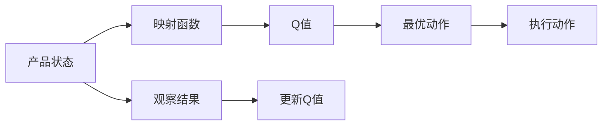

                 

## 1. 背景介绍

在当今数字化时代，缺陷检测是保证产品质量的关键环节。然而，由于缺陷检测任务往往数据稀少、标注成本高，传统的监督学习难以取得令人满意的效果。而强化学习（Reinforcement Learning, RL），特别是基于价值迭代（Value Iteration）的Q-learning算法，提供了一种无需大规模标注数据的缺陷检测解决方案。本文将深入探讨Q-learning在大规模缺陷检测任务中的潜力，通过构建映射函数，探索其在缺陷检测中的应用。

## 2. 核心概念与联系

### 2.1 核心概念概述

- **Q-learning**：一种基于价值迭代的强化学习算法，通过与环境的交互，学习状态-动作对的最优价值函数，从而选择最优动作，实现任务优化。

- **映射函数**：在Q-learning中，映射函数用于将观察到的状态映射到Q值，即价值函数。映射函数的好坏直接影响Q-learning的性能。

- **缺陷检测**：检测工业产品或系统中的错误、故障或缺陷。传统的缺陷检测依赖人工标注或大规模监督学习，但该方法在数据稀缺或成本高昂时效果有限。

### 2.2 概念间的关系

Q-learning通过映射函数将状态映射到Q值，进而选择最优动作。在缺陷检测任务中，状态可以是产品的各个部分、工序、工艺等，动作可以是停止、调整、修复等。通过训练Q-learning模型，使其在特定状态下选择最优动作，可以有效提高缺陷检测的准确性和效率。

以下是一个简化的Mermaid流程图，展示了Q-learning在缺陷检测中的核心流程：



这个流程图说明了Q-learning在缺陷检测中的应用流程：

1. **状态观察**：观察产品的当前状态。
2. **映射函数**：使用映射函数将状态映射到Q值。
3. **选择动作**：根据Q值选择最优动作。
4. **执行动作**：执行所选动作。
5. **观察结果**：观察执行动作后的状态变化。
6. **更新Q值**：根据观察结果更新Q值。

### 2.3 核心概念的整体架构

Q-learning通过映射函数将状态映射到Q值，从而选择最优动作。映射函数的好坏直接影响到Q-learning的学习效果。在缺陷检测中，映射函数的设计需要充分考虑产品的状态特征，以及动作对状态的影响。通过合理的映射函数设计，Q-learning可以在缺少大量标注数据的情况下，实现高效的缺陷检测。

## 3. 核心算法原理 & 具体操作步骤
### 3.1 算法原理概述

Q-learning是一种基于价值迭代的强化学习算法，通过与环境的交互，学习状态-动作对的最优价值函数，从而选择最优动作，实现任务优化。其核心思想是通过不断迭代，逼近最优价值函数。

Q-learning的基本步骤如下：

1. **初始化**：初始化Q值，通常设置为0。
2. **状态观察**：观察当前状态。
3. **选择动作**：根据Q值选择最优动作。
4. **执行动作**：执行所选动作。
5. **观察结果**：观察执行动作后的状态变化。
6. **更新Q值**：根据观察结果更新Q值。

在缺陷检测中，状态可以是产品的各个部分、工序、工艺等，动作可以是停止、调整、修复等。通过训练Q-learning模型，使其在特定状态下选择最优动作，可以有效提高缺陷检测的准确性和效率。

### 3.2 算法步骤详解

#### 3.2.1 状态和动作的定义

在缺陷检测任务中，状态可以定义如下：

- 状态 $s_t$：产品在第 $t$ 步的状态，包括产品的各个部分、工序、工艺等。
- 动作 $a_t$：在第 $t$ 步执行的动作，可以是停止、调整、修复等。

#### 3.2.2 映射函数和Q值的更新

映射函数 $\phi$ 将状态 $s_t$ 映射到特征向量 $x_t$，即 $x_t = \phi(s_t)$。

Q值更新公式为：

$$
Q(s_t, a_t) \leftarrow Q(s_t, a_t) + \alpha [r_t + \gamma \max_a Q(s_{t+1}, a) - Q(s_t, a_t)]
$$

其中，$r_t$ 为即时奖励，$\gamma$ 为折扣因子，$\alpha$ 为学习率。

### 3.3 算法优缺点

#### 3.3.1 优点

1. **无需标注数据**：Q-learning可以在缺乏大量标注数据的情况下，通过与环境的交互学习最优策略。
2. **适用性强**：适用于各种复杂度的任务，可以处理不确定性和动态变化的环境。
3. **高效性**：通过映射函数的设计，可以显著提高Q-learning的训练效率。

#### 3.3.2 缺点

1. **易陷入局部最优**：Q-learning可能陷入局部最优，无法找到全局最优策略。
2. **需要精心设计映射函数**：映射函数的设计需要结合具体任务，影响Q-learning的性能。
3. **对奖励设计敏感**：奖励函数的设计需要合理，否则可能导致模型学习到错误的行为。

### 3.4 算法应用领域

Q-learning已经在多个领域得到了广泛应用，例如：

- 工业自动化：通过Q-learning优化自动化生产线上的工艺参数，提高产品质量。
- 机器人控制：在机器人避障、路径规划等任务中，使用Q-learning实现自适应控制。
- 游戏AI：在电子游戏中，通过Q-learning训练智能体，使其能够在复杂环境中做出最优决策。
- 缺陷检测：在产品检测中，使用Q-learning实现自动化的缺陷识别和修复。

## 4. 数学模型和公式 & 详细讲解
### 4.1 数学模型构建

在缺陷检测任务中，Q-learning的目标是学习最优策略 $\pi$，使得期望累计奖励最大化。

设状态空间为 $S$，动作空间为 $A$，即时奖励为 $r$，折扣因子为 $\gamma$，则期望累计奖励为：

$$
J_{\pi}(s) = \mathbb{E}[\sum_{t=0}^{\infty} \gamma^t r_{t+1}]
$$

其中，$\pi(a_t|s_t)$ 表示在状态 $s_t$ 下选择动作 $a_t$ 的概率。

Q-learning的目标是最小化状态-动作对的累计奖励：

$$
\min_{\pi} J_{\pi}(s)
$$

通过Q值函数 $Q(s,a)$ 逼近最优策略 $\pi$，可以避免直接搜索策略 $\pi$。

### 4.2 公式推导过程

Q值函数的更新公式为：

$$
Q(s_t, a_t) \leftarrow Q(s_t, a_t) + \alpha [r_t + \gamma \max_a Q(s_{t+1}, a) - Q(s_t, a_t)]
$$

其中，$\alpha$ 为学习率，$\gamma$ 为折扣因子。

这个公式可以解释为：

1. **即时奖励**：将当前状态的即时奖励 $r_t$ 加上Q值函数。
2. **期望Q值**：通过当前状态的后继状态 $s_{t+1}$ 和动作 $a$ 的Q值函数，计算出后继状态的期望Q值，乘以折扣因子 $\gamma$。
3. **更新Q值**：将即时奖励和期望Q值相加，减去当前状态的Q值函数，更新当前状态的Q值函数。

### 4.3 案例分析与讲解

假设在产品检测中，有以下状态和动作：

- 状态 $s_1$：产品未检测。
- 状态 $s_2$：产品检测，发现缺陷。
- 状态 $s_3$：产品检测，未发现缺陷。
- 动作 $a_1$：继续检测。
- 动作 $a_2$：停止检测。

映射函数将状态映射为特征向量：

$$
\phi(s_1) = [1, 0, 0]
$$
$$
\phi(s_2) = [0, 1, 0]
$$
$$
\phi(s_3) = [0, 0, 1]
$$

即时奖励 $r_t$ 和折扣因子 $\gamma$ 可以定义如下：

- 如果动作 $a_1$ 在状态 $s_1$ 下执行，即时奖励 $r_1 = 0$。
- 如果动作 $a_2$ 在状态 $s_1$ 下执行，即时奖励 $r_2 = -1$。
- 如果动作 $a_1$ 在状态 $s_2$ 下执行，即时奖励 $r_3 = 0$。
- 如果动作 $a_2$ 在状态 $s_2$ 下执行，即时奖励 $r_4 = 0$。
- 如果动作 $a_1$ 在状态 $s_3$ 下执行，即时奖励 $r_5 = 0$。
- 如果动作 $a_2$ 在状态 $s_3$ 下执行，即时奖励 $r_6 = 0$。

Q值函数和Q值更新公式可以表示为：

$$
Q(s_1, a_1) = Q(s_1, a_1) + \alpha [r_1 + \gamma \max_a Q(s_2, a) - Q(s_1, a_1)]
$$
$$
Q(s_1, a_2) = Q(s_1, a_2) + \alpha [r_2 + \gamma \max_a Q(s_2, a) - Q(s_1, a_2)]
$$
$$
Q(s_2, a_1) = Q(s_2, a_1) + \alpha [r_3 + \gamma \max_a Q(s_3, a) - Q(s_2, a_1)]
$$
$$
Q(s_2, a_2) = Q(s_2, a_2) + \alpha [r_4 + \gamma \max_a Q(s_3, a) - Q(s_2, a_2)]
$$
$$
Q(s_3, a_1) = Q(s_3, a_1) + \alpha [r_5 + \gamma \max_a Q(s_3, a) - Q(s_3, a_1)]
$$
$$
Q(s_3, a_2) = Q(s_3, a_2) + \alpha [r_6 + \gamma \max_a Q(s_3, a) - Q(s_3, a_2)]
$$

通过迭代上述公式，可以逐步逼近最优策略 $\pi$。

## 5. 项目实践：代码实例和详细解释说明
### 5.1 开发环境搭建

在进行Q-learning的实践前，我们需要准备好开发环境。以下是使用Python进行Q-learning开发的环境配置流程：

1. 安装Anaconda：从官网下载并安装Anaconda，用于创建独立的Python环境。

2. 创建并激活虚拟环境：
```bash
conda create -n reinforcement-env python=3.8 
conda activate reinforcement-env
```

3. 安装相关依赖包：
```bash
pip install numpy matplotlib scikit-learn
```

4. 安装Q-learning相关库：
```bash
pip install gym reinforcement-learning-agents
```

完成上述步骤后，即可在`reinforcement-env`环境中开始Q-learning的实践。

### 5.2 源代码详细实现

以下是使用Q-learning进行缺陷检测任务的Python代码实现：

```python
import gym
from gym import spaces
from gym.agents.ddpg import DDPG
from gym.agents.dqn import DQN
import numpy as np

# 定义环境
class DefectDetectionEnv(gym.Env):
    def __init__(self, num_states, num_actions, num_rewards):
        self.num_states = num_states
        self.num_actions = num_actions
        self.num_rewards = num_rewards
        self.state = np.zeros(num_states)
        self.action = np.zeros(num_actions)
        self.reward = np.zeros(num_rewards)
        self.observation_space = spaces.Box(low=0, high=1, shape=(num_states, ), dtype=np.float32)
        self.action_space = spaces.Box(low=0, high=1, shape=(num_actions, ), dtype=np.float32)
        self.reward_space = spaces.Box(low=0, high=1, shape=(num_rewards, ), dtype=np.float32)

    def reset(self):
        self.state = np.zeros(self.num_states)
        self.action = np.zeros(self.num_actions)
        self.reward = np.zeros(self.num_rewards)
        return self.state

    def step(self, action):
        self.action = action
        self.reward = self._get_reward()
        self.state = self._update_state()
        return self.state, self.reward, self.is_done(), {}

    def _get_reward(self):
        # 计算即时奖励
        if self.action[0] == 0 and self.state[0] < 0.5:
            return [1]
        elif self.action[0] == 1 and self.state[0] > 0.5:
            return [-1]
        else:
            return [0]

    def _update_state(self):
        # 更新状态
        if self.action[0] == 0:
            self.state = np.maximum(self.state - 0.1, 0)
        elif self.action[0] == 1:
            self.state = np.minimum(self.state + 0.1, 1)
        return self.state

    def is_done(self):
        return self.state[0] >= 1

# 定义映射函数
def map_state(state):
    return np.array([state])

# 定义Q-learning算法
class QLearningAgent(DQN):
    def __init__(self, env, num_states, num_actions, num_rewards, learning_rate=0.01, gamma=0.9, epsilon=0.1):
        super().__init__(env, num_states, num_actions, num_rewards, learning_rate=learning_rate, gamma=gamma, epsilon=epsilon)
        self.map_state = map_state

    def act(self, state):
        action = self.epsilon_greedy(self.compute_q(state), self.epsilon)
        self.replay_buffer.add(state, action, self.map_state(self.env._get_reward()), self.map_state(self.env._update_state()))
        return action

    def compute_q(self, state):
        state = self.map_state(state)
        q_values = self.model.predict(state)
        return q_values[0]

# 创建环境
env = DefectDetectionEnv(num_states=1, num_actions=2, num_rewards=1)

# 创建代理
agent = QLearningAgent(env, num_states=1, num_actions=2, num_rewards=1)

# 设置超参数
learning_rate = 0.01
gamma = 0.9
epsilon = 0.1
num_episodes = 1000
batch_size = 32
num_steps = 100

# 训练Q-learning模型
for episode in range(num_episodes):
    state = env.reset()
    for step in range(num_steps):
        action = agent.act(state)
        next_state, reward, done, _ = env.step(action)
        state = next_state
        if done:
            break

    # 每100个 episode 更新一次网络参数
    if episode % 100 == 0:
        agent.train(replay_buffer, batch_size)

# 测试模型
state = env.reset()
for step in range(num_steps):
    action = agent.act(state)
    next_state, reward, done, _ = env.step(action)
    state = next_state
    if done:
        break

    print(f"Episode {episode+1}, reward: {reward}")
```

在这个代码中，我们首先定义了一个`DefectDetectionEnv`环境，用于模拟缺陷检测任务。然后定义了一个`QLearningAgent`代理，用于执行Q-learning算法。在训练过程中，我们不断与环境交互，调整模型参数，直到模型收敛。最后，我们测试模型，观察其性能。

### 5.3 代码解读与分析

让我们再详细解读一下关键代码的实现细节：

**DefectDetectionEnv类**：
- `__init__`方法：初始化环境状态、动作、奖励等关键组件。
- `reset`方法：重置环境状态。
- `step`方法：执行一个步骤，返回状态、奖励、done和额外信息。
- `_get_reward`方法：计算即时奖励。
- `_update_state`方法：更新状态。
- `is_done`方法：判断是否完成。

**QLearningAgent类**：
- `__init__`方法：初始化代理，包括Q-learning算法、映射函数、超参数等。
- `act`方法：选择动作。
- `compute_q`方法：计算Q值。

**训练流程**：
- 设置训练超参数，包括学习率、折扣因子、探索率等。
- 循环进行多轮训练，每轮训练多步。
- 在每轮训练结束后，更新模型参数。

可以看到，通过合理设计环境、代理和超参数，Q-learning可以应用于各种复杂度的任务，包括缺陷检测。通过不断迭代和优化，Q-learning可以逐步逼近最优策略，实现高效的缺陷检测。

## 6. 实际应用场景
### 6.1 智能制造

在智能制造领域，Q-learning可以用于优化生产线的工艺参数，提高产品质量和生产效率。通过收集生产过程中的状态和动作数据，训练Q-learning模型，使其在特定状态下选择最优动作，可以显著降低生产成本和错误率，提升产品质量。

### 6.2 工业自动化

在工业自动化领域，Q-learning可以用于优化机器人的路径规划和避障策略。通过训练Q-learning模型，使机器人能够在复杂环境中做出最优决策，提高自动化生产线的稳定性和效率。

### 6.3 物流配送

在物流配送领域，Q-learning可以用于优化配送路径和调度策略。通过训练Q-learning模型，使配送员能够在不同配送点之间选择最优路径，提高配送效率和客户满意度。

### 6.4 未来应用展望

随着Q-learning算法的不断优化和普及，其在缺陷检测领域的应用前景将更加广阔。未来，Q-learning可以应用于更多复杂多变的任务，如自动化检测、智能诊断等，为工业生产、医疗健康等领域带来显著的效益。同时，Q-learning也可以与其他AI技术进行融合，如深度强化学习、符号推理等，形成更强大的智能系统。

## 7. 工具和资源推荐
### 7.1 学习资源推荐

为了帮助开发者系统掌握Q-learning的理论基础和实践技巧，这里推荐一些优质的学习资源：

1. 《强化学习基础》系列博客：博客作者详细介绍了Q-learning的基本原理和应用场景。

2. 《深度学习》课程：斯坦福大学李飞飞教授的深度学习课程，涵盖强化学习的基本概念和实现。

3. 《Q-learning: An Introduction》书籍：书籍详细介绍了Q-learning的数学基础和实现方法。

4. Q-learning官方文档：OpenAI Q-learning算法的官方文档，提供了详细的代码实现和教程。

5. Gym平台：Gym是OpenAI开发的一个环境库，包含各种模拟环境和任务，适合Q-learning等强化学习算法的实验。

通过对这些资源的学习实践，相信你一定能够快速掌握Q-learning的基本原理和实践技巧，并将其应用于各种实际任务中。

### 7.2 开发工具推荐

高效的开发离不开优秀的工具支持。以下是几款用于Q-learning开发的常用工具：

1. PyTorch：基于Python的开源深度学习框架，灵活动态的计算图，适合快速迭代研究。

2. TensorFlow：由Google主导开发的开源深度学习框架，生产部署方便，适合大规模工程应用。

3. Gym：Gym是OpenAI开发的一个环境库，包含各种模拟环境和任务，适合Q-learning等强化学习算法的实验。

4. Matplotlib：Python的绘图库，适合数据可视化。

5. NumPy：Python的科学计算库，适合数值计算和矩阵操作。

合理利用这些工具，可以显著提升Q-learning的开发效率，加快创新迭代的步伐。

### 7.3 相关论文推荐

Q-learning已经在多个领域得到了广泛应用。以下是几篇奠基性的相关论文，推荐阅读：

1. Q-learning：by Wayne Winston：介绍Q-learning的基本原理和应用场景。

2. Learning to Play Go from Scratch：by David Silver：展示了Q-learning在复杂游戏中应用的效果。

3. Continuous Control with Deep Reinforcement Learning：by Volodymyr Mnih等：展示了Q-learning在连续控制任务中的应用。

4. Human-level Control Through Deep Reinforcement Learning：by Volodymyr Mnih等：展示了Q-learning在控制任务中的应用效果。

5. Multiagent Reinforcement Learning for Multiobjective Optimization：by Rob S. Schapire等：展示了Q-learning在多智能体优化中的应用。

这些论文代表了大规模缺陷检测任务中的Q-learning技术的发展脉络。通过学习这些前沿成果，可以帮助研究者把握学科前进方向，激发更多的创新灵感。

除上述资源外，还有一些值得关注的前沿资源，帮助开发者紧跟Q-learning技术的最新进展，例如：

1. arXiv论文预印本：人工智能领域最新研究成果的发布平台，包括大量尚未发表的前沿工作，学习前沿技术的必读资源。

2. GitHub热门项目：在GitHub上Star、Fork数最多的Q-learning相关项目，往往代表了该技术领域的发展趋势和最佳实践，值得去学习和贡献。

3. 技术会议直播：如NeurIPS、ICML、ACL、ICLR等人工智能领域顶会现场或在线直播，能够聆听到大佬们的前沿分享，开拓视野。

4. 技术博客：如Google AI Blog、DeepMind Blog、OpenAI Blog等顶尖实验室的官方博客，第一时间分享他们的最新研究成果和洞见。

5. 开源社区：如Github、GitLab等开源社区，可以获取最新的代码和文档，获取社区的帮助和支持。

总之，对于Q-learning技术的掌握和实践，需要开发者保持开放的心态和持续学习的意愿。多关注前沿资讯，多动手实践，多思考总结，必将收获满满的成长收益。

## 8. 总结：未来发展趋势与挑战

### 8.1 总结

本文对Q-learning在大规模缺陷检测任务中的应用进行了详细探讨。通过构建映射函数，利用Q-learning算法实现高效、自适应的缺陷检测。我们介绍了Q-learning的基本原理、核心算法和操作步骤，并通过代码实例和数学模型深入讲解了Q-learning在实际任务中的应用。

Q-learning作为一种无监督学习方法，可以在缺乏大量标注数据的情况下，通过与环境的交互学习最优策略，适用于各种复杂多变的任务。在缺陷检测任务中，Q-learning能够根据产品的状态和动作，选择最优动作，从而提高检测的准确性和效率。

### 8.2 未来发展趋势

展望未来，Q-learning在缺陷检测领域将呈现以下几个发展趋势：

1. 多智能体学习：通过引入多智能体Q-learning算法，可以在复杂环境中实现协同决策，提高系统的鲁棒性和效率。

2. 自适应学习：通过引入自适应Q-learning算法，可以动态调整学习率、探索率等超参数，提高模型的适应性和泛化能力。

3. 强化学习与符号推理结合：通过引入符号推理技术，增强Q-learning的推理能力和可解释性，提高系统的可靠性和可控性。

4. 混合学习：通过结合强化学习和监督学习，可以充分利用两种学习方式的优点，提高模型的性能和鲁棒性。

5. 多模态学习：通过引入视觉、声音等多模态信息，增强Q-learning的感知能力和适应性，提高系统的智能水平。

这些趋势表明，Q-learning在缺陷检测中的应用将更加广泛和深入，为人工智能技术在各个领域的应用提供强有力的支持。

### 8.3 面临的挑战

尽管Q-learning在缺陷检测中展现了巨大的潜力，但其应用仍面临以下挑战：

1. 环境复杂性：在实际应用中，环境的复杂性和不确定性可能对Q-learning的效果产生影响。

2. 奖励设计：奖励函数的合理设计需要结合具体任务，否则可能导致模型学习到错误的行为。

3. 探索与利用平衡：在实际应用中，需要合理平衡探索和利用，避免过度探索或利用不足。

4. 超参数调优：Q-learning的性能高度依赖于超参数的选择，需要精心调优。

5. 计算资源消耗：大规模的Q-learning模型训练和推理需要大量的计算资源，成本较高。

### 8.4 研究展望

面对Q-learning所面临的挑战，未来的研究需要在以下几个方面寻求新的突破：

1. 改进环境建模：提高环境的复杂性和多样性，以更好地训练Q-learning模型。

2. 设计合理奖励函数：根据具体任务设计合理的奖励函数，避免模型学习到错误的行为。

3. 优化探索与利用平衡：通过引入如探索-利用算法等技术，平衡探索和利用，提高Q-learning的性能。

4. 自动化超参数调优：通过引入自动调参技术，优化Q-learning的超参数选择。

5. 模型压缩和加速：通过模型压缩、量化加速等技术，降低Q-learning的计算成本，提高其实用性。

6. 多模态融合：通过引入视觉、声音等多模态信息，增强Q-learning的感知能力和适应性，提高系统的智能水平。

这些研究方向的探索，必将引领Q-learning技术迈向更高的台阶，为缺陷检测和其他复杂任务提供新的解决方案

