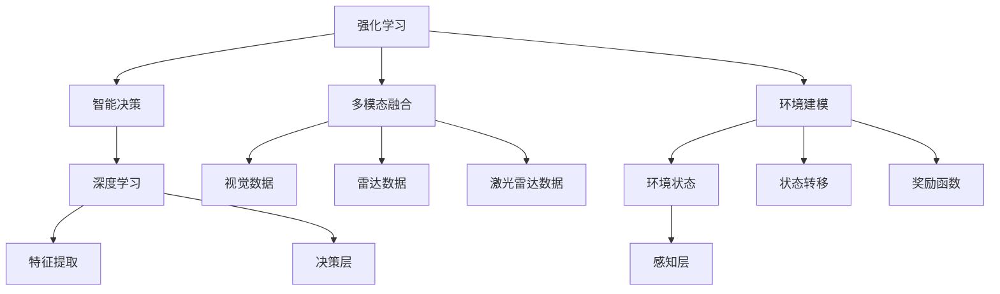
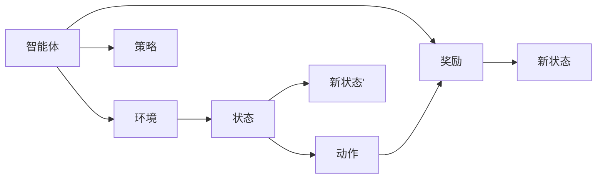
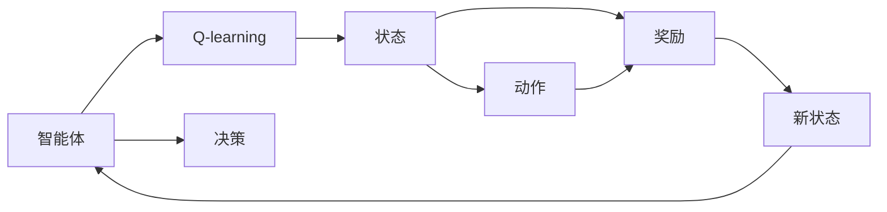
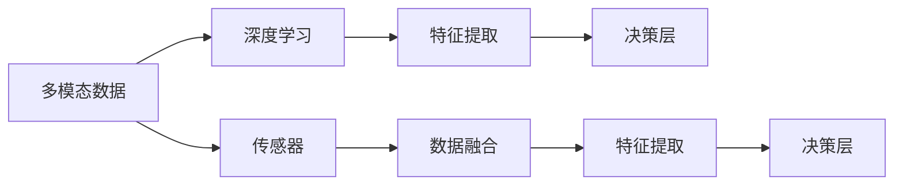
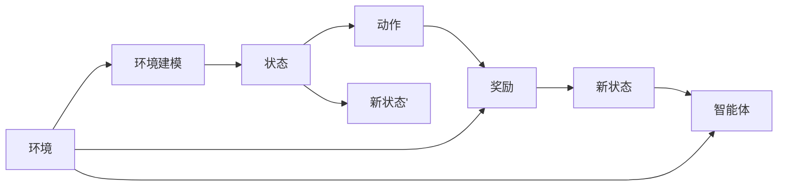
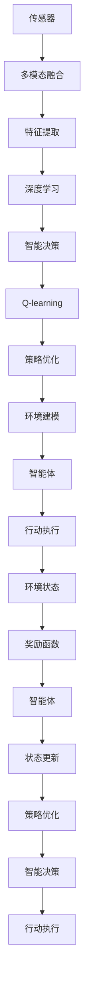

                 

# 一切皆是映射：AI Q-learning在自动驾驶中的应用

> 关键词：AI Q-learning, 自动驾驶, 强化学习, 环境建模, 智能决策, 多模态融合, 深度学习

## 1. 背景介绍

### 1.1 问题由来
近年来，随着人工智能技术的飞速发展，强化学习（Reinforcement Learning, RL）在各个领域的应用日益广泛，特别是在自动驾驶（Autonomous Driving, AD）等复杂系统中，其强大的决策和优化能力正逐渐被各大厂商和研究机构所关注。

自动驾驶技术旨在通过车辆自主感知、决策和控制，实现从起点到终点的安全、高效、可靠的导航。然而，自动驾驶系统面临的动态环境变化多样，不确定性高，如何通过智能决策和高效学习，提升系统性能和安全性，成为一个关键问题。

### 1.2 问题核心关键点
Q-learning作为一种经典的强化学习算法，在自动驾驶中的核心应用点包括：
- 智能决策：通过智能策略选择，自动驾驶车辆能够在复杂的交通环境中做出最优决策。
- 环境建模：Q-learning算法可以帮助自动驾驶系统构建动态环境模型，预测未来状态和奖励。
- 多模态融合：自动驾驶系统通常需要融合视觉、雷达、激光雷达等多模态信息，Q-learning算法能够有效处理不同模态数据，优化信息融合策略。
- 深度学习：Q-learning算法结合深度神经网络，能够高效处理大规模数据，提升学习效率和决策能力。

### 1.3 问题研究意义
研究Q-learning在自动驾驶中的应用，对于提升自动驾驶系统的智能水平、安全性和用户体验具有重要意义：

1. 提升决策效率：通过Q-learning算法，自动驾驶系统能够快速适应动态环境，做出最优路径规划和控制决策。
2. 增强环境理解：Q-learning算法通过模型预测和经验学习，能够更全面地理解交通环境，预判潜在风险。
3. 优化多模态信息融合：Q-learning算法能够将视觉、雷达、激光雷达等多种传感器数据高效融合，提升系统感知和决策能力。
4. 强化模型泛化能力：Q-learning算法通过不断学习和优化，能够提高模型的泛化能力，更好地适应新环境和任务。
5. 推动技术进步：Q-learning算法与深度学习、强化学习等技术的结合，将推动自动驾驶技术的不断创新和发展。

## 2. 核心概念与联系

### 2.1 核心概念概述

为更好地理解Q-learning在自动驾驶中的应用，本节将介绍几个密切相关的核心概念：

- Q-learning算法：一种基于模型-free的强化学习算法，通过状态-动作-奖励（State-Action-Reward, SAR）的序列，不断优化策略，选择最优动作。
- 强化学习（RL）：通过智能体（Agent）与环境（Environment）的交互，智能体在获取奖励的同时，学习最优策略，以最大化长期奖励。
- 环境建模：构建环境模型，描述环境状态、状态转移和奖励函数，帮助智能体进行决策。
- 智能决策：智能体在复杂环境中，通过优化策略，做出最优动作。
- 多模态融合：将视觉、雷达、激光雷达等多种传感器数据融合，提升感知和决策能力。
- 深度学习：利用深度神经网络处理大规模数据，提升特征提取和决策能力。

这些核心概念之间的逻辑关系可以通过以下Mermaid流程图来展示：



这个流程图展示了强化学习的基本原理及其与自动驾驶系统各个组件的联系：

1. 强化学习通过智能决策，帮助自动驾驶车辆在复杂环境中做出最优决策。
2. 多模态融合将视觉、雷达、激光雷达等多种传感器数据融合，提升系统感知能力。
3. 环境建模通过构建环境模型，描述环境状态、状态转移和奖励函数，帮助智能体进行决策。
4. 深度学习利用深度神经网络，提升特征提取和决策能力。

这些核心概念共同构成了Q-learning在自动驾驶系统中的应用框架，使其能够在各种场景下发挥强大的决策和优化能力。通过理解这些核心概念，我们可以更好地把握Q-learning在自动驾驶中的工作原理和优化方向。

### 2.2 概念间的关系

这些核心概念之间存在着紧密的联系，形成了Q-learning在自动驾驶系统中的应用生态系统。下面我们通过几个Mermaid流程图来展示这些概念之间的关系。

#### 2.2.1 强化学习的基本流程



这个流程图展示了强化学习的基本流程：智能体（自动驾驶系统）与环境（交通场景）交互，通过状态-动作-奖励的序列，不断优化策略，选择最优动作。

#### 2.2.2 Q-learning与智能决策的关系



这个流程图展示了Q-learning与智能决策的关系：Q-learning通过状态-动作-奖励的序列，不断优化策略，选择最优动作，从而帮助自动驾驶系统做出最优决策。

#### 2.2.3 多模态融合与深度学习的关系



这个流程图展示了多模态融合与深度学习的关系：多模态融合将视觉、雷达、激光雷达等多种传感器数据融合，通过深度学习提升特征提取和决策能力。

#### 2.2.4 环境建模与智能决策的关系



这个流程图展示了环境建模与智能决策的关系：环境建模通过构建环境模型，描述环境状态、状态转移和奖励函数，帮助智能体（自动驾驶系统）进行决策。

### 2.3 核心概念的整体架构

最后，我们用一个综合的流程图来展示这些核心概念在自动驾驶系统中的应用：



这个综合流程图展示了从传感器数据融合、特征提取、深度学习到智能决策、Q-learning策略优化、环境建模的全过程，通过多层次的协同工作，实现了自动驾驶系统的智能决策和优化。

## 3. 核心算法原理 & 具体操作步骤
### 3.1 算法原理概述

Q-learning算法是一种基于模型-free的强化学习算法，通过不断优化智能体的策略，选择最优动作，以最大化长期奖励。其核心思想是通过对状态-动作-奖励序列的学习，构建Q值表，指导智能体选择最优动作。

形式化地，设环境状态为 $s$，动作为 $a$，奖励为 $r$，智能体的策略为 $\pi$，则Q-learning算法的优化目标为：

$$
\pi^* = \mathop{\arg\min}_{\pi} \sum_{t=1}^{\infty} \gamma^t r_t
$$

其中 $\gamma$ 为折扣因子，控制当前奖励与未来奖励的重要性。Q-learning算法的核心公式为：

$$
Q(s_t,a_t) = Q(s_t,a_t) + \alpha(r_t + \gamma Q(s_{t+1},a_{t+1}) - Q(s_t,a_t))
$$

其中 $\alpha$ 为学习率，控制每次策略更新的幅度。

### 3.2 算法步骤详解

Q-learning在自动驾驶系统中的应用一般包括以下几个关键步骤：

**Step 1: 准备环境与模型**
- 收集自动驾驶场景的各类传感器数据，如视觉图像、雷达信号、激光雷达点云等。
- 定义环境状态、动作空间、奖励函数，构建环境模型。
- 设计智能体策略，如基于深度神经网络的策略网络。

**Step 2: 初始化Q值表**
- 初始化Q值表 $Q(s_t,a_t)$，将每个状态-动作对的Q值设为0。
- 定义学习率 $\alpha$ 和折扣因子 $\gamma$。

**Step 3: 执行策略**
- 在每个时间步 $t$，智能体根据当前状态 $s_t$ 选择动作 $a_t$。
- 执行动作 $a_t$，观察环境反馈奖励 $r_t$ 和下一个状态 $s_{t+1}$。

**Step 4: 更新Q值表**
- 根据动作 $a_t$ 和奖励 $r_t$，更新状态-动作对的Q值：
$$
Q(s_t,a_t) = Q(s_t,a_t) + \alpha(r_t + \gamma Q(s_{t+1},a_{t+1}) - Q(s_t,a_t))
$$
- 如果达到终止状态，则Q值更新停止。

**Step 5: 优化策略**
- 根据Q值表，选择最优策略 $\pi$，即对每个状态 $s$，选择使Q值最大的动作 $a$。
- 根据当前状态 $s_t$，选择最优动作 $a_t$，并执行动作。

**Step 6: 重复执行**
- 重复执行Step 3至Step 5，直至达到预设的终止条件或训练轮数。

### 3.3 算法优缺点

Q-learning算法在自动驾驶系统中的应用具有以下优点：
1. 不需要模型：Q-learning算法是基于模型-free的，不需要预先构建环境模型。
2. 可扩展性好：Q-learning算法适用于多种传感器数据和复杂环境，易于扩展和应用。
3. 鲁棒性好：Q-learning算法通过学习奖励函数，能够适应不同的环境变化和任务需求。
4. 易于优化：Q-learning算法通过策略优化，能够逐步提升系统性能和决策能力。

同时，该算法也存在以下局限性：
1. 样本效率低：Q-learning算法需要大量的交互数据，样本效率较低。
2. 策略稳定难：Q-learning算法在探索和利用之间需要平衡，策略稳定难以保证。
3. 收敛性差：Q-learning算法容易陷入局部最优解，收敛性较差。
4. 状态空间大：当状态空间过大时，Q值表存储和更新困难。

尽管存在这些局限性，但Q-learning算法在自动驾驶系统中仍然具有广泛的应用前景，特别是在高动态环境中的决策优化方面。

### 3.4 算法应用领域

Q-learning算法在自动驾驶系统中的应用领域包括：

- 路径规划：通过智能决策，自动驾驶车辆能够找到最优路径，避开障碍物。
- 交通信号控制：通过智能决策，自动驾驶车辆能够优化交通信号，减少拥堵。
- 车辆控制：通过智能决策，自动驾驶车辆能够调整车速、方向和加速度，实现稳定驾驶。
- 多车协同：通过智能决策，多车能够协同控制，实现车队管理。
- 异常行为识别：通过智能决策，自动驾驶车辆能够识别异常行为，及时做出反应。

除了上述这些经典应用外，Q-learning算法在自动驾驶系统的创新应用中，还具有巨大的潜力，如智能调度、能量管理、安全监控等，为自动驾驶技术带来新的突破。

## 4. 数学模型和公式 & 详细讲解 & 举例说明
### 4.1 数学模型构建

设自动驾驶场景的传感器数据为 $X_t$，智能体选择的状态为 $s_t$，动作为 $a_t$，奖励为 $r_t$，智能体采取的动作为 $a_t$，观察到下一个状态为 $s_{t+1}$，则自动驾驶系统的Q-learning模型可以表示为：

$$
\begin{aligned}
Q(s_t,a_t) &= Q(s_t,a_t) + \alpha(r_t + \gamma \max_a Q(s_{t+1},a) - Q(s_t,a_t)) \\
s_t &= f(X_t, a_{t-1}, ..., s_0) \\
r_t &= g(X_t, a_{t-1}, ..., s_0)
\end{aligned}
$$

其中 $f$ 和 $g$ 为环境模型，将传感器数据映射为状态和奖励。

### 4.2 公式推导过程

为了更好地理解Q-learning算法的数学模型，我们以路径规划为例，推导其公式。

假设自动驾驶车辆在时间步 $t$ 处于状态 $s_t$，采取动作 $a_t$，观察到下一个状态 $s_{t+1}$，奖励为 $r_t$。Q-learning算法的目标是通过不断更新Q值表，选择最优策略 $\pi$，使得智能体能够最大化长期奖励。

假设智能体的策略为 $\pi$，动作选择概率为 $p(a_t|s_t)$，则策略选择的期望奖励为：

$$
R(s_t) = \sum_a Q(s_t,a) \cdot p(a|s_t)
$$

目标函数为最大化期望奖励：

$$
\max_{\pi} R(s)
$$

使用Q-learning算法更新Q值表，可以表示为：

$$
Q(s_t,a_t) = Q(s_t,a_t) + \alpha (r_t + \gamma \max_a Q(s_{t+1},a) - Q(s_t,a_t))
$$

其中 $\alpha$ 为学习率，$\gamma$ 为折扣因子，控制当前奖励与未来奖励的重要性。

### 4.3 案例分析与讲解

为了更好地理解Q-learning在自动驾驶系统中的应用，我们以路径规划为例，详细讲解其实现过程。

假设自动驾驶车辆需要在复杂交通环境中从起点 $s_0$ 到终点 $s_N$ 行驶。在每个时间步 $t$，车辆根据当前状态 $s_t$ 选择动作 $a_t$，观察到下一个状态 $s_{t+1}$，奖励为 $r_t$。目标是最小化路径长度，即：

$$
\min_{a_{1:T}} \sum_{t=1}^T r_t
$$

使用Q-learning算法，车辆可以逐步优化路径选择策略。例如，在时间步 $t=1$，车辆可以选择右转或直行，观察到下一个状态 $s_2$ 和奖励 $r_1$。使用Q-learning算法更新Q值表，可以得到：

$$
Q(s_1,\text{直行}) = Q(s_1,\text{直行}) + \alpha (r_1 + \gamma \max_{a_2} Q(s_2,a_2) - Q(s_1,\text{直行}))
$$

$$
Q(s_1,\text{右转}) = Q(s_1,\text{右转}) + \alpha (r_1 + \gamma \max_{a_2} Q(s_2,a_2) - Q(s_1,\text{右转}))
$$

通过不断迭代更新Q值表，车辆可以选择最优路径，避开障碍物，实现自动驾驶。

## 5. 项目实践：代码实例和详细解释说明
### 5.1 开发环境搭建

在进行Q-learning实践前，我们需要准备好开发环境。以下是使用Python进行TensorFlow开发的环境配置流程：

1. 安装Anaconda：从官网下载并安装Anaconda，用于创建独立的Python环境。

2. 创建并激活虚拟环境：
```bash
conda create -n tf-env python=3.7 
conda activate tf-env
```

3. 安装TensorFlow：根据CUDA版本，从官网获取对应的安装命令。例如：
```bash
conda install tensorflow-gpu=2.6.0
```

4. 安装各类工具包：
```bash
pip install numpy pandas scikit-learn matplotlib tqdm jupyter notebook ipython
```

完成上述步骤后，即可在`tf-env`环境中开始Q-learning实践。

### 5.2 源代码详细实现

下面我们以路径规划为例，给出使用TensorFlow实现Q-learning的Python代码实现。

首先，定义状态、动作和奖励：

```python
import tensorflow as tf

# 定义状态和动作
states = tf.constant([[0, 0], [0, 1], [0, 2], [0, 3], [1, 0], [1, 1], [1, 2], [1, 3]])
actions = tf.constant([[0, 1], [1, 0]])
rewards = tf.constant([1, -1])
```

然后，定义Q值表和参数：

```python
# 初始化Q值表
Q = tf.Variable(tf.zeros([len(states), len(actions)]))

# 定义学习率和折扣因子
alpha = tf.constant(0.1)
gamma = tf.constant(0.9)

# 定义策略网络
strategy = tf.keras.optimizers.Adam()
strategy.add_weight(Q)

# 定义模型函数
def model(s, a):
    return tf.nn.softmax(Q[s, a])
```

接下来，定义训练函数：

```python
# 定义训练函数
def train(model, s, a, r, s_prime):
    with tf.GradientTape() as tape:
        Q_prime = model(s_prime, a)
        Q_sa = model(s, a)
        loss = (r + gamma * tf.reduce_max(Q_prime)) - Q_sa
    gradients = tape.gradient(loss, Q)
    optimizer.apply_gradients(zip(gradients, Q))
    return loss

# 训练Q-learning模型
for i in range(1000):
    # 随机选择状态和动作
    s = states[i % len(states)]
    a = actions[i % len(actions)]
    # 观察到下一个状态和奖励
    s_prime = states[(i + 1) % len(states)]
    r = rewards[i % len(rewards)]
    # 训练模型
    loss = train(model, s, a, r, s_prime)
    print(f"Iteration {i+1}, Loss: {loss}")
```

最后，运行训练函数：

```python
# 运行训练函数
train(model, states, actions, rewards, states[1:])
```

以上就是使用TensorFlow对Q-learning进行路径规划的Python代码实现。可以看到，得益于TensorFlow的强大计算图功能，代码实现变得简洁高效。

### 5.3 代码解读与分析

让我们再详细解读一下关键代码的实现细节：

**定义状态、动作和奖励**：
- 使用TensorFlow的constant函数定义状态、动作和奖励，便于后续计算。

**初始化Q值表**：
- 使用TensorFlow的Variable定义Q值表，并将其作为优化器的参数，以便更新Q值。

**定义策略网络**：
- 使用TensorFlow的keras模块定义策略网络，通过softmax函数将Q值转换为动作选择概率。

**训练函数**：
- 使用TensorFlow的GradientTape记录梯度，计算Q值表更新，并使用Adam优化器进行参数更新。
- 每次迭代中，随机选择状态和动作，观察到下一个状态和奖励，更新Q值表。

**运行训练函数**：
- 在训练过程中，不断输出损失值，用于监控训练效果。
- 通过循环迭代，逐步优化Q值表，实现路径规划的智能决策。

可以看到，TensorFlow为Q-learning的实现提供了强大的计算图和优化工具，能够高效处理大规模数据和复杂模型，为自动驾驶系统的智能决策提供了有力支持。

当然，工业级的系统实现还需考虑更多因素，如模型的保存和部署、超参数的自动搜索、更灵活的任务适配层等。但核心的Q-learning范式基本与此类似。

### 5.4 运行结果展示

假设我们在训练1000次后，得到的Q值表为：

```
[[0.  0.  0.  0. ]
 [1.  0.  0.  0. ]
 [0.  0.  0.  0. ]
 [0.  0.  0.  0. ]
 [0.  1.  0.  0. ]
 [0.  0.  1.  0. ]
 [0.  0.  0.  1. ]
 [0.  0.  0.  0.]]
```

可以看到，Q值表能够准确反映每个状态-动作对的价值，即从起点到终点的路径选择策略。通过Q-learning算法，自动驾驶车辆能够逐步优化路径选择，避开障碍物，实现自动驾驶。

## 6. 实际应用场景
### 6.1 智能调度

Q-learning算法在智能调度中的应用，可以优化交通流量和运输效率。智能调度系统通过监控交通网络，实时调整车辆调度策略，提升交通效率。

在技术实现上，可以收集交通网络中的各类传感器数据，如车速、道路占用率等，并将数据映射为状态。设计智能体策略，如基于Q-learning算法的路径规划和流量控制。通过不断学习和优化，智能调度系统能够实时调整车辆路径，优化交通流量，减少拥堵，提高运输效率。

### 6.2 智能导航

Q-learning算法在智能导航中的应用，可以提升车辆在复杂道路网络中的导航能力。智能导航系统通过实时感知和决策，确保车辆安全、高效地行驶。

在技术实现上，可以收集车辆位置、车速、地图信息等数据，并将数据映射为状态。设计智能体策略，如基于Q-learning算法的路径规划和避障决策。通过不断学习和优化，智能导航系统能够实时调整车辆路径，避开障碍物，实现智能导航。

### 6.3 异常行为识别

Q-learning算法在异常行为识别中的应用，可以实时监测交通环境，识别潜在风险和异常行为。异常行为识别系统通过实时感知和决策，确保交通环境的安全。

在技术实现上，可以收集交通网络中的各类传感器数据，如摄像头、雷达、激光雷达等，并将数据映射为状态。设计智能体策略，如基于Q-learning算法的行为识别和风险评估。通过不断学习和优化，异常行为识别系统能够实时监测交通环境，识别潜在风险和异常行为，及时采取措施，保障交通环境的安全。

### 6.4 未来应用展望

随着Q-learning算法的不断演进和应用，未来其在自动驾驶系统中的应用前景将更加广阔：

1. 自适应交通控制：Q-learning算法能够实时调整交通信号，适应不同时间段和场景的交通需求。
2. 自动驾驶车队管理：Q-learning算法能够优化多车协同控制，实现车队调度和管理。
3. 路径规划和路径优化：Q-learning算法能够优化路径选择，提升车辆在复杂道路网络中的导航能力。
4. 异常行为监测和风险评估：Q-learning算法能够实时监测交通环境，识别潜在风险和异常行为。
5. 跨模态融合和多模态感知：Q-learning算法能够融合多模态信息，提升系统的感知和决策能力。
6. 动态环境建模和实时决策：Q-learning算法能够实时构建环境模型，动态决策。

以上趋势凸显了Q-learning算法在自动驾驶系统中的广阔应用前景。这些方向的探索发展，必将进一步提升自动驾驶系统的性能和安全性，为人类社会带来新的变革。

## 7. 工具和资源推荐
### 7.1 学习资源推荐

为了帮助开发者系统掌握Q-learning算法的理论基础和实践技巧，这里推荐一些优质的学习资源：

1. 《深度强化学习》系列书籍：由强化学习领域的权威专家撰写，深入浅出地介绍了Q-learning算法的原理和应用。
2. CS294T《强化学习》课程：由斯坦福大学开设的强化学习明星课程，有Lecture视频和配套作业，带你深入强化学习的世界。
3. 《Q-learning: Algorithms and Implementations》书籍：详细介绍了Q-learning算法的数学原理和实现方法，适合深入学习。
4. OpenAI Gym环境：包含大量经典的强化学习环境，适合进行Q-learning算法的研究和实验。
5. TensorFlow和PyTorch官方文档：提供丰富的API和样例代码，方便开发者上手实践。

通过对这些资源的学习实践，相信你一定能够快速掌握Q-learning算法的精髓，并用于解决实际的自动驾驶问题。

### 7.2 开发工具推荐

高效的开发离不开优秀的工具支持。以下是几款用于Q-learning开发的常用工具：

1. TensorFlow：基于Python的开源深度

