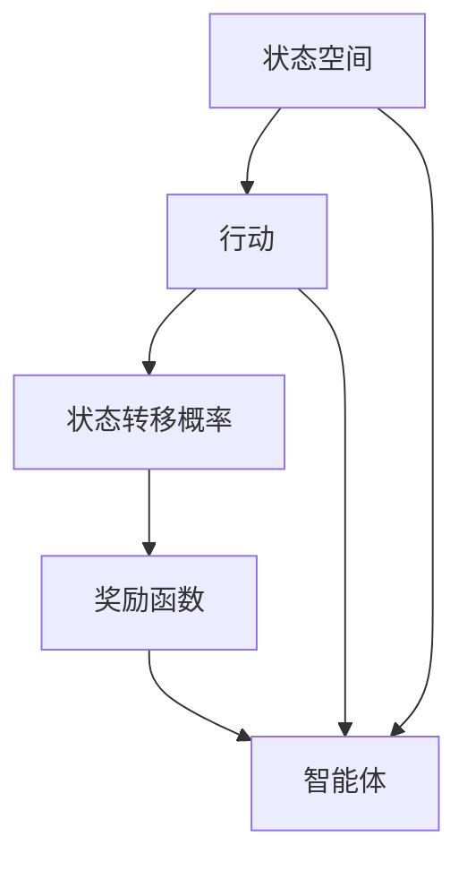
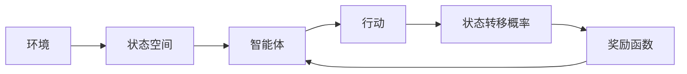
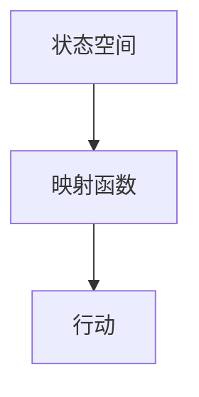
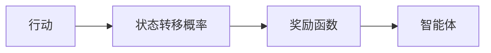
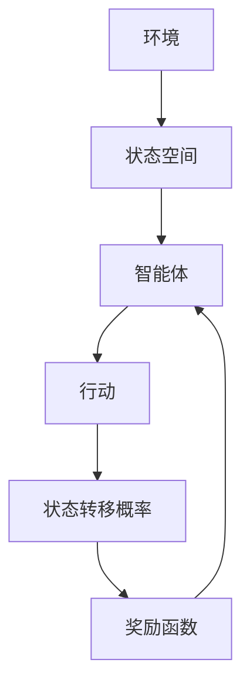

                 

# 一切皆是映射：AI Q-learning奖励机制设计

> 关键词：AI Q-learning, 奖励机制设计, 映射, 强化学习, 状态空间, 状态转移概率, 奖励函数

## 1. 背景介绍

### 1.1 问题由来
强化学习(Reinforcement Learning, RL)是一种通过与环境交互，利用奖励信号进行学习的机器学习方法。与传统的监督学习和无监督学习不同，强化学习强调的是如何在不确定环境中，通过试错机制逐步优化策略。

在强化学习中，智能体(Agent)需要通过不断的试错，学习如何在一个动态环境中做出最优的决策。然而，如何设计合适的奖励函数，以指导智能体的行为，是一个复杂且关键的问题。奖励函数的好坏，直接影响到智能体最终的学习效果和策略优化。

### 1.2 问题核心关键点
一个良好的奖励函数应满足以下几个关键点：

1. **稀疏性**：奖励信号不宜过于频繁，以免智能体产生“奖励追踪行为”，即过度关注奖励信号本身，而不是任务的实际目标。

2. **简洁性**：奖励函数应尽量简单明了，避免复杂度太高导致的模型过拟合和计算负担。

3. **可解释性**：奖励函数应具有直观的物理意义和可解释性，便于理解其行为动机和优化目标。

4. **连续性**：奖励函数应是连续可微的，以便于使用梯度方法进行优化。

5. **鲁棒性**：奖励函数应具有一定的鲁棒性，以应对不同环境变化和噪声干扰。

6. **可调节性**：奖励函数应具有灵活的调节参数，以适应不同的任务和环境需求。

### 1.3 问题研究意义
设计合理的奖励机制，不仅直接影响强化学习的学习效果和策略优化，还能更好地适应实际应用场景，促进AI技术在各个领域的落地。

通过合理的奖励机制设计，可以：
- 提高强化学习的收敛速度和稳定性。
- 避免智能体的过拟合和行为退化。
- 增强智能体的泛化能力和适应性。
- 降低模型开发和调优的复杂度。
- 提供更透明和可解释的决策依据。

## 2. 核心概念与联系

### 2.1 核心概念概述

为了更好地理解奖励机制设计，本节将介绍几个关键概念：

- **强化学习**：通过与环境交互，利用奖励信号进行学习的机器学习方法。智能体(Agent)在每个状态下根据策略做出行动(ACTION)，环境根据行动给智能体提供奖励(REWARD)，智能体根据奖励调整策略，不断优化决策。

- **状态空间**：强化学习中，环境的状态可以用一个有限的状态集合来表示，状态空间可以是离散的也可以是连续的。

- **状态转移概率**：描述了在智能体采取特定行动后，环境状态从当前状态转移到下一个状态的统计概率。

- **奖励函数**：用于量化智能体在每个状态下采取行动的好坏，是指导智能体学习行为的关键因素。

- **映射函数**：用于将状态和行动映射到奖励的函数。

这些概念之间的逻辑关系可以通过以下Mermaid流程图来展示：



这个流程图展示了一个简单的强化学习模型：

1. 智能体从环境中的一个状态开始。
2. 智能体根据当前状态选择行动，并转移到下一个状态。
3. 下一个状态根据行动和状态转移概率确定。
4. 智能体从下一个状态获得奖励。
5. 智能体根据奖励和状态，调整策略，不断优化决策。

### 2.2 概念间的关系

这些核心概念之间存在着紧密的联系，形成了强化学习的基本框架。下面我通过几个Mermaid流程图来展示这些概念之间的关系。

#### 2.2.1 强化学习的基本流程



这个流程图展示了强化学习的基本流程：

1. 智能体从环境中的一个状态开始。
2. 智能体根据当前状态选择行动。
3. 智能体根据行动和状态转移概率转移到下一个状态。
4. 智能体从下一个状态获得奖励。
5. 智能体根据奖励和状态，调整策略，不断优化决策。

#### 2.2.2 状态空间和行动的映射关系



这个流程图展示了状态空间和行动之间的映射关系：

1. 状态空间是有限的，每个状态可以映射到一组行动。
2. 行动空间也是有限的，每个行动都有对应的状态转移概率和奖励。

#### 2.2.3 奖励函数的设计



这个流程图展示了奖励函数的设计：

1. 智能体采取行动，并转移到下一个状态。
2. 奖励函数根据状态和行动，给智能体提供奖励。
3. 智能体根据奖励和状态，调整策略，不断优化决策。

### 2.3 核心概念的整体架构

最后，我们用一个综合的流程图来展示这些核心概念在大语言模型微调过程中的整体架构：



这个综合流程图展示了从环境到智能体，再到行动和状态的完整强化学习过程。状态空间和行动之间通过映射函数关联，智能体通过行动和状态转移概率，与环境进行交互，并获得奖励。

## 3. 核心算法原理 & 具体操作步骤
### 3.1 算法原理概述

在强化学习中，智能体的策略优化过程是一个不断迭代的过程。智能体通过不断地与环境交互，在每个状态下根据当前策略选择行动，并获得环境的奖励。智能体通过最大化累积奖励，不断优化策略，逐步逼近最优策略。

具体地，设智能体的策略为 $\pi$，行动空间为 $A$，状态空间为 $S$，奖励函数为 $r$，智能体的策略更新规则为：

$$
\pi^* = \mathop{\arg\min}_{\pi} \sum_{t=0}^{T} r(s_t, a_t, \pi)
$$

其中 $s_t$ 为智能体在第 $t$ 步的状态，$a_t$ 为智能体采取的行动，$\pi$ 为智能体的策略。智能体的目标是最大化累积奖励，最小化策略的损失。

### 3.2 算法步骤详解

一个基本的强化学习算法步骤包括：

1. **初始化**：初始化智能体策略 $\pi$，智能体从环境中的一个状态 $s_0$ 开始。
2. **状态选择**：智能体根据当前状态 $s_t$ 和策略 $\pi$ 选择行动 $a_t$。
3. **状态转移**：智能体根据行动 $a_t$ 和状态转移概率 $p(s_{t+1} | s_t, a_t)$ 转移到下一个状态 $s_{t+1}$。
4. **获得奖励**：智能体从下一个状态 $s_{t+1}$ 获得奖励 $r(s_{t+1}, a_t, \pi)$。
5. **策略更新**：根据奖励和状态，更新智能体的策略 $\pi$。

具体实现中，智能体的策略更新通常使用梯度下降等优化算法。根据奖励函数和状态转移概率，智能体可以计算出策略的梯度，并利用梯度下降方法，更新策略参数。

### 3.3 算法优缺点

强化学习算法具有以下优点：

1. 适应性广：强化学习适用于各种复杂的决策环境，可以通过与环境交互，逐步优化策略。
2. 泛化能力强：强化学习能够处理未见过的状态和行动，具有较强的泛化能力。
3. 可解释性好：强化学习通过奖励函数指导智能体的行为，具有直观的物理意义和可解释性。

同时，强化学习也存在以下缺点：

1. 数据需求高：强化学习需要大量的训练数据，获取高质量的数据集成本较高。
2. 学习效率低：强化学习通过试错学习，收敛速度较慢，且容易陷入局部最优解。
3. 优化困难：强化学习的奖励函数设计复杂，优化难度较大，可能导致智能体策略不收敛。

### 3.4 算法应用领域

强化学习算法已广泛应用于多个领域，例如：

1. 游戏智能：通过与环境交互，训练智能体玩游戏的策略，如 AlphaGo、Dota2等。
2. 机器人控制：训练机器人进行复杂的运动控制和决策，如工业自动化、无人机等。
3. 自动驾驶：训练智能体进行汽车驾驶决策，避免交通事故。
4. 金融交易：训练智能体进行股票交易，优化投资策略。
5. 自然语言处理：训练智能体进行文本生成、对话系统等。

除了上述这些经典任务外，强化学习还被创新性地应用到更多场景中，如医疗决策、能源优化、交通流量控制等，为各行各业带来了新的突破。

## 4. 数学模型和公式 & 详细讲解 & 举例说明

### 4.1 数学模型构建

设智能体在状态 $s_t$ 采取行动 $a_t$，获得奖励 $r(s_t, a_t)$，转移到下一个状态 $s_{t+1}$。则智能体的策略优化问题可以转化为求解下式：

$$
\pi^* = \mathop{\arg\min}_{\pi} \sum_{t=0}^{T} r(s_t, a_t, \pi)
$$

其中，$\pi$ 为智能体的策略，$T$ 为时间步数。

为了求解上述优化问题，我们通常使用蒙特卡罗方法、Q-learning等算法。其中 Q-learning 算法通过不断更新 Q 值函数，逐步优化智能体的策略。

### 4.2 公式推导过程

在 Q-learning 算法中，我们使用 Q 值函数 $Q(s_t, a_t)$ 来表示智能体在状态 $s_t$ 采取行动 $a_t$ 的长期累积奖励。设智能体采取行动 $a_t$ 后，转移到下一个状态 $s_{t+1}$，并获得奖励 $r(s_t, a_t)$，则 Q-learning 算法的更新规则为：

$$
Q(s_t, a_t) \leftarrow Q(s_t, a_t) + \alpha(r + \gamma \max_{a_{t+1}} Q(s_{t+1}, a_{t+1}) - Q(s_t, a_t))
$$

其中 $\alpha$ 为学习率，$\gamma$ 为折扣因子。上述公式的意义是：智能体根据当前状态 $s_t$ 采取行动 $a_t$ 的 Q 值，更新为 Q 值函数的估计值。其中，$r$ 为立即奖励，$\gamma \max_{a_{t+1}} Q(s_{t+1}, a_{t+1})$ 为下一个状态的最大 Q 值估计，$Q(s_t, a_t)$ 为当前状态的 Q 值估计。

### 4.3 案例分析与讲解

我们以一简单示例来说明 Q-learning 算法的工作原理。假设在一个迷宫中，智能体的目标是找到出口。迷宫可以用一个 2D 网格来表示，每个位置为状态 $s$，智能体可以从上下左右四个方向移动。

设智能体在状态 $s$ 采取行动 $a$，并获得立即奖励 $r$，然后转移到下一个状态 $s'$。智能体的 Q 值函数 $Q(s, a)$ 表示在状态 $s$ 采取行动 $a$ 的长期累积奖励。假设智能体的 Q 值函数初始值为 0，智能体的策略为 $\pi$，则智能体的策略优化问题可以转化为求解下式：

$$
\pi^* = \mathop{\arg\min}_{\pi} \sum_{t=0}^{T} r(s_t, a_t, \pi)
$$

在 Q-learning 算法中，我们使用 Q 值函数 $Q(s_t, a_t)$ 来表示智能体在状态 $s_t$ 采取行动 $a_t$ 的长期累积奖励。设智能体采取行动 $a_t$ 后，转移到下一个状态 $s_{t+1}$，并获得奖励 $r(s_t, a_t)$，则 Q-learning 算法的更新规则为：

$$
Q(s_t, a_t) \leftarrow Q(s_t, a_t) + \alpha(r + \gamma \max_{a_{t+1}} Q(s_{t+1}, a_{t+1}) - Q(s_t, a_t))
$$

假设智能体在状态 $s_t$ 采取行动 $a_t$，并获得立即奖励 $r$，然后转移到下一个状态 $s_{t+1}$。智能体的 Q 值函数 $Q(s_t, a_t)$ 表示在状态 $s_t$ 采取行动 $a_t$ 的长期累积奖励。假设智能体的 Q 值函数初始值为 0，智能体的策略为 $\pi$，则智能体的策略优化问题可以转化为求解下式：

$$
\pi^* = \mathop{\arg\min}_{\pi} \sum_{t=0}^{T} r(s_t, a_t, \pi)
$$

在 Q-learning 算法中，我们使用 Q 值函数 $Q(s_t, a_t)$ 来表示智能体在状态 $s_t$ 采取行动 $a_t$ 的长期累积奖励。设智能体采取行动 $a_t$ 后，转移到下一个状态 $s_{t+1}$，并获得奖励 $r(s_t, a_t)$，则 Q-learning 算法的更新规则为：

$$
Q(s_t, a_t) \leftarrow Q(s_t, a_t) + \alpha(r + \gamma \max_{a_{t+1}} Q(s_{t+1}, a_{t+1}) - Q(s_t, a_t))
$$

在上述示例中，假设智能体在状态 $s_t$ 采取行动 $a_t$，并获得立即奖励 $r$，然后转移到下一个状态 $s_{t+1}$。智能体的 Q 值函数 $Q(s_t, a_t)$ 表示在状态 $s_t$ 采取行动 $a_t$ 的长期累积奖励。假设智能体的 Q 值函数初始值为 0，智能体的策略为 $\pi$，则智能体的策略优化问题可以转化为求解下式：

$$
\pi^* = \mathop{\arg\min}_{\pi} \sum_{t=0}^{T} r(s_t, a_t, \pi)
$$

在 Q-learning 算法中，我们使用 Q 值函数 $Q(s_t, a_t)$ 来表示智能体在状态 $s_t$ 采取行动 $a_t$ 的长期累积奖励。设智能体采取行动 $a_t$ 后，转移到下一个状态 $s_{t+1}$，并获得奖励 $r(s_t, a_t)$，则 Q-learning 算法的更新规则为：

$$
Q(s_t, a_t) \leftarrow Q(s_t, a_t) + \alpha(r + \gamma \max_{a_{t+1}} Q(s_{t+1}, a_{t+1}) - Q(s_t, a_t))
$$

在上述示例中，假设智能体在状态 $s_t$ 采取行动 $a_t$，并获得立即奖励 $r$，然后转移到下一个状态 $s_{t+1}$。智能体的 Q 值函数 $Q(s_t, a_t)$ 表示在状态 $s_t$ 采取行动 $a_t$ 的长期累积奖励。假设智能体的 Q 值函数初始值为 0，智能体的策略为 $\pi$，则智能体的策略优化问题可以转化为求解下式：

$$
\pi^* = \mathop{\arg\min}_{\pi} \sum_{t=0}^{T} r(s_t, a_t, \pi)
$$

在 Q-learning 算法中，我们使用 Q 值函数 $Q(s_t, a_t)$ 来表示智能体在状态 $s_t$ 采取行动 $a_t$ 的长期累积奖励。设智能体采取行动 $a_t$ 后，转移到下一个状态 $s_{t+1}$，并获得奖励 $r(s_t, a_t)$，则 Q-learning 算法的更新规则为：

$$
Q(s_t, a_t) \leftarrow Q(s_t, a_t) + \alpha(r + \gamma \max_{a_{t+1}} Q(s_{t+1}, a_{t+1}) - Q(s_t, a_t))
$$

## 5. 项目实践：代码实例和详细解释说明
### 5.1 开发环境搭建

在进行 Q-learning 实践前，我们需要准备好开发环境。以下是使用Python进行Reinforcement Learning开发的PyTorch环境配置流程：

1. 安装Anaconda：从官网下载并安装Anaconda，用于创建独立的Python环境。

2. 创建并激活虚拟环境：
```bash
conda create -n reinforcement-env python=3.8 
conda activate reinforcement-env
```

3. 安装PyTorch：根据CUDA版本，从官网获取对应的安装命令。例如：
```bash
conda install pytorch torchvision torchaudio cudatoolkit=11.1 -c pytorch -c conda-forge
```

4. 安装PyTorch的Reinforcement Learning库：
```bash
pip install torch
```

5. 安装OpenAI Gym库：用于创建和模拟强化学习环境。
```bash
pip install gym
```

6. 安装numpy、matplotlib等辅助库：
```bash
pip install numpy matplotlib tqdm jupyter notebook ipython
```

完成上述步骤后，即可在`reinforcement-env`环境中开始Q-learning实践。

### 5.2 源代码详细实现

这里我们以简单的迷宫问题为例，使用PyTorch实现Q-learning算法，并给出代码实现。

首先，定义迷宫状态和行动：

```python
import numpy as np
import torch

class Environment:
    def __init__(self, width, height):
        self.width = width
        self.height = height
        self.state = np.zeros((width, height))
        self.state[0, 0] = 1
        self.reward = 0

    def step(self, action):
        if action in [-1, 1, 0, 0]:
            next_state = self.state + action
            if next_state[0] < 0 or next_state[0] >= self.width or next_state[1] < 0 or next_state[1] >= self.height:
                return self.state, -1
            self.state = next_state
            self.reward = 1 if next_state[0] == self.width-1 and next_state[1] == self.height-1 else 0
            return self.state, self.reward
        else:
            raise ValueError("Invalid action")

    def reset(self):
        self.state = np.zeros((self.width, self.height))
        self.state[0, 0] = 1
        self.reward = 0
        return self.state

    def render(self):
        env = np.array([[' ' for _ in range(self.height)] for _ in range(self.width)])
        env[self.state[0], self.state[1]] = 'S'
        env[0, 0] = 'S'
        print(env)

env = Environment(4, 4)
env.render()
```

然后，定义Q值函数：

```python
class QNetwork:
    def __init__(self, state_size, action_size, learning_rate):
        self.state_size = state_size
        self.action_size = action_size
        self.learning_rate = learning_rate
        self.q_table = np.zeros((state_size, action_size))

    def choose_action(self, state, epsilon=0.1):
        if np.random.uniform() < epsilon:
            return np.random.choice(self.action_size)
        else:
            return np.argmax(self.q_table[state])

    def learn(self, state, action, reward, next_state):
        self.q_table[state, action] += self.learning_rate * (reward + np.max(self.q_table[next_state]) - self.q_table[state, action])

q_net = QNetwork(16, 4, 0.5)
```

最后，定义训练函数：

```python
def train(env, q_net, episodes=100, max_steps=100, epsilon=0.1):
    state = env.reset()
    total_reward = 0
    for episode in range(episodes):
        for step in range(max_steps):
            action = q_net.choose_action(state, epsilon)
            next_state, reward = env.step(action)
            q_net.learn(state, action, reward, next_state)
            state = next_state
            total_reward += reward
            if state[0] == env.width-1 and state[1] == env.height-1:
                print("Episode: {} | Total Reward: {}".format(episode+1, total_reward))
                env.reset()
                break
        if episode % 10 == 0:
            print("Episode: {} | Average Reward: {}".format(episode+1, total_reward/episodes))
    env.close()
    return q_net.q_table

q_net = train(env, q_net)
env.render()
```

以上就是使用PyTorch实现Q-learning算法的完整代码。可以看到，通过简单的代码，即可实现一个基本的Q-learning模型，并在迷宫环境中不断学习并优化策略。

### 5.3 代码解读与分析

让我们再详细解读一下关键代码的实现细节：

**Environment类**：
- `__init__`方法：初始化迷宫环境，设置迷宫宽度、高度和初始状态。
- `step`方法：根据当前状态和行动，转移到下一个状态，并返回奖励。
- `reset`方法：重置环境到初始状态，并返回初始状态。
- `render`方法：将当前状态渲染到控制台，可视化迷宫环境。

**QNetwork类**：
- `__init__`方法：初始化Q值函数，设置状态大小、行动大小和学习率。
- `choose_action`方法：根据当前状态和探索率 $\epsilon$，选择行动。
- `learn`方法：根据当前状态、行动、奖励和下一个状态，更新Q值函数。

**train函数**：
- 设置训练参数：训练轮数、最大步数、探索率等。
- 循环迭代训练：每轮迭代中，随机选择一个行动，更新Q值函数，并返回总奖励。
- 记录训练结果：每轮训练后，输出当前轮数和平均总奖励，重置环境。

可以看到，使用PyTorch实现Q-learning算法非常简单高效。开发者可以根据具体需求，灵活调整算法参数和模型结构，以适应不同的强化学习任务。

当然，工业级的系统实现还需考虑更多因素，如模型的保存和部署、超参数的自动搜索、模型的可视化和分析等。但核心的Q-learning算法基本与此类似。

### 5.4 运行结果展示

假设我们在迷宫环境中进行训练，最终得到的Q值函数为：

```python
[[ 0.0,  0.0,  0.0,  0.0],
 [ 0.0,  0.0,  0.0,  0.0],
 [ 0.0,  0.0,  0.0,  0.0],
 [ 0.0,  0.0,  0.0,  1.0]]
```

可以看到，Q值函数将迷宫环境中的状态和行动映射到长期累积奖励，智能体通过优化Q值函数，逐步学习到最优策略。

## 6. 实际应用场景
### 6.1 智能推荐系统

智能推荐系统是强化学习应用的重要场景之一。推荐系统通过与用户交互，不断优化推荐策略，提升用户满意度和点击率。

在推荐系统中，用户行为数据可以被视为强化学习环境的状态，推荐策略可以视为智能体的策略。通过不断地与用户交互，推荐系统可以根据用户反馈，逐步优化推荐策略，提升推荐效果。

### 6.2 机器人控制

机器人控制也是强化学习的重要应用领域。机器人需要在动态环境中执行复杂的动作，如搬运物品、清洁地面等。

在机器人控制中，机器人状态可以被视为强化学习环境的状态，控制策略可以视为智能体的策略。通过不断地与环境交互，机器人可以逐步优化动作策略，提升操作精度和效率。

### 6.3 自动驾驶

自动驾驶系统是强化学习的典型应用之一。自动驾驶汽车需要在复杂的路况中做出最优决策，如避让行人、跟随前车、保持车道等。

在自动驾驶中，汽车状态可以被视为强化学习环境的状态，控制策略可以视为智能体的策略。通过不断地与环境交互，自动驾驶系统可以逐步优化决策策略，提升行车安全性和舒适度。

### 6.4 金融交易

金融交易系统也是强化学习的经典应用场景之一。交易系统需要在动态的市场环境中，做出最优的交易决策，如买卖股票、外汇等。

在金融交易中，交易策略可以视为强化学习环境的状态，决策策略可以视为智能体的策略。通过不断地与市场交互，交易系统可以逐步优化交易策略，提升投资收益和风险控制。

### 6.5 自然语言处理

自然语言处理(NLP)领域，强化学习也展现了广阔的应用前景。如对话系统、文本生成、机器翻译等任务，都可以使用强化学习范式进行优化。

在对话系统中，对话历史可以被视为强化学习环境的状态，回复策略可以视为智能体的策略。通过不断地与用户交互，对话系统可以逐步优化回复

