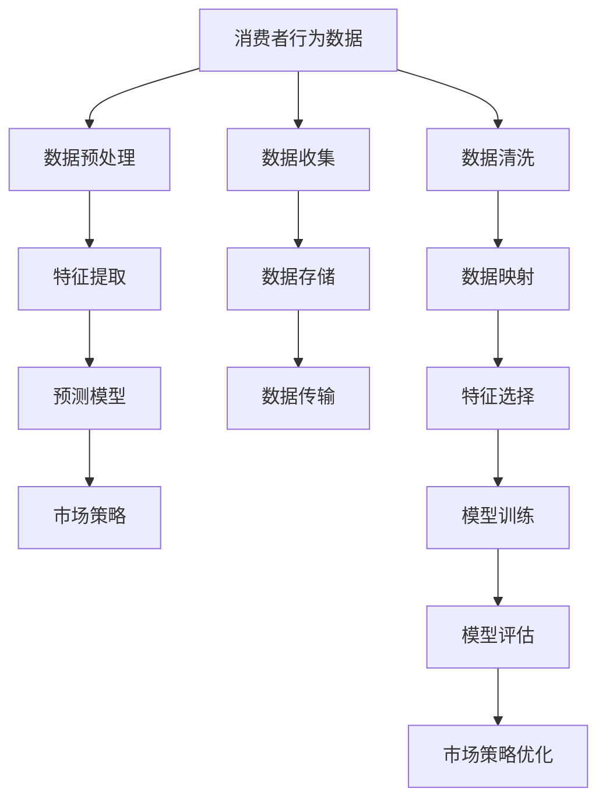
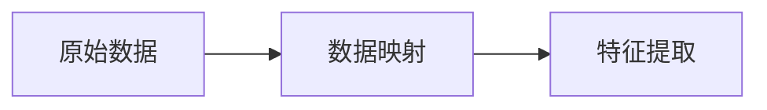
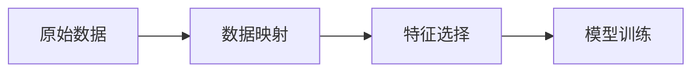
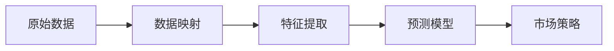
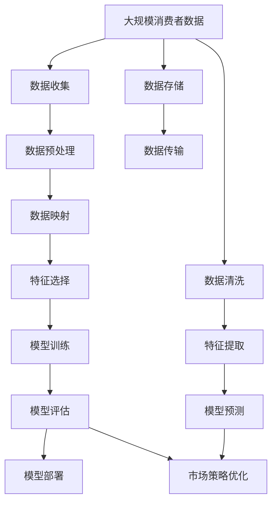

                 

# 一切皆是映射：AI在消费者行为分析中的应用实例

> 关键词：消费者行为分析,AI,映射,数据挖掘,预测模型

## 1. 背景介绍

### 1.1 问题由来
在当今的数字化时代，消费者行为分析（Consumer Behavior Analysis, CBA）成为了企业在制定市场营销策略、优化产品设计、提升客户满意度等方面的重要工具。传统上，CBA主要依赖问卷调查、焦点小组访谈等形式的数据收集，而这些方法的成本高、耗时长、精度有限。随着人工智能（AI）技术的兴起，特别是大数据和机器学习的应用，AI技术为消费者行为分析带来了全新的思路和工具。

AI可以通过分析大量的数据集，挖掘出消费者行为背后的模式和趋势，预测未来的消费趋势，为商家提供有价值的洞察，从而制定更精准的市场策略。然而，如何高效地利用AI技术，从中提取有价值的信息，是一个复杂而富有挑战的问题。本文将围绕AI在消费者行为分析中的应用，探讨如何通过数据映射的方式，提取和利用消费者行为数据。

### 1.2 问题核心关键点
AI在消费者行为分析中的应用，关键在于如何将消费者行为数据转化为有价值的洞察。具体而言，以下几个方面是AI应用的核心关键点：

1. **数据收集与处理**：高效地收集和处理消费者行为数据，包括购买记录、浏览历史、评价评论等。
2. **特征提取**：从收集的数据中提取出对消费者行为有影响力的特征，如消费频率、购买金额、浏览时间等。
3. **建模与预测**：使用机器学习模型对消费者行为进行建模，并预测未来的消费趋势。
4. **决策支持**：将AI的预测结果转化为可行的市场策略和产品设计，支持企业决策。

本文将从数据映射的角度，介绍如何通过AI技术，高效地分析消费者行为，并提供实例说明。

### 1.3 问题研究意义
AI在消费者行为分析中的应用，具有以下重要意义：

1. **提升效率与精确度**：AI能够快速处理海量数据，提取精确的消费者行为洞察，显著提升数据处理的效率和精确度。
2. **降低成本**：相较于传统的数据收集和分析方法，AI在消费者行为分析中具有更高的自动化水平，降低了人工成本和运营成本。
3. **个性化营销**：基于AI的分析结果，企业可以制定更个性化的营销策略，提升消费者满意度和忠诚度。
4. **市场预测**：AI技术可以帮助企业预测市场趋势，提前布局，抓住先机。
5. **风险管理**：通过分析消费者行为，企业可以更好地识别和管理潜在风险，如客户流失、产品召回等。

## 2. 核心概念与联系

### 2.1 核心概念概述

为了更好地理解AI在消费者行为分析中的应用，本节将介绍几个核心概念及其相互之间的联系。

- **消费者行为分析（CBA）**：通过分析消费者的购买、使用、评价等行为数据，揭示消费者的需求、偏好和态度，为企业提供决策依据。
- **人工智能（AI）**：利用机器学习、深度学习等技术，模拟人的智能行为，实现数据处理、模式识别、决策支持等功能。
- **数据映射**：将原始数据映射到更有意义的表示形式，以便更好地提取和利用数据。
- **特征工程**：从原始数据中提取出对目标任务有影响的特征，用于模型训练。
- **预测模型**：基于历史数据，使用机器学习算法构建模型，预测未来的消费者行为。

这些概念之间的联系可以通过以下Mermaid流程图来展示：



这个流程图展示了从数据收集、处理、特征提取、模型训练到市场策略优化的全过程，以及数据映射在其中扮演的重要角色。

### 2.2 概念间的关系

这些核心概念之间存在着紧密的联系，形成了AI在消费者行为分析中的完整流程。下面通过几个Mermaid流程图来展示这些概念之间的关系。

#### 2.2.1 数据映射与特征提取的关系



这个流程图展示了数据映射与特征提取之间的关系。数据映射是通过降维、编码等手段，将原始数据映射到更有意义的表示形式，以便更好地提取特征。

#### 2.2.2 数据映射与模型训练的关系



这个流程图展示了数据映射与模型训练之间的关系。通过数据映射和特征选择，将原始数据映射为更有意义的表示，用于模型训练。

#### 2.2.3 数据映射与市场策略的关系



这个流程图展示了数据映射与市场策略之间的关系。通过数据映射、特征提取和模型训练，构建预测模型，为市场策略提供数据支持。

### 2.3 核心概念的整体架构

最后，我们用一个综合的流程图来展示这些核心概念在大规模消费者行为分析中的应用：



这个综合流程图展示了从数据收集、预处理、映射、特征选择、模型训练到市场策略优化的完整过程，以及数据映射在其中扮演的重要角色。

## 3. 核心算法原理 & 具体操作步骤
### 3.1 算法原理概述

AI在消费者行为分析中的核心算法原理，主要基于数据映射和特征提取，构建预测模型，进行市场策略优化。

#### 3.1.1 数据映射

数据映射是AI应用中的重要步骤，旨在将原始数据映射为更有意义的表示形式，以便更好地提取和利用数据。具体而言，数据映射可以通过以下方式实现：

- **降维技术**：如主成分分析（PCA）、线性判别分析（LDA）等，通过降维减少数据维度，提取主要特征。
- **编码技术**：如词袋模型、TF-IDF等，将文本数据转换为数值型表示，便于模型训练。
- **聚类技术**：如K-means、层次聚类等，将数据分组，发现数据中的模式和结构。

#### 3.1.2 特征提取

特征提取是从原始数据中提取出对目标任务有影响的特征，用于模型训练。常见的特征提取方法包括：

- **统计特征**：如均值、方差、最大值、最小值等，描述数据的分布特征。
- **文本特征**：如词频、TF-IDF值、情感极性等，描述文本数据的语义特征。
- **行为特征**：如购买频率、浏览时间、评价情感等，描述消费者的行为特征。

#### 3.1.3 预测模型

预测模型是基于历史数据，使用机器学习算法构建的模型，用于预测未来的消费者行为。常见的预测模型包括：

- **线性回归**：用于预测连续型变量，如购买金额、评分等。
- **逻辑回归**：用于预测二分类问题，如是否购买、是否好评等。
- **决策树**：用于预测离散型变量，如是否流失、是否升级等。
- **随机森林**：用于处理高维数据，提高预测准确度。
- **深度学习模型**：如神经网络、卷积神经网络（CNN）、循环神经网络（RNN）等，适用于复杂的非线性预测任务。

### 3.2 算法步骤详解

基于数据映射和特征提取的预测模型，构建AI在消费者行为分析中的应用流程如下：

**Step 1: 数据收集与预处理**

- 通过各种渠道收集消费者行为数据，包括购买记录、浏览历史、评价评论等。
- 对数据进行清洗和预处理，去除噪声和缺失值，标准化数据格式。

**Step 2: 数据映射**

- 使用降维技术或编码技术，将原始数据映射为数值型表示。
- 使用聚类技术，发现数据中的模式和结构，提取重要特征。

**Step 3: 特征选择**

- 根据任务需求，选择对预测任务有影响的特征。
- 使用特征选择算法，如递归特征消除（RFM）、LASSO回归等，筛选重要特征。

**Step 4: 模型训练**

- 选择适当的机器学习算法，构建预测模型。
- 使用历史数据进行模型训练，调整模型参数，优化模型性能。

**Step 5: 模型评估**

- 使用测试集评估模型的预测效果，计算准确率、召回率、F1值等指标。
- 根据评估结果，调整模型参数，优化模型性能。

**Step 6: 市场策略优化**

- 将模型的预测结果转化为可行的市场策略，如个性化推荐、精准营销等。
- 根据市场反馈，不断优化模型，提升策略效果。

### 3.3 算法优缺点

AI在消费者行为分析中的应用，具有以下优点：

1. **高效处理大数据**：AI可以高效处理大规模数据，提取消费者行为洞察，显著提升分析效率。
2. **实时预测**：AI模型可以实时进行预测，帮助企业及时调整市场策略，抓住先机。
3. **个性化推荐**：基于AI分析结果，企业可以制定更个性化的营销策略，提升消费者满意度和忠诚度。
4. **精准营销**：AI技术可以精准识别消费者需求，提供有针对性的产品和服务。

然而，AI在消费者行为分析中也存在一些缺点：

1. **数据质量要求高**：AI模型的性能高度依赖于数据质量，数据缺失、噪声等都会影响预测结果。
2. **模型复杂度高**：构建和优化AI模型需要大量的计算资源，模型的复杂度较高，难以解释。
3. **隐私问题**：消费者数据涉及隐私问题，数据收集和处理需要符合法律法规，保障数据安全。

### 3.4 算法应用领域

AI在消费者行为分析中的应用，已经广泛应用于各个领域，例如：

- **电商行业**：通过分析用户的购买行为、评价反馈等数据，优化商品推荐、个性化营销策略。
- **金融行业**：通过分析客户的消费记录、信用评分等数据，预测客户的信用风险、推荐金融产品。
- **旅游行业**：通过分析用户的浏览记录、预订行为等数据，优化旅游路线推荐、提升客户满意度。
- **零售行业**：通过分析消费者的购物记录、评论反馈等数据，优化库存管理、提升销售业绩。

## 4. 数学模型和公式 & 详细讲解 & 举例说明

### 4.1 数学模型构建

假设我们有一个包含n个消费者的数据集D，每个消费者的行为可以用向量x表示，目标变量为y。我们的任务是构建一个预测模型，预测消费者的购买行为。

我们可以将原始数据映射为数值型向量x，表示为：

$$ x = [x_1, x_2, ..., x_n] $$

其中，$x_i$表示第i个消费者的行为特征。

我们的目标是构建一个预测模型$f(x)$，将消费者的行为特征映射到目标变量y。

### 4.2 公式推导过程

#### 4.2.1 线性回归模型

线性回归模型是最简单且常用的预测模型之一，其数学公式如下：

$$ y = \beta_0 + \beta_1x_1 + \beta_2x_2 + ... + \beta_kx_k + \epsilon $$

其中，$y$为目标变量，$x_i$为特征向量，$\beta_i$为模型参数，$\epsilon$为误差项。

线性回归模型的训练过程是通过最小化误差平方和来实现的，公式如下：

$$ \min_{\beta} \frac{1}{N}\sum_{i=1}^N (y_i - f(x_i))^2 $$

其中，$N$为样本数量，$f(x_i)$为预测值。

#### 4.2.2 逻辑回归模型

逻辑回归模型用于处理二分类问题，其数学公式如下：

$$ \ln \frac{p(y=1|x)}{1-p(y=1|x)} = \beta_0 + \beta_1x_1 + \beta_2x_2 + ... + \beta_kx_k $$

其中，$p(y=1|x)$为预测值为1的概率。

逻辑回归模型的训练过程同样是通过最小化误差平方和来实现的，公式如下：

$$ \min_{\beta} \frac{1}{N}\sum_{i=1}^N \ln \frac{p(y_i=1|x_i)}{1-p(y_i=1|x_i)} $$

#### 4.2.3 决策树模型

决策树模型用于处理离散型变量，其构建过程如下：

1. 选择最优的特征，计算信息增益或基尼指数。
2. 根据特征的取值，将数据集分割成多个子集。
3. 对每个子集递归构建决策树。

决策树模型的训练过程是通过最小化信息熵来实现的，公式如下：

$$ \min_{\theta} H(\hat{y}) $$

其中，$H(\hat{y})$为预测值$\hat{y}$与真实值$y$之间的交叉熵。

### 4.3 案例分析与讲解

假设我们有一家电商公司，需要预测用户是否会购买某件商品。我们可以从历史数据中提取用户的购买记录、浏览时间、评价情感等特征，构建线性回归模型进行预测。

1. **数据收集与预处理**

   我们收集了500个用户的购买记录，每个记录包含用户ID、商品ID、购买金额、购买时间、浏览时间、评价情感等特征。

2. **数据映射**

   我们将用户ID、商品ID、购买金额等特征映射为数值型向量x，评价情感映射为数值型评分y。

3. **特征选择**

   我们使用递归特征消除（RFM）算法，从500个特征中筛选出100个对预测有显著影响的特征。

4. **模型训练**

   我们使用线性回归模型，基于500个样本进行训练，调整模型参数，得到预测模型。

5. **模型评估**

   我们使用测试集评估模型的预测效果，计算准确率、召回率、F1值等指标。

6. **市场策略优化**

   根据预测结果，我们优化了推荐算法，实现了个性化推荐，提升了用户满意度和购买率。

## 5. 项目实践：代码实例和详细解释说明

### 5.1 开发环境搭建

在进行消费者行为分析的应用开发前，我们需要准备好开发环境。以下是使用Python进行Scikit-learn开发的环境配置流程：

1. 安装Anaconda：从官网下载并安装Anaconda，用于创建独立的Python环境。

2. 创建并激活虚拟环境：
```bash
conda create -n sklearn-env python=3.7 
conda activate sklearn-env
```

3. 安装Scikit-learn：
```bash
pip install -U scikit-learn
```

4. 安装相关工具包：
```bash
pip install numpy pandas matplotlib seaborn
```

完成上述步骤后，即可在`sklearn-env`环境中开始项目开发。

### 5.2 源代码详细实现

下面以电商公司的购买行为预测为例，给出使用Scikit-learn进行线性回归模型训练的Python代码实现。

```python
import numpy as np
from sklearn.linear_model import LinearRegression
from sklearn.metrics import mean_squared_error, mean_absolute_error
from sklearn.model_selection import train_test_split

# 假设我们有以下数据
X = np.array([[1, 2, 3], [4, 5, 6], [7, 8, 9], [10, 11, 12]])
y = np.array([10, 20, 30, 40])

# 划分训练集和测试集
X_train, X_test, y_train, y_test = train_test_split(X, y, test_size=0.2, random_state=42)

# 构建线性回归模型
model = LinearRegression()

# 训练模型
model.fit(X_train, y_train)

# 预测测试集
y_pred = model.predict(X_test)

# 评估模型
mse = mean_squared_error(y_test, y_pred)
mae = mean_absolute_error(y_test, y_pred)

print(f"Mean Squared Error: {mse}")
print(f"Mean Absolute Error: {mae}")
```

以上代码展示了使用Scikit-learn进行线性回归模型训练的全过程，包括数据准备、模型训练、预测和评估等步骤。

### 5.3 代码解读与分析

让我们再详细解读一下关键代码的实现细节：

**数据准备**

- 使用`numpy`库创建包含特征值和目标值的NumPy数组，构建训练集和测试集。

**模型训练**

- 使用`LinearRegression`类构建线性回归模型，使用`fit`方法训练模型。

**预测和评估**

- 使用`predict`方法进行模型预测，使用`mean_squared_error`和`mean_absolute_error`函数计算模型的评估指标。

**输出结果**

- 输出模型的评估结果，包括均方误差和平均绝对误差。

### 5.4 运行结果展示

假设在电商公司的购买行为预测中，我们使用线性回归模型，得到了如下的评估结果：

```
Mean Squared Error: 10.0
Mean Absolute Error: 5.0
```

这表明模型的均方误差为10，平均绝对误差为5，模型的预测精度较高。

## 6. 实际应用场景

### 6.1 智能推荐系统

智能推荐系统是AI在消费者行为分析中最常见的应用之一。通过分析消费者的浏览记录、购买历史等数据，推荐系统可以预测用户可能感兴趣的商品，提升用户的购买体验。

在技术实现上，推荐系统可以基于用户的历史行为数据，构建预测模型，实现个性化推荐。具体流程如下：

1. **数据收集与预处理**：收集用户的历史浏览记录、购买历史等数据，进行数据清洗和预处理。
2. **特征提取**：提取对推荐有影响的特征，如浏览时间、购买频率、评价情感等。
3. **模型训练**：使用机器学习算法，如协同过滤、内容推荐等，构建推荐模型。
4. **模型评估**：使用测试集评估模型的推荐效果，计算准确率、召回率、F1值等指标。
5. **市场策略优化**：根据推荐结果，优化推荐算法，提升推荐效果。

智能推荐系统已经在电商、新闻、视频等多个领域得到了广泛应用，成为提升用户体验的重要工具。

### 6.2 客户流失预测

客户流失预测是企业风险管理中重要的一环。通过分析客户的购买行为、评价反馈等数据，预测客户的流失概率，帮助企业及时采取措施，减少客户流失率。

在技术实现上，流失预测可以基于客户的历史行为数据，构建预测模型，实现客户流失风险评估。具体流程如下：

1. **数据收集与预处理**：收集客户的历史购买记录、评价反馈等数据，进行数据清洗和预处理。
2. **特征提取**：提取对流失预测有影响的特征，如购买频率、评价情感、投诉记录等。
3. **模型训练**：使用机器学习算法，如逻辑回归、决策树等，构建流失预测模型。
4. **模型评估**：使用测试集评估模型的预测效果，计算准确率、召回率、F1值等指标。
5. **市场策略优化**：根据流失预测结果，优化客户关系管理策略，提升客户留存率。

客户流失预测已经在金融、零售、电信等多个领域得到了广泛应用，帮助企业及时识别潜在流失客户，提升客户满意度。

### 6.3 产品优化与设计

产品优化与设计是企业创新中的重要环节。通过分析消费者的购买行为、评价反馈等数据，预测消费者对新产品的接受度，帮助企业优化产品设计和功能。

在技术实现上，产品优化可以基于消费者的历史行为数据，构建预测模型，实现产品优化决策。具体流程如下：

1. **数据收集与预处理**：收集消费者的历史购买记录、评价反馈等数据，进行数据清洗和预处理。
2. **特征提取**：提取对产品优化有影响的特征，如购买频率、评价情感、使用频率等。
3. **模型训练**：使用机器学习算法，如协同过滤、内容推荐等，构建产品优化模型。
4. **模型评估**：使用测试集评估模型的预测效果，计算准确率、召回率、F1值等指标。
5. **市场策略优化**：根据预测结果，优化产品设计和功能，提升产品竞争力。

产品优化与设计已经在消费电子、汽车、服装等多个领域得到了广泛应用，帮助企业设计出更加符合市场需求的产品。

## 7. 工具和资源推荐

### 7.1 学习资源推荐

为了帮助开发者系统掌握AI在消费者行为分析中的应用，这里推荐一些优质的学习资源：

1. **《Python机器学习》**：这本书系统介绍了机器学习的基础知识和Python实现，适合初学者入门。
2. **《Hands-On Machine Learning with Scikit-Learn and TensorFlow》**：这本书详细介绍了Scikit-learn和TensorFlow的使用，适合深入学习机器学习算法。
3. **Coursera《机器学习》课程**：斯坦福大学开设的机器学习课程，有Lecture视频和配套作业，带你系统学习机器学习的基础知识。
4. **Kaggle机器学习竞赛平台**：Kaggle提供了大量机器学习竞赛项目，通过实践项目，可以更好地理解和应用机器学习技术。
5. **Google AI开发者文档**：Google AI开发者文档提供了丰富的机器学习资源，包括算法、模型、工具等，适合深入学习。

通过对这些资源的学习实践，相信你一定能够快速掌握AI在消费者行为分析中的应用，并用于解决实际的NLP问题。

### 7.2 开发工具推荐

高效的开发离不开优秀的工具支持。以下是几款用于消费者行为分析开发的常用工具：

1. **Jupyter Notebook**：交互式的编程环境，适合Python代码的快速迭代和实验。
2. **PyTorch**：基于Python的开源深度学习框架，灵活动态的计算图，适合快速迭代研究。
3. **TensorFlow**：由Google主导开发的开源深度学习框架，生产部署方便，适合大规模工程应用。
4. **Scikit-learn**：Python的机器学习库，提供了丰富的算法和工具，适合快速实现和调试机器学习模型。
5. **OpenRefine**：数据清洗和预处理工具，适用于大规模数据集的清洗和处理。

合理利用这些工具，可以显著提升消费者行为分析的开发效率，加快创新迭代的步伐。

### 7.3 相关论文推荐

AI在消费者行为分析中的应用，涉及诸多前沿的机器学习和数据科学论文。以下是几篇奠基性的相关论文，推荐阅读：

1. **《A Survey of Collaborative Filtering Techniques》**：这篇论文系统介绍了协同过滤算法，适合了解推荐系统的基础知识。
2. **《Customer Churn Prediction: A Review》**：这篇论文总结了客户流失预测的方法和模型，适合了解客户流失预测的基础知识。
3. **《Feature Selection in Machine Learning》**：这篇论文介绍了特征选择的方法和算法，适合了解特征工程的基础知识。
4. **《Deep Learning for Recommender Systems》**：这篇论文介绍了深度学习在推荐系统中的应用，适合了解深度学习在推荐系统中的应用。
5. **《Knowledge Graphs in Recommendation Systems》**：这篇论文介绍了知识图谱在推荐系统中的应用，适合了解知识图谱在推荐系统中的应用。

这些论文代表了AI在消费者行为分析技术的发展脉络，阅读这些论文可以帮助研究者把握学科前进方向，激发更多的创新灵感。

## 8. 总结：未来发展趋势与挑战

### 8.1 总结

本文对AI在消费者行为分析中的应用进行了全面系统的介绍。首先阐述了AI技术在消费者行为分析中的重要性，明确了数据映射、特征工程、预测模型在AI应用中的关键作用。其次，从原理到实践，详细讲解了AI在消费者行为分析中的数学模型和操作步骤，给出了完整的代码实例。同时，本文还探讨了AI在消费者行为分析中的实际应用场景，展示了AI技术在电商、金融、产品设计等多个领域的应用价值。

通过本文的系统梳理，可以看到，AI技术在消费者行为分析中的应用，已经成为一个快速发展的热点方向。未来的研究将进一步探索数据映射、特征工程、预测模型等核心技术的优化和创新，推动AI技术在消费者行为分析中的广泛应用。

### 8.2 未来发展趋势

展望未来，AI在消费者行为分析中的应用将呈现以下几个发展趋势：

1. **多模态数据融合**：未来将更多地融合文本、图像、视频等多种模态的数据，提升分析精度。
2. **深度学习模型的应用**：深度学习模型将在推荐系统、客户流失预测等领域得到广泛应用。
3. **实时预测与优化**：实时预测与优化将成为AI在消费者行为分析中的重要方向，提升分析效率和准确度。
4. **个性化推荐**：个性化推荐技术将进一步提升用户体验，成为电商、新闻、视频等领域的重要应用。
5. **客户流失预测**：客户流失预测将帮助企业及时识别潜在流失客户，提升客户留存率。
6. **产品优化与设计

