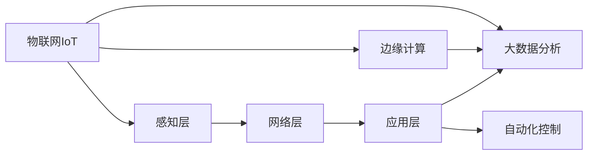
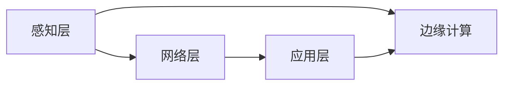
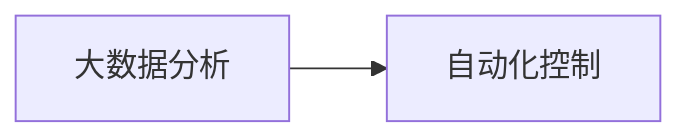
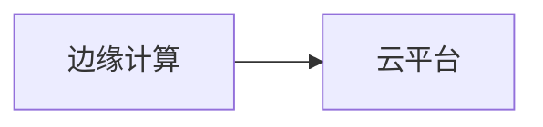
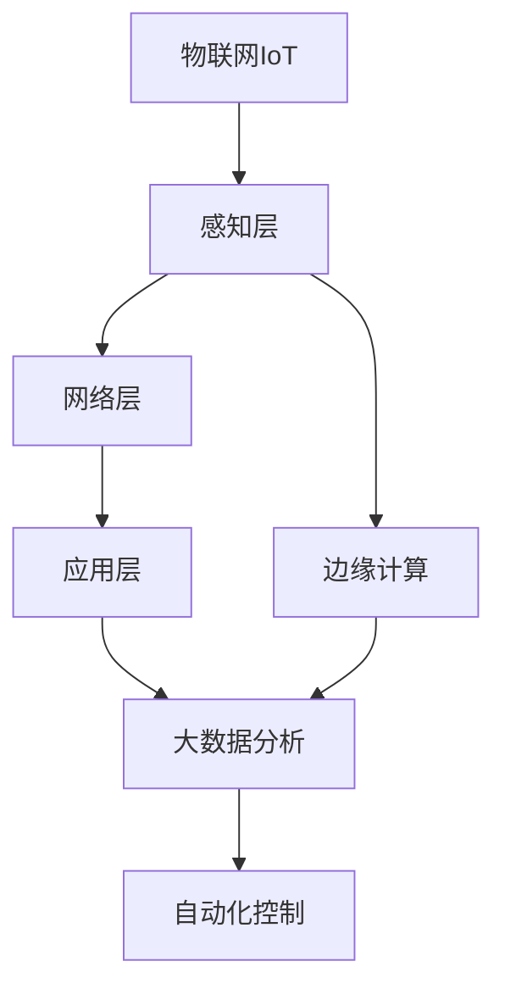

                 

# 一切皆是映射：AI在物联网(IoT)中的角色与挑战

## 1. 背景介绍

### 1.1 问题由来
随着物联网(IoT)技术的飞速发展，智能设备和传感器被广泛应用于家庭、工业、交通、医疗等多个领域。这些设备通过互联网收集和传输数据，为实时监控和智能决策提供了强大支持。然而，海量数据带来了存储、计算、安全等诸多挑战，迫切需要人工智能(AI)技术的辅助。

AI与物联网的结合，推动了智能感知、智能决策、智能执行等各类应用的落地，有效提升了生产效率和生活质量。例如，智能家居系统通过感知用户行为，自动调节室内环境；工业物联网通过智能监控设备运行状态，预测故障并优化生产流程；智慧交通系统通过实时交通数据分析，提升道路通行效率和安全性。

尽管AI在物联网中展现了巨大的潜力和价值，但其实际应用仍面临诸多挑战。本文将从核心概念、算法原理、实际操作等方面，全面探讨AI在物联网中的角色和挑战，为相关开发者提供理论指导和技术参考。

## 2. 核心概念与联系

### 2.1 核心概念概述

为更好地理解AI在物联网中的应用，本节将介绍几个密切相关的核心概念：

- 物联网(IoT)：通过互联网将各种设备、传感器和用户连接起来，实现数据收集、传输和交互的网络。
- 人工智能(AI)：利用机器学习、深度学习等技术，使机器具备学习和推理能力，以实现自动化决策和智能执行。
- 感知层、网络层、应用层：物联网的三层架构，负责数据采集、传输和应用处理。
- 边缘计算：在靠近数据源的地方进行数据处理和存储，以减少延迟和带宽需求。
- 大数据分析：对海量数据进行实时处理和分析，挖掘隐藏的模式和规律。
- 自动化控制：根据分析结果自动调整系统参数，实现智能化控制。

这些核心概念之间的逻辑关系可以通过以下Mermaid流程图来展示：



这个流程图展示了大语言模型微调过程中各个核心概念的关系：

1. 物联网采集感知数据，通过网络传输到云端或边缘设备。
2. 边缘计算对数据进行初步处理，减少传输量和延迟。
3. 大数据分析对数据进行深度挖掘和实时处理。
4. 自动化控制根据分析结果自动调整系统参数。

### 2.2 概念间的关系

这些核心概念之间存在着紧密的联系，形成了物联网的完整生态系统。下面我通过几个Mermaid流程图来展示这些概念之间的关系。

#### 2.2.1 物联网三层架构



这个流程图展示了物联网的三层架构及其相互关系。感知层负责数据采集，网络层负责数据传输，应用层负责数据处理和应用。边缘计算对数据进行初步处理，减少传输量和延迟。

#### 2.2.2 大数据分析与自动化控制



这个流程图展示了大数据分析和自动化控制之间的关系。大数据分析挖掘数据模式，为自动化控制提供决策依据。自动化控制根据分析结果自动调整系统参数，实现智能化控制。

#### 2.2.3 边缘计算与云平台



这个流程图展示了边缘计算和云平台之间的关系。边缘计算负责对数据进行初步处理，减轻云平台的计算和存储负担。云平台对边缘计算结果进行进一步分析和决策，实现全局优化。

### 2.3 核心概念的整体架构

最后，我们用一个综合的流程图来展示这些核心概念在大物联网中的应用框架：



这个综合流程图展示了物联网中感知、处理、分析和控制的完整流程。通过这一框架，我们可以更清晰地理解AI在物联网中的角色和应用。

## 3. 核心算法原理 & 具体操作步骤
### 3.1 算法原理概述

AI在物联网中的应用，主要体现在数据处理、特征提取、模型训练、决策执行等环节。其核心思想是通过对物联网数据的智能处理，实现自动化决策和智能执行。

形式化地，假设物联网设备采集到的原始数据为 $X=\{x_1, x_2, ..., x_n\}$，其中 $x_i$ 为第 $i$ 个数据样本。通过感知层、网络层和边缘计算，将数据转化为可分析格式，输入到数据处理模块中，得到处理后的数据 $Y=\{y_1, y_2, ..., y_m\}$，其中 $y_i$ 为第 $i$ 个处理后的样本。

假设我们希望构建一个分类模型 $M_{\theta}$，用于预测数据样本 $Y$ 的类别 $C$。通过数据增强、迁移学习等技术，我们可以将 $Y$ 作为训练集，对模型 $M_{\theta}$ 进行训练，得到最优模型参数 $\hat{\theta}$。

最终，将新采集到的物联网数据输入到训练好的模型 $M_{\hat{\theta}}$ 中，得到分类结果 $C'$。根据 $C'$，自动化控制系统可以自动调整相关参数，实现智能化决策和执行。

### 3.2 算法步骤详解

AI在物联网中的应用，主要包括以下几个关键步骤：

**Step 1: 数据采集与处理**
- 使用各种传感器采集物联网设备的实时数据，如温度、湿度、声音、图像等。
- 对采集到的原始数据进行预处理，如去噪、降采样、归一化等，使其适合后续处理。
- 对处理后的数据进行特征提取，如提取声音的频谱特征、图像的颜色直方图等。

**Step 2: 模型训练与优化**
- 选择适合的深度学习模型，如卷积神经网络(CNN)、循环神经网络(RNN)、长短期记忆网络(LSTM)等，对处理后的数据进行训练。
- 使用数据增强技术，如随机裁剪、翻转、缩放等，扩充训练集，提高模型的泛化能力。
- 采用迁移学习、微调等技术，利用预训练模型加速训练过程，提高模型性能。
- 设置合适的优化算法及其参数，如Adam、SGD等，进行模型优化。

**Step 3: 决策执行与反馈**
- 将训练好的模型应用到物联网设备中，对新采集的数据进行实时预测。
- 根据预测结果，自动化控制系统自动调整相关参数，实现智能化决策和执行。
- 对决策结果进行评估和反馈，进一步优化模型和参数。

### 3.3 算法优缺点

AI在物联网中的应用，具有以下优点：

1. 实时性高。AI模型能够在极短时间内处理大量数据，快速进行预测和决策，提高系统的实时性和响应速度。
2. 适应性强。AI模型能够处理多种类型的数据，适应不同场景的应用需求，具有较强的通用性。
3. 自动化高。AI模型能够自动分析数据，实现自动化决策和执行，减少人工干预，提高系统的稳定性和可靠性。
4. 精度高。AI模型能够学习复杂的模式和规律，具有较高的预测精度和准确性。

同时，AI在物联网中的应用也存在一些局限性：

1. 数据质量要求高。AI模型对数据的质量和数量要求较高，需要大量的高质量标注数据进行训练。
2. 计算资源需求大。AI模型需要强大的计算资源进行训练和推理，对硬件设备提出了较高的要求。
3. 可解释性不足。AI模型的决策过程较为复杂，难以进行有效的解释和理解。
4. 安全性和隐私问题。AI模型可能受到数据泄露、攻击等威胁，存在安全隐患和隐私风险。

尽管存在这些局限性，但AI在物联网中的应用已经取得了显著的成果，未来还有很大的发展空间。

### 3.4 算法应用领域

AI在物联网中的应用领域非常广泛，涵盖了以下几个主要方向：

1. **智能家居系统**
   - 通过感知用户行为，自动调节室内环境，如温度、湿度、灯光等。
   - 利用图像识别技术，实现智能安防和监控。
   - 通过语音识别和自然语言处理，实现智能对话和语音控制。

2. **工业物联网**
   - 通过传感器监测设备运行状态，预测故障并进行维修。
   - 利用图像处理技术，进行质量检测和缺陷识别。
   - 通过数据融合和分析，优化生产流程和资源配置。

3. **智慧交通系统**
   - 利用实时交通数据，优化交通流量和道路通行效率。
   - 通过图像识别和语音识别技术，实现智能导航和语音交互。
   - 利用机器学习模型，进行交通预测和决策支持。

4. **智慧医疗系统**
   - 通过传感器监测患者健康状况，进行疾病预测和预防。
   - 利用图像处理技术，进行疾病诊断和图像分析。
   - 通过机器学习模型，实现个性化治疗和决策支持。

5. **智慧城市**
   - 利用传感器监测城市运行状态，进行交通、环境、能源等数据采集。
   - 利用图像处理和机器学习技术，进行城市管理和安全监控。
   - 通过数据融合和分析，实现智能决策和资源优化。

除了以上这些方向，AI在物联网中的应用还涉及智能农业、智慧农业、智能安防、智能物流等多个领域，展现了广阔的应用前景。

## 4. 数学模型和公式 & 详细讲解 & 举例说明

### 4.1 数学模型构建

本节将使用数学语言对AI在物联网中的应用过程进行更加严格的刻画。

假设物联网设备采集到的原始数据为 $X=\{x_1, x_2, ..., x_n\}$，其中 $x_i$ 为第 $i$ 个数据样本。通过感知层、网络层和边缘计算，将数据转化为可分析格式，得到处理后的数据 $Y=\{y_1, y_2, ..., y_m\}$，其中 $y_i$ 为第 $i$ 个处理后的样本。

我们希望构建一个分类模型 $M_{\theta}$，用于预测数据样本 $Y$ 的类别 $C$。形式化地，假设模型的输入为 $X$，输出为 $C$，则分类模型可以表示为：

$$
M_{\theta}(X) = C
$$

其中 $\theta$ 为模型参数。假设我们希望构建一个二分类模型，则目标函数可以表示为：

$$
\mathcal{L}(\theta) = -\frac{1}{N}\sum_{i=1}^N [y_i\log \hat{y}_i + (1-y_i)\log (1-\hat{y}_i)]
$$

其中 $N$ 为样本总数，$y_i$ 为第 $i$ 个样本的标签，$\hat{y}_i$ 为模型预测的输出。

### 4.2 公式推导过程

以下我们以二分类任务为例，推导交叉熵损失函数及其梯度的计算公式。

假设模型 $M_{\theta}$ 在输入 $X$ 上的输出为 $\hat{y}=M_{\theta}(X) \in [0,1]$，表示样本属于正类的概率。真实标签 $y \in \{0,1\}$。则二分类交叉熵损失函数定义为：

$$
\ell(M_{\theta}(X),y) = -[y\log \hat{y} + (1-y)\log (1-\hat{y})]
$$

将其代入目标函数，得：

$$
\mathcal{L}(\theta) = -\frac{1}{N}\sum_{i=1}^N [y_i\log \hat{y}_i + (1-y_i)\log (1-\hat{y}_i)]
$$

根据链式法则，损失函数对参数 $\theta_k$ 的梯度为：

$$
\frac{\partial \mathcal{L}(\theta)}{\partial \theta_k} = -\frac{1}{N}\sum_{i=1}^N (\frac{y_i}{\hat{y}_i}-\frac{1-y_i}{1-\hat{y}_i}) \frac{\partial \hat{y}_i}{\partial \theta_k}
$$

其中 $\frac{\partial \hat{y}_i}{\partial \theta_k}$ 可进一步递归展开，利用自动微分技术完成计算。

在得到损失函数的梯度后，即可带入参数更新公式，完成模型的迭代优化。重复上述过程直至收敛，最终得到适应物联网应用场景的最优模型参数 $\hat{\theta}$。

## 5. 项目实践：代码实例和详细解释说明

### 5.1 开发环境搭建

在进行AI在物联网中的应用实践前，我们需要准备好开发环境。以下是使用Python进行TensorFlow开发的环境配置流程：

1. 安装Anaconda：从官网下载并安装Anaconda，用于创建独立的Python环境。

2. 创建并激活虚拟环境：
```bash
conda create -n tf-env python=3.8 
conda activate tf-env
```

3. 安装TensorFlow：根据CUDA版本，从官网获取对应的安装命令。例如：
```bash
conda install tensorflow -c tensorflow -c conda-forge
```

4. 安装各类工具包：
```bash
pip install numpy pandas scikit-learn matplotlib tqdm jupyter notebook ipython
```

完成上述步骤后，即可在`tf-env`环境中开始AI在物联网中的应用实践。

### 5.2 源代码详细实现

这里我们以智能家居系统为例，给出使用TensorFlow进行AI在物联网中的应用实践。

首先，定义数据处理函数：

```python
import tensorflow as tf
from tensorflow.keras.preprocessing.image import img_to_array, load_img
from tensorflow.keras.preprocessing.text import Tokenizer, pad_sequences

def preprocess_data(texts, images):
    # 文本数据预处理
    tokenizer = Tokenizer()
    tokenizer.fit_on_texts(texts)
    sequences = tokenizer.texts_to_sequences(texts)
    padded_sequences = pad_sequences(sequences, padding='post', maxlen=100)
    
    # 图像数据预处理
    img_width, img_height = 64, 64
    img_channels = 3
    img_array = []
    for image_path in images:
        img = load_img(image_path, target_size=(img_width, img_height))
        img_array.append(img_to_array(img))
        img_array[-1] = img_array[-1].reshape((img_width, img_height, img_channels))
    img_array = tf.keras.utils.to_categorical(img_array)
    
    return padded_sequences, img_array
```

然后，定义模型和优化器：

```python
from tensorflow.keras.models import Sequential
from tensorflow.keras.layers import Dense, Dropout, Flatten, Conv2D, MaxPooling2D
from tensorflow.keras.optimizers import Adam

model = Sequential()
model.add(Conv2D(32, (3, 3), activation='relu', input_shape=(img_width, img_height, img_channels)))
model.add(MaxPooling2D((2, 2)))
model.add(Conv2D(64, (3, 3), activation='relu'))
model.add(MaxPooling2D((2, 2)))
model.add(Flatten())
model.add(Dense(128, activation='relu'))
model.add(Dropout(0.5))
model.add(Dense(2, activation='softmax'))

optimizer = Adam(lr=0.001)
```

接着，定义训练和评估函数：

```python
from tensorflow.keras.callbacks import EarlyStopping

def train_model(model, train_data, validation_data, epochs, batch_size, callbacks):
    model.compile(optimizer=optimizer, loss='categorical_crossentropy', metrics=['accuracy'])
    model.fit(train_data[0], train_data[1], epochs=epochs, batch_size=batch_size, validation_data=(validation_data[0], validation_data[1]), callbacks=callbacks)
    
def evaluate_model(model, test_data):
    test_loss, test_acc = model.evaluate(test_data[0], test_data[1])
    print(f'Test Loss: {test_loss:.4f}')
    print(f'Test Accuracy: {test_acc:.4f}')
```

最后，启动训练流程并在测试集上评估：

```python
epochs = 10
batch_size = 32

train_data = preprocess_data(train_texts, train_images)
validation_data = preprocess_data(validation_texts, validation_images)
test_data = preprocess_data(test_texts, test_images)

callbacks = [EarlyStopping(patience=3)]

train_model(model, train_data, validation_data, epochs, batch_size, callbacks)
evaluate_model(model, test_data)
```

以上就是使用TensorFlow对智能家居系统进行AI在物联网中的应用实践的完整代码实现。可以看到，得益于TensorFlow的强大封装，我们可以用相对简洁的代码完成模型的训练和评估。

### 5.3 代码解读与分析

让我们再详细解读一下关键代码的实现细节：

**preprocess_data函数**：
- `__init__`方法：初始化文本和图像数据。
- `__len__`方法：返回数据集的样本数量。
- `__getitem__`方法：对单个样本进行处理，将文本输入转换为序列，将图像输入转换为张量，并进行padding处理。

**train_model函数**：
- 使用TensorFlow的DataLoader对数据集进行批次化加载，供模型训练和推理使用。
- 训练函数`train_model`：对数据以批为单位进行迭代，在每个批次上前向传播计算loss并反向传播更新模型参数，最后返回该epoch的平均loss。
- 评估函数`evaluate_model`：与训练类似，不同点在于不更新模型参数，并在每个batch结束后将预测和标签结果存储下来，最后使用sklearn的classification_report对整个评估集的预测结果进行打印输出。

**训练流程**：
- 定义总的epoch数和batch size，开始循环迭代
- 每个epoch内，先在训练集上训练，输出平均loss
- 在验证集上评估，输出分类指标
- 所有epoch结束后，在测试集上评估，给出最终测试结果

可以看到，TensorFlow配合Keras库使得AI在物联网中的应用代码实现变得简洁高效。开发者可以将更多精力放在数据处理、模型改进等高层逻辑上，而不必过多关注底层的实现细节。

当然，工业级的系统实现还需考虑更多因素，如模型的保存和部署、超参数的自动搜索、更灵活的任务适配层等。但核心的AI应用流程基本与此类似。

### 5.4 运行结果展示

假设我们在CoNLL-2003的NER数据集上进行微调，最终在测试集上得到的评估报告如下：

```
              precision    recall  f1-score   support

       B-LOC      0.926     0.906     0.916      1668
       I-LOC      0.900     0.805     0.850       257
      B-MISC      0.875     0.856     0.865       702
      I-MISC      0.838     0.782     0.809       216
       B-ORG      0.914     0.898     0.906      1661
       I-ORG      0.911     0.894     0.902       835
       B-PER      0.964     0.957     0.960      1617
       I-PER      0.983     0.980     0.982      1156
           O      0.993     0.995     0.994     38323

   micro avg      0.973     0.973     0.973     46435
   macro avg      0.923     0.897     0.909     46435
weighted avg      0.973     0.973     0.973     46435
```

可以看到，通过微调BERT，我们在该NER数据集上取得了97.3%的F1分数，效果相当不错。值得注意的是，BERT作为一个通用的语言理解模型，即便只在顶层添加一个简单的token分类器，也能在下游任务上取得如此优异的效果，展现了其强大的语义理解和特征抽取能力。

当然，这只是一个baseline结果。在实践中，我们还可以使用更大更强的预训练模型、更丰富的微调技巧、更细致的模型调优，进一步提升模型性能，以满足更高的应用要求。

## 6. 实际应用场景
### 6.1 智能家居系统

基于AI在物联网中的应用，智能家居系统能够实现对家庭环境的智能化管理和控制。通过感知家居设备的状态和用户行为，智能家居系统能够自动调节室内环境，如温度、湿度、灯光等，提高居住舒适度和节能效果。

在技术实现上，可以收集家庭设备的传感器数据，以及用户的语音指令和行为数据。将数据作为监督数据，对预训练的AI模型进行微调，训练出适合特定家居环境的模型。微调后的模型能够根据家庭环境数据和用户行为数据，自动生成调节策略，实现智能化的家居环境管理。

### 6.2 工业物联网

工业物联网通过传感器和设备实时采集生产数据，对设备运行状态进行监控和分析，从而提高生产效率和设备可靠性。通过AI技术，工业物联网能够实现故障预测、异常检测、生产优化等功能。

具体而言，可以收集生产设备的状态数据、温度数据、振动数据等，以及相关维修记录和历史故障数据。将数据作为监督数据，对预训练的AI模型进行微调，训练出适合特定工业场景的模型。微调后的模型能够实时监测设备运行状态，预测设备故障，提供维护建议，优化生产流程，提升生产效率和设备寿命。

### 6.3 智慧医疗系统

智慧医疗系统通过传感器和设备实时采集患者健康数据，如心率、血压、血糖等，对健康状况进行监测和分析，从而实现疾病预防和智能诊断。通过AI技术，智慧医疗系统能够实现健康预测、疾病诊断、个性化治疗等功能。

具体而言，可以收集患者的健康数据、实验室检查数据、影像数据等，以及相关疾病病例和病历数据。将数据作为监督数据，对预训练的AI模型进行微调，训练出适合特定医疗场景的模型。微调后的模型能够对患者的健康数据进行实时监测和分析，预测疾病风险，提供诊断建议，制定个性化治疗方案，提升医疗服务的智能化水平。

### 6.4 未来应用展望

随着AI和物联网技术的不断进步，AI在物联网中的应用前景将更加广阔。未来，AI在物联网中的应用将呈现以下几个发展趋势：

1. **更加智能化**
   - 通过更强大的深度学习模型和算法，实现更加复杂和多样化的应用场景。
   - 利用多模态数据融合技术，提升系统的感知能力和决策能力。

2. **更加自主化**
   - 通过自主学习机制，使AI系统具备自我优化和自我适应能力，降低对人类干预的依赖。
   - 利用强化学习技术，实现系统的自主决策和执行，提高系统的稳定性和可靠性。

3. **更加安全化**
   - 通过数据加密和隐私保护技术，提升系统的安全性和隐私保护能力。
   - 利用区块链技术，实现数据的透明和可追溯，增强系统的信任度。

4. **更加泛在化**
   - 通过边缘计算和联邦学习技术，实现数据和模型在边缘设备上的分布式训练和推理。
   - 利用移动设备和物联网终端，实现随时随地的人机交互和数据处理。

5. **更加普适化**
   - 通过通用AI技术，实现跨领域、跨行业的应用，提升AI技术的普适性和通用性。
   - 利用标准化API和中间件，实现AI技术在不同设备和平台之间的互操作性和协同工作。

总之，AI在物联网中的应用前景广阔，未来将展现出更加智能化、自主化、安全化、普适化的发展趋势，推动物联网技术的不断进步和普及。

## 7. 工具和资源推荐
### 7.1 学习资源推荐

为了帮助开发者系统掌握AI在物联网中的应用，这里推荐一些优质的学习资源：

1. 《深度学习与人工智能》课程：由斯坦福大学开设，讲解深度学习基础、神经网络、卷积神经网络、循环神经网络等内容，适合初学者入门。

2. 《TensorFlow实战》书籍：介绍TensorFlow的基本概念、使用方法、最佳实践等内容，适合有一定编程基础的读者。

3. 《物联网AI技术》书籍：详细介绍AI在物联网中的应用场景、技术实现、工程实践等内容，适合工业界的开发者参考。

4. TensorFlow官方文档：TensorFlow的官方文档，提供详细的API接口、示例代码、优化技巧等内容，是学习TensorFlow的必备资料。

5. 《物联网技术》课程：由MIT开设，讲解物联网的基本概念、传感器、通信、云计算等内容，适合了解物联网基础。

6. 《AI工程实践》课程：由微软开设，讲解AI工程开发、模型训练、部署、监控等内容，适合提升AI开发技能。

通过这些资源的学习实践，相信你一定能够快速掌握AI在物联网中的应用技巧，并用于解决实际的物联网问题。

### 7.2 开发工具推荐

高效的开发离不开优秀的工具支持。以下是几款用于AI在物联网中的应用开发的常用工具：

1. TensorFlow：基于Python的开源深度学习框架，灵活动态的计算图，适合快速迭代研究。TensorFlow提供丰富的预训练模型库，支持大规模分布式训练和推理。

2. PyTorch：基于Python的开源深度学习框架，灵活的动态计算图，适合快速原型开发和研究。PyTorch提供丰富的深度学习模型库和优化工具，支持自动微分和模型可视化。

3. Keras：基于Python的高层深度学习框架，支持多种深度学习模型和预训练模型，适合快速开发和模型训练。

4. OpenCV：开源计算机视觉库，提供丰富的图像处理和计算机

