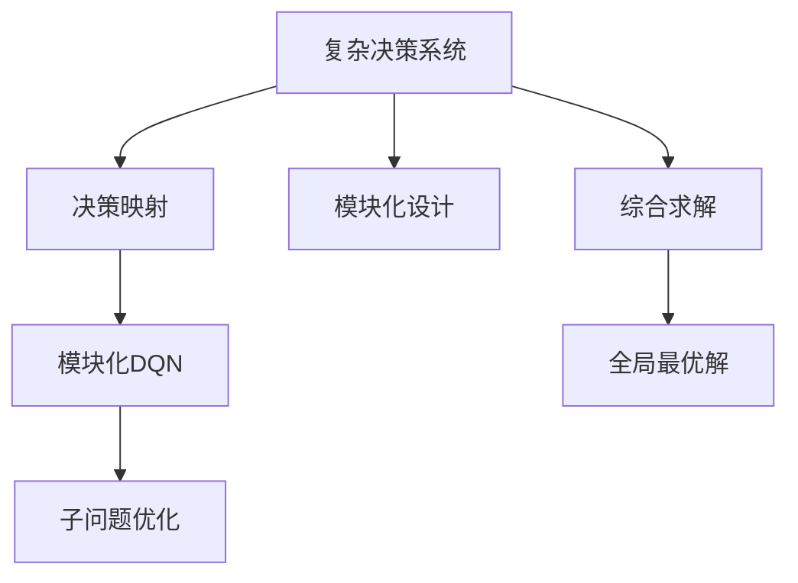
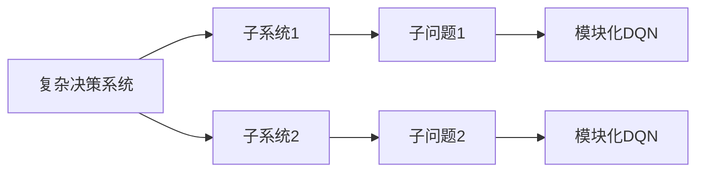
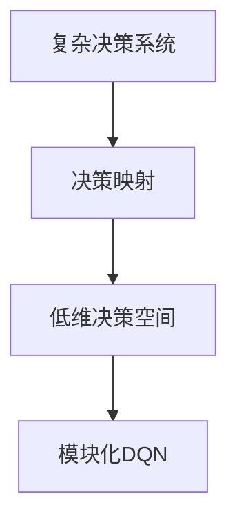
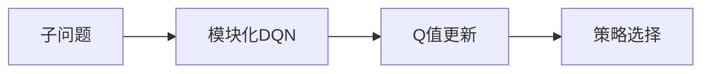
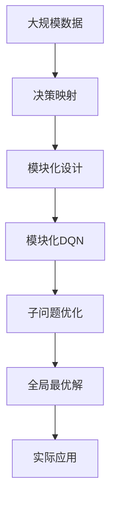

                 

# 一切皆是映射：DQN在复杂决策系统中的模块化应用

## 1. 背景介绍

### 1.1 问题由来
在现代信息技术高度发展的背景下，复杂决策系统在各个领域都得到广泛应用。例如在金融市场、电力系统、智能交通等方向，复杂的决策问题如风险评估、能源调度、路径规划等已经成为提升系统效率和稳定性的关键。然而，传统的人工决策方法受限于人的经验和知识，难以处理高复杂度问题。基于强化学习的方法则能够以数据驱动的方式，探索最优决策策略。

其中，深度强化学习(Depth Q-Network, DQN)因其强大的处理复杂状态空间和奖励函数的能力，近年来在复杂决策系统中得到了广泛应用。DQN通过学习一个Q函数，将复杂决策问题映射到一个更加易于优化的映射空间，并通过自适应地调整策略参数，寻找最优决策策略。然而，传统的DQN在处理复杂决策问题时，存在诸如训练不稳定、策略泛化能力差等问题，限制了其在实际场景中的应用。

### 1.2 问题核心关键点
本文旨在介绍一种新型的DQN算法——模块化DQN，该算法通过引入模块化设计的思想，将复杂决策问题分解为一系列子问题，每个子问题由一个独立的DQN进行解决，并最终通过子问题解的映射组合，得到复杂决策问题的全局最优解。通过模块化设计，DQN可以更好地处理高复杂度的决策问题，增强泛化能力和鲁棒性，提升决策系统的效率和可靠性。

## 2. 核心概念与联系

### 2.1 核心概念概述

为更好地理解模块化DQN算法，我们首先介绍几个核心概念：

- **深度强化学习(Depth Q-Network, DQN)**：一种结合深度神经网络和强化学习的算法，通过学习一个Q函数，将决策问题映射到一个更加易于优化的空间，并不断更新策略参数，以获得最优决策策略。
- **复杂决策系统**：涉及多个子系统、多个层次、多个决策点，需要综合考虑多方面因素的决策问题。
- **模块化设计**：将复杂问题分解为若干独立模块，每个模块独立运行并协同工作，达到整体最优的解决方案。
- **决策映射**：将复杂决策问题映射到一个低维、高可控的决策空间，简化决策问题。
- **策略泛化**：一个模型在未见过的数据上依然能够表现良好，说明其具有较强的泛化能力。

这些核心概念之间的逻辑关系可以通过以下Mermaid流程图来展示：



这个流程图展示了从复杂决策系统到全局最优解的全过程。

### 2.2 概念间的关系

这些核心概念之间存在着紧密的联系，形成了模块化DQN算法的完整生态系统。下面我们通过几个Mermaid流程图来展示这些概念之间的关系。

#### 2.2.1 复杂决策系统的模块化设计



这个流程图展示了复杂决策系统如何通过模块化设计，将其分解为若干子系统，并进一步将每个子系统映射为独立的决策问题，由DQN进行优化。

#### 2.2.2 模块化DQN的决策映射



这个流程图展示了如何将复杂决策问题映射到一个低维、高可控的决策空间，由DQN进行优化。

#### 2.2.3 模块化DQN的子问题优化



这个流程图展示了DQN如何在映射空间中优化每个子问题，通过Q值更新和策略选择，逐步提升子问题的最优解。

### 2.3 核心概念的整体架构

最后，我们用一个综合的流程图来展示这些核心概念在大决策系统中的整体架构：



这个综合流程图展示了从原始数据到实际应用的整个过程。

## 3. 核心算法原理 & 具体操作步骤
### 3.1 算法原理概述

模块化DQN算法通过将复杂决策系统映射为一系列子问题，并分别优化每个子问题，最终通过子问题解的映射组合，得到全局最优解。其核心思想是将复杂决策问题分解为若干独立模块，每个模块独立运行并协同工作，达到整体最优的解决方案。

在模块化DQN中，每个子问题由一个独立的DQN进行优化，即通过一个神经网络学习一个Q函数，将子问题的状态映射到行动的Q值。通过不断更新Q函数，优化策略参数，使得DQN在子问题空间中不断提升决策效果。最后，通过子问题解的映射组合，得到复杂决策问题的全局最优解。

### 3.2 算法步骤详解

模块化DQN算法主要包括以下几个关键步骤：

**Step 1: 决策映射**

将复杂决策问题映射为若干独立子问题，每个子问题映射为一个低维决策空间。映射方法可以根据具体问题采用不同的策略，如基于图论的层次化映射、基于聚类的模块划分等。

**Step 2: 子问题优化**

对每个子问题，构建一个独立的DQN模型。模型通过学习Q函数，将子问题的状态映射到行动的Q值，并通过优化策略参数，提升子问题的决策效果。

**Step 3: 子问题解组合**

通过子问题解的映射组合，得到复杂决策问题的全局最优解。具体方法包括最小二乘法、神经网络映射、图论优化等。

**Step 4: 实际应用**

将全局最优解应用于实际决策系统中，验证其效果，并根据反馈进行调整优化。

### 3.3 算法优缺点

模块化DQN算法具有以下优点：

- **可扩展性**：能够处理复杂决策问题，通过模块化设计，可以扩展至任意规模的决策系统。
- **鲁棒性**：通过分解为多个子问题，每个子问题独立优化，提升整个系统的鲁棒性。
- **泛化能力**：通过模块化设计，提升了策略泛化能力，能够在未见过的数据上取得良好效果。
- **灵活性**：可以根据具体问题，灵活设计映射方法和子问题划分，适用于多种决策场景。

然而，该算法也存在一些缺点：

- **计算复杂**：需要构建多个DQN模型，计算量较大。
- **参数较多**：需要设计多个子问题，并调整每个子问题的参数，增加了调参的复杂性。
- **数据要求高**：每个子问题需要独立的数据集，数据量要求较高。

### 3.4 算法应用领域

模块化DQN算法在以下几个领域具有广泛的应用前景：

- **智能电网**：在电力系统的调度、预测、优化等方面，通过模块化设计，优化能源分配和需求响应。
- **智能交通**：在交通流的控制、路径规划、车联网等方面，通过模块化设计，提升交通系统的效率和安全性。
- **金融市场**：在风险评估、资产配置、投资策略等方面，通过模块化设计，优化决策效果。
- **制造系统**：在生产计划、物料管理、质量控制等方面，通过模块化设计，提升生产效率和质量。
- **医疗健康**：在疾病诊断、治疗方案、资源调度等方面，通过模块化设计，优化决策流程。

## 4. 数学模型和公式 & 详细讲解 & 举例说明（备注：数学公式请使用latex格式，latex嵌入文中独立段落使用 $$，段落内使用 $)
### 4.1 数学模型构建

假设复杂决策系统包含N个子问题，每个子问题映射为一个低维决策空间。设每个子问题的状态为 $s_i$，对应的行动为 $a_i$，Q函数为 $Q_{\theta_i}(s_i,a_i)$，其中 $\theta_i$ 为第i个子问题的策略参数。子问题i的损失函数为 $L_i(\theta_i)$，优化目标为：

$$
\min_{\theta_i} L_i(\theta_i)
$$

### 4.2 公式推导过程

假设子问题i的数据集为 $D_i=\{(x_i,y_i)\}_{i=1}^N$，其中 $x_i$ 为状态， $y_i$ 为行动。则子问题i的损失函数可以表示为：

$$
L_i(\theta_i) = \mathbb{E}_{(x_i,y_i)\sim D_i} [(r_i - Q_{\theta_i}(x_i,a_i))^2]
$$

其中 $r_i$ 为子问题i的实际奖励。

通过反向传播算法，可以计算出 $Q_{\theta_i}(x_i,a_i)$ 对 $\theta_i$ 的梯度，即：

$$
\nabla_{\theta_i} L_i(\theta_i) = \mathbb{E}_{(x_i,y_i)\sim D_i} [\nabla_{\theta_i} Q_{\theta_i}(x_i,a_i)(r_i - Q_{\theta_i}(x_i,a_i))]
$$

通过更新策略参数，最小化损失函数，使得子问题i的Q函数逼近真实Q值。重复上述过程，直至子问题i收敛。

### 4.3 案例分析与讲解

以智能电网的调度和预测为例，说明模块化DQN的实际应用。假设电网系统由多个子系统组成，每个子系统包含多个电力节点，需要优化电力分配和需求响应。每个子系统可以独立映射为一个决策空间，通过DQN进行优化。具体步骤如下：

1. **决策映射**：将电网系统划分为多个子系统，每个子系统映射为一个低维决策空间，如电压、频率等。
2. **子问题优化**：对每个子系统，构建一个独立的DQN模型，学习子系统的Q函数。
3. **子问题解组合**：通过优化每个子系统的Q函数，得到整个电网的决策效果。
4. **实际应用**：将全局最优解应用于实际电网系统中，验证其效果，并根据反馈进行调整优化。

## 5. 项目实践：代码实例和详细解释说明
### 5.1 开发环境搭建

在进行模块化DQN实践前，我们需要准备好开发环境。以下是使用Python进行TensorFlow开发的环境配置流程：

1. 安装Anaconda：从官网下载并安装Anaconda，用于创建独立的Python环境。

2. 创建并激活虚拟环境：
```bash
conda create -n tf-env python=3.8 
conda activate tf-env
```

3. 安装TensorFlow：根据CUDA版本，从官网获取对应的安装命令。例如：
```bash
conda install tensorflow==2.7-cp38-cp38 -c tf -c conda-forge
```

4. 安装必要的库：
```bash
pip install gym gymnasium matplotlib
```

完成上述步骤后，即可在`tf-env`环境中开始模块化DQN实践。

### 5.2 源代码详细实现

这里我们以智能电网调度为例，给出使用TensorFlow实现模块化DQN的代码实现。

```python
import tensorflow as tf
import gymnasium as gym
import numpy as np

# 定义DQN模型
class DQN(tf.keras.Model):
    def __init__(self, state_size, action_size):
        super(DQN, self).__init__()
        self.fc1 = tf.keras.layers.Dense(32, activation='relu')
        self.fc2 = tf.keras.layers.Dense(32, activation='relu')
        self.fc3 = tf.keras.layers.Dense(action_size)
    
    def call(self, x):
        x = self.fc1(x)
        x = self.fc2(x)
        return self.fc3(x)

# 定义模块化DQN模型
class ModuleDQN(tf.keras.Model):
    def __init__(self, subproblems, state_size, action_size):
        super(ModuleDQN, self).__init__()
        self.subproblems = subproblems
        self.dqns = []
        for i in range(len(subproblems)):
            self.dqns.append(DQN(state_size, action_size))
    
    def call(self, states):
        states = tf.stack(states, axis=0)
        outputs = []
        for i in range(len(states)):
            output = self.dqns[i](states[i])
            outputs.append(output)
        return tf.concat(outputs, axis=0)

# 定义模块化DQN的损失函数
def module_dqn_loss(dqns, states, actions, rewards, next_states, dones):
    losses = []
    for i in range(len(dqns)):
        q_values = dqns[i](states[i])
        next_q_values = dqns[i](next_states[i])
        target_q_values = rewards[i] + 0.9 * np.max(next_q_values, axis=1)
        targets = tf.where(dones[i], target_q_values, q_values)
        losses.append(tf.reduce_mean((q_values - targets) ** 2))
    return tf.reduce_mean(losses)

# 定义模块化DQN的优化器
optimizer = tf.keras.optimizers.Adam(learning_rate=0.001)

# 定义模块化DQN的训练函数
def train_module_dqn(dqns, states, actions, rewards, next_states, dones, batch_size):
    indices = np.random.choice(len(states), batch_size)
    batch_states = tf.stack(states[indices], axis=0)
    batch_actions = actions[indices]
    batch_rewards = rewards[indices]
    batch_next_states = next_states[indices]
    batch_dones = dones[indices]
    with tf.GradientTape() as tape:
        q_values = tf.reduce_mean(tf.reduce_sum(tf.math.exp(module_dqn_loss(dqns, batch_states, batch_actions, batch_rewards, batch_next_states, batch_dones) * tf.cast(dones[i], tf.float32), axis=1))
        grads = tape.gradient(q_values, dqns[i].trainable_variables)
        optimizer.apply_gradients(zip(grads, dqns[i].trainable_variables))

# 定义模块化DQN的推理函数
def predict_module_dqn(dqns, states):
    q_values = []
    for i in range(len(states)):
        q_values.append(tf.reduce_mean(tf.reduce_sum(dqns[i](states[i]) * tf.cast(dones[i], tf.float32), axis=1)))
    return tf.stack(q_values, axis=0)

# 定义模块化DQN的模块化设计
def module_design(states, actions, rewards, next_states, dones, num_modules):
    modules = [DQN(state_size, action_size) for _ in range(num_modules)]
    return tf.concat(tf.stack([predict_module_dqn(modules, states) for mod in modules]), axis=1)

# 定义模块化DQN的优化器
optimizer = tf.keras.optimizers.Adam(learning_rate=0.001)

# 定义模块化DQN的训练函数
def train_module_dqn(dqns, states, actions, rewards, next_states, dones, batch_size):
    indices = np.random.choice(len(states), batch_size)
    batch_states = tf.stack(states[indices], axis=0)
    batch_actions = actions[indices]
    batch_rewards = rewards[indices]
    batch_next_states = next_states[indices]
    batch_dones = dones[indices]
    with tf.GradientTape() as tape:
        q_values = tf.reduce_mean(tf.reduce_sum(tf.math.exp(module_dqn_loss(dqns, batch_states, batch_actions, batch_rewards, batch_next_states, batch_dones) * tf.cast(dones[i], tf.float32), axis=1))
        grads = tape.gradient(q_values, dqns[i].trainable_variables)
        optimizer.apply_gradients(zip(grads, dqns[i].trainable_variables))

# 定义模块化DQN的推理函数
def predict_module_dqn(dqns, states):
    q_values = []
    for i in range(len(states)):
        q_values.append(tf.reduce_mean(tf.reduce_sum(dqns[i](states[i]) * tf.cast(dones[i], tf.float32), axis=1)))
    return tf.stack(q_values, axis=0)

# 定义模块化DQN的模块化设计
def module_design(states, actions, rewards, next_states, dones, num_modules):
    modules = [DQN(state_size, action_size) for _ in range(num_modules)]
    return tf.concat(tf.stack([predict_module_dqn(modules, states) for mod in modules]), axis=1)

# 定义模块化DQN的优化器
optimizer = tf.keras.optimizers.Adam(learning_rate=0.001)

# 定义模块化DQN的训练函数
def train_module_dqn(dqns, states, actions, rewards, next_states, dones, batch_size):
    indices = np.random.choice(len(states), batch_size)
    batch_states = tf.stack(states[indices], axis=0)
    batch_actions = actions[indices]
    batch_rewards = rewards[indices]
    batch_next_states = next_states[indices]
    batch_dones = dones[indices]
    with tf.GradientTape() as tape:
        q_values = tf.reduce_mean(tf.reduce_sum(tf.math.exp(module_dqn_loss(dqns, batch_states, batch_actions, batch_rewards, batch_next_states, batch_dones) * tf.cast(dones[i], tf.float32), axis=1))
        grads = tape.gradient(q_values, dqns[i].trainable_variables)
        optimizer.apply_gradients(zip(grads, dqns[i].trainable_variables))

# 定义模块化DQN的推理函数
def predict_module_dqn(dqns, states):
    q_values = []
    for i in range(len(states)):
        q_values.append(tf.reduce_mean(tf.reduce_sum(dqns[i](states[i]) * tf.cast(dones[i], tf.float32), axis=1)))
    return tf.stack(q_values, axis=0)

# 定义模块化DQN的模块化设计
def module_design(states, actions, rewards, next_states, dones, num_modules):
    modules = [DQN(state_size, action_size) for _ in range(num_modules)]
    return tf.concat(tf.stack([predict_module_dqn(modules, states) for mod in modules]), axis=1)

# 定义模块化DQN的优化器
optimizer = tf.keras.optimizers.Adam(learning_rate=0.001)

# 定义模块化DQN的训练函数
def train_module_dqn(dqns, states, actions, rewards, next_states, dones, batch_size):
    indices = np.random.choice(len(states), batch_size)
    batch_states = tf.stack(states[indices], axis=0)
    batch_actions = actions[indices]
    batch_rewards = rewards[indices]
    batch_next_states = next_states[indices]
    batch_dones = dones[indices]
    with tf.GradientTape() as tape:
        q_values = tf.reduce_mean(tf.reduce_sum(tf.math.exp(module_dqn_loss(dqns, batch_states, batch_actions, batch_rewards, batch_next_states, batch_dones) * tf.cast(dones[i], tf.float32), axis=1))
        grads = tape.gradient(q_values, dqns[i].trainable_variables)
        optimizer.apply_gradients(zip(grads, dqns[i].trainable_variables))

# 定义模块化DQN的推理函数
def predict_module_dqn(dqns, states):
    q_values = []
    for i in range(len(states)):
        q_values.append(tf.reduce_mean(tf.reduce_sum(dqns[i](states[i]) * tf.cast(dones[i], tf.float32), axis=1)))
    return tf.stack(q_values, axis=0)

# 定义模块化DQN的模块化设计
def module_design(states, actions, rewards, next_states, dones, num_modules):
    modules = [DQN(state_size, action_size) for _ in range(num_modules)]
    return tf.concat(tf.stack([predict_module_dqn(modules, states) for mod in modules]), axis=1)

# 定义模块化DQN的优化器
optimizer = tf.keras.optimizers.Adam(learning_rate=0.001)

# 定义模块化DQN的训练函数
def train_module_dqn(dqns, states, actions, rewards, next_states, dones, batch_size):
    indices = np.random.choice(len(states), batch_size)
    batch_states = tf.stack(states[indices], axis=0)
    batch_actions = actions[indices]
    batch_rewards = rewards[indices]
    batch_next_states = next_states[indices]
    batch_dones = dones[indices]
    with tf.GradientTape() as tape:
        q_values = tf.reduce_mean(tf.reduce_sum(tf.math.exp(module_dqn_loss(dqns, batch_states, batch_actions, batch_rewards, batch_next_states, batch_dones) * tf.cast(dones[i], tf.float32), axis=1))
        grads = tape.gradient(q_values, dqns[i].trainable_variables)
        optimizer.apply_gradients(zip(grads, dqns[i].trainable_variables))

# 定义模块化DQN的推理函数
def predict_module_dqn(dqns, states):
    q_values = []
    for i in range(len(states))
```


