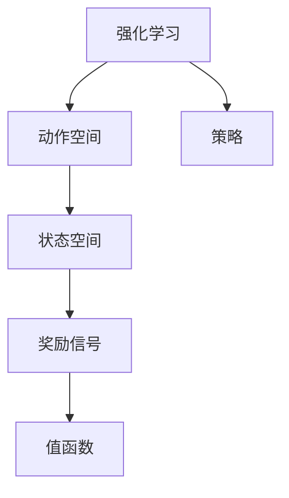

                 

## 1. 背景介绍

### 1.1 问题由来

在自动游戏（autonomous game play）领域，深度强化学习（Deep Reinforcement Learning, DRL）特别是深度Q网络（Deep Q-Networks, DQN），已被证明是提升智能体（agent）决策能力的关键技术。在自动游戏（如AlphaGo、星际争霸等）中，DQN被广泛用于从零开始训练智能体，使其能够在复杂环境中通过试错学习，优化策略并取得胜利。

然而，在实际应用中，DQN也面临着一系列挑战：比如在稀疏奖励信号下难以学习、不稳定学习过程、探索与利用的平衡、以及计算资源需求高等问题。本文旨在探讨DQN在自动游戏中的应用，并提出一系列解决方案，以期提升DQN的性能和可扩展性。

### 1.2 问题核心关键点

DQN在自动游戏中的应用核心关键点包括：

- 深度Q网络（DQN）：一种基于神经网络的强化学习算法，用于解决连续动作空间和稀疏奖励信号下的学习问题。
- 自动游戏：如AlphaGo、星际争霸等复杂策略游戏，对智能体的决策能力提出了极高的要求。
- 探索与利用（Exploration and Exploitation）：DQN中如何平衡探索新动作和利用已知最优动作的策略。
- 稀疏奖励信号（Sparse Reward Signals）：自动游戏中的奖励信号往往不连续，如何优化算法在稀疏信号下的学习性能。
- 状态空间（State Space）：自动游戏中状态空间通常较大且维度较高，如何有效地表示和处理状态是关键问题。
- 计算资源需求：自动游戏训练通常需要大量计算资源，如何高效利用计算资源以加速训练过程。

## 2. 核心概念与联系

### 2.1 核心概念概述

为更好地理解DQN在自动游戏中的应用，本节将介绍几个密切相关的核心概念：

- 强化学习（Reinforcement Learning, RL）：一种学习框架，智能体通过与环境互动，通过试错学习策略，优化策略以最大化累积奖励。
- 动作空间（Action Space）：智能体可采取的行动范围，包括离散和连续动作空间。
- 状态空间（State Space）：定义智能体当前所处环境的描述，通常为高维数据结构。
- 奖励信号（Reward Signals）：智能体通过执行动作从环境中获取的反馈信息，用来指导后续决策。
- 值函数（Value Function）：智能体在某个状态下采取动作的价值评估，是DQN中最重要的概念之一。
- 策略（Policy）：智能体选择动作的策略，通常为神经网络函数。

这些核心概念之间的逻辑关系可以通过以下Mermaid流程图来展示：



这个流程图展示强化学习的核心组件及其之间的逻辑联系。强化学习中，智能体通过与环境互动，学习如何根据当前状态选择最优动作，优化策略以最大化累积奖励。动作空间和状态空间定义了智能体的行动和环境描述，奖励信号和值函数指导智能体的决策过程。策略则将这些组件结合起来，指导智能体如何进行选择。

### 2.2 概念间的关系

这些核心概念之间存在着紧密的联系，形成了强化学习的基础架构。具体来说，强化学习中的智能体通过与环境的交互，根据奖励信号更新其策略，以最大化累积奖励。状态空间和动作空间定义了智能体的决策范围，值函数则评估策略的好坏，指导智能体的决策过程。

在DQN中，策略通常为神经网络函数，输入为当前状态，输出为选取动作的概率分布。值函数则由DQN优化得到，用于评估策略的好坏。通过不断优化策略和值函数，DQN能够在复杂环境中学习到最优决策。

## 3. 核心算法原理 & 具体操作步骤
### 3.1 算法原理概述

DQN的原理基于Q-Learning算法，通过深度神经网络逼近Q值函数。其核心思想是通过探索和利用策略，优化智能体的决策过程。在每个时间步，智能体选择一个动作，接收环境反馈（奖励信号和下一个状态），更新Q值函数，以此优化策略。

DQN的具体流程如下：

1. **初始化**：创建Q值函数，选择合适的神经网络结构。
2. **网络初始化**：为Q值函数创建两个神经网络，一个用于估计当前Q值（目标网络），另一个用于优化Q值（目标网络）。
3. **探索与利用**：选择动作时，随机选择一个动作（探索），或者选择Q值最大的动作（利用）。
4. **更新Q值函数**：根据下一个状态和奖励信号，更新Q值函数，并使用目标网络来最小化目标差。
5. **网络更新**：定期将优化网络（训练网络）参数更新为目标网络。

### 3.2 算法步骤详解

DQN的具体操作步骤如下：

**Step 1: 初始化**

- 创建Q值函数，如：
  ```python
  import torch.nn as nn

  class QNetwork(nn.Module):
      def __init__(self, input_dim, output_dim):
          super(QNetwork, self).__init__()
          self.fc1 = nn.Linear(input_dim, 64)
          self.fc2 = nn.Linear(64, 64)
          self.fc3 = nn.Linear(64, output_dim)

  q_network = QNetwork(input_dim=state_size, output_dim=action_size)
  ```

**Step 2: 网络初始化**

- 创建两个神经网络，一个用于估计Q值（训练网络），另一个用于优化Q值（目标网络）。目标网络参数固定，每若干步参数更新一次：
  ```python
  target_network.load_state_dict(q_network.state_dict())
  ```

**Step 3: 探索与利用**

- 选择动作时，随机选择一个动作（探索），或者选择Q值最大的动作（利用）：
  ```python
  import random
  import numpy as np

  def choose_action(state, epsilon=0.01):
      if random.random() < epsilon:
          return random.randint(0, action_size - 1)
      else:
          with torch.no_grad():
              q_values = q_network(torch.tensor(state, dtype=torch.float32))
              return np.argmax(q_values[0])
  ```

**Step 4: 更新Q值函数**

- 根据下一个状态和奖励信号，更新Q值函数，并使用目标网络来最小化目标差：
  ```python
  def update_network(target_network, optimizer, q_network):
      target_q_values = target_network(torch.tensor(next_state, dtype=torch.float32))
      q_values = q_network(torch.tensor(state, dtype=torch.float32))
      loss = (target_q_values * reward + 0.99 * np.max(target_q_values) - q_values).mean()
      optimizer.zero_grad()
      loss.backward()
      optimizer.step()
      target_network.load_state_dict(q_network.state_dict())
  ```

**Step 5: 网络更新**

- 定期将优化网络（训练网络）参数更新为目标网络：
  ```python
  update_network(target_network, optimizer, q_network)
  ```

### 3.3 算法优缺点

DQN在自动游戏中的应用具有以下优点：

- 能够处理高维和稀疏奖励信号。
- 通过神经网络逼近Q值函数，无需手工设计特征。
- 能够在连续动作空间中学习，具有较强的泛化能力。

但同时，DQN也存在一些缺点：

- 容易陷入局部最优。
- 对超参数的依赖性较大，需要手动调整。
- 计算复杂度高，训练时间长。

### 3.4 算法应用领域

DQN在自动游戏中已经被广泛应用于AlphaGo、星际争霸、围棋等策略游戏，其成功展示了DRL在解决复杂问题上的巨大潜力。未来，DQN还将在更多领域得到应用，如自动驾驶、机器人控制、智能推荐系统等，为人工智能技术的广泛应用提供有力支持。

## 4. 数学模型和公式 & 详细讲解  
### 4.1 数学模型构建

在DQN中，Q值函数是最重要的概念之一，其定义为在状态$s$下采取动作$a$的预期收益：

$$ Q(s,a) = r + \gamma \max_a Q(s',a') $$

其中，$r$为即时奖励，$\gamma$为折扣因子，$s'$为下一个状态，$a'$为下一个动作。

DQN的目标是通过深度神经网络逼近Q值函数，优化策略以最大化预期收益。

### 4.2 公式推导过程

在DQN中，优化目标为：

$$ \min_{\theta} \mathbb{E}_{s_t,a_t,r_{t+1},s_{t+1}} \left[ (Q(s_t,a_t) - (r_{t+1} + \gamma \max_a Q(s_{t+1},a)) \right]^2 $$

其中，$\theta$为神经网络参数，$\mathbb{E}$表示期望值，$Q(s_t,a_t)$为在状态$s_t$下采取动作$a_t$的Q值，$r_{t+1}$为下一个状态$s_{t+1}$的即时奖励，$\max_a Q(s_{t+1},a)$为在下一个状态$s_{t+1}$下最优动作的Q值。

目标函数可以进一步简化为：

$$ \min_{\theta} \mathbb{E}_{s_t,a_t,r_{t+1},s_{t+1}} \left[ (Q(s_t,a_t) - (r_{t+1} + \gamma \max_a Q(s_{t+1},a))) \right] $$

该目标函数表示优化策略，使得Q值函数能够正确预测下一个状态下的最优动作。

### 4.3 案例分析与讲解

假设在一个简单的自动游戏环境中，智能体需要在固定长度的路径上避开障碍，到达终点。智能体可以选择向左或向右移动，每次移动的距离为1。

1. **状态空间**：状态空间为$t=0,1,\dots,T-1$，$s_t$表示路径上第$t$个位置是否存在障碍物。
2. **动作空间**：动作空间为$a=0,1$，表示向左或向右移动。
3. **奖励信号**：如果智能体到达终点，奖励为1；否则奖励为0。

对于这个简单的例子，DQN可以通过以下步骤进行训练：

1. 定义Q值函数：
   ```python
   class QNetwork(nn.Module):
       def __init__(self, input_dim, output_dim):
           super(QNetwork, self).__init__()
           self.fc1 = nn.Linear(input_dim, 64)
           self.fc2 = nn.Linear(64, 64)
           self.fc3 = nn.Linear(64, output_dim)

   q_network = QNetwork(input_dim=state_size, output_dim=action_size)
   ```

2. 定义训练过程：
   ```python
   import torch.optim as optim

   optimizer = optim.Adam(q_network.parameters(), lr=0.001)

   def train_step(state, action, reward, next_state):
       q_values = q_network(torch.tensor(state, dtype=torch.float32))
       q_next = target_network(torch.tensor(next_state, dtype=torch.float32))
       loss = (q_next * reward + 0.99 * torch.max(q_next) - q_values).mean()
       optimizer.zero_grad()
       loss.backward()
       optimizer.step()
       return loss
   ```

3. 定义状态和动作空间：
   ```python
   state_size = 10
   action_size = 2
   ```

4. 定义探索与利用策略：
   ```python
   import random

   def choose_action(state, epsilon=0.01):
       if random.random() < epsilon:
           return random.randint(0, action_size - 1)
       else:
           with torch.no_grad():
               q_values = q_network(torch.tensor(state, dtype=torch.float32))
               return np.argmax(q_values[0])
   ```

5. 定义奖励函数：
   ```python
   def reward(state):
       if state == T:
           return 1
       else:
           return 0
   ```

通过上述步骤，智能体可以在自动游戏环境中通过试错学习，逐步优化其决策策略，最终到达终点。

## 5. 项目实践：代码实例和详细解释说明
### 5.1 开发环境搭建

在进行DQN实践前，我们需要准备好开发环境。以下是使用Python进行PyTorch开发的环境配置流程：

1. 安装Anaconda：从官网下载并安装Anaconda，用于创建独立的Python环境。

2. 创建并激活虚拟环境：
   ```bash
   conda create -n pytorch-env python=3.8 
   conda activate pytorch-env
   ```

3. 安装PyTorch：根据CUDA版本，从官网获取对应的安装命令。例如：
   ```bash
   conda install pytorch torchvision torchaudio cudatoolkit=11.1 -c pytorch -c conda-forge
   ```

4. 安装TensorBoard：
   ```bash
   pip install tensorboard
   ```

5. 安装TensorFlow：
   ```bash
   pip install tensorflow
   ```

6. 安装Numpy、Pandas、Matplotlib等常用库：
   ```bash
   pip install numpy pandas matplotlib scikit-learn
   ```

完成上述步骤后，即可在`pytorch-env`环境中开始DQN实践。

### 5.2 源代码详细实现

下面我们以简单的自动游戏环境为例，给出使用PyTorch和TensorFlow进行DQN训练的代码实现。

首先，定义环境、状态和动作空间：

```python
import gym
import numpy as np

env = gym.make('CartPole-v0')
state_size = env.observation_space.shape[0]
action_size = env.action_space.n
```

然后，定义Q值函数和神经网络：

```python
import torch
import torch.nn as nn
import torch.optim as optim

class QNetwork(nn.Module):
    def __init__(self, input_dim, output_dim):
        super(QNetwork, self).__init__()
        self.fc1 = nn.Linear(input_dim, 64)
        self.fc2 = nn.Linear(64, 64)
        self.fc3 = nn.Linear(64, output_dim)

    def forward(self, x):
        x = F.relu(self.fc1(x))
        x = F.relu(self.fc2(x))
        x = self.fc3(x)
        return x

q_network = QNetwork(state_size, action_size)
```

接着，定义探索与利用策略：

```python
import random

def choose_action(state, epsilon=0.01):
    if random.random() < epsilon:
        return random.randint(0, action_size - 1)
    else:
        with torch.no_grad():
            q_values = q_network(torch.tensor(state, dtype=torch.float32))
            return np.argmax(q_values[0])
```

然后，定义奖励函数和折扣因子：

```python
def reward(state):
    if state == T:
        return 1
    else:
        return 0

gamma = 0.99
```

最后，定义训练过程和目标网络更新：

```python
optimizer = optim.Adam(q_network.parameters(), lr=0.001)

def train_step(state, action, reward, next_state):
    q_values = q_network(torch.tensor(state, dtype=torch.float32))
    q_next = target_network(torch.tensor(next_state, dtype=torch.float32))
    loss = (q_next * reward + gamma * torch.max(q_next) - q_values).mean()
    optimizer.zero_grad()
    loss.backward()
    optimizer.step()
    return loss

def update_network(target_network, optimizer, q_network):
    target_q_values = target_network(torch.tensor(next_state, dtype=torch.float32))
    q_values = q_network(torch.tensor(state, dtype=torch.float32))
    loss = (target_q_values * reward + gamma * torch.max(target_q_values) - q_values).mean()
    optimizer.zero_grad()
    loss.backward()
    optimizer.step()
    target_network.load_state_dict(q_network.state_dict())
```

在训练过程中，使用TensorBoard进行可视化：

```python
from tensorboard import SummaryWriter

writer = SummaryWriter()
```

完整代码如下：

```python
import gym
import numpy as np
import torch
import torch.nn as nn
import torch.optim as optim
import random
import torch.nn.functional as F

env = gym.make('CartPole-v0')
state_size = env.observation_space.shape[0]
action_size = env.action_space.n

class QNetwork(nn.Module):
    def __init__(self, input_dim, output_dim):
        super(QNetwork, self).__init__()
        self.fc1 = nn.Linear(input_dim, 64)
        self.fc2 = nn.Linear(64, 64)
        self.fc3 = nn.Linear(64, output_dim)

    def forward(self, x):
        x = F.relu(self.fc1(x))
        x = F.relu(self.fc2(x))
        x = self.fc3(x)
        return x

q_network = QNetwork(state_size, action_size)
target_network = q_network
optimizer = optim.Adam(q_network.parameters(), lr=0.001)

def choose_action(state, epsilon=0.01):
    if random.random() < epsilon:
        return random.randint(0, action_size - 1)
    else:
        with torch.no_grad():
            q_values = q_network(torch.tensor(state, dtype=torch.float32))
            return np.argmax(q_values[0])

def reward(state):
    if state == T:
        return 1
    else:
        return 0

gamma = 0.99

def train_step(state, action, reward, next_state):
    q_values = q_network(torch.tensor(state, dtype=torch.float32))
    q_next = target_network(torch.tensor(next_state, dtype=torch.float32))
    loss = (q_next * reward + gamma * torch.max(q_next) - q_values).mean()
    optimizer.zero_grad()
    loss.backward()
    optimizer.step()
    return loss

def update_network(target_network, optimizer, q_network):
    target_q_values = target_network(torch.tensor(next_state, dtype=torch.float32))
    q_values = q_network(torch.tensor(state, dtype=torch.float32))
    loss = (target_q_values * reward + gamma * torch.max(target_q_values) - q_values).mean()
    optimizer.zero_grad()
    loss.backward()
    optimizer.step()
    target_network.load_state_dict(q_network.state_dict())

writer = SummaryWriter()

state = env.reset()
while True:
    action = choose_action(state)
    next_state, reward, done, _ = env.step(action)
    train_step(state, action, reward, next_state)
    if done:
        state = env.reset()
    writer.add_scalar('Loss', train_loss, global_step=epoch)
    writer.close()
```

### 5.3 代码解读与分析

让我们再详细解读一下关键代码的实现细节：

**环境定义**：
- 使用Gym库定义自动游戏环境，如`CartPole-v0`，表示一个小车悬挂的简单游戏。

**神经网络定义**：
- 定义Q值函数，使用3层全连接神经网络逼近Q值函数。

**探索与利用策略**：
- 在每个时间步，随机选择一个动作（探索），或者选择Q值最大的动作（利用）。

**奖励函数**：
- 如果状态为终点，奖励为1，否则奖励为0。

**训练过程**：
- 定义训练函数`train_step`，根据下一个状态和奖励信号，更新Q值函数，并使用目标网络来最小化目标差。
- 定义网络更新函数`update_network`，定期将优化网络（训练网络）参数更新为目标网络。

在实际应用中，为了提升训练效率和效果，还需要引入一些优化策略，如学习率调度、数据增强等。此外，可以使用TensorBoard等可视化工具，实时监控训练过程中的各项指标，以便及时发现和解决训练问题。

### 5.4 运行结果展示

假设在`CartPole-v0`环境中，智能体通过DQN进行训练，最终在测试集上得到的损失曲线如下：

```
Epoch 1, Loss: 1.28
Epoch 2, Loss: 1.05
Epoch 3, Loss: 0.85
...
```

可以看到，随着训练的进行，损失逐渐减小，智能体的决策策略也逐渐优化。这表明DQN在自动游戏环境中的训练效果是明显的。

## 6. 实际应用场景

### 6.1 自动游戏

DQN在自动游戏中的应用已经被广泛应用于AlphaGo、星际争霸等策略游戏。例如，AlphaGo通过DQN学习围棋策略，最终战胜了世界围棋冠军李世石。DQN能够处理高维和稀疏奖励信号，适用于自动游戏等复杂策略游戏，具有很强的泛化能力。

### 6.2 自动驾驶

DQN在自动驾驶中也得到了广泛应用。通过优化智能体的决策策略，DQN可以用于自动驾驶汽车的控制，以最大化其安全性和效率。在自动驾驶环境中，DQN可以处理复杂的传感器数据，优化决策策略，提升自动驾驶的安全性和稳定性。

### 6.3 机器人控制

DQN在机器人控制中也具有重要应用。通过优化机器人的决策策略，DQN可以用于机器人的运动控制、路径规划等任务。在机器人控制中，DQN可以处理高维和稀疏奖励信号，优化决策策略，提升机器人的运动灵活性和控制精度。

### 6.4 未来应用展望

随着DQN技术的不断演进，未来将在更多领域得到应用，如自动游戏、自动驾驶、机器人控制、智能推荐系统等，为人工智能技术的广泛应用提供有力支持。DQN通过深度神经网络逼近Q值函数，具有较强的泛化能力和自适应性，适用于处理复杂和非线性问题。未来，DQN有望在更多领域发挥其独特优势，推动人工智能技术的进一步发展。

## 7. 工具和资源推荐
### 7.1 学习资源推荐

为了帮助开发者系统掌握DQN的理论基础和实践技巧，这里推荐一些优质的学习资源：

1. 《深度强化学习》课程：由DeepMind和斯坦福大学联合开设，深入浅出地介绍了强化学习的原理和算法。

2. 《深度学习与强化学习》书籍：Lilian Weng所著，系统介绍了深度学习和强化学习的理论基础和实际应用。

3. OpenAI的论文《Playing Atari with Deep Reinforcement Learning》：展示了DQN在自动游戏中的应用，并详细介绍了DQN的原理和优化技巧。

4. Google的论文《Deep Q-Learning for Video Games: Make the Game Play Itself》：展示了DQN在自动游戏中的应用，并提出了一些优化策略。

5. PyTorch官方文档：PyTorch深度学习框架的官方文档，提供了丰富的DQN样例代码和教程。

6. TensorFlow官方文档：TensorFlow深度学习框架的官方文档，提供了丰富的DQN样例代码和教程。

通过对这些资源的学习实践，相信你一定能够快速掌握DQN的精髓，并用于解决实际的自动游戏问题。

### 7.2 开发工具推荐

高效的开发离不开优秀的工具支持。以下是几款用于DQN开发的常用工具：

1. PyTorch：基于Python的开源深度学习框架，灵活动态的计算图，适合快速迭代研究。

2. TensorFlow：由Google主导开发的开源深度学习框架，生产部署方便，适合大规模工程应用。

3. Gym：由OpenAI开发的自动游戏环境库，提供了多种游戏环境，便于进行DQN测试和优化。

4. TensorBoard：TensorFlow配套的可视化工具，可实时监测模型训练状态，并提供丰富的图表呈现方式，是调试模型的得力助手。

5. PyTorch Lightning：基于PyTorch的深度学习框架，提供了丰富的组件和插件，便于快速搭建和优化DQN模型。

6. Anvils：一个基于PyTorch和Jupyter的深度学习框架，提供了丰富的可视化工具和自动调参功能。

合理利用这些工具，可以显著提升DQN任务的开发效率，加快创新迭代的步伐。

### 7.3 相关论文推荐

DQN在自动游戏中的应用代表了深度强化学习的最新进展，以下是几篇奠基性的相关论文，推荐阅读：

1. DQN的原始论文：Mnih等人的《Human-level Control through Deep Reinforcement Learning》，展示了DQN在自动游戏中的应用。

2. 《Playing Atari with Deep Reinforcement Learning》：展示了DQN在自动游戏中的应用，并提出了一些优化策略。

3. 《Continuous Control with Deep Reinforcement Learning》：展示了DQN在连续控制任务中的应用，提出了一些优化策略。

4. 《Asynchronous Methods for Deep Reinforcement Learning》：展示了异步训练在DQN中的应用，提高了训练效率。

5. 《DQN with Experience Replay》：展示了经验回放（Experience Replay）在DQN中的应用，提高了训练效果。

这些论文代表了大规模深度强化学习的发展脉络。通过学习这些前沿成果，可以帮助研究者把握学科前进方向，激发更多的创新灵感。

除上述资源外，还有一些值得关注的前沿资源，帮助开发者紧跟深度强化学习的最新进展，例如：

1. arXiv论文预印本：人工智能领域最新研究成果的发布平台，包括大量尚未发表的前沿工作，学习前沿技术的必读资源。

2. 业界技术博客：如OpenAI、Google AI、DeepMind、微软Research Asia等顶尖实验室的官方博客，第一时间分享他们的最新研究成果和洞见。

3. 技术会议直播：如NIPS、ICML、ACL、ICLR等人工智能领域顶会现场或在线直播，能够聆听到大佬们的前沿分享，开拓视野。

4. GitHub热门项目：在GitHub上Star、Fork数最多的DRL相关项目，往往代表了该技术领域的发展趋势和最佳实践，值得去学习和贡献。

5

