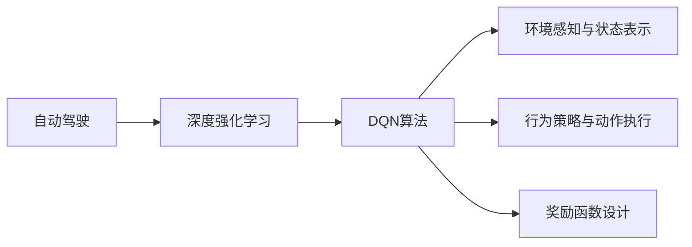
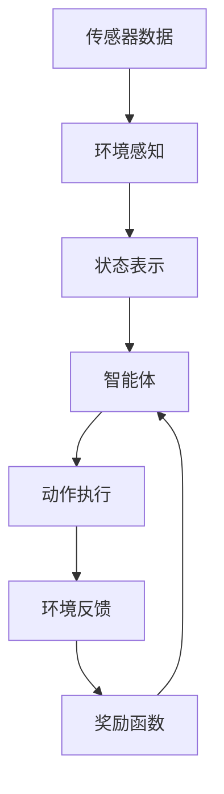
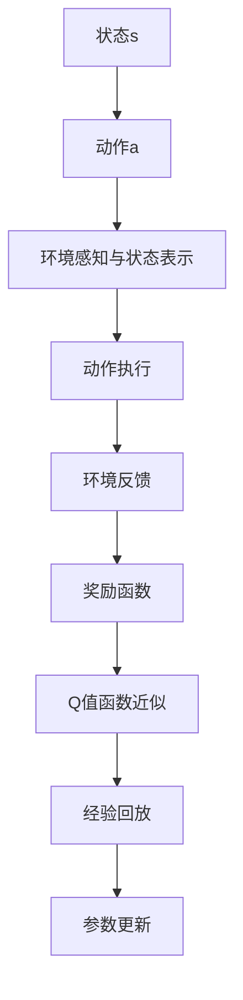
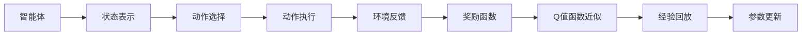
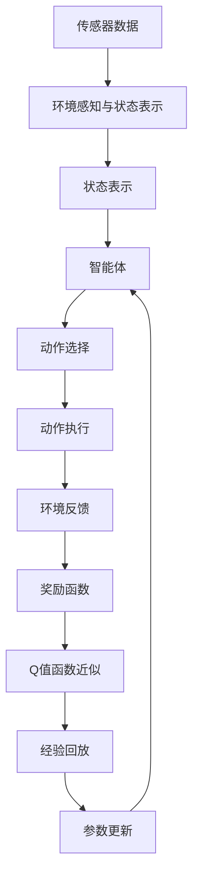

                 

# 一切皆是映射：DQN在自动驾驶中的应用案例分析

> 关键词：自动驾驶, 深度强化学习, DQN, 决策优化, 环境感知, 车辆控制

## 1. 背景介绍

### 1.1 问题由来

随着人工智能技术的迅猛发展，自动驾驶技术已逐步从实验室走向现实世界。自动驾驶不仅能够提高道路交通的安全性，还能有效缓解城市交通压力，提升出行效率。然而，自动驾驶系统需要处理复杂多变的道路环境和各种突发事件，其决策优化问题变得尤为复杂。

近年来，深度强化学习（Deep Reinforcement Learning, DRL）在自动驾驶领域得到了广泛应用。DRL通过构建智能体（Agent），让其在虚拟环境中进行训练，逐步优化决策策略，从而实现自主驾驶。其中，DQN（Deep Q-Network）作为经典算法，在自动驾驶中的应用案例尤为引人注目。

### 1.2 问题核心关键点

DQN算法在大规模游戏AI训练中取得了显著成就，其核心思想是通过Q值函数来评估每个策略的优劣，并通过深度神经网络近似函数逼近Q值。在自动驾驶领域，DQN通过构建智能体的决策策略，学习如何在复杂环境中进行行驶决策。

DQN的核心关键点包括：

- **Q值函数**：用于评估当前状态下每个动作的好坏。
- **深度神经网络逼近**：通过深度神经网络来近似表示Q值函数。
- **经验回放**：通过存储与真实环境中的轨迹，在训练中随机采样。
- **深度学习与强化学习的结合**：结合深度学习和强化学习的思想，进行策略优化。

在自动驾驶场景中，DQN需要处理的决策问题主要包括：

- **环境感知与状态表示**：通过摄像头、雷达等传感器获取周围环境信息，并通过状态表示进行环境建模。
- **行为策略与动作执行**：在给定状态下，选择合适的行为策略，并执行相应的控制动作。
- **奖励函数设计**：根据动作执行结果，设计合理的奖励函数，指导模型学习。

### 1.3 问题研究意义

DQN算法在自动驾驶领域的应用，对于提升自动驾驶系统的智能决策能力、提高道路安全性、降低交通事故率具有重要意义。通过DQN，自动驾驶系统能够自主适应复杂环境，快速应对突发事件，有效提升用户体验和出行效率。

DQN的引入，可以突破传统规则驱动决策的局限性，让自动驾驶系统具备更强的自适应能力。同时，DQN算法的学习过程可以不断优化，逐步提高决策的精确性和稳定性。在实际应用中，DQN算法还可以结合其他深度学习技术，如CNN用于环境感知，LSTM用于状态记忆，提升模型的整体性能。

## 2. 核心概念与联系

### 2.1 核心概念概述

为了更好地理解DQN算法在自动驾驶中的应用，本节将介绍几个关键概念：

- **自动驾驶**：通过传感器、计算机视觉、人工智能等技术，实现车辆自主导航和驾驶的系统。
- **深度强化学习（DRL）**：结合深度学习和强化学习的技术，通过智能体的行为优化，解决复杂决策问题。
- **DQN算法**：利用深度神经网络逼近Q值函数，通过回放经验，优化策略决策的强化学习算法。
- **环境感知与状态表示**：通过传感器数据，构建环境的动态模型，并进行状态表示。
- **行为策略与动作执行**：在给定状态下，选择合适的行为策略，并执行相应的控制动作。
- **奖励函数设计**：根据动作执行结果，设计合理的奖励函数，指导模型学习。

这些核心概念之间的逻辑关系可以通过以下Mermaid流程图来展示：



这个流程图展示了大语言模型微调过程中各个核心概念的关系和作用：

1. 自动驾驶系统通过深度强化学习进行决策优化。
2. DQN算法是深度强化学习中的一个重要分支，用于通过神经网络逼近Q值函数，优化决策策略。
3. 环境感知与状态表示是自动驾驶的基础，通过传感器数据构建环境模型。
4. 行为策略与动作执行是决策优化的关键步骤，通过策略执行控制车辆动作。
5. 奖励函数设计是策略优化的重要手段，通过设计合理的奖励函数指导模型学习。

### 2.2 概念间的关系

这些核心概念之间存在着紧密的联系，形成了DQN算法在自动驾驶中应用的完整生态系统。下面我们通过几个Mermaid流程图来展示这些概念之间的关系。

#### 2.2.1 自动驾驶决策优化流程



这个流程图展示了自动驾驶决策优化的基本流程：

1. 传感器数据输入。
2. 通过环境感知模块，构建环境动态模型。
3. 状态表示模块将环境信息抽象成状态。
4. 智能体根据当前状态，通过行为策略与动作执行模块，选择最优动作。
5. 环境反馈模块获取动作执行结果，通过奖励函数设计模块，计算奖励值，指导模型学习。

#### 2.2.2 DQN算法流程



这个流程图展示了DQN算法的核心流程：

1. 智能体在给定状态s下，选择动作a。
2. 通过环境感知与状态表示模块，获取当前状态s。
3. 动作执行模块执行动作a。
4. 环境反馈模块获取动作执行结果。
5. 奖励函数设计模块计算奖励值。
6. Q值函数近似模块通过深度神经网络逼近Q值函数。
7. 经验回放模块将经验数据存储，供模型训练使用。
8. 参数更新模块根据经验回放中的数据，更新模型参数，优化策略。

#### 2.2.3 强化学习与深度学习的结合



这个流程图展示了强化学习与深度学习结合的基本流程：

1. 智能体在给定状态下，选择动作。
2. 状态表示模块将环境信息抽象成状态。
3. 动作选择模块根据策略选择动作。
4. 动作执行模块执行动作。
5. 环境反馈模块获取动作执行结果。
6. 奖励函数设计模块计算奖励值。
7. Q值函数近似模块通过深度神经网络逼近Q值函数。
8. 经验回放模块将经验数据存储，供模型训练使用。
9. 参数更新模块根据经验回放中的数据，更新模型参数，优化策略。

### 2.3 核心概念的整体架构

最后，我们用一个综合的流程图来展示这些核心概念在大语言模型微调过程中的整体架构：



这个综合流程图展示了从传感器数据输入到决策策略优化的完整过程。自动驾驶系统通过传感器获取环境信息，经过环境感知与状态表示模块，将环境信息抽象成状态。智能体根据当前状态，通过行为策略与动作执行模块，选择最优动作。环境反馈模块获取动作执行结果，通过奖励函数设计模块，计算奖励值，指导模型学习。Q值函数近似模块通过深度神经网络逼近Q值函数，经验回放模块将经验数据存储，供模型训练使用。参数更新模块根据经验回放中的数据，更新模型参数，优化策略。

## 3. 核心算法原理 & 具体操作步骤
### 3.1 算法原理概述

DQN算法的核心原理是通过深度神经网络逼近Q值函数，通过经验回放和参数更新，优化决策策略。在自动驾驶场景中，DQN通过构建智能体的决策策略，学习如何在复杂环境中进行行驶决策。

形式化地，设当前状态为 $s$，智能体执行动作 $a$，环境反馈为 $r$，下一状态为 $s'$。则Q值函数定义为：

$$
Q(s,a) = \mathbb{E}[G_t | s_0=s, a_0=a]
$$

其中 $G_t$ 表示从当前状态 $s$ 开始，执行动作 $a$，经过 $t$ 步环境反馈后的总奖励。DQN的目标是通过神经网络逼近上述Q值函数，使得在每个状态下，智能体能够选择最优动作。

### 3.2 算法步骤详解

DQN算法的核心步骤如下：

**Step 1: 状态表示与动作选择**

1. 环境感知与状态表示模块将传感器数据转换为状态表示 $s$。
2. 智能体根据当前状态 $s$，通过动作选择模块选择动作 $a$。

**Step 2: 环境反馈与奖励函数**

1. 动作执行模块执行动作 $a$。
2. 环境反馈模块获取动作执行结果，计算奖励值 $r$。
3. 奖励函数设计模块设计奖励函数 $r(s,a,s',r)$。

**Step 3: 经验回放**

1. 经验回放模块将当前状态、动作、奖励、下一状态存储到经验回放内存中。

**Step 4: Q值函数逼近与参数更新**

1. 经验回放模块从经验回放内存中随机采样，生成训练数据。
2. 通过深度神经网络逼近Q值函数 $Q(s,a)$。
3. 参数更新模块根据采样数据，更新模型参数。

DQN算法的核心流程可以通过以下伪代码来描述：

```python
# 定义智能体的状态表示和动作选择模块
class Agent:
    def __init__(self, state_size, action_size):
        self.state_size = state_size
        self.action_size = action_size
        self.model = self.build_model()
        
    def build_model(self):
        model = Sequential()
        model.add(Dense(64, input_dim=self.state_size))
        model.add(LeakyReLU(alpha=0.01))
        model.add(Dense(64))
        model.add(LeakyReLU(alpha=0.01))
        model.add(Dense(self.action_size))
        model.compile(loss='mse', optimizer=Adam(learning_rate=0.001))
        return model
    
    def act(self, state):
        actions = self.model.predict(state)
        return np.argmax(actions[0])
        
# 定义环境反馈与奖励函数模块
class Environment:
    def __init__(self, state_size, action_size, reward_range):
        self.state_size = state_size
        self.action_size = action_size
        self.reward_range = reward_range
        
    def step(self, action):
        # 根据动作执行，计算下一状态和奖励
        next_state = self.get_next_state(action)
        reward = self.get_reward(next_state)
        done = self.is_terminal(next_state)
        return next_state, reward, done
        
    def get_next_state(self, action):
        # 根据动作执行，计算下一状态
        next_state = ...
        return next_state
    
    def get_reward(self, next_state):
        # 根据下一状态，计算奖励
        reward = ...
        return reward
    
    def is_terminal(self, next_state):
        # 判断下一状态是否为终止状态
        if ...
            return True
        else:
            return False

# 定义经验回放与参数更新模块
class ReplayMemory:
    def __init__(self, capacity):
        self.capacity = capacity
        self.memory = []
        
    def remember(self, state, action, reward, next_state, done):
        if len(self.memory) < self.capacity:
            self.memory.append((state, action, reward, next_state, done))
        else:
            self.memory.pop(0)
            self.memory.append((state, action, reward, next_state, done))
    
    def sample(self, batch_size):
        return np.array(random.sample(self.memory, batch_size))
        
# 定义深度神经网络逼近模块
class QNetwork:
    def __init__(self, state_size, action_size, learning_rate):
        self.state_size = state_size
        self.action_size = action_size
        self.learning_rate = learning_rate
        self.model = self.build_model()
        
    def build_model(self):
        model = Sequential()
        model.add(Dense(64, input_dim=self.state_size))
        model.add(LeakyReLU(alpha=0.01))
        model.add(Dense(64))
        model.add(LeakyReLU(alpha=0.01))
        model.add(Dense(self.action_size))
        model.compile(loss='mse', optimizer=Adam(learning_rate=self.learning_rate))
        return model
    
    def predict(self, state):
        actions = self.model.predict(state)
        return actions[0]
        
    def train(self, state_batch, action_batch, reward_batch, next_state_batch, done_batch):
        target = reward_batch + self.gamma * np.amax(self.model.predict(next_state_batch), axis=1) * (1 - done_batch)
        target_f = self.model.predict(state_batch)
        target_f[range(len(state_batch)), action_batch] = target
        self.model.fit(state_batch, target_f, epochs=1, verbose=0)
```

### 3.3 算法优缺点

DQN算法在自动驾驶领域的应用，具有以下优点：

1. **鲁棒性强**：DQN算法通过经验回放和参数更新，能够适应复杂多变的环境，具有较强的鲁棒性。
2. **决策高效**：DQN算法通过深度神经网络逼近Q值函数，能够快速优化决策策略，提高决策效率。
3. **模型泛化能力强**：DQN算法能够通过学习环境中的大量经验数据，具备较强的泛化能力，适应不同场景下的决策需求。

同时，DQN算法也存在一些缺点：

1. **样本效率低**：DQN算法需要大量的环境数据进行训练，样本效率相对较低。
2. **过度拟合风险**：由于深度神经网络的复杂性，DQN算法可能出现过拟合现象。
3. **模型复杂度高**：DQN算法需要构建深度神经网络进行Q值函数逼近，模型复杂度高，计算资源消耗大。

### 3.4 算法应用领域

DQN算法在自动驾驶领域的应用非常广泛，主要包括以下几个方面：

1. **路径规划与决策优化**：通过DQN算法，智能体可以在复杂道路环境中，优化行驶路径，避免碰撞和拥堵。
2. **车距控制与速度调节**：通过DQN算法，智能体能够根据前车距离和车速，自动调节自身速度和车距，保持安全行驶。
3. **交通信号识别与交叉口管理**：通过DQN算法，智能体能够识别交通信号，进行交叉口管理，提升道路通行效率。
4. **避障与路径优化**：通过DQN算法，智能体能够实时感知周围环境，动态调整路径，避免障碍物和事故。

除了上述这些具体应用场景，DQN算法还可以应用于无人驾驶汽车的研发、智能交通系统的建设等。随着技术的不断进步，DQN算法将在自动驾驶领域发挥越来越重要的作用。

## 4. 数学模型和公式 & 详细讲解  
### 4.1 数学模型构建

DQN算法在自动驾驶场景中的数学模型主要包括以下几个关键部分：

- **状态表示**：将传感器数据转换为状态向量，用于表示当前环境信息。
- **动作选择**：根据当前状态，选择最优动作，控制车辆行驶。
- **奖励函数设计**：根据动作执行结果，设计合理的奖励函数，指导模型学习。
- **Q值函数逼近**：通过深度神经网络逼近Q值函数，优化决策策略。

### 4.2 公式推导过程

以下我们以车辆在复杂道路环境中的决策优化为例，推导DQN算法的数学模型。

设车辆在时刻 $t$ 的状态为 $s_t$，动作为 $a_t$，奖励为 $r_t$，下一状态为 $s_{t+1}$。则DQN算法的基本框架可以表示为：

1. **状态表示与动作选择**：

$$
s_t = \text{state\_representation}(s_t)
$$

$$
a_t = \text{act}(s_t)
$$

2. **环境反馈与奖励函数**：

$$
r_t = \text{reward}(s_t, a_t, s_{t+1})
$$

$$
s_{t+1} = \text{get\_next\_state}(s_t, a_t)
$$

3. **Q值函数逼近与参数更新**：

$$
Q(s_t, a_t) = \mathbb{E}[G_t | s_0=s_t, a_0=a_t]
$$

其中，$G_t$ 表示从当前状态 $s_t$ 开始，执行动作 $a_t$，经过 $t$ 步环境反馈后的总奖励。DQN的目标是通过神经网络逼近上述Q值函数，使得在每个状态下，智能体能够选择最优动作。

### 4.3 案例分析与讲解

为了更好地理解DQN算法在自动驾驶中的应用，我们以车辆在复杂道路环境中的决策优化为例，进行详细讲解。

假设车辆在道路上行驶，需要避开障碍物并到达目标位置。车辆的状态可以表示为 $s_t = (x_t, y_t, v_t)$，其中 $x_t$ 和 $y_t$ 表示车辆位置，$v_t$ 表示车速。车辆的动作可以选择向前、向左、向右等方向，动作表示为 $a_t = \{f, l, r\}$。车辆的奖励函数可以设计为：

- 如果在 $t$ 时刻成功避开障碍物并到达目标位置，奖励为 $r_t = 1$；
- 如果在 $t$ 时刻未能避开障碍物，奖励为 $r_t = -1$；
- 如果在 $t$ 时刻到达目标位置，奖励为 $r_t = 0$。

在上述环境下，DQN算法可以表示为：

1. **状态表示与动作选择**：

$$
s_t = \text{state\_representation}(s_t) = (x_t, y_t, v_t)
$$

$$
a_t = \text{act}(s_t) = \text{argmax}(Q(s_t, a))
$$

其中，$Q(s_t, a)$ 表示在状态 $s_t$ 下，执行动作 $a$ 的Q值。

2. **环境反馈与奖励函数**：

$$
r_t = \text{reward}(s_t, a_t, s_{t+1}) = \left\{
\begin{array}{ll}
1, & \text{if } \text{avoid\_obstacle}(s_t, a_t) \text{ and } \text{arrive\_target}(s_t, a_t, s_{t+1}) \\
-1, & \text{if } \text{avoid\_obstacle}(s_t, a_t) \text{ and } \text{not } \text{arrive\_target}(s_t, a_t, s_{t+1}) \\
0, & \text{otherwise}
\end{array}
\right.
$$

其中，$\text{avoid\_obstacle}(s_t, a_t)$ 表示是否成功避开障碍物，$\text{arrive\_target}(s_t, a_t, s_{t+1})$ 表示是否到达目标位置。

3. **Q值函数逼近与参数更新**：

$$
Q(s_t, a_t) = \mathbb{E}[G_t | s_0=s_t, a_0=a_t]
$$

其中，$G_t$ 表示从当前状态 $s_t$ 开始，执行动作 $a_t$，经过 $t$ 步环境反馈后的总奖励。

在上述环境中，DQN算法通过状态表示模块、动作选择模块和奖励函数模块，将传感器数据转换为状态表示，选择最优动作，并根据环境反馈设计合理的奖励函数，指导模型学习。Q值函数逼近模块通过深度神经网络逼近Q值函数，优化决策策略。

## 5. 项目实践：代码实例和详细解释说明
### 5.1 开发环境搭建

在进行DQN算法在自动驾驶中的应用实践前，我们需要准备好开发环境。以下是使用Python进行TensorFlow开发的环境配置流程：

1. 安装Anaconda：从官网下载并安装Anaconda，用于创建独立的Python环境。

2. 创建并激活虚拟环境：
```bash
conda create -n tensorflow-env python=3.8 
conda activate tensorflow-env
```

3. 安装TensorFlow：根据CUDA版本，从官网获取对应的安装命令。例如：
```bash
conda install tensorflow==2.5 -c tf
```

4. 安装必要的库：
```bash
pip install numpy scipy scikit-learn matplotlib tqdm jupyter notebook ipython
```

完成上述步骤后，即可在`tensorflow-env`环境中开始DQN算法的实践。

### 5.2 源代码详细实现

下面以车辆在复杂道路环境中的决策优化为例，给出使用TensorFlow实现DQN算法的代码。

首先，定义车辆的状态表示和动作选择模块：

```python
import tensorflow as tf
import numpy as np

class Vehicle:
    def __init__(self, state_size, action_size, learning_rate, gamma):
        self.state_size = state_size
        self.action_size = action_size
        self.learning_rate = learning_rate
        self.gamma = gamma
        self.model = self.build_model()
        
    def build_model(self):
        model = tf.keras.Sequential()
        model.add(tf.keras.layers.Dense(64, input_dim=self.state_size))
        model.add(tf.keras.layers.LeakyReLU(alpha=0.01))
        model.add(tf.keras.layers.Dense(64))
        model.add(tf.keras.layers.LeakyReLU(alpha=0.01))
        model.add(tf.keras.layers.Dense(self.action_size))
        model.compile(loss='mse', optimizer=tf.keras.optimizers.Adam(learning_rate=self.learning_rate))
        return model
    
    def act(self, state):
        actions = self.model.predict(state)
        return np.argmax(actions[0])
        
class Environment:
    def __init__(self, state_size, action_size, reward_range, termination_conditions):
        self.state_size = state_size
        self.action_size = action_size
        self.reward_range = reward_range
        self.termination_conditions = termination_conditions
        
    def step(self, action):
        # 根据动作执行，计算下一状态和奖励
        next_state = self.get_next_state(action)
        reward = self.get_reward(next_state)
        done = self.is_terminal(next_state)
        return next_state, reward, done
        
    def get_next_state(self, action):
        # 根据动作执行，计算下一状态
        next_state = ...
        return next_state
    
    def get_reward(self, next_state):
        # 根据下一状态，计算奖励
        reward = ...
        return reward
    
    def is_terminal(self, next_state):
        # 判断下一状态是否为终止状态
        if ...
            return True
        else:
            return False
```

然后，定义经验回放和参数更新模块：

```python
class ReplayMemory:
    def __init__(self, capacity):
        self.capacity = capacity
        self.memory = []
        
    def remember(self, state, action, reward, next_state, done):
        if len(self.memory) < self.capacity:
            self.memory.append((state, action, reward, next_state, done))
        else:
            self.memory.pop(0)
            self.memory.append((state, action, reward, next_state, done))
    
    def sample(self, batch_size):
        return np.array(random.sample(self.memory, batch_size))
        
class QNetwork:
    def __init__(self, state_size, action_size, learning_rate):
        self.state_size = state_size
        self.action_size = action_size
        self.learning_rate = learning_rate
        self.model = self.build_model()
        
    def build_model(self):
        model = tf.keras.Sequential()
        model.add(tf.keras.layers.Dense(64, input_dim=self.state_size))
        model.add(tf.keras.layers.LeakyReLU(alpha=0.01))
        model.add(tf.keras.layers.Dense(64))
        model.add(tf.keras.layers.LeakyReLU(alpha=0.01))
        model.add(tf.keras.layers.Dense(self.action_size))
        model.compile(loss='mse', optimizer=tf.keras.optimizers.Adam(learning_rate=self.learning_rate))
        return model
    
    def predict(self, state):
        actions = self.model.predict(state)
        return actions[0]
        
    def train(self, state_batch, action_batch, reward_batch, next_state_batch, done_batch):
        target = reward_batch + self.gamma * tf.reduce_max(self.model.predict(next_state_batch), axis=1) * (1 - done_batch)
        target_f = self.model.predict(state_batch)
        target_f[range(len(state_batch)), action_batch]

