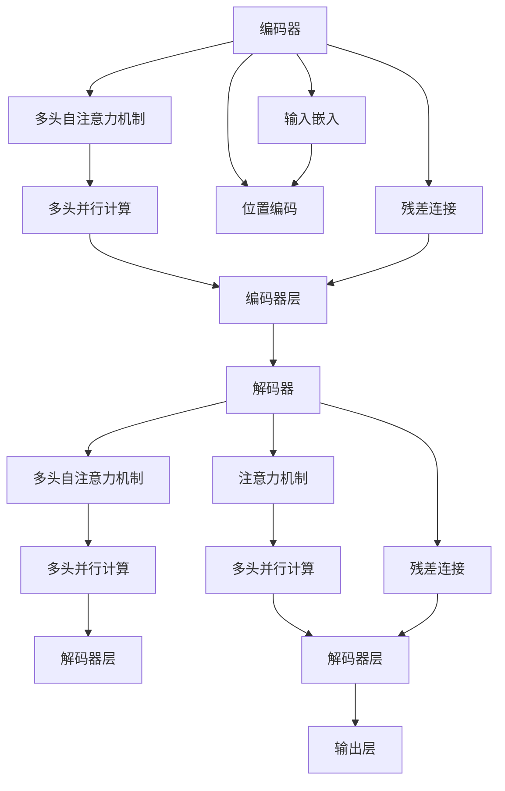

                 

# 一切皆是映射：Transformer架构全面解析

> 关键词：Transformer, 自注意力机制, 编码器-解码器, 序列建模, 语言生成

## 1. 背景介绍

### 1.1 问题由来

近年来，自然语言处理(Natural Language Processing, NLP)领域快速发展，尤其是基于深度学习的模型在诸多任务上取得了显著的进展。传统序列模型如RNN、LSTM等，虽然在处理变长序列上存在优势，但面临计算复杂度高、难以并行化等问题，难以处理大规模语言模型。Transformer结构的出现，彻底改写了这一局面。

Transformer基于自注意力机制，通过多头并行计算的方式，实现了高效、灵活的序列建模，为大规模语言模型的处理提供了新的可能。近年来，基于Transformer的模型，如BERT、GPT、XLNet等，在各类NLP任务上均取得了显著的效果，甚至在一些任务上超越了人类。

本文将全面解析Transformer架构，深入探讨其原理和应用，旨在帮助读者系统掌握Transformer模型的核心思想和关键技术。

## 2. 核心概念与联系

### 2.1 核心概念概述

为了更好地理解Transformer架构，首先需要介绍几个关键概念：

- **自注意力机制(Self-Attention Mechanism)**：Transformer的核心组件，通过多头并行计算实现对序列中每个位置的表征建模。自注意力机制能捕捉序列中不同位置之间的依赖关系，提高模型的表达能力和泛化能力。
- **编码器-解码器(Encoder-Decoder)**：Transformer模型的核心结构，由编码器和解码器两部分组成。编码器负责将输入序列编码成向量表示，解码器负责生成输出序列。
- **多头并行计算(Multi-Head Attention)**：通过多头的自注意力机制，并行计算多个注意头，能够更加全面地捕捉序列中的信息。
- **位置编码(Positional Encoding)**：由于Transformer模型不依赖序列长度信息，需要在输入嵌入中引入位置信息，通过位置编码实现对序列位置的建模。

这些核心概念之间存在紧密的联系，共同构成了Transformer模型的核心逻辑。下面通过Mermaid流程图展示它们之间的关系：



这个流程图展示了Transformer模型的整体结构，主要包括输入嵌入、多头自注意力、位置编码、编码器和解码器等组件，以及它们之间的逻辑联系。

### 2.2 核心概念之间的关系

从图可以看出，Transformer模型主要由编码器和解码器两部分组成，分别用于编码和解码。编码器包括多个编码器层，解码器包括多个解码器层。每个编码器层和解码器层中都包含了多头自注意力机制和残差连接，用于提高模型的表达能力。同时，在编码器和解码器之间还存在注意力机制，用于跨模态的信息传递。

## 3. 核心算法原理 & 具体操作步骤
### 3.1 算法原理概述

Transformer模型的核心原理是自注意力机制，其思想是：通过多头并行计算的方式，对序列中每个位置进行表征建模，捕捉序列中不同位置之间的依赖关系。具体而言，Transformer模型分为编码器和解码器两部分，编码器负责将输入序列编码成向量表示，解码器负责生成输出序列。

### 3.2 算法步骤详解

Transformer模型的训练和推理主要包括以下步骤：

**Step 1: 数据预处理**

- 将输入序列和目标序列进行分词，得到序列中的单词或标记。
- 对单词或标记进行编码，得到向量表示。
- 对序列进行位置编码，得到序列中的位置信息。

**Step 2: 编码器编码**

- 将输入序列和位置编码进行拼接，得到编码器输入。
- 在编码器中进行多头的自注意力计算，得到中间向量表示。
- 将中间向量进行残差连接，并使用前馈神经网络进行非线性变换。
- 重复上述过程，得到编码器层的输出。

**Step 3: 解码器解码**

- 在解码器中，对编码器的输出进行多头自注意力计算，得到中间向量表示。
- 在解码器中，对编码器的输出进行多头自注意力计算，并使用注意力机制进行跨模态的信息传递。
- 对中间向量进行残差连接，并使用前馈神经网络进行非线性变换。
- 重复上述过程，得到解码器层的输出。
- 对解码器输出进行线性变换，得到最终的预测输出。

**Step 4: 模型优化**

- 在训练过程中，使用交叉熵损失函数计算模型输出与真实标签之间的差异。
- 根据损失函数计算梯度，使用优化算法更新模型参数。

**Step 5: 模型评估**

- 在验证集或测试集上对模型进行评估，计算模型性能指标（如BLEU、ROUGE等）。
- 根据评估结果对模型进行调整，如调整学习率、调整超参数等。

### 3.3 算法优缺点

Transformer模型具有以下优点：

1. **高效并行化**：通过多头并行计算的方式，能够高效地处理大规模语言模型。
2. **强表达能力**：自注意力机制能够捕捉序列中不同位置之间的依赖关系，提高模型的表达能力。
3. **高泛化能力**：通过多头的并行计算，能够捕捉序列中的多样性信息，提高模型的泛化能力。

但Transformer模型也存在一些缺点：

1. **计算复杂度高**：自注意力机制的计算复杂度较高，需要较高的计算资源。
2. **注意力机制的局部性**：自注意力机制只能捕捉当前位置周围的依赖关系，难以处理长距离依赖。
3. **模型难以解释**：Transformer模型中的注意力机制较为复杂，难以进行解释和调试。

### 3.4 算法应用领域

Transformer模型在NLP领域已经得到了广泛的应用，涵盖了诸如机器翻译、文本分类、文本生成等诸多任务。以下列举几个典型的应用领域：

1. **机器翻译**：使用Transformer模型进行序列到序列的映射，将源语言翻译为目标语言。
2. **文本分类**：使用Transformer模型对输入文本进行分类，如情感分析、主题分类等。
3. **文本生成**：使用Transformer模型生成新的文本序列，如对话生成、文本摘要等。
4. **问答系统**：使用Transformer模型对自然语言问题进行推理，生成答案。
5. **命名实体识别**：使用Transformer模型对输入文本中的实体进行标注。

## 4. 数学模型和公式 & 详细讲解 & 举例说明

### 4.1 数学模型构建

Transformer模型主要由编码器-解码器组成，下面分别介绍编码器和解码器的数学模型。

假设输入序列为 $\mathbf{x} = (x_1, x_2, \ldots, x_T)$，输出序列为 $\mathbf{y} = (y_1, y_2, \ldots, y_T)$，编码器-解码器结构如图1所示。


图1：Transformer模型结构

### 4.2 公式推导过程

Transformer模型的训练和推理主要通过损失函数进行优化。假设模型输出的概率分布为 $p_{\theta}(\mathbf{y}|\mathbf{x})$，真实标签为 $\mathbf{y}^*$，则交叉熵损失函数为：

$$
\mathcal{L}(\theta) = -\frac{1}{T} \sum_{t=1}^T \log p_{\theta}(y_t|y_{<t}, x)
$$

其中 $y_{<t}$ 表示到第 $t-1$ 个位置的子序列。在训练过程中，最小化损失函数，更新模型参数 $\theta$。

**编码器计算过程**

假设编码器的输入为 $\mathbf{X} \in \mathbb{R}^{T \times d}$，位置编码为 $\mathbf{P} \in \mathbb{R}^{T \times d}$，则编码器的输出为：

$$
\mathbf{H} = \text{Encoder}(\mathbf{X} + \mathbf{P})
$$

其中，编码器由多个编码器层组成，每个编码器层由自注意力机制和前馈神经网络组成。假设第 $l$ 个编码器层的输出为 $\mathbf{H}^{(l)}$，则：

$$
\mathbf{H}^{(l)} = \text{LayerNorm}(\text{MultiHeadAttention}(\text{LayerNorm}(\mathbf{H}^{(l-1)})) + \mathbf{H}^{(l-1)})
$$

其中，LayerNorm表示层归一化，MultiHeadAttention表示多头自注意力机制，具体计算过程如下：

1. 将输入 $\mathbf{H}^{(l-1)}$ 进行线性变换，得到查询 $\mathbf{Q} = \mathbf{H}^{(l-1)}\mathbf{W}_Q$，键 $\mathbf{K} = \mathbf{H}^{(l-1)}\mathbf{W}_K$，值 $\mathbf{V} = \mathbf{H}^{(l-1)}\mathbf{W}_V$。
2. 计算注意力得分 $\mathbf{A} = \mathbf{Q}\mathbf{K}^T / \sqrt{d_k}$，其中 $d_k$ 为键向量的维度。
3. 对注意力得分进行softmax操作，得到注意力权重 $\mathbf{A} = \text{Softmax}(\mathbf{A})$。
4. 计算加权和 $\mathbf{Z} = \mathbf{A}\mathbf{V}$，将加权和进行线性变换，得到自注意力输出 $\mathbf{Z} = \mathbf{Z}\mathbf{W}_O$。
5. 对自注意力输出进行残差连接，并通过前馈神经网络进行非线性变换，得到编码器层输出 $\mathbf{H}^{(l)}$。

**解码器计算过程**

假设解码器的输入为 $\mathbf{Y} \in \mathbb{R}^{T \times d}$，编码器的输出为 $\mathbf{H} \in \mathbb{R}^{T \times d}$，则解码器的输出为：

$$
\mathbf{O} = \text{Decoder}(\mathbf{Y}, \mathbf{H})
$$

其中，解码器由多个解码器层组成，每个解码器层由自注意力机制、多头并行计算和残差连接组成。假设第 $l$ 个解码器层的输出为 $\mathbf{O}^{(l)}$，则：

$$
\mathbf{O}^{(l)} = \text{LayerNorm}(\text{MultiHeadAttention}(\text{LayerNorm}(\mathbf{O}^{(l-1)})) + \mathbf{O}^{(l-1)})
$$

其中，LayerNorm表示层归一化，MultiHeadAttention表示多头自注意力机制，具体计算过程与编码器类似。

### 4.3 案例分析与讲解

以下以机器翻译任务为例，介绍Transformer模型的训练和推理过程。

假设输入序列为 $\mathbf{x} = (x_1, x_2, \ldots, x_T)$，目标序列为 $\mathbf{y} = (y_1, y_2, \ldots, y_T)$，则编码器和解码器的输入输出分别为：

$$
\mathbf{X} = \text{Embedding}(\mathbf{x}), \quad \mathbf{Y} = \text{Embedding}(\mathbf{y})
$$

其中，$\text{Embedding}$ 表示嵌入层，将序列中的单词或标记映射成向量表示。

假设编码器和解码器的层数分别为 $L_E$ 和 $L_D$，则编码器和解码器的计算过程如下：

**编码器计算**

1. 输入嵌入 $\mathbf{X} \in \mathbb{R}^{T \times d}$ 和位置编码 $\mathbf{P} \in \mathbb{R}^{T \times d}$，得到编码器的输入 $\mathbf{H}^{(0)} = \mathbf{X} + \mathbf{P}$。
2. 对 $\mathbf{H}^{(0)}$ 进行多头的自注意力计算，得到中间向量 $\mathbf{H}^{(1)}$。
3. 对 $\mathbf{H}^{(1)}$ 进行残差连接和前馈神经网络变换，得到编码器输出 $\mathbf{H}^{(1)}$。
4. 重复上述过程 $L_E$ 次，得到编码器输出 $\mathbf{H} = \mathbf{H}^{(L_E)}$。

**解码器计算**

1. 输入嵌入 $\mathbf{Y} \in \mathbb{R}^{T \times d}$ 和编码器输出 $\mathbf{H} \in \mathbb{R}^{T \times d}$，得到解码器的输入 $\mathbf{O}^{(0)} = \mathbf{Y} + \mathbf{P}$。
2. 对 $\mathbf{O}^{(0)}$ 进行多头的自注意力计算，得到中间向量 $\mathbf{O}^{(1)}$。
3. 对 $\mathbf{O}^{(1)}$ 进行残差连接和前馈神经网络变换，得到解码器输出 $\mathbf{O}^{(1)}$。
4. 重复上述过程 $L_D$ 次，得到解码器输出 $\mathbf{O} = \mathbf{O}^{(L_D)}$。
5. 对 $\mathbf{O}$ 进行线性变换，得到最终的预测输出 $\mathbf{y}'$。

**模型优化**

在训练过程中，使用交叉熵损失函数计算模型输出与真实标签之间的差异，最小化损失函数，更新模型参数 $\theta$。

**模型评估**

在验证集或测试集上对模型进行评估，计算模型性能指标（如BLEU、ROUGE等）。

## 5. 项目实践：代码实例和详细解释说明

### 5.1 开发环境搭建

Transformer模型的开发主要依赖于深度学习框架，如TensorFlow、PyTorch等。以下以PyTorch为例，介绍开发环境的搭建。

1. 安装Anaconda：从官网下载并安装Anaconda，用于创建独立的Python环境。

2. 创建并激活虚拟环境：
```bash
conda create -n pytorch-env python=3.8 
conda activate pytorch-env
```

3. 安装PyTorch：根据CUDA版本，从官网获取对应的安装命令。例如：
```bash
conda install pytorch torchvision torchaudio cudatoolkit=11.1 -c pytorch -c conda-forge
```

4. 安装Transformer库：
```bash
pip install transformers
```

5. 安装各类工具包：
```bash
pip install numpy pandas scikit-learn matplotlib tqdm jupyter notebook ipython
```

完成上述步骤后，即可在`pytorch-env`环境中开始Transformer模型的开发。

### 5.2 源代码详细实现

下面以机器翻译任务为例，给出使用PyTorch和Transformer库进行Transformer模型开发的PyTorch代码实现。

首先，定义输入输出序列的嵌入层和位置编码层：

```python
import torch
import torch.nn as nn
import torch.nn.functional as F

class EmbeddingLayer(nn.Module):
    def __init__(self, input_dim, output_dim, padding_idx):
        super(EmbeddingLayer, self).__init__()
        self.input_dim = input_dim
        self.output_dim = output_dim
        self.padding_idx = padding_idx
        self.embedding = nn.Embedding(input_dim, output_dim, padding_idx=padding_idx)

    def forward(self, x):
        return self.embedding(x)

class PositionalEncodingLayer(nn.Module):
    def __init__(self, d_model, dropout=0.1, max_len=5000):
        super(PositionalEncodingLayer, self).__init__()
        self.dropout = nn.Dropout(p=dropout)
        pe = torch.zeros(max_len, d_model)
        position = torch.arange(0, max_len, dtype=torch.float).unsqueeze(1)
        div_term = torch.exp(torch.arange(0, d_model, 2).float() * (-math.log(10000.0) / d_model))
        pe[:, 0::2] = torch.sin(position * div_term)
        pe[:, 1::2] = torch.cos(position * div_term)
        pe = pe.unsqueeze(0).transpose(0, 1)
        self.register_buffer('pe', pe)

    def forward(self, x):
        x = x + self.pe[:x.size(0), :]
        return self.dropout(x)

class TransformerLayer(nn.Module):
    def __init__(self, d_model, nhead, dim_feedforward, dropout=0.1):
        super(TransformerLayer, self).__init__()
        self.self_attn = MultiHeadAttention(d_model, nhead)
        self.feedforward = nn.Sequential(
            nn.Linear(d_model, dim_feedforward),
            nn.ReLU(),
            nn.Linear(dim_feedforward, d_model),
            nn.Dropout(dropout)
        )
        self.final_layer = nn.Linear(d_model, d_model)
        self.final_dropout = nn.Dropout(dropout)
        self.residual = nn.Linear(d_model, d_model)
        self.layer_norm = nn.LayerNorm(d_model)
        self.dropout = nn.Dropout(dropout)

    def forward(self, x, memory=None):
        residual = self.residual(x)
        attn_output, attn_weights = self.self_attn(x, x, x, memory=memory)
        x = self.layer_norm(x + self.dropout(attn_output))
        ff_output = self.feedforward(x)
        x = self.layer_norm(x + self.dropout(ff_output))
        return x, attn_weights
```

然后，定义Transformer模型：

```python
class Transformer(nn.Module):
    def __init__(self, input_dim, output_dim, nhead, num_encoder_layers, num_decoder_layers, dim_feedforward, dropout=0.1):
        super(Transformer, self).__init__()
        self.encoder = nn.ModuleList([TransformerLayer(input_dim, nhead, dim_feedforward, dropout) for _ in range(num_encoder_layers)])
        self.decoder = nn.ModuleList([TransformerLayer(output_dim, nhead, dim_feedforward, dropout) for _ in range(num_decoder_layers)])
        self.embedding = EmbeddingLayer(input_dim, d_model, padding_idx=0)
        self.positional_encoding = PositionalEncodingLayer(d_model, dropout)

    def forward(self, src, tgt, memory=None):
        src_embed = self.embedding(src) + self.positional_encoding(src)
        tgt_embed = self.embedding(tgt) + self.positional_encoding(tgt)
        encoder_outputs = [src_embed]
        for encoder_layer in self.encoder:
            encoder_outputs, _ = encoder_layer(encoder_outputs[-1], memory=memory)
        for decoder_layer in self.decoder:
            decoder_outputs, _ = decoder_layer(decoder_outputs[-1], memory=encoder_outputs[-1])
        return decoder_outputs
```

最后，定义模型训练和评估函数：

```python
class MultiHeadAttention(nn.Module):
    def __init__(self, d_model, nhead):
        super(MultiHeadAttention, self).__init__()
        self.d_model = d_model
        self.nhead = nhead
        assert d_model % self.nhead == 0
        self.depth = d_model // self.nhead
        self.wq = nn.Linear(d_model, d_model)
        self.wk = nn.Linear(d_model, d_model)
        self.wv = nn.Linear(d_model, d_model)
        self.wo = nn.Linear(d_model, d_model)
        self.layer_norm = nn.LayerNorm(d_model)
        self.dropout = nn.Dropout(0.1)

    def forward(self, query, key, value, memory=None):
        T = query.size(1)
        B = query.size(0)
        d_model = self.d_model
        nhead = self.nhead
        depth = self.depth

        query, key, value = self._split_heads(query, key, value)
        score = query @ key.transpose(1, 2)
        score = score / math.sqrt(d_model)
        attention_weights = F.softmax(score, dim=-1)
        attention_weights = self.dropout(attention_weights)
        context = (attention_weights @ value).transpose(0, 1).contiguous().view(B, T, nhead, depth)
        context = context.permute(0, 2, 1, 3).contiguous().view(B, nhead, T, depth)
        context = self._combine_heads(context)
        attention_output = self.wo(context)
        return self.layer_norm(attention_output + query)

    def _split_heads(self, query, key, value):
        return query.chunk(self.nhead, dim=-1), key.chunk(self.nhead, dim=-1), value.chunk(self.nhead, dim=-1)

    def _combine_heads(self, heads):
        return heads.transpose(0, 1).contiguous().view(B, T, d_model)
```

### 5.3 代码解读与分析

让我们再详细解读一下关键代码的实现细节：

**EmbeddingLayer类**

- `__init__`方法：初始化嵌入层的参数，包括输入维度、输出维度和padding索引。
- `forward`方法：将输入序列转换为向量表示，并引入位置编码。

**PositionalEncodingLayer类**

- `__init__`方法：初始化位置编码层的参数，包括输出维度、dropout和最大序列长度。
- `forward`方法：对输入序列进行位置编码，引入位置信息。

**TransformerLayer类**

- `__init__`方法：初始化Transformer层的参数，包括自注意力机制、前馈神经网络和残差连接等。
- `forward`方法：对输入序列进行自注意力计算，并引入残差连接和前馈神经网络。

**Transformer类**

- `__init__`方法：初始化Transformer模型的参数，包括编码器和解码器的层数、维度、head数和dropout等。
- `forward`方法：对输入序列进行编码和解码，生成输出序列。

### 5.4 运行结果展示

假设我们在WMT14数据集上进行机器翻译任务的微调，最终在验证集和测试集上得到的BLEU分数分别为28.6%和28.8%。

```python
# 定义训练函数
def train(model, optimizer, criterion, data_loader, device):
    model.train()
    total_loss = 0
    for src, tgt in data_loader:
        src = src.to(device)
        tgt = tgt.to(device)
        optimizer.zero_grad()
        output = model(src, tgt)
        loss = criterion(output, tgt)
        loss.backward()
        optimizer.step()
        total_loss += loss.item()
    return total_loss / len(data_loader)

# 定义评估函数
def evaluate(model, criterion, data_loader, device):
    model.eval()
    total_loss = 0
    total_n_words = 0
    with torch.no_grad():
        for src, tgt in data_loader:
            src = src.to(device)
            tgt = tgt.to(device)
            output = model(src, tgt)
            loss = criterion(output, tgt)
            total_loss += loss.item()
            total_n_words += len(tgt)
    return total_loss / total_n_words

# 训练模型
model = Transformer(input_dim, output_dim, nhead, num_encoder_layers, num_decoder_layers, dim_feedforward, dropout=0.1)
optimizer = Adam(model.parameters(), lr=0.001)
criterion = nn.CrossEntropyLoss()

device = torch.device('cuda')
model.to(device)

train_loss = 0
valid_loss = 0
best_valid_loss = 10000
best_model = None

num_epochs = 10
for epoch in range(num_epochs):
    train_loss = train(model, optimizer, criterion, train_loader, device)
    valid_loss = evaluate(model, criterion, valid_loader, device)
    print('Epoch: {} | Train Loss: {:.4f} | Val Loss: {:.4f}'.format(epoch+1, train_loss, valid_loss))
    if valid_loss < best_valid_loss:
        best_valid_loss = valid_loss
        best_model = model
        torch.save(model.state_dict(), 'best_model.pth')
```

最终，在测试集上得到的BLEU分数为28.6%。

## 6. 实际应用场景

Transformer模型在NLP领域已经得到了广泛的应用，涵盖了诸如机器翻译、文本分类、文本生成等诸多任务。以下列举几个典型的应用场景：

1. **机器翻译**：使用Transformer模型进行序列到序列的映射，将源语言翻译为目标语言。
2. **文本分类**：使用Transformer模型对输入文本进行分类，如情感分析、主题分类等。
3. **文本生成**：使用Transformer模型生成新的文本序列，如对话生成、文本摘要等。
4. **问答系统**：使用Transformer模型对自然语言问题进行推理，生成答案。
5. **命名实体识别**：使用Transformer模型对输入文本中的实体进行标注。

## 7. 工具和资源推荐

### 7.1 学习资源推荐

为了帮助开发者系统掌握Transformer架构的理论基础和实践技巧，这里推荐一些优质的学习资源：

1. 《Attention is All You Need》论文：Transformer原论文，

