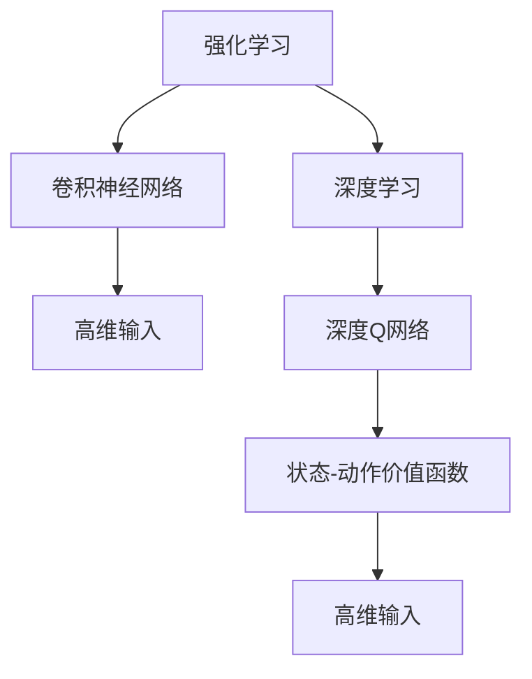
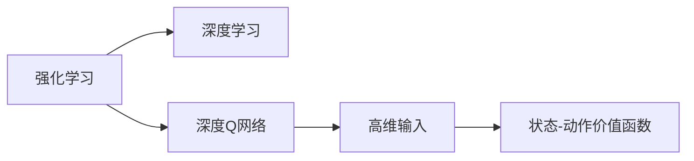
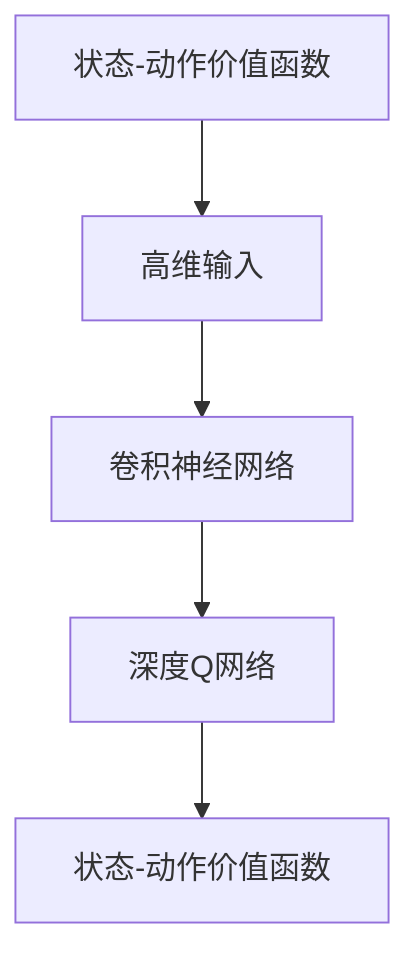
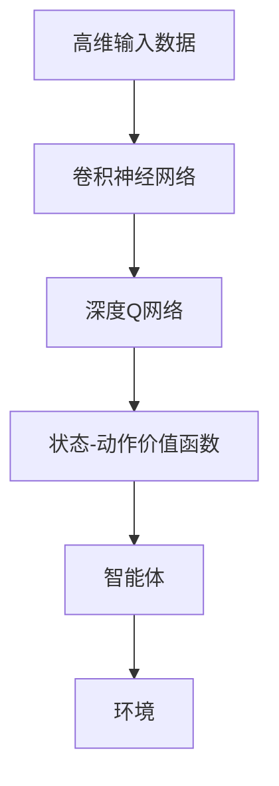

                 

# 一切皆是映射：使用DQN处理高维输入：视觉信息在强化学习的运用

## 1. 背景介绍

### 1.1 问题由来
在强化学习（Reinforcement Learning, RL）领域，一个核心问题是如何有效处理高维输入空间，特别是当输入是图像、视频等视觉信息时。视觉信息通常具有大量特征和复杂结构，单纯使用传统的数值型输入数据，无法直接与强化学习模型对接。如何高效地将视觉信息转化为强化学习能够处理的形式，是一个长期困扰研究者的难题。

近年来，随着深度学习（Deep Learning, DL）的发展，尤其是卷积神经网络（Convolutional Neural Network, CNN）的成熟，这一问题得到了部分缓解。使用预训练的CNN模型，可以将视觉信息映射为低维特征向量，然后作为强化学习模型的输入。但这种方法仍然存在一定的局限性，无法灵活处理复杂的多维输入。

### 1.2 问题核心关键点
针对这一问题，研究人员提出了利用深度Q网络（Deep Q-Network, DQN）处理高维输入的方法。DQN通过结合深度学习与强化学习的特点，使得模型能够自动学习输入的复杂映射关系，同时保留了强化学习在探索与利用之间的平衡能力。

DQN的核心思想是将深度神经网络与Q-learning算法结合。Q-learning是一种经典的强化学习算法，通过学习一个状态-动作价值函数（Q-value），来决定在不同状态下应该采取哪个动作，以最大化长期累积奖励。DQN通过使用深度神经网络来逼近Q-value函数，使得模型能够处理高维输入数据，同时保留了Q-learning的核心思想。

### 1.3 问题研究意义
研究DQN处理高维输入的方法，对于构建更智能、更灵活的强化学习系统具有重要意义：

1. 扩展应用范围：DQN使得强化学习可以应用于视觉信息处理领域，如游戏、机器人控制等，拓宽了RL的应用场景。
2. 提升性能：通过学习复杂的输入映射，DQN能够在处理高维数据时获得更好的学习效果和泛化能力。
3. 高效学习：DQN通过深度学习的网络结构，可以自动提取输入的高级特征，减少了手工特征工程的复杂度。
4. 算法稳定性：DQN在处理高维输入时，能够避免一些常见的过拟合问题，提高算法的稳定性。
5. 可扩展性：DQN框架可以灵活扩展到多种类型的高维数据，如图像、视频、音频等。

## 2. 核心概念与联系

### 2.1 核心概念概述

为了更好地理解DQN处理高维输入的方法，本节将介绍几个密切相关的核心概念：

- 强化学习（Reinforcement Learning, RL）：一种通过智能体与环境交互，学习如何最大化累积奖励的机器学习方法。强化学习算法包括Q-learning、SARSA、Deep Q-Network等。
- 深度学习（Deep Learning, DL）：一种基于多层神经网络的学习方法，可以自动提取输入数据的高级特征，适用于高维数据处理。
- 卷积神经网络（Convolutional Neural Network, CNN）：一种专门处理图像数据的深度神经网络，能够自动提取图像的局部特征和全局特征。
- 状态-动作价值函数（Q-value）：强化学习中的核心概念，表示在当前状态下，执行某个动作的长期累积奖励。
- 深度Q网络（Deep Q-Network, DQN）：一种结合深度学习和强化学习的算法，通过深度神经网络逼近Q-value函数，处理高维输入数据。

这些核心概念之间的逻辑关系可以通过以下Mermaid流程图来展示：



这个流程图展示了几类核心概念的相互关系：

1. 强化学习与深度学习结合，形成DQN算法。
2. CNN作为深度学习的核心，可以处理高维输入数据。
3. DQN通过学习状态-动作价值函数，指导智能体在环境中采取行动。
4. 最终，DQN能够高效处理高维输入数据，如图像、视频等视觉信息。

### 2.2 概念间的关系

这些核心概念之间存在着紧密的联系，形成了DQN处理高维输入的整体生态系统。下面我通过几个Mermaid流程图来展示这些概念之间的关系。

#### 2.2.1 强化学习与深度学习的结合



这个流程图展示了强化学习与深度学习的结合过程。强化学习通过DQN算法，结合深度神经网络，能够高效处理高维输入数据。

#### 2.2.2 DQN的处理高维输入能力



这个流程图展示了DQN处理高维输入的流程。高维输入数据首先通过CNN提取特征，然后由DQN学习状态-动作价值函数，最终输出动作选择。

### 2.3 核心概念的整体架构

最后，我们用一个综合的流程图来展示这些核心概念在大语言模型微调过程中的整体架构：



这个综合流程图展示了从高维输入数据，到深度Q网络的映射过程，再到智能体与环境交互的完整流程。通过这一过程，DQN能够高效处理高维输入，并在强化学习框架下进行动作选择和环境交互。

## 3. 核心算法原理 & 具体操作步骤
### 3.1 算法原理概述

DQN处理高维输入的算法原理，可以简要概述为以下几点：

1. **深度神经网络逼近Q-value函数**：使用卷积神经网络逼近Q-value函数，从而能够处理高维输入数据。
2. **经验回放（Experience Replay）**：将智能体在环境中与环境交互产生的数据（状态、动作、奖励）存储到经验缓冲区中，然后随机采样用于训练网络。
3. **目标网络（Target Network）**：使用两个深度神经网络，一个用于网络更新（目标网络），另一个用于目标值的计算（目标网络）。
4. **目标Q值更新**：通过目标网络计算当前状态的目标Q值，用于更新网络权重。
5. **动作选择**：在每个时间步，智能体根据状态-动作价值函数选择动作，最大化长期累积奖励。

### 3.2 算法步骤详解

DQN处理高维输入的具体操作步骤如下：

**Step 1: 准备预训练CNN模型**
- 选择合适的预训练CNN模型，如ResNet、Inception等。
- 将CNN模型作为DQN的输入处理模块。

**Step 2: 构建DQN模型**
- 使用预训练的CNN模型提取高维输入数据特征。
- 在特征输出上使用全连接层构建Q-value函数，包括动作选择和奖励评估。
- 定义DQN模型的训练损失函数，如均方误差（MSE）等。

**Step 3: 经验回放**
- 在每一步环境交互中，将当前状态、动作、奖励和下一个状态存储到经验缓冲区中。
- 周期性从经验缓冲区中随机采样一小批数据，用于训练DQN模型。

**Step 4: 目标网络**
- 构建两个深度神经网络，一个用于网络更新（主网络），另一个用于目标值的计算（目标网络）。
- 目标网络定期从主网络参数中更新，以保持稳定性。

**Step 5: 目标Q值更新**
- 使用目标网络计算当前状态的目标Q值。
- 将目标Q值与实际Q值（动作执行后的奖励）进行比较，计算损失，反向传播更新网络参数。

**Step 6: 动作选择**
- 在每个时间步，智能体根据状态-动作价值函数选择动作。
- 在训练过程中，使用随机策略探索环境，在测试过程中，使用策略优化探索与利用的平衡。

### 3.3 算法优缺点

DQN处理高维输入的方法具有以下优点：

1. **高效处理高维输入**：DQN通过深度神经网络逼近Q-value函数，能够高效处理图像、视频等高维输入数据。
2. **鲁棒性强**：深度神经网络具备良好的泛化能力，能够适应不同的输入分布。
3. **自动特征提取**：卷积神经网络能够自动提取输入数据的高级特征，减少了手工特征工程的复杂度。
4. **灵活性高**：DQN可以灵活扩展到多种类型的高维数据，如图像、视频、音频等。

但DQN也存在一些缺点：

1. **计算资源需求高**：深度神经网络通常需要大量的计算资源进行训练和推理，特别是大尺寸的卷积神经网络。
2. **训练过程复杂**：DQN的训练过程需要大量样本和计算资源，且容易陷入局部最优。
3. **难以解释**：深度神经网络作为黑盒模型，难以解释其内部工作机制和决策逻辑。
4. **数据依赖性强**：DQN对训练数据的质量和多样性要求较高，数据量不足时可能无法有效训练。

### 3.4 算法应用领域

DQN处理高维输入的方法，已经在多个领域得到了广泛的应用，例如：

- 游戏AI：DQN被广泛应用于游戏AI的开发，如AlphaGo、AlphaZero等。
- 机器人控制：DQN在机器人控制中也被广泛应用，通过视觉传感器输入指导机器人的行为选择。
- 自动驾驶：DQN在自动驾驶领域被用于车辆路径规划和交通信号识别。
- 医疗影像分析：DQN可以处理医疗影像数据，辅助医生进行疾病诊断和治疗方案选择。
- 金融市场预测：DQN被用于金融市场的时间序列预测，帮助投资者做出更精准的投资决策。
- 自然灾害预警：DQN在自然灾害的预警和监测中，通过卫星图像处理，提供早期预警信息。

## 4. 数学模型和公式 & 详细讲解  
### 4.1 数学模型构建

本节将使用数学语言对DQN处理高维输入的方法进行更加严格的刻画。

记预训练CNN模型为 $F_{\theta}$，其中 $\theta$ 为预训练得到的模型参数。假设高维输入数据为 $x$，对应的状态-动作价值函数为 $Q_{\theta}(x, a)$，其中 $a$ 为智能体的动作。设智能体在当前状态 $s_t$ 下执行动作 $a_t$，得到奖励 $r_t$，进入下一个状态 $s_{t+1}$。则DQN的目标是最小化预期损失函数 $\mathcal{L}(\theta)$，即：

$$
\mathcal{L}(\theta) = \mathbb{E}_{(s_t, a_t, r_t, s_{t+1}) \sim \mathcal{D}} [(Q_{\theta}(s_t, a_t) - (r_t + \gamma \max_{a'} Q_{\theta'}(s_{t+1}, a'))^2]
$$

其中 $\mathcal{D}$ 为经验回放缓冲区中存储的样本分布，$\gamma$ 为折扣因子，$\theta'$ 为目标网络参数。

### 4.2 公式推导过程

以下我们以图像识别任务为例，推导DQN的损失函数及其梯度计算公式。

假设智能体在每个时间步 $t$ 中选择动作 $a_t$，观察到下一个状态 $s_{t+1}$，并得到奖励 $r_t$。则DQN的目标是最小化以下损失函数：

$$
\mathcal{L}(\theta) = \mathbb{E}_{(s_t, a_t, r_t, s_{t+1}) \sim \mathcal{D}} [(Q_{\theta}(s_t, a_t) - (r_t + \gamma Q_{\theta'}(s_{t+1}, \pi(s_{t+1})))^2]
$$

其中 $Q_{\theta}(s_t, a_t)$ 表示在状态 $s_t$ 下执行动作 $a_t$ 的Q-value，$Q_{\theta'}(s_{t+1}, \pi(s_{t+1}))$ 表示在下一个状态 $s_{t+1}$ 下，智能体选择最优动作的Q-value，$\pi$ 表示智能体的动作选择策略。

通过链式法则，损失函数对模型参数 $\theta$ 的梯度为：

$$
\nabla_{\theta}\mathcal{L}(\theta) = -2\mathbb{E}_{(s_t, a_t, r_t, s_{t+1}) \sim \mathcal{D}} [(Q_{\theta}(s_t, a_t) - (r_t + \gamma Q_{\theta'}(s_{t+1}, \pi(s_{t+1}))) \nabla_{\theta}Q_{\theta}(s_t, a_t)]
$$

在训练过程中，通过反向传播算法，更新模型参数 $\theta$，使得损失函数最小化。

### 4.3 案例分析与讲解

假设我们使用预训练的ResNet-50作为CNN模型，将其输入图像数据 $x$ 转换为特征向量 $f$，然后在特征向量上使用全连接层构建Q-value函数。则智能体在状态 $s_t$ 下执行动作 $a_t$ 的Q-value为：

$$
Q_{\theta}(s_t, a_t) = W_1 f(s_t) + W_2 \cdot a_t
$$

其中 $W_1$ 和 $W_2$ 为全连接层的权重。在训练过程中，智能体需要从经验缓冲区中随机采样一批样本 $(s_t, a_t, r_t, s_{t+1})$，计算目标Q值 $Q_{\theta'}(s_{t+1}, \pi(s_{t+1}))$，然后反向传播更新网络参数 $\theta$。具体流程如下：

1. 随机采样一批样本 $(s_t, a_t, r_t, s_{t+1})$。
2. 计算智能体在当前状态 $s_t$ 下的Q-value：$Q_{\theta}(s_t, a_t) = W_1 f(s_t) + W_2 \cdot a_t$。
3. 使用目标网络 $Q_{\theta'}$ 计算下一个状态 $s_{t+1}$ 下的Q-value：$Q_{\theta'}(s_{t+1}, \pi(s_{t+1}))$。
4. 计算损失函数 $L$：$L = (Q_{\theta}(s_t, a_t) - (r_t + \gamma Q_{\theta'}(s_{t+1}, \pi(s_{t+1})))^2$。
5. 反向传播计算梯度，更新模型参数 $\theta$。

通过上述过程，智能体能够逐步学习到高维输入数据的状态-动作价值函数，实现高效的决策选择。

## 5. 项目实践：代码实例和详细解释说明
### 5.1 开发环境搭建

在进行DQN处理高维输入的实践前，我们需要准备好开发环境。以下是使用Python进行PyTorch开发的环境配置流程：

1. 安装Anaconda：从官网下载并安装Anaconda，用于创建独立的Python环境。

2. 创建并激活虚拟环境：
```bash
conda create -n pytorch-env python=3.8 
conda activate pytorch-env
```

3. 安装PyTorch：根据CUDA版本，从官网获取对应的安装命令。例如：
```bash
conda install pytorch torchvision torchaudio cudatoolkit=11.1 -c pytorch -c conda-forge
```

4. 安装TensorFlow：根据CUDA版本，从官网获取对应的安装命令。例如：
```bash
conda install tensorflow
```

5. 安装各类工具包：
```bash
pip install numpy pandas scikit-learn matplotlib tqdm jupyter notebook ipython
```

完成上述步骤后，即可在`pytorch-env`环境中开始DQN处理高维输入的实践。

### 5.2 源代码详细实现

这里我们以图像分类任务为例，使用DQN处理高维输入数据。具体实现步骤如下：

**Step 1: 准备数据集**
- 使用TensorFlow的Dataset API加载图像数据集，如CIFAR-10。
- 将图像数据转换为PIL格式，并进行标准化处理。

**Step 2: 定义CNN模型**
- 使用PyTorch的nn模块定义卷积神经网络模型，如ResNet-50。
- 将CNN模型作为DQN的输入处理模块。

**Step 3: 定义DQN模型**
- 在CNN模型的输出上定义全连接层，构建Q-value函数。
- 定义DQN模型的训练损失函数，如均方误差（MSE）等。

**Step 4: 经验回放**
- 在每一步环境交互中，将当前状态、动作、奖励和下一个状态存储到经验缓冲区中。
- 周期性从经验缓冲区中随机采样一小批数据，用于训练DQN模型。

**Step 5: 目标网络**
- 构建两个深度神经网络，一个用于网络更新（主网络），另一个用于目标值的计算（目标网络）。
- 目标网络定期从主网络参数中更新，以保持稳定性。

**Step 6: 目标Q值更新**
- 使用目标网络计算当前状态的目标Q值。
- 将目标Q值与实际Q值（动作执行后的奖励）进行比较，计算损失，反向传播更新网络参数。

**Step 7: 动作选择**
- 在每个时间步，智能体根据状态-动作价值函数选择动作。
- 在训练过程中，使用随机策略探索环境，在测试过程中，使用策略优化探索与利用的平衡。

**Step 8: 训练和评估**
- 定义训练参数，如学习率、批大小、迭代轮数等。
- 循环迭代训练过程，在每个epoch结束后，评估模型性能。
- 在测试集上评估模型性能，输出精度、召回率等指标。

### 5.3 代码解读与分析

让我们再详细解读一下关键代码的实现细节：

**加载和预处理数据集**
```python
import tensorflow as tf
from tensorflow.keras import datasets, layers, models

# 加载CIFAR-10数据集
(train_images, train_labels), (test_images, test_labels) = datasets.cifar10.load_data()

# 将图像数据转换为PIL格式
train_images = tf.keras.utils.to_categorical(train_images, 10)
test_images = tf.keras.utils.to_categorical(test_images, 10)

# 标准化图像数据
train_images = train_images / 255.0
test_images = test_images / 255.0
```

**定义CNN模型**
```python
import torch.nn as nn

# 定义ResNet-50模型
class ResNet(nn.Module):
    def __init__(self):
        super(ResNet, self).__init__()
        self.conv1 = nn.Conv2d(3, 64, kernel_size=3, stride=1, padding=1)
        self.bn1 = nn.BatchNorm2d(64)
        self.relu = nn.ReLU()
        self.maxpool = nn.MaxPool2d(kernel_size=2, stride=2)
        self.layer1 = nn.Sequential(
            nn.Conv2d(64, 64, kernel_size=3, stride=1, padding=1),
            nn.BatchNorm2d(64),
            nn.ReLU(),
            nn.MaxPool2d(kernel_size=2, stride=2)
        )
        self.layer2 = nn.Sequential(
            nn.Conv2d(64, 128, kernel_size=3, stride=1, padding=1),
            nn.BatchNorm2d(128),
            nn.ReLU(),
            nn.MaxPool2d(kernel_size=2, stride=2)
        )
        self.layer3 = nn.Sequential(
            nn.Conv2d(128, 256, kernel_size=3, stride=1, padding=1),
            nn.BatchNorm2d(256),
            nn.ReLU(),
            nn.MaxPool2d(kernel_size=2, stride=2)
        )
        self.layer4 = nn.Sequential(
            nn.Conv2d(256, 512, kernel_size=3, stride=1, padding=1),
            nn.BatchNorm2d(512),
            nn.ReLU(),
            nn.MaxPool2d(kernel_size=2, stride=2)
        )
        self.fc1 = nn.Linear(512 * 8 * 8, 4096)
        self.fc2 = nn.Linear(4096, 10)

    def forward(self, x):
        x = self.conv1(x)
        x = self.bn1(x)
        x = self.relu(x)
        x = self.maxpool(x)
        x = self.layer1(x)
        x = self.layer2(x)
        x = self.layer3(x)
        x = self.layer4(x)
        x = x.view(-1, 512 * 8 * 8)
        x = self.fc1(x)
        x = self.relu(x)
        x = self.fc2(x)
        return x
```

**定义DQN模型**
```python
import torch
import torch.nn as nn
import torch.optim as optim

# 定义DQN模型
class DQN(nn.Module):
    def __init__(self):
        super(DQN, self).__init__()
        self.cnn = ResNet()
        self.fc1 = nn.Linear(512 * 8 * 8, 512)
        self.fc2 = nn.Linear(512, 10)
        self.target_cnn = ResNet()
        self.target_fc1 = nn.Linear(512 * 8 * 8, 512)
        self.target_fc2 = nn.Linear(512, 10)

    def forward(self, x):
        x = self.cnn(x)
        x = torch.flatten(x, 1)
        x = self.fc1(x)
        x = torch.relu(x)
        x = self.fc2(x)
        return x

    def target_forward(self, x):
        x = self.target_cnn(x)
        x = torch.flatten(x, 1)
        x = self.target_fc1(x)
        x = torch.relu(x)
        x = self.target_fc2(x)
        return x

    def update_target(self, lr):
        for target_param, param in zip(self.target_cnn.parameters(), self.cnn.parameters()):
            target_param.data.copy_(param.data)
            target_param.data = target_param.data.to(target_param.data.device)
        for target_param, param in zip(self.target_fc1.parameters(), self.fc1.parameters()):
            target_param.data.copy_(param.data)
            target_param.data = target_param.data.to(target_param.data.device)
        for target_param, param in zip(self.target_fc2.parameters(), self.fc2.parameters()):
            target_param.data.copy_(param.data)
            target_param.data = target_param.data.to(target_param.data.device)
        for target_param, param in zip(self.target_fc1.parameters(), self.fc1.parameters()):
            target_param.data = target_param.data - lr * (target_param.data - param.data)
            target_param.data = target_param.data.to(target_param.data.device)
        for target_param, param in zip(self.target_fc2.parameters(), self.fc2.parameters()):
            target_param.data = target_param.data - lr * (target_param.data - param.data)
            target_param.data = target_param.data.to(target_param.data.device)
```

**经验回放**
```python
import torch
import random

# 定义经验回放缓冲区
buffer = []

# 定义随机采样函数
def sample_minibatch(batch_size):
    batch = random.sample(buffer, batch_size)
    states = [x[0] for x in batch]
    actions = [x[1] for x in batch]
    rewards = [x[2] for x in batch]
    next_states = [x[3] for x in batch]
    return states, actions, rewards, next_states

# 定义数据存储函数
def add_to_buffer(state, action, reward, next_state):
    buffer.append((state, action, reward, next_state))
    if len(buffer) > 10000:
        del buffer[0]
```

**目标网络更新**
```python
import torch.nn as nn
import torch.optim as optim

# 定义DQN模型
dqn = DQN()

# 定义优化器
optimizer = optim.Adam(dqn.parameters(), lr=0.001)

# 定义目标网络
target_dqn = DQN()

# 定义更新目标网络的函数
def update_target_network():
    target_dqn.load_state_dict(dqn.state_dict())
```

**目标Q值更新**
```python
import torch.nn as nn
import torch.optim as optim

# 定义DQN模型
dqn = DQN()

# 定义优化器
optimizer = optim.Adam(dqn.parameters(), lr=0.001)

# 定义目标网络
target_dqn = DQN()

# 定义更新目标网络的函数
def update_target_network():
    target_dqn.load_state_dict(dqn.state_dict())

# 定义目标Q值更新的函数
def target_q_value_update():
    for target_param, param in zip(dqn.parameters(), target_dqn.parameters()):
        target_param.data.copy_(param.data)
        target_param.data = target_param.data.to(target_param.data.device)
        target_param

