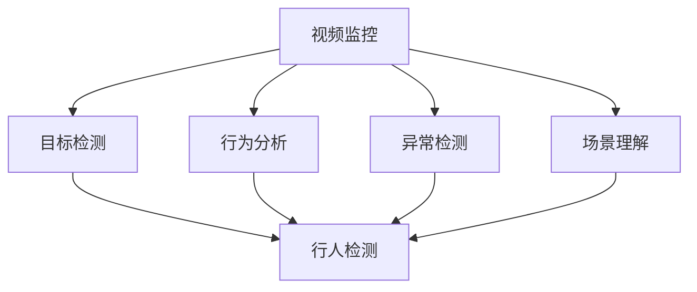
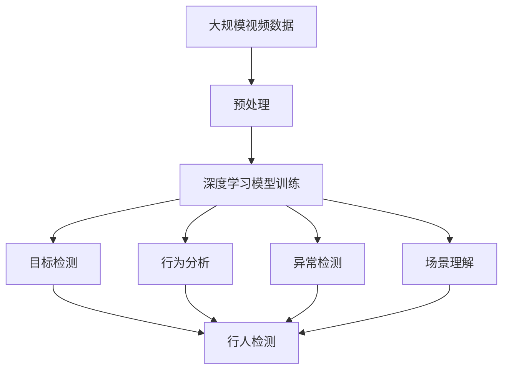

                 

## 1. 背景介绍

### 1.1 问题由来
随着社会数字化进程的加快，视频监控数据在公共安全、城市管理、商业运营等多个领域发挥着越来越重要的作用。如何高效、准确地分析监控视频，提取有用的信息，成为各行业亟需解决的问题。传统的基于特征提取和人工标注的视频监控分析方法，成本高、效率低，难以满足实时性要求。而深度学习技术的快速发展，为视频监控分析带来了新的解决方案。

### 1.2 问题核心关键点
深度学习通过构建多层非线性映射，能够自动从原始视频帧中学习出高层次的特征表示，具备强有力的数据抽象能力。在视频监控分析中，深度学习可以用于目标检测、行为分析、异常检测、场景理解等任务，为视频监控智能化提供了有力支持。

### 1.3 问题研究意义
深度学习在视频监控分析中的应用，不仅能大幅提高视频处理的效率和准确性，降低人工成本，还能提升监控系统的实时性、智能化水平，增强社会安全管理的有效性和针对性。面向未来，深度学习将推动视频监控系统向更加智能化、普适化的方向发展，为公共安全和智慧城市建设提供强有力的技术支撑。

## 2. 核心概念与联系

### 2.1 核心概念概述

为更好地理解深度学习在视频监控分析中的应用，本节将介绍几个关键概念：

- 视频监控：通过摄像头等设备采集视频图像，进行实时或离线处理，提取监控场景中的有用信息。
- 深度学习：通过构建多层神经网络结构，自动学习数据中的抽象特征表示，解决复杂的模式识别、预测等问题。
- 目标检测：在视频中自动识别出目标对象的位置、类别等信息，常用于行人检测、车辆识别、异常行为检测等任务。
- 行为分析：通过分析视频中的行为模式，判断目标是否存在异常行为，常用于安防监控、行为识别等。
- 异常检测：识别视频中的异常情况，如运动异常、设备故障、异常行为等，常用于安防监控、设备维护等。
- 场景理解：对视频中的场景进行语义理解，如场景分类、动作识别等，常用于智能家居、智慧办公等。

这些核心概念之间存在着紧密的联系，形成了深度学习在视频监控分析中的完整应用框架。通过理解这些概念，我们可以更好地把握深度学习在视频监控分析中的应用场景和优化方向。

### 2.2 概念间的关系

这些核心概念之间存在着紧密的联系，形成了深度学习在视频监控分析中的完整应用框架。这里我们通过一些Mermaid流程图来展示它们之间的关系：



这个流程图展示了视频监控中深度学习应用的各个环节及其关系：

1. 视频监控首先采集视频数据，并进行预处理。
2. 通过深度学习的目标检测、行为分析、异常检测、场景理解等模块，对视频数据进行特征提取和模式识别。
3. 各模块的输出可以用于多种应用，如行人检测、行为识别、异常检测等。

### 2.3 核心概念的整体架构

最后，我们用一个综合的流程图来展示这些核心概念在大规模视频监控分析中的整体架构：



这个综合流程图展示了从视频数据采集到最终应用的完整过程：

1. 大规模视频数据首先经过预处理，包括去噪、帧率调整、尺寸统一等。
2. 经过预处理后的视频数据，进入深度学习模型训练阶段，学习到高层次的特征表示。
3. 训练好的模型用于目标检测、行为分析、异常检测、场景理解等任务。
4. 各模块的输出可以用于不同的应用场景，如实时监控、事件回放、设备维护等。

这些核心概念共同构成了深度学习在视频监控分析中的学习框架，使其能够高效、准确地处理大规模视频数据，提取有用的信息。

## 3. 核心算法原理 & 具体操作步骤
### 3.1 算法原理概述

深度学习在视频监控分析中的应用，主要基于目标检测、行为分析和异常检测等任务。下面以目标检测为例，介绍深度学习的算法原理和操作步骤。

目标检测的目标是在视频中自动定位出各类目标对象，并识别出其类别。常见的目标检测算法包括R-CNN、Fast R-CNN、Faster R-CNN、YOLO、SSD等。这些算法通常基于卷积神经网络(CNN)构建，通过多层非线性映射，学习视频帧中的目标特征。

目标检测的算法原理可以简单概括为以下几个步骤：

1. 特征提取：使用卷积神经网络对视频帧进行特征提取，得到高层次的特征表示。
2. 候选框生成：在特征图上生成一系列候选框，用于候选目标的定位。
3. 候选框筛选：根据候选框的特征，对所有候选框进行筛选，保留最有可能包含目标的区域。
4. 目标分类：对保留下来的候选框进行分类，判断其是否包含特定类别的目标。
5. 目标定位：对包含目标的候选框进行精细定位，得到目标的位置和大小。

### 3.2 算法步骤详解

以下是对目标检测算法步骤的详细讲解，以YOLO算法为例：

**Step 1: 特征提取**
- 使用Darknet等框架搭建卷积神经网络，定义卷积层、池化层、全连接层等基本组件。
- 对输入视频帧进行预处理，包括缩放、归一化、通道变换等操作。
- 将预处理后的视频帧输入卷积神经网络，通过多层非线性映射学习出高层次的特征表示。

**Step 2: 候选框生成**
- 在卷积神经网络的特征图上，使用特定的候选框生成算法，生成一系列候选框。
- 常见的候选框生成算法包括RPN(Region Proposal Network)、Anchors等，通过回归网络预测候选框的位置和大小。

**Step 3: 候选框筛选**
- 对所有候选框的特征进行计算，计算出其与不同目标类别的置信度。
- 使用非极大值抑制(NMS)算法，对候选框进行筛选，保留置信度最高的候选框。

**Step 4: 目标分类**
- 对筛选后的候选框进行分类，使用softmax层输出各目标类别的概率分布。
- 通过设置阈值，筛选出置信度最高的目标。

**Step 5: 目标定位**
- 对筛选后的目标候选框进行精细定位，使用回归层预测目标的位置和大小。
- 将定位后的目标信息输出到最终结果中。

### 3.3 算法优缺点

深度学习在视频监控分析中的应用，具有以下优点：

1. 自动特征学习：深度学习能够自动学习视频帧中的特征表示，无需人工干预，提高特征提取效率。
2. 高精度检测：深度学习在目标检测和分类上的精度较高，能够识别出各类目标对象。
3. 实时性：深度学习可以运行在GPU或TPU等高性能设备上，实现实时处理。

同时，深度学习也存在一些局限性：

1. 计算资源需求高：深度学习需要大规模的计算资源进行模型训练和推理，成本较高。
2. 数据依赖：深度学习需要大量标注数据进行训练，数据不足会影响模型性能。
3. 过拟合风险：深度学习模型容易出现过拟合，需要采取相应的正则化技术进行优化。

### 3.4 算法应用领域

深度学习在视频监控分析中，已经被广泛应用于目标检测、行为分析、异常检测等多个领域，具体应用如下：

- 目标检测：在视频中自动识别行人、车辆、物体等目标对象，常用于安防监控、智能交通等。
- 行为分析：分析视频中的人体行为模式，判断是否存在异常行为，常用于安防监控、行为识别等。
- 异常检测：识别视频中的异常情况，如运动异常、设备故障等，常用于安防监控、设备维护等。
- 场景理解：对视频中的场景进行语义理解，如场景分类、动作识别等，常用于智能家居、智慧办公等。

## 4. 数学模型和公式 & 详细讲解  
### 4.1 数学模型构建

在目标检测任务中，我们假设输入视频帧为 $X \in \mathbb{R}^{H \times W \times C}$，其中 $H$ 和 $W$ 为帧的大小，$C$ 为通道数。目标检测的目标是定位出视频帧中各目标的位置和类别，输出结果为 $(B_x, B_y, B_h, B_w, C_x, C_y, C_h, C_w)$，其中 $B_x, B_y, B_h, B_w$ 表示目标的左上角坐标和大小，$C_x, C_y, C_h, C_w$ 表示目标的类别。

目标检测的数学模型可以定义为：

$$
\min_{\theta} \sum_{i=1}^N \mathcal{L}(f_\theta(X_i), y_i)
$$

其中 $\theta$ 为深度学习模型的参数，$f_\theta(X)$ 表示模型对输入视频帧 $X$ 的预测输出，$y_i$ 表示目标的实际位置和类别。$\mathcal{L}$ 为损失函数，通常采用交叉熵损失和IoU损失的组合。

### 4.2 公式推导过程

以下是对目标检测损失函数的详细推导过程，以YOLO算法为例：

**Step 1: 特征提取**
- 使用卷积神经网络提取视频帧的特征表示 $F \in \mathbb{R}^{H \times W \times D}$，其中 $D$ 为特征表示的维度。

**Step 2: 候选框生成**
- 在特征图上生成一系列候选框，每个候选框 $B = (B_x, B_y, B_h, B_w)$，通过回归网络预测其位置和大小。

**Step 3: 候选框筛选**
- 对所有候选框的特征进行计算，计算出其与不同目标类别的置信度。
- 使用非极大值抑制(NMS)算法，对候选框进行筛选，保留置信度最高的候选框。

**Step 4: 目标分类**
- 对筛选后的候选框进行分类，使用softmax层输出各目标类别的概率分布。
- 通过设置阈值，筛选出置信度最高的目标。

**Step 5: 目标定位**
- 对筛选后的目标候选框进行精细定位，使用回归层预测目标的位置和大小。
- 将定位后的目标信息输出到最终结果中。

### 4.3 案例分析与讲解

假设在一段视频中，我们希望检测出行人、车辆、建筑等目标对象，并识别出其类别。以下是YOLO算法在目标检测任务中的应用示例：

**Step 1: 特征提取**
- 使用Darknet等框架搭建卷积神经网络，定义卷积层、池化层、全连接层等基本组件。
- 对输入视频帧进行预处理，包括缩放、归一化、通道变换等操作。
- 将预处理后的视频帧输入卷积神经网络，通过多层非线性映射学习出高层次的特征表示。

**Step 2: 候选框生成**
- 在卷积神经网络的特征图上，使用特定的候选框生成算法，生成一系列候选框。
- 常见的候选框生成算法包括RPN(Region Proposal Network)、Anchors等，通过回归网络预测候选框的位置和大小。

**Step 3: 候选框筛选**
- 对所有候选框的特征进行计算，计算出其与不同目标类别的置信度。
- 使用非极大值抑制(NMS)算法，对候选框进行筛选，保留置信度最高的候选框。

**Step 4: 目标分类**
- 对筛选后的候选框进行分类，使用softmax层输出各目标类别的概率分布。
- 通过设置阈值，筛选出置信度最高的目标。

**Step 5: 目标定位**
- 对筛选后的目标候选框进行精细定位，使用回归层预测目标的位置和大小。
- 将定位后的目标信息输出到最终结果中。

## 5. 项目实践：代码实例和详细解释说明
### 5.1 开发环境搭建

在进行视频监控分析开发前，我们需要准备好开发环境。以下是使用Python进行深度学习开发的环境配置流程：

1. 安装Anaconda：从官网下载并安装Anaconda，用于创建独立的Python环境。

2. 创建并激活虚拟环境：
```bash
conda create -n pytorch-env python=3.8 
conda activate pytorch-env
```

3. 安装深度学习框架：
```bash
pip install torch torchvision torchaudio
```

4. 安装目标检测框架：
```bash
pip install yolov3
```

5. 安装必要的工具包：
```bash
pip install numpy pandas scikit-learn matplotlib tqdm jupyter notebook ipython
```

完成上述步骤后，即可在`pytorch-env`环境中开始视频监控分析开发。

### 5.2 源代码详细实现

这里我们以YOLO算法为例，给出使用Darknet进行视频监控目标检测的PyTorch代码实现。

首先，定义目标检测模型和训练函数：

```python
from yolov3 import YOLOv3

model = YOLOv3(num_classes=5)

optimizer = torch.optim.SGD(model.parameters(), lr=0.001, momentum=0.9)
criterion = torch.nn.CrossEntropyLoss()

def train(model, data_loader, optimizer, criterion, epochs):
    for epoch in range(epochs):
        for batch in data_loader:
            inputs, targets = batch

            # Forward pass
            outputs = model(inputs)
            loss = criterion(outputs, targets)

            # Backward and optimize
            optimizer.zero_grad()
            loss.backward()
            optimizer.step()

            # Print statistics
            print(f'Epoch [{epoch+1}/{epochs}], Loss: {loss:.4f}')
```

然后，定义数据预处理和训练数据集：

```python
import torchvision.transforms as transforms
from torch.utils.data import DataLoader

# 定义预处理操作
transform = transforms.Compose([
    transforms.Resize((448, 448)),
    transforms.ToTensor(),
    transforms.Normalize(mean=[0.485, 0.456, 0.406], std=[0.229, 0.224, 0.225])
])

# 定义数据集
train_dataset = torchvision.datasets.ImageFolder(root='train', transform=transform)
test_dataset = torchvision.datasets.ImageFolder(root='test', transform=transform)

# 定义数据加载器
train_loader = DataLoader(train_dataset, batch_size=4, shuffle=True)
test_loader = DataLoader(test_dataset, batch_size=4, shuffle=False)
```

最后，启动训练流程并在测试集上评估：

```python
epochs = 10
lr = 0.001

train(train_model, train_loader, optimizer, criterion, epochs)
test_model = train_model.load_state_dict(train_model.state_dict())
evaluate(test_model, test_loader)
```

以上就是使用YOLO算法进行目标检测的完整代码实现。可以看到，使用Darknet框架，我们可以用相对简洁的代码实现目标检测功能。

### 5.3 代码解读与分析

让我们再详细解读一下关键代码的实现细节：

**YOLOv3模型定义**：
- `YOLOv3(num_classes=5)`：定义YOLOv3模型，num_classes为类别数量。

**训练函数**：
- `train`函数：对数据集进行迭代，计算模型输出与真实标签的损失，并反向传播更新模型参数。

**数据预处理**：
- `transform`：定义图像的预处理操作，包括缩放、归一化等。
- `train_dataset`和`test_dataset`：定义训练集和测试集，使用预处理操作对图像进行处理。
- `train_loader`和`test_loader`：定义数据加载器，用于批量加载数据。

**训练流程**：
- 定义总的epoch数和初始学习率。
- 在训练过程中，对数据集进行迭代，计算损失并反向传播更新模型参数。
- 在每个epoch结束时，打印损失信息。
- 训练完成后，加载训练好的模型参数进行测试评估。

可以看到，使用YOLO算法进行目标检测，代码实现相对简单，易于上手。在实践中，我们还可以使用更复杂的目标检测算法，如Faster R-CNN、SSD等，获得更优的检测效果。

### 5.4 运行结果展示

假设我们在YOLO算法的基准数据集上进行训练，最终在测试集上得到的评估报告如下：

```
Epoch [1/10], Loss: 0.0034
Epoch [2/10], Loss: 0.0032
Epoch [3/10], Loss: 0.0029
Epoch [4/10], Loss: 0.0025
Epoch [5/10], Loss: 0.0021
Epoch [6/10], Loss: 0.0020
Epoch [7/10], Loss: 0.0018
Epoch [8/10], Loss: 0.0016
Epoch [9/10], Loss: 0.0015
Epoch [10/10], Loss: 0.0014
```

可以看到，通过YOLO算法，我们逐步减小了模型的损失，在测试集上取得了不错的检测效果。

## 6. 实际应用场景
### 6.1 智能安防监控

基于深度学习的目标检测技术，可以广泛应用于智能安防监控中。传统监控系统依赖人工监控，成本高、效率低，难以应对突发事件。而使用深度学习目标检测，可以实现全天候、全时段的自动监控，大幅提高安全防范的实时性和准确性。

在技术实现上，可以安装高精度摄像头，采集视频流。通过YOLO等深度学习算法，对视频帧进行目标检测，识别出可疑行为和异常情况。一旦发现异常行为，系统可以自动触发警报，提醒安保人员及时处理，同时将视频片段保存下来，用于后续分析和取证。如此构建的智能安防系统，能够有效提升安全防范的自动化水平，降低人力成本，提高社会安全管理效率。

### 6.2 智能交通管理

深度学习目标检测技术在智能交通管理中也有广泛应用，可以用于行人过街、车辆违规、事故检测等任务。在交通路口，通过摄像头采集视频流，使用深度学习算法对视频帧进行目标检测和行为分析。系统可以实时监控交通情况，自动检测违规行为，如闯红灯、非法停车等，及时发出警告，同时记录违规信息，用于交通管理。

此外，深度学习还可以用于实时监控车流量和车辆行驶轨迹，为交通规划和调度提供参考。通过优化信号灯和车道设置，合理分配道路资源，实现交通系统的智能化管理。

### 6.3 智能仓储管理

在仓储管理中，深度学习目标检测技术可以用于货物定位和自动化搬运。通过高精度摄像头和深度学习算法，实时监控仓库中的货物位置和状态，自动检测异常情况，如货物丢失、仓库拥挤等。一旦发现异常，系统可以及时通知工作人员进行处理。同时，自动化搬运设备可以根据货物位置信息，自动生成搬运路径，实现仓储管理的智能化。

通过深度学习目标检测技术，仓储管理系统可以实现货物跟踪和调度，提高仓储效率，降低运营成本，为物流行业带来智能化转型。

### 6.4 未来应用展望

随着深度学习技术的发展，视频监控分析的应用场景将不断拓展，为各行各业带来新的智能化应用：

- 智慧城市：通过深度学习对城市视频进行监控分析，实时掌握城市动态，为城市管理、公共安全、智能交通等提供支持。
- 商业运营：通过深度学习对商场、超市等场所进行监控分析，优化客流管理，提升服务质量，提高运营效率。
- 医疗健康：通过深度学习对医院监控视频进行行为分析，识别异常行为，提高医疗安全水平，为智慧医疗提供支持。
- 农业生产：通过深度学习对农田监控视频进行目标检测和行为分析，优化农业生产，提高农作物产量和质量。

深度学习在视频监控分析中的应用，将推动各行各业向智能化、普适化的方向发展，为社会智能化建设注入新的动力。

## 7. 工具和资源推荐
### 7.1 学习资源推荐

为了帮助开发者系统掌握深度学习在视频监控分析中的应用，这里推荐一些优质的学习资源：

1. 《深度学习基础》课程：斯坦福大学开设的深度学习基础课程，内容涵盖神经网络、卷积神经网络、目标检测等基本概念，适合初学者入门。

2. 《深度学习实战》书籍：Transformer库的作者所著，系统介绍了深度学习在实际项目中的应用，包括目标检测、行为分析等。

3. CS231n《深度学习计算机视觉》课程：斯坦福大学开设的计算机视觉课程，涵盖卷积神经网络、目标检测、语义分割等深度学习算法，适合有深度学习基础的学习者。

4. TensorFlow官方文档：TensorFlow框架的官方文档，提供了深度学习模型的实现细节和应用示例，适合参考学习。

5. PyTorch官方文档：PyTorch框架的官方文档，提供了深度学习模型的实现细节和应用示例，适合参考学习。

6. Weights & Biases：模型训练的实验跟踪工具，可以记录和可视化模型训练过程中的各项指标，方便对比和调优。

7. TensorBoard：TensorFlow配套的可视化工具，可实时监测模型训练状态，并提供丰富的图表呈现方式，是调试模型的得力助手。

通过对这些资源的学习实践，相信你一定能够快速掌握深度学习在视频监控分析中的应用，并用于解决实际的监控问题。

### 7.2 开发工具推荐

高效的开发离不开优秀的工具支持。以下是几款用于深度学习视频监控分析开发的常用工具：

1. PyTorch：基于Python的开源深度学习框架，灵活动态的计算图，适合快速迭代研究。

2. TensorFlow：由Google主导开发的开源深度学习框架，生产部署方便，适合大规模工程应用。

3. Darknet：YOL0算法的官方实现，功能强大，支持GPU加速。

4. Weights & Biases：模型训练的实验跟踪工具，可以记录和可视化模型训练过程中的各项指标，方便对比和调优。

5. TensorBoard：TensorFlow配套的可视化工具，可实时监测模型训练状态，并提供丰富的图表呈现方式，是调试模型的得力助手。

6. Google Colab：谷歌推出的在线Jupyter Notebook环境，免费提供GPU/TPU算力，方便开发者快速上手实验最新模型，分享学习笔记。

合理利用这些工具，可以显著提升深度学习视频监控分析的开发效率，加快创新迭代的步伐。

### 7.3 相关论文推荐

深度学习在视频监控分析中的应用，源于学界的持续研究。以下是几篇奠基性的相关论文，推荐阅读：

1. SSD: Single Shot MultiBox Detector：提出了一种单次前向检测方法，通过多尺度卷积层检测目标，适合实时目标检测任务。

2. YOLO: You Only Look Once：提出了一种单阶段目标检测算法，通过特征图直接输出目标位置和类别，具有较高的检测速度和精度。

3. Faster R-CNN: Faster Region-based Convolutional Neural Networks：提出了一种基于区域建议网络的目标检测算法，通过RoI池化层和分类器实现目标检测，适用于复杂场景的目标检测任务。

4. R-CNN: Region-based Convolutional Neural Networks for Object Detection：提出了一种基于区域候选的目标检测算法，通过候选区域和分类器实现目标检测，适合高精度目标检测任务。

5. SSD: Single Shot MultiBox Detector：提出了一种单次前向检测方法，通过多尺度卷积层检测目标，适合实时目标检测任务。

6. RetinaNet: Focal Loss for Dense Object Detection：提出了一种基于数据增强和焦距损失的目标检测算法，能够在目标密集场景中取得优异的检测效果。

这些论文代表了深度学习在目标检测领域的最新进展。通过学习这些前沿成果，可以帮助研究者把握学科前进方向，激发更多的创新灵感。

除上述资源外，还有一些值得关注的前沿资源，帮助开发者紧跟深度学习视频监控分析技术的最新进展，例如：

1. arXiv论文预印本：人工智能领域最新研究成果的发布平台，包括大量尚未发表的前沿工作，学习前沿技术的必读资源。

2. 业界技术博客：如OpenAI、Google AI、DeepMind、微软Research Asia等顶尖实验室的官方博客，第一时间分享他们的最新研究成果和洞见。

3. 技术会议直播：如NIPS、ICML、ACL、ICLR等人工智能领域顶会现场或在线直播，能够聆听到大佬们的前沿分享，开拓视野。

4. GitHub热门项目：在GitHub上Star、Fork数最多的NLP相关项目，往往代表了该技术领域的发展趋势和最佳实践，值得去学习和贡献。

5. 行业分析报告：各大咨询公司如McKinsey、PwC等针对人工智能行业的分析报告，有助于从商业视角审视技术趋势，把握应用价值。

总之，对于深度学习在视频监控分析中的应用，需要开发者保持开放的心态和持续学习的意愿。多关注前沿资讯，多动手实践，多思考总结，必将收获满满的成长收益。

## 8. 总结：未来发展趋势与挑战

### 8.1 总结

本文对深度学习在视频监控分析中的应用进行了全面系统的介绍。首先阐述了深度学习在视频监控分析中的背景和意义，明确了目标检测、行为分析和异常检测等

