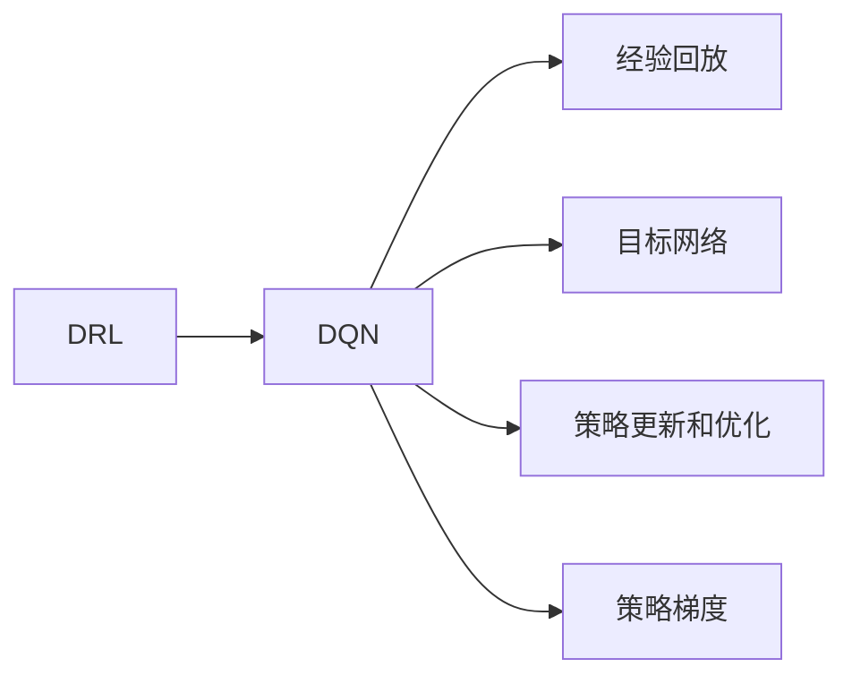
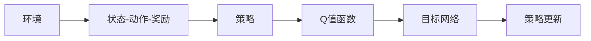
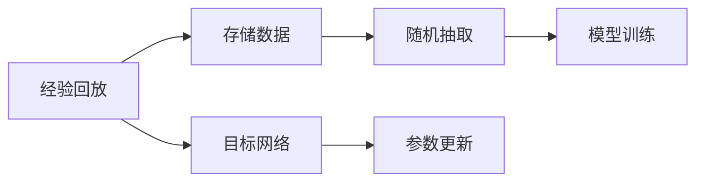
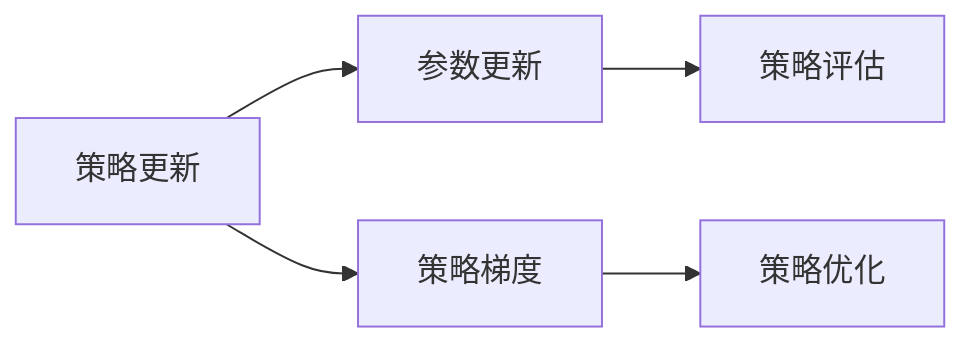
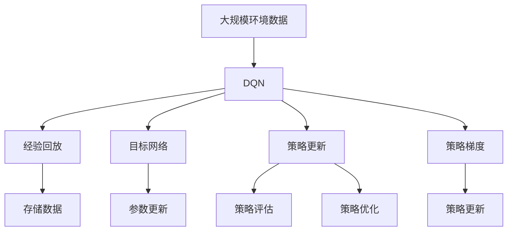

                 

## 1. 背景介绍

### 1.1 问题由来

随着虚拟现实（Virtual Reality, VR）技术的逐渐成熟，其在娱乐、教育、医疗等多个领域的应用得到了广泛关注。VR系统能够为人类提供沉浸式的视觉、听觉和触觉体验，为用户提供身临其境的互动环境。然而，在现实世界中，虚拟环境需要经过复杂的渲染和计算，才能实现流畅的交互。如何在虚拟环境中实现高效、智能的互动，是VR技术面临的一大挑战。

深度强化学习（Deep Reinforcement Learning, DRL），尤其是深度Q网络（Deep Q Network, DQN），为虚拟环境的智能互动提供了新的思路。DQN基于深度神经网络构建的Q值函数，能够自动学习最优的策略，从而在复杂的环境中表现出强大的适应性和学习能力。在虚拟现实系统中，DQN可以通过不断与环境交互，学习到最优的动作策略，提升用户的体验和互动效果。

### 1.2 问题核心关键点

DQN在虚拟现实中的应用，核心在于其能够通过智能决策，实现环境的自适应和智能互动。具体来说，DQN需要在虚拟环境中不断学习，根据当前状态（state），预测下一个状态和奖励（next state and reward），从而最大化长期累积奖励（cumulative reward）。通过学习最优的动作策略，DQN能够自主地与虚拟环境互动，实现更高效的交互和控制。

DQN的核心思想可以总结为以下几点：
1. 利用深度神经网络逼近Q值函数，实现对策略的智能表示和优化。
2. 采用经验回放（Experience Replay）、目标网络（Target Network）等技术，减少过拟合，提高模型的稳定性和泛化能力。
3. 通过策略更新和优化，逐步逼近最优策略，实现智能决策和自适应控制。

### 1.3 问题研究意义

DQN在虚拟现实中的应用，对于提升用户体验、实现智能互动具有重要意义：

1. **高效互动**：DQN能够根据用户行为实时调整策略，实现更智能、更高效的互动体验。
2. **自主探索**：DQN可以在虚拟环境中自主探索，发现最优策略，提升环境的复杂性和丰富度。
3. **个性化定制**：通过DQN的个性化训练，可以实现对不同用户需求的个性化定制，提升系统的适应性和灵活性。
4. **安全保障**：DQN可以通过不断学习，发现潜在的安全漏洞和风险，提高系统的安全性和稳定性。
5. **技术创新**：DQN的应用，为虚拟现实技术的创新提供了新的方向和思路，促进技术的进一步发展。

## 2. 核心概念与联系

### 2.1 核心概念概述

为更好地理解DQN在虚拟现实中的应用，本节将介绍几个密切相关的核心概念：

- 深度强化学习（Deep Reinforcement Learning, DRL）：结合深度学习和强化学习的技术，利用神经网络逼近Q值函数，实现对环境的智能决策和控制。

- 深度Q网络（Deep Q Network, DQN）：基于深度神经网络构建的Q值函数，通过与环境交互，学习最优策略的强化学习算法。

- 经验回放（Experience Replay）：将学习过程中收集到的经验数据（state-action-reward-next state）进行存储，随机抽取数据进行训练，减少过拟合，提高模型的泛化能力。

- 目标网络（Target Network）：为稳定模型训练，引入一个延迟更新的目标网络，使得模型参数更稳定，提升模型的鲁棒性和泛化能力。

- 策略更新和优化：通过策略更新算法（如Q-learning），不断调整模型参数，逼近最优策略，实现智能决策和自适应控制。

- 策略梯度（Policy Gradient）：通过直接优化策略，而不是优化Q值函数，实现策略更新的方法。

这些核心概念之间的逻辑关系可以通过以下Mermaid流程图来展示：



这个流程图展示了大语言模型微调过程中各个核心概念的关系和作用：

1. DRL将深度学习和强化学习的思想结合，通过神经网络逼近Q值函数，实现对环境的智能决策和控制。
2. DQN基于深度神经网络构建Q值函数，通过与环境交互，学习最优策略。
3. 经验回放通过存储经验数据，随机抽取数据进行训练，减少过拟合。
4. 目标网络引入延迟更新的目标网络，提高模型参数的稳定性。
5. 策略更新和优化通过策略更新算法，不断调整模型参数，逼近最优策略。
6. 策略梯度通过直接优化策略，实现策略更新。

这些概念共同构成了DRL和DQN的核心思想和技术框架，使得模型能够通过智能决策和自适应控制，实现对环境的智能互动。

### 2.2 概念间的关系

这些核心概念之间存在着紧密的联系，形成了DRL和DQN的完整生态系统。下面我们通过几个Mermaid流程图来展示这些概念之间的关系。

#### 2.2.1 DRL和DQN的基本流程



这个流程图展示了DRL和DQN的基本流程。首先，环境提供状态-动作-奖励反馈，通过策略指导动作选择，Q值函数进行策略评估和优化，最终引入目标网络，稳定模型训练。

#### 2.2.2 经验回放和目标网络的关系



这个流程图展示了经验回放和目标网络的关系。经验回放通过存储数据，随机抽取数据进行模型训练，减少过拟合。目标网络通过延迟更新，提高模型参数的稳定性。

#### 2.2.3 策略更新和策略梯度的关系



这个流程图展示了策略更新和策略梯度的关系。策略更新通过直接优化策略，实现策略评估和优化。策略梯度通过求解梯度，实现策略更新的高效实现。

### 2.3 核心概念的整体架构

最后，我们用一个综合的流程图来展示这些核心概念在大语言模型微调过程中的整体架构：



这个综合流程图展示了从环境数据输入到策略优化的完整过程。DQN通过经验回放和目标网络，逐步优化Q值函数，通过策略更新和策略梯度，实现智能决策和自适应控制。 通过这些流程图，我们可以更清晰地理解DRL和DQN的工作原理和优化方向。

## 3. 核心算法原理 & 具体操作步骤

### 3.1 算法原理概述

DQN算法基于深度神经网络构建Q值函数，通过与环境交互，学习最优策略。其核心思想可以概括为以下几个步骤：

1. **状态-动作-奖励（State-Action-Reward, SAR）**：将环境状态作为输入，选择动作，获得奖励。
2. **Q值函数逼近**：通过神经网络逼近Q值函数，评估当前状态和动作的价值。
3. **策略更新**：利用策略更新算法（如Q-learning），根据Q值函数的输出，选择最优动作，并更新模型参数。
4. **经验回放**：将学习过程中收集到的经验数据进行存储，随机抽取数据进行训练，减少过拟合。
5. **目标网络**：引入一个延迟更新的目标网络，提高模型参数的稳定性。

DQN的数学模型可以表示为：

$$
Q(s,a) \approx \theta^T f(s,a)
$$

其中 $Q(s,a)$ 为状态-动作对的Q值，$\theta$ 为模型参数，$f(s,a)$ 为神经网络逼近的Q值函数。在训练过程中，DQN通过不断更新模型参数，最小化目标Q值与实际Q值之间的差距，从而逼近最优策略。

### 3.2 算法步骤详解

以下是DQN算法的详细步骤：

**Step 1: 准备环境**
- 创建虚拟环境，定义状态空间、动作空间、奖励函数等参数。
- 设置DQN的超参数，包括网络结构、学习率、折扣因子等。

**Step 2: 初始化模型**
- 初始化深度神经网络模型，将权重随机初始化。
- 创建目标网络，权重初始化与主网络相同。

**Step 3: 环境交互**
- 在虚拟环境中，将当前状态 $s_t$ 输入模型，选择动作 $a_t$。
- 执行动作 $a_t$，获得下一个状态 $s_{t+1}$ 和奖励 $r_t$。
- 存储 $(s_t, a_t, r_t, s_{t+1})$ 到经验回放缓冲区。

**Step 4: 训练模型**
- 从经验回放缓冲区中随机抽取若干个 $(s, a, r, s')$ 样本，输入到模型中进行前向传播。
- 计算Q值函数的输出，与实际Q值进行比较，计算损失函数。
- 反向传播更新模型参数，并更新目标网络权重。

**Step 5: 策略更新**
- 根据Q值函数的输出，选择最优动作 $a_t'$。
- 利用策略更新算法（如Q-learning），计算策略更新的损失函数，更新模型参数。

**Step 6: 参数更新**
- 周期性更新目标网络的权重，使其跟随主网络的更新。
- 根据策略更新的损失函数，计算参数更新的梯度，更新模型参数。

通过上述步骤，DQN能够通过不断与虚拟环境交互，学习到最优策略，实现智能决策和自适应控制。

### 3.3 算法优缺点

DQN算法在虚拟现实中的应用具有以下优点：
1. 高度自适应：DQN能够根据环境状态自动选择最优动作，适应复杂多变的虚拟环境。
2. 高效训练：通过经验回放和目标网络，减少过拟合，提高模型泛化能力。
3. 鲁棒性强：DQN能够通过不断学习，逐步逼近最优策略，具有较强的鲁棒性和泛化能力。
4. 适用于多种任务：DQN可以应用于虚拟现实中的多种任务，如导航、交互、生成等。

然而，DQN算法也存在一些局限性：
1. 模型复杂度高：DQN的深度神经网络模型复杂度高，训练和推理耗时较长。
2. 数据需求量大：DQN需要大量样本数据进行训练，数据不足可能导致模型效果不佳。
3. 模型可解释性不足：DQN作为"黑盒"系统，难以解释其决策过程，缺乏可解释性。

尽管存在这些局限性，但DQN在虚拟现实中的应用依然显示出巨大的潜力，为智能互动提供了新的可能性。

### 3.4 算法应用领域

DQN算法在虚拟现实中的应用，涉及多个领域，主要包括：

1. **虚拟现实游戏**：通过DQN实现游戏中的智能对手，提升游戏体验和互动效果。
2. **虚拟现实导航**：利用DQN在复杂环境中进行路径规划和导航，提高用户的沉浸感和自由度。
3. **虚拟现实交互**：通过DQN实现虚拟人物与用户的智能交互，提高互动效率和自然度。
4. **虚拟现实生成**：利用DQN生成虚拟场景、物体等，丰富虚拟现实内容。
5. **虚拟现实推荐**：通过DQN推荐虚拟现实内容，提升用户满意度。

## 4. 数学模型和公式 & 详细讲解 & 举例说明

### 4.1 数学模型构建

DQN算法的数学模型可以表示为：

$$
Q(s,a) = r + \gamma \max_{a'} Q(s',a')
$$

其中，$Q(s,a)$ 表示在状态 $s$ 下选择动作 $a$ 的Q值，$r$ 为当前奖励，$\gamma$ 为折扣因子，$s'$ 为下一个状态，$a'$ 为下一个动作。

DQN的深度神经网络模型可以表示为：

$$
f(s,a; \theta) = \theta^T g(s,a)
$$

其中，$\theta$ 为模型参数，$g(s,a)$ 为输入 $(s,a)$ 的特征表示。

在训练过程中，DQN的目标是最小化经验回放缓冲区中的样本损失函数：

$$
\mathcal{L} = \frac{1}{N} \sum_{i=1}^N [Q(s_i, a_i) - (r_i + \gamma \max_{a'} Q(s'_i, a'))^2]
$$

其中，$(s_i, a_i, r_i, s'_i)$ 为样本中的状态、动作、奖励和下一个状态，$N$ 为样本数。

### 4.2 公式推导过程

以下我们以二臂赌博机（Two-Armed Bandit）问题为例，推导DQN的数学模型和算法流程。

假设虚拟现实中的任务是一个二臂赌博机，玩家每次可以选择按左臂或右臂，左臂奖励为1元，右臂奖励为2元。玩家的目标是最大化长期累积奖励。

**Step 1: 定义状态和动作**
- 状态 $s$ 表示当前选择的臂，$s=1$ 表示左臂，$s=2$ 表示右臂。
- 动作 $a$ 表示选择左臂或右臂，$a=1$ 表示左臂，$a=2$ 表示右臂。

**Step 2: 定义奖励函数**
- 当选择左臂时，奖励为1元，即 $r=1$。
- 当选择右臂时，奖励为2元，即 $r=2$。

**Step 3: 定义Q值函数**
- 假设使用深度神经网络逼近Q值函数，输入为状态 $s$ 和动作 $a$，输出为Q值 $Q(s,a)$。

**Step 4: 定义经验回放缓冲区**
- 在每次交互后，将 $(s_t, a_t, r_t, s_{t+1})$ 存储到经验回放缓冲区中。

**Step 5: 训练模型**
- 从经验回放缓冲区中随机抽取若干个样本，输入到模型中进行前向传播。
- 计算Q值函数的输出，与实际Q值进行比较，计算损失函数。
- 反向传播更新模型参数，并更新目标网络权重。

**Step 6: 策略更新**
- 根据Q值函数的输出，选择最优动作 $a_t'$。
- 利用策略更新算法（如Q-learning），计算策略更新的损失函数，更新模型参数。

**Step 7: 参数更新**
- 周期性更新目标网络的权重，使其跟随主网络的更新。
- 根据策略更新的损失函数，计算参数更新的梯度，更新模型参数。

通过上述步骤，DQN能够通过不断与虚拟环境交互，学习到最优策略，实现智能决策和自适应控制。

### 4.3 案例分析与讲解

在虚拟现实游戏中，DQN可以用于训练智能对手，提升游戏的交互性和趣味性。以下是一个简单的游戏案例：

假设游戏中有一个迷宫，玩家需要通过控制角色移动，避开障碍，找到终点。玩家每次可以选择向上、向下、向左或向右移动。迷宫中有随机生成的障碍，玩家需要避开这些障碍才能到达终点。

**Step 1: 定义环境**
- 定义状态空间为角色在迷宫中的位置，即 $s=(x, y)$。
- 定义动作空间为向上、向下、向左或向右移动，即 $a=\{up, down, left, right\}$。
- 定义奖励函数，到达终点获得10元奖励，遇到障碍扣1元。

**Step 2: 初始化模型**
- 使用深度神经网络逼近Q值函数，输入为状态 $(x, y)$ 和动作 $a$，输出为Q值 $Q(x, y, a)$。
- 设置模型参数，如学习率 $\eta=0.001$，折扣因子 $\gamma=0.9$。

**Step 3: 环境交互**
- 在每次移动后，获得当前状态和奖励，存储到经验回放缓冲区中。
- 选择下一个动作，并更新状态和奖励。

**Step 4: 训练模型**
- 从经验回放缓冲区中随机抽取若干个样本，输入到模型中进行前向传播。
- 计算Q值函数的输出，与实际Q值进行比较，计算损失函数。
- 反向传播更新模型参数，并更新目标网络权重。

**Step 5: 策略更新**
- 根据Q值函数的输出，选择最优动作 $a_t'$。
- 利用策略更新算法（如Q-learning），计算策略更新的损失函数，更新模型参数。

**Step 6: 参数更新**
- 周期性更新目标网络的权重，使其跟随主网络的更新。
- 根据策略更新的损失函数，计算参数更新的梯度，更新模型参数。

通过DQN的训练，智能对手能够根据玩家的行为和环境状态，选择最优动作，实现智能决策和自适应控制。在训练过程中，DQN能够逐步逼近最优策略，提升游戏的趣味性和挑战性。

## 5. 项目实践：代码实例和详细解释说明

### 5.1 开发环境搭建

在进行DQN实践前，我们需要准备好开发环境。以下是使用Python进行PyTorch开发的环境配置流程：

1. 安装Anaconda：从官网下载并安装Anaconda，用于创建独立的Python环境。

2. 创建并激活虚拟环境：
```bash
conda create -n pytorch-env python=3.8 
conda activate pytorch-env
```

3. 安装PyTorch：根据CUDA版本，从官网获取对应的安装命令。例如：
```bash
conda install pytorch torchvision torchaudio cudatoolkit=11.1 -c pytorch -c conda-forge
```

4. 安装TensorBoard：
```bash
pip install tensorboard
```

5. 安装PyTorch相关库：
```bash
pip install torch torchvision torchaudio
```

完成上述步骤后，即可在`pytorch-env`环境中开始DQN实践。

### 5.2 源代码详细实现

以下是一个使用PyTorch实现DQN的代码示例：

```python
import torch
import torch.nn as nn
import torch.optim as optim
import torch.nn.functional as F
import gym
import numpy as np
import random

class DQN(nn.Module):
    def __init__(self, state_dim, action_dim):
        super(DQN, self).__init__()
        self.fc1 = nn.Linear(state_dim, 64)
        self.fc2 = nn.Linear(64, 64)
        self.fc3 = nn.Linear(64, action_dim)

    def forward(self, x):
        x = F.relu(self.fc1(x))
        x = F.relu(self.fc2(x))
        x = self.fc3(x)
        return x

class ReplayMemory:
    def __init__(self, capacity):
        self.capacity = capacity
        self.memory = []
        self.pos = 0

    def push(self, state, action, reward, next_state, done):
        if len(self.memory) < self.capacity:
            self.memory.append((state, action, reward, next_state, done))
        else:
            self.memory[self.pos] = (state, action, reward, next_state, done)
            self.pos = (self.pos + 1) % self.capacity

    def sample(self, batch_size):
        return random.sample(self.memory, batch_size)

def choose_action(state, model, epsilon):
    if random.uniform(0, 1) < epsilon:
        return random.choice(np.arange(model.action_dim))
    else:
        state = torch.tensor(state).float().unsqueeze(0)
        Q_values = model(state)
        return Q_values.argmax().item()

def update_target_network(model, target_model, tau):
    for param, target_param in zip(model.parameters(), target_model.parameters()):
        target_param.data.copy_(tau * param.data + (1 - tau) * target_param.data)

def train(model, target_model, replay_memory, optimizer, device, epsilon, epsilon_min, epsilon_decay):
    for i_episode in range(num_episodes):
        state = env.reset()
        state = torch.tensor(state).float().unsqueeze(0).to(device)
        done = False
        time_step = 0
        while not done:
            action = choose_action(state, model, epsilon)
            next_state, reward, done, _ = env.step(action.item())
            next_state = torch.tensor(next_state).float().unsqueeze(0).to(device)
            replay_memory.push(state, action, reward, next_state, done)
            if len(replay_memory) > batch_size:
                batch = replay_memory.sample(batch_size)
                state_batch = torch.tensor(np.vstack([data[0] for data in batch])).float().to(device)
                action_batch = torch.tensor(np.vstack([data[1] for data in batch])).long().to(device)
                reward_batch = torch.tensor(np.vstack([data[2] for data in batch])).float().to(device)
                next_state_batch = torch.tensor(np.vstack([data[3] for data in batch])).float().to(device)
                done_batch = torch.tensor(np.vstack([data[4] for data in batch])).float().to(device)
                Q_values = model(state_batch)
                Q_values = Q_values.gather(1, action_batch)
                target_Q_values = target_model(next_state_batch)
                target_Q_values = target_Q_values.gather(1, action_batch)
                loss = F.mse_loss(Q_values, target_Q_values * (reward_batch + gamma * target_Q_values.max(1)[0] * (1 - done_batch)))
                optimizer.zero_grad()
                loss.backward()
                optimizer.step()
            state = next_state
            time_step += 1
        epsilon = max(epsilon_min, epsilon * epsilon_decay)
        update_target_network(model, target_model, tau)

# 设置超参数
num_episodes = 1000
batch_size = 32
gamma = 0.9
tau = 0.001
epsilon = 1.0
epsilon_min = 0.01
epsilon_decay = 0.995
learning_rate = 0.01
device = torch.device('cuda' if torch.cuda.is_available() else 'cpu')

# 创建虚拟环境
env = gym.make('CartPole-v1')

# 初始化模型和目标网络
model = DQN(env.observation_space.shape[0], env.action_space.n)
target_model = DQN(env.observation_space.shape[0], env.action_space.n)
model.to(device)
target_model.to(device)

# 初始化经验回放缓冲区和优化器
replay_memory = ReplayMemory(10000)
optimizer = optim.Adam(model.parameters(), lr=learning_rate)

# 训练模型
for i_episode in range(num_episodes):
    state = env.reset()
    state = torch.tensor(state).float().unsqueeze(0).to(device)
    done = False
    time_step = 0
    while not done:
        action = choose_action(state, model, epsilon)
        next_state, reward, done, _ = env.step(action.item())
        next_state = torch.tensor(next_state).float().unsqueeze(0).to(device)
        replay_memory.push(state, action, reward, next_state, done)
        if len(replay_memory) > batch_size:
            batch = replay_memory.sample(batch_size)
            state_batch = torch.tensor(np.vstack([data[0] for data in batch])).float().to(device)
            action_batch = torch.tensor(np.vstack([data[1] for data in batch])).long().to(device)
            reward_batch = torch.tensor(np.vstack([data[2] for data in batch])).float().to(device)
            next_state_batch = torch.tensor(np.vstack([data[3] for data in batch])).float().to(device)
            done_batch = torch.tensor(np.vstack([data[4] for data in batch])).float().to(device)
            Q_values = model(state_batch)
            Q_values = Q_values.gather(1, action_batch)
            target_Q_values = target_model(next_state_batch)
            target_Q_values = target_Q_values.gather(1, action_batch)
            loss = F.mse_loss(Q_values, target_Q_values * (reward_batch + gamma * target_Q_values.max(1)[0] * (1 - done_batch)))
            optimizer.zero_grad()
            loss.backward()
            optimizer.step()
        state = next_state
        time_step += 1
    epsilon = max(epsilon_min, epsilon * epsilon_decay)
    update_target_network(model, target_model, tau)

# 测试模型
state = env.reset()
state = torch.tensor(state).float().unsqueeze(0).to(device)
done = False
time_step = 0
while not done:
    action = choose_action(state, model, 0)
    next_state, reward, done, _ = env.step(action.item())
    next_state = torch.tensor(next_state).float().unsqueeze(0).to(device)
    state = next_state
    time_step += 1
print('测试完成

