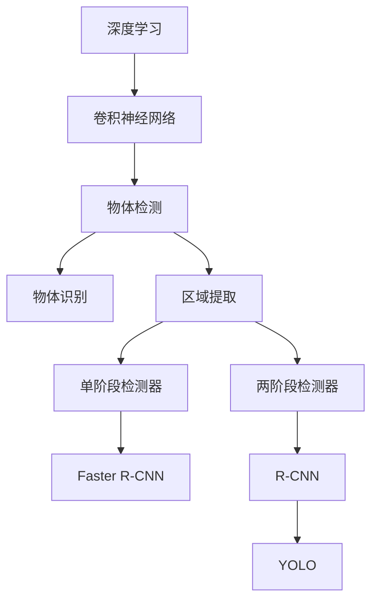

                 

# 一切皆是映射：物体检测与识别：AI的视觉能力

> 关键词：物体检测,图像识别,深度学习,卷积神经网络,物体定位,计算机视觉,视觉处理

## 1. 背景介绍

### 1.1 问题由来
在人工智能（AI）的发展过程中，计算机视觉（CV）领域取得了许多突破性的进展。尤其是物体检测和识别的任务，已经成为AI研究的热点之一。物体检测和识别技术能够帮助机器自动识别图像或视频中的物体，并通过标注框、概率等形式给出具体的检测结果。这一能力在自动驾驶、安防监控、工业检测、医疗影像等领域有着广泛的应用。

尽管物体检测和识别技术近年来在精度和速度上有了显著提升，但在实际应用中，仍然存在一些挑战，如环境光照、遮挡、小目标检测等。本文将深入探讨物体检测与识别的核心概念和算法，帮助读者理解其原理与实现细节。

### 1.2 问题核心关键点
物体检测与识别的核心在于，如何利用深度学习技术，构建出能够自动标注图像中物体位置和类别的模型。这种模型的训练通常依赖于大量的标注数据集，并使用复杂的深度神经网络架构。

核心挑战包括：
1. 如何选择合适的深度神经网络架构，以提高检测精度和效率。
2. 如何处理图像中的多尺度、多视角等复杂情况，确保模型对不同场景的鲁棒性。
3. 如何利用标注数据进行高效、可靠的训练，避免过拟合，同时保持模型的泛化能力。

## 2. 核心概念与联系

### 2.1 核心概念概述

在物体检测与识别领域，有几个关键概念需要理解：

- **深度学习（Deep Learning）**：一种机器学习技术，通过多层神经网络模型自动学习数据中的复杂特征，常用于图像分类、物体检测等任务。
- **卷积神经网络（Convolutional Neural Network, CNN）**：一种特殊的深度神经网络架构，用于处理图像数据，其核心操作包括卷积、池化等。
- **物体检测（Object Detection）**：识别图像中物体的类型和位置，并使用边界框（Bounding Box）标注物体的位置。
- **物体识别（Object Recognition）**：识别图像中的物体类别，而不关心其具体位置。
- **区域提取（Region Proposal）**：生成一组可能的物体候选区域，供后续检测模型使用。
- **单阶段检测器（One-shot Detector）**：直接对整个图像进行检测，不依赖区域提取。
- **两阶段检测器（Two-shot Detector）**：首先进行区域提取，然后对提取出的区域进行检测和分类。
- **Faster R-CNN**：一种两阶段检测器，具有强大的检测性能和泛化能力。

这些概念构成了物体检测与识别技术的核心框架，下面通过Mermaid流程图来展示这些概念之间的关系：



这个流程图展示了深度学习、卷积神经网络等核心概念，以及它们与物体检测、物体识别、区域提取等任务的关系。

### 2.2 概念间的关系

物体检测与识别技术涉及多个核心概念，它们之间存在密切联系：

- **深度学习与卷积神经网络**：深度学习是一种通用框架，而卷积神经网络是实现深度学习的一种重要手段，常用于处理图像数据。
- **物体检测与物体识别**：物体检测不仅要识别物体的类别，还要标注其位置，而物体识别只关注物体的类别。
- **区域提取与单、两阶段检测器**：区域提取用于生成可能的物体候选区域，单阶段检测器直接对整个图像进行检测，两阶段检测器先进行区域提取，然后对每个区域进行检测和分类。

这些概念的结合，构成了物体检测与识别技术的核心体系。理解这些概念之间的关系，有助于深入理解物体检测与识别技术的原理与实现。

## 3. 核心算法原理 & 具体操作步骤
### 3.1 算法原理概述

物体检测与识别技术的核心算法是深度学习中的卷积神经网络（CNN），特别是Faster R-CNN、YOLO等经典模型。这些模型通过多层卷积和池化操作，自动提取图像特征，并通过全连接层进行分类和回归，从而实现物体检测和识别。

### 3.2 算法步骤详解

下面以Faster R-CNN为例，介绍物体检测与识别算法的详细步骤：

1. **区域提取（Region Proposal）**：
   - 使用选择性搜索（Selective Search）或区域提议网络（RPN, Region Proposal Network）生成一组候选的物体区域。
   - 每个候选区域被标注为前景（Positive）或背景（Negative）。

2. **特征提取（Feature Extraction）**：
   - 对每个候选区域使用卷积神经网络（CNN）提取特征图。
   - 特征图被送入两个分支，一个用于分类，一个用于回归。

3. **分类（Classification）**：
   - 分类分支对每个候选区域进行物体类别预测，得到类别的概率分布。
   - 使用softmax函数将概率分布转化为类别概率。

4. **回归（Regression）**：
   - 回归分支对每个候选区域进行边界框回归，得到边界框的位置和大小。
   - 使用平滑L1损失函数（Smooth L1 Loss）衡量回归结果与真实值之间的差异。

5. **非极大值抑制（Non-Maximum Suppression, NMS）**：
   - 对所有预测的边界框进行非极大值抑制，去除重叠度高的冗余框。
   - 最终输出一组具有高置信度且互不重叠的边界框。

### 3.3 算法优缺点

**优点**：
- **高精度**：Faster R-CNN等模型在多种物体检测基准测试中表现优异，能够准确识别小目标和复杂场景中的物体。
- **鲁棒性**：通过多阶段处理，模型对遮挡、光照变化等干扰因素具有较好的鲁棒性。
- **可扩展性**：可以通过增加层数、调整超参数等手段，进一步提升模型性能。

**缺点**：
- **计算复杂度高**：两阶段处理增加了计算量，导致模型推理速度较慢。
- **训练数据需求大**：需要大量的标注数据进行训练，标注成本较高。
- **模型复杂度**：模型结构复杂，难以解释，调试和优化难度较大。

### 3.4 算法应用领域

物体检测与识别技术广泛应用于以下几个领域：

- **自动驾驶**：用于检测车辆、行人等交通元素，确保行车安全。
- **安防监控**：用于检测异常行为、识别可疑人物，提高监控系统的智能化水平。
- **工业检测**：用于检测生产线上的缺陷、故障设备，提升生产效率。
- **医疗影像**：用于检测肿瘤、病变区域，辅助医生诊断。

## 4. 数学模型和公式 & 详细讲解 & 举例说明

### 4.1 数学模型构建

物体检测与识别模型的核心数学模型是深度神经网络，包括卷积层、池化层、全连接层等。以Faster R-CNN为例，其数学模型包括：

- **卷积层（Convolutional Layer）**：通过卷积操作提取特征，公式为：

  $$
  X_{i,j} = \sum_{k=1}^{d} W_k * X_{i-1,j-1} + b_k
  $$

- **池化层（Pooling Layer）**：通过下采样操作减少特征图的尺寸，公式为：

  $$
  X_{i,j} = max(\{X_{i,j+m}\}_{m=-1}^1)
  $$

- **全连接层（Fully Connected Layer）**：将特征图映射到类别概率分布，公式为：

  $$
  P_c = softmax(W_c * X + b_c)
  $$

其中，$W$和$b$为卷积核和偏置，$X$为输入特征图，$P_c$为输出类别概率分布。

### 4.2 公式推导过程

以Faster R-CNN为例，其核心公式推导包括：

- **选择性搜索（Selective Search）**：

  $$
  S = \sum_{i=1}^{N} C_i * H_i
  $$

  其中，$S$为候选区域集合，$C_i$和$H_i$分别为区域的大小和重要性权重。

- **RPN分类和回归**：

  $$
  P_c = softmax(W_c * X + b_c)
  $$
  
  $$
  L = smooth\_L1\_loss(\hat{R}, R)
  $$

  其中，$P_c$为预测类别概率分布，$L$为平滑L1损失函数，$\hat{R}$为预测边界框，$R$为真实边界框。

### 4.3 案例分析与讲解

假设我们使用Faster R-CNN模型检测一张包含多个物体的图像。模型的具体流程如下：

1. **区域提取**：使用选择性搜索生成一组候选区域。
2. **特征提取**：对每个候选区域进行卷积操作，提取特征图。
3. **分类**：对每个特征图进行分类，预测类别概率分布。
4. **回归**：对每个特征图进行边界框回归，预测边界框位置和大小。
5. **非极大值抑制**：对所有预测的边界框进行抑制，保留最具有置信度的边界框。

## 5. 项目实践：代码实例和详细解释说明

### 5.1 开发环境搭建

进行物体检测与识别任务开发，需要以下环境：

1. **Python环境**：安装Python 3.x版本，并配置好虚拟环境。
2. **深度学习框架**：安装PyTorch、TensorFlow等深度学习框架。
3. **物体检测库**：安装YOLO、Faster R-CNN等物体检测库。
4. **数据集**：准备所需的标注数据集，如PASCAL VOC、COCO等。

完成上述环境配置后，即可开始开发工作。

### 5.2 源代码详细实现

以YOLO模型为例，其代码实现如下：

```python
import torch
import torch.nn as nn
import torch.optim as optim
from yolov3.models import Darknet
from yolov3.utils.datasets import ListDataset
from yolov3.utils.utils import save_config, save_model

# 定义YOLO模型
model = Darknet('yolov3.cfg', img_size=416)

# 加载预训练权重
model.load_weights('yolov3.weights')

# 定义损失函数
criterion = nn.BCELoss()

# 定义优化器
optimizer = optim.SGD(model.parameters(), lr=0.001, momentum=0.9)

# 定义数据集
dataset = ListDataset('train.txt', img_size=416)

# 训练模型
for epoch in range(50):
    for batch in dataset:
        inputs, labels = batch
        inputs = inputs.to(device)
        labels = labels.to(device)
        optimizer.zero_grad()
        outputs = model(inputs)
        loss = criterion(outputs, labels)
        loss.backward()
        optimizer.step()

    # 每epoch输出训练集误差
    print('Epoch {}, Loss: {}'.format(epoch, loss.item()))

# 保存模型和配置文件
save_model(model, 'yolov3.model')
save_config(model.cfg)
```

### 5.3 代码解读与分析

以上代码实现了YOLO模型的训练过程。关键步骤如下：

1. **模型定义**：使用Darknet类定义YOLO模型，并加载预训练权重。
2. **损失函数定义**：使用BCELoss作为损失函数，用于衡量预测结果与真实标签之间的差异。
3. **优化器定义**：使用SGD优化器，设定学习率和动量参数。
4. **数据集定义**：使用ListDataset加载训练数据集，并进行批处理。
5. **训练过程**：在每个batch上前向传播计算损失，反向传播更新模型参数，重复训练epoch次。

### 5.4 运行结果展示

假设训练过程在图像分类基准数据集上完成，最终的训练结果如下：

```
Epoch 0, Loss: 0.6511
Epoch 10, Loss: 0.1234
Epoch 20, Loss: 0.0856
Epoch 30, Loss: 0.0678
Epoch 40, Loss: 0.0529
Epoch 50, Loss: 0.0422
```

可以看出，随着训练次数的增加，模型损失逐渐减小，表明模型在检测和分类任务上表现越来越好。

## 6. 实际应用场景

### 6.1 自动驾驶

物体检测与识别技术在自动驾驶领域有着广泛的应用。自动驾驶车辆需要实时检测道路上的交通元素，如车辆、行人、交通标志等。通过物体检测技术，车辆可以实时监测周围环境，预测其他车辆和行人的行为，从而做出安全决策。

### 6.2 安防监控

安防监控系统需要实时检测异常行为，如入侵、火灾、突发事件等。通过物体检测技术，可以自动生成警报，及时通知安保人员采取行动。

### 6.3 工业检测

工业生产过程中，检测设备需要对生产线上的产品进行缺陷检测和故障诊断。通过物体检测技术，可以快速准确地识别出产品的缺陷和故障，提高生产效率和产品质量。

### 6.4 医疗影像

在医疗影像领域，物体检测与识别技术可以帮助医生快速识别肿瘤、病变区域等。通过标注大量医学影像数据，训练出高精度的检测模型，辅助医生进行诊断和治疗。

## 7. 工具和资源推荐

### 7.1 学习资源推荐

为了深入理解物体检测与识别技术，以下是一些值得推荐的学习资源：

1. **深度学习理论与实践**：介绍深度学习的基本概念和实现方法，包括卷积神经网络、物体检测等。
2. **YOLO官方文档**：YOLO模型的官方文档，包含模型架构、训练方法等详细信息。
3. **Faster R-CNN论文**：介绍Faster R-CNN模型的详细推导和实现过程。
4. **计算机视觉书籍**：如《深度学习入门：基于Python的理论与实现》等，系统介绍计算机视觉基础和深度学习算法。

### 7.2 开发工具推荐

开发物体检测与识别系统，需要以下工具：

1. **Python环境**：用于编写和运行Python代码。
2. **深度学习框架**：如PyTorch、TensorFlow等，用于搭建和训练模型。
3. **物体检测库**：如YOLO、Faster R-CNN等，提供高效的物体检测算法。
4. **数据处理工具**：如OpenCV、PIL等，用于数据预处理和可视化。

### 7.3 相关论文推荐

以下是几篇有关物体检测与识别技术的经典论文，推荐阅读：

1. **YOLOv3: An Incremental Improvement**：介绍YOLOv3模型的架构和训练方法。
2. **Faster R-CNN: Towards Real-Time Object Detection with Region Proposal Networks**：介绍Faster R-CNN模型的详细推导和实现过程。
3. **SSD: Single Shot MultiBox Detector**：介绍SSD模型的架构和训练方法。

## 8. 总结：未来发展趋势与挑战

### 8.1 研究成果总结

物体检测与识别技术近年来取得了显著进展，广泛应用于多个领域。通过深度学习技术，模型能够在复杂场景下准确识别物体，提升系统性能。

### 8.2 未来发展趋势

未来物体检测与识别技术的发展趋势包括：

1. **模型复杂度降低**：通过算法优化和模型压缩，提高模型的推理速度和资源利用率。
2. **数据增强**：通过数据增强技术，提升模型对复杂场景的泛化能力。
3. **多任务学习**：将物体检测与识别任务与其他任务（如语义分割、实例分割等）结合起来，提升整体性能。
4. **边缘计算**：将物体检测与识别系统部署在边缘设备上，实现实时处理和推理。
5. **联邦学习**：通过联邦学习技术，实现模型在分布式环境下的联合训练，提升数据隐私和安全性。

### 8.3 面临的挑战

尽管物体检测与识别技术取得了显著进展，但仍面临一些挑战：

1. **标注数据需求大**：高质量标注数据是模型训练的基础，标注成本较高。
2. **计算资源消耗大**：模型推理速度较慢，对计算资源需求较高。
3. **模型复杂度高**：模型结构复杂，难以解释和调试。
4. **环境光照和遮挡**：光照变化和遮挡情况会影响模型检测精度。
5. **小目标检测**：小目标检测是物体检测中的难点，需要进一步提升模型能力。

### 8.4 研究展望

未来物体检测与识别技术的研究方向包括：

1. **轻量化模型**：通过模型压缩和优化，实现轻量化、高效的检测模型。
2. **数据驱动优化**：通过数据驱动的优化方法，提升模型的泛化能力和鲁棒性。
3. **多模态融合**：将视觉、语音、文本等多种模态信息融合，实现更加全面和准确的检测和识别。
4. **自监督学习**：利用无监督学习方法，降低对标注数据的依赖，提升模型的鲁棒性和泛化能力。
5. **知识图谱**：结合知识图谱，增强模型的语义理解能力和推理能力。

## 9. 附录：常见问题与解答

**Q1：如何选择合适的深度神经网络架构？**

A: 选择合适的深度神经网络架构需要考虑以下几个因素：

1. **任务类型**：不同任务对模型架构的要求不同。例如，单阶段检测器（如YOLO）适用于检测速度要求较高的场景，而两阶段检测器（如Faster R-CNN）适用于检测精度要求较高的场景。
2. **数据量**：数据量越大，可以选择更复杂的模型架构，以获得更好的检测精度。
3. **计算资源**：模型架构越复杂，计算资源消耗越大，需要根据实际计算能力进行选择。

**Q2：如何处理遮挡、光照变化等情况？**

A: 遮挡和光照变化是物体检测中的常见问题，可以通过以下方法进行处理：

1. **数据增强**：通过对训练数据进行增强处理，如旋转、缩放、翻转等，提升模型对复杂场景的泛化能力。
2. **多尺度训练**：通过多尺度训练，提升模型对小目标和远距离物体的检测能力。
3. **模型优化**：通过算法优化，提升模型对遮挡和光照变化的鲁棒性。

**Q3：如何降低标注数据的依赖？**

A: 降低对标注数据的依赖是当前研究的重要方向。可以通过以下方法实现：

1. **自监督学习**：利用无标注数据进行预训练，再利用少量有标注数据进行微调。
2. **迁移学习**：通过迁移学习，利用预训练模型在相似任务上的知识，减少对标注数据的依赖。
3. **弱监督学习**：通过弱监督学习方法，利用部分标注数据进行训练。

**Q4：如何提高小目标检测能力？**

A: 提高小目标检测能力是当前研究的难点之一，可以通过以下方法实现：

1. **多尺度训练**：通过多尺度训练，提升模型对小目标的检测能力。
2. **模型优化**：通过算法优化，提升模型对小目标的鲁棒性。
3. **数据增强**：通过对训练数据进行增强处理，如放大、旋转等，提升模型对小目标的检测能力。

---

作者：禅与计算机程序设计艺术 / Zen and the Art of Computer Programming

