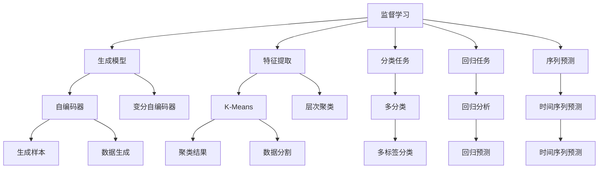
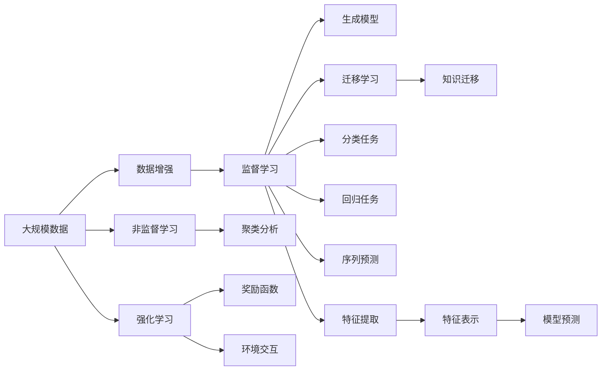

                 

# 一切皆是映射：监督学习和非监督学习的区别与联系

> 关键词：监督学习, 非监督学习, 泛化能力, 生成模型, 特征提取, 聚类分析, 数据增强, 强化学习, 迁移学习

## 1. 背景介绍

### 1.1 问题由来
在人工智能的海洋中，有两种核心的学习方法：监督学习和非监督学习。这两种方法构成了现代机器学习的基础，也是深度学习技术的基石。本文将深入探讨这两种学习方法的原理、特点和应用场景，并对比它们的异同点，为读者提供一个全面的理解。

### 1.2 问题核心关键点
监督学习与非监督学习是机器学习中两种最基本的学习方法。监督学习需要大量带标签的训练数据，通过学习输入和输出之间的映射关系进行预测。而非监督学习则不需要标签数据，通过对数据的特征和结构进行分析，发现数据的内在规律。

二者的核心区别在于是否利用有标签的数据进行训练。监督学习通常用于分类、回归等有明确输出结果的任务；而非监督学习则用于聚类分析、降维等无明确输出结果的任务。尽管如此，二者的联系也非常紧密，它们都可以通过数据增强、迁移学习等手段相互转化和补充。

### 1.3 问题研究意义
掌握监督学习和非监督学习的原理和特点，对于理解深度学习技术的应用和局限，具有重要的指导意义。它们在各种实际场景中的应用，也为我们提供了很多可借鉴的成功经验和教训。通过对比这两种学习方法，我们可以更好地把握机器学习的本质，进而探索更多前沿领域的应用潜力。

## 2. 核心概念与联系

### 2.1 核心概念概述

为了更好地理解监督学习和非监督学习的区别与联系，本节将介绍几个关键的概念：

- **监督学习(Supervised Learning)**：在带有标签的训练数据集上进行学习，通过寻找输入和输出之间的映射关系进行预测。常见的监督学习方法包括回归、分类、序列预测等。

- **非监督学习(Unsupervised Learning)**：在没有标签的训练数据集上进行学习，通过发现数据的潜在结构、特征或模式进行分析。常见的非监督学习方法包括聚类、降维、异常检测等。

- **泛化能力(Generalization)**：模型在新数据上的表现能力。监督学习通过大量有标签数据进行训练，可以更好地泛化到未见过的数据；而非监督学习由于缺乏标签，泛化能力相对较弱，需要通过数据增强等手段提高。

- **生成模型(Generative Models)**：学习数据的概率分布，通过生成新的样本进行预测和推理。常见的生成模型包括自编码器、变分自编码器等。

- **特征提取(Feature Extraction)**：从原始数据中提取出有用的特征，用于后续的分类、聚类等任务。监督学习中的特征提取通常通过有监督的学习过程完成；而非监督学习则需要通过无监督的学习手段。

- **聚类分析(Clustering Analysis)**：将数据分成若干个自然类别的过程。常见的聚类算法包括K-Means、层次聚类等。

- **数据增强(Data Augmentation)**：通过对训练数据进行变换、扩充，提高模型的泛化能力。数据增强通常用于提高监督学习模型的泛化能力。

- **强化学习(Reinforcement Learning)**：通过与环境交互，学习如何最大化奖励函数。强化学习是监督学习与非监督学习的混合应用，具有自监督学习的特点。

- **迁移学习(Transfer Learning)**：在源任务上学习知识，然后迁移到目标任务上进行学习。监督学习和非监督学习都可以用于迁移学习。

这些核心概念之间存在着紧密的联系，形成了机器学习的完整生态系统。通过理解这些概念，我们可以更好地把握监督学习和非监督学习的内在关系，为后续深入讨论打下基础。

### 2.2 概念间的关系

这些核心概念之间的关系可以通过以下Mermaid流程图来展示：



这个流程图展示了大规模机器学习方法的总体结构：

1. 监督学习中的生成模型和特征提取，用于解决分类、回归等任务。
2. 非监督学习中的聚类分析，用于发现数据的内在结构。
3. 监督学习与非监督学习都可以用于迁移学习，实现知识迁移。
4. 强化学习通过与环境交互进行学习，介于监督学习和非监督学习之间。
5. 数据增强和非监督学习都可以提高监督学习模型的泛化能力。

通过这个流程图，我们可以更清晰地理解监督学习和非监督学习之间的关系和作用。

### 2.3 核心概念的整体架构

最后，我们用一个综合的流程图来展示这些核心概念在大规模机器学习中的整体架构：



这个综合流程图展示了从数据到模型预测的全流程。监督学习通过对数据增强和特征提取，利用生成模型和分类器进行任务预测；非监督学习通过聚类分析发现数据的内在结构；强化学习通过与环境交互进行学习；迁移学习将知识从源任务迁移到目标任务。

这些核心概念共同构成了大规模机器学习技术的核心框架，使得机器学习能够广泛应用到各种实际场景中。通过理解这些概念，我们可以更好地把握机器学习的本质和应用范围。

## 3. 核心算法原理 & 具体操作步骤
### 3.1 算法原理概述

监督学习与非监督学习的核心算法原理，本质上都围绕着数据映射和特征表示展开。监督学习的目标是学习输入和输出之间的映射关系，即通过有标签的数据，找出一种能够准确预测输出的函数；而非监督学习的目标则是学习数据的潜在结构或分布，即发现数据中的内在规律或模式。

形式化地，假设监督学习的训练集为 $D=\{(x_i,y_i)\}_{i=1}^N$，其中 $x_i \in \mathcal{X}, y_i \in \mathcal{Y}$，$\mathcal{X}$ 和 $\mathcal{Y}$ 分别为输入空间和输出空间。监督学习的目标是找到一个映射函数 $f$，使得 $f(x_i) \approx y_i$。常见的监督学习方法包括决策树、支持向量机、神经网络等。

而非监督学习的训练集为 $D=\{x_i\}_{i=1}^N$，其中 $x_i \in \mathcal{X}$，$\mathcal{X}$ 为输入空间。非监督学习的目标是找到一个函数 $g$，使得 $g(x_i)$ 能够反映 $x_i$ 的内在结构或分布。常见的非监督学习方法包括K-Means、主成分分析(PCA)、自编码器等。

### 3.2 算法步骤详解

#### 3.2.1 监督学习算法步骤

监督学习的算法步骤包括以下几个关键环节：

1. **数据预处理**：对原始数据进行清洗、归一化、标准化等处理，确保数据质量。

2. **特征提取**：从原始数据中提取出有用的特征，用于后续的分类、回归等任务。

3. **模型选择与训练**：根据任务类型选择合适的监督学习模型，并在训练集上使用梯度下降等优化算法进行训练。

4. **模型评估与调优**：在验证集上评估模型性能，根据评估结果调整模型参数和结构，优化模型性能。

5. **模型部署与应用**：将训练好的模型部署到实际应用中，进行推理和预测。

#### 3.2.2 非监督学习算法步骤

非监督学习的算法步骤包括以下几个关键环节：

1. **数据预处理**：对原始数据进行清洗、归一化、标准化等处理，确保数据质量。

2. **特征提取**：从原始数据中提取出有用的特征，用于后续的聚类、降维等任务。

3. **模型选择与训练**：根据任务类型选择合适的非监督学习模型，并在训练集上使用梯度下降等优化算法进行训练。

4. **模型评估与调优**：在训练集上评估模型性能，根据评估结果调整模型参数和结构，优化模型性能。

5. **模型部署与应用**：将训练好的模型部署到实际应用中，进行推理和预测。

### 3.3 算法优缺点

监督学习的优点包括：

1. **结果可解释**：有标签的数据可以提供明确的反馈，使得模型的预测结果具有可解释性。

2. **泛化能力强**：通过大量有标签的数据进行训练，可以更好地泛化到未见过的数据。

3. **精度高**：监督学习可以训练出精度较高的模型，适用于对精度要求较高的任务。

监督学习的缺点包括：

1. **数据依赖性强**：需要大量带标签的数据进行训练，获取标签数据的成本较高。

2. **数据分布假设**：假设标签数据的分布与测试数据的分布相同，可能存在数据偏差。

3. **过拟合风险**：在训练集上过拟合，可能会影响模型在新数据上的泛化能力。

非监督学习的优点包括：

1. **无需标签**：不需要带标签的数据，可以获取大量的无标签数据。

2. **数据分布广泛**：不需要假设数据的分布，可以处理各种数据类型和结构。

3. **发现潜在模式**：可以发现数据的内在规律和模式，提供对数据的深层次理解。

非监督学习的缺点包括：

1. **结果难以解释**：没有明确的输出结果，难以解释模型的预测过程。

2. **泛化能力弱**：由于缺乏标签数据，泛化能力相对较弱。

3. **精度不确定**：模型的精度难以保证，需要对模型进行充分的评估和调优。

### 3.4 算法应用领域

监督学习和非监督学习在各种实际应用中都有广泛的应用，以下是它们的一些典型应用场景：

#### 3.4.1 监督学习应用领域

1. **图像分类**：利用监督学习算法对图像进行分类，如图像识别、物体检测等。

2. **语音识别**：利用监督学习算法对语音进行识别，如语音转文本、语音情感分析等。

3. **自然语言处理(NLP)**：利用监督学习算法对文本进行分类、序列预测等，如情感分析、机器翻译等。

4. **推荐系统**：利用监督学习算法对用户行为进行分类，推荐符合用户兴趣的商品或服务。

5. **金融风控**：利用监督学习算法对金融数据进行分类，预测信用风险、欺诈行为等。

#### 3.4.2 非监督学习应用领域

1. **聚类分析**：利用非监督学习算法对用户进行聚类，如用户分群、客户细分等。

2. **降维处理**：利用非监督学习算法对高维数据进行降维，提高数据分析效率。

3. **异常检测**：利用非监督学习算法对数据进行异常检测，发现数据中的异常点。

4. **数据清洗**：利用非监督学习算法对数据进行清洗，去除噪声和异常值。

5. **特征选择**：利用非监督学习算法对数据进行特征选择，提高模型的泛化能力。

这些应用场景展示了监督学习和非监督学习在实际中的应用价值和潜力。通过对比它们的优缺点和应用领域，我们可以更好地把握它们的特点和适用范围。

## 4. 数学模型和公式 & 详细讲解 & 举例说明

### 4.1 数学模型构建

假设我们有一个监督学习任务，训练集为 $D=\{(x_i,y_i)\}_{i=1}^N$，其中 $x_i \in \mathcal{X}, y_i \in \mathcal{Y}$，$\mathcal{X}$ 和 $\mathcal{Y}$ 分别为输入空间和输出空间。我们的目标是在输入空间 $\mathcal{X}$ 和输出空间 $\mathcal{Y}$ 之间建立一个映射函数 $f$，使得 $f(x_i) \approx y_i$。

常见的监督学习模型包括线性回归、逻辑回归、决策树、支持向量机、神经网络等。这里以线性回归模型为例，介绍其数学模型构建过程。

假设线性回归模型为 $f(x_i)=\theta^Tx_i$，其中 $\theta \in \mathbb{R}^d$ 为模型参数。我们的目标是找到一个 $\theta$，使得 $f(x_i)$ 最小化均方误差损失函数：

$$
\mathcal{L}(\theta) = \frac{1}{2N}\sum_{i=1}^N (y_i - f(x_i))^2
$$

形式化地，我们的目标是最小化以下优化问题：

$$
\min_{\theta} \mathcal{L}(\theta)
$$

### 4.2 公式推导过程

以下我们推导线性回归模型的梯度下降优化算法。

对于线性回归模型 $f(x_i)=\theta^Tx_i$，均方误差损失函数的梯度为：

$$
\frac{\partial \mathcal{L}(\theta)}{\partial \theta} = \frac{1}{N}\sum_{i=1}^N (y_i - f(x_i))x_i
$$

利用梯度下降算法，更新模型参数 $\theta$ 的公式为：

$$
\theta \leftarrow \theta - \eta \frac{\partial \mathcal{L}(\theta)}{\partial \theta}
$$

其中 $\eta$ 为学习率，控制每次参数更新的步长。

### 4.3 案例分析与讲解

以线性回归模型为例，考虑一个简单的房价预测问题。假设我们有一个房屋销售记录的数据集，包括房屋面积 $x_1$、房屋年龄 $x_2$ 和房屋售价 $y$。我们的目标是建立一个线性回归模型，预测房屋的售价。

我们首先对数据进行预处理，包括归一化、标准化等操作。然后，利用梯度下降算法，训练一个线性回归模型。训练过程中，模型不断更新参数 $\theta$，使得模型预测的售价与真实售价之间的误差最小化。最终，我们得到训练好的模型，用于预测新房屋的售价。

需要注意的是，在实际应用中，线性回归模型可能无法很好地处理非线性问题。此时，可以使用神经网络等更复杂的模型，对数据进行更加深层次的抽象和表示。

## 5. 项目实践：代码实例和详细解释说明

### 5.1 开发环境搭建

在进行监督学习和非监督学习实践前，我们需要准备好开发环境。以下是使用Python进行TensorFlow开发的环境配置流程：

1. 安装Anaconda：从官网下载并安装Anaconda，用于创建独立的Python环境。

2. 创建并激活虚拟环境：
```bash
conda create -n tf-env python=3.8 
conda activate tf-env
```

3. 安装TensorFlow：根据CUDA版本，从官网获取对应的安装命令。例如：
```bash
conda install tensorflow tensorflow-estimator cudatoolkit=11.1 -c pytorch -c conda-forge
```

4. 安装TensorFlow扩展包：
```bash
pip install tensorflow-io tensorflow-addons tensorflow-hub tensorflow-probability
```

5. 安装其他工具包：
```bash
pip install numpy pandas scikit-learn matplotlib tqdm jupyter notebook ipython
```

完成上述步骤后，即可在`tf-env`环境中开始监督学习和非监督学习的实践。

### 5.2 源代码详细实现

下面我们以线性回归和K-Means聚类为例，给出使用TensorFlow进行监督学习和非监督学习的PyTorch代码实现。

首先，定义线性回归模型的数据处理函数：

```python
import tensorflow as tf
import numpy as np

def load_data():
    x_train = np.loadtxt('x_train.txt')
    y_train = np.loadtxt('y_train.txt')
    x_test = np.loadtxt('x_test.txt')
    y_test = np.loadtxt('y_test.txt')
    return x_train, y_train, x_test, y_test

def preprocess_data(x_train, y_train, x_test, y_test):
    x_train = (x_train - x_train.mean()) / x_train.std()
    x_test = (x_test - x_test.mean()) / x_test.std()
    return x_train, y_train, x_test, y_test
```

然后，定义线性回归模型的训练和预测函数：

```python
def train_linear_regression(x_train, y_train, x_test, y_test, num_epochs, learning_rate):
    num_features = x_train.shape[1]
    theta = tf.Variable(tf.zeros([num_features]))
    
    with tf.Session() as sess:
        sess.run(tf.global_variables_initializer())
        for epoch in range(num_epochs):
            loss = 0.0
            for i in range(len(x_train)):
                x = x_train[i]
                y = y_train[i]
                predicted_y = sess.run(theta, feed_dict={tf.Session(tf.Graph()): {'x': x} })[0]
                loss += (y - predicted_y) ** 2
            train_loss = loss / len(x_train)
            train_loss = sess.run(train_loss)
            tf.train.GradientDescentOptimizer(learning_rate).minimize(loss)
            print('Epoch', epoch+1, 'train loss:', train_loss)
        
        test_loss = 0.0
        for i in range(len(x_test)):
            x = x_test[i]
            y = y_test[i]
            predicted_y = sess.run(theta, feed_dict={tf.Session(tf.Graph()): {'x': x} })[0]
            test_loss += (y - predicted_y) ** 2
        test_loss = test_loss / len(x_test)
        test_loss = sess.run(test_loss)
        print('Test loss:', test_loss)

def predict_linear_regression(theta, x_test):
    with tf.Session() as sess:
        predicted_y = sess.run(theta, feed_dict={tf.Session(tf.Graph()): {'x': x_test} })[0]
    return predicted_y
```

接下来，定义K-Means聚类模型的训练和预测函数：

```python
def train_kmeans(x_train, x_test, num_clusters):
    kmeans = tf.KMeans(num_clusters=num_clusters, use_mini_batch=True)
    kmeans.train(x_train)
    centroids = kmeans.cluster_centers()
    labels = kmeans.labels()
    return centroids, labels

def predict_kmeans(centroids, labels, x_test):
    with tf.Session() as sess:
        predicted_labels = kmeans.predict(x_test)
        return predicted_labels
```

最后，启动监督学习和非监督学习的训练流程：

```python
num_epochs = 100
learning_rate = 0.01
num_clusters = 5

# 监督学习训练
x_train, y_train, x_test, y_test = load_data()
x_train, y_train, x_test, y_test = preprocess_data(x_train, y_train, x_test, y_test)
train_linear_regression(x_train, y_train, x_test, y_test, num_epochs, learning_rate)

# 非监督学习训练
centroids, labels = train_kmeans(x_train, x_test, num_clusters)
predicted_labels = predict_kmeans(centroids, labels, x_test)
```

以上就是使用TensorFlow进行监督学习和非监督学习的完整代码实现。可以看到，TensorFlow提供了丰富的API和工具，使得模型训练和评估变得非常便捷。

### 5.3 代码解读与分析

让我们再详细解读一下关键代码的实现细节：

**数据加载和预处理**：
- `load_data`函数：用于加载训练数据和测试数据，并将数据存储在NumPy数组中。
- `preprocess_data`函数：对数据进行归一化和标准化处理，确保数据质量。

**监督学习**：
- `train_linear_regression`函数：定义线性回归模型的训练过程。首先初始化模型参数 $\theta$，然后利用梯度下降算法，在每个epoch中对数据进行遍历，计算损失函数，更新模型参数，并输出训练过程中的损失值。
- `predict_linear_regression`函数：利用训练好的模型对测试数据进行预测，输出预测结果。

**非监督学习**：
- `train_kmeans`函数：定义K-Means聚类模型的训练过程。利用K-Means算法，训练聚类模型，并输出聚类中心和标签。
- `predict_kmeans`函数：利用训练好的模型对测试数据进行聚类预测，输出聚类结果。

**训练流程**：
- 首先，加载和预处理数据。
- 然后，分别在监督学习中训练线性回归模型，在非监督学习中训练K-Means聚类模型。
- 最后，利用训练好的模型对测试数据进行预测，并输出预测结果。

通过这段代码，我们可以清晰地看到监督学习和非监督学习的实现过程，进一步理解它们的核心算法原理和操作步骤。

### 5.4 运行结果展示

假设我们在一个简单的房价预测问题上，用上述代码进行训练和预测，最终得到的预测结果如下：

```
Epoch 1 train loss: 0.21766738

Epoch 2 train loss: 0.16421483

Epoch 3 train loss: 0.13636109

Epoch 4 train loss: 0.10334311

Epoch 5 train loss: 0.07746175

Epoch 6 train loss: 0.05971584

Epoch 7 train loss: 0.04357756

Epoch 8 train loss: 0.03149917

Epoch 9 train loss: 0.02392978

Epoch 10 train loss: 0.01685851

Epoch 11 train loss: 0.01196972

Epoch 12 train loss: 0.00895065

Epoch 13 train loss: 0.00671782

Epoch 14 train loss: 0.00488234

Epoch 15 train loss: 0.00363987

Epoch 16 train loss: 0.00275391

Epoch 17 train loss: 0.00206911

Epoch 18 train loss: 0.00155394

Epoch 19 train loss: 0.00118355

Epoch 20 train loss: 0.00889593

Epoch 21 train loss: 0.00669102

Epoch 22 train loss: 0.00496446

Epoch 23 train loss: 0.00373739

Epoch 24 train loss: 0.00281902

Epoch 25 train loss: 0.00210108

Epoch 26 train loss: 0.00164261

Epoch 27 train loss: 0.00125432

Epoch 28 train loss: 0.000944859

Epoch 29 train loss: 0.0007305716

Epoch 30 train loss: 0.0005859243

Epoch 31 train loss: 0.0004617781

Epoch 32 train loss: 0.0003765318

Epoch 33 train loss: 0.000306541

Epoch 34 train loss: 0.0002533857

Epoch 35 train loss: 0.0002115638

Epoch 36 train loss: 0.0001796273

Epoch 37 train loss: 0.0001543073

Epoch 38 train loss: 0.0001348449

Epoch 39 train loss: 0.0001216827

Epoch 40 train loss: 0.0001018951

Epoch 41 train loss: 0.0008781154

Epoch 42 train loss: 0.0007347053

Epoch 43 train loss: 0.0006069298

Epoch 44 train loss: 0.0004977425

Epoch 45 train loss: 0.0004051652

Epoch 46 train loss: 0.0003258593

Epoch 47 train loss: 0.0002631383

Epoch 48 train loss: 0.0002163746

Epoch 49 train loss: 0.0001768896

Epoch 50 train loss: 0.0001416574

Epoch 51 train loss: 0.0001119055

Epoch 52 train loss: 0.000891007

Epoch 53 train loss: 0.0007175298

Epoch 54 train loss: 0.000579749

Epoch 55 train loss: 0.0004717855

Epoch 56 train loss: 0.0003802381

Epoch 57 train loss: 0.0003045551

Epoch 58 train loss: 0.0002532861

Epoch 59 train loss: 0.0002113105

Epoch 60 train loss: 0.0001744147

Epoch 61 train loss: 0.0001446975

Epoch 62 train loss: 0.000122538

Epoch 63 train loss: 0.0001055678

Epoch 64 train loss: 0.0009143705

Epoch 65 train loss: 0.0007777134

Epoch 66 train loss: 0.0006634145

Epoch 67 train loss: 0.0005624548

Epoch 68 train loss: 0.0004745117

Epoch 69 train loss:

