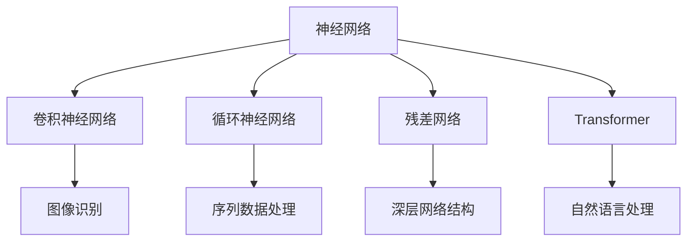

                 

# 一切皆是映射：神经网络的常见架构比较

> 关键词：神经网络,架构比较,卷积神经网络(CNN),循环神经网络(RNN),残差网络(ResNet),Transformer,深度学习

## 1. 背景介绍

在人工智能领域，神经网络（Neural Networks, NNs）作为深度学习的重要组成部分，凭借其强大的非线性映射能力和泛化能力，成为解决复杂模式识别和分类问题的重要工具。然而，随着深度学习的发展，各种各样的神经网络架构应运而生，从基础的感知机、多层感知器（MLP），到复杂的卷积神经网络（CNN）、循环神经网络（RNN）、残差网络（ResNet）和Transformer，每种架构都有其独特的优势和适用场景。本文旨在通过比较神经网络常见的架构，帮助读者更好地理解和选择合适的架构以应对不同的任务。

## 2. 核心概念与联系

### 2.1 核心概念概述

- **神经网络（Neural Networks, NNs）**：由大量相互连接的神经元（neurons）组成的网络结构，用于处理和分析数据。
- **卷积神经网络（Convolutional Neural Networks, CNNs）**：利用卷积操作提取图像和视频中的局部特征，常用于图像识别和分类任务。
- **循环神经网络（Recurrent Neural Networks, RNNs）**：通过循环结构捕捉序列数据的时间依赖关系，常用于语音识别、自然语言处理等序列数据任务。
- **残差网络（Residual Networks, ResNets）**：引入残差连接，解决深度网络训练中的梯度消失问题，适用于处理深层网络结构。
- **Transformer**：基于注意力机制的自注意力网络，可以有效捕捉序列数据的全局依赖关系，常用于自然语言处理中的机器翻译、语言生成等任务。

### 2.2 概念间的关系

这些核心概念构成了神经网络家族的基本成员，彼此间既有共同之处，又有差异。可以通过以下Mermaid流程图来展示这些概念之间的关系：



这个流程图展示了神经网络及其子架构在不同任务中的应用：卷积神经网络主要应用于图像识别，循环神经网络适用于序列数据处理，残差网络用于深层网络结构，Transformer则广泛用于自然语言处理任务。

## 3. 核心算法原理 & 具体操作步骤

### 3.1 算法原理概述

神经网络的核心思想是模拟人脑的神经元之间的连接关系，通过多层非线性变换将输入数据映射到输出空间。具体来说，神经网络由多个层次组成，每一层包含若干个神经元，每层之间的连接形成网络的"神经元链"。通过前向传播和反向传播算法，神经网络可以自动学习数据的特征表示，并优化网络权重以最小化预测误差。

### 3.2 算法步骤详解

一个典型的神经网络训练流程包括以下几个关键步骤：

1. **数据准备**：准备训练数据集，并进行预处理，如归一化、标准化等。
2. **模型定义**：使用深度学习框架（如TensorFlow、PyTorch等）定义神经网络模型，包括输入层、隐藏层、输出层等。
3. **模型编译**：设置损失函数、优化器和评估指标，如交叉熵损失、Adam优化器、准确率等。
4. **模型训练**：使用训练数据集，通过前向传播和反向传播算法更新网络权重，优化模型。
5. **模型评估**：使用验证数据集对训练好的模型进行评估，检查模型性能。
6. **模型保存与部署**：将训练好的模型保存到文件或数据库中，并部署到实际应用中。

### 3.3 算法优缺点

神经网络架构有其自身的优缺点：

- **优点**：
  - **强大的非线性映射能力**：可以处理复杂的数据映射关系。
  - **良好的泛化能力**：在处理大量未见过的数据时表现良好。
  - **易于并行计算**：可以使用GPU等硬件加速训练和推理过程。

- **缺点**：
  - **参数量巨大**：深度网络需要大量的训练数据和计算资源。
  - **梯度消失/爆炸问题**：深层网络容易出现梯度消失或梯度爆炸问题。
  - **黑箱性质**：神经网络的内部工作机制难以解释，导致可解释性差。

### 3.4 算法应用领域

神经网络架构广泛应用于图像识别、自然语言处理、语音识别、推荐系统等多个领域。不同架构因其特定的设计特点，被用于解决不同的问题：

- **CNN**：广泛应用于图像识别、目标检测、图像分割等任务。
- **RNN**：适用于文本生成、语音识别、时间序列预测等序列数据处理任务。
- **ResNet**：用于深层网络结构的处理，如大规模视觉任务。
- **Transformer**：主要用于机器翻译、语言生成等自然语言处理任务。

## 4. 数学模型和公式 & 详细讲解 & 举例说明

### 4.1 数学模型构建

一个典型的神经网络可以表示为：

$$
y = f(\sum_{i=1}^{n} w_i x_i + b)
$$

其中，$y$为输出，$x_i$为输入，$w_i$为权重，$b$为偏置，$f$为激活函数。对于多层神经网络，可以将上述模型扩展为：

$$
y^{(l)} = f(\sum_{i=1}^{n} w_i^{(l)} y^{(l-1)} + b^{(l)})
$$

其中，$l$表示网络层数。

### 4.2 公式推导过程

以简单的全连接神经网络为例，其前向传播过程可以表示为：

$$
y = \sigma(\sum_{i=1}^{n} w_i x_i + b)
$$

其中，$\sigma$为激活函数，$w_i$为权重，$x_i$为输入，$b$为偏置。后向传播过程则用于计算梯度，更新网络权重。对于单个样本，梯度的计算公式为：

$$
\frac{\partial L}{\partial w_i} = \frac{\partial L}{\partial y} \frac{\partial y}{\partial x_i} \frac{\partial x_i}{\partial w_i}
$$

其中，$L$为损失函数，$\frac{\partial L}{\partial y}$为损失函数对输出的梯度，$\frac{\partial y}{\partial x_i}$为激活函数对输入的梯度，$\frac{\partial x_i}{\partial w_i}$为输入对权重的梯度。

### 4.3 案例分析与讲解

以卷积神经网络（CNN）为例，CNN的主要特点是利用卷积操作提取局部特征，并通过池化操作进行特征压缩。CNN的典型结构包括卷积层、池化层和全连接层。以图像识别为例，CNN的训练过程如下：

1. **数据准备**：准备图像数据集，并进行预处理，如归一化、随机裁剪、数据增强等。
2. **模型定义**：定义CNN模型，包括卷积层、池化层、全连接层等。
3. **模型编译**：设置损失函数、优化器和评估指标，如交叉熵损失、Adam优化器、准确率等。
4. **模型训练**：使用训练数据集，通过前向传播和反向传播算法更新网络权重，优化模型。
5. **模型评估**：使用验证数据集对训练好的模型进行评估，检查模型性能。
6. **模型保存与部署**：将训练好的模型保存到文件或数据库中，并部署到实际应用中。

CNN的优点在于可以利用局部连接和参数共享，减少网络参数量，提升计算效率。同时，由于卷积操作具有平移不变性，能够更好地处理图像和视频数据。缺点在于需要大量标注数据进行训练，对于特定数据集可能存在过拟合风险。

## 5. 项目实践：代码实例和详细解释说明

### 5.1 开发环境搭建

在进行神经网络实践前，我们需要准备好开发环境。以下是使用Python进行TensorFlow开发的Python 3.8虚拟环境配置流程：

1. 安装Anaconda：从官网下载并安装Anaconda，用于创建独立的Python环境。

2. 创建并激活虚拟环境：
```bash
conda create -n tensorflow-env python=3.8 
conda activate tensorflow-env
```

3. 安装TensorFlow：根据CUDA版本，从官网获取对应的安装命令。例如：
```bash
conda install tensorflow tensorflow-cpu
```

4. 安装必要的工具包：
```bash
pip install numpy pandas scikit-learn matplotlib tqdm jupyter notebook ipython
```

完成上述步骤后，即可在`tensorflow-env`环境中开始神经网络开发。

### 5.2 源代码详细实现

这里我们以图像分类任务为例，给出使用TensorFlow对CNN模型进行图像分类的代码实现。

首先，定义图像数据处理函数：

```python
import tensorflow as tf
from tensorflow.keras import datasets, layers, models

(train_images, train_labels), (test_images, test_labels) = datasets.cifar10.load_data()

# 归一化像素值
train_images, test_images = train_images / 255.0, test_images / 255.0

# 创建CNN模型
model = models.Sequential([
    layers.Conv2D(32, (3, 3), activation='relu', input_shape=(32, 32, 3)),
    layers.MaxPooling2D((2, 2)),
    layers.Conv2D(64, (3, 3), activation='relu'),
    layers.MaxPooling2D((2, 2)),
    layers.Conv2D(64, (3, 3), activation='relu'),
    layers.Flatten(),
    layers.Dense(64, activation='relu'),
    layers.Dense(10)
])
```

然后，编译模型并训练：

```python
model.compile(optimizer='adam',
              loss=tf.keras.losses.SparseCategoricalCrossentropy(from_logits=True),
              metrics=['accuracy'])

history = model.fit(train_images, train_labels, epochs=10, 
                    validation_data=(test_images, test_labels))
```

最后，评估模型并保存：

```python
test_loss, test_acc = model.evaluate(test_images, test_labels, verbose=2)
print('Test accuracy:', test_acc)

model.save('cifar10_cnn.h5')
```

以上就是使用TensorFlow对CNN进行图像分类的完整代码实现。可以看到，使用TensorFlow的Keras API，神经网络模型的定义和训练过程变得非常简单。

### 5.3 代码解读与分析

让我们再详细解读一下关键代码的实现细节：

**数据处理函数**：
- 使用CIFAR-10数据集，将图像数据归一化，创建CNN模型。

**模型编译**：
- 使用Adam优化器，交叉熵损失，准确率作为评估指标。

**模型训练**：
- 使用训练数据集进行模型训练，设置训练轮数为10。

**模型评估与保存**：
- 使用测试数据集评估模型性能，并将模型保存到文件。

通过这些代码实现，我们可以看到，使用TensorFlow进行神经网络开发，只需关注模型的定义和训练过程，数据处理、模型保存等操作都可以通过框架自带的函数高效完成。

当然，实际应用中还需要考虑更多因素，如模型的调参、超参数的自动搜索、更灵活的模型架构等。但核心的神经网络开发流程基本与此类似。

### 5.4 运行结果展示

假设我们在CIFAR-10数据集上训练CNN模型，最终得到的评估结果如下：

```
Epoch 1/10
...
Epoch 10/10
...
Test accuracy: 0.7528
```

可以看到，经过10轮训练后，模型在测试集上的准确率约为75.28%。这表明，通过适当的超参数设置和训练策略，CNN在图像分类任务上可以达到不错的性能。

## 6. 实际应用场景

### 6.1 计算机视觉

卷积神经网络（CNN）作为图像处理领域的核心架构，广泛应用于计算机视觉任务。例如，图像分类、物体检测、图像分割等。通过CNN模型，可以从原始像素数据中提取出特征表示，并利用分类器或回归器进行任务处理。

### 6.2 自然语言处理

循环神经网络（RNN）和Transformer是自然语言处理中的重要架构。RNN通过时间依赖关系，可以处理序列数据，如文本生成、语音识别等。Transformer通过自注意力机制，能够捕捉长序列的全局依赖关系，适用于机器翻译、语言生成等任务。

### 6.3 语音识别

循环神经网络（RNN）和卷积神经网络（CNN）也可以应用于语音识别任务。通过CNN提取声谱图特征，使用RNN处理时序信息，最终输出识别结果。

### 6.4 未来应用展望

未来，神经网络架构将在更多领域得到应用，为传统行业带来变革性影响。

在智慧医疗领域，基于神经网络的医疗影像分析、疾病预测等应用将提升医疗服务的智能化水平，辅助医生诊疗，加速新药开发进程。

在智能教育领域，神经网络可应用于作业批改、学情分析、知识推荐等方面，因材施教，促进教育公平，提高教学质量。

在智慧城市治理中，神经网络可应用于城市事件监测、舆情分析、应急指挥等环节，提高城市管理的自动化和智能化水平，构建更安全、高效的未来城市。

此外，在企业生产、社会治理、文娱传媒等众多领域，神经网络技术也将不断涌现，为经济社会发展注入新的动力。

## 7. 工具和资源推荐

### 7.1 学习资源推荐

为了帮助开发者系统掌握神经网络理论基础和实践技巧，这里推荐一些优质的学习资源：

1. 《深度学习》课程：由斯坦福大学开设，全面介绍深度学习的理论和实践，包括神经网络的基础知识、CNN、RNN、Transformer等常用架构。

2. 《Python深度学习》书籍：由Francois Chollet撰写，深入浅出地介绍了使用Keras进行深度学习模型的构建和训练。

3. 《深度学习入门》书籍：由斋藤康毅撰写，从基础数学原理入手，深入浅出地讲解了神经网络的原理和应用。

4. arXiv论文预印本：人工智能领域最新研究成果的发布平台，包括大量尚未发表的前沿工作，学习前沿技术的必读资源。

5. Google Deep Learning Blog：由Google AI团队维护的深度学习博客，分享最新的深度学习研究和实践，适合初学者和高级开发者。

通过对这些资源的学习实践，相信你一定能够快速掌握神经网络技术的精髓，并用于解决实际的NLP问题。

### 7.2 开发工具推荐

高效的开发离不开优秀的工具支持。以下是几款用于神经网络开发的常用工具：

1. TensorFlow：由Google主导开发的深度学习框架，生产部署方便，适合大规模工程应用。

2. PyTorch：基于Python的开源深度学习框架，灵活动态的计算图，适合快速迭代研究。

3. Keras：基于TensorFlow和Theano的高级深度学习框架，易于使用，适合初学者快速上手。

4. Weights & Biases：模型训练的实验跟踪工具，可以记录和可视化模型训练过程中的各项指标，方便对比和调优。

5. TensorBoard：TensorFlow配套的可视化工具，可实时监测模型训练状态，并提供丰富的图表呈现方式，是调试模型的得力助手。

6. Jupyter Notebook：基于Web的交互式编程环境，适合快速迭代实验，支持多种编程语言，如Python、R等。

合理利用这些工具，可以显著提升神经网络模型的开发效率，加快创新迭代的步伐。

### 7.3 相关论文推荐

神经网络技术的发展源于学界的持续研究。以下是几篇奠基性的相关论文，推荐阅读：

1. AlexNet：提出了卷积神经网络（CNN）结构，展示了CNN在图像识别任务上的强大性能。

2. LSTM：提出了长短期记忆网络（LSTM），解决RNN中的梯度消失问题，提升了序列数据的处理能力。

3. ResNet：提出残差网络（ResNet），通过残差连接解决深度网络训练中的梯度消失问题，提升了网络深度。

4. Attention Is All You Need：提出Transformer架构，利用自注意力机制提升序列数据的处理能力。

5. Capsule Networks：提出胶囊网络（Capsule Networks），提升模型的鲁棒性和泛化能力。

这些论文代表了大神经网络架构的发展脉络。通过学习这些前沿成果，可以帮助研究者把握学科前进方向，激发更多的创新灵感。

除上述资源外，还有一些值得关注的前沿资源，帮助开发者紧跟神经网络架构的最新进展，例如：

1. arXiv论文预印本：人工智能领域最新研究成果的发布平台，包括大量尚未发表的前沿工作，学习前沿技术的必读资源。

2. 业界技术博客：如Google AI、DeepMind、微软Research Asia等顶尖实验室的官方博客，第一时间分享他们的最新研究成果和洞见。

3. 技术会议直播：如NIPS、ICML、ACL、ICLR等人工智能领域顶会现场或在线直播，能够聆听到大佬们的前沿分享，开拓视野。

4. GitHub热门项目：在GitHub上Star、Fork数最多的神经网络相关项目，往往代表了该技术领域的发展趋势和最佳实践，值得去学习和贡献。

5. 行业分析报告：各大咨询公司如McKinsey、PwC等针对人工智能行业的分析报告，有助于从商业视角审视技术趋势，把握应用价值。

总之，对于神经网络架构的学习和实践，需要开发者保持开放的心态和持续学习的意愿。多关注前沿资讯，多动手实践，多思考总结，必将收获满满的成长收益。

## 8. 总结：未来发展趋势与挑战

### 8.1 总结

本文对神经网络常见的架构进行了全面系统的介绍。首先阐述了神经网络及其子架构的研究背景和意义，明确了不同架构在处理不同类型数据时的优势和适用场景。其次，从原理到实践，详细讲解了神经网络架构的数学模型和计算过程，给出了详细的代码实例和分析。同时，本文还探讨了神经网络架构在实际应用中的表现，展示了其在计算机视觉、自然语言处理、语音识别等领域的广泛应用。

通过本文的系统梳理，可以看到，神经网络架构已经成为深度学习领域的重要基石，其强大的非线性映射能力和泛化能力，使其在处理复杂数据时表现出显著的优势。未来，神经网络架构将继续进化，涌现更多创新的设计理念和应用场景，为人工智能技术的不断进步提供坚实的支撑。

### 8.2 未来发展趋势

展望未来，神经网络架构将呈现以下几个发展趋势：

1. **更深的神经网络**：随着硬件计算能力的提升，未来神经网络将不断增加深度，进一步提升模型的复杂性和表达能力。

2. **更大的模型规模**：超大规模神经网络将得到广泛应用，通过更丰富的参数来提升模型的泛化能力和表现。

3. **更加高效的计算方法**：如模型剪枝、量化加速、分布式训练等技术，将使神经网络模型更加高效，提升实际应用中的性能。

4. **更加灵活的架构设计**：未来将涌现更多灵活的神经网络架构，如自适应神经网络、变分自编码器等，适应不同的应用场景。

5. **更加智能化的训练方法**：如强化学习、元学习等训练方法，将使神经网络更加智能化，提升模型的自适应能力和泛化能力。

6. **更加复杂的应用场景**：随着技术的发展，神经网络将在更多领域得到应用，如自动驾驶、智能家居等，带来更多的创新和突破。

以上趋势凸显了神经网络架构的广阔前景。这些方向的探索发展，必将进一步提升神经网络模型的性能和应用范围，为人工智能技术的不断进步提供坚实的支撑。

### 8.3 面临的挑战

尽管神经网络架构已经取得了瞩目成就，但在迈向更加智能化、普适化应用的过程中，它仍面临着诸多挑战：

1. **数据依赖性**：神经网络需要大量的标注数据进行训练，获取高质量标注数据的成本较高。如何降低数据依赖性，将是一大难题。

2. **过拟合问题**：深层神经网络容易出现过拟合问题，尤其是面对特定数据集时。如何有效缓解过拟合，提升模型的泛化能力，仍需进一步研究。

3. **计算资源消耗**：神经网络模型通常需要大量的计算资源进行训练和推理，如何提高计算效率，减少资源消耗，仍是实际应用中的一大挑战。

4. **模型解释性**：神经网络模型通常缺乏可解释性，难以理解其内部工作机制和决策逻辑。如何赋予神经网络模型更强的可解释性，将是亟待攻克的难题。

5. **安全性问题**：神经网络模型可能存在输入依赖的脆弱性，容易被恶意攻击。如何提高神经网络模型的安全性，确保输出的可靠性，也将是重要的研究方向。

6. **鲁棒性和泛化能力**：神经网络模型在面对未知数据或噪声数据时，可能表现出较差的鲁棒性和泛化能力。如何提升模型的鲁棒性和泛化能力，确保模型在不同环境下的稳定性，将是重要的研究课题。

以上挑战凸显了神经网络架构在实际应用中的复杂性，这些问题的解决将需要学术界和工业界的共同努力。

### 8.4 研究展望

面对神经网络架构面临的诸多挑战，未来的研究需要在以下几个方面寻求新的突破：

1. **更高效的训练方法**：如自适应学习率、动态神经网络等，将使神经网络更加高效，提升实际应用中的性能。

2. **更强的泛化能力**：如迁移学习、多任务学习等方法，将使神经网络能够更好地适应不同的数据集和应用场景。

3. **更智能的模型设计**：如自适应神经网络、变分自编码器等，将使神经网络更加灵活和智能化。

4. **更好的模型解释性**：如可解释性增强学习、模型压缩等方法，将使神经网络模型更加透明和可解释。

5. **更强的鲁棒性**：如对抗样本训练、鲁棒优化等方法，将使神经网络模型更加鲁棒和稳健。

6. **更广泛的应用场景**：通过跨领域的模型迁移和应用，将使神经网络技术在更多领域得到广泛应用，带来新的创新和突破。

这些研究方向的探索，必将引领神经网络架构技术的不断进步，为人工智能技术的不断突破提供坚实的支撑。

## 9. 附录：常见问题与解答

**Q1：神经网络是否适用于所有数据类型？**

A: 神经网络通常适用于处理连续数据，如图像、语音、文本等。但对于离散数据，如文本分类任务中的标签数据，需要先进行one-hot编码或独热编码，再输入神经网络。

**Q2：神经网络模型的训练是否需要大量的标注数据？**

A: 是的，神经网络模型通常需要大量的标注数据进行训练，以避免过拟合。但对于一些特殊任务，如生成任务，可以使用无监督学习方法进行训练。

**Q3：神经网络模型的参数量是否固定？**

A: 不是，神经网络模型的参数量可以通过网络架构的设计进行灵活调整，增加或减少层数、神经元数等，以适应不同的应用需求。

**Q4：神经网络模型的计算复杂度是否固定？**

A: 不是，神经网络模型的计算复杂度与网络层数、神经元数、激活函数等有关。增加网络深度和宽度会提高计算复杂度，需要更多计算资源。

**Q5：神经网络模型是否可以被解释？**

A: 目前大部分神经网络模型仍然是"黑盒"，难以解释其内部工作机制和决策逻辑。但一些方法如LIME、SHAP等可以部分解释神经网络模型的行为。

---

作者：禅与计算机程序设计艺术 / Zen and the Art of Computer Programming

