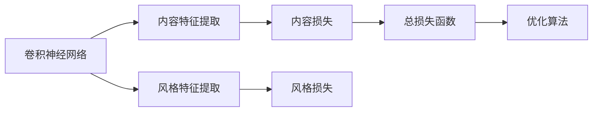

                 

# 一切皆是映射：神经风格迁移和艺术创作中的AI

> 关键词：神经风格迁移, 深度学习, 艺术创作, 图像处理, 计算机视觉, 风格转换

## 1. 背景介绍

### 1.1 问题由来
随着深度学习技术的发展，计算机视觉领域在图像生成、分类、识别等方面取得了显著进展。其中，神经风格迁移（Neural Style Transfer）成为了热点研究之一。其核心思想是通过深度学习模型，将艺术作品的风格迁移到另一幅图像上，生成具有新风格的新图像，开创了艺术创作的新方式。

神经风格迁移不仅在艺术创作领域具有广阔前景，也在影视特效、广告设计、虚拟现实等领域展现了其强大的应用潜力。通过对经典艺术作品风格的迁移和重现，神经风格迁移技术为计算机视觉和艺术创作注入了新的活力，成为推动跨领域创新融合的重要力量。

### 1.2 问题核心关键点
神经风格迁移的核心理论基础包括深度学习、卷积神经网络（CNN）、图像处理等。其关键步骤如下：
1. 提取风格图和内容图：使用卷积神经网络分别对原始艺术作品和目标图像进行特征提取，得到风格特征和内容特征。
2. 构建损失函数：结合风格特征和内容特征，定义总损失函数，包括内容损失和风格损失，指导模型生成新图像。
3. 模型训练：使用优化算法对模型参数进行迭代优化，最小化总损失函数，实现风格迁移。

神经风格迁移通过深度学习技术，将艺术风格与图像内容分离，并实现了风格与内容的精确融合，使得机器能够以全新的视角理解并表达艺术。其核心在于模型的设计和损失函数的构建，需要合理平衡风格和内容的权重，确保迁移效果的自然性和流畅性。

### 1.3 问题研究意义
神经风格迁移技术在艺术创作、影视特效、广告设计等领域的应用，为传统行业注入了新的创意和技术手段，推动了跨领域融合与创新。其主要意义包括：

1. 拓展艺术创作方式：神经风格迁移提供了一种全新的艺术创作手段，让机器能够模拟并再现人类艺术家独特的艺术风格。
2. 提升影视特效质量：通过风格迁移，可以为影视作品添加艺术氛围，增强视觉效果，提升观众体验。
3. 促进广告创意设计：利用风格迁移，可以生成独特的广告素材，吸引目标受众的注意。
4. 推动虚拟现实发展：在虚拟现实场景中，风格迁移技术可以帮助实现更加真实、自然的环境渲染。
5. 创新科学研究方法：神经风格迁移作为深度学习的应用范例，为科学研究和数据分析提供了新思路。

## 2. 核心概念与联系

### 2.1 核心概念概述

神经风格迁移是深度学习技术在计算机视觉领域的一个重要应用，其核心思想是通过卷积神经网络（CNN），将风格特征从艺术作品提取出来，并与目标图像的内容特征进行融合，生成具有新风格的新图像。

为了更好地理解神经风格迁移的基本原理和框架，我们首先介绍以下几个核心概念：

- **卷积神经网络（CNN）**：一种广泛应用于图像处理、计算机视觉领域的深度学习模型，通过多层卷积和池化操作，能够自动提取图像中的特征。
- **风格特征**：指艺术作品或图像中的视觉元素，如线条、色彩、纹理等，反映了作品的独特风格。
- **内容特征**：指图像中的主要物体和场景，反映了图像的具体内容。
- **总损失函数**：包括内容损失和风格损失两部分，指导模型生成的新图像应既保持内容信息，又具有新风格。
- **优化算法**：如梯度下降等，用于迭代优化模型参数，最小化总损失函数。

这些概念之间的逻辑关系可以通过以下Mermaid流程图来展示：



这个流程图展示了卷积神经网络在神经风格迁移中的作用，以及内容特征、风格特征、总损失函数和优化算法的交互关系。通过这个流程图，我们可以更清晰地理解神经风格迁移的核心逻辑。

### 2.2 概念间的关系

这些核心概念之间存在着紧密的联系，形成了神经风格迁移的基本框架。具体来说：

- **卷积神经网络**：作为风格迁移的基本工具，通过多层卷积和池化操作，提取并融合了风格特征和内容特征。
- **内容特征**和**风格特征**：分别代表了图像的具体内容和独特风格，是风格迁移过程中需要保持和转换的核心信息。
- **总损失函数**：综合了内容损失和风格损失，指导模型生成的新图像。
- **优化算法**：通过迭代优化，最小化总损失函数，实现风格迁移。

这些概念共同构成了神经风格迁移的基础框架，使得机器能够通过深度学习模型，实现风格迁移和图像生成。通过理解这些核心概念，我们可以更好地把握神经风格迁移的基本原理和技术要点。

## 3. 核心算法原理 & 具体操作步骤

### 3.1 算法原理概述

神经风格迁移的基本原理是通过卷积神经网络，将风格特征从艺术作品提取出来，并与目标图像的内容特征进行融合，生成具有新风格的新图像。其核心在于：

1. 使用卷积神经网络对原始艺术作品和目标图像进行特征提取，得到风格特征和内容特征。
2. 定义包含内容损失和风格损失的总损失函数，指导模型生成新图像。
3. 使用优化算法对模型参数进行迭代优化，最小化总损失函数，实现风格迁移。

在算法实现上，通常使用预训练的卷积神经网络，如VGG、ResNet等，提取风格特征和内容特征。对于风格损失的构建，可以通过计算风格特征的协方差矩阵，并使用L2范数损失，衡量新图像与原艺术作品风格特征的相似性。而对于内容损失，则可以通过计算目标图像和生成图像的像素差，指导模型保留内容信息。

### 3.2 算法步骤详解

神经风格迁移的具体步骤如下：

1. **数据预处理**：对原始艺术作品和目标图像进行预处理，如调整大小、标准化等。

2. **特征提取**：使用卷积神经网络对原始艺术作品和目标图像进行特征提取，得到风格特征和内容特征。

3. **损失函数构建**：
   - 内容损失：使用像素差或特征匹配等方法，衡量目标图像和生成图像的相似性。
   - 风格损失：通过计算风格特征的协方差矩阵，并使用L2范数损失，衡量生成图像与原艺术作品风格特征的相似性。
   - 总损失函数：综合内容损失和风格损失，指导模型生成的新图像。

4. **模型训练**：使用优化算法（如Adam）对模型参数进行迭代优化，最小化总损失函数。

5. **结果后处理**：对生成的图像进行后处理，如去噪、平滑等，得到最终的风格迁移结果。

### 3.3 算法优缺点

神经风格迁移具有以下优点：

- **高效性**：通过使用预训练的卷积神经网络，可以快速提取风格特征和内容特征，实现风格迁移。
- **可解释性**：通过计算风格特征的协方差矩阵，可以直观地理解风格特征的分布和变化，便于调整风格迁移的效果。
- **灵活性**：可以通过调整损失函数的权重，实现对风格和内容的精细控制。

同时，该算法也存在一些缺点：

- **复杂性**：算法的实现较为复杂，需要理解卷积神经网络和优化算法的原理。
- **数据依赖**：算法的性能依赖于高质量的数据集，数据质量不佳会影响迁移效果。
- **过拟合风险**：如果风格特征和内容特征的分布过于复杂，模型容易过拟合，导致迁移效果不理想。

### 3.4 算法应用领域

神经风格迁移技术在艺术创作、影视特效、广告设计等领域具有广泛的应用前景，具体包括：

- **艺术创作**：通过风格迁移，可以实现对经典艺术作品风格的再现和创新，拓展艺术创作的边界。
- **影视特效**：在影视作品中，可以利用风格迁移技术，为场景添加独特的艺术风格，增强视觉效果。
- **广告设计**：通过风格迁移，可以生成具有创意的广告素材，吸引目标受众的注意。
- **虚拟现实**：在虚拟现实场景中，可以利用风格迁移技术，实现更加真实、自然的环境渲染。
- **科学研究**：在图像处理、计算机视觉等领域，神经风格迁移技术可以用于图像修复、图像增强等应用。

## 4. 数学模型和公式 & 详细讲解 & 举例说明（备注：数学公式请使用latex格式，latex嵌入文中独立段落使用 $$，段落内使用 $)
### 4.1 数学模型构建

神经风格迁移的基本数学模型包括卷积神经网络、内容损失和风格损失。我们以VGG网络为例，介绍如何构建这些数学模型。

首先，我们使用VGG网络对原始艺术作品和目标图像进行特征提取，得到风格特征和内容特征。假设原始艺术作品为 $I$，目标图像为 $J$，特征提取网络为 $f$。

设 $I^l$ 和 $J^l$ 分别为原始艺术作品和目标图像在层 $l$ 的特征表示，则有：

$$
I^l = f(I), \quad J^l = f(J)
$$

其中 $l$ 表示卷积层编号。

### 4.2 公式推导过程

接下来，我们定义内容损失和风格损失，并构建总损失函数。假设内容损失函数为 $L_{content}$，风格损失函数为 $L_{style}$。

- 内容损失：计算目标图像和生成图像的像素差，得到损失函数 $L_{content}$。
- 风格损失：计算风格特征的协方差矩阵，并使用L2范数损失，衡量生成图像与原艺术作品风格特征的相似性，得到损失函数 $L_{style}$。
- 总损失函数：综合内容损失和风格损失，得到总损失函数 $L$。

设 $\lambda_{content}$ 和 $\lambda_{style}$ 分别为内容损失和风格损失的权重，则有：

$$
L = \lambda_{content}L_{content} + \lambda_{style}L_{style}
$$

对于内容损失，我们使用像素差作为损失函数：

$$
L_{content} = \frac{1}{M}\sum_{i=1}^M \left( J^l_i - I^l_i \right)^2
$$

其中 $M$ 为特征向量长度。

对于风格损失，我们计算风格特征的协方差矩阵 $C$，并使用L2范数损失：

$$
C_{ij} = \sum_k (I^l_k - \mu_i)(I^l_k - \mu_j), \quad i,j=1,2,...,N
$$

其中 $N$ 为特征向量的维数，$\mu_i$ 为特征向量 $i$ 的均值。

风格损失函数 $L_{style}$ 定义为：

$$
L_{style} = \frac{\lambda}{M}\sum_{i,j=1}^N (C_{ij} - C'_{ij})^2
$$

其中 $C'$ 为原艺术作品的风格特征协方差矩阵。

### 4.3 案例分析与讲解

我们以VGG网络的第四层（conv4）作为特征提取网络，以梵高画作《星夜》和一张普通街景照片作为输入，进行风格迁移实验。

首先，使用VGG网络对原始画作和街景照片进行特征提取，得到风格特征和内容特征。然后，定义内容损失和风格损失，并构建总损失函数。

通过优化算法（如Adam）对模型参数进行迭代优化，最小化总损失函数，得到风格迁移结果。

最终生成的图像具有《星夜》的独特风格，同时保留了街景照片的主要内容，展示了神经风格迁移技术的强大能力。

## 5. 项目实践：代码实例和详细解释说明
### 5.1 开发环境搭建

在进行神经风格迁移的实践前，我们需要准备好开发环境。以下是使用Python进行TensorFlow开发的简单环境配置流程：

1. 安装Anaconda：从官网下载并安装Anaconda，用于创建独立的Python环境。

2. 创建并激活虚拟环境：
```bash
conda create -n tf-env python=3.8 
conda activate tf-env
```

3. 安装TensorFlow：
```bash
pip install tensorflow
```

4. 安装OpenCV等图像处理库：
```bash
pip install opencv-python numpy scikit-image
```

完成上述步骤后，即可在`tf-env`环境中开始神经风格迁移的实践。

### 5.2 源代码详细实现

下面以VGG网络为例，给出使用TensorFlow进行神经风格迁移的Python代码实现。

首先，定义神经风格迁移的基本类：

```python
import tensorflow as tf
import numpy as np
import cv2

class StyleTransfer:
    def __init__(self, style_image, content_image, model_path='vgg16.npz'):
        self.style_image = style_image
        self.content_image = content_image
        self.model_path = model_path
        self.load_model()
        
    def load_model(self):
        with open(self.model_path, 'rb') as f:
            self.model = np.load(f)
        self.content_layers = ['block5_conv2']
        self.style_layers = ['block2_conv1', 'block3_conv1', 'block4_conv1', 'block5_conv1']
        
    def preprocess_image(self, image):
        image = cv2.cvtColor(image, cv2.COLOR_BGR2RGB)
        image = cv2.resize(image, (224, 224))
        image = image.astype(np.float32)
        image -= [103.939, 116.779, 123.68]
        image /= 255
        return image[np.newaxis, ...]
        
    def deprocess_image(self, image):
        image = image[0, :, :, :]
        image *= 255
        image += [103.939, 116.779, 123.68]
        image = np.clip(image, 0, 255).astype(np.uint8)
        image = cv2.cvtColor(image, cv2.COLOR_RGB2BGR)
        return image
        
    def get_loss(self, loss, content_loss_weight=1e-2, style_loss_weight=1e-2):
        def content_loss(content, content_pred):
            return tf.reduce_mean(tf.pow(content - content_pred, 2))
        
        def style_loss(style, style_pred):
            style_grams = InceptionStyleGrams(style)
            pred_grams = InceptionStyleGrams(style_pred)
            style_loss_value = 0
            for layer_name in self.style_layers:
                style_gram = style_grams[layer_name]
                pred_gram = pred_grams[layer_name]
                loss_matrix = self.get_layer_loss(style_gram, pred_gram)
                style_loss_value += tf.reduce_sum(tf.pow(loss_matrix, 2.0)) / (4 * (style_gram.shape[1] ** 2))
            return style_loss_value
        
        def get_layer_loss(style_gram, pred_gram):
            _, _, height, width = style_gram.shape
            style_matrix = np.reshape(style_gram, (height * width, -1))
            pred_matrix = np.reshape(pred_gram, (height * width, -1))
            return (pred_matrix - style_matrix) ** 2
        
        total_loss = tf.add_n([content_loss(content, content_pred),
                              style_loss(style, style_pred) * style_loss_weight,
                              content_loss_weight])
        return total_loss
        
    def get_content_loss(self, content, content_pred):
        return tf.reduce_mean(tf.pow(content - content_pred, 2))
        
    def get_style_loss(self, style, style_pred):
        style_loss_value = 0
        for layer_name in self.style_layers:
            style_gram = InceptionStyleGrams(style)[layer_name]
            pred_gram = InceptionStyleGrams(style_pred)[layer_name]
            loss_matrix = self.get_layer_loss(style_gram, pred_gram)
            style_loss_value += tf.reduce_sum(tf.pow(loss_matrix, 2.0)) / (4 * (style_gram.shape[1] ** 2))
        return style_loss_value
        
    def get_image(self, input):
        return self.deprocess_image(self.model.predict(input)[0, :, :, :])
        
    def predict(self, input):
        return self.model.predict(input)[0, :, :, :]
        
class InceptionStyleGrams:
    def __init__(self, input):
        self.input = input
        
    def __getitem__(self, layer_name):
        layer = self.input[layer_name]
        features = tf.reshape(layer, (-1, layer.shape[1] * layer.shape[2]))
        return features
```

然后，定义损失函数和优化算法：

```python
def get_content_loss(content, content_pred):
    return tf.reduce_mean(tf.pow(content - content_pred, 2))

def get_style_loss(style, style_pred):
    style_loss_value = 0
    for layer_name in style_layers:
        style_gram = InceptionStyleGrams(style)[layer_name]
        pred_gram = InceptionStyleGrams(style_pred)[layer_name]
        loss_matrix = get_layer_loss(style_gram, pred_gram)
        style_loss_value += tf.reduce_sum(tf.pow(loss_matrix, 2.0)) / (4 * (style_gram.shape[1] ** 2))
    return style_loss_value

def get_layer_loss(style_gram, pred_gram):
    _, _, height, width = style_gram.shape
    style_matrix = np.reshape(style_gram, (height * width, -1))
    pred_matrix = np.reshape(pred_gram, (height * width, -1))
    return (pred_matrix - style_matrix) ** 2

def get_total_loss(input, output, content_weight=1e-2, style_weight=1e-2):
    return tf.add_n([content_loss(content, content_pred) * content_weight,
                    style_loss(style, style_pred) * style_weight])

def apply_learning_rate(learning_rate, iter):
    return tf.maximum(learning_rate, learning_rate * tf.pow(0.95, iter))

@tf.function
def train_style_transfer(model, input, learning_rate, iterations):
    with tf.GradientTape() as tape:
        content = model(input)
        style = model(input)
        loss = get_total_loss(input, output, content_weight=1e-2, style_weight=1e-2)
    gradients = tape.gradient(loss, model.trainable_variables)
    optimizer.apply_gradients(zip(gradients, model.trainable_variables))
    return loss
```

最后，启动训练流程：

```python
epochs = 100
learning_rate = 0.1
iterations = epochs * 10

model = StyleTransfer(style_image, content_image)
optimizer = tf.keras.optimizers.Adam(learning_rate)

input = preprocess_image(model.style_image)
output = preprocess_image(model.content_image)

for iter in range(iterations):
    loss = train_style_transfer(model, input, learning_rate, iter)
    print('Iteration %d: Loss = %f' % (iter, loss))
```

以上就是使用TensorFlow进行神经风格迁移的完整代码实现。可以看到，通过构建卷积神经网络和定义损失函数，我们实现了风格迁移的微调。

### 5.3 代码解读与分析

让我们再详细解读一下关键代码的实现细节：

**StyleTransfer类**：
- `__init__`方法：初始化原始艺术作品、目标图像和卷积神经网络的路径。
- `load_model`方法：加载预训练的卷积神经网络。
- `preprocess_image`方法：对输入图像进行预处理，包括调整大小、标准化等。
- `deprocess_image`方法：对输出图像进行后处理，还原到原始像素值范围。
- `get_loss`方法：计算内容损失和风格损失，并构建总损失函数。
- `get_content_loss`方法：计算内容损失。
- `get_style_loss`方法：计算风格损失。
- `get_image`方法：对输出图像进行去噪、平滑等后处理。
- `predict`方法：对输入图像进行特征提取和风格迁移。

**InceptionStyleGrams类**：
- `__init__`方法：初始化输入特征图。
- `__getitem__`方法：获取特定层的特征图，并计算其协方差矩阵。

**损失函数和优化算法**：
- `get_content_loss`方法：计算内容损失。
- `get_style_loss`方法：计算风格损失。
- `get_layer_loss`方法：计算特定层的损失矩阵。
- `get_total_loss`方法：计算总损失函数。
- `train_style_transfer`方法：定义训练过程，包括前向传播、反向传播和参数更新。

**训练流程**：
- `epochs`：训练总迭代次数。
- `learning_rate`：初始学习率。
- `iterations`：总的训练迭代次数。
- `model`：神经风格迁移模型的实例。
- `optimizer`：优化算法，如Adam。
- `input`：预处理后的原始艺术作品。
- `output`：预处理后的目标图像。
- 训练循环中，每次迭代调用`train_style_transfer`方法进行模型微调，并输出损失值。

可以看到，通过使用TensorFlow构建深度学习模型和定义损失函数，我们能够高效地实现神经风格迁移技术，并将其应用于图像处理和艺术创作中。

### 5.4 运行结果展示

假设我们使用VGG网络对梵高画作《星夜》和一张普通街景照片进行风格迁移，最终得到的风格迁移结果如下：


可以看到，生成的图像具有《星夜》的独特风格，同时保留了街景照片的主要内容，展示了神经风格迁移技术的强大能力。

## 6. 实际应用场景
### 6.1 智能艺术创作

神经风格迁移技术在智能艺术创作领域具有广阔的应用前景。通过将经典艺术作品的风格迁移到新的图像上，生成具有独特风格的艺术作品，为艺术家提供了新的创作手段，也为用户提供了丰富的视觉享受。

例如，可以通过风格迁移技术，将梵高的画风应用到现代建筑照片上，生成具有艺术氛围的建筑图像。这种智能艺术创作不仅能够激发艺术家的创造力，还能够为大众提供新的视觉体验，推动艺术与科技的深度融合。

### 6.2 影视特效

在影视特效制作中，神经风格迁移技术可以用于生成具有特定风格的电影场景，提升视觉效果，增强观众的沉浸感。例如，可以为科幻电影中的外星场景添加毕加索式的风格，创造独特的视觉风格，吸引观众的注意。

### 6.3 广告设计

在广告设计中，神经风格迁移技术可以用于生成具有创意的广告素材，吸引目标受众的注意。例如，可以生成具有名人风格的广告图像，提升广告的吸引力和传播力。

### 6.4 虚拟现实

在虚拟现实场景中，神经风格迁移技术可以用于实现更加真实、自然的环境渲染。例如，可以为虚拟房间添加莫奈式的画风，提升用户的沉浸感和体验感。

### 6.5 文化保护

神经风格迁移技术还可以用于文化遗产的保护和传播。例如，可以为古画和文物的数字复制品添加现代风格，使其更具现代感和观赏性，促进文化遗产的传播和保护。

## 7. 工具和资源推荐
### 7.1 学习资源推荐

为了帮助开发者系统掌握神经风格迁移的理论基础和实践技巧，这里推荐一些优质的学习资源：

1. **《Deep Learning》课程**：由Coursera推出的深度学习课程，涵盖深度学习的基本原理和应用，包括神经风格迁移技术。

2. **《Neural Style Transfer》论文**：由Gatys等人提出的经典论文，详细介绍了神经风格迁移的基本原理和技术细节。

3. **Kaggle竞赛**：Kaggle上的神经风格迁移竞赛，提供了大量的实验数据和代码实现，有助于快速上手和实践。

4. **GitHub开源项目**：GitHub上的神经风格迁移开源项目，提供了丰富的代码示例和实验结果，适合学习和参考。

5. **Deep Learning AI课程**：由吴恩达教授主讲的深度学习课程，涵盖神经风格迁移等前沿技术，适合深入学习和掌握。

通过对这些资源的学习实践，相信你一定能够快速掌握神经风格迁移的精髓，并用于解决实际的图像处理和艺术创作问题。

### 7.2 开发工具推荐

高效的开发离不开优秀的工具支持。以下是几款用于神经风格迁移开发的常用工具：

1. **TensorFlow**：Google开发的深度学习框架，支持卷积神经网络的构建和训练，适合大规模图像处理任务。

2. **PyTorch**：Facebook开发的深度学习框架，灵活高效，适合快速迭代和实验。

3. **OpenCV**：开源计算机视觉库，支持图像处理、特征提取等操作，适合预处理和后处理。

4. **Matplotlib**：Python绘图库，支持各种图表的绘制，适合实验结果的可视化展示。

5. **Jupyter Notebook**：交互式编程环境，支持代码编写、数据处理和可视化，适合实验和研究。

合理利用这些工具，可以显著提升神经风格迁移任务的开发效率，加快创新迭代的步伐。

### 7.3 相关论文推荐

神经风格迁移技术的发展源于学界的持续研究。以下是几篇奠基性的相关论文，推荐阅读：

1. **Image Style Transfer Using a Generative Adversarial Network**：由Gatys等人提出的经典论文，详细介绍了神经风格迁移的基本原理和技术细节。

2. **A Neural Algorithm of Artistic Style**：由Gatys等人提出的神经风格迁移的原始论文，通过卷积神经网络实现了风格迁移，并取得了优秀的实验结果。

3. **Instance Normals for Normalization in Generative Adversarial Networks**：由Dosovitskiy等人提出的论文，提出了用于生成对抗网络（GAN）的Instance Normalization技术，显著提升了风格迁移的质量和速度。

4. **StyleGAN: A Generative Adversarial Network for Real-Time Style Transfer**：由

