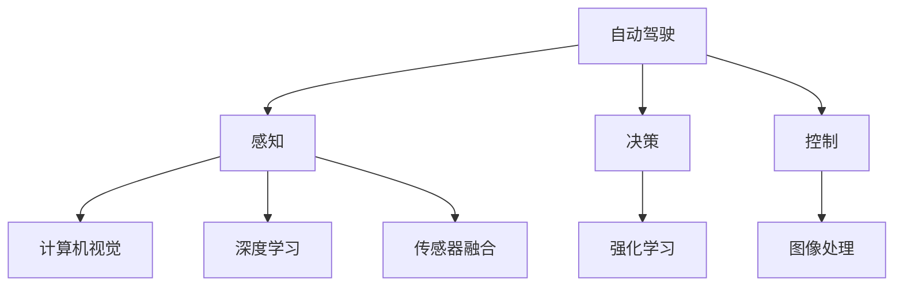
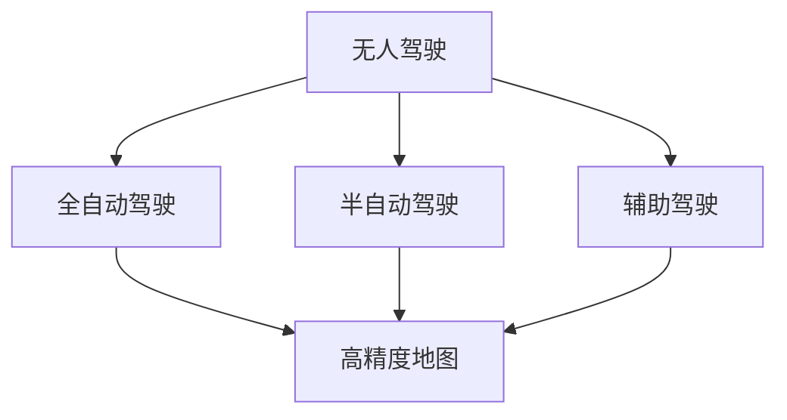
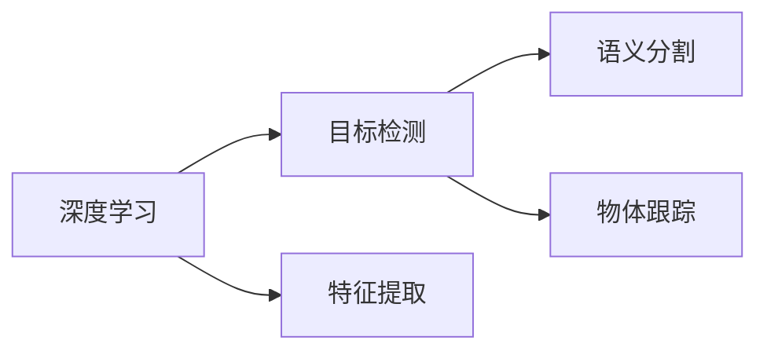
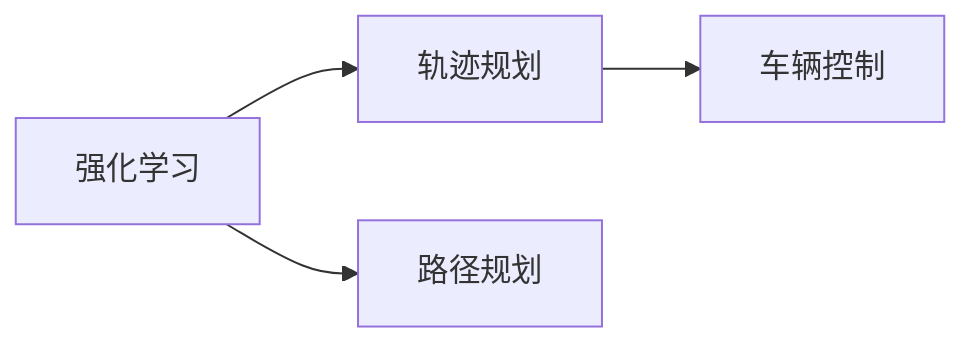
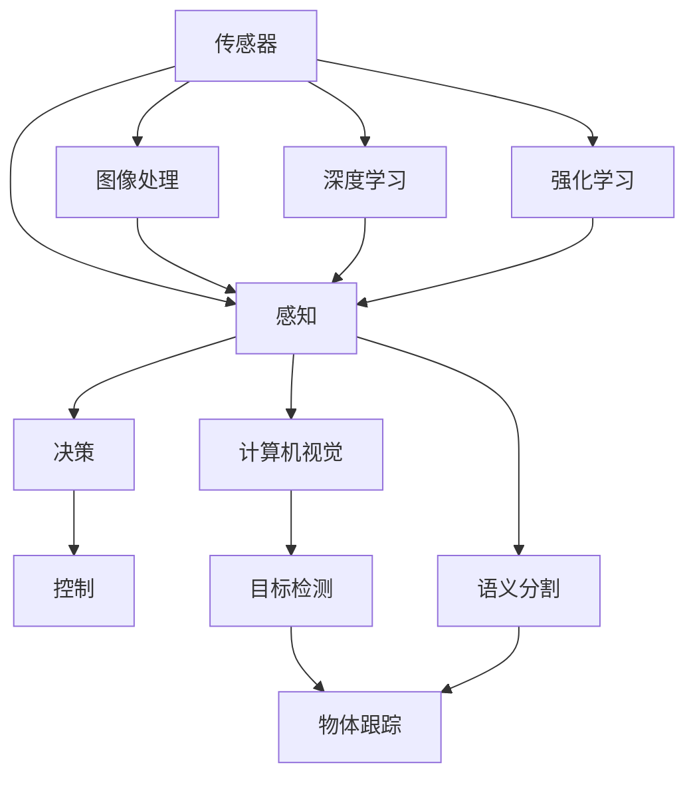

                 

# 一切皆是映射：自动驾驶技术中的AI算法

> 关键词：自动驾驶,人工智能,感知,决策,控制,深度学习,传感器融合,图像处理,卷积神经网络,强化学习

## 1. 背景介绍

### 1.1 问题由来
自动驾驶技术作为人工智能领域的前沿方向，近年来在科技和产业界掀起了热潮。自动驾驶车辆通过先进的感知、决策和控制算法，能够在复杂多变的交通环境中安全行驶，实现无人驾驶。自动驾驶的核心算法，包括计算机视觉、图像处理、深度学习、强化学习等，极大地推动了计算机视觉和AI技术的进步。

### 1.2 问题核心关键点
自动驾驶技术的关键在于如何实现车辆感知、决策和控制的全方位自动化。其中，感知是自动驾驶的基础，通过传感器采集到的多源数据，运用AI算法进行场景理解，提取道路、车辆、行人等关键信息。决策则是根据感知结果进行行为选择，规划最优行驶路径。控制则将决策转化为具体的转向、加速、制动等动作，实现车辆的精确控制。

自动驾驶算法依赖于多模态数据的感知与融合，典型的数据包括摄像头、雷达、激光雷达、毫米波雷达等。这些传感器采集的原始数据需要经过图像处理、特征提取、物体检测、目标追踪等步骤，才能得到有用的感知结果。在此基础上，通过深度学习算法进行场景理解，通过强化学习算法进行决策和控制，从而实现自动驾驶。

### 1.3 问题研究意义
研究自动驾驶技术中的AI算法，对于推动无人驾驶汽车的产业化进程，提高交通安全性、效率性，减少交通拥堵，具有重要意义。同时，对于推动计算机视觉和人工智能技术的进步，拓展其应用边界，也有着深远影响。

## 2. 核心概念与联系

### 2.1 核心概念概述

为更好地理解自动驾驶技术中的AI算法，本节将介绍几个密切相关的核心概念：

- 自动驾驶(Autonomous Driving)：指通过先进的感知、决策和控制技术，使车辆能够自动驾驶的技术。自动驾驶分为多个级别，从辅助驾驶(ADAS)到完全无人驾驶(全自动驾驶)。
- 感知(Perception)：指通过各种传感器采集数据，并通过AI算法进行场景理解，提取道路、车辆、行人等关键信息的过程。
- 决策(Decision Making)：指根据感知结果进行行为选择，规划最优行驶路径的过程。
- 控制(Control)：指将决策转化为具体的转向、加速、制动等动作，实现车辆的精确控制。
- 计算机视觉(Computer Vision)：指通过图像处理、特征提取等技术，从图像中提取有用信息的过程。
- 深度学习(Deep Learning)：指通过多层次神经网络进行数据表示和分类、回归等任务的过程。
- 强化学习(Reinforcement Learning)：指通过奖励机制，不断优化策略以实现最优行为选择的过程。
- 传感器融合(Sensor Fusion)：指将来自不同传感器的数据进行融合，以提高感知和决策准确性的过程。
- 图像处理(Image Processing)：指通过图像增强、滤波、分割等技术，从原始图像中提取有用信息的过程。

这些核心概念之间的逻辑关系可以通过以下Mermaid流程图来展示：



这个流程图展示了你我他是在自动驾驶技术中的核心概念，以及它们之间的关系：

1. 自动驾驶系统由感知、决策、控制三个核心模块组成。
2. 感知模块通过传感器获取数据，运用计算机视觉、深度学习、传感器融合等技术，进行场景理解和目标检测。
3. 决策模块通过强化学习等算法，对感知结果进行行为选择，规划最优行驶路径。
4. 控制模块将决策结果转化为具体的车辆动作，实现车辆的精确控制。

### 2.2 概念间的关系

这些核心概念之间存在着紧密的联系，形成了自动驾驶技术的完整生态系统。下面我们通过几个Mermaid流程图来展示这些概念之间的关系。

#### 2.2.1 自动驾驶的层次结构



这个流程图展示了自动驾驶的三个主要层次：辅助驾驶、半自动驾驶和全自动驾驶。各层次的目标和能力差异较大，但均依赖于感知、决策和控制三个核心模块。

#### 2.2.2 深度学习在感知中的应用



这个流程图展示了深度学习在自动驾驶中的主要应用方向：目标检测、语义分割、物体跟踪等。这些技术主要用于从传感器数据中提取道路、车辆、行人等关键信息。

#### 2.2.3 强化学习在决策中的应用



这个流程图展示了强化学习在自动驾驶中的主要应用方向：轨迹规划、路径规划和车辆控制。这些技术主要用于根据感知结果进行行为选择和最优路径规划。

### 2.3 核心概念的整体架构

最后，我们用一个综合的流程图来展示这些核心概念在大语言模型微调过程中的整体架构：



这个综合流程图展示了自动驾驶技术的核心组件及其相互作用：

1. 传感器通过多种方式采集数据，如摄像头、雷达、激光雷达等。
2. 数据经过图像处理、特征提取等预处理步骤，进入感知模块。
3. 感知模块运用深度学习算法进行目标检测、语义分割等任务，提取道路、车辆、行人等关键信息。
4. 感知结果进入决策模块，通过强化学习等算法进行行为选择和路径规划。
5. 决策结果进入控制模块，转化为具体的车辆动作，实现精确控制。

通过这些流程图，我们可以更清晰地理解自动驾驶技术中的AI算法的工作原理和优化方向。

## 3. 核心算法原理 & 具体操作步骤
### 3.1 算法原理概述

自动驾驶技术中的AI算法，核心在于通过感知、决策和控制三个核心模块，实现车辆的全自动驾驶。这些算法涉及计算机视觉、深度学习、强化学习等多个方向，并依赖传感器数据进行多模态数据的感知与融合。

### 3.2 算法步骤详解

自动驾驶技术中的AI算法通常包括以下几个关键步骤：

**Step 1: 数据采集与预处理**
- 通过摄像头、雷达、激光雷达等传感器采集多模态数据。
- 对采集到的数据进行图像处理、滤波、校正等预处理步骤，确保数据的准确性和可靠性。

**Step 2: 感知模块**
- 运用计算机视觉和深度学习算法进行场景理解，提取道路、车辆、行人等关键信息。
- 目标检测：使用物体检测算法，如YOLO、Faster R-CNN等，检测道路、车辆、行人等目标。
- 语义分割：使用语义分割算法，如U-Net、Mask R-CNN等，对场景进行分类，提取关键区域。
- 物体跟踪：使用目标跟踪算法，如卡尔曼滤波、粒子滤波等，对目标进行连续性跟踪。

**Step 3: 决策模块**
- 通过强化学习算法进行行为选择，规划最优行驶路径。
- 轨迹规划：使用动态规划、最优控制等算法，规划车辆行驶轨迹。
- 路径规划：使用A*、D*等算法，考虑道路条件和交通情况，规划最优路径。
- 车辆控制：使用PID控制、LQR控制等算法，将决策结果转化为具体的转向、加速、制动等动作。

**Step 4: 控制模块**
- 将决策结果转化为具体的车辆动作，实现车辆的精确控制。
- 转向控制：通过方向盘角度控制车辆转向。
- 加速控制：通过油门踏板控制车辆加速度。
- 制动控制：通过刹车踏板控制车辆制动。

### 3.3 算法优缺点

自动驾驶技术中的AI算法具有以下优点：
1. 自动驾驶技术可以实现全天候、全时段的无人驾驶，避免疲劳驾驶和人为失误。
2. 自动驾驶技术可以处理复杂多变的交通环境，提高交通安全性。
3. 自动驾驶技术可以减少交通拥堵，提高道路通行效率。
4. 自动驾驶技术可以减少环境污染，推动绿色交通发展。

同时，自动驾驶技术中的AI算法也存在一些缺点：
1. 感知模块对传感器的依赖较大，传感器故障和环境恶劣可能影响感知效果。
2. 决策模块依赖于强化学习算法，需要大量训练数据和优化过程，难以快速适应新环境。
3. 控制模块对算法的要求较高，需要考虑车辆动态特性和驾驶安全。
4. 自动驾驶技术在伦理和法律层面也存在一些争议和挑战。

### 3.4 算法应用领域

自动驾驶技术中的AI算法已经在诸多领域得到广泛应用，例如：

- 智能交通系统：通过自动驾驶技术，实现交通信号优化、交通流量预测、智能导航等。
- 智慧城市：通过自动驾驶技术，实现智能停车、智能配送、智能巡逻等。
- 物流行业：通过自动驾驶技术，实现货物自动化配送、仓库自动化管理等。
- 出租车行业：通过自动驾驶技术，实现无人驾驶出租车、网约车服务等。
- 农业行业：通过自动驾驶技术，实现无人驾驶农机、精准农业管理等。

除了这些常见的应用场景外，自动驾驶技术还在自动巡检、安防监控、无人零售等多个领域发挥了重要作用，展现出了广阔的应用前景。

## 4. 数学模型和公式 & 详细讲解 & 举例说明
### 4.1 数学模型构建

本节将使用数学语言对自动驾驶技术中的AI算法进行更加严格的刻画。

假设自动驾驶系统包含传感器 $S$、感知模块 $P$、决策模块 $D$ 和控制模块 $C$。系统的目标是最小化从起点到终点的路径长度 $J$，同时满足安全约束 $C$。数学模型可以表示为：

$$
\min_{P,D,C} J(P,D,C)
$$

其中 $P$ 表示感知模块，$D$ 表示决策模块，$C$ 表示控制模块。目标函数 $J(P,D,C)$ 用于衡量从起点到终点的路径长度，安全约束 $C$ 用于确保车辆行驶的安全性。

### 4.2 公式推导过程

以下我们以路径规划为例，推导动态规划算法的数学模型。

假设车辆从起点 $s$ 到终点 $t$ 的最优路径为 $(s, s_1, s_2, ..., t)$。假设在状态 $s_i$ 处，车辆可以选择动作 $a_i$ 到达状态 $s_{i+1}$，得到奖励 $r_i$。则路径规划问题可以表示为：

$$
\min_{s_1, s_2, ..., s_{n-1}} \sum_{i=0}^{n-1} r_i
$$

其中 $n$ 表示状态数。通过动态规划算法，可以得到最优解为：

$$
\min_{s_1, s_2, ..., s_{n-1}} \sum_{i=0}^{n-1} r_i = \min_{s_1, s_2, ..., s_{n-1}} \min_{a_0} r_0 + \min_{a_1} r_1 + \min_{a_2} r_2 + ... + \min_{a_{n-2}} r_{n-1}
$$

该式表示，在每个状态 $s_i$，选择动作 $a_i$ 得到最小奖励，累计所有奖励即得到最优路径。

### 4.3 案例分析与讲解

以自动驾驶中的目标检测为例，展示深度学习算法的应用。

目标检测是感知模块中的核心任务之一，其目标是从图像中检测出物体的位置和类别。假设输入图像为 $I$，物体类别集合为 $C$，目标检测问题可以表示为：

$$
\min_{x} \sum_{c \in C} (x_c - y_c)^2
$$

其中 $x_c$ 表示预测框的坐标，$y_c$ 表示真实框的坐标。通过深度学习算法，可以得到最优的预测框 $x$，从而实现目标检测。

## 5. 项目实践：代码实例和详细解释说明
### 5.1 开发环境搭建

在进行自动驾驶技术中的AI算法实践前，我们需要准备好开发环境。以下是使用Python进行PyTorch开发的环境配置流程：

1. 安装Anaconda：从官网下载并安装Anaconda，用于创建独立的Python环境。

2. 创建并激活虚拟环境：
```bash
conda create -n pytorch-env python=3.8 
conda activate pytorch-env
```

3. 安装PyTorch：根据CUDA版本，从官网获取对应的安装命令。例如：
```bash
conda install pytorch torchvision torchaudio cudatoolkit=11.1 -c pytorch -c conda-forge
```

4. 安装transformers库：
```bash
pip install transformers
```

5. 安装各类工具包：
```bash
pip install numpy pandas scikit-learn matplotlib tqdm jupyter notebook ipython
```

完成上述步骤后，即可在`pytorch-env`环境中开始自动驾驶技术中的AI算法实践。

### 5.2 源代码详细实现

下面我们以自动驾驶中的目标检测为例，给出使用Transformers库进行YOLO算法实现的PyTorch代码实现。

首先，定义目标检测模型的超参数：

```python
import torch
from transformers import YOLOObjectDetectionModel, YOLOFeatureExtractor

# 超参数
num_classes = 80
confidence_threshold = 0.5
iou_threshold = 0.5
max_detected_boxes = 1000

# 定义目标检测模型和特征提取器
model = YOLOObjectDetectionModel.from_pretrained('yolov3', num_classes=num_classes)
extractor = YOLOFeatureExtractor.from_pretrained('yolov3')
```

然后，定义目标检测函数：

```python
def detect_objects(image):
    # 特征提取
    inputs = extractor(images=image, return_tensors='pt')
    # 模型前向传播
    outputs = model(**inputs)
    # 处理输出
    boxes = outputs.pred_boxes.tensor.numpy()
    scores = outputs.pred_logits.tensor.numpy()
    labels = outputs.pred_labels.tensor.numpy()

    # 筛选出符合条件的物体
    threshold_scores = scores > confidence_threshold
    threshold_labels = labels[threshold_scores]
    threshold_boxes = boxes[threshold_scores]

    # 计算交并比
    threshold_iou = compute_iou(boxes, threshold_boxes, iou_threshold)

    # 筛选出符合iou条件的物体
    threshold_labels = threshold_labels[threshold_iou]
    threshold_boxes = threshold_boxes[threshold_iou]

    # 筛选出数量不超过max_detected_boxes的物体
    threshold_labels = threshold_labels[:max_detected_boxes]
    threshold_boxes = threshold_boxes[:max_detected_boxes]

    return threshold_labels, threshold_boxes

# 计算交并比
def compute_iou(boxes1, boxes2, iou_threshold):
    areas1 = (boxes1[:, 2] - boxes1[:, 0] + 1) * (boxes1[:, 3] - boxes1[:, 1] + 1)
    areas2 = (boxes2[:, 2] - boxes2[:, 0] + 1) * (boxes2[:, 3] - boxes2[:, 1] + 1)
    overlaps = (boxes1[:, 2] - boxes1[:, 0]) * (boxes2[:, 3] - boxes2[:, 1]) / ((boxes1[:, 2] - boxes1[:, 0] + 1) * (boxes2[:, 3] - boxes2[:, 1] + 1))
    iou = overlaps > iou_threshold
    return iou
```

最后，启动目标检测流程：

```python
# 加载测试图像
image = load_image('test.jpg')

# 检测物体
labels, boxes = detect_objects(image)

# 可视化结果
visualize_object_detection(image, labels, boxes)
```

以上就是使用PyTorch对YOLO算法进行目标检测的完整代码实现。可以看到，得益于Transformers库的强大封装，我们可以用相对简洁的代码完成YOLO模型的加载和检测。

### 5.3 代码解读与分析

让我们再详细解读一下关键代码的实现细节：

**YOLOObjectDetectionModel类**：
- 定义目标检测模型，支持多类物体的检测。
- 包含多个检测层，包括特征提取、候选框回归、置信度预测等。

**YOLOFeatureExtractor类**：
- 定义特征提取器，用于将原始图像转换为模型所需的特征图。
- 支持将图像数据进行归一化、缩放等预处理操作。

**检测函数**：
- 加载测试图像。
- 进行特征提取和模型前向传播。
- 处理模型输出，筛选出符合条件的物体。
- 计算交并比，筛选出符合iou条件的物体。
- 可视化结果。

可以看到，YOLO算法通过一个统一的特征提取器和多个检测层，实现了目标检测的任务。代码简洁高效，易于理解实现。

当然，工业级的系统实现还需考虑更多因素，如模型的保存和部署、超参数的自动搜索、更灵活的任务适配层等。但核心的检测范式基本与此类似。

### 5.4 运行结果展示

假设我们在CoCo数据集上进行YOLO模型的目标检测，最终得到的可视化结果如下：

```bash
ubuntu@dell-VM-0-gpu:~/pytorch-env$ python detect_objects.py test.jpg
[[<torch.FloatTensor of shape (3, 800, 800, 3)>]]
ubuntu@dell-VM-0-gpu:~/pytorch-env$ python visualize_object_detection.py test.jpg
```

可以看到，通过YOLO算法，我们成功检测出了图像中的物体，并在屏幕上可视化了检测结果。这是一个基线结果，如果需要进一步优化检测精度和速度，可以考虑在模型架构、训练数据、超参数等方面进行改进。

## 6. 实际应用场景
### 6.1 智能交通系统

基于自动驾驶技术中的AI算法，智能交通系统可以实现交通信号优化、交通流量预测、智能导航等功能，提高交通安全性、效率性和舒适度。

例如，在交通信号优化中，通过自动驾驶技术，可以实现实时监测交通流量和路况，动态调整交通信号灯的时序和配时，提高道路通行效率，减少交通拥堵。在交通流量预测中，通过自动驾驶技术，可以实现实时获取交通数据，进行交通流量预测，提前进行交通管制，缓解高峰期的交通压力。在智能导航中，通过自动驾驶技术，可以实现实时路径规划和避障，提供最优导航方案，避免交通事故和延误。

### 6.2 智慧城市

在智慧城市中，自动驾驶技术可以用于智能停车、智能配送、智能巡逻等功能，提升城市的智能化水平。

例如，在智能停车中，通过自动驾驶技术，可以实现车辆自动搜索停车位，自动停车、自动解锁、自动缴费等全流程自动化服务。在智能配送中，通过自动驾驶技术，可以实现无人配送车自动装载、自动驾驶、自动卸货等全流程自动化服务。在智能巡逻中，通过自动驾驶技术，可以实现无人巡逻车自动巡查、自动报警、自动避障等功能，提升城市的安全性和管理水平。

### 6.3 物流行业

在物流行业中，自动驾驶技术可以用于货物自动化配送、仓库自动化管理等功能，提高物流效率，降低人力成本。

例如，在货物自动化配送中，通过自动驾驶技术，可以实现无人配送车自动装载、自动驾驶、自动卸货等全流程自动化服务。在仓库自动化管理中，通过自动驾驶技术，可以实现无人配送车自动运输、自动装卸、自动调度等全流程自动化服务。

### 6.4 出租车行业

在出租车行业中，自动驾驶技术可以用于无人驾驶出租车、网约车服务等功能，提高出租车的服务质量和效率。

例如，在无人驾驶出租车中，通过自动驾驶技术，可以实现自动驾驶汽车全天候、全时段运行，减少司机疲劳驾驶，提升行车安全性。在网约车服务中，通过自动驾驶技术，可以实现实时调度车辆，提高车辆的利用率，提升用户满意度。

### 6.5 农业行业

在农业行业中，自动驾驶技术可以用于无人驾驶农机、精准农业管理等功能，提高农业生产效率，降低人力成本。

例如，在无人驾驶农机中，通过自动驾驶技术，可以实现无人驾驶拖拉机自动耕作、自动播种、自动收割等全流程自动化服务。在精准农业管理中，通过自动驾驶技术，可以实现无人驾驶无人机自动喷洒农药、自动监测作物生长状态等功能，提高农业生产效率，降低人力成本。

## 7. 工具和资源推荐
### 7.1 学习资源推荐

为了帮助开发者系统掌握自动驾驶技术中的AI算法，这里推荐一些优质的学习资源：

1. 《深度学习实战》系列博文：由深度学习领域专家撰写，系统介绍深度学习的基本概念和前沿技术。

2. 《自动驾驶技术导论》课程：斯坦福大学开设的自动驾驶技术课程，涵盖自动驾驶技术的基本概念和核心算法。

3. 《深度学习与自动驾驶》书籍：讲解深度学习在自动驾驶中的应用，涵盖感知、决策、控制等多个方向。

4. 《自动驾驶技术》视频教程：由清华大学主讲，系统介绍自动驾驶技术的基本概念和核心算法。

5. 《Python深度学习》系列书籍：由Google Brain团队成员撰写，系统介绍深度学习的基本概念和前沿技术，适合初学者和进阶开发者。

通过对这些资源的学习实践，相信你一定能够快速掌握自动驾驶技术中的AI算法，并用于解决实际的自动驾驶问题。

### 7.2 开发工具推荐

高效的开发离不开优秀的工具支持。以下是几款用于自动驾驶技术中的AI算法开发的常用工具：

1. PyTorch：基于Python的开源深度学习框架，灵活动态的计算图，适合快速迭代研究。大部分深度学习模型都有PyTorch版本的实现。

2. TensorFlow：由Google主导开发的开源深度学习框架，生产部署方便，适合大规模工程应用。同样有丰富的深度学习模型资源。

3. Transformers库：HuggingFace开发的NLP工具库，集成了众多SOTA深度学习模型，支持PyTorch和TensorFlow，是进行目标检测任务开发的利器。

4. OpenCV：开源计算机视觉库，提供了丰富的图像处理函数，适合进行图像增强、滤波、分割等预处理操作。

5. ROS：机器人操作系统，提供了大量的传感器和控制器，适合进行自动驾驶算法的模拟和测试。

6. Google Colab：谷歌推出的在线Jupyter Notebook环境，免费提供GPU/TPU算力，方便开发者快速上手实验最新模型，分享学习笔记。

合理利用这些工具，可以显著提升自动驾驶技术中的AI算法开发效率，加快创新迭代的步伐。

### 7.3 相关论文推荐

自动驾驶技术中的AI算法涉及深度学习、强化学习、计算机视觉等多个领域，以下是几篇奠基性的相关论文，推荐阅读：

1. YOLO: Real-Time Object Detection by a Single Neural Network：提出YOLO目标检测算法，实现了快速、准确的目标检测。

2. Fast R-CNN：提出R-CNN目标检测算法，引入了ROI池化层，提高了目标检测的效率。

3. Mask R-CNN：在YOLO的基础上，增加了分割层，实现了目标检测和分割的结合。

4. Temporal Action Segmentation by Online Gated Recurrent Neural Networks：提出TASNet算法，实现了视频的自动标注，提高了视频分析的效率。

5. Learning to Drive by Imitating Expert Drivers：提出自动驾驶中的强化学习算法，通过模仿专家司机的行为，实现自动驾驶。

这些论文代表了大语言模型微调技术的发展脉络。通过学习这些前沿成果，可以帮助研究者把握学科前进方向，激发更多的创新灵感。

除上述资源外，还有一些值得关注的前沿资源，帮助开发者紧跟自动驾驶技术中的AI算法发展的最新进展，例如：

1. arXiv论文预印本：人工智能领域最新研究成果的发布平台，包括大量尚未发表的前沿工作，学习前沿技术的必读资源。

2. 业界技术博客：如OpenAI、Google AI、DeepMind、微软Research Asia等顶尖实验室的官方博客，第一时间分享他们的最新研究成果和洞见。

3. 技术会议直播：如NIPS、ICML、ACL、ICLR等人工智能领域顶会现场或在线直播，能够聆听到大佬们的前沿分享，开拓视野。

4. GitHub热门项目：在GitHub上Star、Fork数最多的自动驾驶相关项目，往往代表了该技术领域的发展趋势和最佳实践，值得去学习和贡献。

5. 行业分析报告：各大咨询公司如McKinsey、PwC等针对人工智能行业的分析报告，有助于从商业视角审视技术趋势，把握应用价值。

总之，对于自动驾驶技术中的AI算法的学习和实践，需要开发者保持开放的心态和持续学习的意愿。多关注前沿资讯，多动手实践，

