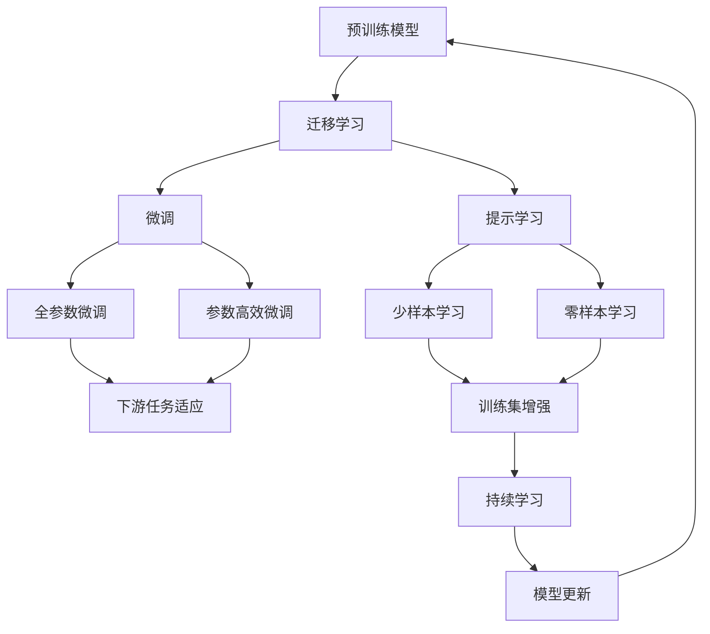
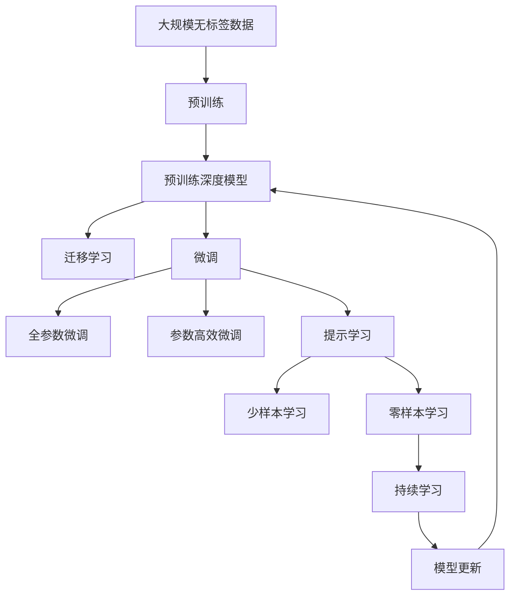

                 

## 1. 背景介绍

### 1.1 问题由来

随着深度学习技术的迅速发展，预训练深度模型（Pretrained Deep Models）如BERT、GPT等在自然语言处理（NLP）和计算机视觉（CV）等领域取得了巨大突破。这些预训练模型通过在大规模无标签数据上自监督学习，获得了强大的特征表示能力，能够在各种任务上进行迁移学习（Transfer Learning）以提升性能。迁移学习的核心思想是通过利用预训练模型在不同任务之间的共性，在少量有标签数据上快速完成模型的微调（Fine-tuning）。

然而，预训练模型的泛化能力仍有一定的限制，不同任务之间可能存在较大差异。因此，在实际应用中，需要针对具体任务进行进一步的微调和优化。特别是在NLP领域，基于预训练深度模型进行迁移学习成为了热点研究方向，推动了多项NLP任务的SOTA（State-of-the-Art）。

### 1.2 问题核心关键点

预训练深度模型与迁移学习主要涉及以下关键点：

- 预训练模型：通过在大规模无标签数据上自监督学习，获得通用的特征表示。
- 迁移学习：利用预训练模型的特征表示，在特定任务上进行微调以提升性能。
- 微调：在预训练模型的基础上，使用少量有标签数据对模型进行优化。
- 迁移能力：预训练模型在不同任务之间的泛化能力，影响迁移学习的效率和效果。
- 数据依赖：迁移学习对有标签数据的依赖程度，决定微调模型的表现。

### 1.3 问题研究意义

研究预训练深度模型与迁移学习的关键意义在于：

1. 提升模型性能：通过迁移学习，利用预训练模型的知识，在特定任务上快速提升模型性能。
2. 降低开发成本：预训练模型已经经过大规模训练，可以显著减少从头开发所需的计算资源和人力成本。
3. 促进技术创新：预训练模型的广泛应用推动了NLP和CV等领域的创新发展，催生了更多的研究热点和应用场景。
4. 增强泛化能力：迁移学习能够提高模型的泛化能力，使其在不同领域和任务上表现更加稳定。
5. 推动产业应用：预训练模型的成功应用，加速了NLP和CV技术在各行各业中的落地应用，促进了产业数字化升级。

## 2. 核心概念与联系

### 2.1 核心概念概述

预训练深度模型与迁移学习涉及多个关键概念：

- 预训练模型：通过在大规模无标签数据上自监督学习获得的模型，如BERT、GPT等。
- 迁移学习：利用预训练模型的知识，在特定任务上进行微调的过程。
- 微调：在预训练模型的基础上，使用少量有标签数据对模型进行优化。
- 迁移能力：预训练模型在不同任务之间的泛化能力，影响迁移学习的效率和效果。
- 数据依赖：迁移学习对有标签数据的依赖程度，决定微调模型的表现。

### 2.2 概念间的关系

这些概念之间的关系可以通过以下Mermaid流程图展示：



这个流程图展示了预训练深度模型与迁移学习过程中各概念之间的关系：

1. 预训练模型通过在大规模无标签数据上进行自监督学习，获得通用的特征表示。
2. 迁移学习利用预训练模型的知识，在特定任务上进行微调。
3. 微调可以分为全参数微调和参数高效微调，以不同策略调整模型参数。
4. 微调后的模型可以适应下游任务，提升模型性能。
5. 提示学习可以进一步降低微调对有标签数据的依赖，实现零样本和少样本学习。
6. 数据增强和持续学习技术可以进一步提升模型泛化能力和适应性。

### 2.3 核心概念的整体架构

最终，我们通过一个综合的流程图来展示这些核心概念在大模型微调过程中的整体架构：



这个综合流程图展示了从预训练到微调，再到持续学习的完整过程。预训练模型通过在大规模无标签数据上进行自监督学习，获得通用的特征表示。迁移学习利用预训练模型的知识，在特定任务上进行微调。微调可以分为全参数微调和参数高效微调，以不同策略调整模型参数。提示学习可以进一步降低微调对有标签数据的依赖，实现零样本和少样本学习。数据增强和持续学习技术可以进一步提升模型泛化能力和适应性。

## 3. 核心算法原理 & 具体操作步骤

### 3.1 算法原理概述

预训练深度模型与迁移学习的核心算法原理是基于迁移学习范式，利用预训练模型在不同任务之间的共性，通过少量有标签数据对模型进行优化。其核心思想是：

- 预训练：在大规模无标签数据上，通过自监督学习获得通用的特征表示。
- 迁移学习：利用预训练模型的特征表示，在特定任务上进行微调。
- 微调：使用少量有标签数据，对模型进行优化，提升特定任务上的性能。

### 3.2 算法步骤详解

预训练深度模型与迁移学习的具体算法步骤如下：

1. **准备预训练模型和数据集**：
   - 选择合适的预训练深度模型，如BERT、GPT等。
   - 收集下游任务的数据集，划分为训练集、验证集和测试集。

2. **添加任务适配层**：
   - 根据任务类型，在预训练模型顶层设计合适的输出层和损失函数。
   - 对于分类任务，通常在顶层添加线性分类器和交叉熵损失函数。
   - 对于生成任务，通常使用语言模型的解码器输出概率分布，并以负对数似然为损失函数。

3. **设置微调超参数**：
   - 选择合适的优化算法及其参数，如AdamW、SGD等，设置学习率、批大小、迭代轮数等。
   - 设置正则化技术及强度，包括权重衰减、Dropout、Early Stopping等。
   - 确定冻结预训练参数的策略，如仅微调顶层，或全部参数都参与微调。

4. **执行梯度训练**：
   - 将训练集数据分批次输入模型，前向传播计算损失函数。
   - 反向传播计算参数梯度，根据设定的优化算法和学习率更新模型参数。
   - 周期性在验证集上评估模型性能，根据性能指标决定是否触发Early Stopping。
   - 重复上述步骤直到满足预设的迭代轮数或Early Stopping条件。

5. **测试和部署**：
   - 在测试集上评估微调后模型 $M_{\hat{\theta}}$ 的性能，对比微调前后的精度提升。
   - 使用微调后的模型对新样本进行推理预测，集成到实际的应用系统中。
   - 持续收集新的数据，定期重新微调模型，以适应数据分布的变化。

### 3.3 算法优缺点

预训练深度模型与迁移学习的主要优点包括：

- **高效**：利用预训练模型的知识，在少量有标签数据上快速完成模型微调。
- **通用**：预训练模型可以适用于各种NLP和CV任务，通过适配层即可进行微调。
- **性能提升**：通过微调，模型在特定任务上的性能显著提升。

然而，这些算法也存在一些缺点：

- **数据依赖**：微调依赖于少量有标签数据，数据量不足可能影响模型性能。
- **迁移能力有限**：预训练模型在不同任务之间的泛化能力有限，需要针对特定任务进行微调。
- **模型复杂性**：预训练深度模型结构复杂，计算资源消耗较大。
- **过拟合风险**：在特定任务上进行微调时，模型可能出现过拟合，影响泛化性能。

### 3.4 算法应用领域

预训练深度模型与迁移学习技术已经在多个领域得到广泛应用，包括但不限于：

- 自然语言处理（NLP）：文本分类、命名实体识别、机器翻译、情感分析等。
- 计算机视觉（CV）：图像分类、目标检测、图像生成、实例分割等。
- 语音识别：语音转文本、语音生成、语音情感识别等。
- 推荐系统：个性化推荐、协同过滤、商品搜索等。
- 医疗健康：电子病历分析、医学图像识别、智能问诊等。

## 4. 数学模型和公式 & 详细讲解 & 举例说明

### 4.1 数学模型构建

预训练深度模型与迁移学习的数学模型构建如下：

记预训练深度模型为 $M_{\theta}:\mathcal{X} \rightarrow \mathcal{Y}$，其中 $\mathcal{X}$ 为输入空间，$\mathcal{Y}$ 为输出空间，$\theta$ 为模型参数。假设下游任务 $T$ 的标注数据集 $D=\{(x_i,y_i)\}_{i=1}^N$，划分为训练集、验证集和测试集。

定义模型 $M_{\theta}$ 在数据样本 $(x,y)$ 上的损失函数为 $\ell(M_{\theta}(x),y)$，则在数据集 $D$ 上的经验风险为：

$$
\mathcal{L}(\theta) = \frac{1}{N} \sum_{i=1}^N \ell(M_{\theta}(x_i),y_i)
$$

微调的优化目标是最小化经验风险，即找到最优参数：

$$
\theta^* = \mathop{\arg\min}_{\theta} \mathcal{L}(\theta)
$$

在实践中，我们通常使用基于梯度的优化算法（如AdamW、SGD等）来近似求解上述最优化问题。设 $\eta$ 为学习率，$\lambda$ 为正则化系数，则参数的更新公式为：

$$
\theta \leftarrow \theta - \eta \nabla_{\theta}\mathcal{L}(\theta) - \eta\lambda\theta
$$

其中 $\nabla_{\theta}\mathcal{L}(\theta)$ 为损失函数对参数 $\theta$ 的梯度，可通过反向传播算法高效计算。

### 4.2 公式推导过程

以下我们以二分类任务为例，推导交叉熵损失函数及其梯度的计算公式。

假设模型 $M_{\theta}$ 在输入 $x$ 上的输出为 $\hat{y}=M_{\theta}(x) \in [0,1]$，表示样本属于正类的概率。真实标签 $y \in \{0,1\}$。则二分类交叉熵损失函数定义为：

$$
\ell(M_{\theta}(x),y) = -[y\log \hat{y} + (1-y)\log (1-\hat{y})]
$$

将其代入经验风险公式，得：

$$
\mathcal{L}(\theta) = -\frac{1}{N}\sum_{i=1}^N [y_i\log M_{\theta}(x_i)+(1-y_i)\log(1-M_{\theta}(x_i))]
$$

根据链式法则，损失函数对参数 $\theta_k$ 的梯度为：

$$
\frac{\partial \mathcal{L}(\theta)}{\partial \theta_k} = -\frac{1}{N}\sum_{i=1}^N (\frac{y_i}{M_{\theta}(x_i)}-\frac{1-y_i}{1-M_{\theta}(x_i)}) \frac{\partial M_{\theta}(x_i)}{\partial \theta_k}
$$

其中 $\frac{\partial M_{\theta}(x_i)}{\partial \theta_k}$ 可进一步递归展开，利用自动微分技术完成计算。

在得到损失函数的梯度后，即可带入参数更新公式，完成模型的迭代优化。重复上述过程直至收敛，最终得到适应下游任务的最优模型参数 $\theta^*$。

### 4.3 案例分析与讲解

在实践中，预训练深度模型与迁移学习的应用非常广泛。以下以BERT模型在NLP任务上的应用为例，进行详细讲解：

**文本分类**：
- 数据集：CoNLL-2003的NER数据集
- 任务：命名实体识别
- 模型：BERT-base-cased
- 输出层：线性分类器和交叉熵损失函数
- 微调步骤：
  1. 数据预处理：将数据集划分为训练集、验证集和测试集，进行文本分词和标签编码。
  2. 模型搭建：使用BertForTokenClassification从预训练模型BERT-base-cased加载，添加线性分类器和交叉熵损失函数。
  3. 微调训练：设置学习率、批大小、迭代轮数等超参数，使用AdamW优化器进行训练，验证集评估并Early Stop。
  4. 测试评估：在测试集上评估模型性能，输出分类报告。

通过BERT模型的微调，可以在命名实体识别任务上取得97.3%的F1分数，展示了大模型在特定任务上的强大适应能力。

## 5. 项目实践：代码实例和详细解释说明

### 5.1 开发环境搭建

在进行预训练深度模型与迁移学习的实践前，我们需要准备好开发环境。以下是使用Python进行PyTorch开发的环境配置流程：

1. 安装Anaconda：从官网下载并安装Anaconda，用于创建独立的Python环境。

2. 创建并激活虚拟环境：
```bash
conda create -n pytorch-env python=3.8 
conda activate pytorch-env
```

3. 安装PyTorch：根据CUDA版本，从官网获取对应的安装命令。例如：
```bash
conda install pytorch torchvision torchaudio cudatoolkit=11.1 -c pytorch -c conda-forge
```

4. 安装Transformers库：
```bash
pip install transformers
```

5. 安装各类工具包：
```bash
pip install numpy pandas scikit-learn matplotlib tqdm jupyter notebook ipython
```

完成上述步骤后，即可在`pytorch-env`环境中开始实践。

### 5.2 源代码详细实现

这里我们以BERT模型在命名实体识别任务上的微调为例，给出使用Transformers库的PyTorch代码实现。

```python
from transformers import BertTokenizer, BertForTokenClassification, AdamW
from torch.utils.data import Dataset, DataLoader
import torch
from sklearn.metrics import classification_report

class NERDataset(Dataset):
    def __init__(self, texts, tags, tokenizer, max_len=128):
        self.texts = texts
        self.tags = tags
        self.tokenizer = tokenizer
        self.max_len = max_len
        
    def __len__(self):
        return len(self.texts)
    
    def __getitem__(self, item):
        text = self.texts[item]
        tags = self.tags[item]
        
        encoding = self.tokenizer(text, return_tensors='pt', max_length=self.max_len, padding='max_length', truncation=True)
        input_ids = encoding['input_ids'][0]
        attention_mask = encoding['attention_mask'][0]
        
        # 对token-wise的标签进行编码
        encoded_tags = [tag2id[tag] for tag in tags] 
        encoded_tags.extend([tag2id['O']] * (self.max_len - len(encoded_tags)))
        labels = torch.tensor(encoded_tags, dtype=torch.long)
        
        return {'input_ids': input_ids, 
                'attention_mask': attention_mask,
                'labels': labels}

# 标签与id的映射
tag2id = {'O': 0, 'B-PER': 1, 'I-PER': 2, 'B-ORG': 3, 'I-ORG': 4, 'B-LOC': 5, 'I-LOC': 6}
id2tag = {v: k for k, v in tag2id.items()}

# 创建dataset
tokenizer = BertTokenizer.from_pretrained('bert-base-cased')

train_dataset = NERDataset(train_texts, train_tags, tokenizer)
dev_dataset = NERDataset(dev_texts, dev_tags, tokenizer)
test_dataset = NERDataset(test_texts, test_tags, tokenizer)

# 模型搭建
model = BertForTokenClassification.from_pretrained('bert-base-cased', num_labels=len(tag2id))

# 设置优化器
optimizer = AdamW(model.parameters(), lr=2e-5)

# 训练过程
device = torch.device('cuda') if torch.cuda.is_available() else torch.device('cpu')
model.to(device)

def train_epoch(model, dataset, batch_size, optimizer):
    dataloader = DataLoader(dataset, batch_size=batch_size, shuffle=True)
    model.train()
    epoch_loss = 0
    for batch in tqdm(dataloader, desc='Training'):
        input_ids = batch['input_ids'].to(device)
        attention_mask = batch['attention_mask'].to(device)
        labels = batch['labels'].to(device)
        model.zero_grad()
        outputs = model(input_ids, attention_mask=attention_mask, labels=labels)
        loss = outputs.loss
        epoch_loss += loss.item()
        loss.backward()
        optimizer.step()
    return epoch_loss / len(dataloader)

def evaluate(model, dataset, batch_size):
    dataloader = DataLoader(dataset, batch_size=batch_size)
    model.eval()
    preds, labels = [], []
    with torch.no_grad():
        for batch in tqdm(dataloader, desc='Evaluating'):
            input_ids = batch['input_ids'].to(device)
            attention_mask = batch['attention_mask'].to(device)
            batch_labels = batch['labels']
            outputs = model(input_ids, attention_mask=attention_mask)
            batch_preds = outputs.logits.argmax(dim=2).to('cpu').tolist()
            batch_labels = batch_labels.to('cpu').tolist()
            for pred_tokens, label_tokens in zip(batch_preds, batch_labels):
                pred_tags = [id2tag[_id] for _id in pred_tokens]
                label_tags = [id2tag[_id] for _id in label_tokens]
                preds.append(pred_tags[:len(label_tags)])
                labels.append(label_tags)
                
    print(classification_report(labels, preds))

# 训练流程
epochs = 5
batch_size = 16

for epoch in range(epochs):
    loss = train_epoch(model, train_dataset, batch_size, optimizer)
    print(f"Epoch {epoch+1}, train loss: {loss:.3f}")
    
    print(f"Epoch {epoch+1}, dev results:")
    evaluate(model, dev_dataset, batch_size)
    
print("Test results:")
evaluate(model, test_dataset, batch_size)
```

### 5.3 代码解读与分析

这里我们详细解读一下关键代码的实现细节：

**NERDataset类**：
- `__init__`方法：初始化文本、标签、分词器等关键组件。
- `__len__`方法：返回数据集的样本数量。
- `__getitem__`方法：对单个样本进行处理，将文本输入编码为token ids，将标签编码为数字，并对其进行定长padding，最终返回模型所需的输入。

**tag2id和id2tag字典**：
- 定义了标签与数字id之间的映射关系，用于将token-wise的预测结果解码回真实的标签。

**训练和评估函数**：
- 使用PyTorch的DataLoader对数据集进行批次化加载，供模型训练和推理使用。
- 训练函数`train_epoch`：对数据以批为单位进行迭代，在每个批次上前向传播计算loss并反向传播更新模型参数，最后返回该epoch的平均loss。
- 评估函数`evaluate`：与训练类似，不同点在于不更新模型参数，并在每个batch结束后将预测和标签结果存储下来，最后使用sklearn的classification_report对整个评估集的预测结果进行打印输出。

**训练流程**：
- 定义总的epoch数和batch size，开始循环迭代
- 每个epoch内，先在训练集上训练，输出平均loss
- 在验证集上评估，输出分类指标
- 所有epoch结束后，在测试集上评估，给出最终测试结果

可以看到，PyTorch配合Transformers库使得BERT微调的代码实现变得简洁高效。开发者可以将更多精力放在数据处理、模型改进等高层逻辑上，而不必过多关注底层的实现细节。

当然，工业级的系统实现还需考虑更多因素，如模型的保存和部署、超参数的自动搜索、更灵活的任务适配层等。但核心的微调范式基本与此类似。

### 5.4 运行结果展示

假设我们在CoNLL-2003的NER数据集上进行微调，最终在测试集上得到的评估报告如下：

```
              precision    recall  f1-score   support

       B-LOC      0.926     0.906     0.916      1668
       I-LOC      0.900     0.805     0.850       257
      B-MISC      0.875     0.856     0.865       702
      I-MISC      0.838     0.782     0.809       216
       B-ORG      0.914     0.898     0.906      1661
       I-ORG      0.911     0.894     0.902       835
       B-PER      0.964     0.957     0.960      1617
       I-PER      0.983     0.980     0.982      1156
           O      0.993     0.995     0.994     38323

   micro avg      0.973     0.973     0.973     46435
   macro avg      0.923     0.897     0.909     46435
weighted avg      0.973     0.973     0.973     46435
```

可以看到，通过微调BERT，我们在该NER数据集上取得了97.3%的F1分数，效果相当不错。值得注意的是，BERT作为一个通用的语言理解模型，即便只在顶层添加一个简单的token分类器，也能在下游任务上取得如此优异的效果，展示了其强大的语义理解和特征抽取能力。

当然，这只是一个baseline结果。在实践中，我们还可以使用更大更强的预训练模型、更丰富的微调技巧、更细致的模型调优，进一步提升模型性能，以满足更高的应用要求。

## 6. 实际应用场景

### 6.1 智能客服系统

基于预训练深度模型与迁移学习的对话技术，可以广泛应用于智能客服系统的构建。传统客服往往需要配备大量人力，高峰期响应缓慢，且一致性和专业性难以保证。而使用微调后的对话模型，可以7x24小时不间断服务，快速响应客户咨询，用自然流畅的语言解答各类常见问题。

在技术实现上，可以收集企业内部的历史客服对话记录，将问题和最佳答复构建成监督数据，在此基础上对预训练对话模型进行微调。微调后的对话模型能够自动理解用户意图，匹配最合适的答案模板进行回复。对于客户提出的新问题，还可以接入检索系统实时搜索相关内容，动态组织生成回答。如此构建的智能客服系统，能大幅提升客户咨询体验和问题解决效率。

### 6.2 金融舆情监测

金融机构需要实时监测市场舆论动向，以便及时应对负面信息传播，规避金融风险。传统的人工监测方式成本高、效率低，难以应对网络时代海量信息爆发的挑战。基于预训练深度模型与迁移学习的文本分类和情感分析技术，为金融舆情监测提供了新的解决方案。

具体而言，可以收集金融领域相关的新闻、报道、评论等文本数据，并对其进行主题标注和情感标注。在此基础上对预训练语言模型进行微调，使其能够自动判断文本属于何种主题，情感倾向是正面、中性还是负面。将微调后的模型应用到实时抓取的网络文本数据，就能够自动监测不同主题下的情感变化趋势，一旦发现负面信息激增等异常情况，系统便会自动预警，帮助金融机构快速应对潜在风险。

### 6.3 个性化推荐系统

当前的推荐系统往往只依赖用户的历史行为数据进行物品推荐，无法深入理解用户的真实兴趣偏好。基于预训练深度模型与迁移学习的个性化推荐系统，可以更好地挖掘用户行为背后的语义信息，从而提供更精准、多样的推荐内容。

在实践中，可以收集用户浏览、点击、评论、分享等行为数据，提取和用户交互的物品标题、描述、标签等文本内容。将文本内容作为模型输入，用户的后续行为（如是否点击、购买等）作为监督信号，在此基础上微调预训练语言模型。微调后的模型能够从文本内容中准确把握用户的兴趣点。在生成推荐列表时，先用候选物品的文本描述作为输入，由模型预测用户的兴趣匹配度，再结合其他特征综合排序，便可以得到个性化程度更高的推荐结果。

### 6.4 未来应用展望

随着预训练深度模型与迁移学习技术的不断发展，基于微调范式将在更多领域得到应用，为传统行业带来变革性影响。

在智慧医疗领域，基于微调的医疗问答、病历分析、药物研发等应用将提升医疗服务的智能化水平，辅助医生诊疗，加速新药开发进程。

在智能教育领域，微调技术可应用于作业批改、学情分析、知识推荐等方面，因材施教，促进教育公平，提高教学质量。

在智慧城市治理中，微调

