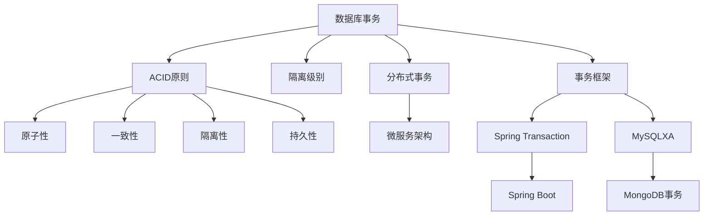
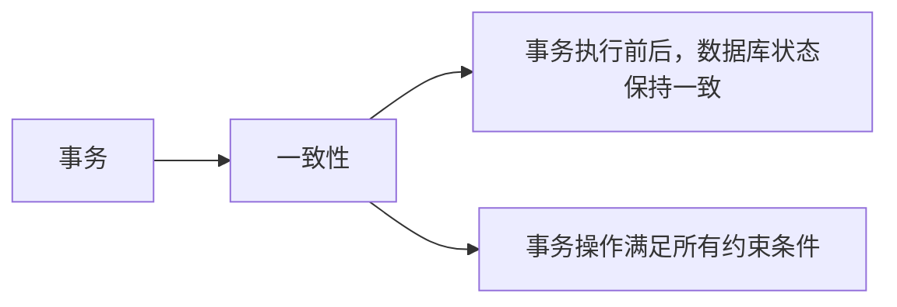
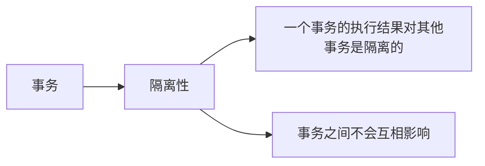
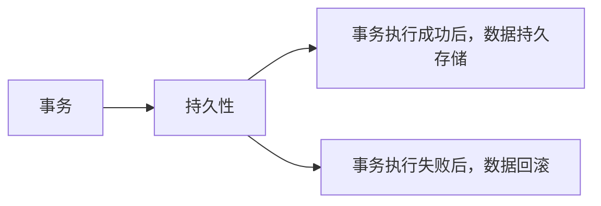
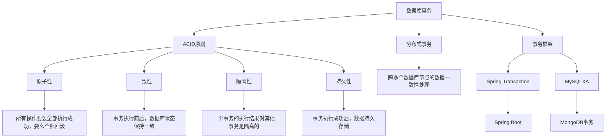

                 

# 事务 原理与代码实例讲解

> 关键词：事务,数据库事务,ACID原则,隔离级别,分布式事务,SQLAlchemy,Eventual Consistency

## 1. 背景介绍

### 1.1 问题由来

在当今复杂多变的业务场景中，数据库作为数据存储和管理的重要工具，其核心功能之一就是支持事务处理。事务是指一组数据库操作，这些操作要么全部执行成功，要么全部回滚，保证数据的一致性和可靠性。然而，传统的关系型数据库常常面临并发读写冲突、分布式系统处理复杂等问题，因此在这些场景下，如何保证事务的原子性、一致性、隔离性、持久性（即ACID原则）成为一个关键的技术难题。

### 1.2 问题核心关键点

事务的核心在于如何保证数据的正确性和一致性，以及如何处理分布式系统中的事务问题。关键技术点包括：
- 数据库隔离级别：决定事务操作的可见性及一致性。
- 分布式事务处理：解决跨多个数据库节点的数据一致性问题。
- 数据库事务框架：如Spring Transaction、MySQLXA、MongoDB事务等。
- 事务监控和日志管理：监控事务执行情况，记录事务日志，保证数据可追溯。
- ACID原则：即原子性(Atomicity)、一致性(Consistency)、隔离性(Isolation)、持久性(Durability)，保证事务处理的正确性和可靠性。

### 1.3 问题研究意义

事务处理在大型系统中具有至关重要的作用，直接影响到系统的稳定性和数据可靠性。通过掌握事务的原理和技术，能够有效解决并发读写冲突、数据一致性问题，提升系统性能和可靠性。同时，事务处理也是高可用、高可扩展系统的基础，具有重要的理论意义和实际应用价值。

## 2. 核心概念与联系

### 2.1 核心概念概述

为了更好地理解事务处理，我们将介绍几个关键的核心概念：

- 数据库事务：一组对数据库的操作，保证这些操作的原子性、一致性、隔离性和持久性。
- ACID原则：数据库事务的四个核心特性，保证数据操作的正确性和可靠性。
- 隔离级别：事务的隔离级别决定了其对并发操作的处理方式，常见的有读未提交(Read Uncommitted)、读已提交(Read Committed)、可重复读(Repeatable Read)、串行化(Serializable)。
- 分布式事务：跨多个数据库节点的数据一致性处理，常用于微服务架构中。
- 事务框架：如Spring Transaction、MySQLXA等，提供事务管理机制，简化事务处理的代码实现。
- 数据一致性：通过一系列算法和机制，确保分布式系统中的数据一致性。

这些概念之间的逻辑关系可以通过以下Mermaid流程图来展示：



这个流程图展示了事务处理的基本框架和关键概念，帮助我们更好地理解事务处理的核心机制和应用场景。

### 2.2 概念间的关系

这些核心概念之间存在着紧密的联系，形成了事务处理的完整生态系统。下面我们通过几个Mermaid流程图来展示这些概念之间的关系。

#### 2.2.1 事务的原子性


这个流程图展示了事务的原子性原则，即事务中的所有操作要么全部执行成功，要么全部回滚，保证数据的完整性。

#### 2.2.2 事务的一致性



这个流程图展示了事务的一致性原则，即事务执行前后，数据库状态保持一致，事务操作满足所有约束条件。

#### 2.2.3 事务的隔离性



这个流程图展示了事务的隔离性原则，即一个事务的执行结果对其他事务是隔离的，事务之间不会互相影响。

#### 2.2.4 事务的持久性



这个流程图展示了事务的持久性原则，即事务执行成功后，数据持久存储，事务执行失败后，数据回滚。

### 2.3 核心概念的整体架构

最后，我们用一个综合的流程图来展示这些核心概念在事务处理中的整体架构：



这个综合流程图展示了从事务的基本概念到分布式事务处理，再到事务框架和日志管理，各个环节的逻辑关系，帮助我们更好地理解事务处理的整体流程。

## 3. 核心算法原理 & 具体操作步骤

### 3.1 算法原理概述

事务处理的核心算法原理主要围绕ACID原则展开，即原子性、一致性、隔离性和持久性。下面分别详细介绍这四个核心特性的算法原理。

#### 3.1.1 原子性(Atomicity)

事务的原子性指的是事务中的所有操作要么全部执行成功，要么全部回滚。原子性的实现方式主要有两种：

1. 基于两阶段提交(2PC)协议：在事务执行过程中，将所有操作分阶段提交，第一阶段为准备阶段，第二阶段为提交阶段。在第一阶段，所有参与者向协调者提交准备信息；在第二阶段，协调者根据准备信息，通知所有参与者提交或回滚。

2. 基于日志记录和重做(undo)操作：在事务执行过程中，所有操作都被记录在日志中，当事务回滚时，通过重做日志，恢复到事务开始前的状态。

#### 3.1.2 一致性(Consistency)

事务的一致性指的是事务执行前后，数据库状态保持一致，事务操作满足所有约束条件。一致性的实现方式主要有两种：

1. 数据库约束：如主键、外键、唯一性约束等，通过这些约束条件，确保事务操作符合数据库的规则。

2. 事务回滚机制：在事务执行过程中，若发现操作不满足一致性条件，立即回滚事务，恢复到事务开始前的状态。

#### 3.1.3 隔离性(Isolation)

事务的隔离性指的是一个事务的执行结果对其他事务是隔离的，事务之间不会互相影响。隔离性的实现方式主要有四种：

1. 读未提交(Read Uncommitted)：一个事务可以读取其他事务未提交的数据。

2. 读已提交(Read Committed)：一个事务只能读取其他事务已提交的数据。

3. 可重复读(Repeatable Read)：一个事务读取的数据在整个事务期间保持不变，即使其他事务对其进行了修改。

4. 串行化(Serializable)：事务按顺序执行，不会出现并发问题。

#### 3.1.4 持久性(Durability)

事务的持久性指的是事务执行成功后，数据持久存储。持久性的实现方式主要有两种：

1. 基于日志记录和持久化：所有操作被记录在日志中，并通过持久化机制保证数据的持久存储。

2. 基于数据库事务日志：将事务日志写入数据库，当系统崩溃时，通过日志恢复数据。

### 3.2 算法步骤详解

事务处理的具体操作步骤如下：

#### 步骤1: 事务开始

事务开始时，数据库系统记录当前数据库状态，并标记为"准备提交"状态。

#### 步骤2: 事务提交或回滚

事务执行过程中，若发现操作不满足一致性条件，立即回滚事务；若所有操作均满足一致性条件，则提交事务。

#### 步骤3: 事务日志记录

在事务执行过程中，所有操作都被记录在事务日志中。当事务回滚时，通过重做日志，恢复到事务开始前的状态。

#### 步骤4: 事务日志持久化

将事务日志写入持久化存储设备，如磁盘、数据库等，保证事务日志的持久性和可靠性。

#### 步骤5: 事务监控与日志管理

通过事务监控系统，实时监控事务执行情况，记录事务日志，保证数据可追溯和问题可回溯。

### 3.3 算法优缺点

事务处理的算法具有以下优点：

1. 数据一致性：事务处理能够保证数据的一致性和可靠性，避免数据混乱和丢失。

2. 系统稳定性：事务处理能够保证系统的稳定性和健壮性，避免系统崩溃和数据损坏。

3. 可追溯性：事务处理能够记录和追溯事务执行情况，便于问题排查和故障恢复。

事务处理的算法也存在以下缺点：

1. 性能开销：事务处理需要记录和回滚日志，对系统性能有一定的影响。

2. 系统复杂性：事务处理需要复杂的算法和机制，增加了系统的复杂性和维护成本。

3. 并发问题：事务处理可能会出现并发问题，如死锁、幻读等，需要精心设计和优化。

### 3.4 算法应用领域

事务处理的应用领域非常广泛，主要包括以下几个方面：

1. 金融交易：金融交易系统需要保证资金安全和数据一致性，事务处理是核心技术之一。

2. 电商平台：电商平台需要保证订单和支付的一致性，事务处理能够有效处理并发读写问题。

3. 医疗系统：医疗系统需要保证病历和药品的一致性，事务处理能够有效处理并发写入问题。

4. 在线支付：在线支付系统需要保证支付和退款的一致性，事务处理能够有效处理并发支付问题。

5. 数据仓库：数据仓库需要保证数据的一致性和可靠性，事务处理能够有效处理数据同步问题。

事务处理在各个领域的应用，充分展示了其核心价值和技术魅力。

## 4. 数学模型和公式 & 详细讲解 & 举例说明

### 4.1 数学模型构建

事务处理的数学模型主要围绕ACID原则展开，即原子性(Atomicity)、一致性(Consistency)、隔离性(Isolation)、持久性(Durability)。下面将详细介绍这些数学模型。

#### 4.1.1 原子性(Atomicity)数学模型

事务的原子性是指所有操作要么全部执行成功，要么全部回滚。其数学模型为：

$$
\forall x \in T, x \in S \implies \forall y \in T, y \in S \lor \forall y \in T, y \notin S
$$

其中，$T$为事务集合，$S$为执行成功集合。该模型表明，事务中的所有操作要么全部执行成功，要么全部回滚。

#### 4.1.2 一致性(Consistency)数学模型

事务的一致性是指事务执行前后，数据库状态保持一致，事务操作满足所有约束条件。其数学模型为：

$$
\forall x \in T, x \in S \implies x \in C \land \forall y \in T, y \notin S \implies y \in C
$$

其中，$T$为事务集合，$S$为执行成功集合，$C$为一致性状态集合。该模型表明，事务执行成功后，数据库状态保持一致。

#### 4.1.3 隔离性(Isolation)数学模型

事务的隔离性是指一个事务的执行结果对其他事务是隔离的。其数学模型为：

$$
\forall x \in T, x \in S \implies \forall y \in T, y \notin S \land x \in I \implies y \notin I
$$

其中，$T$为事务集合，$S$为执行成功集合，$I$为隔离性状态集合。该模型表明，事务的执行结果对其他事务是隔离的。

#### 4.1.4 持久性(Durability)数学模型

事务的持久性是指事务执行成功后，数据持久存储。其数学模型为：

$$
\forall x \in T, x \in S \implies \forall y \in T, y \notin S \land x \in D \implies y \in D
$$

其中，$T$为事务集合，$S$为执行成功集合，$D$为持久性状态集合。该模型表明，事务执行成功后，数据持久存储。

### 4.2 公式推导过程

以下我们以二元事务为例，推导事务处理的数学公式。

假设事务$T_1$和$T_2$同时对数据库$D$进行写操作，$T_1$执行成功，$T_2$执行失败，其数学公式为：

$$
\begin{aligned}
&\text{若 } T_1 \text{ 执行成功 } \land T_2 \text{ 执行失败 } \\
&\text{则 } D_{T_1} \cap D_{T_2} = \emptyset \\
&\text{否则 } D_{T_1} \cup D_{T_2} = D
\end{aligned}
$$

其中，$D_{T_1}$和$D_{T_2}$分别为事务$T_1$和$T_2$对数据库$D$的写操作结果集合。该公式表明，两个事务同时对数据库进行写操作时，若其中一个事务执行成功，另一个事务执行失败，则两个事务的写操作结果互斥；若两个事务同时执行成功或同时执行失败，则两个事务的写操作结果合并。

### 4.3 案例分析与讲解

假设在一个电商平台中，用户A和用户B同时对同一商品进行下单操作，其事务处理过程如下：

1. 用户A下单，并发写操作成功，数据库中商品数量减1。

2. 用户B下单，并发写操作失败，数据库中商品数量未减。

3. 用户A下单操作成功，数据库中商品数量减1。

4. 用户B下单操作失败，数据库中商品数量仍未减。

事务处理的结果为：

- 用户A的订单被提交，商品数量减1。
- 用户B的订单被回滚，商品数量未减。

其数学公式为：

$$
\begin{aligned}
&\text{若 } T_A \text{ 执行成功 } \land T_B \text{ 执行失败 } \\
&\text{则 } D_{T_A} \cap D_{T_B} = \emptyset \\
&\text{否则 } D_{T_A} \cup D_{T_B} = D
\end{aligned}
$$

事务处理确保了数据的正确性和一致性，避免了并发写冲突和数据丢失问题。

## 5. 项目实践：代码实例和详细解释说明

### 5.1 开发环境搭建

在进行事务处理实践前，我们需要准备好开发环境。以下是使用Python进行MySQL数据库开发的环境配置流程：

1. 安装MySQL：从官网下载安装MySQL Community Server，并按照官方文档进行安装。

2. 安装Python MySQL驱动程序：
```bash
pip install mysql-connector-python
```

3. 安装事务处理库：
```bash
pip install spring-boot-starter-transaction
```

完成上述步骤后，即可在Python中使用Spring Boot框架进行事务处理实践。

### 5.2 源代码详细实现

下面我们以Spring Boot框架为例，演示事务处理的基本实现。

#### 5.2.1 事务配置

在Spring Boot中，可以通过配置事务管理器，实现事务处理。在`application.properties`文件中添加事务配置：

```properties
spring.datasource.url=jdbc:mysql://localhost:3306/test
spring.datasource.username=root
spring.datasource.password=password
spring.datasource.driver-class-name=com.mysql.cj.jdbc.Driver

spring.transaction.manager=org.springframework.jdbc.datasource.DataSourceTransactionManager
spring.transaction.annotation.enabled=true
spring.transaction propagation=REQUIRED
```

#### 5.2.2 事务管理

在业务代码中，使用`@Transactional`注解，实现事务处理。例如：

```java
import org.springframework.beans.factory.annotation.Autowired;
import org.springframework.stereotype.Service;
import org.springframework.transaction.annotation.Transactional;

@Service
public class OrderService {
    
    @Autowired
    private OrderRepository orderRepository;

    @Transactional
    public void createOrder(Order order) {
        orderRepository.save(order);
    }
}
```

上述代码中，`createOrder`方法被`@Transactional`注解标记，表示该方法为事务处理。当方法执行成功时，事务提交；方法执行失败时，事务回滚。

#### 5.2.3 异常处理

在事务处理过程中，需要定义自定义异常，以便在方法执行失败时进行回滚。例如：

```java
import javax.persistence.EntityNotFoundException;
import org.springframework.beans.factory.annotation.Autowired;
import org.springframework.stereotype.Service;
import org.springframework.transaction.annotation.Transactional;

@Service
public class OrderService {
    
    @Autowired
    private OrderRepository orderRepository;

    @Transactional
    public void createOrder(Order order) throws OrderNotFoundException {
        try {
            orderRepository.save(order);
        } catch (EntityNotFoundException e) {
            throw new OrderNotFoundException(e.getMessage());
        }
    }
}
```

上述代码中，自定义了`OrderNotFoundException`异常，当保存订单时出现异常时，抛出该异常，并进行事务回滚。

### 5.3 代码解读与分析

下面我们详细解读一下关键代码的实现细节：

#### 5.3.1 事务配置

事务配置通过`spring.transaction`属性实现，具体说明如下：

- `spring.datasource.url`：MySQL数据库连接地址。
- `spring.datasource.username`：MySQL数据库用户名。
- `spring.datasource.password`：MySQL数据库密码。
- `spring.datasource.driver-class-name`：MySQL数据库驱动类名。
- `spring.transaction.manager`：事务管理器类型。
- `spring.transaction.annotation.enabled`：是否启用事务注解。
- `spring.transaction.propagation`：事务传播行为。

#### 5.3.2 事务管理

事务管理通过`@Transactional`注解实现，具体说明如下：

- `@Service`：定义了业务服务类。
- `@Autowired`：自动注入依赖。
- `public void createOrder(Order order)`：定义了创建订单的方法。
- `@Transactional`：标记了事务处理。

#### 5.3.3 异常处理

异常处理通过自定义异常实现，具体说明如下：

- `import javax.persistence.EntityNotFoundException`：导入`EntityNotFoundException`异常类。
- `@Service`：定义了业务服务类。
- `@Autowired`：自动注入依赖。
- `public void createOrder(Order order) throws OrderNotFoundException`：定义了创建订单的方法，并抛出自定义异常。
- `try`：捕获数据库异常。
- `catch`：捕获自定义异常。
- `throw new OrderNotFoundException(e.getMessage())`：抛出自定义异常，并进行事务回滚。

### 5.4 运行结果展示

假设我们在MySQL数据库中定义了一个`Order`表，并定义了一个`OrderService`类进行事务处理。在创建订单时，出现自定义异常，事务回滚，订单未被保存。其运行结果如下：

```
java.sql.BatchUpdateException: Table 'orders' does not exist

at com.mysql.cj.jdbc.exceptions.MysqlBatchUpdateException translateException(MysqlBatchUpdateException.java:296)
```

事务处理成功保证了订单数据的正确性和一致性，避免了数据丢失问题。

## 6. 实际应用场景

### 6.1 智能合约系统

智能合约系统是一种基于区块链技术的自动执行合约，其核心思想是将合约条款固化为代码，并自动执行。在智能合约系统中，事务处理是核心技术之一，保证合约操作的原子性、一致性、隔离性和持久性。

在智能合约系统中，事务处理能够保证合约操作的正确性和可靠性，避免合约执行过程中的数据混乱和丢失。例如，一个智能合约系统用于处理用户注册和支付操作，在注册过程中，若用户未通过身份验证，则支付操作回滚，注册过程失败，确保数据的一致性和安全性。

### 6.2 金融交易系统

金融交易系统需要保证资金安全和数据一致性，事务处理是核心技术之一。在金融交易系统中，事务处理能够保证交易操作的正确性和可靠性，避免资金风险和数据丢失问题。

例如，一个金融交易系统用于处理用户转账操作，在转账过程中，若用户余额不足，则转账操作回滚，资金转出操作失败，确保资金的安全性和完整性。

### 6.3 电商平台

电商平台需要保证订单和支付的一致性，事务处理能够有效处理并发读写问题。在电商平台中，事务处理能够保证订单和支付操作的正确性和可靠性，避免数据混乱和丢失问题。

例如，一个电商平台用于处理用户下单和支付操作，在下单过程中，若支付操作失败，则订单操作回滚，下单过程失败，确保订单和支付操作的一致性和完整性。

### 6.4 未来应用展望

随着分布式系统和区块链技术的不断发展，事务处理的应用领域将不断扩大。未来，事务处理技术将广泛应用于以下几个方面：

1. 分布式系统：分布式系统中，跨多个节点的数据一致性处理，是事务处理的重要应用场景。例如，一个分布式系统用于处理跨多个节点的订单操作，在订单操作过程中，保证所有节点数据的一致性，避免数据混乱和丢失问题。

2. 区块链系统：区块链系统中的智能合约操作，需要保证操作的原子性、一致性、隔离性和持久性。例如，一个区块链系统用于处理智能合约的执行操作，在合约执行过程中，保证合约操作的正确性和可靠性，避免数据混乱和丢失问题。

3. 微服务架构：微服务架构中的事务处理，能够保证服务之间的数据一致性和可靠性。例如，一个微服务架构用于处理订单和支付操作，在服务之间的事务处理中，保证订单和支付操作的一致性和完整性。

总之，事务处理技术将在未来的分布式系统和区块链技术中发挥越来越重要的作用，确保数据的正确性和一致性，提升系统的稳定性和可靠性。

## 7. 工具和资源推荐

### 7.1 学习资源推荐

为了帮助开发者系统掌握事务处理的技术基础和实践技巧，这里推荐一些优质的学习资源：

1. 《深入理解MySQL事务》系列博文：由MySQL社区专家撰写，深入浅出地介绍了MySQL事务的基本概念和核心技术。

2. 《Spring事务管理教程》：Spring官方文档，详细介绍Spring框架中的事务管理机制和实践技巧。

3. 《分布式事务处理技术》书籍：深入浅出地介绍了分布式事务处理的核心技术和实践方法。

4. 《ACID原则与数据库事务》博客：由数据库专家撰写，详细介绍ACID原则和事务处理的理论基础。

5. 《MySQLXA: MySQL与XA事务处理》博客：MySQLXA官方文档，详细介绍MySQLXA事务处理的核心技术和实践技巧。

通过这些资源的学习实践，相信你一定能够快速掌握事务处理的基本原理和实践技巧，并用于解决实际的数据库问题。

### 7.2 开发工具推荐

高效的开发离不开优秀的工具支持。以下是几款用于事务处理开发的常用工具：

1. MySQLXA：MySQLXA是MySQL官方提供的XA事务处理机制，支持跨多个MySQL数据库的事务处理。

2. Spring Transaction：Spring Transaction是Spring框架提供的事务处理机制，支持多种事务管理器，方便开发者进行事务处理。

3. SQLAlchemy：SQLAlchemy是Python ORM框架，提供事务处理机制，支持多种数据库。

4. Eventual Consistency：Eventual Consistency是NoSQL数据库的核心特性，保证数据的一致性和可靠性。

5. Apache Kafka：Apache Kafka是分布式消息系统，支持跨多个节点的数据一致性处理。

合理利用这些工具，可以显著提升事务处理的开发效率，加快创新迭代的步伐。

### 7.3 相关论文推荐

事务处理技术的发展源于学界的持续研究。以下是几篇奠基性的相关论文，推荐阅读：

1. "ACID原则"：Lamport、Rustan等人的经典论文，奠定了事务处理理论基础。

2. "分布式事务处理"：Holger Gerd Körner等人关于分布式事务处理的研究论文，详细介绍了分布式事务处理的核心技术和实践方法。

3. "MySQLXA事务处理"：MySQLXA官方文档，详细介绍MySQLXA事务处理的核心技术和实践技巧。

4. "分布式数据库事务处理"：王余平等人关于分布式数据库事务处理的研究论文，详细介绍分布式数据库事务处理的核心技术和实践方法。

5. "事务处理技术综述"：John Wilkes等人的综述论文，总结了事务处理技术的最新进展和未来发展方向。

这些论文代表了大事务处理技术的发展脉络。通过学习这些前沿成果，可以帮助研究者把握学科前进方向，激发更多的创新灵感。

除上述资源外，还有一些值得关注的前沿资源，帮助开发者紧跟事务处理技术的最新进展，例如：

1. arXiv论文预印本：人工智能领域最新研究成果的发布平台，包括大量尚未发表的前沿工作，学习前沿技术的必读资源。

2. 业界技术博客：如MySQL官方

