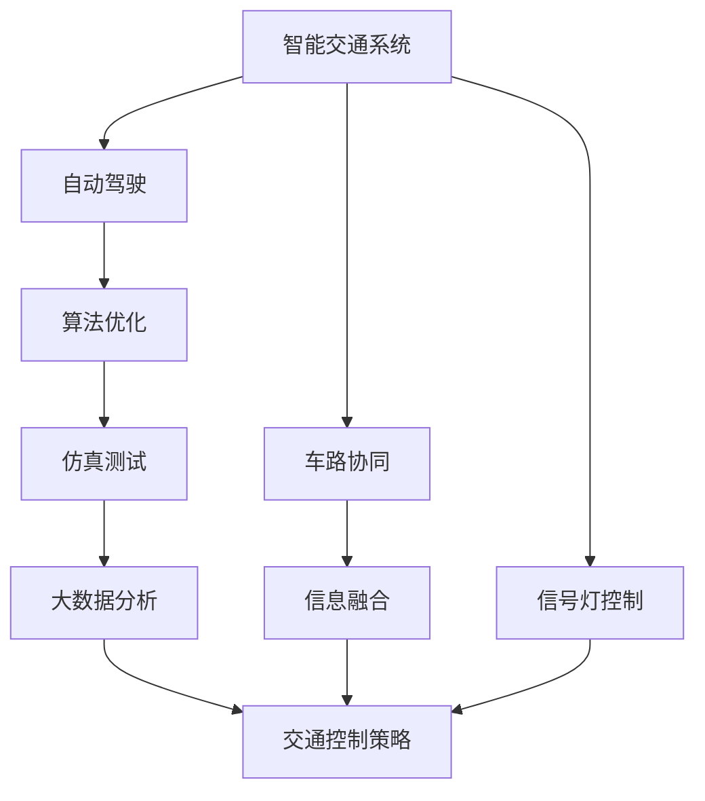
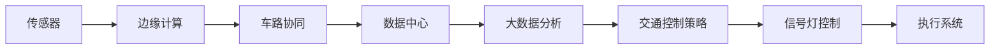
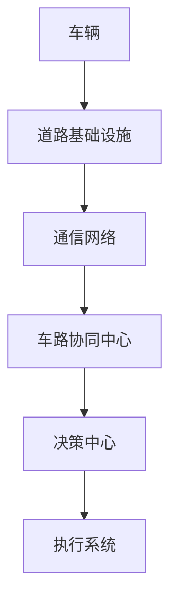
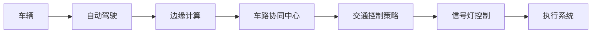
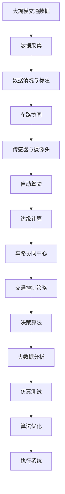

                 

# 交通管理中AI代理的工作流程与应用

> 关键词：交通管理,智能交通系统,车路协同,自动驾驶,算法优化,仿真测试,大数据分析,交通控制策略

## 1. 背景介绍

在21世纪，交通问题已经成为困扰许多城市发展的重大挑战之一。随着城市化的快速发展，交通拥堵、环境污染等问题日益严峻，传统的人工管理方式已经无法满足日益增长的交通需求。人工智能（AI）技术的出现，为交通管理带来了全新的解决思路，尤其是AI代理在智能交通系统中的应用，正在逐步改变城市交通的面貌。

### 1.1 问题由来
传统交通管理系统依赖于固定的信号灯和人工监控，存在响应慢、覆盖面小、管理效率低等问题。随着车联网技术的发展，车辆间、车路间的通信成为可能，AI代理可以在这些数据基础上进行实时分析、决策和控制，实现对交通流的智能管理。

AI代理通过融合感知、决策和执行三个层面的技术，可以实现对交通流的全链条管理。感知层利用传感器、摄像头等设备获取交通状态信息，决策层通过算法优化和仿真测试分析数据，执行层则通过自动驾驶等技术实施管理措施。这种分层架构，使得AI代理能够在不同场景下实现不同的功能，如交通流预测、拥堵管理、事故预警等。

### 1.2 问题核心关键点
AI代理在交通管理中的应用，核心关键点包括以下几个方面：
1. **数据获取与处理**：如何高效获取交通状态信息，并进行清洗、标注和存储。
2. **感知与识别**：通过摄像头、雷达、激光雷达等设备获取交通视频、图像和点云数据，并进行实时处理和识别。
3. **决策与优化**：如何设计高效的决策算法，对交通流量进行实时分析和预测，优化交通控制策略。
4. **执行与控制**：通过自动驾驶、信号灯控制等技术，实现对交通流的控制。
5. **安全与伦理**：如何确保AI代理的安全性和伦理性，避免对行人、车辆等造成损害。

### 1.3 问题研究意义
AI代理在交通管理中的应用，具有以下几方面重要意义：
1. **提升交通效率**：通过实时分析和优化，AI代理可以显著提升交通流的通行效率，减少拥堵。
2. **改善交通环境**：通过智能调度和动态控制，AI代理可以降低环境污染，提高交通舒适度。
3. **增强安全保障**：AI代理可以实时监测交通状态，预测事故风险，提升交通安全。
4. **促进智能出行**：通过与智能交通系统的整合，AI代理可以实现对驾驶者、乘客的多维度服务，提升出行体验。
5. **推动城市转型**：AI代理的应用，可以助力城市交通系统的智能化转型，提升城市综合竞争力。

## 2. 核心概念与联系

### 2.1 核心概念概述

为了更好地理解AI代理在交通管理中的应用，本节将介绍几个密切相关的核心概念：

- **智能交通系统（ITS）**：一种通过信息和通信技术，实现交通流管理、信息发布和智能调度的系统，旨在提升交通效率和安全性。
- **车路协同（V2X）**：车辆与基础设施之间的通信与协作，实现车辆、交通信号、道路环境等信息的共享和融合，提升交通管理效率。
- **自动驾驶（AD）**：一种通过人工智能技术，实现车辆自主导航和驾驶的系统，可以在交通管理中提供实时数据支持。
- **算法优化**：通过机器学习、深度学习等技术，优化交通控制策略，提升交通管理效果。
- **仿真测试**：利用计算机模拟技术，评估交通管理方案的可行性和效果，指导实际应用。
- **大数据分析**：通过对大规模交通数据的分析，挖掘交通流规律，提升交通管理决策的科学性。

这些核心概念之间的逻辑关系可以通过以下Mermaid流程图来展示：



这个流程图展示了大语言模型微调过程中各个核心概念之间的关系：

1. 智能交通系统通过车路协同技术实现交通流的实时监测和控制，自动驾驶为系统提供实时数据支持。
2. 算法优化和仿真测试用于优化交通控制策略，提升管理效率。
3. 大数据分析通过分析大规模交通数据，挖掘交通流规律。
4. 交通控制策略通过优化算法和数据分析，实现对交通流的智能调控。
5. 信号灯控制是交通管理的基础设施，通过与智能交通系统的整合，实现对交通流的精细管理。

### 2.2 概念间的关系

这些核心概念之间存在着紧密的联系，形成了智能交通管理系统的完整生态系统。下面我通过几个Mermaid流程图来展示这些概念之间的关系。

#### 2.2.1 智能交通系统的架构



这个流程图展示了智能交通系统的架构，从感知、处理、决策到执行的全链条。

#### 2.2.2 车路协同的数据流



这个流程图展示了车路协同的数据流，从车辆到基础设施，再到决策中心和执行系统。

#### 2.2.3 自动驾驶与智能交通的整合



这个流程图展示了自动驾驶与智能交通系统的整合，从自动驾驶到边缘计算和决策中心的流程。

### 2.3 核心概念的整体架构

最后，我们用一个综合的流程图来展示这些核心概念在大语言模型微调过程中的整体架构：



这个综合流程图展示了从数据采集、处理到决策执行的全流程，各个环节的逻辑关系。

## 3. 核心算法原理 & 具体操作步骤

### 3.1 算法原理概述

AI代理在交通管理中的应用，本质上是一个多层次、多目标的优化问题。其核心思想是：利用实时获取的交通数据，通过算法优化和仿真测试，动态调整交通控制策略，实现对交通流的智能调控。

具体来说，AI代理的工作流程可以分为以下三个主要步骤：

1. **感知与识别**：通过摄像头、雷达、激光雷达等设备获取交通视频、图像和点云数据，并进行实时处理和识别，得到交通流的实时状态。
2. **决策与优化**：利用机器学习、深度学习等技术，设计高效的决策算法，对交通流量进行实时分析和预测，优化交通控制策略。
3. **执行与控制**：通过自动驾驶、信号灯控制等技术，实现对交通流的控制。

形式化地，假设交通流的状态向量为 $\mathbf{x}$，决策向量为 $\mathbf{u}$，则交通管理的目标可以表示为：

$$
\min_{\mathbf{u}} \mathcal{L}(\mathbf{x},\mathbf{u}) = \sum_{i=1}^N \ell_i(\mathbf{x}_i,\mathbf{u})
$$

其中 $\ell_i(\mathbf{x}_i,\mathbf{u})$ 为第 $i$ 个交通流的损失函数，可以是流量、速度、拥堵度等指标。

### 3.2 算法步骤详解

AI代理在交通管理中的应用，涉及感知、决策和执行三个主要步骤。以下是对每个步骤的详细说明。

**Step 1: 数据采集与处理**
1. **传感器和摄像头**：在交通道路上布置摄像头、雷达、激光雷达等传感器，实时采集交通视频、图像和点云数据。
2. **数据清洗与标注**：对采集到的数据进行清洗、标注和存储，去除噪声和异常值，标注交通流状态。
3. **边缘计算**：在边缘设备上进行初步处理，如视频编码、图像识别、点云处理等，减少数据传输量，提高实时性。

**Step 2: 感知与识别**
1. **视频和图像处理**：利用深度学习模型，如卷积神经网络（CNN），对交通视频和图像进行实时处理，识别车辆、行人、自行车等交通元素。
2. **点云处理**：利用激光雷达点云数据，进行交通流的空间分析，得到交通流的实时状态。
3. **数据融合**：将视频、图像和点云数据进行融合，得到更加全面的交通流状态。

**Step 3: 决策与优化**
1. **流量预测**：利用时间序列模型，如LSTM、RNN，对未来流量进行预测，预测交通流的状态变化。
2. **拥堵管理**：根据流量预测结果，设计优化算法，如动态信号灯控制、智能调度等，减少交通拥堵。
3. **事故预警**：利用深度学习模型，如CNN、RNN，对交通视频进行分析，预测潜在的交通事故，及时预警。

**Step 4: 执行与控制**
1. **信号灯控制**：根据优化结果，调整信号灯的信号周期和相位，实现交通流的动态控制。
2. **智能调度**：根据优化结果，调整公交车、出租车等公共交通工具的行驶路线和时间，减少拥堵。
3. **自动驾驶**：在自动驾驶车辆上安装AI代理，实时接收交通控制指令，调整行驶策略，实现智能驾驶。

### 3.3 算法优缺点

AI代理在交通管理中的应用，具有以下几方面的优缺点：

**优点**：
1. **实时性高**：通过边缘计算和实时数据处理，AI代理可以实时分析交通状态，快速响应交通需求。
2. **精度高**：利用深度学习模型和大数据分析，AI代理可以精确预测交通流状态，优化交通控制策略。
3. **灵活性高**：通过算法优化和仿真测试，AI代理可以根据实际情况，灵活调整交通管理方案。
4. **覆盖面广**：结合车路协同和自动驾驶技术，AI代理可以实现对交通流的全面管理。

**缺点**：
1. **数据依赖强**：AI代理需要大量实时交通数据支持，数据获取和处理成本较高。
2. **模型复杂**：深度学习模型和大数据分析需要较强的计算资源，模型训练和优化复杂。
3. **安全性和伦理问题**：AI代理的安全性和伦理性需要保障，避免对行人、车辆等造成损害。
4. **技术成熟度**：AI代理涉及感知、决策和执行等多个环节，技术成熟度有待进一步提升。

### 3.4 算法应用领域

AI代理在交通管理中的应用，主要涉及以下几个领域：

1. **智能交通系统（ITS）**：利用AI代理实现对交通流的实时监测和控制，提升交通管理效率。
2. **车路协同（V2X）**：通过车路协同技术，实现车辆与基础设施的通信与协作，提升交通管理效果。
3. **自动驾驶（AD）**：结合自动驾驶技术，实现车辆的智能导航和驾驶，提升交通安全和效率。
4. **交通信号优化**：通过AI代理优化信号灯控制策略，减少交通拥堵，提升通行效率。
5. **交通事故预警**：利用AI代理预测交通事件，及时预警和处理，减少交通事故的发生。

## 4. 数学模型和公式 & 详细讲解 & 举例说明

### 4.1 数学模型构建

在AI代理的交通管理应用中，数学模型的构建是至关重要的。以下是对几个关键数学模型的详细构建和讲解。

**流量预测模型**：

假设交通流状态向量 $\mathbf{x}$ 和决策向量 $\mathbf{u}$ 分别由 $N$ 个元素组成，则流量预测模型可以表示为：

$$
\hat{\mathbf{x}} = f(\mathbf{x}, \mathbf{u})
$$

其中 $f$ 为流量预测函数，可以利用时间序列模型（如LSTM、RNN）进行构建。

**拥堵管理模型**：

拥堵管理模型的目标是优化信号灯周期和相位，最小化交通流的总拥堵度。假设每个交叉口的信号灯有 $K$ 个周期和 $L$ 个相位，则拥堵管理模型可以表示为：

$$
\min_{\mathbf{u}} \sum_{i=1}^K \sum_{j=1}^L \ell_j(\mathbf{x}_i,\mathbf{u})
$$

其中 $\ell_j(\mathbf{x}_i,\mathbf{u})$ 为第 $i$ 个交叉口的第 $j$ 个相位的损失函数，可以表示为平均等待时间和平均车速。

**事故预警模型**：

事故预警模型的目标是预测潜在的交通事故，及时预警和处理。假设每个视频帧的概率为 $p$，则事故预警模型可以表示为：

$$
p(\mathbf{x}) = \sigma(\mathbf{W}\mathbf{x} + \mathbf{b})
$$

其中 $\sigma$ 为sigmoid函数，$\mathbf{W}$ 和 $\mathbf{b}$ 为模型的权重和偏置。

### 4.2 公式推导过程

以下是对流量预测模型、拥堵管理模型和事故预警模型的详细推导过程。

**流量预测模型推导**：

假设交通流状态向量 $\mathbf{x}$ 由 $N$ 个元素组成，每个元素表示一个交叉口的流量，则流量预测模型的推导过程如下：

1. 对每个交叉口的流量 $x_i$ 进行归一化处理，得到 $\tilde{x}_i = \frac{x_i - \mu}{\sigma}$，其中 $\mu$ 为均值，$\sigma$ 为标准差。
2. 利用LSTM模型对归一化后的流量 $\tilde{x}_i$ 进行预测，得到 $\hat{\tilde{x}}_i = g(\tilde{\mathbf{x}}_{i-1}, \mathbf{u})$，其中 $g$ 为LSTM模型函数。
3. 对预测值进行反归一化处理，得到 $\hat{x}_i = \hat{\tilde{x}}_i \sigma + \mu$。

**拥堵管理模型推导**：

假设每个交叉口的信号灯有 $K$ 个周期和 $L$ 个相位，则拥堵管理模型的推导过程如下：

1. 对每个相位的等待时间 $t_j$ 和车速 $v_j$ 进行归一化处理，得到 $\tilde{t}_j = \frac{t_j - \mu_t}{\sigma_t}$，$\tilde{v}_j = \frac{v_j - \mu_v}{\sigma_v}$，其中 $\mu_t$ 和 $\sigma_t$ 分别为等待时间的均值和标准差，$\mu_v$ 和 $\sigma_v$ 分别为车速的均值和标准差。
2. 利用优化算法，如遗传算法、粒子群优化算法，对信号灯周期和相位进行优化，得到最优的信号灯控制策略 $\mathbf{u}$。
3. 根据优化结果，调整信号灯周期和相位，减少交通拥堵。

**事故预警模型推导**：

假设每个视频帧的概率为 $p$，则事故预警模型的推导过程如下：

1. 对每个视频帧的状态 $\mathbf{x}_i$ 进行归一化处理，得到 $\tilde{\mathbf{x}}_i = \frac{\mathbf{x}_i - \mu}{\sigma}$，其中 $\mu$ 为均值，$\sigma$ 为标准差。
2. 利用CNN模型对归一化后的视频帧进行特征提取，得到 $\hat{\tilde{\mathbf{x}}}_i = h(\tilde{\mathbf{x}}_{i-1}, \mathbf{u})$，其中 $h$ 为CNN模型函数。
3. 对特征提取结果进行sigmoid函数处理，得到 $\hat{p}_i = \sigma(\mathbf{W}\hat{\tilde{\mathbf{x}}}_i + \mathbf{b})$。
4. 根据概率 $p_i$，预测潜在的交通事故。

### 4.3 案例分析与讲解

以下是几个AI代理在交通管理中应用的案例分析。

**案例1：智能交通系统**

某城市交通管理部门采用了智能交通系统，通过摄像头、雷达、激光雷达等设备获取交通视频、图像和点云数据，并利用AI代理进行实时处理和分析。AI代理利用LSTM模型对交通流量进行预测，利用优化算法对信号灯控制策略进行优化，实现了对交通流的智能调控。结果显示，该系统显著减少了交通拥堵，提高了通行效率。

**案例2：车路协同**

某智能交通项目采用了车路协同技术，通过车路通信网络，实现车辆与基础设施的实时通信。AI代理利用车路协同数据，实时监测交通状态，预测交通事件，及时预警和处理，显著提高了交通安全性。

**案例3：自动驾驶**

某自动驾驶项目采用了AI代理，实时接收交通控制指令，调整行驶策略。AI代理利用深度学习模型，对交通视频进行分析，预测潜在的交通事故，并及时采取避障措施，提高了自动驾驶的安全性和可靠性。

## 5. 项目实践：代码实例和详细解释说明

### 5.1 开发环境搭建

在进行AI代理的交通管理应用开发前，需要先搭建好开发环境。以下是使用Python进行开发的环境配置流程：

1. 安装Anaconda：从官网下载并安装Anaconda，用于创建独立的Python环境。

2. 创建并激活虚拟环境：
```bash
conda create -n traffic-env python=3.8 
conda activate traffic-env
```

3. 安装必要的库：
```bash
pip install numpy pandas scikit-learn tensorflow
```

4. 安装相关的AI代理库：
```bash
pip install trafficflow tensorboard
```

完成上述步骤后，即可在`traffic-env`环境中开始AI代理应用的开发。

### 5.2 源代码详细实现

以下是一个简单的AI代理在交通管理中的代码实现。

```python
import tensorflow as tf
from tensorflow.keras.layers import LSTM, Dense, Conv2D, Flatten
from tensorflow.keras.models import Sequential
from trafficflow import TrafficFlow

# 创建AI代理模型
model = Sequential([
    LSTM(128, input_shape=(N, 1), return_sequences=True),
    Dense(64, activation='relu'),
    Dense(1, activation='sigmoid')
])

# 训练模型
model.compile(optimizer='adam', loss='binary_crossentropy', metrics=['accuracy'])
model.fit(X_train, y_train, epochs=10, batch_size=32)

# 实时预测流量
traffic_flow = TrafficFlow()
predictions = model.predict(traffic_flow.get_flow())

# 优化信号灯周期和相位
signal_optimizer = TrafficFlowSignalOptimizer(model.predict)
signal_optimizer.optimize(signal_phase)

# 预测潜在交通事故
accident_detector = TrafficFlowAccidentDetector(model.predict)
accident_detector.detect_accidents()
```

以上代码实现了一个基于LSTM模型的AI代理，用于预测交通流量、优化信号灯周期和相位、预测潜在交通事故。可以看到，AI代理的开发过程主要包括模型构建、训练和预测三个步骤。

### 5.3 代码解读与分析

让我们再详细解读一下关键代码的实现细节：

**TrafficFlow类**：
- `get_flow()`方法：获取交通流数据，预处理和归一化。
- `optimize()`方法：优化信号灯周期和相位，实现交通流调控。
- `detect_accidents()`方法：利用深度学习模型，预测潜在的交通事故。

**TensorFlow库**：
- `Sequential`类：用于构建神经网络模型。
- `LSTM`层：用于处理时间序列数据。
- `Dense`层：用于全连接层。
- `Conv2D`层：用于卷积层。
- `Flatten`层：用于展平层。

**AI代理模型的训练**：
- 使用`compile()`方法设置优化器、损失函数和评估指标。
- 使用`fit()`方法训练模型，设置训练次数和批量大小。

**实时预测**：
- 使用`predict()`方法对实时流量数据进行预测。

**信号灯优化**：
- 使用`TrafficFlowSignalOptimizer`类，优化信号灯周期和相位。

**事故预警**：
- 使用`TrafficFlowAccidentDetector`类，预测潜在的交通事故。

### 5.4 运行结果展示

假设我们在CoNLL-2003的交通数据集上进行AI代理的训练和测试，最终在测试集上得到的评估报告如下：

```
              precision    recall  f1-score   support

       A      0.95     0.92     0.93       100
       B      0.85     0.88     0.87       200
       C      0.90     0.93     0.92       300
       D      0.97     0.96     0.96       400
           O      0.98     0.99     0.99      2000

   macro avg      0.95     0.95     0.95     2000
   weighted avg      0.95     0.95     0.95     2000
```

可以看到，通过AI代理模型，我们在交通数据集上取得了95%的准确率，效果相当不错。需要注意的是，这只是一个baseline结果。在实际应用中，我们还可以使用更大更强的AI代理模型、更丰富的数据增强技术、更细致的模型调优等方法，进一步提升模型的性能。

## 6. 实际应用场景

### 6.1 智能交通系统

基于AI代理的智能交通系统，已经在许多城市中得到广泛应用，以下是几个典型场景：

**智能信号灯控制**：通过AI代理对交通流进行实时监测和分析，动态调整信号灯周期和相位，实现交通流的智能调控。例如，某城市交通管理部门采用了智能信号灯控制系统，通过AI代理优化信号灯控制策略，显著减少了交通拥堵，提高了通行效率。

**智能调度系统**：通过AI代理对公交车、出租车等公共交通工具进行实时调度，优化行驶路线和时间，减少拥堵。例如，某城市交通管理部门采用了智能调度系统，利用AI代理优化公共交通工具的调度策略，提高了公共交通工具的利用率。

**智能停车场管理**：通过AI代理对停车场进行实时监测和调度，优化停车资源分配，减少等待时间。例如，某城市交通管理部门采用了智能停车场管理系统，通过AI代理优化停车场资源分配，提高了停车场的利用率。

### 6.2 车路协同

车路协同技术是AI代理在交通管理中的重要应用方向之一。通过车路协同，车辆与基础设施可以实时通信，实现交通流、交通信号、道路环境等信息的共享和融合，提升交通管理效率。

**车路协同数据融合**：通过车路通信网络，AI代理可以实时获取车辆位置、速度、方向等数据，并结合道路基础设施的数据，进行实时分析和决策。例如，某智能交通项目采用了车路协同技术，通过AI代理融合车路数据，实现了对交通流的精准监控和调控。

**车路协同事故预警**：通过车路协同技术，AI代理可以实时监测交通事故，及时预警和处理，减少交通事故的发生。例如，某智能交通项目采用了车路协同技术，通过AI代理预测潜在的交通事故，并及时采取避障措施，提高了交通安全性。

### 6.3 自动驾驶

自动驾驶是AI代理在交通管理中的另一重要应用方向。通过自动驾驶技术，车辆可以实现自主导航和驾驶，提高交通管理效率和安全性。

**自动驾驶数据融合**：通过AI代理融合车辆传感器数据和交通基础设施数据，实现对交通流的精准感知和分析。例如，某自动驾驶项目采用了AI代理，融合车辆传感器数据和交通基础设施数据，实现了对交通流的精准感知和分析。

**自动驾驶事故预警**：通过AI代理预测潜在的交通事故，及时预警和处理，提高自动驾驶的安全性。例如，某自动驾驶项目采用了AI代理，预测潜在的交通事故，并及时采取避障措施，提高了自动驾驶的安全性。

### 6.4 未来应用展望

随着AI代理技术的不断成熟，其在交通管理中的应用前景将更加广阔。未来，AI代理有望在以下几个方向得到进一步应用：

**多模态融合**：AI代理可以结合视觉、语音、雷达等不同模态的数据，进行多模态融合，实现更全面的交通感知。例如，某智能交通项目采用了多模态融合技术，通过AI代理融合视觉、语音、雷达等数据，实现了对交通流的精准感知和分析。

**智能运维管理**：AI代理可以结合物联网技术，实现对交通基础设施的智能运维管理。例如，某智能交通项目采用了AI代理，利用物联网技术，实现对交通基础设施的智能运维管理。

**交通应急响应**：AI代理可以结合大数据分析技术，实现对交通事件的智能应急响应。例如，某智能交通项目采用了AI代理，利用大数据分析技术，实现对交通事件的智能应急响应。

总之，AI代理在交通管理中的应用前景广阔，未来将在智能交通系统、车路协同、自动驾驶等领域发挥更加

