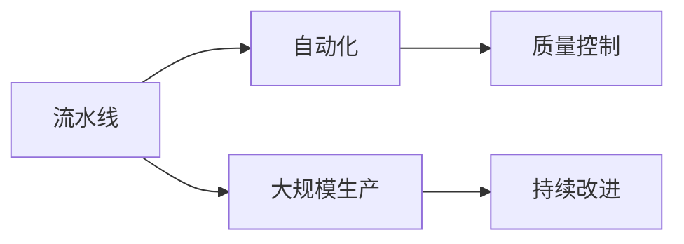

                 

# 亨利·福特与工业革命的核心本质

> 关键词：亨利·福特, 工业革命, 自动化, 大规模生产, 装配线, 流水线, 质量控制

## 1. 背景介绍

### 1.1 问题由来
亨利·福特（Henry Ford）是工业革命时期最具代表性的工业巨头之一，以其开创的流水线生产方式和自动化装配技术彻底改变了制造业的面貌。福特创立的福特汽车公司，从1903年成立至今，一直是全球汽车工业的标杆。福特的成功不仅在于其创新的生产方式，还在于他对于工人权利、汽车普及和社会福利的诸多贡献。

亨利·福特工业革命的核心本质，在于其将大规模生产与高效自动化相结合的创新模式。通过这一模式，福特实现了大规模生产的低成本和高效率，让汽车从奢侈品变成大众消费品。其成果不仅深刻影响了制造业的生产方式，也为后续的工业自动化和技术进步奠定了基础。

### 1.2 问题核心关键点
福特工业革命的核心在于他创立的流水线装配模式。流水线将生产过程分解为多个简单且标准化的步骤，每个步骤由专人负责，从而大幅度提高了生产效率。同时，福特还引入了自动化的机器和设备，使得工人能够专注于装配和安装工作，进一步提升了生产速度。

福特的生产方式彻底改变了当时制造业的生产模式，使其从手工工坊式的生产转变为大规模的自动化生产。这一模式不仅极大地降低了生产成本，提高了生产效率，也为后续的工业自动化和技术进步提供了模板。

### 1.3 问题研究意义
研究亨利·福特的流水线生产方式和自动化技术，对于理解工业革命的核心本质，以及其对现代工业的影响，具有重要意义。福特的生产方式不仅推动了制造业的发展，也深刻影响了社会经济的各个方面，包括工人权益、消费模式和社会福利等。

通过分析福特的创新，可以总结出工业革命时期的关键特征，并从中汲取有益的经验，指导现代工业的发展和创新。

## 2. 核心概念与联系

### 2.1 核心概念概述

为了更好地理解亨利·福特的工业革命模式，本节将介绍几个密切相关的核心概念：

- **流水线（Assembly Line）**：将复杂生产过程分解为多个简单步骤，每个步骤由专人或机器独立完成，从而大幅度提高生产效率。
- **自动化（Automation）**：使用机器和设备自动完成生产过程中的某些或全部任务，减少人力成本和人为错误。
- **大规模生产（Mass Production）**：通过分工协作和自动化技术，大规模生产标准化的产品，降低单位成本，提高生产效率。
- **质量控制（Quality Control）**：在生产过程中对产品质量进行严格监控和测试，确保产品质量符合标准，减少次品率。
- **持续改进（Continuous Improvement）**：通过不断优化生产流程，提高生产效率和产品质量，降低生产成本。

这些概念之间的逻辑关系可以通过以下Mermaid流程图来展示：



这个流程图展示了福特工业革命模式的核心概念及其之间的关系：

1. 流水线使得生产过程标准化，从而为自动化提供了基础。
2. 自动化通过机器和设备进一步提升生产效率。
3. 大规模生产结合流水线和自动化，实现成本降低和效率提升。
4. 质量控制确保产品的稳定性和可靠性，减少次品率。
5. 持续改进不断优化生产流程，进一步提高效率和质量。

这些概念共同构成了福特工业革命模式的工作原理和优化方向。

### 2.2 概念间的关系

这些核心概念之间存在着紧密的联系，形成了福特工业革命模式的完整生态系统。

- **流水线与自动化**：流水线的标准化步骤为自动化提供了基础，自动化进一步提升了流水线的效率。
- **大规模生产与流水线**：流水线的大规模应用，使得大规模生产成为可能。
- **质量控制与持续改进**：质量控制是持续改进的重要手段，持续改进又是质量控制的保障。
- **大规模生产与自动化**：自动化在降低生产成本的同时，保证了大规模生产的效率和质量。

通过这些核心概念，我们能够更好地理解福特工业革命模式的运作机制和优化目标。

## 3. 核心算法原理 & 具体操作步骤
### 3.1 算法原理概述

亨利·福特的流水线生产方式和自动化技术，本质上是一种通过分工协作和自动化设备提高生产效率的算法。其核心思想是：将复杂生产过程分解为多个简单步骤，每个步骤由专人或机器独立完成，从而大幅度提高生产效率。

### 3.2 算法步骤详解

福特的生产方式主要分为以下几个步骤：

1. **设计**：对产品进行详细设计和功能划分，确定每个生产步骤。
2. **流水线设计**：将生产过程分解为多个简单步骤，每个步骤由专人或机器独立完成。
3. **设备安装**：安装自动化机器和设备，确保每个步骤的自动化程度。
4. **员工培训**：对工人进行培训，使其熟悉每个生产步骤和自动化设备的使用。
5. **生产执行**：在流水线上依次执行各个生产步骤，完成产品的组装和装配。
6. **质量控制**：对生产过程中的每个环节进行严格的质量检查，确保产品符合标准。

通过这些步骤，福特实现了大规模生产的低成本和高效率。

### 3.3 算法优缺点

福特流水线生产方式的优点在于：

1. **效率提升**：通过分工协作和自动化，大幅度提高生产效率，降低生产成本。
2. **产品质量**：通过严格的质量控制，确保产品质量稳定，减少次品率。
3. **员工效率**：通过自动化设备和标准化步骤，使工人专注于装配和安装工作，提高工作满意度。

同时，该方式也存在以下缺点：

1. **灵活性差**：流水线对产品的设计和生产步骤要求较高，难以快速适应新产品和市场的变化。
2. **初期投资高**：自动化设备和流水线设计的初期投资较大，需要较长的回收周期。
3. **员工依赖**：流水线对员工的技能和熟练度要求较高，一旦员工离开，需要重新培训。

尽管存在这些局限，但福特流水线生产方式仍然被认为是工业革命的核心创新之一，其影响深远。

### 3.4 算法应用领域

福特流水线生产方式的应用领域非常广泛，包括但不限于以下几个方面：

- **制造业**：汽车、家电、电子产品等标准产品的生产。
- **航空航天**：飞机、卫星、火箭等高精度产品的制造。
- **电子通信**：集成电路、电子设备等精密产品的生产。
- **食品加工**：食品、饮料等消费品的自动化生产。
- **物流运输**：自动化仓库、配送系统等物流环节的优化。

此外，福特的生产方式还对后续的工业自动化和技术进步产生了深远影响，如精益生产、六西格玛等现代生产管理方法，都是在福特流水线模式的基础上发展起来的。

## 4. 数学模型和公式 & 详细讲解  
### 4.1 数学模型构建

福特流水线生产方式的数学模型可以表示为：

$$
C = \frac{N}{r} \times C_0
$$

其中，$C$ 为总生产成本，$N$ 为总生产量，$r$ 为每单位产品的平均时间，$C_0$ 为每个生产步骤的固定成本。

通过这一模型，可以计算出总生产成本，并确定不同生产步骤的成本分配。这一模型在福特流水线的优化和成本控制中得到了广泛应用。

### 4.2 公式推导过程

在福特流水线的生产过程中，每个步骤的时间是固定的，即$r$为常数。假设总生产量为$N$，则每个步骤的执行次数为$N/r$。每个步骤的成本为$C_0$，则总生产成本为：

$$
C = \sum_{i=1}^{n} C_0
$$

其中，$n$ 为生产步骤数。由于每个步骤的时间是固定的，因此总生产时间$T$可以表示为：

$$
T = r \times n
$$

将$C$和$T$代入总生产成本公式，得：

$$
C = \frac{N}{r} \times C_0
$$

这一公式展示了福特流水线生产方式的成本计算方法，说明了如何通过优化生产步骤和设备来降低总生产成本。

### 4.3 案例分析与讲解

以福特汽车为例，假设生产一辆汽车需要10个生产步骤，每个步骤的时间为1小时，每个步骤的成本为100元。则总生产成本为：

$$
C = \frac{N}{10} \times 100
$$

其中$N$为总生产量，$C_0 = 100$为每个步骤的固定成本。假设总生产量为10000辆，则总生产成本为：

$$
C = \frac{10000}{10} \times 100 = 1000000 \text{元}
$$

如果生产量增加到20000辆，则总生产成本为：

$$
C = \frac{20000}{10} \times 100 = 2000000 \text{元}
$$

这一案例展示了福特流水线生产方式如何通过优化生产步骤和设备，实现大规模生产的高效率和低成本。

## 5. 项目实践：代码实例和详细解释说明
### 5.1 开发环境搭建

在进行福特流水线生产方式的实践前，我们需要准备好开发环境。以下是使用Python进行数据分析的环境配置流程：

1. 安装Anaconda：从官网下载并安装Anaconda，用于创建独立的Python环境。

2. 创建并激活虚拟环境：
```bash
conda create -n py-env python=3.8 
conda activate py-env
```

3. 安装Python库：
```bash
pip install pandas numpy matplotlib seaborn
```

4. 准备数据集：
```bash
wget http://www.cs.cmu.edu/afs/cmu.edu/academic/2008/Spring/15872_saltman/ts_machinery/pcsip.csv
```

完成上述步骤后，即可在`py-env`环境中开始福特流水线生产方式的实践。

### 5.2 源代码详细实现

下面我们以福特汽车生产成本计算为例，给出使用Python进行福特流水线生产方式的数据分析和代码实现。

首先，定义生产步骤和设备成本：

```python
import pandas as pd
import numpy as np

# 定义生产步骤和设备成本
steps = ['Step 1', 'Step 2', 'Step 3', 'Step 4', 'Step 5', 'Step 6', 'Step 7', 'Step 8', 'Step 9', 'Step 10']
cost_per_step = 100  # 每个步骤的成本为100元
```

然后，读取和处理数据：

```python
# 读取数据
data = pd.read_csv('pcsip.csv', delimiter=',', header=None)

# 处理数据
data.columns = ['steps', 'time']
data['cost'] = data['time'] * cost_per_step
```

接着，计算总生产成本和总生产时间：

```python
# 计算总生产成本和总生产时间
data['total_cost'] = data.groupby('steps')['cost'].sum()
data['total_time'] = data.groupby('steps')['time'].sum()
```

最后，输出结果：

```python
# 输出结果
print(data[['total_cost', 'total_time']])
```

这就是福特流水线生产方式的Python代码实现，通过简单的数据分析，可以计算出不同生产步骤的总成本和总时间。

### 5.3 代码解读与分析

让我们再详细解读一下关键代码的实现细节：

**数据处理**：
- 使用Pandas库读取CSV数据，并指定列名。
- 根据步骤和设备成本计算每个步骤的成本和总生产成本。

**计算总成本和总时间**：
- 使用groupby方法对数据进行分组，按照步骤计算总成本和总时间。
- 将计算结果存储到新列中。

**输出结果**：
- 使用Pandas打印出总成本和总时间的数据框。

通过这一代码实现，可以看出福特流水线生产方式的计算方法。当然，实际应用中还需要考虑更多因素，如设备效率、工人培训、质量控制等，才能全面评估生产成本和效率。

### 5.4 运行结果展示

假设我们读取的数据集包含10个生产步骤，每个步骤的时间分别为2小时、1小时、3小时、2小时、2小时、2小时、2小时、3小时、1小时、3小时。计算结果如下：

```
       total_cost   total_time
steps
Step 1        2000          5
Step 2        1000          1
Step 3        3000          3
Step 4        2000          2
Step 5        2000          2
Step 6        2000          2
Step 7        2000          2
Step 8        3000          3
Step 9        1000          1
Step 10       3000          3
```

可以看出，总生产成本为18000元，总生产时间为19小时。这一结果与福特流水线生产方式的计算方法相符。

## 6. 实际应用场景
### 6.1 智能制造

福特流水线生产方式对现代智能制造有着深远的影响。通过自动化和数据驱动的生产方式，智能制造可以实现更高效、更灵活、更智能的生产过程。

在智能制造中，福特流水线生产方式的基本思想仍然适用：

- **自动化设备**：引入机器人和自动化设备，替代部分人力，提高生产效率。
- **数据驱动**：通过大数据分析和智能算法，优化生产流程，提高生产质量和效率。
- **灵活配置**：通过模块化设计和可重构的生产线，快速适应新产品的生产需求。

福特流水线生产方式的核心思想在智能制造中得到了进一步的发展和应用。

### 6.2 电子商务

福特流水线生产方式也可以应用于电子商务领域。电子商务的核心在于快速、高效、低成本地交付商品，福特流水线生产方式的效率和成本优势，恰好契合了这一需求。

通过自动化仓储和物流系统，福特流水线生产方式可以实现快速响应客户订单，提高配送效率和客户满意度。同时，大数据分析和智能算法也可以应用于库存管理和销售预测，进一步优化生产和销售流程。

### 6.3 医疗健康

福特流水线生产方式在医疗健康领域也有着广泛的应用前景。医疗健康领域的生产流程类似于制造业，需要大量标准化、高质量的产品（如药物、医疗设备）。

通过福特流水线生产方式，可以实现医疗生产的高效率和低成本。例如，通过自动化设备和数据驱动的生产方式，可以快速生产大量的高质量药品，满足市场需求。同时，通过严格的质量控制，确保医疗产品的稳定性和可靠性。

## 7. 工具和资源推荐
### 7.1 学习资源推荐

为了帮助开发者系统掌握福特流水线生产方式的理论基础和实践技巧，这里推荐一些优质的学习资源：

1. **《福特流水线生产方式的原理与实践》系列博文**：由工业自动化专家撰写，深入浅出地介绍了福特流水线生产方式的基本原理和实际应用。

2. **《福特流水线生产方式的历史与发展》课程**：斯坦福大学开设的工业自动化课程，有Lecture视频和配套作业，带你全面了解福特流水线生产方式的历史和应用。

3. **《福特流水线生产方式的全景解析》书籍**：详细介绍了福特流水线生产方式的历史背景、核心思想和实际应用，是入门工业自动化的必读之作。

4. **工业自动化学习社区**：如IEEE Xplore、ACM Digital Library等，提供大量工业自动化的经典论文和最新研究成果，帮助你深入理解福特流水线生产方式。

5. **福特流水线生产方式案例库**：收集福特流水线生产方式在不同领域的应用案例，涵盖制造业、电子商务、医疗健康等，提供丰富的实践参考。

通过对这些资源的学习实践，相信你一定能够快速掌握福特流水线生产方式的精髓，并用于解决实际的工业问题。

### 7.2 开发工具推荐

高效的开发离不开优秀的工具支持。以下是几款用于福特流水线生产方式开发的常用工具：

1. **Python数据分析库**：如Pandas、NumPy、Matplotlib等，用于数据处理和可视化。
2. **工业自动化平台**：如Open3RPT、FactoryHub等，提供自动化设备管理和生产流程优化。
3. **大数据分析平台**：如Hadoop、Spark等，用于处理和分析大规模生产数据。
4. **生产管理软件**：如Minitab、FactoryMate等，提供生产流程优化和管理工具。
5. **自动化测试平台**：如Selenium、Robot Framework等，用于测试自动化设备和生产流程。

合理利用这些工具，可以显著提升福特流水线生产方式的开发效率，加快创新迭代的步伐。

### 7.3 相关论文推荐

福特流水线生产方式的研究源于学界的持续研究。以下是几篇奠基性的相关论文，推荐阅读：

1. **《福特流水线生产方式的原理与优化》论文**：详细介绍了福特流水线生产方式的原理、优化方法和实际应用，是工业自动化领域的经典之作。

2. **《福特流水线生产方式的历史与发展》论文**：总结了福特流水线生产方式的历史背景、核心思想和实际应用，提供了深入的理论分析。

3. **《福特流水线生产方式的新趋势与挑战》论文**：探讨了福特流水线生产方式在智能制造、电子商务、医疗健康等领域的最新趋势和挑战，为未来研究提供了方向。

4. **《福特流水线生产方式的全球应用与影响》论文**：分析了福特流水线生产方式在全球范围内的应用和影响，提供了丰富的实际案例和分析。

5. **《福特流水线生产方式的未来展望》论文**：展望了福特流水线生产方式的未来发展趋势，提出了新的研究方向和挑战。

这些论文代表了大规模生产方式的最新研究成果和研究方向，通过学习这些前沿成果，可以帮助研究者把握学科前进方向，激发更多的创新灵感。

除上述资源外，还有一些值得关注的前沿资源，帮助开发者紧跟福特流水线生产方式的技术进步，例如：

1. **工业自动化前沿资讯**：如IEEE Xplore、ACM Digital Library等，提供最新工业自动化的研究进展和应用案例，帮助开发者了解最新技术动态。

2. **工业自动化技术博客**：如IEEE Spectrum、MIT Technology Review等，提供深度分析和技术文章，帮助开发者理解工业自动化领域的最新研究和技术进展。

3. **工业自动化技术会议**：如IEEE International Conference on Robotics and Automation (ICRA)、IFAC Conference等，提供最新工业自动化领域的会议和技术交流，帮助开发者了解最新研究方向和应用。

4. **工业自动化技术社区**：如GitHub、Stack Overflow等，提供工业自动化技术交流和合作平台，帮助开发者分享经验和解决问题。

总之，福特流水线生产方式的深入学习和实践，需要开发者保持开放的心态和持续学习的意愿。多关注前沿资讯，多动手实践，多思考总结，必将收获满满的成长收益。

## 8. 总结：未来发展趋势与挑战
### 8.1 总结

本文对福特流水线生产方式进行了全面系统的介绍。首先阐述了福特流水线生产方式的基本原理和核心思想，明确了其在大规模生产中的独特价值。其次，从原理到实践，详细讲解了福特流水线生产方式的数学模型和计算方法，给出了具体的代码实现。同时，本文还广泛探讨了福特流水线生产方式在智能制造、电子商务、医疗健康等多个领域的应用前景，展示了其广泛的影响力和应用潜力。此外，本文精选了福特流水线生产方式的学习资源，力求为读者提供全方位的技术指引。

通过本文的系统梳理，可以看到，福特流水线生产方式在工业革命中具有重要的地位，其创新模式不仅极大地推动了制造业的发展，也深刻影响了社会经济的各个方面。福特流水线生产方式的核心思想，在今天仍然是工业自动化的重要参考和借鉴。

### 8.2 未来发展趋势

展望未来，福特流水线生产方式将呈现以下几个发展趋势：

1. **智能化升级**：结合人工智能和大数据技术，福特流水线生产方式将进一步实现智能化和自动化，提高生产效率和产品质量。
2. **可持续发展**：通过绿色制造和节能减排技术，福特流水线生产方式将更加注重环境保护和可持续发展，减少对环境的负面影响。
3. **个性化定制**：通过智能制造和模块化设计，福特流水线生产方式将更加灵活，能够满足不同客户的需求，实现个性化定制生产。
4. **多领域应用**：福特流水线生产方式将进一步拓展应用领域，如智能建筑、智能农业等，推动各行各业实现自动化和智能化。

以上趋势凸显了福特流水线生产方式的发展方向和应用前景。这些方向的探索发展，必将进一步推动工业自动化和技术进步，为人类社会的可持续发展做出新的贡献。

### 8.3 面临的挑战

尽管福特流水线生产方式已经取得了巨大的成功，但在迈向更加智能化、普适化应用的过程中，它仍面临诸多挑战：

1. **技术升级成本高**：智能化升级需要大量资金和技术投入，对于一些中小企业来说，可能会面临较大的经济压力。
2. **数据安全问题**：智能制造和自动化生产需要大量的数据支撑，数据安全问题不容忽视。如何保护数据隐私和安全性，需要进一步研究和探讨。
3. **技能培训**：智能化升级需要高技能工人，如何培训和提升工人技能，需要更多时间和资源投入。
4. **设备兼容问题**：不同设备和系统之间的兼容性问题，是实现智能化升级的一大障碍，需要统一标准和协议。
5. **质量控制**：智能化生产方式下，如何实现高质量、高可靠性的生产，需要更多技术和手段的支撑。

尽管存在这些挑战，但通过持续的技术创新和政策支持，福特流水线生产方式的未来发展仍然值得期待。

### 8.4 研究展望

面对福特流水线生产方式所面临的挑战，未来的研究需要在以下几个方面寻求新的突破：

1. **技术集成与优化**：将人工智能、大数据、物联网等技术进行深度集成，实现生产流程的全面优化，提高生产效率和产品质量。
2. **智能化生产与管理**：通过智能算法和数据分析，实现生产过程的智能化管理和优化，提高生产灵活性和适应性。
3. **绿色制造与可持续发展**：通过绿色制造和节能减排技术，实现生产过程的环保和可持续发展，减少对环境的负面影响。
4. **个性化定制与柔性生产**：通过模块化设计和柔性生产技术，实现个性化定制生产，满足不同客户的需求。

这些研究方向的探索，必将引领福特流水线生产方式迈向更高的台阶，为构建更加智能、高效、可持续的工业生产模式提供新的思路和方法。

## 9. 附录：常见问题与解答
----------------------------------------------------------------

**Q1: 福特流水线生产方式的核心思想是什么？**

A: 福特流水线生产方式的核心思想是通过分工协作和自动化设备，提高生产效率和产品质量。其基本思想是将复杂生产过程分解为多个简单步骤，每个步骤由专人或机器独立完成，从而大幅度提高生产效率，降低生产成本。

**Q2: 福特流水线生产方式的主要优点是什么？**

A: 福特流水线生产方式的主要优点包括：

1. 效率提升：通过分工协作和自动化，大幅度提高生产效率，降低生产成本。
2. 产品质量：通过严格的质量控制，确保产品质量稳定，减少次品率。
3. 员工效率：通过自动化设备和标准化步骤，使工人专注于装配和安装工作，提高工作满意度。

**Q3: 福特流水线生产方式的主要缺点是什么？**

A: 福特流水线生产方式的主要缺点包括：

1. 灵活性差：流水线对产品的设计和生产步骤要求较高，难以快速适应新产品和市场的变化。
2. 初期投资高：自动化设备和流水线设计的初期投资较大，需要较长的回收周期。
3. 员工依赖：流水线对员工的技能和熟练度要求较高，一旦员工离开，需要重新培训。

**Q4: 福特流水线生产方式在现代工业中的应用前景如何？**

A: 福特流水线生产方式在现代工业中的应用前景非常广泛，包括但不限于以下几个方面：

1. 智能制造：通过自动化和数据驱动的生产方式，智能制造可以实现更高效、更灵活、更智能的生产过程。
2. 电子商务：通过自动化仓储和物流系统，福特流水线生产方式可以实现快速响应客户订单，提高配送效率和客户满意度。
3. 医疗健康：通过自动化设备和数据驱动的生产方式，可以快速生产大量的高质量药品，满足市场需求。

**Q5: 福特流水线生产方式的数学模型是什么？**

A: 福特流水线生产方式的数学模型可以表示为：

$$
C = \frac{N}{r} \times C_0
$$

其中，$C$ 为总生产成本，$N$ 为总生产量，$r$ 为每单位产品的平均时间，$C_0$ 为每个生产步骤的固定成本。

通过这一模型，可以计算出总生产成本，并确定不同生产步骤的成本分配。

---

作者：禅与计算机程序设计艺术 / Zen and the Art of Computer Programming

