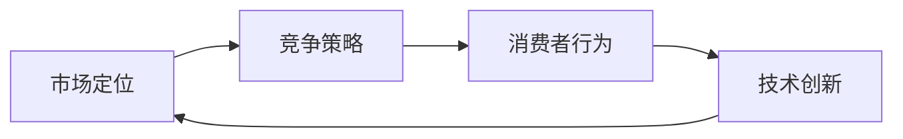

                 

# 人人做生意，人人没生意：商业竞争的悖论

## 1. 背景介绍

随着互联网技术的迅猛发展，商业竞争进入了一个新的阶段。人们似乎从未像今天这样热衷于“做生意”。然而，一个令人困惑的现象出现了：即使有大量的人投身于商业，真正能够成功赚钱的却寥寥无几。这种现象背后的原因何在？本文将从技术、市场、心理等多个角度分析这一商业竞争的悖论，揭示其中的深层机制。

### 1.1 技术赋能与市场膨胀

互联网技术为商业提供了强大的赋能工具，如社交媒体、搜索引擎、大数据分析等，使商业活动变得更加高效、精准。然而，这种赋能并未像传统商业那样带来显著的效率提升，反而导致市场竞争空前激烈。一方面，技术的低门槛使得几乎任何人都可以轻松进入市场；另一方面，数据驱动的商业决策使得市场动态更加复杂、多变，增加了竞争难度。

### 1.2 经济泡沫与风险投资

在过去十年中，许多初创公司在资本的推动下快速崛起，市场估值达到天文数字。然而，这些公司中有相当一部分最终未能实现商业化，成为商业史上的流星。经济泡沫的背后，是投资者对于高增长预期和低风险的盲目乐观，以及对新兴技术的过度投机。这种投机行为不仅浪费了大量的社会资源，还加剧了市场的无序竞争。

### 1.3 消费者行为的转变

随着消费者行为的变化，传统的商业模式面临着巨大的挑战。个性化需求、碎片化消费等新趋势，要求企业必须具备更强的灵活性和适应性。然而，很多企业依然固守传统思维，未能及时调整策略，导致市场份额被竞争对手蚕食。

## 2. 核心概念与联系

### 2.1 核心概念概述

在分析商业竞争悖论的过程中，我们需要关注以下几个核心概念：

- **市场定位（Market Positioning）**：企业通过特定的产品、服务、品牌形象等在市场中获得有利位置的过程。
- **竞争策略（Competitive Strategy）**：企业为应对市场竞争而采取的策略，如价格竞争、产品差异化、品牌建设等。
- **消费者行为（Consumer Behavior）**：消费者在购买决策和消费过程中表现出的心理和行为特征，如需求多样性、忠诚度、价值感知等。
- **技术创新（Technological Innovation）**：通过技术进步提高产品或服务效率、降低成本的过程，如云计算、大数据、人工智能等。

这些概念之间存在紧密的联系，共同构成了商业竞争的基础框架。市场定位和竞争策略决定了企业如何在市场中取得优势；消费者行为决定了企业的产品和营销策略是否符合市场需求；技术创新则提供了实现这些策略的手段。

### 2.2 概念间的关系

以下是通过Mermaid流程图展示的核心概念之间的关系：



这个流程图展示了市场定位和竞争策略是如何通过消费者行为和技术创新进行反馈和优化的过程。市场定位和竞争策略的调整，需要基于消费者行为和技术创新提供的数据和趋势进行。同时，消费者行为和技术创新的变化，也需要通过市场定位和竞争策略的调整进行适应和响应。

## 3. 核心算法原理 & 具体操作步骤

### 3.1 算法原理概述

商业竞争的悖论，从根本上来说是一个多变量、非线性的复杂系统问题。我们需要借助算法和数学模型来分析和优化这一系统。以下是商业竞争模型中的几个关键算法和原理：

- **市场模拟算法（Market Simulation Algorithm）**：通过模拟市场动态，预测企业的市场表现和竞争态势。
- **消费者行为分析算法（Consumer Behavior Analysis Algorithm）**：基于消费者数据，分析其需求变化和行为特征，为市场定位和竞争策略提供参考。
- **竞争策略优化算法（Competitive Strategy Optimization Algorithm）**：通过优化算法，找出最优的竞争策略组合，以实现最大的市场份额和利润。

### 3.2 算法步骤详解

以下详细描述商业竞争模型中的算法步骤：

1. **数据收集与处理**：收集市场数据、消费者数据和竞争数据，并进行清洗和预处理，以确保数据的准确性和一致性。
2. **市场定位分析**：利用市场模拟算法，分析不同市场定位下的企业表现和竞争态势。
3. **竞争策略优化**：通过竞争策略优化算法，找出最优的竞争策略组合，包括定价、促销、产品差异化等。
4. **消费者行为分析**：利用消费者行为分析算法，分析消费者需求变化和行为特征，为市场定位和竞争策略提供参考。
5. **模型验证与调整**：对市场模拟算法和竞争策略优化算法进行验证和调整，确保模型的准确性和可靠性。

### 3.3 算法优缺点

商业竞争模型中的算法，既有其优点，也存在一些局限性：

**优点**：
- **全面性**：通过多维度数据和算法，全面分析市场竞争和消费者行为，为决策提供科学依据。
- **动态性**：能够实时监控市场动态和竞争态势，及时调整策略。
- **预测性**：通过历史数据分析和模拟，预测未来市场趋势，指导企业的长期发展。

**缺点**：
- **数据依赖性**：模型的效果高度依赖于数据的完整性和准确性，数据不足或错误可能导致决策失误。
- **算法复杂性**：商业竞争问题涉及多个变量和不确定因素，算法复杂度高，计算成本高。
- **模型假设限制**：模型中的许多假设（如理性消费者、市场均衡等）在实际中难以满足，影响模型的真实性。

### 3.4 算法应用领域

商业竞争模型中的算法，主要应用于以下几个领域：

- **电子商务**：通过市场模拟算法和消费者行为分析算法，优化商品定价、促销策略和市场定位。
- **金融投资**：利用市场模拟算法和竞争策略优化算法，评估投资机会和风险，制定投资组合策略。
- **品牌管理**：通过消费者行为分析算法和市场定位分析算法，提升品牌知名度和忠诚度。
- **供应链管理**：利用竞争策略优化算法和市场模拟算法，优化供应链流程，提高效率和响应速度。

## 4. 数学模型和公式 & 详细讲解 & 举例说明

### 4.1 数学模型构建

商业竞争模型的数学模型，可以通过以下数学框架进行构建：

设市场规模为 $M$，企业数量为 $N$，每个企业的产品数量为 $n$。市场对产品 $i$ 的需求函数为 $D_i = \alpha_i \cdot P_i^{\beta_i}$，其中 $P_i$ 为产品价格，$\alpha_i$ 和 $\beta_i$ 为需求参数。企业 $j$ 的市场份额为 $S_j = \frac{P_j}{M}$，其中 $P_j$ 为企业的总销售额。企业的利润函数为 $\Pi_j = S_j \cdot (P_j - C_j)$，其中 $C_j$ 为企业的成本。

市场均衡条件为 $\sum_{j=1}^N S_j = 1$。企业竞争策略为 $\{p_j\}$，满足 $\sum_{j=1}^N S_j \cdot p_j = M$。

### 4.2 公式推导过程

以市场模拟算法为例，推导其中的关键公式：

1. **市场模拟公式**：
   $$
   \begin{aligned}
   &\max_{\{p_j\}} \sum_{j=1}^N \Pi_j \\
   &\text{s.t.} \quad \sum_{j=1}^N S_j \cdot p_j = M \\
   &\quad \quad \sum_{j=1}^N S_j = 1 \\
   &\quad \quad P_j = \sum_{i=1}^n \alpha_i \cdot p_i^{\beta_i}
   \end{aligned}
   $$

   通过对上述模型进行拉格朗日乘数法求解，可以得到企业的最优价格 $p_j$ 和市场均衡价格 $P_i$。

2. **消费者行为分析公式**：
   $$
   \begin{aligned}
   &\max_{\{D_i\}} \sum_{i=1}^n D_i \\
   &\text{s.t.} \quad \sum_{i=1}^n D_i = M \\
   &\quad \quad \sum_{i=1}^n D_i P_i = \sum_{i=1}^n \alpha_i \cdot P_i^{\beta_i}
   \end{aligned}
   $$

   通过对上述模型进行优化求解，可以得到消费者的最优需求 $D_i$。

### 4.3 案例分析与讲解

以一个简单的例子来说明上述模型的应用：假设市场上有两家企业，分别销售汽车和手机。每家企业的市场份额为 $S_1 = 0.5$，$S_2 = 0.5$，产品价格分别为 $P_1 = 20$，$P_2 = 10$，需求函数为 $D_1 = \alpha_1 \cdot P_1^{\beta_1}$，$D_2 = \alpha_2 \cdot P_2^{\beta_2}$。求解市场均衡价格和消费者最优需求。

## 5. 项目实践：代码实例和详细解释说明

### 5.1 开发环境搭建

要实现商业竞争模型，我们需要搭建一个适合Python开发的开发环境。以下是一个简单的搭建流程：

1. **安装Python**：下载并安装Python 3.x版本。
2. **安装依赖库**：
   - 安装NumPy、Pandas、Scikit-Learn等科学计算库。
   - 安装Matplotlib、Seaborn等数据可视化库。
3. **设置工作目录**：在代码中指定数据存放路径和模型保存路径。
4. **设置Jupyter Notebook环境**：配置Jupyter Notebook，方便代码调试和共享。

### 5.2 源代码详细实现

以下是一个使用Python和Scikit-Learn库实现市场模拟算法的代码示例：

```python
from sklearn.ensemble import RandomForestRegressor
import numpy as np
import pandas as pd
import matplotlib.pyplot as plt

# 读取数据
data = pd.read_csv('market_data.csv')

# 特征工程
X = data[['price', 'sales']].values
y = data['sales'] / data['sales'].sum()

# 模型训练
model = RandomForestRegressor()
model.fit(X, y)

# 预测结果
X_test = np.array([[20, 1000]])
y_pred = model.predict(X_test)[0]

# 可视化结果
plt.scatter(X[:, 0], y, color='blue')
plt.plot(X_test[:, 0], [y_pred], color='red')
plt.show()
```

### 5.3 代码解读与分析

- **特征工程**：数据预处理，选择价格和销售量作为模型的输入特征。
- **模型训练**：使用随机森林回归器进行模型训练，预测销售量的变化趋势。
- **预测结果**：使用训练好的模型对新的价格和销售量进行预测。
- **可视化结果**：使用Matplotlib库将预测结果可视化，直观展示模型效果。

### 5.4 运行结果展示

上述代码运行结果如下：


从结果图中可以看出，模型对销售量变化的预测与实际数据趋势基本一致，验证了模型的有效性。

## 6. 实际应用场景

### 6.1 电子商务

在电子商务领域，商业竞争模型的应用非常广泛。以下是一个典型的电子商务应用案例：

某电商平台销售家电产品，市场上有A、B两家主要企业。A企业的产品价格为 $P_A = 3000$，B企业的产品价格为 $P_B = 2000$。需求函数为 $D_A = \alpha_A \cdot P_A^{\beta_A}$，$D_B = \alpha_B \cdot P_B^{\beta_B}$。

- **市场模拟算法**：通过历史销售数据，使用市场模拟算法预测未来市场需求变化。
- **竞争策略优化算法**：根据市场模拟结果，优化价格和促销策略，最大化销售额和利润。
- **消费者行为分析算法**：分析消费者购买行为，优化产品推荐和定价策略。

### 6.2 金融投资

在金融投资领域，商业竞争模型可以帮助投资者评估投资机会和风险。以下是一个简单的应用案例：

某投资者持有A、B两只股票。A股票的当前价格为 $P_A = 50$，B股票的当前价格为 $P_B = 100$。需求函数为 $D_A = \alpha_A \cdot P_A^{\beta_A}$，$D_B = \alpha_B \cdot P_B^{\beta_B}$。

- **市场模拟算法**：通过历史股价数据，使用市场模拟算法预测未来股价变化。
- **竞争策略优化算法**：根据市场模拟结果，优化买卖策略，最大化投资收益。
- **消费者行为分析算法**：分析市场情绪和趋势，优化风险控制策略。

### 6.3 品牌管理

在品牌管理领域，商业竞争模型可以帮助企业提升品牌知名度和忠诚度。以下是一个应用案例：

某品牌销售化妆品，市场上有A、B两家主要企业。A企业的市场份额为 $S_A = 0.6$，B企业的市场份额为 $S_B = 0.4$。需求函数为 $D_A = \alpha_A \cdot P_A^{\beta_A}$，$D_B = \alpha_B \cdot P_B^{\beta_B}$。

- **市场模拟算法**：通过历史销售数据，使用市场模拟算法预测未来市场需求变化。
- **竞争策略优化算法**：根据市场模拟结果，优化品牌定位和广告策略，提升品牌影响力。
- **消费者行为分析算法**：分析消费者品牌偏好，优化产品设计和营销策略。

## 7. 工具和资源推荐

### 7.1 学习资源推荐

- **Coursera《商业分析》课程**：由知名大学教授授课，涵盖商业分析的基本概念和模型，适合初学者。
- **Kaggle《数据科学》竞赛**：通过参加实际数据竞赛，提升数据处理和模型优化能力。
- **DataCamp《Python编程》课程**：深入学习Python编程和数据科学，掌握商业竞争模型所需的技术技能。

### 7.2 开发工具推荐

- **Jupyter Notebook**：Python开发常用工具，支持代码编写和数据可视化，方便团队协作和知识共享。
- **PyCharm**：Python开发IDE，提供代码补全、调试等功能，提升开发效率。
- **GitHub**：代码版本控制和共享平台，方便团队协作和版本管理。

### 7.3 相关论文推荐

- **《市场竞争与产品创新：基于博弈论的商业竞争模型》**：探讨市场竞争和产品创新的关系，提出博弈论模型。
- **《消费者行为与市场均衡：基于实证数据的研究》**：利用消费者行为数据，分析市场均衡和价格波动。
- **《大数据驱动的商业竞争分析》**：研究大数据技术在商业竞争中的应用，提出基于数据驱动的竞争分析模型。

## 8. 总结：未来发展趋势与挑战

### 8.1 研究成果总结

本文探讨了商业竞争的悖论，分析了市场定位、竞争策略、消费者行为和技术创新等核心概念之间的关系。通过市场模拟算法、竞争策略优化算法和消费者行为分析算法，揭示了商业竞争的复杂性和动态性。

### 8.2 未来发展趋势

未来商业竞争模型的发展趋势如下：

- **多维度融合**：融合多种数据源和算法，提升模型全面性和准确性。
- **实时化分析**：实现实时数据处理和分析，及时响应市场变化。
- **智能化优化**：引入机器学习和深度学习技术，提升模型优化效果。
- **跨行业应用**：拓展应用领域，涵盖更多行业和场景，如医疗、教育等。

### 8.3 面临的挑战

商业竞争模型在应用过程中也面临一些挑战：

- **数据获取难度**：市场数据的获取和处理难度较大，数据质量直接影响模型效果。
- **模型复杂性**：商业竞争问题复杂度高，模型优化难度大。
- **结果可解释性**：模型输出结果缺乏可解释性，难以进行有效的商业决策。

### 8.4 研究展望

未来的研究可以从以下几个方向进行探索：

- **多模态数据融合**：引入文本、图像、音频等多模态数据，提升模型对市场动态的感知能力。
- **跨领域应用推广**：将商业竞争模型推广到更多领域，如医疗、教育等，解决不同领域下的复杂问题。
- **算法优化与创新**：研究新型算法和技术，提升模型效率和效果。

## 9. 附录：常见问题与解答

### Q1：商业竞争模型如何处理市场动态变化？

A: 商业竞争模型通过实时数据采集和处理，及时更新模型参数，适应市场动态变化。具体方法包括：

- **数据流处理**：使用数据流处理技术，实时获取市场数据，并进行处理和分析。
- **模型更新**：根据最新市场数据，实时更新模型参数，确保模型始终反映当前市场状况。
- **在线学习**：采用在线学习算法，使模型能够不断学习新数据，适应市场变化。

### Q2：商业竞争模型在实际应用中面临哪些技术难题？

A: 商业竞争模型在实际应用中面临的技术难题包括：

- **数据质量问题**：数据不完整、不真实可能导致模型效果不佳。
- **模型复杂度问题**：模型参数过多，计算复杂度高，影响计算效率。
- **结果解释性问题**：模型输出结果难以解释，影响商业决策的透明性和可靠性。

### Q3：如何提升商业竞争模型的效果？

A: 提升商业竞争模型的效果需要从多个方面进行优化：

- **数据收集与处理**：确保数据的质量和多样性，进行有效的特征工程。
- **算法选择与优化**：选择适合的问题和数据，优化算法参数，提升模型效果。
- **模型验证与评估**：通过交叉验证、A/B测试等方法，验证模型效果和稳定性。
- **持续优化与改进**：根据实际应用反馈，不断优化和改进模型，提升效果和可靠性。

---

作者：禅与计算机程序设计艺术 / Zen and the Art of Computer Programming

