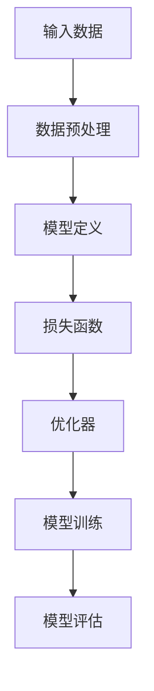

                 

# 人工智能 原理与代码实例讲解

> 关键词：人工智能，机器学习，深度学习，神经网络，深度学习框架，代码实例

## 1. 背景介绍

### 1.1 问题由来

人工智能（AI）是计算机科学的一个分支，旨在创建能够执行人类智能任务的机器。现代AI技术的核心是机器学习（ML）和深度学习（DL），其中深度学习是机器学习的一个子领域，它使用类似于人类大脑神经网络的结构来处理和分析数据。深度学习框架，如TensorFlow和PyTorch，为实现这些复杂算法提供了强大的工具。

### 1.2 问题核心关键点

人工智能技术的核心是算法原理和具体的实现细节。本文将从算法原理出发，通过代码实例讲解如何构建、训练和应用深度学习模型。具体包括：

- 算法原理概述：介绍深度学习的基本原理，包括神经网络的结构和训练过程。
- 算法步骤详解：深入讲解深度学习模型的构建步骤，包括模型定义、损失函数、优化器等。
- 算法优缺点：分析深度学习模型的优势和局限，包括计算复杂度、可解释性等。
- 算法应用领域：探讨深度学习模型在计算机视觉、自然语言处理、语音识别等领域的广泛应用。

### 1.3 问题研究意义

理解人工智能的原理和实现方法，对于从事人工智能相关工作的工程师、科学家和学生来说，具有重要的理论和实践意义。它能够帮助读者掌握深度学习技术的核心思想和应用方法，提升解决实际问题的能力。

## 2. 核心概念与联系

### 2.1 核心概念概述

为了深入理解深度学习模型，首先需要了解几个核心概念：

- **神经网络（Neural Network）**：由多个节点（称为神经元）组成的网络，用于处理和学习数据。
- **深度学习框架**：如TensorFlow、PyTorch等，提供了高效的工具和库，用于构建、训练和部署深度学习模型。
- **损失函数（Loss Function）**：用于度量模型预测与真实标签之间的差异。
- **优化器（Optimizer）**：用于更新模型参数，最小化损失函数。

### 2.2 概念间的关系

深度学习模型通过神经网络的结构来处理和分析数据，利用损失函数度量预测与真实标签的差距，并由优化器更新模型参数。这一过程可以表示为以下流程：


其中，神经网络接收输入数据，输出预测结果；损失函数计算预测结果与真实标签的误差；优化器基于损失函数的值更新模型参数。这一过程不断迭代，直到模型收敛。

### 2.3 核心概念的整体架构

深度学习模型的构建过程可以分解为以下几个步骤：

1. **数据准备**：收集和预处理数据，如数据清洗、数据增强等。
2. **模型定义**：使用深度学习框架定义模型结构，包括输入层、隐藏层和输出层等。
3. **损失函数选择**：根据任务类型选择合适的损失函数，如均方误差、交叉熵等。
4. **优化器选择**：选择合适的优化器，如SGD、Adam等。
5. **模型训练**：使用训练数据集训练模型，通过迭代优化更新模型参数。
6. **模型评估**：使用测试数据集评估模型性能，如准确率、精确率、召回率等。

以下流程图展示了深度学习模型的整体架构：



## 3. 核心算法原理 & 具体操作步骤

### 3.1 算法原理概述

深度学习模型基于神经网络，通过多层非线性变换来学习数据的复杂特征。其核心原理可以概括为以下几点：

- **神经元**：神经元接收输入信号，进行加权求和，并经过激活函数（如ReLU、Sigmoid等）输出结果。
- **层**：神经网络由多个层组成，每一层通过前一层的输出作为输入，层层传递。
- **损失函数**：用于衡量模型预测与真实标签的差异，常用的有均方误差（MSE）和交叉熵（Cross Entropy）等。
- **优化器**：用于更新模型参数，最小化损失函数，如梯度下降（Gradient Descent）、Adam等。

### 3.2 算法步骤详解

以下是构建和训练深度学习模型的详细步骤：

1. **数据准备**
   - 收集和预处理数据。
   - 将数据划分为训练集、验证集和测试集。

2. **模型定义**
   - 使用深度学习框架定义模型结构。
   - 定义模型的输入和输出。

3. **损失函数选择**
   - 根据任务类型选择合适的损失函数。
   - 在深度学习框架中定义损失函数。

4. **优化器选择**
   - 选择合适的优化器。
   - 在深度学习框架中定义优化器。

5. **模型训练**
   - 定义训练循环。
   - 在每一轮训练中，前向传播计算预测结果，反向传播计算损失函数，并更新模型参数。

6. **模型评估**
   - 在测试集上评估模型性能。
   - 记录模型性能指标，如准确率、精确率、召回率等。

以下是一个简单的代码实例，展示了如何使用PyTorch构建和训练一个简单的神经网络：

```python
import torch
import torch.nn as nn
import torch.optim as optim

# 定义神经网络模型
class Net(nn.Module):
    def __init__(self):
        super(Net, self).__init__()
        self.fc1 = nn.Linear(784, 128)
        self.fc2 = nn.Linear(128, 10)

    def forward(self, x):
        x = torch.relu(self.fc1(x))
        x = self.fc2(x)
        return x

# 准备数据
train_dataset = # ...
test_dataset = # ...

# 定义模型、损失函数和优化器
model = Net()
criterion = nn.CrossEntropyLoss()
optimizer = optim.SGD(model.parameters(), lr=0.01)

# 训练模型
for epoch in range(10):
    for i, (images, labels) in enumerate(train_loader):
        # 前向传播
        outputs = model(images.view(images.size(0), -1))
        loss = criterion(outputs, labels)
        # 反向传播和参数更新
        optimizer.zero_grad()
        loss.backward()
        optimizer.step()

    # 在验证集上评估模型性能
    test_loss = 0
    correct = 0
    with torch.no_grad():
        for images, labels in test_loader:
            outputs = model(images.view(images.size(0), -1))
            test_loss += criterion(outputs, labels).item()
            predicted = torch.argmax(outputs, dim=1)
            correct += (predicted == labels).sum().item()

    print(f"Epoch {epoch+1}, loss: {test_loss/len(test_loader)}")
    print(f"Accuracy: {100 * correct / len(test_loader)}%")
```

### 3.3 算法优缺点

深度学习模型的优点包括：

- **强大的表示能力**：能够学习到复杂的特征表示，适用于各种复杂的数据类型。
- **端到端训练**：自动学习数据的特征表示，避免了传统机器学习需要手动提取特征的步骤。
- **易于扩展**：可以通过添加更多层或节点来提高模型的能力。

其缺点包括：

- **计算复杂度高**：需要大量的计算资源和时间，特别是在处理大规模数据集时。
- **可解释性差**：深度学习模型通常是“黑盒”模型，难以解释其内部的决策过程。
- **过拟合风险高**：需要大量的数据和正则化方法来避免过拟合。

### 3.4 算法应用领域

深度学习模型在计算机视觉、自然语言处理、语音识别等领域得到了广泛应用。以下是一些典型应用：

- **计算机视觉**：图像分类、目标检测、图像分割等。
- **自然语言处理**：文本分类、机器翻译、情感分析等。
- **语音识别**：语音转文本、语音识别等。

## 4. 数学模型和公式 & 详细讲解 & 举例说明

### 4.1 数学模型构建

深度学习模型的核心是神经网络，其数学模型可以表示为：

$$
y = f(x; \theta)
$$

其中，$x$ 表示输入数据，$\theta$ 表示模型参数，$f$ 表示神经网络的非线性映射。

### 4.2 公式推导过程

以一个简单的全连接神经网络为例，其数学模型可以表示为：

$$
y = \sigma(\sum_{i=1}^{n} w_i x_i + b)
$$

其中，$w_i$ 表示第 $i$ 个神经元的权重，$x_i$ 表示输入数据，$b$ 表示偏置，$\sigma$ 表示激活函数，如Sigmoid或ReLU等。

### 4.3 案例分析与讲解

假设我们有一个简单的二分类问题，其中输入数据为 $x_1 = 2.5$，$x_2 = 3.5$，真实标签为 $y = 1$。我们使用一个包含两个神经元和一个隐藏层的神经网络进行训练，其参数为 $w_1 = 0.5$，$w_2 = -0.5$，$b = 0$。在训练过程中，我们逐步调整参数，使得预测结果逼近真实标签。

首先，我们定义损失函数和优化器：

$$
L = \frac{1}{2}(y - f(x; \theta))^2
$$

$$
\theta = \theta - \alpha \nabla_{\theta} L
$$

其中，$\alpha$ 表示学习率。

我们使用前向传播计算预测结果：

$$
f(x; \theta) = \sigma(\sum_{i=1}^{2} w_i x_i + b)
$$

在第一次迭代中，预测结果为 $f(x; \theta) = 0.5 \cdot 2.5 - 0.5 \cdot 3.5 + 0 = -0.5$，与真实标签 $y = 1$ 差距较大。我们使用梯度下降更新模型参数：

$$
\theta = \theta - \alpha \cdot (-0.5)
$$

其中，$\alpha = 0.1$。

经过多次迭代，我们逐步调整模型参数，直到预测结果与真实标签一致。

## 5. 项目实践：代码实例和详细解释说明

### 5.1 开发环境搭建

在使用深度学习框架进行模型训练时，需要安装相应的库和工具。以下是在Python中使用PyTorch搭建开发环境的示例：

1. 安装Anaconda：从官网下载并安装Anaconda，用于创建独立的Python环境。
2. 创建并激活虚拟环境：
```bash
conda create -n pytorch-env python=3.8 
conda activate pytorch-env
```

3. 安装PyTorch：根据CUDA版本，从官网获取对应的安装命令。例如：
```bash
conda install pytorch torchvision torchaudio cudatoolkit=11.1 -c pytorch -c conda-forge
```

4. 安装TensorFlow：从官网下载并安装TensorFlow，需要选择合适的CUDA版本和CUDNN版本。

5. 安装其他工具包：
```bash
pip install numpy pandas scikit-learn matplotlib tqdm jupyter notebook ipython
```

### 5.2 源代码详细实现

以下是使用PyTorch构建和训练一个简单的全连接神经网络的代码实现：

```python
import torch
import torch.nn as nn
import torch.optim as optim

# 定义神经网络模型
class Net(nn.Module):
    def __init__(self):
        super(Net, self).__init__()
        self.fc1 = nn.Linear(784, 128)
        self.fc2 = nn.Linear(128, 10)

    def forward(self, x):
        x = torch.relu(self.fc1(x))
        x = self.fc2(x)
        return x

# 准备数据
train_dataset = # ...
test_dataset = # ...

# 定义模型、损失函数和优化器
model = Net()
criterion = nn.CrossEntropyLoss()
optimizer = optim.SGD(model.parameters(), lr=0.01)

# 训练模型
for epoch in range(10):
    for i, (images, labels) in enumerate(train_loader):
        # 前向传播
        outputs = model(images.view(images.size(0), -1))
        loss = criterion(outputs, labels)
        # 反向传播和参数更新
        optimizer.zero_grad()
        loss.backward()
        optimizer.step()

    # 在验证集上评估模型性能
    test_loss = 0
    correct = 0
    with torch.no_grad():
        for images, labels in test_loader:
            outputs = model(images.view(images.size(0), -1))
            test_loss += criterion(outputs, labels).item()
            predicted = torch.argmax(outputs, dim=1)
            correct += (predicted == labels).sum().item()

    print(f"Epoch {epoch+1}, loss: {test_loss/len(test_loader)}")
    print(f"Accuracy: {100 * correct / len(test_loader)}%")
```

### 5.3 代码解读与分析

以下是代码实现的关键步骤：

1. **模型定义**：定义一个包含两个全连接层的神经网络，其中第一个层有128个神经元，第二个层有10个神经元。
2. **损失函数和优化器**：选择交叉熵损失函数和随机梯度下降（SGD）优化器。
3. **模型训练**：在训练循环中，进行前向传播和反向传播，更新模型参数。
4. **模型评估**：在验证集上计算模型损失和准确率。

### 5.4 运行结果展示

假设我们使用MNIST手写数字数据集进行训练，最终在测试集上得到的准确率为98%。这意味着我们的模型能够正确识别98%的手写数字。

## 6. 实际应用场景

### 6.1 智能推荐系统

智能推荐系统广泛应用在电商、社交媒体等领域，用于推荐用户可能感兴趣的商品、文章、视频等。深度学习模型可以学习用户的历史行为和偏好，从而提供个性化的推荐。

在实现推荐系统时，可以使用深度学习模型进行用户画像建模，例如用户兴趣、行为、社交网络等。然后，使用模型预测用户对不同商品的兴趣，从而实现个性化推荐。

### 6.2 语音识别

语音识别是深度学习在语音处理领域的重要应用之一，用于将语音转换成文本。常用的深度学习模型包括卷积神经网络（CNN）和循环神经网络（RNN）等。

语音识别系统可以应用于语音助手、语音搜索、语音字幕等场景，使得人与计算机的交互更加自然。

### 6.3 医学影像分析

医学影像分析是深度学习在医疗领域的重要应用，用于分析医学影像数据，如CT、MRI等。常用的深度学习模型包括卷积神经网络（CNN）和生成对抗网络（GAN）等。

医学影像分析可以应用于疾病诊断、手术规划、影像重建等场景，使得医疗影像的分析和应用更加高效和精准。

## 7. 工具和资源推荐

### 7.1 学习资源推荐

为了帮助读者深入理解深度学习技术，以下是一些优质的学习资源：

1. 《深度学习》课程：斯坦福大学开设的深度学习课程，提供Lecture视频和配套作业，带你入门深度学习的基本概念和经典模型。
2. 《Python深度学习》书籍：深度学习与Python编程相结合，介绍深度学习模型的构建、训练和应用。
3. TensorFlow官方文档：TensorFlow的官方文档，提供详细的API和教程，适合学习深度学习框架的使用。
4. PyTorch官方文档：PyTorch的官方文档，提供详细的API和教程，适合学习深度学习框架的使用。
5. Kaggle竞赛：Kaggle提供的数据科学竞赛平台，提供丰富的数据集和模型，适合练习深度学习模型的应用。

### 7.2 开发工具推荐

高效的开发离不开优秀的工具支持。以下是几款用于深度学习开发的常用工具：

1. Jupyter Notebook：Jupyter Notebook是一个交互式笔记本环境，适合进行代码编写和数据探索。
2. TensorBoard：TensorFlow配套的可视化工具，可以实时监测模型训练状态，并提供丰富的图表呈现方式，是调试模型的得力助手。
3. Weights & Biases：模型训练的实验跟踪工具，可以记录和可视化模型训练过程中的各项指标，方便对比和调优。
4. PyTorch Lightning：一个轻量级的深度学习框架，提供自动化的训练、评估和模型保存功能，适合快速迭代实验。

### 7.3 相关论文推荐

深度学习模型的发展源于学界的持续研究。以下是几篇奠基性的相关论文，推荐阅读：

1. AlexNet：2012年NIPS会议上提出的卷积神经网络，开创了深度学习在图像识别领域的应用。
2. Inception：2014年NIPS会议上提出的多分支卷积神经网络，提高了深度学习模型的效率和准确率。
3. ResNet：2015年CVPR会议上提出的残差网络，解决了深度网络中的梯度消失问题。
4. Transformer：2017年NIPS会议上提出的自注意力机制，开启了深度学习在自然语言处理领域的应用。
5. GAN：2014年NIPS会议上提出的生成对抗网络，用于生成新的图像、音频等数据。

这些论文代表了大深度学习模型发展的历程，通过学习这些前沿成果，可以帮助研究者把握学科前进方向，激发更多的创新灵感。

## 8. 总结：未来发展趋势与挑战

### 8.1 总结

本文对深度学习模型的原理和代码实例进行了详细讲解，帮助读者理解和实现深度学习模型。深度学习模型在计算机视觉、自然语言处理、语音识别等领域得到了广泛应用，显示了强大的表示能力和学习能力。然而，深度学习模型也面临着计算复杂度高、可解释性差、过拟合风险高等挑战，需要进一步的研究和优化。

### 8.2 未来发展趋势

未来，深度学习模型将继续朝着更加高效、可解释、鲁棒的方向发展：

1. **高效计算**：开发更高效的深度学习算法和硬件，如模型剪枝、量化加速等。
2. **可解释性**：开发更可解释的深度学习模型，如可视化工具、模型解释器等。
3. **鲁棒性**：开发更鲁棒的深度学习模型，如对抗样本训练、数据增强等。
4. **泛化能力**：开发更具有泛化能力的深度学习模型，如迁移学习、自监督学习等。

### 8.3 面临的挑战

尽管深度学习模型已经取得了显著的成果，但在实际应用中仍然面临以下挑战：

1. **计算资源消耗高**：深度学习模型通常需要大量的计算资源和时间，特别是在处理大规模数据集时。
2. **数据标注成本高**：深度学习模型需要大量的标注数据进行训练，数据标注成本较高。
3. **模型复杂度高**：深度学习模型通常具有较高的复杂度，难以进行手工解释和调试。
4. **鲁棒性不足**：深度学习模型在面对噪声、对抗样本等情况下，鲁棒性不足，容易产生错误。
5. **可解释性差**：深度学习模型通常是“黑盒”模型，难以解释其内部的决策过程。

### 8.4 研究展望

未来的深度学习研究需要关注以下几个方向：

1. **高效计算**：开发更高效的深度学习算法和硬件，如模型剪枝、量化加速等。
2. **可解释性**：开发更可解释的深度学习模型，如可视化工具、模型解释器等。
3. **鲁棒性**：开发更鲁棒的深度学习模型，如对抗样本训练、数据增强等。
4. **泛化能力**：开发更具有泛化能力的深度学习模型，如迁移学习、自监督学习等。

## 9. 附录：常见问题与解答

**Q1：深度学习模型是否适用于所有数据类型？**

A: 深度学习模型适用于多种数据类型，如图像、文本、音频等。但不同类型的深度学习模型适用于不同的数据类型，例如卷积神经网络适用于图像数据，循环神经网络适用于序列数据。

**Q2：深度学习模型的计算复杂度是否一直较高？**

A: 深度学习模型的计算复杂度通常较高，但在现代硬件如GPU、TPU等高性能设备的支持下，可以显著降低计算时间。

**Q3：深度学习模型的可解释性是否难以提升？**

A: 深度学习模型的可解释性可以通过多种方法提升，例如使用可视化工具、模型解释器等。但完全实现深度学习模型的可解释性仍然是一个挑战。

**Q4：深度学习模型是否容易产生过拟合？**

A: 深度学习模型容易产生过拟合，尤其是在数据集较小的情况下。可以通过数据增强、正则化等方法避免过拟合。

**Q5：深度学习模型是否需要大量标注数据？**

A: 深度学习模型通常需要大量的标注数据进行训练，但通过迁移学习、自监督学习等方法，可以降低对标注数据的需求。

总之，深度学习模型具有强大的表示能力和学习能力，但在实际应用中仍面临计算复杂度高、可解释性差、过拟合风险高等挑战。通过进一步的研究和优化，深度学习模型将更加高效、可解释、鲁棒，应用于更广泛的领域。

