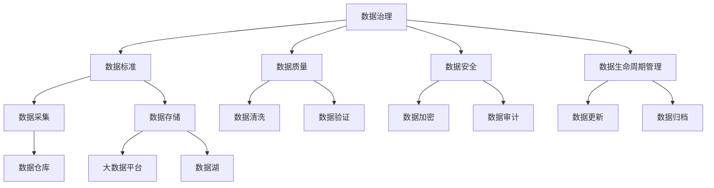

                 

# 人工智能创业数据管理的有效方法

> 关键词：人工智能创业,数据管理,数据治理,数据安全,数据仓库,大数据平台,数据湖,数据生命周期管理,数据质量控制

## 1. 背景介绍

### 1.1 问题由来

随着人工智能（AI）技术的飞速发展，越来越多的创业企业开始应用AI技术来驱动业务创新和竞争优势。然而，数据作为AI系统的核心要素，其管理与治理问题在人工智能创业企业中显得尤为重要。如何高效地采集、存储、管理和利用数据，以支持企业AI模型的开发和应用，是每个AI创业企业必须面对的挑战。

### 1.2 问题核心关键点

在人工智能创业中，数据管理与治理成为项目成功的关键环节之一。数据管理的核心包括数据的采集、存储、处理、分析和输出，涉及技术、流程、人员和组织的协同工作。高效的数据管理不仅能够降低项目成本，还能提升AI模型的准确性和可靠性。

数据治理则关注数据的质量、安全、合规和生命周期管理，确保数据能够有效支持企业的战略目标和业务需求。数据治理框架通常包括数据标准、数据质量、数据安全、数据治理策略等多个方面。

### 1.3 问题研究意义

研究高效的数据管理与治理方法，对于人工智能创业企业的成功至关重要。良好的数据管理能够：

1. **降低项目成本**：通过高效的数据采集和处理流程，减少数据冗余和重复，提高数据利用效率。
2. **提升模型质量**：确保输入数据的高质量，减少模型训练和调优的成本和时间。
3. **增强竞争优势**：通过对数据的深度分析和挖掘，发现潜在的商业价值和创新机会。
4. **保障数据安全**：确保数据的合规性和安全性，避免数据泄露和滥用。
5. **促进企业决策**：提供基于数据的决策支持，辅助企业制定战略规划和运营决策。

## 2. 核心概念与联系

### 2.1 核心概念概述

为更好地理解人工智能创业中的数据管理与治理，本文将介绍几个关键概念：

- **数据治理（Data Governance）**：指制定数据标准、规范和政策，确保数据的质量、安全、合规和生命周期管理的综合管理策略。
- **数据仓库（Data Warehouse）**：是一种用于集中存储和管理企业历史数据的仓库，支持多维度分析和报表生成。
- **大数据平台（Big Data Platform）**：用于处理、存储和分析大规模数据的平台，支持分布式计算和数据湖架构。
- **数据湖（Data Lake）**：一种全量的、不可变的数据存储方式，支持海量数据的处理和分析。
- **数据生命周期管理（Data Lifecycle Management）**：关注数据的整个生命周期，从数据采集到数据销毁的全过程管理。
- **数据质量控制（Data Quality Control）**：通过监控和评估数据质量，确保数据符合业务需求和标准。

这些概念之间存在紧密的联系，共同构成了数据管理与治理的完整框架。

### 2.2 概念间的关系

这些核心概念之间的逻辑关系可以通过以下Mermaid流程图来展示：



这个流程图展示了数据治理过程中涉及的主要步骤和概念：

1. 数据治理制定数据标准、规范和政策，涵盖数据采集、存储、处理、分析和销毁等全生命周期管理。
2. 数据标准指导数据采集流程，确保数据符合业务需求。
3. 数据质量通过清洗和验证，确保数据的准确性和完整性。
4. 数据安全通过加密和审计，保护数据的机密性和完整性。
5. 数据生命周期管理涵盖数据采集、存储、更新、归档和销毁等全过程管理。
6. 数据采集到数据仓库，进行集中存储和管理。
7. 大数据平台和数据湖支持大规模数据的处理和分析。

通过这些概念的整合应用，人工智能创业企业能够高效、安全地管理和利用数据，推动AI项目的成功。

## 3. 核心算法原理 & 具体操作步骤
### 3.1 算法原理概述

人工智能创业企业的数据管理与治理，本质上是一个综合性的管理工程，涉及多个步骤和技术手段。其核心算法原理包括数据标准化、数据清洗、数据加密、数据质量控制和数据生命周期管理等。

数据标准化通过制定和实施数据标准，确保数据的统一性和一致性。数据清洗涉及数据去重、去噪和补缺，提高数据质量。数据加密和数据审计确保数据的安全性和合规性。数据质量控制通过监控和评估数据质量，确保数据符合业务需求。数据生命周期管理关注数据的整个生命周期，从数据采集到数据销毁的全过程管理。

### 3.2 算法步骤详解

基于数据管理与治理的算法步骤主要包括：

1. **数据标准制定**：制定统一的数据标准和规范，确保数据的统一性和一致性。
2. **数据采集**：通过ETL（Extract, Transform, Load）技术，从多个数据源采集数据，确保数据完整性和准确性。
3. **数据清洗和预处理**：通过数据清洗和预处理，去除重复、错误和不完整的数据，提高数据质量。
4. **数据存储和管理**：通过数据仓库、大数据平台和数据湖等技术，集中存储和管理数据。
5. **数据安全和隐私保护**：通过数据加密、数据审计和合规检查，保护数据安全和隐私。
6. **数据质量控制**：通过数据验证和监控，确保数据质量符合业务需求。
7. **数据生命周期管理**：通过数据归档和销毁，管理数据的整个生命周期。

### 3.3 算法优缺点

数据管理与治理方法在人工智能创业中具有以下优点：

- **提高数据质量**：通过数据清洗和预处理，提高输入数据的质量，减少模型训练和调优的成本。
- **保障数据安全**：通过数据加密和合规检查，保护数据安全，避免数据泄露和滥用。
- **降低项目成本**：通过标准化和自动化数据管理流程，降低数据管理和治理的复杂度，减少人工干预。
- **增强模型准确性**：通过高质量的数据输入，提高AI模型的准确性和可靠性。

同时，数据管理与治理方法也存在一些局限性：

- **技术复杂度高**：数据管理与治理涉及多个技术和工具，实施难度较高。
- **数据标准制定困难**：不同业务部门和系统间的数据标准差异较大，制定统一的标准的难度较大。
- **数据质量难以全面控制**：数据来源复杂，数据质量难以全面控制，数据治理过程中需要持续监控和改进。
- **数据治理成本高**：实施数据治理需要投入大量人力和资源，成本较高。

### 3.4 算法应用领域

数据管理与治理方法在多个领域中得到广泛应用，如金融、医疗、零售、制造等。以下以金融行业为例，详细讲解数据管理与治理的应用。

在金融行业中，数据管理与治理可以用于：

- **客户数据管理**：通过数据采集和清洗，收集和整合客户信息，构建客户画像，提升客户服务体验。
- **风险管理**：通过数据安全和隐私保护，确保客户数据的安全，防止数据泄露和滥用。
- **金融产品开发**：通过数据分析和挖掘，发现潜在的商业机会和创新需求，辅助金融产品的设计和开发。
- **金融监管合规**：通过数据审计和合规检查，确保金融数据的合规性，防止违规操作。

## 4. 数学模型和公式 & 详细讲解  
### 4.1 数学模型构建

本节将使用数学语言对数据管理与治理的算法进行更加严格的刻画。

假设企业收集到多个数据源的数据，记为 $D=\{(x_i,y_i)\}_{i=1}^N, x_i \in \mathcal{X}, y_i \in \mathcal{Y}$，其中 $\mathcal{X}$ 为输入空间，$\mathcal{Y}$ 为输出空间。

定义数据质量函数 $Q(D)$ 为数据质量指数，衡量数据集的完整性、准确性和一致性。数据安全函数 $S(D)$ 为数据安全指数，衡量数据的保密性、完整性和可用性。数据生命周期管理函数 $L(D)$ 为数据生命周期管理指数，衡量数据的采集、存储、更新和归档过程。

数据治理的目标是最小化数据管理和治理成本，同时最大化数据质量和安全性。定义数据治理函数 $G(D)$ 为数据治理目标函数：

$$
G(D) = \min_{D} \left(C_Q \cdot Q(D) + C_S \cdot S(D) + C_L \cdot L(D)\right)
$$

其中 $C_Q$、$C_S$ 和 $C_L$ 分别为数据质量、数据安全和数据生命周期管理的目标成本。

### 4.2 公式推导过程

以下我们以金融行业中的客户数据管理为例，推导数据治理的目标函数及其优化过程。

假设客户数据集为 $D=\{(x_i,y_i)\}_{i=1}^N, x_i \in \mathcal{X}, y_i \in \mathcal{Y}$。客户数据的质量 $Q(D)$ 可以分解为数据完整性 $Q_{comp}(D)$、数据准确性 $Q_{accu}(D)$ 和数据一致性 $Q_{cons}(D)$：

$$
Q(D) = Q_{comp}(D) + Q_{accu}(D) + Q_{cons}(D)
$$

数据安全 $S(D)$ 可以通过加密和审计等措施来保障，记为：

$$
S(D) = S_{enc}(D) + S_{aud}(D)
$$

数据生命周期管理 $L(D)$ 包括数据的采集、存储、更新和归档等过程，记为：

$$
L(D) = L_{acq}(D) + L_{sto}(D) + L_{upd}(D) + L_{arc}(D)
$$

根据数据治理的目标函数，可以得到：

$$
G(D) = \min_{D} \left(C_{Q_{comp}} \cdot Q_{comp}(D) + C_{Q_{accu}} \cdot Q_{accu}(D) + C_{Q_{cons}} \cdot Q_{cons}(D) + C_{S_{enc}} \cdot S_{enc}(D) + C_{S_{aud}} \cdot S_{aud}(D) + C_{L_{acq}} \cdot L_{acq}(D) + C_{L_{sto}} \cdot L_{sto}(D) + C_{L_{upd}} \cdot L_{upd}(D) + C_{L_{arc}} \cdot L_{arc}(D)\right)
$$

通过优化上述目标函数，可以得到最优的客户数据管理策略，确保数据的质量、安全性和生命周期管理。

### 4.3 案例分析与讲解

以某金融机构的客户数据管理为例，分析数据治理的实现过程。

假设该机构通过多个渠道收集客户信息，包括银行账户、信用卡交易记录、客户反馈等。通过数据清洗和预处理，去除重复和错误的数据，提高数据质量。通过数据加密和审计，确保数据的安全性和合规性。通过数据生命周期管理，确保数据的采集、存储、更新和归档过程符合规范。

具体步骤如下：

1. **数据清洗和预处理**：去除重复和错误的数据，确保数据的完整性和准确性。
2. **数据加密和审计**：通过加密算法和审计日志，确保数据的安全性和合规性。
3. **数据生命周期管理**：制定数据采集、存储、更新和归档的规范，确保数据的生命周期管理。

通过上述步骤，该机构实现了高效的客户数据管理，提升了客户服务的质量和效率，同时也确保了数据的安全性和合规性。

## 5. 项目实践：代码实例和详细解释说明
### 5.1 开发环境搭建

在进行数据管理与治理的实践前，我们需要准备好开发环境。以下是使用Python进行Pandas和SQLAlchemy开发的环境配置流程：

1. 安装Anaconda：从官网下载并安装Anaconda，用于创建独立的Python环境。

2. 创建并激活虚拟环境：
```bash
conda create -n data-governance python=3.8 
conda activate data-governance
```

3. 安装Pandas和SQLAlchemy：
```bash
pip install pandas sqlalchemy
```

4. 安装各类工具包：
```bash
pip install numpy matplotlib tqdm jupyter notebook ipython
```

完成上述步骤后，即可在`data-governance`环境中开始数据管理与治理实践。

### 5.2 源代码详细实现

这里我们以客户数据管理为例，给出使用Pandas和SQLAlchemy对客户数据进行清洗、加密和归档的Python代码实现。

首先，定义数据清洗函数：

```python
import pandas as pd
from sqlalchemy import create_engine

def clean_data(data_file):
    # 加载数据
    data = pd.read_csv(data_file)

    # 数据清洗和预处理
    data = data.drop_duplicates(subset=['id'])  # 去除重复数据
    data = data.dropna(subset=['age', 'income'])  # 去除缺失数据
    data = data.drop(columns=['gender', 'email'])  # 去除无关列

    # 返回清洗后的数据
    return data
```

然后，定义数据加密函数：

```python
from sqlalchemy import create_engine
from cryptography.fernet import Fernet

def encrypt_data(data_file, key):
    # 加载数据
    data = pd.read_csv(data_file)

    # 数据加密
    cipher_suite = Fernet(key)
    encrypted_data = cipher_suite.encrypt(data.to_csv(compression='zip').tobytes())

    # 返回加密后的数据
    return encrypted_data
```

接着，定义数据归档函数：

```python
from sqlalchemy import create_engine

def archive_data(data_file, archive_file):
    # 加载数据
    data = pd.read_csv(data_file)

    # 数据归档
    data.to_csv(archive_file, index=False)

    # 返回归档后的数据
    return None
```

最后，启动数据管理流程：

```python
# 数据清洗
cleaned_data = clean_data('customer_data.csv')

# 数据加密
encrypted_data = encrypt_data(cleaned_data.to_csv(), 'my_key.key')

# 数据归档
archive_data(encrypted_data, 'customer_data_archive.zip')
```

以上就是使用Pandas和SQLAlchemy对客户数据进行清洗、加密和归档的完整代码实现。可以看到，Pandas和SQLAlchemy库提供了高效的数据处理和数据库交互能力，使得数据管理与治理的实现变得简便易行。

### 5.3 代码解读与分析

让我们再详细解读一下关键代码的实现细节：

**clean_data函数**：
- 定义了数据清洗和预处理的逻辑，包括去除重复数据、缺失数据和无关列，确保数据完整性和准确性。

**encrypt_data函数**：
- 定义了数据加密的逻辑，使用AES加密算法对数据进行加密，并使用Fernet库进行加密操作。

**archive_data函数**：
- 定义了数据归档的逻辑，将清洗后的数据保存到指定的归档文件中，确保数据的安全性和完整性。

**数据管理流程**：
- 通过调用数据清洗、加密和归档函数，完成数据管理与治理的基本流程。

可以看到，通过Python结合Pandas和SQLAlchemy库，我们可以高效地实现数据清洗、加密和归档等数据管理与治理任务，同时也保证了代码的简洁性和可读性。

当然，工业级的系统实现还需考虑更多因素，如异常处理、并发控制、性能优化等。但核心的数据管理与治理流程基本与此类似。

### 5.4 运行结果展示

假设我们收集到一份客户数据集，通过上述代码实现数据管理与治理，最终结果如下：

- 数据清洗后，去除了重复和缺失数据，确保数据的完整性和准确性。
- 数据加密后，客户信息以加密形式存储，确保数据的安全性。
- 数据归档后，客户数据保存至归档文件中，确保数据的长期保存和访问。

这些结果展示了数据管理与治理的基本效果，为后续的AI模型开发和应用提供了可靠的数据支持。

## 6. 实际应用场景
### 6.1 智能客服系统

智能客服系统是人工智能创业中的重要应用场景。通过高效的数据管理与治理，智能客服系统能够实时响应客户咨询，提供个性化服务，提升客户满意度。

在智能客服系统中，数据管理与治理主要涉及以下步骤：

1. **数据采集**：通过多渠道收集客户咨询记录和反馈信息，确保数据完整性和准确性。
2. **数据清洗**：去除重复和错误的数据，确保数据质量。
3. **数据存储**：将清洗后的数据保存到数据库中，确保数据的长期保存和访问。
4. **数据安全**：通过加密和审计等措施，保护客户数据的机密性和完整性。

通过高效的数据管理与治理，智能客服系统能够快速响应客户咨询，提供高质量的客户服务。

### 6.2 金融监管合规

金融监管合规是数据管理与治理在金融行业中的重要应用场景。通过高效的数据管理与治理，金融机构能够确保数据的合规性和安全性，避免违规操作和数据泄露。

在金融监管合规中，数据管理与治理主要涉及以下步骤：

1. **数据采集**：通过多个数据源采集金融交易数据，确保数据完整性和准确性。
2. **数据清洗**：去除重复和错误的数据，确保数据质量。
3. **数据安全**：通过加密和审计等措施，保护金融数据的机密性和完整性。
4. **数据合规**：确保金融数据符合监管要求，防止违规操作。

通过高效的数据管理与治理，金融机构能够确保数据的合规性和安全性，避免数据泄露和违规操作，保障金融系统的稳定性和可靠性。

### 6.3 个性化推荐系统

个性化推荐系统是数据管理与治理在电商、广告等领域中的重要应用场景。通过高效的数据管理与治理，推荐系统能够提供个性化的商品或广告推荐，提升用户体验和转化率。

在个性化推荐系统中，数据管理与治理主要涉及以下步骤：

1. **数据采集**：通过多渠道收集用户行为数据，确保数据完整性和准确性。
2. **数据清洗**：去除重复和错误的数据，确保数据质量。
3. **数据存储**：将清洗后的数据保存到数据库中，确保数据的长期保存和访问。
4. **数据安全**：通过加密和审计等措施，保护用户数据的机密性和完整性。

通过高效的数据管理与治理，推荐系统能够提供高质量的个性化推荐，提升用户体验和转化率，实现商业价值最大化。

### 6.4 未来应用展望

随着人工智能技术的不断发展和普及，数据管理与治理将在更多领域得到应用，为各行各业带来变革性影响。

在智慧医疗领域，通过高效的数据管理与治理，智慧医疗系统能够实时监测患者健康数据，提供个性化的诊疗方案，提升医疗服务的质量和效率。

在智能教育领域，通过高效的数据管理与治理，智能教育系统能够实时收集和分析学生数据，提供个性化的学习资源和教学方案，提升教育效果和公平性。

在智慧城市治理中，通过高效的数据管理与治理，智慧城市系统能够实时监测和分析城市运行数据，优化城市管理和资源配置，构建更安全、高效的未来城市。

此外，在企业生产、社会治理、文娱传媒等众多领域，数据管理与治理的应用也将不断涌现，为社会进步和经济发展提供新的动力。

## 7. 工具和资源推荐
### 7.1 学习资源推荐

为了帮助开发者系统掌握数据管理与治理的理论基础和实践技巧，这里推荐一些优质的学习资源：

1. 《数据治理：数据驱动的业务转型》系列博文：由数据治理专家撰写，深入浅出地介绍了数据治理的理论基础和实践技巧。

2. 《大数据治理与数据质量》课程：由大数据治理领域的权威机构开设的在线课程，涵盖大数据治理、数据质量控制等核心内容。

3. 《数据管理与治理实践指南》书籍：详细介绍了数据管理与治理的策略、方法和工具，适合实战参考。

4. 《数据治理与数据安全》讲座：由行业专家和技术专家主导的系列讲座，讲解数据治理的最佳实践和最新技术。

5. Hadoop和Spark官方文档：大数据平台的官方文档，提供了详细的开发和运维指南。

通过对这些资源的学习实践，相信你一定能够全面掌握数据管理与治理的核心技术和实践方法，为人工智能创业企业提供可靠的数据支持。
### 7.2 开发工具推荐

高效的开发离不开优秀的工具支持。以下是几款用于数据管理与治理开发的常用工具：

1. Python：广泛应用的数据处理语言，结合Pandas和SQLAlchemy库，提供高效的数据处理和数据库交互能力。

2. Hadoop和Spark：大数据平台，支持分布式计算和数据湖架构，适用于大规模数据的处理和分析。

3. Amazon Redshift和Google BigQuery：云数据仓库，支持高效的数据存储和查询，适用于企业级数据管理。

4. ElasticSearch：分布式搜索引擎，支持全文检索和复杂查询，适用于大规模数据的存储和检索。

5. Apache Kafka：分布式消息队列，支持高效的数据流处理，适用于实时数据采集和传输。

合理利用这些工具，可以显著提升数据管理与治理的开发效率，加快创新迭代的步伐。

### 7.3 相关论文推荐

数据管理与治理技术的发展源于学界的持续研究。以下是几篇奠基性的相关论文，推荐阅读：

1. "Data Governance: Concepts, Principles, and Practices"：文章详细介绍了数据治理的概念、原则和实践方法，是数据治理领域的经典文献。

2. "Big Data Governance: Principles, Challenges, and Practices"：文章探讨了大数据治理的挑战和实践方法，为大数据环境下的数据管理提供了指导。

3. "Data Quality: A Survey"：文章综述了数据质量的研究现状和未来发展方向，提供了数据质量控制的理论基础。

4. "Data Governance Frameworks for the Cloud"：文章探讨了云计算环境下的数据治理框架，提供了数据治理的最佳实践和工具。

5. "Data Privacy and Data Governance"：文章探讨了数据隐私和数据治理的关系，提供了数据治理和隐私保护的双重策略。

这些论文代表了大数据管理与治理技术的发展脉络。通过学习这些前沿成果，可以帮助研究者把握学科前进方向，激发更多的创新灵感。

除上述资源外，还有一些值得关注的前沿资源，帮助开发者紧跟数据管理与治理技术的最新进展，例如：

1. arXiv论文预印本：人工智能领域最新研究成果的发布平台，包括大量尚未发表的前沿工作，学习前沿技术的必读资源。

2. 业界技术博客：如AWS、Microsoft Azure、Google Cloud等顶尖云服务商的官方博客，第一时间分享他们的最新技术进展和最佳实践。

3. 技术会议直播：如KDD、SIGKDD、ICDM等数据管理与治理领域的顶级会议现场或在线直播，能够聆听到专家们的前沿分享，开拓视野。

4. GitHub热门项目：在GitHub上Star、Fork数最多的数据管理与治理相关项目，往往代表了该技术领域的发展趋势和最佳实践，值得去学习和贡献。

5. 行业分析报告：各大咨询公司如McKinsey、PwC等针对数据治理和数据管理的分析报告，有助于从商业视角审视技术趋势，把握应用价值。

总之，对于数据管理与治理技术的学习和实践，需要开发者保持开放的心态和持续学习的意愿。多关注前沿资讯，多动手实践，多思考总结，必将收获满满的成长收益。

## 8. 总结：未来发展趋势与挑战

### 8.1 总结

本文对数据管理与治理方法在人工智能创业中的实践进行了全面系统的介绍。首先阐述了数据管理与治理的现状和意义，明确了数据治理在人工智能创业中的重要性。其次，从原理到实践，详细讲解了数据治理的数学模型和具体步骤，给出了数据管理与治理的完整代码实现。同时，本文还广泛探讨了数据管理与治理方法在多个行业领域的应用前景，展示了数据治理的基本效果。

通过本文的系统梳理，可以看到，数据管理与治理方法在人工智能创业中具有重要的应用价值，能够帮助企业高效管理和利用数据，提升AI模型的质量和性能。未来，随着技术的不断演进，数据管理与治理方法将面临更多的挑战和机遇。

### 8.2 未来发展趋势

展望未来，数据管理与治理技术将呈现以下几个发展趋势：

1. **自动化和智能化**：未来的数据治理将更加自动化和智能化，通过AI技术辅助数据清洗、加密和审计等任务，提升数据治理的效率和准确性。
2. **跨领域融合**：数据治理将与其他技术进行更深入的融合，如知识图谱、区块链等，构建更加全面和可靠的数据管理系统。
3. **实时性和低延迟**：数据治理将更加注重实时性和低延迟，支持海量数据的快速处理和分析，满足业务场景对数据的时效性要求。
4. **联邦学习**：数据治理将引入联邦学习技术，实现数据在不同节点间的分布式治理，保护数据隐私和机密性。
5. **数据治理平台**：将数据治理、数据质量控制、数据安全等模块集成到统一的数据治理平台中，提供一站式的数据管理解决方案。

这些趋势将进一步提升数据治理的效率和效果，为人工智能创业企业提供更加全面和可靠的数据支持。

### 8.3 面临的挑战

尽管数据管理与治理方法在人工智能创业中取得了显著进展，但仍面临诸多挑战：

1. **数据标准化困难**：不同业务部门和系统间的数据标准差异较大，制定统一的数据标准难度较高。
2. **数据质量和数据完整性难以保证**：数据来源复杂，数据质量和完整性难以全面控制，数据

