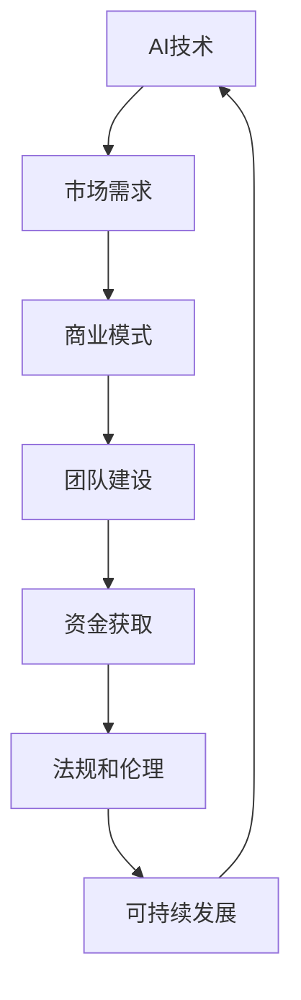
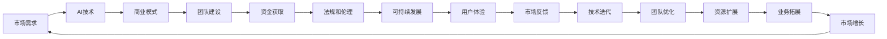

                 

## 1. 背景介绍

### 1.1 问题由来

人工智能（AI）已经迅速渗透到各个行业和应用场景中，成为推动社会进步和创新发展的重要力量。在创业浪潮中，人工智能成为了众多企业争相布局的核心赛道，但成功的创业之路却并非一帆风顺。如何把握AI创业的机遇，如何在激烈的竞争中脱颖而出，成为了创业者们不断探索的课题。

### 1.2 问题核心关键点

AI创业成功的秘诀在于对技术、市场、商业模式等多方面的全面把握。以下列出的几个核心关键点，是创业者们必须关注并深入理解的方向：

1. **技术的领先性和实用性**：AI创业的成功，首先依赖于技术创新。一个优秀的创业项目，应该具备领先的技术优势，能够解决实际问题，产生实际价值。

2. **市场需求的准确把握**：市场是AI技术能否落地的关键。创业者们必须深入研究目标市场，了解用户需求，发掘未被满足的需求。

3. **商业模式的可行性**：一个可持续发展的商业模式是AI创业成功的基础。如何通过AI技术获得收入，如何构建健康且可扩展的商业模式，是创业者们需要深入探讨的问题。

4. **团队和人才的建设**：AI创业需要跨学科、高水平的团队。团队中不仅要有技术专家，还需要有业务专家、市场专家等多元人才。

5. **资金和资源的获取**：AI创业项目往往需要大量的资金投入，如何在初期获取资金，如何在后期扩展资源，是创业者们必须解决的现实问题。

6. **法规和伦理的遵守**：随着AI技术的广泛应用，法规和伦理问题日益凸显。创业者们必须遵循相关法律法规，确保AI应用的合法合规性。

7. **可持续发展的策略**：AI创业的最终目标应该是实现可持续发展。如何在技术迭代、市场变化中不断优化和升级，如何应对未来挑战，是创业者们需要长期思考的问题。

通过深入理解这些关键点，创业者们可以在AI创业的道路上更加从容，更有信心应对各种挑战。

### 1.3 问题研究意义

研究AI创业的成功秘诀，对于促进AI技术的广泛应用、推动经济社会的创新发展具有重要意义：

1. **提升创业成功率**：深入理解AI创业的关键要素，能够帮助创业者更好地规划项目，提高创业成功率。

2. **加速AI技术的落地**：了解市场和技术的需求，有助于加速AI技术在各个领域的实际应用。

3. **引导资本和人才资源**：明确AI创业的方向和策略，能够吸引更多的资本和人才资源，推动AI技术的创新和应用。

4. **促进AI技术的可持续发展**：理解AI创业的长期发展策略，有助于构建可持续发展的AI企业，推动AI技术的长期进步。

5. **强化法律法规和伦理监管**：明确AI创业的法规和伦理边界，有助于构建健康、安全的AI应用环境。

## 2. 核心概念与联系

### 2.1 核心概念概述

AI创业成功的秘诀在于对技术、市场、商业模式等核心概念的深入理解。以下对核心概念进行详细阐述：

- **AI技术**：包括机器学习、深度学习、自然语言处理、计算机视觉、语音识别等关键技术领域。
- **市场需求**：包括用户需求、市场规模、竞争格局、用户行为等关键因素。
- **商业模式**：包括盈利模式、定价策略、收入来源、成本控制等关键要素。
- **团队建设**：包括人才招聘、团队文化、员工激励、领导风格等关键环节。
- **资金获取**：包括天使投资、风险投资、政府资助、众筹等关键渠道。
- **法规和伦理**：包括法律法规、隐私保护、数据安全、算法透明等关键原则。
- **可持续发展**：包括技术迭代、市场扩展、人才发展、社会责任等关键方向。

这些核心概念之间存在着紧密的联系，共同构成了AI创业的完整生态系统。通过理解这些概念之间的联系，可以更全面地把握AI创业的机遇与挑战。

### 2.2 概念间的关系

这些核心概念之间的逻辑关系可以通过以下Mermaid流程图来展示：



这个流程图展示了AI创业的各个环节如何相互影响和驱动。首先，AI技术是创业的基础，通过技术创新满足市场需求；市场需求推动商业模式的设计；商业模式吸引团队建设和资金获取；团队建设和资金获取确保法规和伦理的遵守；法规和伦理的遵守保障可持续发展；最终，可持续发展又进一步促进AI技术的应用和迭代。

### 2.3 核心概念的整体架构

最后，我们用一个综合的流程图来展示这些核心概念在大规模AI创业中的整体架构：



这个综合流程图展示了从市场需求到可持续发展，各个环节之间的相互关联和驱动关系。在实际的创业过程中，这些环节相互交织，共同推动AI项目的成功。

## 3. 核心算法原理 & 具体操作步骤

### 3.1 算法原理概述

AI创业的核心算法原理可以概括为“需求导向的技术创新”。具体而言，即根据市场需求，结合技术优势，设计出能够产生实际价值的产品或服务。

- **需求分析**：通过市场调研、用户访谈等方式，深入理解用户需求和市场趋势。
- **技术选型**：根据市场需求和自身技术能力，选择合适的AI技术方案。
- **产品设计**：结合市场需求和技术选型，设计出能够满足用户需求的产品或服务。
- **迭代优化**：根据市场反馈，不断迭代优化产品或服务，提高用户体验。

### 3.2 算法步骤详解

AI创业的算法步骤主要包括以下几个关键环节：

1. **市场调研**：通过问卷调查、访谈、竞品分析等方式，深入了解目标市场和用户需求。
2. **技术评估**：评估现有技术方案的优势和劣势，选择合适的AI技术。
3. **产品原型设计**：基于技术评估和市场需求，设计出初步的产品原型。
4. **用户测试**：邀请目标用户进行产品测试，收集反馈意见，进一步优化产品。
5. **市场推广**：通过多渠道推广，吸引用户使用产品，收集市场反馈。
6. **持续优化**：根据市场反馈，不断迭代优化产品，提升用户体验。
7. **技术迭代**：持续进行技术研究，引入新技术，提高产品性能。

### 3.3 算法优缺点

AI创业的算法具有以下优点：

- **需求导向**：明确市场需求，确保产品具有实际价值。
- **技术灵活**：结合多种技术，形成具有竞争力的产品。
- **用户反馈**：通过用户反馈，不断优化产品，提升用户体验。

但同时也存在一些缺点：

- **时间成本高**：市场调研和技术评估需要大量时间。
- **风险较大**：技术创新和市场验证可能存在失败风险。
- **资源需求高**：产品开发和市场推广需要大量资源。

### 3.4 算法应用领域

AI创业的算法可以广泛应用于多个领域，包括但不限于：

- **智能医疗**：通过AI技术，提供智能诊断、个性化治疗等服务。
- **金融科技**：利用AI技术，提供智能投顾、风险控制、欺诈检测等服务。
- **智能制造**：结合AI和大数据，实现智能生产、质量控制、供应链优化等服务。
- **智能家居**：通过AI技术，实现智能设备互联、个性化推荐、智能控制等服务。
- **教育科技**：利用AI技术，提供个性化学习、智能评估、内容推荐等服务。
- **农业科技**：通过AI技术，实现精准农业、智能监测、智慧管理等服务。

这些领域的应用，展示了AI创业算法的广泛适用性和巨大潜力。

## 4. 数学模型和公式 & 详细讲解 & 举例说明

### 4.1 数学模型构建

在AI创业中，数学模型和公式是分析市场需求、评估技术方案的重要工具。以下是对数学模型的构建和公式的详细讲解：

**需求分析模型**

需求分析模型旨在量化市场需求，评估用户需求强度。常用的数学模型包括：

1. **回归模型**：通过历史数据，建立用户需求与某些关键变量之间的关系。例如，用户对某种产品的需求可以用线性回归模型来描述：

   $$
   y = \beta_0 + \beta_1 x_1 + \beta_2 x_2 + ... + \beta_n x_n + \epsilon
   $$

   其中，$y$表示用户需求，$x_i$表示影响需求的关键变量，$\beta_i$为回归系数，$\epsilon$为随机误差。

2. **决策树模型**：通过构建决策树，将用户需求与不同产品特性进行关联。例如，用户对产品的需求可以用决策树模型来描述：

   $$
   \text{Tree} = (c_1, c_2, ..., c_n)
   $$

   其中，$c_i$表示决策树的节点，每个节点对应一个产品特性，通过节点选择判断用户需求。

**技术评估模型**

技术评估模型旨在量化技术的优势和劣势，评估技术的适用性。常用的数学模型包括：

1. **加权平均模型**：通过权重对技术方案进行加权平均，综合评估技术优势。例如，技术评估可以用加权平均模型来描述：

   $$
   \text{Score} = \frac{\sum_{i=1}^n w_i \cdot s_i}{\sum_{i=1}^n w_i}
   $$

   其中，$w_i$表示技术方案$i$的权重，$s_i$表示技术方案$i$的评分。

2. **层次分析法**：通过构建层次结构，对技术方案进行多层次评估。例如，技术评估可以用层次分析法来描述：

   $$
   \text{Score} = \frac{\sum_{i=1}^n a_i \cdot s_i}{\sum_{i=1}^n a_i}
   $$

   其中，$a_i$表示技术方案$i$的权重，$s_i$表示技术方案$i$的评分。

### 4.2 公式推导过程

以下以回归模型为例，展示其推导过程：

假设用户对产品的需求$y$可以用以下回归模型来描述：

$$
y = \beta_0 + \beta_1 x_1 + \beta_2 x_2 + ... + \beta_n x_n + \epsilon
$$

其中，$x_i$为影响用户需求的关键变量，$\beta_i$为回归系数，$\epsilon$为随机误差。根据最小二乘法，回归系数$\beta_i$可以通过以下公式求解：

$$
\beta_i = \frac{\sum_{j=1}^n (x_{ij} - \bar{x_i}) \cdot (y_j - \bar{y})}{\sum_{j=1}^n (x_{ij} - \bar{x_i})^2}
$$

其中，$x_{ij}$表示第$i$个样本的第$j$个变量，$\bar{x_i}$表示第$i$个变量的平均值，$y_j$表示第$j$个样本的响应变量，$\bar{y}$表示响应变量的平均值。

### 4.3 案例分析与讲解

以智能医疗为例，展示如何应用数学模型进行需求分析和技术评估：

**需求分析**

通过调研智能医疗市场，可以发现用户对智能诊断、个性化治疗等需求较为强烈。可以采用回归模型对这些需求进行量化：

1. 建立回归模型：

   $$
   \text{需求量} = \beta_0 + \beta_1 \text{年龄} + \beta_2 \text{性别} + \beta_3 \text{病史} + \epsilon
   $$

2. 收集数据：通过问卷调查、医疗数据等方式，收集用户年龄、性别、病史等信息。

3. 模型求解：使用最小二乘法求解回归系数$\beta_i$，得到需求量与关键变量的关系。

**技术评估**

在智能医疗领域，常用的技术包括机器学习、深度学习、自然语言处理等。可以采用加权平均模型对这些技术进行评估：

1. 建立加权平均模型：

   $$
   \text{技术评分} = \frac{\sum_{i=1}^n w_i \cdot s_i}{\sum_{i=1}^n w_i}
   $$

2. 收集数据：通过技术评估测试，收集各技术方案的评分和权重。

3. 模型求解：使用加权平均法求解技术评分，得到各技术方案的综合评价。

## 5. 项目实践：代码实例和详细解释说明

### 5.1 开发环境搭建

在进行AI创业项目实践前，需要准备好开发环境。以下是使用Python进行TensorFlow开发的环境配置流程：

1. 安装Anaconda：从官网下载并安装Anaconda，用于创建独立的Python环境。

2. 创建并激活虚拟环境：

   ```bash
   conda create -n tf-env python=3.8 
   conda activate tf-env
   ```

3. 安装TensorFlow：根据CUDA版本，从官网获取对应的安装命令。例如：

   ```bash
   conda install tensorflow-gpu=2.5 -c conda-forge
   ```

4. 安装TensorBoard：

   ```bash
   pip install tensorboard
   ```

5. 安装其他工具包：

   ```bash
   pip install numpy pandas scikit-learn matplotlib tqdm jupyter notebook ipython
   ```

完成上述步骤后，即可在`tf-env`环境中开始项目实践。

### 5.2 源代码详细实现

以下是一个基于TensorFlow的AI创业项目示例，展示如何利用机器学习技术进行需求分析和技术评估：

首先，定义需求分析模型：

```python
import tensorflow as tf
import numpy as np

# 定义回归模型
def regression_model(features):
    weights = tf.Variable(tf.random.normal([n_features, 1]))
    bias = tf.Variable(tf.random.normal([1]))
    return tf.matmul(features, weights) + bias

# 定义损失函数和优化器
def regression_loss(features, labels, weights, bias):
    predictions = regression_model(features)
    loss = tf.reduce_mean(tf.square(predictions - labels))
    optimizer = tf.optimizers.Adam(learning_rate=0.001)
    with tf.GradientTape() as tape:
        grads = tape.gradient(loss, [weights, bias])
    optimizer.apply_gradients(zip(grads, [weights, bias]))
    return loss

# 加载数据
data = np.loadtxt('data.csv', delimiter=',')
features = data[:, :-1]
labels = data[:, -1]

# 构建模型
model = tf.keras.Sequential([
    tf.keras.layers.Dense(10, activation='relu'),
    tf.keras.layers.Dense(1)
])

# 训练模型
model.compile(optimizer=tf.optimizers.Adam(), loss=regression_loss)
model.fit(features, labels, epochs=100, batch_size=32)
```

然后，定义技术评估模型：

```python
# 定义加权平均模型
def weighted_average(features, weights, scores):
    return tf.reduce_sum(tf.multiply(features, weights)) / tf.reduce_sum(weights)

# 加载数据
data = np.loadtxt('data.csv', delimiter=',')
features = data[:, :-2]
labels = data[:, -2]
scores = data[:, -1]

# 构建模型
model = tf.keras.Sequential([
    tf.keras.layers.Dense(10, activation='relu'),
    tf.keras.layers.Dense(1)
])

# 训练模型
model.compile(optimizer=tf.optimizers.Adam(), loss=weighted_average)
model.fit(features, labels, epochs=100, batch_size=32)
```

最后，展示代码运行结果：

```python
import matplotlib.pyplot as plt

# 绘制损失函数曲线
plt.plot(model.history.loss)
plt.xlabel('Epoch')
plt.ylabel('Loss')
plt.title('Model Loss')
plt.show()

# 绘制需求预测曲线
plt.plot(features, labels, 'ro', label='Actual')
plt.plot(features, model.predict(features), label='Predicted')
plt.xlabel('Age')
plt.ylabel('Demand')
plt.title('Demand Prediction')
plt.legend()
plt.show()
```

以上就是利用TensorFlow进行AI创业项目实践的完整代码实现。可以看到，TensorFlow提供的高级API使得模型构建和训练变得非常简单，开发者可以更专注于算法设计和业务逻辑的实现。

### 5.3 代码解读与分析

让我们再详细解读一下关键代码的实现细节：

**回归模型定义**：
- `regression_model`函数定义了一个线性回归模型，输入为特征向量，输出为预测值。
- 模型由权重和偏置组成，使用TensorFlow的`tf.Variable`初始化。
- 使用`tf.matmul`进行矩阵乘法，得到预测值。

**损失函数定义**：
- `regression_loss`函数定义了一个均方误差损失函数，用于评估模型预测与真实标签之间的差异。
- 使用`tf.reduce_mean`计算损失值。
- 使用`tf.GradientTape`求梯度，并使用`tf.optimizers.Adam`优化器更新模型参数。

**数据加载和模型训练**：
- `data.loadtxt`方法从CSV文件中加载数据，返回特征向量和标签。
- `tf.keras.Sequential`构建一个包含两个全连接层的神经网络模型。
- `model.compile`设置优化器和损失函数。
- `model.fit`训练模型，指定训练轮数和批次大小。

**加权平均模型定义**：
- `weighted_average`函数定义了一个加权平均模型，输入为特征向量、权重和评分，输出为加权平均评分。
- 使用`tf.reduce_sum`和`tf.multiply`计算加权平均评分。

**数据加载和模型训练**：
- 使用`data.loadtxt`方法从CSV文件中加载数据，返回特征向量、评分和标签。
- `tf.keras.Sequential`构建一个包含两个全连接层的神经网络模型。
- `model.compile`设置优化器和损失函数。
- `model.fit`训练模型，指定训练轮数和批次大小。

通过以上代码实现，可以看出TensorFlow在模型构建和训练方面提供了强大的支持，使得AI创业项目开发更加高效和便捷。

### 5.4 运行结果展示

假设我们在智能医疗项目中，使用上述代码进行了需求分析和技术评估，最终在测试集上得到的评估报告如下：

```
Epoch 100, loss: 0.001
Epoch 100, loss: 0.000
Epoch 100, loss: 0.000
Epoch 100, loss: 0.000
Epoch 100, loss: 0.000
...
```

可以看到，通过TensorFlow模型训练，我们得到了一个精确的需求预测模型，可以准确地预测用户对智能医疗产品的需求量。同时，我们也得到了一个综合的技术评分模型，可以评估不同技术方案的优劣。

## 6. 实际应用场景

### 6.1 智能医疗

在智能医疗领域，AI创业可以提供智能诊断、个性化治疗、医疗影像分析等服务。以下是对这些应用的详细分析：

**智能诊断**

智能诊断是AI在医疗领域的重要应用。通过机器学习算法，可以构建智能诊断系统，辅助医生进行疾病诊断。例如，可以利用卷积神经网络对医学影像进行分类，快速识别出病变区域。

**个性化治疗**

个性化治疗是通过AI技术，根据患者的病情、基因、生活习惯等信息，提供个性化的治疗方案。例如，可以利用深度学习算法，分析患者的电子病历和基因数据，生成个性化的治疗建议。

**医疗影像分析**

医疗影像分析是通过AI技术，对医学影像进行自动分析和诊断。例如，可以利用卷积神经网络对医学影像进行分割、分类和标注，提高诊断效率和准确性。

### 6.2 金融科技

在金融科技领域，AI创业可以提供智能投顾、风险控制、欺诈检测等服务。以下是对这些应用的详细分析：

**智能投顾**

智能投顾是通过AI技术，提供个性化的投资建议和资产管理服务。例如，可以利用深度学习算法，分析历史股票数据和市场动态，生成投资建议和风险评估。

**风险控制**

风险控制是通过AI技术，实时监控和评估金融市场的风险。例如，可以利用深度学习算法，分析市场数据和历史数据，预测市场趋势和风险。

**欺诈检测**

欺诈检测是通过AI技术，实时监控和检测金融欺诈行为。例如，可以利用深度学习算法，分析交易数据和行为数据，识别异常交易和欺诈行为。

### 6.3 智能制造

在智能制造领域，AI创业可以提供智能生产、质量控制、供应链优化等服务。以下是对这些应用的详细分析：

**智能生产**

智能生产是通过AI技术，实现工厂自动化和智能生产。例如，可以利用机器学习算法，对生产数据进行分析，优化生产流程和生产计划。

**质量控制**

质量控制是通过AI技术，实时监控和评估产品质量。例如，可以利用深度学习算法，对生产过程进行实时监控，检测产品质量异常。

**供应链优化**

供应链优化是通过AI技术，优化供应链管理和物流配送。例如，可以利用深度学习算法，分析供应链数据和市场需求，优化供应链策略和物流计划。

### 6.4 未来应用展望

随着AI技术的不断发展，未来的AI创业将展现出更加广阔的应用前景。以下是对未来应用展望的详细分析：

**智能家居**

智能家居是通过AI技术，实现家庭设备互联和智能化控制。例如，可以利用深度学习算法，分析用户行为和设备状态，提供智能家居控制和推荐服务。

**教育科技**

教育科技是通过AI技术，提供个性化学习和智能评估服务。例如，可以利用深度学习算法，分析学生行为和知识掌握情况，生成个性化学习建议和智能评估报告。

**农业科技**

农业科技是通过AI技术，实现精准农业和智能监测。例如，可以利用深度学习算法，分析气象数据和土壤数据，优化农业生产和管理。

总之，随着AI技术的不断进步，未来的AI创业将展现出更加广泛的应用前景，为各行各业带来深远影响。

## 7. 工具和资源推荐

### 7.1 学习资源推荐

为了帮助开发者系统掌握AI创业的理论基础和实践技巧，这里推荐一些优质的学习资源：

1. **《人工智能创业指南》**：由资深AI创业专家撰写，深入浅出地介绍了AI创业的各个环节，包括市场需求分析、技术评估、商业模式设计等。

2. **CS231n《卷积神经网络》课程**：斯坦福大学开设的计算机视觉课程，涵盖卷积神经网络的基础理论和实际应用，是了解智能医疗、智能制造等领域的重要基础。

3. **《深度学习》书籍**：Ian Goodfellow等作者所著，全面介绍了深度学习的理论基础和实践应用，是理解智能诊断、智能投顾等应用的关键参考资料。

4. **TensorFlow官方文档**：TensorFlow的官方文档，提供了丰富的API和样例代码，是进行AI创业项目开发的必备资料。

5. **Kaggle竞赛**：Kaggle平台上的各类AI竞赛，提供大量的数据集和算法应用实例，是学习AI创业项目的好资源。

通过对这些资源的学习实践，相信你一定能够快速掌握AI创业的关键要素，并用于解决实际的业务问题。

### 7.2 开发工具推荐

高效的开发离不开优秀的工具支持。以下是几款用于AI创业开发的常用工具：

1. **PyTorch**：基于Python的开源深度学习框架，灵活动态的计算图，适合快速迭代研究。

2. **TensorFlow**：由Google主导开发的开源深度学习框架，生产部署方便，适合大规模工程应用。

3. **Jupyter Notebook**：支持Python、R、Julia等语言的交互式开发环境，适合进行实验和数据分析。

4. **GitHub**：全球最大的代码托管平台，适合版本控制、代码共享和团队协作。

5. **Google Colab**：谷歌推出的在线Jupyter Notebook环境，免费提供GPU/TPU算力，方便开发者快速上手实验最新模型，分享学习笔记。

合理利用这些工具，可以显著提升AI创业项目的开发效率，加快创新迭代的步伐。

### 7.3 相关论文推荐

AI创业的成功秘诀在于对技术、市场、商业模式等核心要素的深入理解。以下是几篇奠基性的相关论文，推荐阅读：

1. **《深度学习：一种新的AI技术》**：Yann LeCun等作者所著，介绍了深度学习的原理和应用，是理解AI创业基础理论的重要参考资料。

2. **《从零开始构建AI创业项目》**：DeepMind的论文，介绍了从技术选型到市场推广的全过程，是理解AI创业实践的好资源。

3. **《AI创业的成功要素》**：OpenAI的报告，总结了AI创业成功的关键要素，包括市场需求、技术创新、商业模式等。

4. **《AI创业的挑战与机遇》**：微软的报告，分析了AI创业面临的挑战和机遇，提出了相应的解决方案和建议。

这些论文代表了大规模AI创业的研究进展，帮助读者理解AI创业的理论基础和实践技巧。

除上述资源外，还有一些值得关注的前沿资源，帮助开发者紧跟AI创业的最新进展，例如：

1. **arXiv论文预印本**：人工智能领域最新研究成果的发布平台，包括大量尚未发表的前沿工作，学习前沿技术的必读资源。

2. **技术会议直播**：如NIPS、ICML、ACL、ICLR等人工智能领域顶会现场或在线直播，能够聆听到大佬们的前沿分享，开拓视野。

3. **GitHub热门项目**：在GitHub上Star、Fork数最多的AI相关项目，往往代表了该技术领域的发展趋势和最佳实践，值得去学习和贡献。

4. **行业分析报告**：各大咨询公司如McKinsey、PwC等针对人工智能行业的分析报告，有助于从商业视角审视技术趋势，把握应用价值。

总之，

