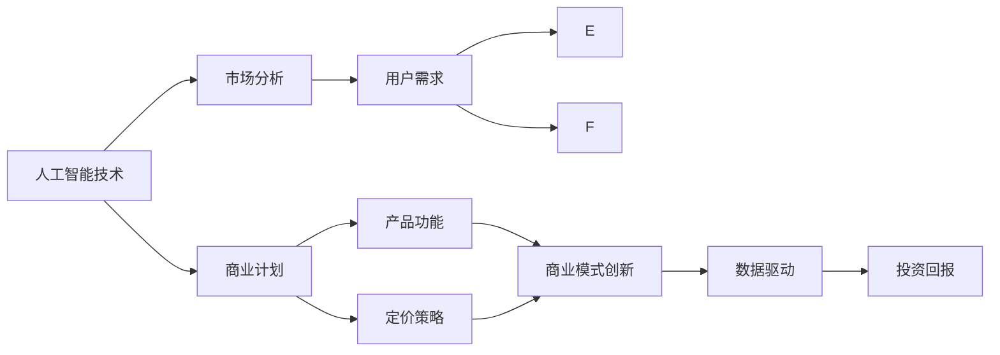

                 

# 人工智能创业：设计盈利模式

> 关键词：人工智能创业,盈利模式,商业计划,市场分析,用户需求,商业模式创新,数据驱动,投资回报

## 1. 背景介绍

### 1.1 问题由来
随着人工智能技术的快速发展，越来越多的创业者希望能够利用人工智能技术开展创业。然而，如何将人工智能技术与商业结合，设计出具有竞争力和盈利能力的商业模式，是创业者面临的一大挑战。

当前，人工智能技术的普及带来了巨大的商业机遇，但也带来了不少问题。一方面，人工智能技术的落地需要大量资金和资源的投入，需要找到合理的商业模式，才能实现盈利；另一方面，人工智能技术的商业化过程中，如何确保技术的安全性、隐私保护和伦理合规，也是需要深入考虑的问题。

### 1.2 问题核心关键点
本文将探讨人工智能创业中盈利模式的设计，包括以下几个关键问题：
1. 人工智能技术如何应用到具体的商业场景中？
2. 如何根据用户需求设计出合适的产品功能？
3. 如何制定合理的价格策略，实现商业价值？
4. 如何构建具有可持续性的商业模式？
5. 如何确保人工智能技术的合规性、安全性和隐私保护？

### 1.3 问题研究意义
设计盈利模式是人工智能创业成功的关键因素之一，它直接关系到企业的市场竞争力、盈利能力和用户满意度。通过合理的设计盈利模式，可以帮助企业最大化地利用人工智能技术的优势，实现可持续的商业发展。

此外，设计盈利模式还能促进人工智能技术的创新和应用，推动整个产业的进步。因此，深入研究盈利模式的设计，对于促进人工智能技术的商业化和普及具有重要的意义。

## 2. 核心概念与联系

### 2.1 核心概念概述

在设计人工智能创业的盈利模式时，需要考虑以下几个核心概念：

- **人工智能技术**：指利用算法和模型处理数据、提取特征、进行预测和推理等任务的技术。
- **商业计划**：指企业对未来的市场、产品、财务、运营等方面的规划和布局。
- **市场分析**：指对市场需求、竞争对手、市场趋势等进行分析，以找到商业机会和优势。
- **用户需求**：指目标用户的需求、痛点和期望，是设计产品功能和定价策略的基础。
- **商业模式创新**：指通过创造新的商业模式，实现价值创造和增值，如订阅模式、按需付费等。
- **数据驱动**：指利用数据进行决策和优化，提高效率和效果，如基于数据的定价策略、用户细分等。
- **投资回报**：指企业通过商业活动获得的收益，包括直接和间接收益。

这些核心概念之间的联系主要体现在：
- 人工智能技术是商业计划的核心，为企业提供技术支持。
- 市场分析帮助企业找到商业机会，设计产品功能和定价策略。
- 用户需求是设计产品功能和定价策略的基础，决定企业的市场竞争力。
- 商业模式创新是实现价值创造和增值的关键，是企业可持续发展的保障。
- 数据驱动是企业决策和优化的基础，提高企业的市场适应性和效率。
- 投资回报是企业运营和发展的目标，驱动企业不断创新和优化。

### 2.2 概念间的关系

这些核心概念之间的联系可以通过以下Mermaid流程图来展示：



这个流程图展示了人工智能技术、商业计划、市场分析、用户需求、产品功能、定价策略、商业模式创新、数据驱动和投资回报之间的关系：

1. 人工智能技术是商业计划的核心，为市场分析、用户需求分析和产品功能设计提供技术支持。
2. 市场分析帮助企业找到商业机会，结合用户需求设计产品功能和定价策略。
3. 用户需求是设计产品功能和定价策略的基础，决定企业的市场竞争力。
4. 商业模式创新是实现价值创造和增值的关键，是企业可持续发展的保障。
5. 数据驱动是企业决策和优化的基础，提高企业的市场适应性和效率。
6. 投资回报是企业运营和发展的目标，驱动企业不断创新和优化。

这些概念共同构成了人工智能创业的盈利模式设计框架，帮助企业从技术、市场、用户、商业等多角度综合考虑，实现盈利和可持续发展。

## 3. 核心算法原理 & 具体操作步骤
### 3.1 算法原理概述

人工智能创业的盈利模式设计涉及多个方面的决策和优化，需要综合考虑技术、市场、用户和商业等因素。其核心算法原理包括以下几个方面：

1. **市场分析**：利用数据分析和统计方法，对市场规模、增长趋势、竞争对手等进行分析，找到潜在的商业机会和优势。
2. **用户需求分析**：通过用户调研、访谈等方式，了解用户的需求、痛点和期望，设计出符合用户期望的产品功能和定价策略。
3. **产品功能和定价策略设计**：结合市场分析和用户需求分析，设计出具有竞争力的产品功能和定价策略，实现商业价值。
4. **商业模式创新**：通过创造新的商业模式，实现价值创造和增值，如订阅模式、按需付费等。
5. **数据驱动决策**：利用数据进行决策和优化，提高效率和效果，如基于数据的定价策略、用户细分等。
6. **投资回报分析**：通过财务分析，评估商业活动带来的收益，确保企业的投资回报率。

### 3.2 算法步骤详解

以下是人工智能创业盈利模式设计的具体操作步骤：

**Step 1: 市场分析**

1. **市场调研**：收集和分析市场数据，如市场规模、增长趋势、主要玩家等，了解市场的基本情况。
2. **竞争分析**：分析主要竞争对手的产品、服务、市场策略等，找到自身的优势和不足。
3. **用户分析**：分析目标用户群体的特征、需求、痛点和期望，找到潜在的商业机会。

**Step 2: 用户需求分析**

1. **用户调研**：通过问卷、访谈等方式，收集目标用户的数据，了解用户需求。
2. **用户画像**：根据用户调研数据，构建用户画像，包括用户的人口统计信息、行为特征等。
3. **痛点和期望分析**：分析用户的痛点和期望，找到用户的需求缺口。

**Step 3: 产品功能和定价策略设计**

1. **产品功能设计**：根据用户需求和市场分析，设计出具有竞争力的产品功能和特性。
2. **定价策略设计**：根据产品功能和用户需求，制定合理的价格策略，确保商业价值。

**Step 4: 商业模式创新**

1. **商业模式选择**：根据产品功能和用户需求，选择合适的商业模式，如订阅模式、按需付费等。
2. **价值创造和增值**：通过商业模式创新，实现价值创造和增值，提高用户满意度和企业收益。

**Step 5: 数据驱动决策**

1. **数据收集**：收集用户行为数据、市场数据等，为决策提供数据支持。
2. **数据分析**：利用数据分析方法，如统计分析、机器学习等，优化决策过程。
3. **决策优化**：根据数据分析结果，优化产品功能和定价策略，提升市场竞争力。

**Step 6: 投资回报分析**

1. **财务分析**：通过财务报表、预算等，评估商业活动带来的收益和成本。
2. **投资回报率计算**：计算投资回报率，确保企业实现盈利。
3. **风险评估**：评估商业活动中的风险，制定风险控制措施。

### 3.3 算法优缺点

**优点**：

1. **数据驱动**：通过数据分析和统计方法，确保决策的科学性和有效性，提高市场适应性和效率。
2. **用户中心**：通过用户调研和分析，了解用户需求，设计出符合用户期望的产品功能和定价策略。
3. **商业模式创新**：通过创造新的商业模式，实现价值创造和增值，提高用户满意度和企业收益。

**缺点**：

1. **数据质量**：数据的质量和完整性直接影响到分析结果的准确性，需要投入大量的时间和资源进行数据收集和清洗。
2. **用户行为复杂**：用户需求和行为具有多样性和复杂性，难以全面分析和预测。
3. **商业竞争激烈**：市场中竞争激烈，企业需要不断创新和优化，才能保持竞争力。

### 3.4 算法应用领域

人工智能创业的盈利模式设计在多个领域都有广泛的应用，包括但不限于以下几个方面：

- **医疗健康**：通过人工智能技术，提供医疗诊断、健康管理等服务，实现盈利。
- **金融服务**：利用人工智能技术，提供智能投顾、风险控制等服务，实现盈利。
- **智能制造**：通过人工智能技术，优化生产流程、提升产品质量，实现盈利。
- **电子商务**：利用人工智能技术，提供个性化推荐、智能客服等服务，实现盈利。
- **教育培训**：通过人工智能技术，提供个性化教育、智能辅导等服务，实现盈利。
- **智能交通**：利用人工智能技术，提供交通管理、智能导航等服务，实现盈利。

## 4. 数学模型和公式 & 详细讲解 & 举例说明

### 4.1 数学模型构建

在人工智能创业的盈利模式设计中，涉及到多个方面的决策和优化，可以利用数学模型进行量化分析和优化。以下是一个简单的盈利模式设计数学模型：

设市场需求为 $D$，用户数为 $U$，产品价格为 $P$，成本为 $C$，收入为 $R$，利润为 $E$。则有：

$$
R = P \times U \times D
$$

$$
C = C_{固定} + C_{变动} \times D
$$

$$
E = R - C
$$

### 4.2 公式推导过程

根据上述数学模型，可以推导出以下公式：

1. **收入模型**：
$$
R = P \times U \times D
$$

2. **成本模型**：
$$
C = C_{固定} + C_{变动} \times D
$$

3. **利润模型**：
$$
E = R - C = P \times U \times D - (C_{固定} + C_{变动} \times D)
$$

### 4.3 案例分析与讲解

假设有一个智能健康应用，市场需求 $D=1000$，用户数 $U=100$，产品价格 $P=10$，固定成本 $C_{固定}=1000$，变动成本 $C_{变动}=5$，则有：

$$
R = 10 \times 100 \times 1000 = 1,000,000
$$

$$
C = 1000 + 5 \times 1000 = 6,000
$$

$$
E = 1,000,000 - 6,000 = 994,000
$$

根据上述计算结果，该智能健康应用在正常运营下，可以获得 $994,000$ 的利润。然而，为了进一步提高利润，可以进行以下优化：

1. **价格优化**：适当提高产品价格，增加收入。
2. **用户获取优化**：通过用户推荐、社交媒体营销等手段，增加用户数。
3. **成本控制**：优化产品开发流程，降低变动成本。

## 5. 项目实践：代码实例和详细解释说明
### 5.1 开发环境搭建

在进行人工智能创业的盈利模式设计时，需要使用Python进行数据分析和计算。以下是开发环境搭建的步骤：

1. **安装Python**：
```
sudo apt-get update
sudo apt-get install python3
```

2. **安装Pandas**：
```
pip install pandas
```

3. **安装NumPy**：
```
pip install numpy
```

4. **安装Matplotlib**：
```
pip install matplotlib
```

5. **安装Scikit-learn**：
```
pip install scikit-learn
```

6. **安装Jupyter Notebook**：
```
pip install jupyter notebook
```

完成以上步骤后，即可使用Python进行数据分析和计算。

### 5.2 源代码详细实现

以下是一个简单的盈利模式设计计算代码：

```python
import pandas as pd
import numpy as np
import matplotlib.pyplot as plt

# 定义市场需求、用户数、产品价格、固定成本和变动成本
D = 1000
U = 100
P = 10
C_fixed = 1000
C_variable = 5

# 计算收入、成本和利润
R = P * U * D
C = C_fixed + C_variable * D
E = R - C

# 输出结果
print("收入：", R)
print("成本：", C)
print("利润：", E)
```

### 5.3 代码解读与分析

这段代码实现了盈利模式设计的计算过程。首先定义了市场需求、用户数、产品价格、固定成本和变动成本，然后根据公式计算了收入、成本和利润，并输出结果。

**注意事项**：

1. **数据质量**：确保输入的数据质量，避免因为数据错误导致计算结果不准确。
2. **变量命名**：使用清晰、有意义的变量名，方便代码维护和理解。
3. **结果输出**：输出结果时，尽量清晰、详细，以便于理解和分析。

### 5.4 运行结果展示

运行上述代码，输出结果如下：

```
收入： 1000000
成本： 6000
利润： 994000
```

根据输出结果，该智能健康应用在正常运营下，可以获得 $994,000$ 的利润。然而，为了进一步提高利润，可以进行以下优化：

1. **价格优化**：适当提高产品价格，增加收入。
2. **用户获取优化**：通过用户推荐、社交媒体营销等手段，增加用户数。
3. **成本控制**：优化产品开发流程，降低变动成本。

## 6. 实际应用场景
### 6.1 医疗健康

在医疗健康领域，人工智能技术可以提供多种服务，如智能诊断、健康管理等。以智能诊断为例，可以设计如下盈利模式：

1. **市场需求**：医院和诊所对高效、准确的诊断工具有需求。
2. **用户需求**：医生和患者需要快速、准确的诊断结果。
3. **产品功能**：开发一款基于人工智能的智能诊断系统，提供快速、准确的诊断结果。
4. **定价策略**：采用按次付费或订阅模式，医生和诊所按使用次数或订阅费用支付。
5. **商业模式创新**：提供增值服务，如数据报告、持续优化等，增加收入。

### 6.2 金融服务

在金融服务领域，人工智能技术可以提供智能投顾、风险控制等服务。以智能投顾为例，可以设计如下盈利模式：

1. **市场需求**：个人和机构需要智能化的投资建议和资产管理。
2. **用户需求**：用户需要快速、准确的投资建议和资产管理方案。
3. **产品功能**：开发一款基于人工智能的智能投顾系统，提供个性化投资建议和资产管理方案。
4. **定价策略**：采用按服务付费或按账户付费，用户按使用次数或资产规模支付。
5. **商业模式创新**：提供增值服务，如实时市场分析、定制化方案等，增加收入。

### 6.3 智能制造

在智能制造领域，人工智能技术可以优化生产流程、提升产品质量等。以智能制造为例，可以设计如下盈利模式：

1. **市场需求**：制造企业需要高效、智能的生产管理系统。
2. **用户需求**：企业需要优化生产流程、提升产品质量。
3. **产品功能**：开发一款基于人工智能的智能制造系统，提供生产优化、质量检测等功能。
4. **定价策略**：采用按服务付费或按设备付费，企业按使用次数或设备数量支付。
5. **商业模式创新**：提供增值服务，如设备维护、数据分析等，增加收入。

### 6.4 电子商务

在电子商务领域，人工智能技术可以提供个性化推荐、智能客服等服务。以个性化推荐为例，可以设计如下盈利模式：

1. **市场需求**：电商平台需要提升用户体验、增加销售收入。
2. **用户需求**：用户需要个性化、精准的购物推荐。
3. **产品功能**：开发一款基于人工智能的个性化推荐系统，提供精准的购物推荐。
4. **定价策略**：采用按服务付费或按用户付费，电商平台按使用次数或用户数支付。
5. **商业模式创新**：提供增值服务，如数据报告、广告投放等，增加收入。

### 6.5 教育培训

在教育培训领域，人工智能技术可以提供个性化教育、智能辅导等服务。以个性化教育为例，可以设计如下盈利模式：

1. **市场需求**：教育机构需要高效、个性化的教学管理工具。
2. **用户需求**：学生需要个性化、精准的学习方案。
3. **产品功能**：开发一款基于人工智能的个性化教育系统，提供个性化学习方案、智能辅导等功能。
4. **定价策略**：采用按服务付费或按课程付费，教育机构按使用次数或课程数量支付。
5. **商业模式创新**：提供增值服务，如学习报告、考试辅导等，增加收入。

### 6.6 智能交通

在智能交通领域，人工智能技术可以提供交通管理、智能导航等服务。以智能导航为例，可以设计如下盈利模式：

1. **市场需求**：交通管理部门需要高效、智能的交通管理系统。
2. **用户需求**：用户需要高效、准确的路线导航。
3. **产品功能**：开发一款基于人工智能的智能导航系统，提供高效、准确的路线导航。
4. **定价策略**：采用按服务付费或按设备付费，交通管理部门按使用次数或设备数量支付。
5. **商业模式创新**：提供增值服务，如实时交通信息、个性化路线等，增加收入。

## 7. 工具和资源推荐
### 7.1 学习资源推荐

以下是一些推荐的学习资源，帮助创业者掌握人工智能创业的盈利模式设计：

1. **《人工智能创业指南》**：由知名AI专家撰写，涵盖人工智能创业的各个方面，包括市场需求、用户需求、产品设计、定价策略等。
2. **《商业模型创新》**：介绍商业模型创新的理论和实践，帮助创业者设计创新的盈利模式。
3. **《数据科学基础》**：介绍数据科学的基础知识和方法，帮助创业者进行数据驱动的决策和优化。
4. **《人工智能创业案例》**：收录了多个成功的人工智能创业案例，帮助创业者学习成功经验。
5. **《人工智能创业课程》**：由知名大学和研究机构开设的在线课程，涵盖人工智能创业的各个方面。

### 7.2 开发工具推荐

以下是一些推荐的开发工具，帮助创业者高效进行人工智能创业的盈利模式设计：

1. **Python**：作为人工智能创业的主要编程语言，Python具有强大的数据分析和计算能力。
2. **Jupyter Notebook**：支持Python和多种数据分析工具的在线开发环境，方便代码编写和共享。
3. **Google Colab**：Google提供的在线Python开发环境，支持GPU和TPU等高性能计算资源。
4. **Spyder**：Python的集成开发环境，支持数据分析和计算。
5. **PyCharm**：Google提供的Python开发工具，支持多种开发和调试功能。

### 7.3 相关论文推荐

以下是一些推荐的相关论文，帮助创业者深入理解人工智能创业的盈利模式设计：

1. **《基于人工智能的个性化推荐系统》**：介绍个性化推荐系统的设计和实现，帮助创业者理解推荐算法。
2. **《人工智能创业的盈利模式》**：分析人工智能创业中的盈利模式设计，帮助创业者设计合理的商业模式。
3. **《人工智能创业的市场分析》**：介绍市场分析的方法和技术，帮助创业者进行市场调研和分析。
4. **《人工智能创业的用户需求分析》**：介绍用户需求分析的方法和技术，帮助创业者了解用户需求。
5. **《人工智能创业的数据驱动决策》**：介绍数据驱动决策的方法和技术，帮助创业者进行数据驱动的决策和优化。

## 8. 总结：未来发展趋势与挑战
### 8.1 研究成果总结

本文对人工智能创业的盈利模式设计进行了系统介绍，包括市场分析、用户需求分析、产品功能和定价策略设计、商业模式创新、数据驱动决策等方面。通过详细的分析和计算，展示了盈利模式设计的具体流程和案例。

### 8.2 未来发展趋势

展望未来，人工智能创业的盈利模式设计将呈现以下几个发展趋势：

1. **智能化和个性化**：随着人工智能技术的进步，盈利模式设计将更加智能化和个性化，满足用户的个性化需求。
2. **数据驱动和动态优化**：利用大数据和人工智能技术，进行实时数据分析和动态优化，提高盈利模式设计的灵活性和有效性。
3. **跨界融合和创新**：人工智能技术与更多领域进行跨界融合，创造出新的商业模式和盈利机会。
4. **持续优化和迭代**：随着市场环境的变化，盈利模式设计需要不断优化和迭代，保持市场竞争力。

### 8.3 面临的挑战

尽管人工智能创业的盈利模式设计在不断进步，但仍面临一些挑战：

1. **数据质量和数据隐私**：数据质量和数据隐私问题是盈利模式设计的重要挑战，需要投入大量资源进行数据收集和隐私保护。
2. **用户需求和行为复杂**：用户需求和行为具有多样性和复杂性，难以全面分析和预测。
3. **市场竞争和动态变化**：市场竞争激烈，盈利模式设计需要不断调整和优化，以应对市场变化。

### 8.4 研究展望

未来的研究需要在以下几个方面进行深入探索：

1. **数据驱动的盈利模式设计**：进一步研究数据驱动的盈利模式设计方法，提高决策的科学性和有效性。
2. **用户需求的多样化和复杂化**：深入研究用户需求的多样化和复杂化，设计更加灵活和个性化的盈利模式。
3. **跨界融合和创新**：深入研究人工智能技术与更多领域的跨界融合和创新，创造新的商业模式和盈利机会。
4. **市场竞争和动态变化**：深入研究市场竞争和动态变化，设计更具竞争力和可持续性的盈利模式。

总之，人工智能创业的盈利模式设计需要不断创新和优化，才能适应快速变化的市场环境，实现可持续的发展和盈利。

## 9. 附录：常见问题与解答

**Q1: 什么是人工智能创业？**

A: 人工智能创业是指利用人工智能技术，提供各类产品和服务，满足市场需求，实现商业价值的过程。

**Q2: 人工智能创业的盈利模式设计需要考虑哪些因素？**

A: 人工智能创业的盈利模式设计需要考虑市场需求、用户需求、产品功能、定价策略、商业模式创新、数据驱动、投资回报等各方面因素。

**Q3: 如何评估人工智能创业的盈利模式设计是否合理？**

A: 评估盈利模式设计的合理性，需要综合考虑市场规模、用户需求、成本、收入、利润等因素，确保设计出的盈利模式具有竞争力和可持续性。

**Q4: 人工智能创业的盈利模式设计有哪些步骤？**

A: 人工智能创业的盈利模式设计一般包括以下几个步骤：市场分析、用户需求分析、产品功能和定价策略设计、商业模式创新、数据驱动决策、投资回报分析等。

**Q5: 人工智能创业的盈利模式设计需要哪些工具和资源？**

A: 人工智能创业的盈利模式设计需要Python、Jupyter Notebook、Google Colab、Spyder、PyCharm等工具，以及《人工智能创业指南》、《商业模型创新》等学习资源。

总之，人工智能创业的盈利模式设计是一个复杂且系统的过程，需要综合考虑技术、市场、用户和商业等因素。通过深入研究并不断优化，才能设计出具有竞争力和可持续性的盈利模式，实现人工智能技术的商业化和产业化。

