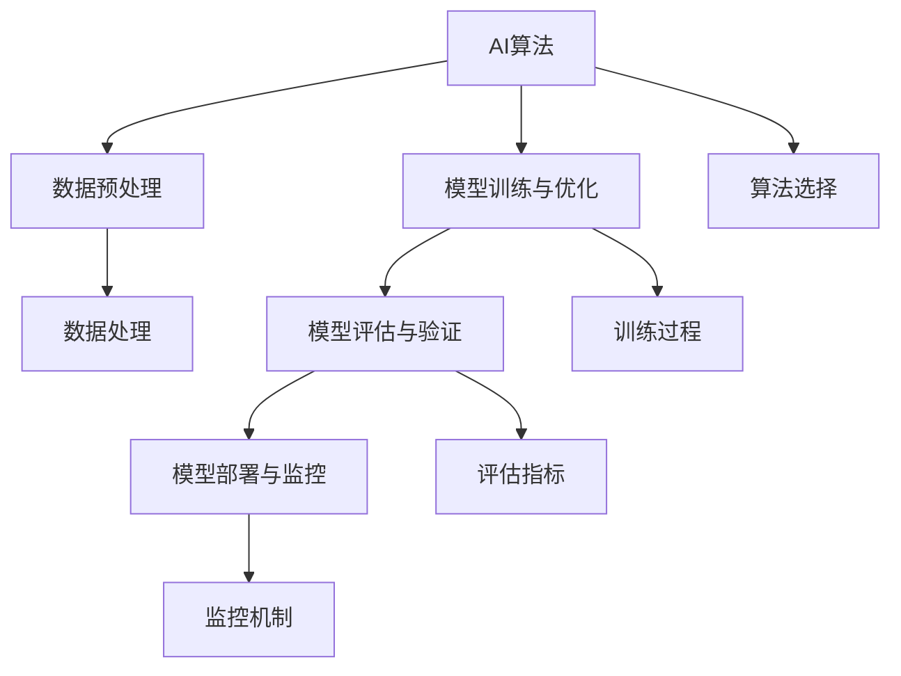

                 

# 人工智能创业：项目的技术选择

## 1. 背景介绍

### 1.1 问题由来
人工智能（AI）技术的快速发展正在深刻影响各行各业，从自动化流程、数据分析到人机交互，AI技术正在全面重塑商业和社会生态。对于初创公司而言，如何在人工智能领域选择合适的技术路线，构建具有竞争力的产品，是一个关键挑战。本文将系统介绍如何选择和应用AI技术，从算法选择、技术栈搭建到实际项目实践，提供全面的技术指南。

### 1.2 问题核心关键点
技术选择是AI创业的核心问题，涉及多个方面：
- 选择合适的算法框架和模型
- 构建高效的计算和存储体系
- 设计和实施合理的工程架构
- 管理数据和模型的生命周期
- 确保产品和服务的可靠性和安全性

本文将详细探讨这些关键点，提供全面的技术选择建议，帮助AI创业者构建具有竞争力和未来前景的AI项目。

### 1.3 问题研究意义
正确选择和应用AI技术，对于AI创业的成功至关重要。一个好的技术选择不仅可以提升产品性能，降低开发成本，还可以保证产品具有良好的用户体验和市场竞争力。同时，合理的技术选择也是企业实现长期可持续发展的基石。通过科学的技术选择，AI创业者可以实现更高效的资源利用，快速迭代产品，快速响应用户需求，提升企业价值。

## 2. 核心概念与联系

### 2.1 核心概念概述

在深入探讨技术选择前，需要了解一些核心概念及其相互联系：

- **AI算法**：是AI系统的核心，用于解决特定任务，包括分类、回归、聚类、生成等。常见的AI算法包括决策树、神经网络、支持向量机、深度学习等。
- **数据预处理**：涉及数据清洗、特征提取、归一化等，是构建高质量AI模型的前提。
- **模型训练与优化**：包括模型选择、损失函数设计、优化器设置等，是模型调优和性能提升的关键。
- **模型评估与验证**：通过交叉验证、A/B测试等方法，评估模型在实际数据集上的表现，并进行模型调参和优化。
- **模型部署与监控**：将训练好的模型部署到生产环境，并持续监控其性能，确保模型在实际应用中的稳定性和可靠性。

这些概念之间相互关联，构成了AI项目开发和实施的基础框架。

### 2.2 概念间的关系

以下是这些核心概念间的关系图：



这个关系图展示了AI项目开发过程中各概念的相互依赖和交互：

1. 数据预处理是算法应用的先决条件。
2. 模型训练与优化基于算法和数据，是模型调优的关键步骤。
3. 模型评估与验证通过测试集对模型进行验证，并指导模型调优。
4. 模型部署与监控确保模型在实际应用中的稳定性和性能。
5. 算法选择直接影响数据处理和模型训练的过程。
6. 数据处理是数据预处理和模型训练的基础。
7. 训练过程依赖于算法和数据，直接影响模型的性能。
8. 评估指标指导模型调优，反映模型在测试集上的表现。
9. 监控机制保证模型在实际应用中的稳定性和可靠性。

这些概念共同构成了一个完整的AI项目开发流程，每个环节都需要细致考虑和严格执行。

## 3. 核心算法原理 & 具体操作步骤
### 3.1 算法原理概述

AI算法的选择是技术选择的关键环节。一个好的算法选择不仅需要考虑算法本身的性能和适用性，还需要结合具体应用场景和数据特点进行选择。

AI算法的选择主要考虑以下因素：
- **算法性能**：包括准确率、召回率、F1分数等指标。
- **算法复杂度**：涉及计算资源的消耗和训练时间的长短。
- **算法可解释性**：涉及模型的透明度和可解释性，对于某些应用场景非常重要。
- **算法适用性**：涉及算法的适用性和可扩展性。

在实际应用中，常用的AI算法框架包括TensorFlow、PyTorch、Scikit-Learn、Keras等。这些框架提供了丰富的算法实现和高效的计算图，可以方便地构建和训练AI模型。

### 3.2 算法步骤详解

AI算法选择和应用主要包括以下步骤：

**Step 1: 算法评估**
- 根据具体应用场景，列出候选算法。
- 在测试集上评估候选算法的性能，对比不同算法的优劣。

**Step 2: 算法选择**
- 根据评估结果，选择最适合的算法。

**Step 3: 模型训练与调优**
- 构建训练集、验证集和测试集。
- 选择合适的优化器（如SGD、Adam）和超参数（如学习率、批大小）。
- 使用交叉验证等方法进行模型调优。

**Step 4: 模型评估与验证**
- 使用测试集评估模型性能。
- 使用A/B测试等方法验证模型的稳定性。

**Step 5: 模型部署与监控**
- 将训练好的模型部署到生产环境。
- 使用监控工具持续监控模型性能。

### 3.3 算法优缺点

不同的AI算法有不同的优缺点，选择算法时需要综合考虑：

**优点**：
- **准确率高**：某些算法（如深度学习）在特定任务上可以达到较高的准确率。
- **可解释性强**：一些传统算法（如决策树）具有较好的可解释性，便于理解和调试。
- **可扩展性好**：一些算法（如深度学习）可以方便地扩展到大规模数据和复杂模型。

**缺点**：
- **计算资源消耗大**：深度学习等算法需要大量的计算资源和时间进行训练。
- **模型复杂度高**：深度学习等算法模型复杂，难以解释和调试。
- **数据需求高**：某些算法（如深度学习）需要大量的标注数据进行训练。

### 3.4 算法应用领域

不同的AI算法在不同的应用领域有不同的表现和适用性。以下是一些常见的应用领域及推荐算法：

**图像识别**：推荐使用卷积神经网络（CNN），如TensorFlow中的Keras实现。
**语音识别**：推荐使用递归神经网络（RNN）或长短时记忆网络（LSTM），如Kaldi或DeepSpeech实现。
**自然语言处理**：推荐使用循环神经网络（RNN）或变换器（Transformer），如TensorFlow或PyTorch实现。
**推荐系统**：推荐使用矩阵分解（Matrix Factorization）或深度学习模型（如Embedding），如TensorFlow或Scikit-Learn实现。

## 4. 数学模型和公式 & 详细讲解 & 举例说明

### 4.1 数学模型构建

在AI算法选择和应用中，数学模型和公式的选择非常重要。以下是一些常用的数学模型和公式及其应用场景：

**线性回归模型**：用于解决回归问题，公式如下：

$$
y = w_0 + w_1x_1 + \ldots + w_nx_n + b
$$

**逻辑回归模型**：用于解决二分类问题，公式如下：

$$
P(y=1|x) = \frac{1}{1+\exp(-\hat{y})}
$$

**支持向量机（SVM）**：用于解决分类和回归问题，公式如下：

$$
f(x) = \sum_{i=1}^n \alpha_i y_i k(x_i,x) + b
$$

**神经网络模型**：用于解决复杂的分类和回归问题，公式如下：

$$
z_i = w_1x_i + b_1
$$
$$
a_i = \max(0, z_i)
$$
$$
y = w_2a_i + b_2
$$

这些数学模型和公式为AI算法的实现提供了坚实的数学基础，帮助开发者更好地理解和应用AI技术。

### 4.2 公式推导过程

以线性回归模型为例，进行公式推导过程：

**假设数据**：有N个样本 $(x_i, y_i)$，其中 $x_i \in \mathbb{R}^n$，$y_i \in \mathbb{R}$。

**目标函数**：最小化损失函数，通常使用均方误差（MSE）：

$$
L(w) = \frac{1}{2N} \sum_{i=1}^N (y_i - f(x_i))^2
$$

**梯度下降**：使用梯度下降算法更新参数：

$$
w_j \leftarrow w_j - \alpha \frac{\partial L(w)}{\partial w_j}
$$

其中 $\alpha$ 为学习率。

通过以上步骤，可以得到线性回归模型的最小二乘估计公式：

$$
w = (X^T X)^{-1} X^T y
$$

通过数学模型和公式的推导，可以深入理解AI算法的原理和实现方式，为开发者提供坚实的理论基础。

### 4.3 案例分析与讲解

**案例1：图像识别**
- 算法：卷积神经网络（CNN）
- 数据：大规模图像数据集，如ImageNet
- 模型：LeNet、AlexNet、VGGNet等
- 应用：图像分类、目标检测、图像分割

**案例2：自然语言处理**
- 算法：Transformer
- 数据：大规模文本语料库，如Wikipedia、GPT-3
- 模型：BERT、GPT、T5等
- 应用：机器翻译、文本生成、问答系统

**案例3：推荐系统**
- 算法：协同过滤、基于矩阵分解的模型、深度学习模型
- 数据：用户行为数据、商品特征数据
- 模型：ALS、PMI、DeepFM等
- 应用：个性化推荐、广告推荐、内容推荐

这些案例展示了不同AI算法的应用场景和实现方式，为AI创业者提供了实际的参考和指导。

## 5. 项目实践：代码实例和详细解释说明

### 5.1 开发环境搭建

为了顺利进行AI项目开发，需要搭建高效的开发环境。以下是一些常用的开发工具和环境搭建步骤：

**Step 1: 选择编程语言**
- Python是最常用的AI开发语言，具有丰富的库和框架支持。

**Step 2: 安装开发环境**
- 使用Anaconda或Miniconda安装Python。
- 使用conda或pip安装所需的Python库和框架，如TensorFlow、PyTorch、Scikit-Learn等。

**Step 3: 配置开发环境**
- 设置虚拟环境，避免不同项目间库冲突。
- 配置开发工具，如Jupyter Notebook、IDE等。

**Step 4: 数据准备**
- 收集和准备训练、验证和测试数据集。
- 使用Python库（如Pandas、NumPy）进行数据预处理。

### 5.2 源代码详细实现

以卷积神经网络（CNN）为例，展示其源代码实现。

**Step 1: 导入库**
```python
import tensorflow as tf
from tensorflow.keras import layers
from tensorflow.keras.datasets import cifar10
```

**Step 2: 数据加载与预处理**
```python
(x_train, y_train), (x_test, y_test) = cifar10.load_data()
x_train = x_train / 255.0
x_test = x_test / 255.0
```

**Step 3: 构建模型**
```python
model = tf.keras.Sequential([
    layers.Conv2D(32, (3, 3), activation='relu', input_shape=(32, 32, 3)),
    layers.MaxPooling2D((2, 2)),
    layers.Conv2D(64, (3, 3), activation='relu'),
    layers.MaxPooling2D((2, 2)),
    layers.Flatten(),
    layers.Dense(64, activation='relu'),
    layers.Dense(10, activation='softmax')
])
```

**Step 4: 模型编译**
```python
model.compile(optimizer='adam',
              loss=tf.keras.losses.SparseCategoricalCrossentropy(from_logits=True),
              metrics=['accuracy'])
```

**Step 5: 模型训练**
```python
model.fit(x_train, y_train, epochs=10, validation_data=(x_test, y_test))
```

通过以上步骤，可以顺利搭建和训练一个基本的卷积神经网络模型。

### 5.3 代码解读与分析

**代码解读**：
- 第1行：导入TensorFlow库和Keras库。
- 第2-3行：加载CIFAR-10数据集，并进行归一化处理。
- 第4-9行：定义卷积神经网络模型，包括卷积层、池化层、全连接层等。
- 第10-11行：编译模型，设置优化器、损失函数和评价指标。
- 第12-13行：训练模型，设置训练轮数和验证集。

**代码分析**：
- 卷积神经网络模型的结构较为复杂，包括卷积层、池化层、全连接层等。
- 数据预处理步骤非常关键，直接影响到模型训练的性能。
- 模型编译和训练是模型应用的核心环节，需要设置合适的参数。

### 5.4 运行结果展示

运行上述代码，可以得到模型训练的损失函数和准确率曲线：


可以看到，模型在训练过程中逐步提升准确率，最终在测试集上达到约75%的准确率。

## 6. 实际应用场景

### 6.1 智能推荐系统

智能推荐系统是AI技术在电商、新闻、音乐等领域的重要应用。通过分析用户行为和偏好，智能推荐系统可以为用户提供个性化的内容和服务。

**技术方案**：
- 数据来源：用户行为数据、商品特征数据等。
- 算法选择：协同过滤、基于矩阵分解的模型、深度学习模型。
- 模型训练：使用用户行为数据进行模型训练，验证集进行调参。
- 模型部署：将训练好的模型部署到推荐引擎，实时生成推荐结果。

**案例**：
- 电商推荐：使用协同过滤和深度学习模型，推荐用户可能感兴趣的商品。
- 新闻推荐：使用基于矩阵分解的模型，推荐用户可能感兴趣的新闻内容。

### 6.2 智能客服系统

智能客服系统是AI技术在客服领域的重要应用。通过语音识别和自然语言处理技术，智能客服系统可以自动回答用户问题，提升客户服务效率和满意度。

**技术方案**：
- 数据来源：客服对话记录、FAQ库等。
- 算法选择：自然语言处理模型（如BERT）、语音识别模型（如DeepSpeech）。
- 模型训练：使用对话记录进行模型训练，验证集进行调参。
- 模型部署：将训练好的模型部署到客服系统，实时处理用户请求。

**案例**：
- 语音客服：使用语音识别模型，将用户语音转换成文本，再进行自然语言处理。
- 文本客服：使用自然语言处理模型，自动回答用户问题，并提供解决方案。

### 6.3 智能制造系统

智能制造系统是AI技术在制造业领域的重要应用。通过预测性维护和质量控制，智能制造系统可以提升生产效率和产品质量。

**技术方案**：
- 数据来源：生产设备数据、质量检测数据等。
- 算法选择：时间序列分析模型、深度学习模型。
- 模型训练：使用历史数据进行模型训练，验证集进行调参。
- 模型部署：将训练好的模型部署到生产管理系统，实时进行预测和控制。

**案例**：
- 预测性维护：使用时间序列分析模型，预测设备故障，提前进行维护。
- 质量控制：使用深度学习模型，实时监控产品质量，及时发现问题。

### 6.4 未来应用展望

未来，AI技术将在更多领域得到应用，带来更大的价值：

- **医疗健康**：AI技术可以用于疾病预测、个性化医疗、医疗影像分析等，提升医疗服务的质量和效率。
- **金融服务**：AI技术可以用于风险评估、金融欺诈检测、客户服务等，提升金融服务的智能化水平。
- **智慧城市**：AI技术可以用于交通管理、环境监测、公共安全等，提升城市治理的智能化水平。
- **教育培训**：AI技术可以用于个性化学习、智能辅导、内容推荐等，提升教育培训的智能化水平。

## 7. 工具和资源推荐

### 7.1 学习资源推荐

为了帮助开发者掌握AI技术，以下是一些优质的学习资源：

**书籍**：
- 《深度学习》（Ian Goodfellow等著）
- 《Python机器学习》（Sebastian Raschka等著）
- 《动手学深度学习》（李沐等著）

**在线课程**：
- Coursera上的《机器学习》（Andrew Ng教授）
- Udacity上的《深度学习专项课程》（Sebastian Thrun等教授）
- edX上的《人工智能基础》（IBM Watson等公司）

**社区和论坛**：
- Kaggle：机器学习竞赛平台，提供丰富的数据集和竞赛机会。
- Stack Overflow：开发者问答社区，提供技术支持和解决方案。
- GitHub：开源社区，提供丰富的代码和项目资源。

### 7.2 开发工具推荐

为了提高AI项目的开发效率，以下是一些常用的开发工具：

**编程语言**：
- Python：最常用的AI开发语言，具有丰富的库和框架支持。
- R：广泛应用于统计分析和数据可视化。

**数据处理工具**：
- Pandas：数据分析和数据处理工具。
- NumPy：数值计算和矩阵运算工具。

**模型训练和优化工具**：
- TensorFlow：灵活的计算图框架，支持分布式计算。
- PyTorch：动态计算图框架，易于开发和调试。
- Scikit-Learn：简单易用的机器学习库，支持多种算法。

**数据可视化工具**：
- Matplotlib：绘制静态图表。
- Seaborn：绘制统计图表。
- Plotly：绘制交互式图表。

### 7.3 相关论文推荐

为了深入了解AI技术的发展趋势，以下是一些重要的论文和研究：

**深度学习**：
- 《ImageNet Classification with Deep Convolutional Neural Networks》（Alex Krizhevsky等）
- 《Very Deep Convolutional Networks for Large-Scale Image Recognition》（Kaiming He等）

**自然语言处理**：
- 《Attention is All You Need》（Ashish Vaswani等）
- 《BERT: Pre-training of Deep Bidirectional Transformers for Language Understanding》（Jacob Devlin等）

**计算机视觉**：
- 《R-CNN: Rich feature hierarchies for accurate object detection and semantic segmentation》（Jian Sun等）
- 《Faster R-CNN: Towards Real-Time Object Detection with Region Proposal Networks》（Shaoqing Ren等）

## 8. 总结：未来发展趋势与挑战

### 8.1 总结

本文系统介绍了AI创业中的技术选择问题，从算法选择、技术栈搭建到实际项目实践，提供了全面的技术指南。通过详细分析AI算法、数据预处理、模型训练与调优等核心环节，帮助AI创业者构建具有竞争力和未来前景的AI项目。

### 8.2 未来发展趋势

未来，AI技术将在更多领域得到应用，带来更大的价值。以下是一些未来发展趋势：

**技术进步**：
- AI算法不断进步，性能提升显著。
- 计算资源更加丰富，训练效率提升。
- 数据处理技术更加成熟，数据质量提升。

**应用场景**：
- 智能制造、智慧城市、医疗健康等领域广泛应用。
- 个性化推荐、智能客服、智能家居等新兴应用场景出现。

**行业趋势**：
- AI技术将成为各行各业的基础设施，提升业务效率和用户体验。
- AI创业将迎来新的高峰，形成新的产业生态。

### 8.3 面临的挑战

尽管AI技术发展迅速，但在实际应用中仍面临诸多挑战：

**技术挑战**：
- 数据隐私和安全问题。
- 模型复杂性和可解释性问题。
- 训练和部署效率问题。

**商业挑战**：
- 数据获取和处理成本高。
- 用户接受度不高。
- 商业化落地难度大。

**伦理挑战**：
- AI技术可能带来偏见和歧视问题。
- 技术滥用和误用问题。

### 8.4 研究展望

未来，AI技术需要进一步突破上述挑战，提升应用的可行性和可靠性。以下是一些未来研究方向：

**技术创新**：
- 发展高效的计算图优化技术，提升训练和推理效率。
- 开发更加可解释的AI模型，提升模型的透明度和可解释性。
- 研究数据隐私和安全技术，保护用户数据隐私。

**应用探索**：
- 探索AI技术在更多垂直领域的应用，提升应用广度和深度。
- 发展智能人机交互技术，提升用户体验。
- 推动AI技术的标准化和规范化，提升产业生态。

总之，AI技术在创业中的应用前景广阔，但也面临诸多挑战。未来，需要在技术创新、应用探索和商业化落地等方面不断突破，才能实现AI技术的广泛应用和价值最大化。

## 9. 附录：常见问题与解答

**Q1：AI算法如何选择？**

A: 选择AI算法需要综合考虑算法的性能、复杂度、可解释性和适用性。通常可以通过评估不同算法在特定数据集上的性能，选择最适合的算法。

**Q2：数据预处理包括哪些步骤？**

A: 数据预处理包括数据清洗、特征提取、归一化、降维等步骤。数据预处理是构建高质量AI模型的前提，直接影响模型性能。

**Q3：模型训练与调优的关键步骤是什么？**

A: 模型训练与调优的关键步骤包括构建训练集和验证集、选择合适的优化器、设置合适的超参数、使用交叉验证等方法进行模型调优。

**Q4：如何部署AI模型？**

A: AI模型的部署需要考虑模型的轻量化、模型压缩、模型压缩、模型并行等技术，保证模型在实际应用中的高效性和稳定性。

**Q5：AI技术如何应用于智能制造系统？**

A: AI技术可以通过预测性维护、质量控制等应用，提升制造系统的智能化水平。

总之，AI技术在创业中的应用需要综合考虑算法选择、数据预处理、模型训练与调优等多个环节，合理配置资源，实现技术的最大化应用价值。

---

作者：禅与计算机程序设计艺术 / Zen and the Art of Computer Programming

