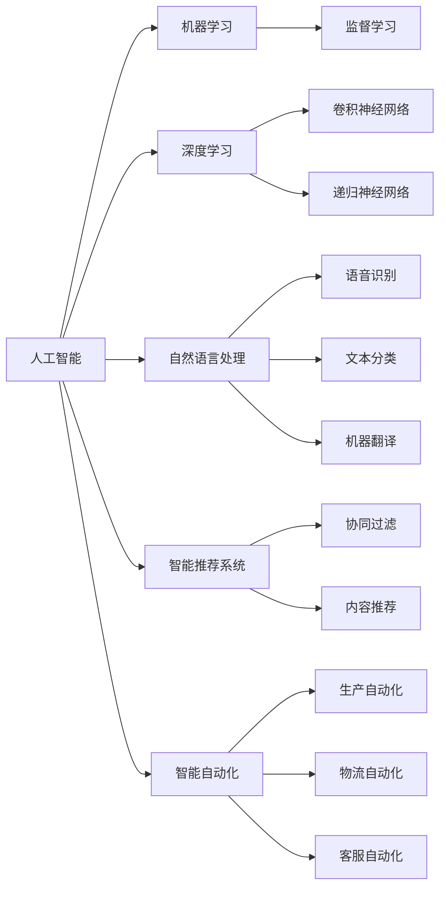

                 

# 人工智能的冲击：人类社会将何去何从？

人工智能(AI)技术在过去几十年的迅猛发展，正在以一种前所未有的方式重塑人类社会的方方面面。从经济到政治，从文化到教育，人工智能的影响几乎无所不在。本文将探讨人工智能对人类社会可能产生的影响，并提出一些思考和建议。

## 1. 背景介绍

### 1.1 人工智能的崛起

人工智能最初只是一个研究领域，用于模拟人类的智能行为。但随着深度学习、机器学习等技术的进步，人工智能从学术界走入了工业界，并迅速成为推动技术创新的重要力量。如今，人工智能技术已经渗透到医疗、金融、交通、教育等各个行业，为人类社会带来了巨大的变革潜力。

### 1.2 人工智能的现状

当前，人工智能已经进入了商业应用的成熟阶段。大型科技公司如谷歌、亚马逊、Facebook等都在积极推进人工智能技术的研究和应用，并取得了显著的成果。同时，人工智能技术也在政府和企业的决策制定中扮演了重要角色，为公共服务和商业运营带来了更高的效率和智能化水平。

## 2. 核心概念与联系

### 2.1 核心概念概述

为更好地理解人工智能的影响，本节将介绍几个密切相关的核心概念：

- **人工智能**：指通过算法和计算模拟人类智能的技术，涵盖机器学习、深度学习、自然语言处理等领域。
- **机器学习**：指通过数据和模型，使机器自动学习和改进的过程。
- **深度学习**：一种机器学习的子领域，利用多层次神经网络模型，对大规模数据进行特征提取和模式识别。
- **自然语言处理**：指使计算机能够理解和生成人类语言的技术，如语音识别、文本分类、机器翻译等。
- **智能推荐系统**：通过分析用户行为和偏好，提供个性化的推荐服务，如电商网站的产品推荐、社交网络的信息推荐等。
- **智能自动化**：利用人工智能技术实现生产、物流、客服等领域的自动化流程，提高效率和精确度。

这些核心概念之间有着紧密的联系，共同构成了人工智能技术的生态系统。下面将通过一个Mermaid流程图来展示这些概念之间的联系：



这个流程图展示了人工智能技术在各个领域的具体应用，以及它们之间的相互关系。

### 2.2 概念间的关系

这些核心概念之间存在着复杂的联系，通过这些联系，人工智能技术在各个领域中发挥着重要作用。

- **人工智能与机器学习**：人工智能是机器学习的基础，通过算法和计算实现机器对数据的自动学习和优化。
- **深度学习与自然语言处理**：深度学习是自然语言处理的核心技术，通过多层次神经网络模型对语言数据进行特征提取和模式识别。
- **智能推荐系统与智能自动化**：智能推荐系统是智能自动化的重要应用，通过分析用户行为提供个性化服务，而智能自动化则实现任务的自动化处理，提高效率。

## 3. 核心算法原理 & 具体操作步骤

### 3.1 算法原理概述

人工智能的核心算法原理包括：

- **监督学习**：通过有标签的数据训练模型，使其能够根据新数据进行分类或预测。
- **无监督学习**：在没有标签的情况下，通过数据之间的相似性和差异性进行模式识别和聚类。
- **强化学习**：通过与环境互动，使模型在不断试错中学习最优策略。

这些算法原理构成了人工智能技术的基础，通过不同算法和模型，人工智能能够解决各种复杂问题。

### 3.2 算法步骤详解

以下是人工智能算法的详细步骤：

**Step 1: 数据准备**

- 收集和处理数据，确保数据质量和多样性。
- 对数据进行预处理，如清洗、归一化、特征提取等。

**Step 2: 模型选择**

- 根据问题的性质选择合适的模型，如线性回归、支持向量机、神经网络等。
- 确定模型的超参数，如学习率、批量大小、迭代轮数等。

**Step 3: 训练模型**

- 将数据分为训练集、验证集和测试集。
- 使用训练集训练模型，通过迭代优化调整模型参数。
- 在验证集上评估模型性能，调整超参数和模型结构。

**Step 4: 测试和部署**

- 在测试集上评估模型性能。
- 部署模型到实际应用场景中，收集反馈并进行优化。
- 持续收集新数据，重新训练和优化模型。

### 3.3 算法优缺点

人工智能算法具有以下优点：

- **高效性**：能够自动化处理大量数据，提高效率。
- **准确性**：通过学习数据模式，能够提高预测和分类的准确性。
- **灵活性**：可以适用于各种复杂问题，如语音识别、图像识别、自然语言处理等。

但同时也存在一些缺点：

- **数据依赖性**：需要大量高质量的数据进行训练，获取数据成本较高。
- **解释性不足**：一些算法如深度学习，模型复杂性高，难以解释其内部工作机制。
- **鲁棒性不足**：模型对噪声和异常数据的敏感性较高，容易过拟合。
- **安全性问题**：模型可能学习到有害信息，影响社会稳定和安全。

### 3.4 算法应用领域

人工智能技术已经在多个领域得到广泛应用，包括：

- **医疗**：利用自然语言处理技术提取病历信息，通过机器学习预测疾病发展趋势。
- **金融**：利用机器学习和大数据分析进行风险评估和投资策略优化。
- **制造**：通过智能自动化技术实现生产流程的自动化和优化。
- **教育**：利用智能推荐系统为学生提供个性化的学习资源和指导。
- **交通**：利用智能自动化技术优化交通流量管理，提高交通安全和效率。

## 4. 数学模型和公式 & 详细讲解

### 4.1 数学模型构建

在人工智能中，数学模型是核心之一。以下是几个常用的数学模型及其构建过程：

**线性回归模型**：

$$
y = \beta_0 + \beta_1 x_1 + \beta_2 x_2 + ... + \beta_n x_n
$$

其中，$y$为预测值，$x_i$为输入变量，$\beta_i$为模型参数。

**支持向量机(SVM)**：

$$
f(x) = \sum_{i=1}^{n} \alpha_i y_i K(x_i, x) + b
$$

其中，$K(x_i, x)$为核函数，$\alpha_i$为模型参数，$y_i$为标签，$b$为偏置项。

**卷积神经网络(CNN)**：

$$
\begin{aligned}
f(x) &= \sum_{i=1}^{n} \beta_i g_i(x) \\
g_i(x) &= \sum_{j=1}^{m} w_{ij} h_j(x)
\end{aligned}
$$

其中，$g_i(x)$为卷积层输出，$w_{ij}$为卷积核参数，$h_j(x)$为激活函数，$\beta_i$为全连接层参数。

**递归神经网络(RNN)**：

$$
h_t = \tanh(\sum_{i=1}^{n} w_i h_{t-1} + b)
$$

其中，$h_t$为第$t$个时间步的隐藏状态，$w_i$为权重参数，$b$为偏置项。

### 4.2 公式推导过程

以下是几个常用模型的公式推导过程：

**线性回归**：

1. 最小化误差平方和：
$$
J(\beta) = \frac{1}{2} \sum_{i=1}^{N} (y_i - f(x_i))^2
$$

2. 梯度下降优化：
$$
\beta_i \leftarrow \beta_i - \eta \frac{\partial J(\beta)}{\partial \beta_i}
$$

**支持向量机**：

1. 最大化间隔：
$$
\max \frac{1}{2} \sum_{i=1}^{N} \alpha_i - \frac{1}{2} \sum_{i=1}^{N} \sum_{j=1}^{N} \alpha_i \alpha_j y_i y_j K(x_i, x_j) + C \sum_{i=1}^{N} \alpha_i
$$

2. 拉格朗日对偶：
$$
\alpha_i \leftarrow \alpha_i - \eta \alpha_i y_i (f(x_i) - y_i)
$$

**卷积神经网络**：

1. 前向传播：
$$
a_{ij} = w_{ij} * h_{i-1} + b
$$

2. 反向传播：
$$
\frac{\partial L}{\partial w} = \frac{\partial L}{\partial a} \frac{\partial a}{\partial w}
$$

**递归神经网络**：

1. 前向传播：
$$
h_t = \tanh(\sum_{i=1}^{n} w_i h_{t-1} + b)
$$

2. 反向传播：
$$
\frac{\partial L}{\partial w} = \frac{\partial L}{\partial h_t} \frac{\partial h_t}{\partial w}
$$

### 4.3 案例分析与讲解

以**情感分析**为例，解释人工智能在自然语言处理中的应用：

**数据准备**：收集社交媒体上的评论数据，进行文本清洗和预处理。

**模型选择**：选择卷积神经网络或递归神经网络，进行特征提取和情感分类。

**训练模型**：在训练集上训练模型，调整超参数和模型结构。

**测试和部署**：在测试集上评估模型性能，部署到实际应用中，进行情感分析。

## 5. 项目实践：代码实例和详细解释说明

### 5.1 开发环境搭建

在进行人工智能项目实践前，需要准备好开发环境。以下是使用Python进行TensorFlow开发的环境配置流程：

1. 安装Anaconda：从官网下载并安装Anaconda，用于创建独立的Python环境。

2. 创建并激活虚拟环境：
```bash
conda create -n tensorflow-env python=3.8 
conda activate tensorflow-env
```

3. 安装TensorFlow：根据CUDA版本，从官网获取对应的安装命令。例如：
```bash
conda install tensorflow -c tensorflow -c conda-forge
```

4. 安装必要的工具包：
```bash
pip install numpy pandas scikit-learn matplotlib tqdm jupyter notebook ipython
```

完成上述步骤后，即可在`tensorflow-env`环境中开始人工智能实践。

### 5.2 源代码详细实现

我们以**图像分类**任务为例，给出使用TensorFlow对卷积神经网络进行训练的代码实现。

首先，定义数据处理函数：

```python
import tensorflow as tf
from tensorflow.keras.preprocessing.image import ImageDataGenerator

train_datagen = ImageDataGenerator(rescale=1./255, shear_range=0.2, zoom_range=0.2, horizontal_flip=True)
test_datagen = ImageDataGenerator(rescale=1./255)

train_generator = train_datagen.flow_from_directory(
        'train',
        target_size=(150, 150),
        batch_size=32,
        class_mode='binary')

test_generator = test_datagen.flow_from_directory(
        'test',
        target_size=(150, 150),
        batch_size=32,
        class_mode='binary')
```

然后，定义模型和优化器：

```python
from tensorflow.keras import models, layers, optimizers

model = models.Sequential()
model.add(layers.Conv2D(32, (3, 3), activation='relu', input_shape=(150, 150, 3)))
model.add(layers.MaxPooling2D((2, 2)))
model.add(layers.Conv2D(64, (3, 3), activation='relu'))
model.add(layers.MaxPooling2D((2, 2)))
model.add(layers.Conv2D(128, (3, 3), activation='relu'))
model.add(layers.MaxPooling2D((2, 2)))
model.add(layers.Flatten())
model.add(layers.Dense(512, activation='relu'))
model.add(layers.Dense(1, activation='sigmoid'))

optimizer = optimizers.Adam(learning_rate=0.001)
```

接着，定义训练和评估函数：

```python
model.compile(optimizer=optimizer, loss='binary_crossentropy', metrics=['accuracy'])

epochs = 20
steps_per_epoch = 2000 // 32
validation_steps = 500 // 32

history = model.fit_generator(
        train_generator,
        steps_per_epoch=steps_per_epoch,
        epochs=epochs,
        validation_data=validation_generator,
        validation_steps=validation_steps)
```

最后，启动训练流程并在测试集上评估：

```python
test_loss, test_acc = model.evaluate_generator(test_generator, steps=validation_steps)
print(f'Test accuracy: {test_acc:.4f}')
```

以上就是使用TensorFlow对卷积神经网络进行图像分类的完整代码实现。可以看到，TensorFlow的高级API使得模型构建和训练变得简单高效。

### 5.3 代码解读与分析

让我们再详细解读一下关键代码的实现细节：

**ImageDataGenerator**：
- `rescale`参数：对输入图像进行归一化。
- `shear_range`、`zoom_range`、`horizontal_flip`等参数：对图像进行随机变换，增加数据多样性。

**模型定义**：
- `Conv2D`层：卷积层，通过滑动窗口提取特征。
- `MaxPooling2D`层：池化层，降低特征维度，保留重要信息。
- `Flatten`层：将二维特征映射展平为一维向量。
- `Dense`层：全连接层，进行分类预测。

**优化器定义**：
- `Adam`优化器：自适应学习率的优化算法，能够自动调整学习率。

**训练和评估**：
- `model.compile`方法：配置模型参数，包括损失函数、优化器和评估指标。
- `fit_generator`方法：使用数据生成器进行模型训练，支持动态生成和加载数据。

**评估输出**：
- `evaluate_generator`方法：在测试集上评估模型性能，输出准确率。

可以看到，TensorFlow的高级API和模型构建器使得人工智能项目实践变得更加便捷。开发者可以专注于模型的设计、数据的处理和性能的调优，而不必过多关注底层的实现细节。

## 6. 实际应用场景

### 6.1 智能医疗

人工智能在医疗领域的应用正在逐渐成熟。通过自然语言处理技术，医疗AI可以自动化地提取和分析病历信息，提高诊断和治疗的效率和准确性。

在**医学影像分析**中，利用深度学习模型对X光片、CT扫描等医学图像进行分类和分割，辅助医生进行疾病诊断。

在**病历分析**中，自然语言处理技术可以将结构化的病历信息转换为结构化的数据，提高病历处理的效率。

### 6.2 智能金融

人工智能在金融领域的应用包括风险管理、投资策略优化、智能客服等。

在**风险管理**中，利用机器学习和大数据分析对金融市场进行预测，降低投资风险。

在**智能客服**中，自然语言处理技术可以自动回答客户问题，提高客户满意度和服务效率。

### 6.3 智能制造

人工智能在制造业中的应用包括生产流程优化、质量检测、设备维护等。

在**生产流程优化**中，智能自动化技术可以实现生产线的自动化和智能化，提高生产效率和质量。

在**质量检测**中，利用计算机视觉技术对产品进行缺陷检测，提高产品质量。

### 6.4 未来应用展望

未来，人工智能技术将在更多领域得到应用，带来更深刻的变革。

在**智慧城市**中，人工智能技术可以实现交通流量管理、环境监测、公共安全等领域的智能化，提高城市管理水平。

在**教育**中，智能推荐系统可以提供个性化的学习资源和指导，提高教学质量和效率。

在**农业**中，人工智能技术可以实现农业生产的智能化，提高农作物的产量和质量。

## 7. 工具和资源推荐

### 7.1 学习资源推荐

为了帮助开发者系统掌握人工智能的理论基础和实践技巧，这里推荐一些优质的学习资源：

1. **《深度学习》课程**：斯坦福大学开设的深度学习课程，涵盖深度学习的基本概念和经典模型。
2. **《机器学习》课程**：吴恩达在Coursera上开设的机器学习课程，讲解了机器学习的核心算法和应用。
3. **《TensorFlow实战》书籍**：TensorFlow官方团队编写的书籍，详细介绍了TensorFlow的各个模块和应用。
4. **《自然语言处理综述》论文**：一篇自然语言处理领域的综述论文，全面介绍了NLP技术的现状和未来发展方向。
5. **《AI概述》报告**：麦肯锡公司发布的AI技术报告，提供了人工智能技术的市场前景和应用案例。

通过对这些资源的学习实践，相信你一定能够快速掌握人工智能技术的精髓，并用于解决实际的业务问题。

### 7.2 开发工具推荐

高效的开发离不开优秀的工具支持。以下是几款用于人工智能开发的工具：

1. **TensorFlow**：由谷歌主导开发的开源深度学习框架，支持分布式计算和GPU加速，广泛应用于人工智能研究和应用。
2. **PyTorch**：由Facebook开发的深度学习框架，易于使用和扩展，广泛应用于学术研究和工业应用。
3. **Keras**：基于TensorFlow和Theano的高级API，提供了简洁易用的API接口，适合快速原型设计和实验。
4. **Jupyter Notebook**：一个交互式的开发环境，支持Python、R等多种语言，方便代码编写和数据分析。

合理利用这些工具，可以显著提升人工智能项目开发效率，加快创新迭代的步伐。

### 7.3 相关论文推荐

人工智能技术的发展离不开学界的持续研究。以下是几篇奠基性的相关论文，推荐阅读：

1. **《深度学习》论文**：Yann LeCun等在Nature上发表的深度学习综述论文，全面介绍了深度学习的基本原理和应用。
2. **《自然语言处理综述》论文**：Tom Mitchell等在Journal of Artificial Intelligence Research上发表的自然语言处理综述论文，全面介绍了NLP技术的现状和未来发展方向。
3. **《机器学习》论文**：Tom Mitchell在Journal of Artificial Intelligence Research上发表的机器学习综述论文，全面介绍了机器学习的基本概念和算法。
4. **《AI概述》论文**：Marshall McLuhan在Journal of Visual Culture上发表的AI技术综述论文，全面介绍了人工智能技术的发展历程和未来趋势。

这些论文代表了大人工智能技术的发展脉络。通过学习这些前沿成果，可以帮助研究者把握学科前进方向，激发更多的创新灵感。

## 8. 总结：未来发展趋势与挑战

### 8.1 总结

本文对人工智能技术的影响进行了全面系统的探讨。首先阐述了人工智能技术的崛起和现状，明确了人工智能技术在各个领域的广泛应用。其次，从原理到实践，详细讲解了人工智能算法的核心思想和操作步骤，给出了人工智能项目开发的完整代码实例。同时，本文还广泛探讨了人工智能技术在医疗、金融、制造等领域的应用前景，展示了人工智能技术的巨大潜力。

通过本文的系统梳理，可以看到，人工智能技术正在以一种前所未有的方式重塑人类社会。它不仅带来了生产力和效率的提升，也引发了诸多伦理和安全问题。未来，随着人工智能技术的不断发展，我们需要不断思考和探索，才能更好地应对人工智能技术带来的挑战和机遇。

### 8.2 未来发展趋势

展望未来，人工智能技术将呈现以下几个发展趋势：

1. **多模态融合**：人工智能技术将更加注重多模态数据的融合，如视觉、语音、文本等，实现更加全面和准确的信息理解。
2. **强化学习**：强化学习技术将在更多领域得到应用，如自动驾驶、机器人等，提高智能系统的决策能力和鲁棒性。
3. **可解释性**：未来的人工智能系统将更加注重可解释性，提高系统的透明度和可信度。
4. **跨领域应用**：人工智能技术将突破单一领域的限制，实现跨领域的协同创新，如智能城市、智慧医疗等。
5. **个性化服务**：人工智能技术将实现更加个性化的服务，如智能推荐、智能客服等，提高用户体验和满意度。

### 8.3 面临的挑战

尽管人工智能技术取得了显著进展，但在迈向更加智能化、普适化应用的过程中，仍面临诸多挑战：

1. **数据质量问题**：人工智能技术需要高质量的数据进行训练，但数据获取和处理成本较高。如何获取更多高质量的数据，是未来的一大难题。
2. **模型复杂性**：人工智能模型的复杂性较高，难以解释其内部工作机制和决策逻辑。如何提高模型的可解释性和透明性，是未来需要解决的重要问题。
3. **安全性和隐私问题**：人工智能技术可能学习到有害信息，影响社会稳定和安全。如何保护用户隐私和数据安全，是未来需要重点关注的问题。
4. **伦理和社会问题**：人工智能技术的广泛应用可能引发伦理和社会问题，如就业失业、算法偏见等。如何应对这些问题，是未来需要解决的重要课题。

### 8.4 研究展望

未来，人工智能技术的研究方向将涵盖以下几个方面：

1. **多模态学习**：研究多模态数据的融合和协同建模，提高系统的全面性和准确性。
2. **强化学习**：研究强化学习算法在复杂环境中的决策能力，提高智能系统的鲁棒性和可靠性。
3. **可解释性**：研究人工智能模型的可解释性和透明性，提高系统的可信度和用户接受度。
4. **跨领域应用**：研究人工智能技术在跨领域场景中的应用，实现多领域协同创新。
5. **伦理和社会问题**：研究人工智能技术的伦理和社会问题，确保技术应用符合人类价值观和伦理道德。

总之，人工智能技术在未来将继续保持快速发展，其广泛应用将带来深刻的社会变革。我们需要不断探索和创新，才能更好地应对人工智能技术带来的挑战和机遇。

