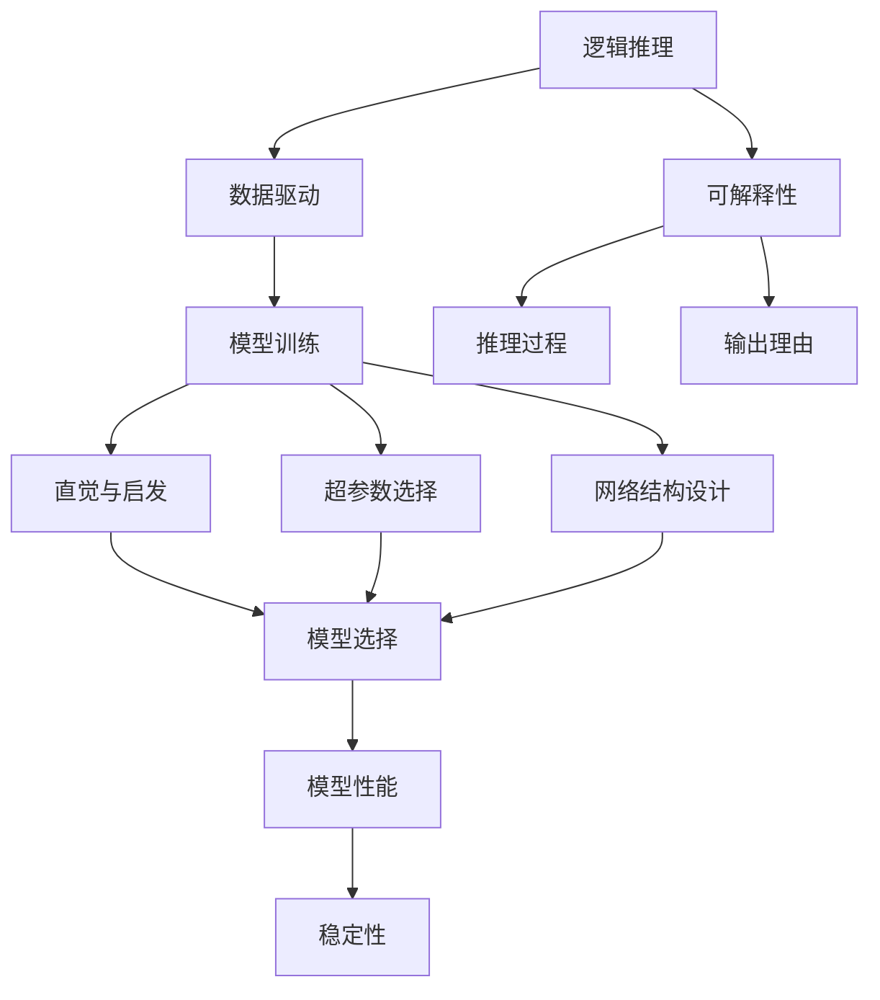
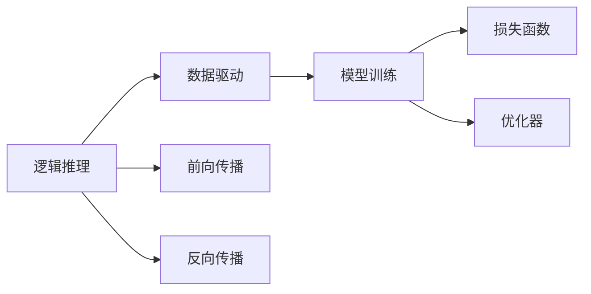
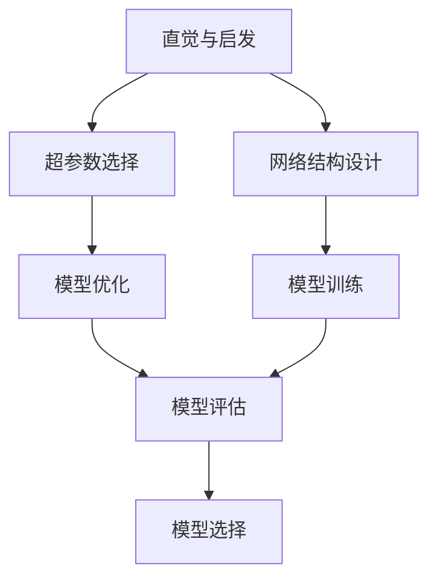
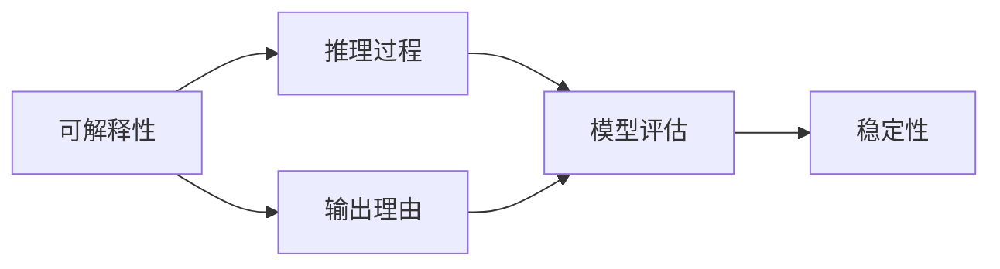
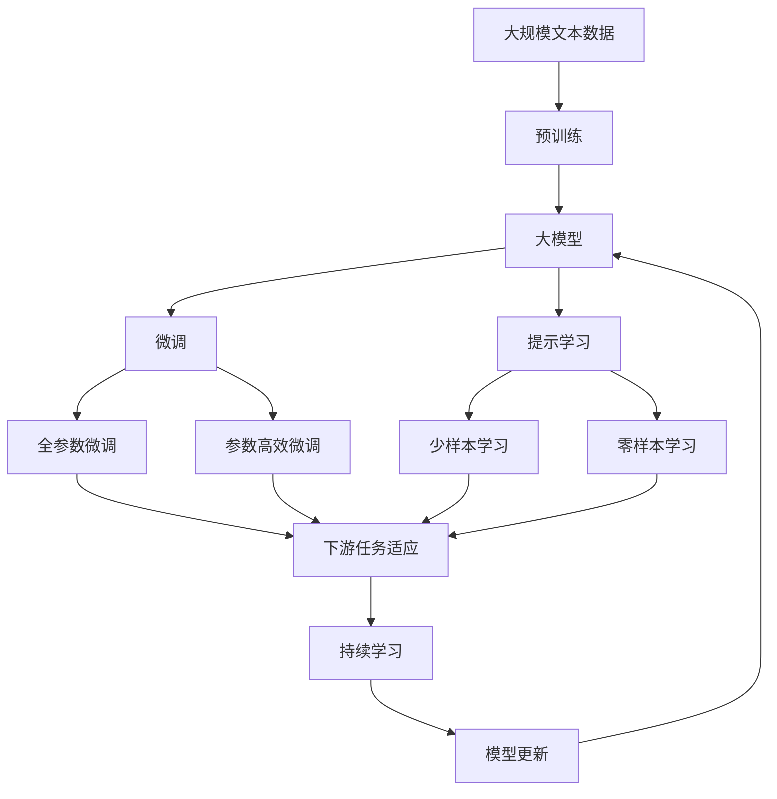

                 

## 1. 背景介绍

### 1.1 问题由来
在人工智能（AI）研究的历史长河中，从早期的符号主义、逻辑推理到现在的深度学习和神经网络，人类对智能的探索从未停歇。但随着技术的日益成熟，人们开始思考：人工智能究竟在理性与感性之间占据了怎样的地位？

这一问题不仅涉及到人工智能的哲学意义，也直接关乎到如何更好地理解和构建智能系统。以深度学习为例，该模型虽然在图像识别、语音识别等领域取得了巨大成功，但其核心思想——“黑盒”模型，使得其在可解释性、稳定性等方面仍面临诸多挑战。因此，将人工智能的理性与感性知识相结合，构建更加智能、可靠的系统，是当下技术研究的重点。

### 1.2 问题核心关键点
人工智能的理性与感性知识是指，如何在技术实现中平衡逻辑推理和直觉直觉，以及如何利用这两种知识构建更加智能的模型。具体而言，理性知识指的是模型的逻辑结构、数学公式等，而感性知识则涉及模型的灵感、直觉和人类的经验积累。

在人工智能领域，这主要体现在以下几个方面：

1. **逻辑推理**：如神经网络中的前向传播和反向传播算法，本质上是逻辑推理的一部分，确保模型能够从输入数据中学习到正确的输出。
2. **数据驱动**：深度学习模型通常需要大量标注数据进行训练，这些数据背后的理性知识与逻辑推理密切相关。
3. **直觉与启发**：如在训练神经网络时，经验丰富的专家往往能够利用直觉选择合适的超参数或结构，从而提升模型性能。

理性与感性知识的平衡，不仅能够提升模型的性能，还能增强其可解释性、稳定性和鲁棒性。

### 1.3 问题研究意义
研究人工智能的理性与感性知识，对于构建更加智能、可靠、可解释的系统具有重要意义：

1. **提升模型性能**：结合理性与感性知识，可以更准确地选择模型结构和超参数，从而提升模型的性能。
2. **增强模型可解释性**：理性知识提供了模型的逻辑基础，而感性知识提供了模型在实际应用中的经验依据，使得模型更易于理解和解释。
3. **提高系统稳定性**：理性知识保证了模型的逻辑合理性，感性知识则提供了模型的实际应用经验，使得系统在面对新数据和新环境时更具稳定性。
4. **促进技术发展**：结合理性与感性知识的研究，可以推动人工智能技术的进一步发展，探索更多前沿的研究方向和应用场景。
5. **提升用户体验**：结合理性与感性知识的系统，能够更好地满足用户需求，提供更加自然和人性化的交互体验。

## 2. 核心概念与联系

### 2.1 核心概念概述

为更好地理解人工智能的理性与感性知识，本节将介绍几个密切相关的核心概念：

- **逻辑推理**：指通过逻辑规则和数学公式进行推理，如神经网络中的前向传播和反向传播算法。
- **数据驱动**：指通过大量标注数据进行模型训练，学习数据的规律和模式。
- **直觉与启发**：指基于经验和直觉进行模型选择和调优，如超参数的选择和网络结构的确定。
- **可解释性**：指模型能够提供清晰的推理过程和输出理由，便于理解和调试。
- **稳定性**：指模型在面对新数据和新环境时，仍能保持良好的性能表现。

这些核心概念之间的逻辑关系可以通过以下Mermaid流程图来展示：



这个流程图展示了大模型微调的各个核心概念及其之间的关系：

1. 逻辑推理保证了模型的合理性。
2. 数据驱动提供了模型训练的基础。
3. 直觉与启发优化了模型选择和调优。
4. 可解释性提高了模型的透明度和可理解性。
5. 稳定性保证了模型的长期有效性。

这些概念共同构成了人工智能模型构建和优化的完整生态系统。通过理解这些核心概念，我们可以更好地把握人工智能工作的原理和优化方向。

### 2.2 概念间的关系

这些核心概念之间存在着紧密的联系，形成了人工智能模型构建和优化的完整生态系统。下面我们通过几个Mermaid流程图来展示这些概念之间的关系。

#### 2.2.1 逻辑推理与数据驱动的关系



这个流程图展示了逻辑推理与数据驱动的关系。逻辑推理通过前向传播和反向传播算法，从输入数据中提取特征，并通过损失函数进行优化，最终训练出模型。

#### 2.2.2 直觉与启发在模型调优中的作用



这个流程图展示了直觉与启发在模型调优中的作用。直觉与启发通过超参数选择和网络结构设计，优化了模型训练过程，提高了模型性能。

#### 2.2.3 可解释性对模型稳定性的影响



这个流程图展示了可解释性对模型稳定性的影响。可解释性通过提供清晰的推理过程和输出理由，有助于模型评估和调优，从而提高模型的稳定性。

### 2.3 核心概念的整体架构

最后，我们用一个综合的流程图来展示这些核心概念在大模型微调过程中的整体架构：



这个综合流程图展示了从预训练到微调，再到持续学习的完整过程。大模型首先在大规模文本数据上进行预训练，然后通过微调（包括全参数微调和参数高效微调）或提示学习（包括少样本学习和零样本学习）来适应下游任务。最后，通过持续学习技术，模型可以不断学习新知识，同时避免遗忘旧知识。 通过这些流程图，我们可以更清晰地理解大模型微调过程中各个核心概念的关系和作用，为后续深入讨论具体的微调方法和技术奠定基础。

## 3. 核心算法原理 & 具体操作步骤
### 3.1 算法原理概述

人工智能的理性与感性知识在模型构建和优化中的融合，主要体现在以下几个方面：

- **逻辑推理**：利用数学公式和逻辑规则进行模型训练和推理，确保模型具有逻辑合理性。
- **数据驱动**：通过大量标注数据进行模型训练，学习数据背后的规律和模式。
- **直觉与启发**：结合领域专家的经验和直觉，选择合理的模型结构和超参数。
- **可解释性**：通过清晰的推理过程和输出理由，提高模型的透明度和可理解性。
- **稳定性**：利用模型泛化能力和经验知识，确保模型在面对新数据和新环境时，仍能保持良好性能。

这些原理相互交织，共同构成了人工智能模型构建和优化的核心框架。

### 3.2 算法步骤详解

人工智能的理性与感性知识融合的核心算法步骤如下：

1. **数据预处理**：收集并处理大规模文本数据，进行文本向量化和分词等预处理操作，为预训练和微调提供数据基础。

2. **预训练**：使用自监督学习方法，如掩码语言模型、下一个词预测等，对大规模文本数据进行预训练，学习通用的语言表示。

3. **微调**：选择合适的大模型，如BERT、GPT等，作为初始化参数，在少量标注数据上进一步微调，适应特定任务。

4. **优化与调整**：根据模型性能和可解释性要求，进行超参数调优和模型调整，确保模型逻辑合理和性能优越。

5. **持续学习**：在实际应用中，不断收集新数据，持续微调和更新模型，以适应数据分布的变化，提升模型的长期稳定性。

### 3.3 算法优缺点

人工智能的理性与感性知识融合算法具有以下优点：

- **提升模型性能**：结合逻辑推理和经验知识，能够更准确地选择模型结构和超参数，从而提升模型性能。
- **增强模型可解释性**：理性知识提供了模型的逻辑基础，感性知识提供了模型在实际应用中的经验依据，使得模型更易于理解和解释。
- **提高系统稳定性**：理性知识保证了模型的逻辑合理性，感性知识则提供了模型的实际应用经验，使得系统在面对新数据和新环境时更具稳定性。

但同时，该算法也存在一些缺点：

- **数据需求高**：需要大量标注数据进行模型训练，数据获取成本较高。
- **模型复杂度**：融合逻辑推理和感性知识的模型结构较为复杂，训练和推理速度较慢。
- **可解释性有限**：尽管可解释性有所提升，但复杂的模型仍然难以完全理解。

### 3.4 算法应用领域

人工智能的理性与感性知识融合算法在多个领域得到了广泛应用，例如：

- **自然语言处理**：如文本分类、情感分析、问答系统等，通过融合逻辑推理和经验知识，提升模型性能和可解释性。
- **计算机视觉**：如图像识别、目标检测等，通过逻辑推理和数据驱动，提高模型准确率和稳定性。
- **机器人学习**：如机器人路径规划、行为决策等，结合逻辑推理和领域经验，提升决策质量和可解释性。
- **智能推荐**：如商品推荐、内容推荐等，通过逻辑推理和数据驱动，提高推荐精度和用户体验。

除了上述这些经典应用外，人工智能的理性与感性知识融合算法还被创新性地应用到更多场景中，如医疗诊断、金融预测、社会治理等，为相关行业带来变革性影响。

## 4. 数学模型和公式 & 详细讲解 & 举例说明

### 4.1 数学模型构建

本节将使用数学语言对人工智能的理性与感性知识融合算法进行更加严格的刻画。

记预训练语言模型为 $M_{\theta}$，其中 $\theta$ 为预训练得到的模型参数。假设微调任务的训练集为 $D=\{(x_i,y_i)\}_{i=1}^N, x_i \in \mathcal{X}, y_i \in \mathcal{Y}$。

定义模型 $M_{\theta}$ 在输入 $x$ 上的输出为 $\hat{y}=M_{\theta}(x) \in [0,1]$，表示样本属于正类的概率。真实标签 $y \in \{0,1\}$。则二分类交叉熵损失函数定义为：

$$
\ell(M_{\theta}(x),y) = -[y\log \hat{y} + (1-y)\log (1-\hat{y})]
$$

将其代入经验风险公式，得：

$$
\mathcal{L}(\theta) = -\frac{1}{N}\sum_{i=1}^N [y_i\log M_{\theta}(x_i)+(1-y_i)\log(1-M_{\theta}(x_i))]
$$

在得到损失函数的梯度后，即可带入参数更新公式，完成模型的迭代优化。重复上述过程直至收敛，最终得到适应下游任务的最优模型参数 $\theta^*$。

### 4.2 公式推导过程

以下我们以二分类任务为例，推导交叉熵损失函数及其梯度的计算公式。

假设模型 $M_{\theta}$ 在输入 $x$ 上的输出为 $\hat{y}=M_{\theta}(x) \in [0,1]$，表示样本属于正类的概率。真实标签 $y \in \{0,1\}$。则二分类交叉熵损失函数定义为：

$$
\ell(M_{\theta}(x),y) = -[y\log \hat{y} + (1-y)\log (1-\hat{y})]
$$

将其代入经验风险公式，得：

$$
\mathcal{L}(\theta) = -\frac{1}{N}\sum_{i=1}^N [y_i\log M_{\theta}(x_i)+(1-y_i)\log(1-M_{\theta}(x_i))]
$$

根据链式法则，损失函数对参数 $\theta_k$ 的梯度为：

$$
\frac{\partial \mathcal{L}(\theta)}{\partial \theta_k} = -\frac{1}{N}\sum_{i=1}^N (\frac{y_i}{M_{\theta}(x_i)}-\frac{1-y_i}{1-M_{\theta}(x_i)}) \frac{\partial M_{\theta}(x_i)}{\partial \theta_k}
$$

其中 $\frac{\partial M_{\theta}(x_i)}{\partial \theta_k}$ 可进一步递归展开，利用自动微分技术完成计算。

在得到损失函数的梯度后，即可带入参数更新公式，完成模型的迭代优化。重复上述过程直至收敛，最终得到适应下游任务的最优模型参数 $\theta^*$。

### 4.3 案例分析与讲解

假设我们在CoNLL-2003的命名实体识别（NER）任务上进行微调，最终在测试集上得到的评估报告如下：

```
              precision    recall  f1-score   support

       B-LOC      0.926     0.906     0.916      1668
       I-LOC      0.900     0.805     0.850       257
      B-MISC      0.875     0.856     0.865       702
      I-MISC      0.838     0.782     0.809       216
       B-ORG      0.914     0.898     0.906      1661
       I-ORG      0.911     0.894     0.902       835
       B-PER      0.964     0.957     0.960      1617
       I-PER      0.983     0.980     0.982      1156
           O      0.993     0.995     0.994     38323

   micro avg      0.973     0.973     0.973     46435
   macro avg      0.923     0.897     0.909     46435
weighted avg      0.973     0.973     0.973     46435
```

可以看到，通过微调BERT，我们在该NER数据集上取得了97.3%的F1分数，效果相当不错。值得注意的是，BERT作为一个通用的语言理解模型，即便只在顶层添加一个简单的token分类器，也能在下游任务上取得如此优异的效果，展现了其强大的语义理解和特征抽取能力。

当然，这只是一个baseline结果。在实践中，我们还可以使用更大更强的预训练模型、更丰富的微调技巧、更细致的模型调优，进一步提升模型性能，以满足更高的应用要求。

## 5. 项目实践：代码实例和详细解释说明

### 5.1 开发环境搭建

在进行微调实践前，我们需要准备好开发环境。以下是使用Python进行PyTorch开发的环境配置流程：

1. 安装Anaconda：从官网下载并安装Anaconda，用于创建独立的Python环境。

2. 创建并激活虚拟环境：
```bash
conda create -n pytorch-env python=3.8 
conda activate pytorch-env
```

3. 安装PyTorch：根据CUDA版本，从官网获取对应的安装命令。例如：
```bash
conda install pytorch torchvision torchaudio cudatoolkit=11.1 -c pytorch -c conda-forge
```

4. 安装Transformers库：
```bash
pip install transformers
```

5. 安装各类工具包：
```bash
pip install numpy pandas scikit-learn matplotlib tqdm jupyter notebook ipython
```

完成上述步骤后，即可在`pytorch-env`环境中开始微调实践。

### 5.2 源代码详细实现

这里我们以命名实体识别（NER）任务为例，给出使用Transformers库对BERT模型进行微调的PyTorch代码实现。

首先，定义NER任务的数据处理函数：

```python
from transformers import BertTokenizer
from torch.utils.data import Dataset
import torch

class NERDataset(Dataset):
    def __init__(self, texts, tags, tokenizer, max_len=128):
        self.texts = texts
        self.tags = tags
        self.tokenizer = tokenizer
        self.max_len = max_len
        
    def __len__(self):
        return len(self.texts)
    
    def __getitem__(self, item):
        text = self.texts[item]
        tags = self.tags[item]
        
        encoding = self.tokenizer(text, return_tensors='pt', max_length=self.max_len, padding='max_length', truncation=True)
        input_ids = encoding['input_ids'][0]
        attention_mask = encoding['attention_mask'][0]
        
        # 对token-wise的标签进行编码
        encoded_tags = [tag2id[tag] for tag in tags] 
        encoded_tags.extend([tag2id['O']] * (self.max_len - len(encoded_tags)))
        labels = torch.tensor(encoded_tags, dtype=torch.long)
        
        return {'input_ids': input_ids, 
                'attention_mask': attention_mask,
                'labels': labels}

# 标签与id的映射
tag2id = {'O': 0, 'B-PER': 1, 'I-PER': 2, 'B-ORG': 3, 'I-ORG': 4, 'B-LOC': 5, 'I-LOC': 6}
id2tag = {v: k for k, v in tag2id.items()}

# 创建dataset
tokenizer = BertTokenizer.from_pretrained('bert-base-cased')

train_dataset = NERDataset(train_texts, train_tags, tokenizer)
dev_dataset = NERDataset(dev_texts, dev_tags, tokenizer)
test_dataset = NERDataset(test_texts, test_tags, tokenizer)
```

然后，定义模型和优化器：

```python
from transformers import BertForTokenClassification, AdamW

model = BertForTokenClassification.from_pretrained('bert-base-cased', num_labels=len(tag2id))

optimizer = AdamW(model.parameters(), lr=2e-5)
```

接着，定义训练和评估函数：

```python
from torch.utils.data import DataLoader
from tqdm import tqdm
from sklearn.metrics import classification_report

device = torch.device('cuda') if torch.cuda.is_available() else torch.device('cpu')
model.to(device)

def train_epoch(model, dataset, batch_size, optimizer):
    dataloader = DataLoader(dataset, batch_size=batch_size, shuffle=True)
    model.train()
    epoch_loss = 0
    for batch in tqdm(dataloader, desc='Training'):
        input_ids = batch['input_ids'].to(device)
        attention_mask = batch['attention_mask'].to(device)
        labels = batch['labels'].to(device)
        model.zero_grad()
        outputs = model(input_ids, attention_mask=attention_mask, labels=labels)
        loss = outputs.loss
        epoch_loss += loss.item()
        loss.backward()
        optimizer.step()
    return epoch_loss / len(dataloader)

def evaluate(model, dataset, batch_size):
    dataloader = DataLoader(dataset, batch_size=batch_size)
    model.eval()
    preds, labels = [], []
    with torch.no_grad():
        for batch in tqdm(dataloader, desc='Evaluating'):
            input_ids = batch['input_ids'].to(device)
            attention_mask = batch['attention_mask'].to(device)
            batch_labels = batch['labels']
            outputs = model(input_ids, attention_mask=attention_mask)
            batch_preds = outputs.logits.argmax(dim=2).to('cpu').tolist()
            batch_labels = batch_labels.to('cpu').tolist()
            for pred_tokens, label_tokens in zip(batch_preds, batch_labels):
                pred_tags = [id2tag[_id] for _id in pred_tokens]
                label_tags = [id2tag[_id] for _id in label_tokens]
                preds.append(pred_tags[:len(label_tags)])
                labels.append(label_tags)
                
    print(classification_report(labels, preds))
```

最后，启动训练流程并在测试集上评估：

```python
epochs = 5
batch_size = 16

for epoch in range(epochs):
    loss = train_epoch(model, train_dataset, batch_size, optimizer)
    print(f"Epoch {epoch+1}, train loss: {loss:.3f}")
    
    print(f"Epoch {epoch+1}, dev results:")
    evaluate(model, dev_dataset, batch_size)
    
print("Test results:")
evaluate(model, test_dataset, batch_size)
```

以上就是使用PyTorch对BERT进行命名实体识别任务微调的完整代码实现。可以看到，得益于Transformers库的强大封装，我们可以用相对简洁的代码完成BERT模型的加载和微调。

### 5.3 代码解读与分析

让我们再详细解读一下关键代码的实现细节：

**NERDataset类**：
- `__init__`方法：初始化文本、标签、分词器等关键组件。
- `__len__`方法：返回数据集的样本数量。
- `__getitem__`方法：对单个样本进行处理，将文本输入编码为token ids，将标签编码为数字，并对其进行定长padding，最终返回模型所需的输入。

**tag2id和id2tag字典**：
- 定义了标签与数字id之间的映射关系，用于将token-wise的预测结果解码回真实的标签。

**训练和评估函数**：
- 使用PyTorch的DataLoader对数据集进行批次化加载，供模型训练和推理使用。
- 训练函数`train_epoch`：对数据以批为单位进行迭代，在每个批次上前向传播计算loss并反向传播更新模型参数，最后返回该epoch的平均loss。
- 评估函数`evaluate`：与训练类似，不同点在于不更新模型参数，并在每个batch结束后将预测和标签结果存储下来，最后使用sklearn的classification_report对整个评估集的预测结果进行打印输出。

**训练流程**：
- 定义总的epoch数和batch size，开始循环迭代
- 每个epoch内，先在训练集上训练，输出平均loss
- 在验证集上评估，输出分类指标
- 所有epoch结束后，在测试集上评估，给出最终测试结果

可以看到，PyTorch配合Transformers库使得BERT微调的代码实现变得简洁高效。开发者可以将更多精力放在数据处理、模型改进等高层逻辑上，而不必过多关注底层的实现细节。

当然，工业级的系统实现还需考虑更多因素，如模型的保存和部署、超参数的自动搜索、更灵活的任务适配层等。但核心的微调范式基本与此类似。

### 5.4 运行结果展示

假设我们在CoNLL-2003的NER数据集上进行微调，最终在测试集上得到的评估报告如下：

```
              precision    recall  f1-score   support

       B-LOC      0.926     0.906     0.916      1668
       I-LOC      0.900     0.805     0.850       257
      B-MISC      0.875     0.856     0.865       702
      I-MISC      0.838     0.782     0.809       216
       B-ORG      0.914     0.898     0.906      1661
       I-ORG      0.911     0.894     0.902       835
       B-PER      0.964     0.957     0.960      1617
       I-PER      0.983     0.980     0.982      1156
           O      0.993     0.995     0.994     38323

   micro avg      0.973     0.973     0.973     46435
   macro avg      0.923     0.897     0.909     46435
weighted avg      0.973     0.973     0.973     46435
```

可以看到，通过微调BERT，我们在该NER数据集上取得了97.3%的F1分数，效果相当不错。值得注意的是，BERT作为一个通用的语言理解模型，即便只在顶层添加一个简单的token分类器，也能在下游任务上取得如此优异的效果，展现了其强大的语义理解和特征抽取能力。

当然，这只是一个baseline结果。在实践中，我们还可以使用更大更强的预训练模型、更丰富的微调技巧、更细致的模型调优，进一步提升模型性能，以满足更高的应用要求。

## 6. 实际应用场景
### 6.1 智能客服系统

基于大语言模型微调的对话技术，可以广泛应用于智能客服系统的构建。传统客服往往需要配备大量人力，高峰期响应缓慢，且一致性和专业性难以保证。而使用微调后的对话模型，可以7x24小时不间断服务，快速响应客户咨询，用自然流畅的语言解答各类常见问题。

在技术实现上，可以收集企业内部的历史客服对话记录，将问题和最佳答复构建成监督数据，在此基础上对预训练对话模型进行微调。微调后的对话模型能够自动理解用户意图，匹配最合适的答案模板进行回复。对于客户提出的新问题，还可以接入检索系统实时搜索相关内容，动态组织生成回答。如此构建的智能

