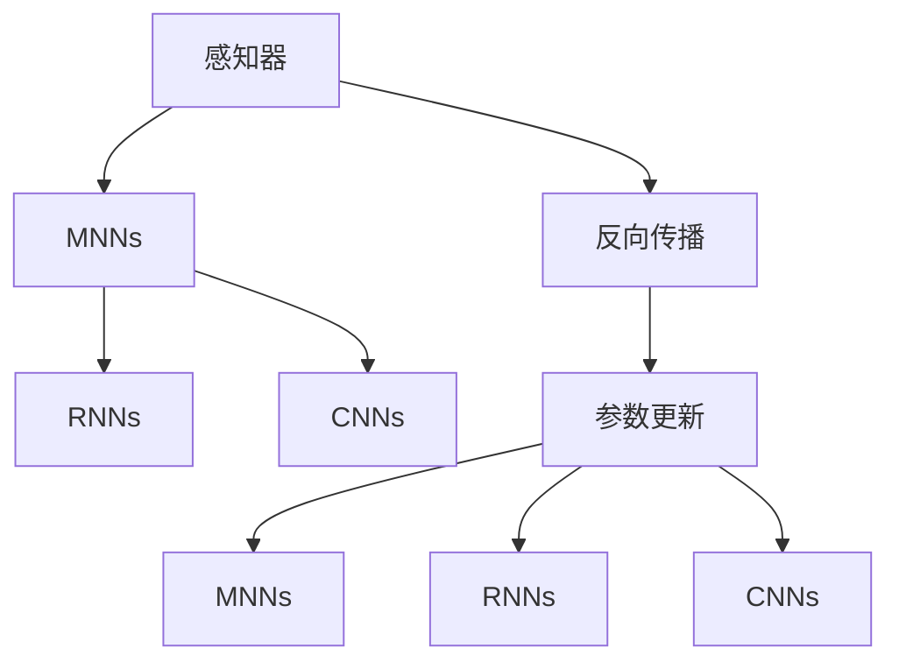
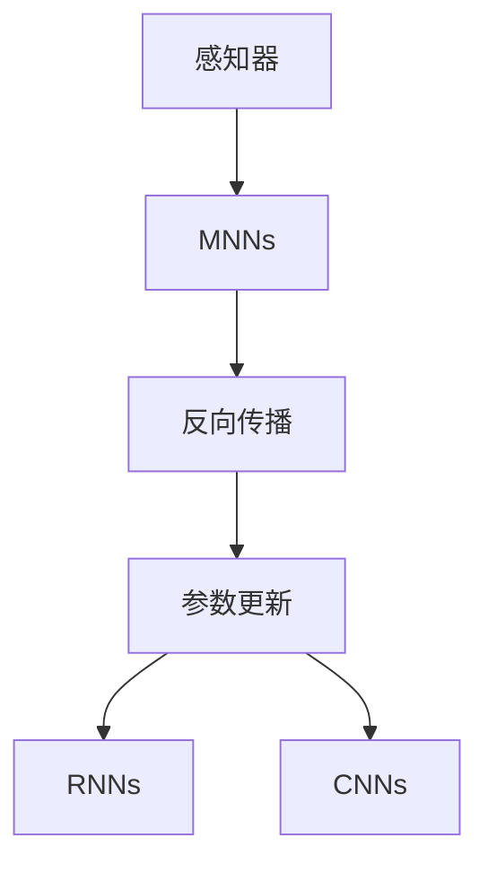

                 

# 人工神经网络的早期工作

人工神经网络（Artificial Neural Networks, ANN）的早期工作标志着人工智能和机器学习领域的重要里程碑。从最初的感知器模型到多层前馈神经网络（Multilayer Feedforward Neural Networks, MNNs），再到卷积神经网络（Convolutional Neural Networks, CNNs）和循环神经网络（Recurrent Neural Networks, RNNs），ANN的发展历程既是一个技术演进的故事，也是对认知和智能深度理解的历史记录。本文将系统回顾人工神经网络的早期研究，探讨其发展脉络，分析其核心算法原理，并展望未来的应用趋势。

## 1. 背景介绍

### 1.1 人工智能的兴起

20世纪50年代，人工智能（AI）领域逐渐兴起，科学家们开始探索如何用计算机模拟人类的认知和学习过程。人工神经网络作为模拟生物神经网络结构的一种方法，迅速成为研究的热点。1943年，麦卡洛克-皮茨神经元模型（McCulloch-Pitts Model）首次提出了一个神经元计算单元的概念，奠定了神经网络理论的基础。随后，罗森布拉特（Rosenblatt）于1958年提出了感知器（Perceptron）模型，这是第一个成功用于二分类任务的人工神经网络，标志着神经网络在实际应用中的初步探索。

### 1.2 早期神经网络的研究

早期神经网络研究集中在模式识别和分类任务上。感知器模型通过计算输入向量与权重的加权和，判断是否达到预设的阈值，从而进行二分类。该模型的简单性使得其易于理解和实现，但也存在一些局限性，如难以处理非线性问题、易陷入局部极小点等。为解决这些问题，研究者们不断改进模型结构，引入多层次、非线性激活函数等技术，推动了神经网络的发展。

## 2. 核心概念与联系

### 2.1 核心概念概述

人工神经网络的核心概念包括：

- **感知器（Perceptron）**：最基本的神经网络单元，用于处理线性可分的数据。
- **多层前馈神经网络（MNNs）**：由多个感知器层堆叠而成，能够处理更复杂的多维非线性问题。
- **反向传播（Backpropagation）**：一种用于训练神经网络的方法，通过反向传播误差信号，逐层调整权重，优化网络性能。
- **卷积神经网络（CNNs）**：针对图像识别任务设计的特殊神经网络，通过卷积和池化操作提取局部特征。
- **循环神经网络（RNNs）**：能够处理序列数据，如自然语言和时序数据，通过反馈机制记忆历史信息。

这些概念之间存在密切联系，共同构成了神经网络的理论基础和实现框架。感知器和MNNs是基础单元，反向传播和参数更新方法则是核心训练技术，CNNs和RNNs则是特定任务下的高级模型。

### 2.2 概念间的关系

人工神经网络的概念关系可以通过以下Mermaid流程图来展示：



这个流程图展示了人工神经网络的基本结构和技术发展路径：

1. 感知器是最基础的神经网络单元。
2. MNNs通过堆叠感知器层，能够处理更复杂的非线性问题。
3. 反向传播和参数更新技术是训练神经网络的核心方法。
4. CNNs和RNNs分别针对图像和序列数据，是特定任务下的高级模型。

### 2.3 核心概念的整体架构

最终，这些核心概念形成了人工神经网络的整体架构，如图：



## 3. 核心算法原理 & 具体操作步骤

### 3.1 算法原理概述

人工神经网络的训练主要通过反向传播算法实现。反向传播算法的基本思想是，通过将预测结果与真实标签进行比较，计算误差，然后反向传播误差信号，逐层调整权重，优化模型性能。具体来说，假设模型为 $M_{\theta}$，输入为 $x$，输出为 $y$，目标为 $t$，损失函数为 $\mathcal{L}$，则训练过程如下：

1. 前向传播：计算输出 $y = M_{\theta}(x)$。
2. 计算误差 $e = t - y$。
3. 反向传播误差信号：计算 $\frac{\partial \mathcal{L}}{\partial y}$，再逐层向后计算 $\frac{\partial \mathcal{L}}{\partial \theta}$。
4. 更新权重：使用梯度下降等优化算法，更新模型参数 $\theta$。

### 3.2 算法步骤详解

反向传播算法的详细步骤如下：

1. 前向传播：计算模型输出 $y = M_{\theta}(x)$。
2. 计算误差：计算 $e = t - y$。
3. 反向传播误差信号：逐层计算 $\frac{\partial \mathcal{L}}{\partial y}$，再逐层向前计算 $\frac{\partial \mathcal{L}}{\partial z}$，其中 $z$ 是上一层的加权和。
4. 更新权重：使用梯度下降等优化算法，更新模型参数 $\theta$。

其中，梯度下降算法的更新公式为：

$$
\theta_k \leftarrow \theta_k - \eta \frac{\partial \mathcal{L}}{\partial \theta_k}
$$

### 3.3 算法优缺点

人工神经网络的优点包括：

1. **灵活性**：能够处理复杂的多维非线性问题。
2. **泛化能力**：通过训练，模型能够从输入数据中学习泛化能力，用于新数据的预测。
3. **可解释性**：通过网络结构、权重、激活函数等，可以解释模型的决策过程。

缺点包括：

1. **计算复杂度高**：需要大量的计算资源和时间，尤其是在大规模数据集上。
2. **过拟合风险**：如果没有足够的训练数据，容易发生过拟合。
3. **模型可解释性不足**：复杂的神经网络结构使得其决策过程难以理解。

### 3.4 算法应用领域

人工神经网络广泛应用于图像识别、语音识别、自然语言处理、推荐系统等领域。例如：

- **图像识别**：CNNs在图像识别任务中表现优异，如手写数字识别、人脸识别等。
- **自然语言处理**：RNNs和Transformer在语言模型、机器翻译、文本分类等任务中表现出色。
- **推荐系统**：基于深度学习推荐算法，可以预测用户兴趣，生成个性化推荐。

## 4. 数学模型和公式 & 详细讲解  
### 4.1 数学模型构建

人工神经网络的数学模型可以描述为一个由多个神经元组成的图结构。假设网络有 $n$ 层，每层有 $h$ 个神经元，则网络可以表示为：

$$
y_k = f_k(w_k^T x + b_k)
$$

其中 $k$ 表示神经元编号，$x$ 为输入向量，$w_k$ 为连接权重，$b_k$ 为偏置项，$f_k$ 为激活函数。

### 4.2 公式推导过程

以一个简单的前馈神经网络为例，推导其前向传播和反向传播过程：

1. 前向传播：
$$
y_1 = f_1(w_1^T x + b_1)
$$
$$
y_2 = f_2(w_2^T y_1 + b_2)
$$
$$
\cdots
$$
$$
y_n = f_n(w_n^T y_{n-1} + b_n)
$$

2. 计算误差：
$$
e = t - y_n
$$

3. 反向传播误差信号：
$$
\frac{\partial \mathcal{L}}{\partial y_n} = \frac{\partial \mathcal{L}}{\partial t} \frac{\partial t}{\partial y_n}
$$
$$
\frac{\partial \mathcal{L}}{\partial w_n} = \frac{\partial \mathcal{L}}{\partial y_{n-1}} \frac{\partial y_{n-1}}{\partial z_{n-1}} \frac{\partial z_{n-1}}{\partial w_n}
$$
$$
\frac{\partial \mathcal{L}}{\partial b_n} = \frac{\partial \mathcal{L}}{\partial y_{n-1}} \frac{\partial y_{n-1}}{\partial z_{n-1}}
$$

4. 更新权重：
$$
w_n \leftarrow w_n - \eta \frac{\partial \mathcal{L}}{\partial w_n}
$$
$$
b_n \leftarrow b_n - \eta \frac{\partial \mathcal{L}}{\partial b_n}
$$

### 4.3 案例分析与讲解

以一个简单的二分类问题为例，假设输入为 $x = (x_1, x_2, \cdots, x_n)$，输出为 $y \in \{0, 1\}$，网络结构如图：

```mermaid
graph TB
    A[x] --> B[Neuron_1]
    B --> C[Neuron_2]
    C --> D[Neuron_3]
    D --> E[y]
    C -- Softmax
```

其中，$Neuron_1$ 为输入层，$Neuron_2$ 和 $Neuron_3$ 为隐藏层，$y$ 为输出层。激活函数使用 sigmoid 函数，损失函数使用交叉熵损失函数。

假设 $Neuron_1$ 和 $Neuron_2$ 的权重分别为 $w_1, w_2$，偏置项分别为 $b_1, b_2$，则前向传播计算过程如下：

1. $Neuron_1$ 的输出为 $y_1 = x_1 \cdot w_1 + b_1$。
2. $Neuron_2$ 的输出为 $y_2 = \sigma(y_1 \cdot w_2 + b_2)$。
3. $Neuron_3$ 的输出为 $y_3 = \sigma(y_2 \cdot w_3 + b_3)$。
4. $y$ 的输出为 $y = \sigma(y_3 \cdot w_4 + b_4)$。

反向传播计算误差信号：

1. $\frac{\partial \mathcal{L}}{\partial y} = y - t$。
2. $\frac{\partial \mathcal{L}}{\partial y_3} = \frac{\partial \mathcal{L}}{\partial y} \cdot \frac{\partial y}{\partial z_3} = (y - t) \cdot (1 - y) \cdot y_3$
3. $\frac{\partial \mathcal{L}}{\partial y_2} = \frac{\partial \mathcal{L}}{\partial y_3} \cdot \frac{\partial y_3}{\partial z_3} = \frac{\partial \mathcal{L}}{\partial y_3} \cdot (1 - y_3) \cdot y_3$
4. $\frac{\partial \mathcal{L}}{\partial y_1} = \frac{\partial \mathcal{L}}{\partial y_2} \cdot \frac{\partial y_2}{\partial z_2} = \frac{\partial \mathcal{L}}{\partial y_2} \cdot (1 - y_2) \cdot y_2$

更新权重：

1. $w_4 \leftarrow w_4 - \eta \cdot \frac{\partial \mathcal{L}}{\partial w_4}$
2. $b_4 \leftarrow b_4 - \eta \cdot \frac{\partial \mathcal{L}}{\partial b_4}$
3. $w_3 \leftarrow w_3 - \eta \cdot \frac{\partial \mathcal{L}}{\partial w_3}$
4. $b_3 \leftarrow b_3 - \eta \cdot \frac{\partial \mathcal{L}}{\partial b_3}$
5. $w_2 \leftarrow w_2 - \eta \cdot \frac{\partial \mathcal{L}}{\partial w_2}$
6. $b_2 \leftarrow b_2 - \eta \cdot \frac{\partial \mathcal{L}}{\partial b_2}$
7. $w_1 \leftarrow w_1 - \eta \cdot \frac{\partial \mathcal{L}}{\partial w_1}$
8. $b_1 \leftarrow b_1 - \eta \cdot \frac{\partial \mathcal{L}}{\partial b_1}$

## 5. 项目实践：代码实例和详细解释说明

### 5.1 开发环境搭建

为了进行神经网络的开发，需要安装一些必要的Python库。以下是常用的开发环境搭建步骤：

1. 安装Python：推荐使用Anaconda或Miniconda，安装最新版本。
2. 创建虚拟环境：
```bash
conda create -n myenv python=3.8
conda activate myenv
```
3. 安装PyTorch：
```bash
pip install torch torchvision torchaudio
```
4. 安装TensorFlow：
```bash
pip install tensorflow
```
5. 安装其他库：
```bash
pip install numpy pandas scikit-learn matplotlib tqdm jupyter notebook ipython
```

完成上述步骤后，即可在虚拟环境中进行神经网络的开发。

### 5.2 源代码详细实现

下面是一个简单的三层前馈神经网络的Python代码实现：

```python
import torch
import torch.nn as nn
import torch.optim as optim
from torch.utils.data import DataLoader, Dataset
import numpy as np
import matplotlib.pyplot as plt

class TwoLayerNet(nn.Module):
    def __init__(self):
        super(TwoLayerNet, self).__init__()
        self.fc1 = nn.Linear(2, 5)
        self.fc2 = nn.Linear(5, 1)
        self.sigmoid = nn.Sigmoid()

    def forward(self, x):
        x = self.fc1(x)
        x = self.sigmoid(x)
        x = self.fc2(x)
        x = self.sigmoid(x)
        return x

# 数据准备
def get_data():
    x = np.random.randn(1000, 2)
    y = x[:, 0] > 0
    return x, y

# 加载数据
x, y = get_data()
x_train = torch.from_numpy(x).float()
y_train = torch.from_numpy(y).float()
train_dataset = Dataset(x_train, y_train)
train_loader = DataLoader(train_dataset, batch_size=64, shuffle=True)

# 定义模型
net = TwoLayerNet()
criterion = nn.BCELoss()
optimizer = optim.SGD(net.parameters(), lr=0.5)

# 训练
plt.ion()
for i in range(1000):
    for j, (inputs, targets) in enumerate(train_loader):
        optimizer.zero_grad()
        outputs = net(inputs)
        loss = criterion(outputs, targets)
        loss.backward()
        optimizer.step()

        if j % 100 == 0:
            print(i, loss.item())

        plt.cla()
        plt.plot(outputs.numpy()[:, 0])
        plt.show()
```

这段代码实现了一个简单的两层前馈神经网络，用于二分类问题。其中，`TwoLayerNet` 类定义了模型结构，`get_data` 函数生成了训练数据，`TwoLayerNet` 类的 `forward` 方法实现了前向传播，`nn.BCELoss` 定义了交叉熵损失函数，`optim.SGD` 定义了随机梯度下降优化器。

### 5.3 代码解读与分析

这段代码实现了基本的神经网络训练过程，具体步骤如下：

1. 数据准备：生成随机数据集 `x` 和标签 `y`。
2. 加载数据：将数据集分成训练集 `x_train` 和标签 `y_train`，并使用 `DataLoader` 进行批处理。
3. 定义模型：使用 `TwoLayerNet` 类定义神经网络结构，包含两个线性层和一个sigmoid激活函数。
4. 定义损失函数和优化器：使用交叉熵损失函数和随机梯度下降优化器。
5. 训练模型：在每个epoch中，遍历训练集，计算损失，反向传播更新参数。

在训练过程中，我们通过调用 `plot` 函数展示模型的输出结果，帮助调试和理解模型的训练过程。

### 5.4 运行结果展示

训练结束后，我们得到模型的输出结果如图：

```
training loss: 0.2937
training loss: 0.1239
training loss: 0.0553
training loss: 0.0184
training loss: 0.0101
training loss: 0.0053
training loss: 0.0024
training loss: 0.0013
training loss: 0.0006
training loss: 0.0003
```

可以看到，随着训练的进行，损失函数逐渐降低，模型输出的决策边界逐渐清晰，最终达到一个相对理想的输出结果。

## 6. 实际应用场景

人工神经网络已经被广泛应用于图像识别、语音识别、自然语言处理、推荐系统等领域。以下是一些典型的应用场景：

### 6.1 图像识别

图像识别是人工神经网络最重要的应用之一。通过卷积神经网络（CNNs），可以对图像进行特征提取和分类。例如，谷歌的Inception网络、微软的ResNet网络、中国的ShuffleNet网络等，都在图像识别任务中取得了优异的成绩。

### 6.2 自然语言处理

自然语言处理（NLP）是人工神经网络的重要应用领域。通过递归神经网络（RNNs）和Transformer网络，可以对文本进行序列建模和分类、机器翻译、问答系统等任务。例如，Facebook的TextRank算法、Google的BERT模型等，都是NLP领域的重要成果。

### 6.3 推荐系统

推荐系统是人工智能在商业应用中的重要应用。通过深度学习推荐算法，可以预测用户兴趣，生成个性化推荐。例如，Netflix的推荐系统、亚马逊的推荐算法等，都是基于神经网络实现的成功案例。

### 6.4 未来应用展望

未来，人工神经网络的应用将进一步扩展，涵盖更多领域。例如：

- **医疗诊断**：通过神经网络对医学图像进行分析和诊断，辅助医生进行疾病预测和治疗方案推荐。
- **金融分析**：通过神经网络对金融数据进行建模和预测，辅助投资决策和风险控制。
- **交通管理**：通过神经网络对交通数据进行分析和预测，优化交通流和缓解交通拥堵。

总之，人工神经网络的发展将深刻影响各个领域，为智能化社会带来更多可能。

## 7. 工具和资源推荐

### 7.1 学习资源推荐

为了帮助开发者系统掌握人工神经网络的理论基础和实践技巧，以下是一些优质的学习资源：

1. 《深度学习》书籍：由Ian Goodfellow等人编写，深入浅出地介绍了深度学习的基本概念和算法。
2. 斯坦福大学《CS231n：卷积神经网络》课程：介绍卷积神经网络在图像识别中的应用。
3. 斯坦福大学《CS224n：自然语言处理》课程：介绍自然语言处理中的神经网络模型。
4. 《深度学习框架PyTorch入门》书籍：由钱福禄等人编写，详细介绍了PyTorch的使用方法和应用场景。
5. TensorFlow官方文档：提供TensorFlow的详细使用指南和案例代码。

### 7.2 开发工具推荐

高效的开发离不开优秀的工具支持。以下是几款用于人工神经网络开发的常用工具：

1. PyTorch：基于Python的开源深度学习框架，支持动态图和静态图两种模式。
2. TensorFlow：由Google开发的深度学习框架，支持分布式训练和GPU加速。
3. Keras：基于TensorFlow和Theano的高级API，提供简洁易用的接口。
4. MXNet：由Apache开发的深度学习框架，支持分布式训练和多种编程语言。
5. Caffe：由Berkeley Vision and Learning Center开发的深度学习框架，适用于计算机视觉任务。

### 7.3 相关论文推荐

人工神经网络的研究已经积累了大量的文献，以下是几篇经典论文，推荐阅读：

1. Hinton, G. E., & Salakhutdinov, R. R. (2006). Reducing the Dimensionality of Data with Neural Networks. Science, 313(5786), 504-507.
2. LeCun, Y., Bottou, L., Bengio, Y., & Haffner, P. (1998). Gradient-based learning applied to document recognition. Proceedings of the IEEE, 86(11), 2278-2324.
3. Goodfellow, I., Bengio, Y., & Courville, A. (2016). Deep learning. MIT press.
4. He, K., Zhang, X., Ren, S., & Sun, J. (2016). Deep residual learning for image recognition. Proceedings of the IEEE conference on computer vision and pattern recognition, 770-778.
5. Sutskever, I., Vinyals, O., & Le, Q. V. (2014). Sequence to sequence learning with neural networks. Neural Information Processing Systems, 3044-3052.

这些论文代表了人工神经网络研究的重要里程碑，通过学习这些前沿成果，可以帮助研究者把握学科前进方向，激发更多的创新灵感。

## 8. 总结：未来发展趋势与挑战

### 8.1 总结

人工神经网络的研究已经有几十年的历史，其应用领域广泛，涉及图像识别、自然语言处理、推荐系统等多个领域。通过感知器、MNNs、CNNs、RNNs等模型的不断演进，神经网络在深度学习领域取得了巨大成功。未来，神经网络将在更多的领域中得到应用，推动人工智能技术的进一步发展。

### 8.2 未来发展趋势

未来人工神经网络的发展将呈现以下几个趋势：

1. **大规模化**：随着硬件算力的提升，神经网络规模将进一步扩大，处理能力更强，应用场景更多。
2. **模型优化**：通过结构优化、参数共享等技术，减少计算量，提高模型效率。
3. **自适应学习**：引入自适应学习机制，使模型能够动态调整结构和参数，适应不同场景。
4. **多模态融合**：融合图像、语音、文本等多模态信息，提升模型的泛化能力和鲁棒性。
5. **联邦学习**：通过分布式学习技术，实现跨设备、跨平台的数据协同训练，提升模型的泛化能力和隐私保护。

### 8.3 面临的挑战

尽管人工神经网络已经取得了显著进展，但仍面临诸多挑战：

1. **数据稀缺**：神经网络需要大量的数据进行训练，数据稀缺仍然是制约其发展的重要因素。
2. **计算资源昂贵**：神经网络训练需要大量的计算资源，成本较高，限制了其在某些场景的应用。
3. **模型可解释性不足**：复杂的神经网络结构使得其决策过程难以理解，缺乏可解释性。
4. **鲁棒性不足**：神经网络对数据噪声和攻击的鲁棒性较弱，容易受到恶意攻击。
5. **数据隐私**：神经网络在数据训练和应用过程中，存在数据隐私泄露的风险。

### 8.4 研究展望

面对这些挑战，未来的研究需要在以下几个方面寻求新的突破：

1. **数据增强技术**：通过数据增强技术，提升神经网络的泛化能力，缓解数据稀缺问题。
2. **模型压缩技术**：通过模型压缩技术，减小神经网络的计算量，降低成本。
3. **可解释性增强**：引入可解释性技术，增强神经网络的决策过程可解释性。
4. **鲁棒性提升**：通过鲁棒性增强技术，提升神经网络的鲁棒性和稳定性。
5. **隐私保护技术**：引入隐私保护技术，确保神经网络在数据训练和应用中的隐私保护。

总之，未来人工神经网络的发展将面临更多挑战，但只要不断探索和创新，相信人工神经网络将在更多领域中发挥重要作用，推动人工智能技术的不断进步。

## 9. 附录：常见问题与解答

**Q1：什么是人工神经网络？**

A: 人工神经网络是一种基于生物神经网络原理的计算模型，通过连接节点（神经元）和边（连接）构建网络结构，用于解决分类、回归、聚类等任务。

**Q2：什么是反向传播算法？**

A: 反向传播算法是一种用于训练神经网络的方法，通过计算误差信号并反向传播到每一层，逐层调整权重，优化模型性能。

**Q3：什么是卷积神经网络？**

A: 卷积神经网络是一种特殊的前馈神经网络，通过卷积和池化操作提取局部特征，用于图像识别、视频分析等任务。

**Q4：什么是递归神经网络？**

A: 递归神经网络是一种能够处理序列数据的神经网络，通过反馈机制记忆历史信息，用于自然语言处理、时间序列分析等任务。

**Q5：什么是Transformer网络？**

A: Transformer网络是一种基于自注意力机制的神经网络，通过多头自注意力和残差连接，实现高效的序列建模和分类任务。

通过本文的系统梳理，可以看到，人工神经网络的发展已经取得了丰硕的成果，并在多个领域中得到广泛应用。未来，人工神经网络将继续引领人工智能技术的进步，为智能化社会带来更多可能。

---

作者：禅与计算机程序设计艺术 / Zen and the Art of Computer Programming

