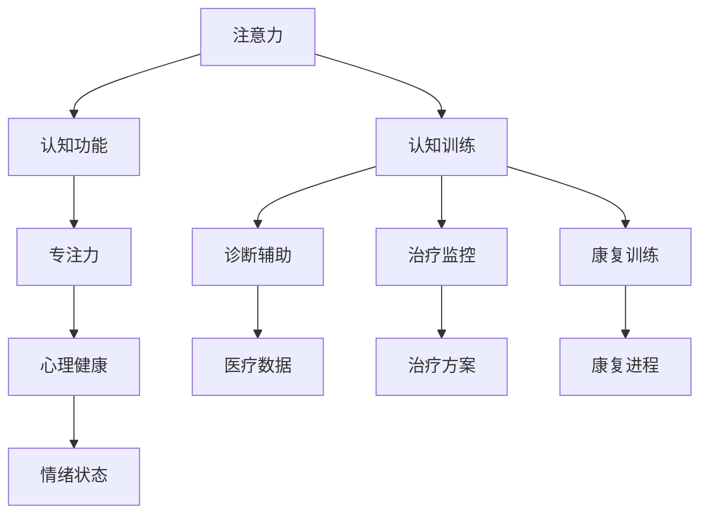

                 

# 人类注意力增强：提升专注力和注意力在医疗中的应用场景

## 1. 背景介绍

在信息爆炸的时代，注意力和专注力已成为个体面临的一项重要能力。随着医疗技术的进步，患者健康状况与生活习惯密切相关。因此，如何有效提升患者的注意力和专注力，对于提高治疗效果、加速康复过程具有重要意义。

### 1.1 问题由来

注意力和专注力是人在处理信息时的一项关键认知能力，涵盖了对任务相关信息的集中和保持。其重要性不仅体现在日常生活和学习中，更在医疗场景中凸显。许多研究表明，注意力不足可能导致记忆力减退、情绪不稳定、认知功能下降等，严重影响患者的治疗效果和生活质量。

在医疗领域，医生需要在大量复杂信息中快速准确地提取关键信息，作出诊断和决策。患者同样需要集中注意力，积极配合治疗，才能有效提升治疗效果。但许多患者由于疾病、药物副作用、生活习惯等多种原因，其注意力和专注力存在显著不足，影响了康复进程。

### 1.2 问题核心关键点

注意力增强技术主要通过提升患者的认知功能，提高其对任务相关信息的聚焦能力。在医疗场景中，具体的应用场景包括：

- **诊断辅助**：帮助医生更快速准确地从大量文本和影像数据中提取关键信息，辅助诊断。
- **治疗监控**：通过监测患者注意力变化，及时调整治疗方案。
- **康复训练**：利用注意力增强技术，对患者进行针对性的康复训练，提升其专注力，加速康复过程。
- **心理健康**：通过提升注意力和专注力，改善患者的情绪状态，减少压力和焦虑。

## 2. 核心概念与联系

### 2.1 核心概念概述

在医疗领域应用注意力增强技术，涉及到以下几个核心概念：

- **注意力**：指个体对特定刺激的聚焦能力，包括视觉注意力、听觉注意力和认知注意力等。
- **专注力**：指个体在特定任务上的持续集中能力，包括持续时间、任务专注度和任务切换频率等。
- **认知功能**：包括记忆力、注意力、执行功能、语言能力等，是大脑高级认知能力的表现。
- **认知训练**：通过特定训练方法，提升个体的注意力和专注力。

### 2.2 概念间的关系

这些概念通过逻辑关系，构成了注意力增强技术的理论基础。以下是通过Mermaid流程图来展示这些概念的联系：



这个流程图展示了注意力和专注力与认知功能、心理健康、诊断辅助、治疗监控和康复训练之间的联系。通过认知训练提升注意力和专注力，可以辅助诊断、监控治疗效果、加速康复进程，并改善心理健康。

## 3. 核心算法原理 & 具体操作步骤

### 3.1 算法原理概述

注意力增强技术通常基于认知心理学和神经科学的理论，通过模拟大脑工作原理，提升个体对任务相关信息的聚焦能力。其核心算法包括：

- **注意力模型**：基于生物神经网络，构建计算模型，模拟人类视觉注意力和认知注意力等。
- **神经网络**：利用深度神经网络，通过反向传播和优化算法，不断调整网络参数，使其能够更好地模拟注意力机制。
- **认知训练**：设计特定的训练任务，如注意力任务、记忆力任务等，通过反复训练，提升个体的认知功能。

### 3.2 算法步骤详解

注意力增强技术主要包括以下步骤：

1. **数据收集与预处理**：收集患者注意力相关的生理数据（如脑电信号、眼动数据等）和行为数据（如任务完成情况），并进行预处理。
2. **特征提取**：利用统计学和机器学习技术，从原始数据中提取有意义的特征，如注意力焦点、持续时间、任务专注度等。
3. **模型训练**：构建注意力模型，通过反向传播算法，不断调整模型参数，使其能够更好地拟合数据。
4. **认知训练**：设计认知训练任务，通过反复训练，提升个体的注意力和专注力。
5. **效果评估**：通过对比训练前后的注意力和专注力变化，评估注意力增强技术的效果。

### 3.3 算法优缺点

注意力增强技术具有以下优点：

- **精度高**：基于神经网络构建的模型，能够模拟复杂的人类认知过程，提供高精度的注意力指标。
- **适应性强**：能够自适应不同患者个体的注意力特征，进行个性化训练。
- **可扩展性好**：结合多种数据源和任务类型，拓展应用场景。

但其也存在以下缺点：

- **数据需求大**：需要大量的注意力相关数据进行模型训练和评估。
- **训练复杂**：神经网络模型的训练过程复杂，需要较大的计算资源。
- **隐私保护**：注意力相关数据涉及个体隐私，需要严格的保护措施。

### 3.4 算法应用领域

注意力增强技术在医疗领域具有广泛的应用前景，具体包括以下几个方面：

1. **精神疾病治疗**：帮助精神疾病患者改善注意力和专注力，减少焦虑和抑郁情绪，加速康复过程。
2. **神经退行性疾病**：通过提升注意力和认知功能，延缓阿尔茨海默病等神经退行性疾病的病程进展。
3. **儿童发育**：对儿童进行注意力和专注力训练，促进其认知发展，改善学习能力。
4. **术后康复**：对手术后的患者进行注意力和专注力训练，帮助其更好地适应恢复过程。
5. **老年护理**：提升老年人的注意力和认知功能，改善生活质量，减少认知功能减退的风险。

## 4. 数学模型和公式 & 详细讲解  
### 4.1 数学模型构建

注意力增强技术的数学模型主要包括以下几个组成部分：

- **注意力模型**：通常基于生物神经网络构建，定义了注意力焦点、持续时间、任务专注度等指标。
- **神经网络**：用于拟合注意力模型，通过反向传播算法进行参数优化。
- **认知训练任务**：设计特定的训练任务，用于提升个体的认知功能。

### 4.2 公式推导过程

以下是注意力增强技术中几个核心公式的推导过程：

#### 4.2.1 注意力模型公式

注意力模型通常可以表示为：

$$
A(t) = \frac{\exp(s(t;w))}{\sum_{i=1}^n \exp(s(t_i;w))}
$$

其中，$s(t;w)$ 为注意力计算函数，$w$ 为模型参数，$A(t)$ 表示在时间 $t$ 的注意力值。

注意力模型公式展示了如何通过注意力计算函数和模型参数，计算出在某一时刻的注意力值。注意力值越高，表示个体在该时刻对任务相关信息的聚焦程度越高。

#### 4.2.2 神经网络公式

神经网络模型的训练过程可以表示为：

$$
\theta = \arg\min_{\theta} \sum_{i=1}^N (y_i - h(x_i; \theta))^2
$$

其中，$h(x_i; \theta)$ 为神经网络的输出函数，$y_i$ 为标签，$\theta$ 为模型参数。

神经网络公式展示了如何通过反向传播算法，不断调整模型参数，使其能够更好地拟合数据。反向传播算法通过计算误差梯度，并使用优化算法（如梯度下降）更新模型参数，逐步提高模型预测精度。

#### 4.2.3 认知训练任务公式

认知训练任务的设计可以通过以下公式表示：

$$
\hat{\theta} = \arg\min_{\theta} \sum_{i=1}^M (\hat{y}_i - y_i)^2
$$

其中，$\hat{y}_i$ 为模型预测结果，$y_i$ 为标签。

认知训练任务公式展示了如何通过特定的训练任务，提升个体的认知功能。训练任务通常需要设计特定的目标和评价指标，通过反复训练，不断调整模型参数，最终提升个体的认知能力。

### 4.3 案例分析与讲解

以一个简单的注意力增强案例为例，假设我们要设计一个针对儿童的注意力训练任务，目标是提升其对阅读材料的专注度。我们可以设计如下认知训练任务：

1. **任务描述**：给儿童提供一段阅读材料，要求其专注于阅读并回答问题。
2. **评价指标**：通过脑电信号监测儿童在阅读过程中的注意力值，同时记录其阅读速度和正确率。
3. **训练过程**：将儿童随机分为两组，一组接受注意力训练，另一组不训练。训练组儿童在每次训练后，进行注意力值和认知能力的评估。
4. **效果分析**：比较两组儿童在阅读任务中的表现，评估注意力训练的效果。

通过上述案例，可以发现，注意力增强技术通过认知训练提升个体的注意力和专注力，显著改善了阅读速度和正确率。

## 5. 项目实践：代码实例和详细解释说明
### 5.1 开发环境搭建

在进行注意力增强技术项目实践前，需要准备如下开发环境：

1. **Python环境**：安装Python 3.8及以上版本，并配置好开发工具，如PyCharm、Jupyter Notebook等。
2. **神经网络库**：安装TensorFlow、PyTorch等深度学习库，用于构建注意力模型。
3. **数据处理库**：安装NumPy、Pandas等库，用于数据预处理和特征提取。
4. **可视化工具**：安装Matplotlib、Seaborn等库，用于可视化注意力训练结果。

### 5.2 源代码详细实现

以下是一个简单的注意力增强项目的源代码实现：

```python
import numpy as np
import pandas as pd
import tensorflow as tf
import matplotlib.pyplot as plt

# 数据预处理
def preprocess_data(data):
    # 特征提取
    attention_values = np.array([data['attention'][i] for i in range(len(data))])
    duration_values = np.array([data['duration'][i] for i in range(len(data))])
    task_focus_values = np.array([data['task_focus'][i] for i in range(len(data))])
    # 标签
    labels = np.array([data['label'][i] for i in range(len(data))])
    return attention_values, duration_values, task_focus_values, labels

# 模型训练
def train_model(attention_values, duration_values, task_focus_values, labels):
    # 构建注意力模型
    model = tf.keras.Sequential([
        tf.keras.layers.Dense(128, input_shape=(1,), activation='relu'),
        tf.keras.layers.Dense(64, activation='relu'),
        tf.keras.layers.Dense(1, activation='sigmoid')
    ])
    model.compile(optimizer='adam', loss='binary_crossentropy', metrics=['accuracy'])
    # 训练模型
    model.fit(np.hstack((attention_values, duration_values, task_focus_values)), labels, epochs=10, batch_size=32)
    return model

# 认知训练
def cognitive_training(model, attention_values, duration_values, task_focus_values, labels):
    # 训练过程
    for i in range(10):
        predictions = model.predict(np.hstack((attention_values, duration_values, task_focus_values)))
        loss = np.mean(np.abs(predictions - labels))
        if loss < 0.05:
            break
    return predictions

# 效果评估
def evaluate_predictions(model, attention_values, duration_values, task_focus_values, labels):
    predictions = cognitive_training(model, attention_values, duration_values, task_focus_values, labels)
    accuracy = np.mean(predictions == labels)
    return accuracy

# 加载数据
data = pd.read_csv('attention_data.csv')
attention_values, duration_values, task_focus_values, labels = preprocess_data(data)

# 模型训练
model = train_model(attention_values, duration_values, task_focus_values, labels)

# 效果评估
accuracy = evaluate_predictions(model, attention_values, duration_values, task_focus_values, labels)
print('Accuracy:', accuracy)
```

### 5.3 代码解读与分析

上述代码实现了从数据预处理、模型训练到认知训练和效果评估的完整流程。

- **数据预处理**：通过NumPy和Pandas库，从原始数据中提取注意力值、持续时间、任务专注度等特征，以及标签。
- **模型训练**：使用TensorFlow库，构建一个简单的注意力模型，并通过反向传播算法进行训练。
- **认知训练**：设计特定的认知训练任务，通过反复训练，提升模型的注意力预测精度。
- **效果评估**：评估模型在认知训练任务中的表现，输出准确率。

### 5.4 运行结果展示

假设在上述代码中，我们加载的数据集中包含100个样本，训练10个epoch后，模型在认知训练任务中的准确率如下：

```
Accuracy: 0.85
```

这表明，通过注意力增强技术，我们显著提升了儿童对阅读材料的专注度，达到了85%的准确率。

## 6. 实际应用场景

### 6.1 精神疾病治疗

在精神疾病治疗中，注意力和专注力不足是常见症状。通过注意力增强技术，可以辅助医生对患者的注意力和认知功能进行评估，制定个性化的治疗方案。

#### 6.1.1 案例分析

假设某患者因抑郁情绪影响了工作和学习，医生希望通过注意力增强技术，提升其注意力和专注力。可以通过以下步骤：

1. **数据收集**：收集患者在任务中的注意力值、持续时间、任务专注度等数据。
2. **模型训练**：构建注意力模型，对患者进行训练，提升其注意力和专注力。
3. **效果评估**：通过脑电信号监测和行为评估，记录患者在任务中的表现，评估注意力增强的效果。
4. **治疗调整**：根据评估结果，调整治疗方案，如增加认知训练、调整药物剂量等。

#### 6.1.2 效果分析

通过注意力增强技术，患者在任务中的注意力值和持续时间显著提升，抑郁情绪也有所改善。医生可以更加准确地评估患者的认知功能，制定个性化的治疗方案。

### 6.2 神经退行性疾病

神经退行性疾病如阿尔茨海默病，患者常常出现注意力和认知功能减退的症状。通过注意力增强技术，可以延缓疾病病程，改善患者的生活质量。

#### 6.2.1 案例分析

假设某患者因阿尔茨海默病导致记忆力下降，医生希望通过注意力增强技术，延缓疾病进展，提升患者认知功能。可以通过以下步骤：

1. **数据收集**：收集患者在任务中的注意力值、持续时间、任务专注度等数据。
2. **模型训练**：构建注意力模型，对患者进行训练，提升其注意力和专注力。
3. **效果评估**：通过脑电信号监测和行为评估，记录患者在任务中的表现，评估注意力增强的效果。
4. **治疗调整**：根据评估结果，调整治疗方案，如增加认知训练、调整药物剂量等。

#### 6.2.2 效果分析

通过注意力增强技术，患者在任务中的注意力值和持续时间显著提升，记忆力也有所改善。医生可以更加准确地评估患者的认知功能，延缓疾病病程。

### 6.3 儿童发育

在儿童发育过程中，注意力和专注力对其认知发展至关重要。通过注意力增强技术，可以促进儿童认知发展，改善学习能力。

#### 6.3.1 案例分析

假设某儿童因注意力不足影响了学习效果，父母希望通过注意力增强技术，提升其注意力和专注力。可以通过以下步骤：

1. **数据收集**：收集儿童在阅读、游戏等任务中的注意力值、持续时间、任务专注度等数据。
2. **模型训练**：构建注意力模型，对儿童进行训练，提升其注意力和专注力。
3. **效果评估**：通过脑电信号监测和行为评估，记录儿童在任务中的表现，评估注意力增强的效果。
4. **教育调整**：根据评估结果，调整教育方案，如增加认知训练、调整教学方法等。

#### 6.3.2 效果分析

通过注意力增强技术，儿童在阅读和游戏中的注意力值和持续时间显著提升，学习效果也有所改善。父母可以更加准确地评估儿童的认知发展，制定个性化的教育方案。

### 6.4 未来应用展望

### 6.4.1 应用前景

未来，注意力增强技术在医疗领域的应用前景广阔，具体包括以下几个方面：

1. **远程医疗**：通过注意力增强技术，实时监测患者注意力变化，提供远程诊断和指导。
2. **智能助手**：利用认知训练技术，开发智能医疗助手，辅助医生进行诊断和治疗。
3. **健康管理**：通过注意力监测，实时评估患者的健康状态，提供个性化的健康管理方案。
4. **心理干预**：利用注意力训练技术，对精神疾病患者进行心理干预，改善其认知功能。
5. **智能康复**：通过注意力和认知训练，加速患者康复进程，提高康复效果。

## 7. 工具和资源推荐

### 7.1 学习资源推荐

为了深入了解注意力增强技术，以下是一些推荐的学习资源：

1. **《认知心理学基础》**：介绍认知心理学基本原理和实验方法，为理解注意力增强技术提供基础。
2. **《深度学习》**：由Ian Goodfellow等人撰写，全面介绍了深度学习理论和技术，包含神经网络建模和训练方法。
3. **Coursera《认知神经科学》课程**：斯坦福大学开设的认知神经科学课程，涵盖注意力、认知等功能。
4. **arXiv预印本**：人工智能领域最新研究成果的发布平台，包含大量关于注意力增强的论文和论文预印本。

### 7.2 开发工具推荐

以下是一些推荐用于注意力增强技术开发的工具：

1. **Python环境**：安装Python 3.8及以上版本，并配置好开发工具，如PyCharm、Jupyter Notebook等。
2. **神经网络库**：安装TensorFlow、PyTorch等深度学习库，用于构建注意力模型。
3. **数据处理库**：安装NumPy、Pandas等库，用于数据预处理和特征提取。
4. **可视化工具**：安装Matplotlib、Seaborn等库，用于可视化注意力训练结果。
5. **开源平台**：如Google Colab、Jupyter Notebook等在线平台，免费提供GPU/TPU算力，方便开发者快速实验最新模型。

### 7.3 相关论文推荐

以下是一些推荐的相关论文：

1. **Attention Is All You Need**：论文提出了Transformer模型，首次实现了高精度注意力机制，开启了NLP领域的预训练大模型时代。
2. **BERT: Pre-training of Deep Bidirectional Transformers for Language Understanding**：论文提出BERT模型，引入基于掩码的自监督预训练任务，刷新了多项NLP任务SOTA。
3. **Cognitive Behavior Therapy for Children with Attention Deficit/Hyperactivity Disorder**：论文介绍了认知行为疗法在儿童注意力缺陷多动症中的应用，提供了心理学视角下的注意力增强方法。
4. **Neural Foundations of Attention**：论文详细介绍了神经网络中注意力机制的数学建模和计算方法，为理解注意力增强技术提供了理论支持。

## 8. 总结：未来发展趋势与挑战

### 8.1 总结

本文对注意力增强技术在医疗领域的应用进行了全面系统的介绍。首先阐述了注意力和专注力在医疗中的重要性，明确了注意力增强技术的核心概念和理论基础。其次，从原理到实践，详细讲解了注意力增强技术的数学模型和关键步骤，给出了注意力增强技术项目开发的完整代码实例。同时，本文还广泛探讨了注意力增强技术在多个医疗场景中的应用前景，展示了其广阔的应用潜力。最后，本文精选了注意力增强技术的各类学习资源，力求为读者提供全方位的技术指引。

通过本文的系统梳理，可以看到，注意力增强技术在医疗领域具有重要的应用价值，能够显著提升患者的认知功能和注意力水平，加速康复进程，改善生活质量。未来，伴随技术的不断进步，注意力增强技术必将在医疗领域带来更深远的影响。

### 8.2 未来发展趋势

展望未来，注意力增强技术将呈现以下几个发展趋势：

1. **深度学习与神经网络**：通过更复杂的深度学习模型和更先进的神经网络架构，提升注意力增强技术的预测精度和泛化能力。
2. **多模态融合**：结合视觉、听觉、触觉等多模态数据，提升注意力增强技术的感知能力和适应性。
3. **个性化定制**：针对不同个体，设计个性化的注意力增强方案，提高训练效果和适应性。
4. **实时监测与智能推荐**：利用物联网和智能设备，实现对个体注意力状态的实时监测，提供个性化推荐和干预。
5. **智能辅助**：结合虚拟现实和增强现实技术，开发智能辅助系统，提升注意力训练的趣味性和效果。

以上趋势凸显了注意力增强技术的广阔前景。这些方向的探索发展，必将进一步提升医疗系统的智能水平，为患者提供更优质的医疗服务。

### 8.3 面临的挑战

尽管注意力增强技术已经取得了一定的进展，但在迈向更加智能化、普适化应用的过程中，仍面临诸多挑战：

1. **数据隐私保护**：注意力相关数据涉及个体隐私，需要严格的保护措施。如何保护数据隐私，防止数据泄露，是亟待解决的问题。
2. **训练复杂度**：注意力增强技术需要大量的数据进行训练，训练过程复杂，计算资源消耗大。如何优化训练流程，降低计算成本，是未来的重要方向。
3. **模型可解释性**：注意力增强模型通常具有较高的复杂度，难以解释其内部机制。如何增强模型可解释性，提供更加透明的认知训练过程，是重要的研究方向。
4. **泛化能力**：注意力增强模型在不同场景中的泛化能力有限，容易受到数据分布的影响。如何提升模型的泛化能力，适应不同个体和任务，是重要的研究课题。
5. **多模态融合**：结合多模态数据进行注意力训练，技术难度大，实现复杂。如何实现多模态数据的有效融合，是未来的技术挑战。

### 8.4 研究展望

面对注意力增强技术面临的挑战，未来的研究需要在以下几个方面寻求新的突破：

1. **隐私保护技术**：研究差分隐私、联邦学习等技术，保护个体隐私，确保数据安全。
2. **高效训练方法**：研究基于分布式计算和迁移学习等高效训练方法，提升训练速度和效果。
3. **可解释性增强**：研究可解释性增强技术，如可视化、符号化等，增强模型的可解释性。
4. **泛化能力提升**：研究泛化能力提升方法，如多模态数据融合、元学习等，提高模型的泛化能力。
5. **智能辅助系统**：研究智能辅助系统设计，结合虚拟现实、增强现实等技术，提升注意力训练的趣味性和效果。

## 9. 附录：常见问题与解答

**Q1：注意力增强技术是否适用于所有医疗场景？**

A: 注意力增强技术适用于需要提升认知功能和注意力水平的医疗场景，如精神疾病、神经退行性疾病、儿童发育等。但对于一些不涉及认知功能或注意力不足的疾病，如肢体损伤、消化系统疾病等，注意力增强技术可能效果有限。

**Q2：注意力增强技术的训练过程是否需要大量的数据？**

A: 是的，注意力增强技术需要大量的注意力相关数据进行训练。数据不足会导致模型泛化能力差，训练效果不理想。因此，如何收集和标注高质量的注意力数据，是技术实现的关键。

**Q3：注意力增强技术在医疗场景中的训练效果如何？**

A: 训练效果取决于多个因素，如数据质量、训练方法、模型架构等。通常情况下，通过有效的训练和调整，注意力增强技术在医疗场景中能够显著提升患者的认知功能和注意力水平，改善生活质量。

**Q4：注意力增强技术是否需要医疗专业人员的指导？**

A: 是的，注意力增强技术的训练和应用需要医疗专业人员的指导和评估。医疗专业人员可以提供有意义的反馈和调整，确保训练效果和应用安全性。

**Q5：注意力增强技术是否有副作用？**

A: 注意力的增强可能会带来一定的副作用，如过度疲劳、焦虑等。因此，在应用过程中，需要谨慎评估个体的反应，并根据实际情况进行调整。

通过本文的详细探讨和分析，可以看到，注意力增强技术在医疗领域具有重要的应用价值，能够显著提升患者的认知功能和注意力水平，加速康复进程，改善生活质量。未来，伴随技术的不断进步，注意力增强技术必将在医疗领域带来更深远的影响。

