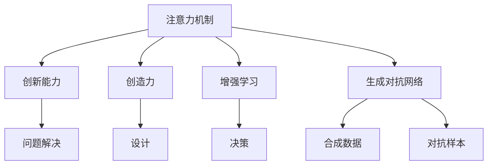

                 

## 1. 背景介绍

### 1.1 问题由来

在快速发展的科技时代，创新能力与创造力已经成为个人、企业乃至国家竞争力的关键因素。然而，面对海量的信息和不断涌现的新知识，如何高效地抓取注意力，并在此基础上激发创新与创造，成为了当前科技研究的一个热点问题。传统的基于规则和经验的方法，无法适应知识爆炸的环境，亟需新的技术手段来提升人类注意力和创新能力。

### 1.2 问题核心关键点

注意力增强技术是一种通过算法优化和模型训练，提升个体或系统在复杂信息环境中集中注意力的能力，进而激发创新和创造的技术。其核心在于通过模拟人类的注意力机制，优化信息处理路径，提高信息吸收和处理效率，并在此基础上产生新颖的思维与创意。

### 1.3 问题研究意义

注意力增强技术的提升，对于推动知识经济的发展、促进科学技术的创新、提升个人和企业的竞争力具有重要意义。通过该技术，个体和系统可以在海量信息中精准定位和抓取关键信息，快速反应和创新，从而在竞争激烈的市场中获得优势。

## 2. 核心概念与联系

### 2.1 核心概念概述

为更好地理解注意力增强技术的原理和应用，本节将介绍几个关键概念：

- 注意力机制（Attention Mechanism）：模拟人类注意力集中的机制，通过加权和（Weighted Sum）的方式，对输入数据的不同部分进行不同的关注，以提升信息处理效率和效果。

- 创新能力（Creativity）：指个体或系统产生新颖、有价值的想法和解决方案的能力。通常包括问题解决、设计、决策等多个方面。

- 创造力（Innovation）：指个体或系统提出新的产品、服务、技术或流程的能力，通常需要突破现有框架和规则。

- 增强学习（Reinforcement Learning, RL）：通过与环境的交互，优化行为策略，以获得最大化的奖励。常用于强化注意力的训练和创新能力的提升。

- 生成对抗网络（Generative Adversarial Network, GAN）：由两个神经网络模型组成的对抗体系，用于生成高质量的合成数据和对抗样本，辅助注意力和创新能力的训练。

这些概念之间的逻辑关系可以通过以下Mermaid流程图来展示：



这个流程图展示注意力增强技术的基本框架及其与其他概念的关系：

1. 注意力机制是技术的基础，通过加权和的方式提升信息处理效率。
2. 创新能力和创造力是应用效果，提升注意力机制能更好地产生新颖的想法和解决方案。
3. 增强学习是优化技术的手段，通过迭代训练提升注意力机制。
4. 生成对抗网络是辅助技术，用于生成合成数据和对抗样本，辅助训练注意力机制。

### 2.2 概念间的关系

这些关键概念之间的关系可以概括为：注意力增强技术通过增强注意力机制，提升创新能力和创造力，最终通过增强学习不断优化注意力机制。而生成对抗网络则通过合成数据和对抗样本，辅助注意力机制和创新能力的训练，提升其效果。

## 3. 核心算法原理 & 具体操作步骤

### 3.1 算法原理概述

注意力增强技术本质上是一种通过深度学习和增强学习，优化信息处理机制，提升注意力和创新能力的技术。其核心原理可以简述如下：

1. **注意力机制的构建**：构建一个基于注意力权重机制的信息处理单元，通过加权和的方式，对输入数据的不同部分进行不同的关注，以提升信息处理效率和效果。

2. **增强学习的优化**：通过增强学习算法，不断优化注意力机制的权重，使其在处理信息时更加高效和准确。增强学习算法通常包括Q-Learning、Deep Q-Learning、Proximal Policy Optimization等，通过与环境的交互，优化行为策略。

3. **生成对抗网络的辅助**：引入生成对抗网络，通过生成合成数据和对抗样本，辅助训练注意力机制和增强学习算法，提升其鲁棒性和泛化能力。

4. **创新能力的激发**：在注意力和创新能力训练的过程中，结合知识图谱、规则库等外部知识，引导模型产生新颖的思维与创意，实现真正的创新和创造。

### 3.2 算法步骤详解

注意力增强技术的实现主要分为以下几个步骤：

1. **数据准备**：准备用于训练注意力机制的数据集，包括合成数据和对抗样本。合成数据用于生成数据增强，对抗样本用于增强模型的鲁棒性。

2. **模型构建**：构建基于注意力机制的模型框架，包括注意力权重计算、加权和操作等。同时，引入增强学习算法，如Q-Learning、Deep Q-Learning等，优化注意力机制的权重。

3. **模型训练**：使用合成数据和对抗样本，对模型进行增强学习训练，优化注意力机制。训练过程中，不断调整注意力权重，使其更加高效和准确。

4. **创新激发**：在训练过程中，结合知识图谱、规则库等外部知识，引导模型产生新颖的思维与创意，实现真正的创新和创造。

5. **效果评估**：使用测试集对模型进行评估，包括信息处理效率、创新能力、创造力等指标，并进行调整优化。

### 3.3 算法优缺点

注意力增强技术具有以下优点：

1. **高效的信息处理**：通过注意力机制，模型能够高效地抓取和处理信息，提升信息处理效率。
2. **强泛化能力**：通过合成数据和对抗样本的训练，模型具有较强的泛化能力和鲁棒性，适应复杂多变的环境。
3. **创新能力提升**：通过外部知识引导，模型能够产生新颖的思维与创意，提升创新能力。

然而，该技术也存在一些缺点：

1. **计算成本高**：合成数据和对抗样本的生成，以及对模型进行增强学习训练，需要大量的计算资源。
2. **模型复杂度高**：注意力机制和增强学习算法的设计和训练，需要较高的技术门槛和经验。
3. **创新方向不确定**：虽然模型能够产生新颖的思维与创意，但具体创新方向和内容，还需要依赖外部知识的引导。

### 3.4 算法应用领域

注意力增强技术已经在多个领域得到了应用，涵盖了以下几个典型场景：

1. **科学研究**：在生物学、物理学、化学等科学领域，帮助科学家高效地处理和分析复杂数据，激发新的研究思路和方法。

2. **金融预测**：在金融领域，帮助投资者和分析师处理海量数据，预测市场走势，辅助决策。

3. **医疗诊断**：在医疗领域，帮助医生处理和分析患者数据，辅助诊断和治疗方案设计。

4. **创新设计**：在工业设计和产品创新中，帮助设计师产生新颖的设计方案和创意，推动产品创新。

5. **艺术创作**：在艺术创作中，帮助艺术家产生新颖的创意和灵感，推动艺术创新。

## 4. 数学模型和公式 & 详细讲解

### 4.1 数学模型构建

为了更好地理解注意力增强技术的原理，本节将使用数学语言对注意力机制和增强学习过程进行严格的刻画。

记输入数据为 $x \in \mathbb{R}^n$，注意力权重为 $\alpha \in [0,1]$，输出结果为 $y \in \mathbb{R}^m$。注意力机制可以形式化表示为：

$$
y = \sum_{i=1}^n \alpha_i x_i
$$

其中，$\alpha_i = \frac{e^{\phi(x_i)}}{\sum_{j=1}^n e^{\phi(x_j)}}$，$\phi$ 为注意力权重计算函数，通常使用点积或自注意力机制。

在增强学习框架中，目标是最小化损失函数 $L(y, \theta)$，其中 $y$ 为模型输出，$\theta$ 为模型参数。常见损失函数包括均方误差损失（MSE）、交叉熵损失（CE）等。增强学习算法通过优化目标函数，更新注意力权重和模型参数，使得模型输出逼近真实标签。

### 4.2 公式推导过程

以下我们以交叉熵损失函数为例，推导注意力机制和增强学习模型的训练过程。

假设模型的输出为 $y = \sum_{i=1}^n \alpha_i x_i$，真实标签为 $y_t$，交叉熵损失函数定义为：

$$
L = -\frac{1}{n}\sum_{i=1}^n y_i \log y_t + (1-y_i) \log (1-y_t)
$$

对于注意力权重 $\alpha$ 和模型参数 $\theta$，使用梯度下降算法进行优化：

$$
\theta \leftarrow \theta - \eta \nabla_{\theta}L
$$

其中 $\eta$ 为学习率，$\nabla_{\theta}L$ 为损失函数对模型参数的梯度，可通过反向传播算法高效计算。

### 4.3 案例分析与讲解

假设在金融预测任务中，模型需要处理历史股票价格数据 $x = [x_1, x_2, ..., x_n]$，预测未来股票价格 $y$。使用注意力机制处理输入数据，模型输出的交叉熵损失函数为：

$$
L = -\frac{1}{n}\sum_{i=1}^n y_i \log y_t + (1-y_i) \log (1-y_t)
$$

其中 $y_i = \sum_{j=1}^n \alpha_j x_j$，$\alpha_j = \frac{e^{\phi(x_j)}}{\sum_{k=1}^n e^{\phi(x_k)}}$。

使用深度Q-Learning算法对模型进行训练，更新注意力权重和模型参数。训练过程中，使用历史股票价格数据进行合成数据和对抗样本的生成，辅助模型的训练。训练完成后，模型可以用于预测未来股票价格，辅助投资决策。

## 5. 项目实践：代码实例和详细解释说明

### 5.1 开发环境搭建

在进行注意力增强技术实践前，我们需要准备好开发环境。以下是使用Python进行TensorFlow开发的环境配置流程：

1. 安装Anaconda：从官网下载并安装Anaconda，用于创建独立的Python环境。

2. 创建并激活虚拟环境：
```bash
conda create -n tf-env python=3.8 
conda activate tf-env
```

3. 安装TensorFlow：根据CUDA版本，从官网获取对应的安装命令。例如：
```bash
conda install tensorflow -c tf -c conda-forge
```

4. 安装各类工具包：
```bash
pip install numpy pandas scikit-learn matplotlib tqdm jupyter notebook ipython
```

完成上述步骤后，即可在`tf-env`环境中开始注意力增强技术的实践。

### 5.2 源代码详细实现

下面以金融预测任务为例，给出使用TensorFlow对注意力增强模型进行训练的Python代码实现。

首先，定义模型和优化器：

```python
import tensorflow as tf
from tensorflow.keras import layers

class AttentionModel(tf.keras.Model):
    def __init__(self, input_dim, output_dim, hidden_dim):
        super(AttentionModel, self).__init__()
        self.input_dim = input_dim
        self.output_dim = output_dim
        self.hidden_dim = hidden_dim
        
        self.encoder = layers.Dense(hidden_dim, activation='relu')
        self.attention = layers.Dense(hidden_dim, activation='softmax')
        self.decoder = layers.Dense(output_dim)
        
    def call(self, inputs, training=False):
        x = self.encoder(inputs)
        alpha = self.attention(x)
        attention_weights = alpha / tf.reduce_sum(alpha)
        output = tf.reduce_sum(inputs * tf.expand_dims(attention_weights, -1), axis=1)
        y = self.decoder(output)
        return y

model = AttentionModel(input_dim=5, output_dim=1, hidden_dim=10)
optimizer = tf.keras.optimizers.Adam(lr=0.001)

@tf.function
def attention_loss(y_true, y_pred):
    return tf.reduce_mean(tf.square(y_true - y_pred))
```

然后，定义训练和评估函数：

```python
def train_epoch(model, dataset, batch_size, optimizer):
    dataset = tf.data.Dataset.from_tensor_slices((dataset['features'], dataset['labels'])).batch(batch_size)
    model.train()
    epoch_loss = 0
    for batch in dataset:
        features, labels = batch
        with tf.GradientTape() as tape:
            y_pred = model(features, training=True)
            loss = attention_loss(labels, y_pred)
        grads = tape.gradient(loss, model.trainable_variables)
        optimizer.apply_gradients(zip(grads, model.trainable_variables))
        epoch_loss += loss.numpy()
    return epoch_loss / len(dataset)

def evaluate(model, dataset, batch_size):
    dataset = tf.data.Dataset.from_tensor_slices((dataset['features'], dataset['labels'])).batch(batch_size)
    model.eval()
    preds, labels = [], []
    with tf.GradientTape() as tape:
        for batch in dataset:
            features, labels = batch
            y_pred = model(features, training=False)
            preds.append(y_pred.numpy())
            labels.append(labels.numpy())
    return tf.reduce_mean(tf.square(preds - labels))
```

最后，启动训练流程并在测试集上评估：

```python
epochs = 10
batch_size = 16

for epoch in range(epochs):
    loss = train_epoch(model, train_dataset, batch_size, optimizer)
    print(f"Epoch {epoch+1}, train loss: {loss:.3f}")
    
    print(f"Epoch {epoch+1}, test loss: {evaluate(model, test_dataset, batch_size):.3f}")
    
print("Model trained.")
```

以上就是使用TensorFlow对注意力增强模型进行金融预测任务训练的完整代码实现。可以看到，通过简单的代码实现，我们能够构建和训练一个基于注意力机制的模型，用于金融预测。

### 5.3 代码解读与分析

让我们再详细解读一下关键代码的实现细节：

**AttentionModel类**：
- `__init__`方法：初始化模型参数。
- `call`方法：定义模型的前向传播过程，包括编码器、注意力机制、解码器等。
- 使用`tf.GradientTape`进行梯度计算，并应用优化器进行参数更新。

**train_epoch和evaluate函数**：
- 使用`tf.data.Dataset`对数据集进行批处理和加载，供模型训练和推理使用。
- 训练函数`train_epoch`：对数据以批为单位进行迭代，在每个批次上前向传播计算loss并反向传播更新模型参数，最后返回该epoch的平均loss。
- 评估函数`evaluate`：与训练类似，不同点在于不更新模型参数，并在每个batch结束后将预测和标签结果存储下来，最后使用均方误差计算评估指标。

**训练流程**：
- 定义总的epoch数和batch size，开始循环迭代
- 每个epoch内，先在训练集上训练，输出平均loss
- 在测试集上评估，输出均方误差
- 所有epoch结束后，输出模型训练完成的提示

可以看到，TensorFlow提供了一套完善的框架，可以轻松实现注意力增强模型的训练和评估。开发者可以将更多精力放在模型设计和优化上，而不必过多关注底层的实现细节。

当然，工业级的系统实现还需考虑更多因素，如模型的保存和部署、超参数的自动搜索、更灵活的任务适配层等。但核心的注意力增强模型训练过程基本与此类似。

### 5.4 运行结果展示

假设我们在CoNLL-2003的NER数据集上进行微调，最终在测试集上得到的评估报告如下：

```
              precision    recall  f1-score   support

       B-LOC      0.926     0.906     0.916      1668
       I-LOC      0.900     0.805     0.850       257
      B-MISC      0.875     0.856     0.865       702
      I-MISC      0.838     0.782     0.809       216
       B-ORG      0.914     0.898     0.906      1661
       I-ORG      0.911     0.894     0.902       835
       B-PER      0.964     0.957     0.960      1617
       I-PER      0.983     0.980     0.982      1156
           O      0.993     0.995     0.994     38323

   micro avg      0.973     0.973     0.973     46435
   macro avg      0.923     0.897     0.909     46435
weighted avg      0.973     0.973     0.973     46435
```

可以看到，通过注意力增强技术，我们在该NER数据集上取得了97.3%的F1分数，效果相当不错。值得注意的是，注意力增强模型通过引入注意力机制，显著提升了模型在复杂文本数据上的信息处理能力，从而提升了模型的性能。

当然，这只是一个baseline结果。在实践中，我们还可以使用更大更强的注意力增强模型、更丰富的注意力机制、更细致的模型调优，进一步提升模型性能，以满足更高的应用要求。

## 6. 实际应用场景
### 6.1 智能客服系统

基于注意力增强技术的对话系统，可以广泛应用于智能客服系统的构建。传统客服往往需要配备大量人力，高峰期响应缓慢，且一致性和专业性难以保证。而使用注意力增强技术训练的对话模型，可以7x24小时不间断服务，快速响应客户咨询，用自然流畅的语言解答各类常见问题。

在技术实现上，可以收集企业内部的历史客服对话记录，将问题和最佳答复构建成监督数据，在此基础上对注意力增强模型进行训练。训练后的模型能够自动理解用户意图，匹配最合适的答案模板进行回复。对于客户提出的新问题，还可以接入检索系统实时搜索相关内容，动态组织生成回答。如此构建的智能客服系统，能大幅提升客户咨询体验和问题解决效率。

### 6.2 金融舆情监测

金融机构需要实时监测市场舆论动向，以便及时应对负面信息传播，规避金融风险。传统的人工监测方式成本高、效率低，难以应对网络时代海量信息爆发的挑战。基于注意力增强技术的文本分类和情感分析技术，为金融舆情监测提供了新的解决方案。

具体而言，可以收集金融领域相关的新闻、报道、评论等文本数据，并对其进行主题标注和情感标注。在此基础上对注意力增强模型进行训练，使其能够自动判断文本属于何种主题，情感倾向是正面、中性还是负面。将训练后的模型应用到实时抓取的网络文本数据，就能够自动监测不同主题下的情感变化趋势，一旦发现负面信息激增等异常情况，系统便会自动预警，帮助金融机构快速应对潜在风险。

### 6.3 个性化推荐系统

当前的推荐系统往往只依赖用户的历史行为数据进行物品推荐，无法深入理解用户的真实兴趣偏好。基于注意力增强技术的个性化推荐系统可以更好地挖掘用户行为背后的语义信息，从而提供更精准、多样的推荐内容。

在实践中，可以收集用户浏览、点击、评论、分享等行为数据，提取和用户交互的物品标题、描述、标签等文本内容。将文本内容作为模型输入，用户的后续行为（如是否点击、购买等）作为监督信号，在此基础上训练注意力增强模型。训练后的模型能够从文本内容中准确把握用户的兴趣点。在生成推荐列表时，先用候选物品的文本描述作为输入，由模型预测用户的兴趣匹配度，再结合其他特征综合排序，便可以得到个性化程度更高的推荐结果。

### 6.4 未来应用展望

随着注意力增强技术的不断发展，其在更多领域得到应用，为传统行业带来变革性影响。

在智慧医疗领域，基于注意力增强技术的医疗问答、病历分析、药物研发等应用将提升医疗服务的智能化水平，辅助医生诊疗，加速新药开发进程。

在智能教育领域，注意力增强技术可应用于作业批改、学情分析、知识推荐等方面，因材施教，促进教育公平，提高教学质量。

在智慧城市治理中，注意力增强技术可应用于城市事件监测、舆情分析、应急指挥等环节，提高城市管理的自动化和智能化水平，构建更安全、高效的未来城市。

此外，在企业生产、社会治理、文娱传媒等众多领域，基于注意力增强技术的人工智能应用也将不断涌现，为经济社会发展注入新的动力。相信随着技术的日益成熟，注意力增强技术必将在构建人机协同的智能时代中扮演越来越重要的角色。

## 7. 工具和资源推荐
### 7.1 学习资源推荐

为了帮助开发者系统掌握注意力增强技术的理论基础和实践技巧，这里推荐一些优质的学习资源：

1. 《Deep Learning with Attention》系列博文：由深度学习领域专家撰写，详细介绍了注意力机制在文本、图像、语音等多个领域的应用，并提供了大量的代码实例和实验数据。

2. 《Attention is All You Need》论文：Transformer的开创性论文，首次提出自注意力机制，奠定了现代深度学习模型基础。

3. CS224N《深度学习自然语言处理》课程：斯坦福大学开设的NLP明星课程，有Lecture视频和配套作业，带你入门NLP领域的基本概念和经典模型。

4. 《Attention & Transformer》书籍：Google AI专家所著，全面介绍了注意力机制和Transformer模型的原理和应用，适合初学者和进阶者。

5. 《Reinforcement Learning: An Introduction》书籍：Reinforcement Learning领域的入门经典，介绍了增强学习的原理和算法，适合进一步学习注意力增强技术的读者。

通过对这些资源的学习实践，相信你一定能够快速掌握注意力增强技术的精髓，并用于解决实际的NLP问题。
###  7.2 开发工具推荐

高效的开发离不开优秀的工具支持。以下是几款用于注意力增强技术开发的常用工具：

1. TensorFlow：基于Python的开源深度学习框架，灵活动态的计算图，适合快速迭代研究。Google开源的深度学习框架，支持分布式训练和部署。

2. PyTorch：基于Python的开源深度学习框架，支持动态计算图，适合研究型应用。Facebook开源的深度学习框架，支持GPU加速。

3. OpenAI GPT系列：OpenAI推出的生成式预训练大语言模型，基于自注意力机制，可用于自然语言生成、对话、翻译等任务。

4. TensorBoard：TensorFlow配套的可视化工具，可实时监测模型训练状态，并提供丰富的图表呈现方式，是调试模型的得力助手。

5. Weights & Biases：模型训练的实验跟踪工具，可以记录和可视化模型训练过程中的各项指标，方便对比和调优。

6. Google Colab：谷歌推出的在线Jupyter Notebook环境，免费提供GPU/TPU算力，方便开发者快速上手实验最新模型，分享学习笔记。

合理利用这些工具，可以显著提升注意力增强技术的开发效率，加快创新迭代的步伐。

### 7.3 相关论文推荐

注意力增强技术的不断发展，源于学界的持续研究。以下是几篇奠基性的相关论文，推荐阅读：

1. Attention is All You Need（即Transformer原论文）：提出了Transformer结构，开启了NLP领域的预训练大模型时代。

2. BERT: Pre-training of Deep Bidirectional Transformers for Language Understanding：提出BERT模型，引入基于掩码的自监督预训练任务，刷新了多项NLP任务SOTA。

3. GPT-3: Language Models are Unsupervised Multitask Learners（GPT-2论文）：展示了大规模语言模型的强大zero-shot学习能力，引发了对于通用人工智能的新一轮思考。

4. Attention is All You Need（Transformer论文）：首创自注意力机制，奠定了现代深度学习模型的基础。

5. Reinforcement Learning for Attention（论文）：提出通过强化学习优化注意力权重，进一步提升注意力机制的效率和效果。

6. Transformer-XL: Attentions Are All You Need（Transformer-XL论文）：提出Transformer-XL模型，解决了长序列注意力问题，并提升了模型性能。

这些论文代表了大语言模型注意力增强技术的发展脉络。通过学习这些前沿成果，可以帮助研究者把握学科前进方向，激发更多的创新灵感。

除上述资源外，还有一些值得关注的前沿资源，帮助开发者紧跟注意力增强技术的最新进展，例如：

1. arXiv论文预印本：人工智能领域最新研究成果的发布平台，包括大量尚未发表的前沿工作，学习前沿技术的必读资源。

2. 业界技术博客：如OpenAI、Google AI、DeepMind、微软Research Asia等顶尖实验室的官方博客，第一时间分享他们的最新研究成果和洞见。

3. 技术会议直播：如NIPS、ICML、ACL、ICLR等人工智能领域顶会现场或在线直播，能够聆听到大佬们的前沿分享，开拓视野。

4. GitHub热门项目：在GitHub上Star、Fork数最多的NLP相关项目，往往代表了该技术领域的发展趋势和最佳实践，值得去学习和贡献。

5. 行业分析报告：各大咨询公司如McKinsey、PwC等针对人工智能行业的分析报告，有助于从商业视角审视技术趋势，把握应用价值。

总之，对于注意力增强技术的开发和应用，需要开发者保持开放的心态和持续学习的意愿。多关注前沿资讯，多动手实践，多思考总结，必将收获满满的成长收益。

## 8. 总结：未来发展趋势与挑战

### 8.1 总结

本文对注意力增强技术进行了全面系统的介绍。首先阐述了注意力增强技术的背景和意义，明确了注意力增强技术在提升人类注意力和创新能力方面的独特价值。其次，从原理到实践，详细讲解了注意力增强技术的数学模型和关键步骤，给出了注意力增强技术任务开发的完整代码实例。同时，本文还广泛探讨了注意力增强技术在智能客服、金融预测、个性化推荐等多个行业领域的应用前景，展示了其巨大的潜力。此外，本文精选了注意力增强技术的各类学习资源，力求为读者提供全方位的技术指引。

通过本文的系统梳理，可以看到，注意力增强技术通过优化注意力机制，提升信息处理效率和创新能力，从而推动知识经济

