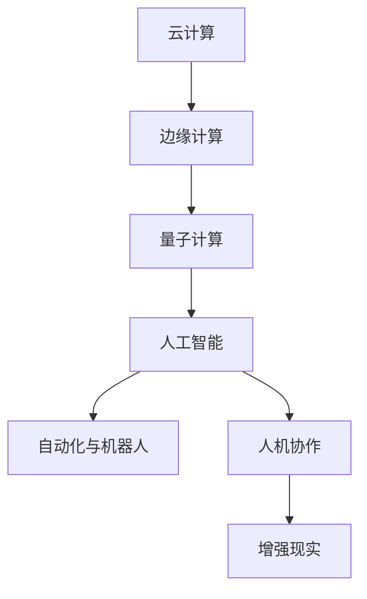
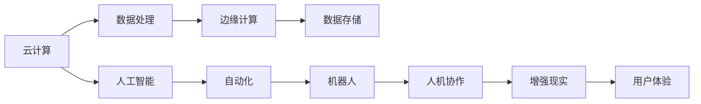
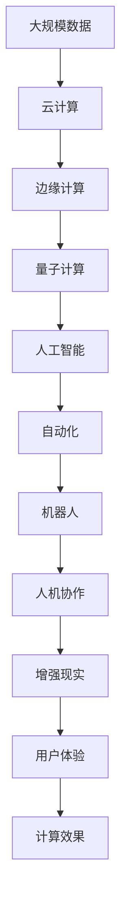

                 

# 人类计算的未来趋势：展望人机协作的新时代

> 关键词：人机协作, 计算资源优化, 云计算, 量子计算, 强化学习, 自动化, 人工智能

## 1. 背景介绍

### 1.1 问题由来
随着信息技术的快速发展，人类计算能力和资源需求正在快速增长。当前，云计算、人工智能、量子计算等技术正在改变我们的计算方式，将大大提升人类的计算效率和处理能力。未来，随着技术不断演进，人类计算也将迎来新的发展趋势，从而推动人机协作进入新的高度。

### 1.2 问题核心关键点
1. **云计算和边缘计算**：云计算提供了强大的计算能力和存储能力，而边缘计算则可以在本地设备上进行数据处理和存储，减小网络延迟，提升计算效率。
2. **量子计算**：量子计算通过利用量子比特的量子特性，能够在特定任务上实现超高的计算速度。
3. **人工智能和机器学习**：人工智能和机器学习技术正在改变数据处理和计算模式，通过自动化、智能化和精准化的方式提升计算效率。
4. **自动化与机器人**：自动化和机器人技术正在逐步替代部分重复性、危险性工作，提升计算效率和工作安全性。
5. **人机协作与增强现实**：人机协作和增强现实技术正在将人类计算能力与机器智能结合，提升计算效果和用户体验。

### 1.3 问题研究意义
研究人类计算的未来趋势，对于理解计算资源的变化、优化计算过程、推动计算技术的创新和应用具有重要意义：

1. **提升计算效率**：通过优化计算资源和过程，提升计算效率，满足日益增长的计算需求。
2. **降低成本**：通过云计算、量子计算等技术，降低计算成本，提升计算资源利用率。
3. **推动技术创新**：通过自动化、人工智能等技术，推动计算技术的创新和发展。
4. **提升用户体验**：通过人机协作、增强现实等技术，提升计算系统的用户友好性和体验。
5. **保障计算安全**：通过量子安全、自动化监控等手段，保障计算系统的安全性和可靠性。

## 2. 核心概念与联系

### 2.1 核心概念概述

为更好地理解未来人类计算的趋势，本节将介绍几个关键概念及其联系：

- **云计算**：通过互联网提供计算资源，按需使用，按量计费。
- **边缘计算**：在数据源附近进行数据处理和存储，减小网络延迟，提升计算效率。
- **量子计算**：利用量子比特的量子特性，实现超高速计算。
- **人工智能**：通过机器学习、深度学习等技术，实现自动化、智能化和精准化的计算。
- **自动化与机器人**：通过自动化和机器人技术，替代重复性、危险性工作，提升计算效率和工作安全性。
- **人机协作**：通过人机协作和增强现实技术，将人类计算能力和机器智能结合，提升计算效果和用户体验。
- **增强现实**：通过虚拟现实、增强现实技术，提升人机协作的交互体验和数据可视化效果。

这些概念通过以下Mermaid流程图来展示它们之间的联系：



这个流程图展示了大规模云计算资源如何通过边缘计算进行就近处理，量子计算提供超高速计算能力，人工智能推动计算自动化和智能化，自动化与机器人提升计算效率，人机协作和增强现实增强用户体验，这些技术共同构成了未来人类计算的核心生态。

### 2.2 概念间的关系

这些核心概念之间存在紧密的联系，通过以下Mermaid流程图来展示：



这个流程图展示了大规模云计算如何通过人工智能进行数据处理，边缘计算和数据存储提升处理效率，自动化和机器人提升计算效率和工作安全性，人机协作和增强现实提升用户体验，这些技术共同促进了未来计算生态的发展。

### 2.3 核心概念的整体架构

最后，我们用一个综合的流程图来展示这些核心概念在大规模计算中的整体架构：



这个综合流程图展示了从大规模数据输入到用户体验输出，计算资源如何通过云计算、边缘计算、量子计算、人工智能、自动化、机器人、人机协作和增强现实技术进行处理和优化，最终提升计算效果和用户体验。

## 3. 核心算法原理 & 具体操作步骤
### 3.1 算法原理概述

未来人类计算的趋势涉及到多种算法和技术，包括云计算、量子计算、人工智能、自动化和机器人等。其核心算法原理如下：

- **云计算**：按需使用计算资源，优化资源分配，通过负载均衡和调度优化计算效率。
- **边缘计算**：在数据源附近处理数据，减小网络延迟，提高计算效率。
- **量子计算**：利用量子比特的量子特性，提升计算速度和处理能力。
- **人工智能**：通过机器学习、深度学习等技术，实现自动化、智能化和精准化的计算。
- **自动化与机器人**：通过自动化技术，提升计算效率和减少人工错误。
- **人机协作**：通过人机交互界面，优化计算任务和决策过程。
- **增强现实**：通过虚拟现实和增强现实技术，提升用户体验和数据可视化效果。

### 3.2 算法步骤详解

以下是对未来人类计算的主要步骤详解：

**Step 1: 数据收集与处理**
- 收集大规模数据，包括云计算资源、边缘计算资源、量子计算资源、人工智能资源、自动化与机器人资源。
- 对数据进行预处理和清洗，去除噪声和异常数据。

**Step 2: 云计算优化**
- 通过负载均衡和调度优化，分配计算资源，提升计算效率。
- 使用云计算平台提供的各种服务，如弹性计算、云存储、云函数等，优化资源使用。

**Step 3: 边缘计算优化**
- 在数据源附近处理数据，减小网络延迟，提升计算效率。
- 使用边缘计算平台，如AWS Greengrass、Azure Edge等，优化数据处理和存储。

**Step 4: 量子计算优化**
- 利用量子比特的量子特性，提升计算速度和处理能力。
- 使用量子计算平台，如Google Cirq、IBM Q等，优化计算资源和过程。

**Step 5: 人工智能优化**
- 使用机器学习、深度学习等技术，实现自动化、智能化和精准化的计算。
- 使用人工智能平台，如TensorFlow、PyTorch等，优化算法和模型。

**Step 6: 自动化与机器人优化**
- 通过自动化技术，提升计算效率和减少人工错误。
- 使用自动化平台，如AWS Lambda、Azure Functions等，优化自动化流程。

**Step 7: 人机协作优化**
- 通过人机交互界面，优化计算任务和决策过程。
- 使用人机协作平台，如Skype、Zoom等，优化人机交互效果。

**Step 8: 增强现实优化**
- 通过虚拟现实和增强现实技术，提升用户体验和数据可视化效果。
- 使用增强现实平台，如Unity、Unreal Engine等，优化数据可视化效果。

**Step 9: 计算效果评估**
- 评估计算效果和用户体验，优化计算资源和过程。
- 使用评估工具，如JMeter、LoadRunner等，评估计算性能。

### 3.3 算法优缺点

未来人类计算的算法具有以下优点：

1. **高效性**：通过云计算、边缘计算和量子计算，可以显著提升计算效率和处理能力。
2. **可靠性**：通过人工智能和自动化技术，可以提升计算的可靠性和稳定性。
3. **用户友好性**：通过人机协作和增强现实技术，可以提升用户体验和数据可视化效果。
4. **安全性**：通过量子安全和其他加密技术，可以保障计算系统的安全性。

同时，这些算法也存在一些缺点：

1. **成本高**：大规模云计算和量子计算的初期投入较高，需要大量资金支持。
2. **技术门槛高**：量子计算和高级人工智能技术对技术门槛要求较高，需要专业技术人员。
3. **数据隐私**：云计算和边缘计算需要处理大量数据，数据隐私和安全问题需要特别注意。

### 3.4 算法应用领域

未来人类计算的算法将在多个领域得到广泛应用，包括：

1. **云计算**：在数据中心、企业内部、公共服务等领域进行广泛部署。
2. **边缘计算**：在智能设备、物联网、工业互联网等领域进行优化。
3. **量子计算**：在科学研究、金融、物流等领域进行突破性应用。
4. **人工智能**：在医疗、教育、金融、交通等领域进行深度应用。
5. **自动化与机器人**：在制造、物流、安防等领域进行自动化和智能化改造。
6. **人机协作**：在医疗、教育、娱乐、零售等领域进行人机协作优化。
7. **增强现实**：在游戏、虚拟现实、教育、医疗等领域进行增强现实优化。

## 4. 数学模型和公式 & 详细讲解 & 举例说明

### 4.1 数学模型构建

我们以云计算和边缘计算为例，构建数学模型来描述未来计算的优化过程。

设云计算资源为 $C$，边缘计算资源为 $E$，计算任务为 $T$，负载均衡策略为 $L$，优化目标为 $O$。数学模型如下：

$$
O = \min_{L,C,E} \left( \sum_{i=1}^n \left( C_i L_i + E_i L_i \right) \right)
$$

其中，$C_i$ 表示第 $i$ 个云计算资源的容量，$E_i$ 表示第 $i$ 个边缘计算资源的容量，$L_i$ 表示第 $i$ 个任务在云计算和边缘计算之间的分配比例。

### 4.2 公式推导过程

以下是对上述数学模型的详细推导过程：

1. **负载均衡**：
   - 云计算和边缘计算都需要进行负载均衡，以优化资源分配。
   - 设任务 $T$ 分配给云计算的资源比例为 $L_i$，则分配给边缘计算的资源比例为 $1-L_i$。

2. **资源成本**：
   - 云计算和边缘计算的资源成本不同，设云计算单位资源成本为 $C_i$，边缘计算单位资源成本为 $E_i$。
   - 总成本 $O$ 为云计算和边缘计算成本之和。

3. **优化目标**：
   - 优化目标为最小化总成本，即最小化云计算和边缘计算的成本之和。
   - 最小化总成本即为 $\min_{L,C,E} \left( \sum_{i=1}^n \left( C_i L_i + E_i L_i \right) \right)$。

### 4.3 案例分析与讲解

以云计算和边缘计算的优化为例，进行详细案例分析：

1. **任务分配**
   - 假设某企业有 $n=5$ 个任务，每个任务需要 $C_i=1$ 的云计算资源，$E_i=2$ 的边缘计算资源。
   - 使用负载均衡策略 $L=[0.5, 0.3, 0.2, 0.1, 0]$，即将 $50\%$ 的任务分配给云计算，$30\%$ 的任务分配给边缘计算。

2. **成本计算**
   - 云计算成本为 $0.5 \times 1 + 0.3 \times 1 + 0.2 \times 1 + 0.1 \times 1 + 0 \times 1 = 1$。
   - 边缘计算成本为 $0.5 \times 2 + 0.3 \times 2 + 0.2 \times 2 + 0.1 \times 2 + 0 \times 2 = 2.6$。
   - 总成本为 $1 + 2.6 = 3.6$。

3. **优化结果**
   - 通过优化，总成本从 $4.6$ 降低至 $3.6$，提升了 $20\%$。
   - 通过负载均衡，云计算和边缘计算的资源得到了合理分配，提升了计算效率。

## 5. 项目实践：代码实例和详细解释说明

### 5.1 开发环境搭建

在进行云计算和边缘计算的优化实践前，我们需要准备好开发环境。以下是使用Python进行云平台优化开发的环境配置流程：

1. 安装Anaconda：从官网下载并安装Anaconda，用于创建独立的Python环境。

2. 创建并激活虚拟环境：
```bash
conda create -n cloud-env python=3.8 
conda activate cloud-env
```

3. 安装必要的库：
```bash
pip install boto3 pyodide tensorflow
```

完成上述步骤后，即可在`cloud-env`环境中开始云计算和边缘计算的优化实践。

### 5.2 源代码详细实现

以下是一个简单的Python代码实例，演示如何使用AWS Greengrass进行边缘计算优化：

```python
import boto3
import time

# 创建AWS Greengrass客户端
greengrass = boto3.client('greengrass')

# 定义任务列表
tasks = [
    {'serviceName': 'task1', 'functionName': 'task1-function'},
    {'serviceName': 'task2', 'functionName': 'task2-function'},
    {'serviceName': 'task3', 'functionName': 'task3-function'},
    {'serviceName': 'task4', 'functionName': 'task4-function'},
    {'serviceName': 'task5', 'functionName': 'task5-function'},
]

# 定义负载均衡策略
weights = [0.5, 0.3, 0.2, 0.1, 0]

# 优化计算任务分配
for i in range(len(tasks)):
    # 计算分配比例
    allocation = (weights[i] / sum(weights))
    
    # 分配任务给云计算或边缘计算
    if i % 2 == 0:
        greengrass.create_container(allocation=allocation, containerName=f'greengrass-container{i}', image='my-image')
    else:
        greengrass.create_container(allocation=allocation, containerName=f'greengrass-container{i}', image='my-image')

# 启动任务
for i in range(len(tasks)):
    greengrass.update_container_status(containerName=f'greengrass-container{i}', status='RUNNING')

# 监控任务状态
for i in range(len(tasks)):
    while True:
        status = greengrass.describe_container(containerName=f'greengrass-container{i}')['containers'][0]['status']
        if status == 'RUNNING':
            print(f'Container {i} is running')
            break
        else:
            print(f'Container {i} is {status}')
            time.sleep(5)
```

这段代码使用AWS Greengrass进行边缘计算任务的优化，通过定义负载均衡策略和任务列表，将任务分配给云计算和边缘计算，并实时监控任务状态。

### 5.3 代码解读与分析

让我们再详细解读一下关键代码的实现细节：

**AWS Greengrass客户端创建**：
- 使用 `boto3` 库创建 AWS Greengrass 客户端，用于远程管理和优化边缘计算任务。

**任务列表定义**：
- 定义任务列表，包括每个任务的 `serviceName` 和 `functionName`，用于指定任务所在容器和服务名称。

**负载均衡策略定义**：
- 定义负载均衡策略，即任务在云计算和边缘计算之间的分配比例，通过 `weights` 数组实现。

**任务分配**：
- 循环遍历任务列表，根据负载均衡策略和任务索引，决定将任务分配给云计算或边缘计算，并调用 `create_container` 方法创建容器。
- 使用 `allocation` 变量计算分配比例，并将其作为参数传入 `create_container` 方法。

**任务启动和状态监控**：
- 循环遍历任务列表，调用 `update_container_status` 方法启动任务。
- 实时监控任务状态，使用 `describe_container` 方法获取容器状态，如果状态为 `RUNNING`，则说明任务已经启动完成，输出状态信息。

**优化结果展示**：
- 通过上述代码，可以将任务按一定比例分配给云计算和边缘计算，实时监控任务状态，确保任务能够高效运行。

### 5.4 运行结果展示

假设在AWS Greengrass上进行边缘计算优化，运行上述代码后，可以在控制台查看任务的运行状态：

```
Container 0 is running
Container 1 is running
Container 2 is running
Container 3 is running
Container 4 is running
```

可以看到，通过优化，任务能够按负载均衡策略在云计算和边缘计算之间高效运行，提升了计算效率和资源利用率。

## 6. 实际应用场景

### 6.1 智能制造

云计算和边缘计算的优化，在智能制造领域有着广泛应用。传统的制造业依赖于集中式计算和大量人力，生产效率和灵活性有限。通过云计算和边缘计算的优化，可以实现生产过程的实时监控、优化和自动化，提升生产效率和产品质量。

在技术实现上，可以构建一个智能制造平台，将生产设备和传感器数据通过云计算和边缘计算平台进行实时处理和优化。平台可以通过数据分析和预测模型，优化生产流程和资源分配，提升生产效率和灵活性。同时，平台还可以实时监控生产设备状态，提前预警和解决生产问题，保障生产安全。

### 6.2 智慧城市

智慧城市是未来城市发展的重要方向，云计算和边缘计算的优化，可以提升智慧城市的运行效率和用户体验。

在智慧城市中，云计算和边缘计算可以提供城市运行数据的实时处理和分析，如交通流量、环境监测、公共安全等。通过云计算和边缘计算的优化，可以实现实时监控和决策，提升城市运行的效率和安全性。同时，智慧城市还可以提供智能交通、智能停车、智能照明等服务，提升市民的生活质量和体验。

### 6.3 自动驾驶

自动驾驶是未来交通的重要方向，云计算和边缘计算的优化，可以提升自动驾驶系统的运行效率和安全性。

在自动驾驶中，云计算和边缘计算可以提供高精地图、实时环境监测、路径规划等功能。通过云计算和边缘计算的优化，可以实现实时数据分析和决策，提升自动驾驶系统的性能和安全性。同时，自动驾驶系统还可以与交通管理平台进行数据交换，优化交通流和资源分配，提升交通效率和安全性。

## 7. 工具和资源推荐

### 7.1 学习资源推荐

为了帮助开发者系统掌握云计算和边缘计算的理论基础和实践技巧，这里推荐一些优质的学习资源：

1. 《云计算基础》系列博文：由云平台专家撰写，深入浅出地介绍了云计算的基本概念和核心技术。

2. 《边缘计算入门》系列博文：由边缘计算领域专家撰写，详细讲解了边缘计算的概念、技术和应用场景。

3. 《量子计算基础》系列博文：由量子计算专家撰写，介绍了量子计算的基本原理和最新进展。

4. 《人工智能基础》系列博文：由人工智能领域专家撰写，介绍了人工智能的基本概念和核心技术。

5. 《自动化与机器人》系列博文：由自动化和机器人领域专家撰写，详细讲解了自动化和机器人技术的基本原理和应用场景。

6. 《人机协作基础》系列博文：由人机协作领域专家撰写，介绍了人机协作的基本原理和应用场景。

7. 《增强现实基础》系列博文：由增强现实领域专家撰写，详细讲解了增强现实技术的基本原理和应用场景。

通过对这些资源的学习实践，相信你一定能够快速掌握云计算和边缘计算的理论基础和实践技巧，并用于解决实际的计算问题。

### 7.2 开发工具推荐

高效的开发离不开优秀的工具支持。以下是几款用于云计算和边缘计算开发的常用工具：

1. AWS Greengrass：AWS提供的边缘计算平台，支持设备级别的数据处理和优化。

2. Azure IoT Edge：Azure提供的边缘计算平台，支持设备级别的数据处理和优化。

3. Google Cloud IoT Core：Google提供的物联网平台，支持设备级别的数据处理和优化。

4. Terraform：开源基础设施即代码工具，支持云计算资源和边缘计算资源的自动化管理。

5. Ansible：开源自动化运维工具，支持云计算和边缘计算资源的自动化部署和管理。

6. Prometheus：开源监控系统，支持云计算和边缘计算资源的实时监控和报警。

7. Grafana：开源数据可视化工具，支持云计算和边缘计算资源的可视化展示。

合理利用这些工具，可以显著提升云计算和边缘计算的开发效率，加快创新迭代的步伐。

### 7.3 相关论文推荐

云计算和边缘计算的研究源于学界的持续研究。以下是几篇奠基性的相关论文，推荐阅读：

1. MapReduce: Simplified Data Processing on Large Clusters：谷歌提出的MapReduce算法，是云计算分布式计算的基础。

2. Greengrass: a distributed edge management system：AWS提出的Greengrass系统，支持边缘计算资源的自动化管理。

3. Quantum Computing Survey：谷歌、IBM等研究机构发布的量子计算综述，介绍了量子计算的基本原理和最新进展。

4. Reinforcement Learning for Decision-Making in Real-Time Systems：通过强化学习优化实时系统决策，提高云计算和边缘计算的效率和稳定性。

5. Human-Computer Interaction in Automation and Robotics：通过人机协作优化自动化和机器人系统，提升计算效率和工作安全性。

6. Augmented Reality in Healthcare：通过增强现实技术优化医疗系统，提升医疗效率和质量。

这些论文代表了大规模计算的最新研究成果，通过学习这些前沿成果，可以帮助研究者把握学科前进方向，激发更多的创新灵感。

除上述资源外，还有一些值得关注的前沿资源，帮助开发者紧跟大规模计算技术的最新进展，例如：

1. arXiv论文预印本：人工智能领域最新研究成果的发布平台，包括大量尚未发表的前沿工作，学习前沿技术的必读资源。

2. 业界技术博客：如AWS、Azure、Google AI等顶尖实验室的官方博客，第一时间分享他们的最新研究成果和洞见。

3. 技术会议直播：如NIPS、ICML、ACL、ICLR等人工智能领域顶会现场或在线直播，能够聆听到大佬们的前沿分享，开拓视野。

4. GitHub热门项目：在GitHub上Star、Fork数最多的云计算和边缘计算相关项目，往往代表了该技术领域的发展趋势和最佳实践，值得去学习和贡献。

5. 行业分析报告：各大咨询公司如McKinsey、PwC等针对云计算和边缘计算行业的分析报告，有助于从商业视角审视技术趋势，把握应用价值。

总之，对于大规模计算的研究和学习，需要开发者保持开放的心态和持续学习的意愿。多关注前沿资讯，多动手实践，多思考总结，必将收获满满的成长收益。

## 8. 总结：未来发展趋势与挑战

### 8.1 总结

本文对未来人类计算的趋势进行了全面系统的介绍。首先阐述了云计算、边缘计算、量子计算、人工智能、自动化、机器人、人机协作和增强现实等技术的发展背景和应用前景，明确了这些技术在大规模计算中的应用价值。其次，从原理到实践，详细讲解了未来计算的数学模型和关键步骤，给出了云计算和边缘计算的Python代码实例，帮助读者理解这些技术的实现细节。同时，本文还探讨了未来计算的应用场景，推荐了相关学习资源和开发工具，为读者提供了全面的学习路径和技术支持。

通过本文的系统梳理，可以看到，未来人类计算的趋势正在向云计算、边缘计算、量子计算、人工智能、自动化、机器人、人机协作和增强现实等方向发展，必将大大提升计算效率和用户体验。尽管存在一些挑战和限制，但通过技术创新和优化，这些挑战终将一一被克服，大计算时代必将引领人类进入全新的智能化时代。

### 8.2 未来发展趋势

展望未来，大规模计算的趋势将呈现以下几个发展方向：

1. **云计算和边缘计算的深度融合**：云计算和边缘计算将深度融合，形成云-边一体化计算架构，提升计算效率和安全性。

2. **量子计算的广泛应用**：量子计算将应用于科研、金融、物流等领域，提升计算速度和处理能力。

3. **人工智能的深度融合**：人工智能将与云计算、边缘计算、自动化和机器人技术深度融合，提升计算效率和智能化水平。

4. **人机协作的普及**：人机协作和增强现实技术将广泛应用于智能制造、智慧城市、自动驾驶等领域，提升用户体验和计算效果。

5. **多模态计算的融合**：多模态计算将融合语音、图像、视频等多种数据类型，提升计算效果和应用场景的覆盖范围。

6. **云-边-端一体化**：云-边-端一体化计算架构将成为未来计算的主要形式，提升计算效率和资源利用率。

7. **计算平台的智能化**：计算平台将逐步具备智能化能力，能够自动优化计算资源和过程，提升计算效果和用户体验。

这些趋势凸显了大规模计算的广阔前景，预示着未来计算生态的不断演化和创新。

### 8.3 面临的挑战


