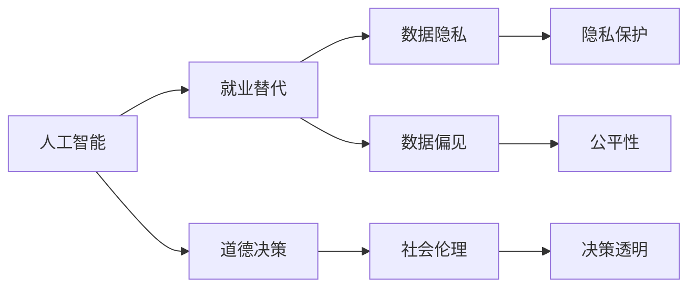

                 

# 人类计算：未来的工作和道德考虑

## 1. 背景介绍

### 1.1 问题由来
随着人工智能（AI）技术的迅猛发展，特别是机器学习和深度学习的广泛应用，人类计算正面临前所未有的变革。AI技术正在取代传统意义上的人类计算工作，比如在数据分析、自然语言处理、图像识别等领域，AI模型的表现已经超越了人类专家。然而，AI的崛起也引发了一系列伦理和道德问题，比如工作岗位的替代、隐私保护、数据偏见等问题。本文将探讨AI对人类计算工作的影响，以及未来工作与道德伦理的考虑。

### 1.2 问题核心关键点
本研究的重点在于探讨AI技术在自动化替代人类工作岗位、提升工作效率的同时，如何平衡人类的道德伦理需求。AI技术带来了数据驱动和自动化，但同时也引发了数据隐私、就业伦理、道德决策等问题。这些问题的解决需要社会各界共同努力，寻找合理的解决方案。

### 1.3 问题研究意义
研究AI技术对人类计算工作的替代和影响，以及未来的道德伦理考量，对于理解技术的进步与社会的变革具有重要意义。一方面，能够帮助政策制定者、企业决策者和公众更好地应对AI技术带来的变化；另一方面，也能够指导AI技术的安全、公正、透明地应用，避免潜在的伦理风险。

## 2. 核心概念与联系

### 2.1 核心概念概述

为更好地理解AI对人类计算工作的影响及其道德考量，本节将介绍几个关键概念：

- **人工智能（AI）**：指能够执行人类通常需要智能才能完成的任务的技术。包括机器学习、深度学习、自然语言处理等。
- **人类计算工作**：指需要人类智能进行信息处理、数据分析、决策制定的工作岗位。包括软件开发、数据分析、客服、金融分析等。
- **就业替代**：指AI技术自动化替代人类工作岗位的现象，尤其是在低技能和高重复性工作中更为明显。
- **数据隐私**：指个人数据在收集、存储、使用过程中未得到合理保护的情况，尤其是在数据驱动的AI系统中。
- **数据偏见**：指AI模型在训练和应用过程中，由于训练数据的不平衡或带有偏见，导致模型输出结果的不公平性。
- **道德决策**：指在AI应用中，如何做出符合社会伦理和价值观的决策，尤其是在涉及人权、隐私等问题时。

这些核心概念之间的关系可以用以下Mermaid流程图来展示：



这个流程图展示了AI技术对人类计算工作的影响及其道德考量：

1. AI技术替代人类工作，可能导致就业岗位减少。
2. 数据驱动的AI系统需要大量个人数据，涉及隐私保护问题。
3. AI模型可能存在数据偏见，影响公平性。
4. AI的决策过程需要遵循道德准则，确保社会伦理。
5. 决策透明性是道德决策的一个重要方面。

### 2.2 概念间的关系

这些核心概念之间存在紧密的联系，形成了AI技术应用的全景：

1. AI技术通过自动化和数据驱动，改变了人类计算工作的本质。
2. 数据隐私保护是AI系统应用的基础，确保数据的合理使用。
3. 数据偏见可能导致AI系统的公平性问题，需要合理的数据处理和模型训练。
4. 道德决策指导AI系统的设计和应用，确保符合社会伦理和价值观。
5. 决策透明性是道德决策和公平性评估的重要手段。

这些概念共同构成了AI技术应用的社会影响图谱，帮助我们全面理解AI技术的潜在影响。

## 3. 核心算法原理 & 具体操作步骤
### 3.1 算法原理概述

AI技术对人类计算工作的替代，主要通过自动化和数据驱动的方式实现。其核心算法原理主要包括：

- **自动化**：通过算法自动完成原本需要人类智能才能完成的任务，例如数据处理、模式识别、决策制定等。
- **数据驱动**：利用大量数据训练AI模型，使其能够学习并预测未来的数据。

这些原理的实现依赖于机器学习、深度学习等技术，特别是监督学习、无监督学习、强化学习等算法。监督学习通过标注数据训练模型，使其能够预测未来的数据。无监督学习则通过未标注数据自学习，发现数据中的潜在模式。强化学习通过模拟环境，让模型在不断试错中学习最优策略。

### 3.2 算法步骤详解

基于AI技术对人类计算工作的替代，我们可以总结出以下算法步骤：

**Step 1: 数据准备**
- 收集和标注用于训练的原始数据，确保数据的质量和多样性。
- 对数据进行清洗和预处理，包括去重、缺失值处理、标准化等。

**Step 2: 模型训练**
- 选择合适的算法模型，如线性回归、决策树、神经网络等。
- 设计训练流程，选择合适的优化算法（如梯度下降），设置超参数。
- 使用训练数据训练模型，调整模型参数，使其在训练集上表现良好。

**Step 3: 模型评估**
- 在测试集上评估模型性能，如准确率、召回率、F1分数等。
- 分析模型的优点和缺点，确定是否需要进一步调整或改进。

**Step 4: 部署与监控**
- 将训练好的模型部署到实际应用场景中，进行实时计算。
- 监控模型的运行状态，收集反馈信息，及时调整模型参数。

**Step 5: 更新与维护**
- 根据新的数据和反馈，定期更新模型，确保模型性能的持续改进。
- 更新模型后，进行新的评估和部署，确保模型符合最新需求。

### 3.3 算法优缺点

**优点**：
- 自动化：大幅提升工作效率，减少人工错误。
- 数据驱动：能够利用大数据分析，发现隐藏规律，提升决策质量。
- 可扩展性：模型可以随时更新，适应新数据和新需求。

**缺点**：
- 替代就业：可能导致某些低技能和高重复性工作的替代，引发就业问题。
- 数据隐私：数据驱动的AI系统涉及大量个人数据，可能带来隐私泄露风险。
- 数据偏见：模型训练数据的不平衡可能导致数据偏见，影响公平性。
- 道德决策：AI系统的决策过程需要遵循社会伦理和价值观，需要合理设计和审查。

### 3.4 算法应用领域

AI技术在多个领域都有广泛应用，包括但不限于：

- **金融领域**：用于风险评估、股票分析、欺诈检测等。
- **医疗领域**：用于疾病诊断、治疗方案推荐、药物研发等。
- **教育领域**：用于个性化学习、智能答疑、作业批改等。
- **制造业**：用于质量控制、设备维护、供应链管理等。
- **客服领域**：用于自动化客服、智能推荐、情感分析等。

以上仅是AI技术应用的一部分，随着技术的发展，AI将在更多领域发挥重要作用。

## 4. 数学模型和公式 & 详细讲解  
### 4.1 数学模型构建

AI技术对人类计算工作的替代，可以通过数学模型进行描述。假设原始数据集为 $D = \{(x_i, y_i)\}_{i=1}^N$，其中 $x_i$ 为输入，$y_i$ 为输出标签。定义模型的参数为 $\theta$，则线性回归模型可以表示为：

$$
y = \theta^T x
$$

其中 $\theta$ 为模型参数，$x$ 为输入数据，$y$ 为输出结果。训练过程的目标是最小化预测误差，例如均方误差（MSE）：

$$
MSE = \frac{1}{N} \sum_{i=1}^N (y_i - \theta^T x_i)^2
$$

通过梯度下降等优化算法，不断调整参数 $\theta$，最小化预测误差。

### 4.2 公式推导过程

以线性回归为例，推导最小化MSE的梯度更新公式：

$$
\frac{\partial MSE}{\partial \theta_j} = \frac{2}{N} \sum_{i=1}^N (y_i - \theta^T x_i) x_{ij}
$$

其中 $x_{ij}$ 为输入数据 $x_i$ 的第 $j$ 个特征。根据梯度下降公式，更新参数 $\theta$ 为：

$$
\theta \leftarrow \theta - \alpha \frac{\partial MSE}{\partial \theta}
$$

其中 $\alpha$ 为学习率，控制每次更新的步长。

### 4.3 案例分析与讲解

假设我们有一个简单的分类任务，数据集为 $D = \{(1, 0), (2, 1), (3, 0), (4, 1), (5, 0)\}$。我们可以使用逻辑回归模型进行训练，模型的输出为：

$$
\hat{y} = \sigma(\theta^T x)
$$

其中 $\sigma$ 为 sigmoid 函数。我们可以用梯度下降算法更新模型参数 $\theta$，使其在训练集上表现良好。

首先，定义损失函数为交叉熵损失：

$$
L = -\frac{1}{N} \sum_{i=1}^N y_i \log \hat{y}_i + (1-y_i) \log (1-\hat{y}_i)
$$

在训练过程中，我们逐步更新 $\theta$，使其最小化损失函数 $L$。具体的训练过程如下：

1. 初始化模型参数 $\theta$。
2. 计算每个样本的预测值 $\hat{y}_i$。
3. 计算损失函数 $L$。
4. 计算梯度 $\frac{\partial L}{\partial \theta}$。
5. 更新模型参数 $\theta$。

重复以上步骤，直到模型在训练集上的损失函数最小化。

## 5. 项目实践：代码实例和详细解释说明
### 5.1 开发环境搭建

在进行AI项目实践前，我们需要准备好开发环境。以下是使用Python进行PyTorch开发的环境配置流程：

1. 安装Anaconda：从官网下载并安装Anaconda，用于创建独立的Python环境。

2. 创建并激活虚拟环境：
```bash
conda create -n pytorch-env python=3.8 
conda activate pytorch-env
```

3. 安装PyTorch：根据CUDA版本，从官网获取对应的安装命令。例如：
```bash
conda install pytorch torchvision torchaudio cudatoolkit=11.1 -c pytorch -c conda-forge
```

4. 安装各类工具包：
```bash
pip install numpy pandas scikit-learn matplotlib tqdm jupyter notebook ipython
```

完成上述步骤后，即可在`pytorch-env`环境中开始AI项目实践。

### 5.2 源代码详细实现

下面我们以线性回归为例，给出使用PyTorch进行数据处理和模型训练的PyTorch代码实现。

首先，定义数据集：

```python
import numpy as np
from sklearn.model_selection import train_test_split
from sklearn.linear_model import LinearRegression

X = np.array([[1], [2], [3], [4], [5]])
y = np.array([0, 1, 0, 1, 0])

X_train, X_test, y_train, y_test = train_test_split(X, y, test_size=0.2, random_state=42)
```

然后，定义模型和优化器：

```python
from torch import nn, optim

class LinearRegressionModel(nn.Module):
    def __init__(self, input_dim, output_dim):
        super(LinearRegressionModel, self).__init__()
        self.linear = nn.Linear(input_dim, output_dim)

    def forward(self, x):
        return self.linear(x)

model = LinearRegressionModel(input_dim=1, output_dim=1)
optimizer = optim.SGD(model.parameters(), lr=0.01)
```

接着，定义训练和评估函数：

```python
def train(model, optimizer, X_train, y_train, num_epochs):
    for epoch in range(num_epochs):
        model.train()
        for X, y in X_train:
            optimizer.zero_grad()
            output = model(X)
            loss = nn.MSELoss()(output, y)
            loss.backward()
            optimizer.step()
    
    def evaluate(model, X_test, y_test):
        model.eval()
        with torch.no_grad():
            output = model(X_test)
            loss = nn.MSELoss()(output, y_test)
            return loss.item()

X_train = torch.tensor(X_train).float()
y_train = torch.tensor(y_train).float()
X_test = torch.tensor(X_test).float()
y_test = torch.tensor(y_test).float()

train(model, optimizer, X_train, y_train, num_epochs=100)
loss = evaluate(model, X_test, y_test)
print(f"Test Loss: {loss:.3f}")
```

最后，启动训练流程并在测试集上评估：

```python
train(model, optimizer, X_train, y_train, num_epochs=100)
loss = evaluate(model, X_test, y_test)
print(f"Test Loss: {loss:.3f}")
```

以上就是使用PyTorch进行线性回归模型训练的完整代码实现。可以看到，通过简单的代码实现，我们可以利用PyTorch高效地进行数据处理和模型训练。

### 5.3 代码解读与分析

让我们再详细解读一下关键代码的实现细节：

**数据集定义**：
- 定义输入数据和输出标签。
- 使用train_test_split将数据集划分为训练集和测试集。

**模型定义**：
- 使用PyTorch的nn.Module类定义模型，包括定义线性层。
- 在forward方法中实现模型前向传播。

**优化器定义**：
- 使用SGD优化器，设置学习率。

**训练函数定义**：
- 在每个epoch中，使用训练数据进行前向传播和反向传播。
- 更新模型参数。

**评估函数定义**：
- 在测试集上计算模型的预测误差。

**训练流程**：
- 在训练集上迭代训练模型。
- 在测试集上计算模型性能。

**代码执行**：
- 训练模型。
- 评估模型性能。

可以看到，PyTorch提供了一套完整的工具，使得模型训练和评估变得非常便捷。

## 6. 实际应用场景
### 6.1 金融领域

在金融领域，AI技术可以用于风险评估、股票分析、欺诈检测等。例如，通过收集用户的历史交易数据和行为数据，AI模型可以识别潜在的欺诈行为，保护用户的财产安全。同时，AI模型还可以预测股票价格变化趋势，帮助投资者做出更加科学的投资决策。

### 6.2 医疗领域

在医疗领域，AI技术可以用于疾病诊断、治疗方案推荐、药物研发等。例如，通过分析患者的电子健康记录和基因数据，AI模型可以识别出可能的疾病，推荐最适合的治疗方案。同时，AI模型还可以加速新药的研发过程，缩短药物上市时间。

### 6.3 教育领域

在教育领域，AI技术可以用于个性化学习、智能答疑、作业批改等。例如，通过分析学生的学习行为和成绩数据，AI模型可以推荐最适合的学习资源和练习题，帮助学生提高学习效果。同时，AI模型还可以自动批改作业，减轻教师的工作负担。

### 6.4 制造领域

在制造业，AI技术可以用于质量控制、设备维护、供应链管理等。例如，通过收集设备的传感器数据和运行记录，AI模型可以预测设备故障，及时进行维护，减少停机时间。同时，AI模型还可以优化供应链管理，提高生产效率和产品质量。

### 6.5 客服领域

在客服领域，AI技术可以用于自动化客服、智能推荐、情感分析等。例如，通过分析客户的历史对话记录和行为数据，AI模型可以提供个性化的服务，提高客户满意度。同时，AI模型还可以自动分析客户的情感，帮助客服人员更好地处理客户投诉。

## 7. 工具和资源推荐
### 7.1 学习资源推荐

为了帮助开发者系统掌握AI技术的应用，这里推荐一些优质的学习资源：

1. Coursera《机器学习》课程：斯坦福大学开设的机器学习课程，有Lecture视频和配套作业，带你入门机器学习的基础知识。

2. CS231n《深度学习计算机视觉》课程：斯坦福大学开设的计算机视觉课程，涵盖深度学习在图像识别、目标检测等方面的应用。

3. Deep Learning Specialization：Andrew Ng教授主持的深度学习专业课程，包括五个模块，涵盖深度学习的基础理论和应用。

4. Kaggle竞赛平台：Kaggle是一个数据科学竞赛平台，提供大量的数据集和竞赛题目，可以锻炼数据分析和模型训练能力。

5. TensorFlow官方文档：TensorFlow是谷歌开发的深度学习框架，官方文档提供了丰富的教程和样例代码，适合初学者学习。

通过对这些资源的学习实践，相信你一定能够快速掌握AI技术的应用，并用于解决实际的业务问题。

### 7.2 开发工具推荐

高效的开发离不开优秀的工具支持。以下是几款用于AI开发常用的工具：

1. PyTorch：基于Python的开源深度学习框架，灵活动态的计算图，适合快速迭代研究。大多数AI项目都有PyTorch版本的实现。

2. TensorFlow：由Google主导开发的开源深度学习框架，生产部署方便，适合大规模工程应用。同样有丰富的AI项目资源。

3. Jupyter Notebook：交互式的Python代码编辑器，支持数据可视化、代码块执行等功能，适合进行数据分析和模型训练。

4. Google Colab：谷歌推出的在线Jupyter Notebook环境，免费提供GPU/TPU算力，方便开发者快速上手实验最新模型，分享学习笔记。

5. Weights & Biases：模型训练的实验跟踪工具，可以记录和可视化模型训练过程中的各项指标，方便对比和调优。

6. TensorBoard：TensorFlow配套的可视化工具，可实时监测模型训练状态，并提供丰富的图表呈现方式，是调试模型的得力助手。

合理利用这些工具，可以显著提升AI开发效率，加快创新迭代的步伐。

### 7.3 相关论文推荐

AI技术的发展源于学界的持续研究。以下是几篇奠基性的相关论文，推荐阅读：

1. "Training Deep Neural Networks on Very Large Datasets"：Hinton等人的论文，提出深度神经网络的训练技巧，提升模型性能。

2. "ImageNet Classification with Deep Convolutional Neural Networks"：AlexNet论文，展示了深度卷积神经网络在图像识别任务上的强大能力。

3. "Playing Atari with Deep Reinforcement Learning"：Mnih等人的论文，展示了深度强化学习在游戏AI中的应用。

4. "AlphaGo Zero: Mastering the Game of Go without Human Knowledge"：DeepMind的AlphaGo Zero论文，展示了零样本学习的强大能力。

5. "GPT-3: Language Models are Unsupervised Multitask Learners"：OpenAI的GPT-3论文，展示了语言模型的零样本学习和少样本学习能力。

这些论文代表了大规模AI技术的发展脉络。通过学习这些前沿成果，可以帮助研究者把握学科前进方向，激发更多的创新灵感。

除上述资源外，还有一些值得关注的前沿资源，帮助开发者紧跟AI技术的发展趋势，例如：

1. arXiv论文预印本：人工智能领域最新研究成果的发布平台，包括大量尚未发表的前沿工作，学习前沿技术的必读资源。

2. 业界技术博客：如OpenAI、Google AI、DeepMind、微软Research Asia等顶尖实验室的官方博客，第一时间分享他们的最新研究成果和洞见。

3. 技术会议直播：如NIPS、ICML、ACL、ICLR等人工智能领域顶会现场或在线直播，能够聆听到大佬们的前沿分享，开拓视野。

4. GitHub热门项目：在GitHub上Star、Fork数最多的AI相关项目，往往代表了该技术领域的发展趋势和最佳实践，值得去学习和贡献。

5. 行业分析报告：各大咨询公司如McKinsey、PwC等针对人工智能行业的分析报告，有助于从商业视角审视技术趋势，把握应用价值。

总之，对于AI技术的学习和实践，需要开发者保持开放的心态和持续学习的意愿。多关注前沿资讯，多动手实践，多思考总结，必将收获满满的成长收益。

## 8. 总结：未来发展趋势与挑战
### 8.1 研究成果总结

本文对AI技术对人类计算工作的替代及其道德考量进行了全面系统的介绍。首先阐述了AI技术对就业市场的冲击，提出了数据隐私、数据偏见、道德决策等问题。其次，从原理到实践，详细讲解了AI技术的自动化和数据驱动算法，给出了AI项目开发的完整代码实例。同时，本文还探讨了AI技术在金融、医疗、教育、制造、客服等多个行业领域的应用前景，展示了AI技术的巨大潜力。

### 8.2 未来发展趋势

展望未来，AI技术将在多个领域继续发挥重要作用：

1. 自动化和数据驱动：AI技术将继续在自动化和数据驱动方向发展，提升工作效率和决策质量。
2. 智能决策：AI技术将更加注重智能决策，结合符号化知识库，提升决策的透明性和可解释性。
3. 跨领域融合：AI技术将与物联网、区块链等技术结合，形成更加全面、智能的系统。
4. 伦理和社会：AI技术的伦理和社会问题将得到更多关注，相关法律和规范将不断完善。
5. 人工智能教育：AI技术将被纳入教育体系，培养更多AI人才。

这些趋势凸显了AI技术的广泛应用前景，未来的AI技术将继续推动社会的进步和发展。

### 8.3 面临的挑战

尽管AI技术在许多领域都取得了显著成就，但其在应用过程中仍然面临诸多挑战：

1. 数据隐私：AI系统需要大量数据训练，数据隐私问题亟需解决。
2. 数据偏见：模型训练数据的不平衡可能导致数据偏见，影响公平性。
3. 道德决策：AI系统的决策过程需要遵循社会伦理和价值观。
4. 可解释性：AI系统的决策过程需要具有可解释性，帮助人类理解其内部机制。
5. 安全性：AI系统的安全性问题需要解决，避免潜在的滥用和误用。
6. 经济影响：AI技术的发展可能会带来就业和经济结构的变化，需要妥善处理。

这些挑战需要在技术、政策和社会多个层面进行协调和解决。

### 8.4 研究展望

未来，AI技术需要在以下几个方面进行深入研究：

1. 数据隐私保护：发展新的隐私保护技术，确保数据使用的合法性和合理性。
2. 数据偏见消除：设计更加公平的算法，避免数据偏见影响决策。
3. 道德决策机制：建立AI系统的道德决策机制，确保其决策符合社会伦理和价值观。
4. 可解释性提升：增强AI系统的可解释性，帮助人类理解其决策过程。
5. 安全性保障：开发安全性保障技术，防止AI系统的滥用和误用。
6. 经济影响评估：评估AI技术对就业和经济结构的影响，制定相应的政策措施。

这些研究方向将有助于推动AI技术在更广泛的应用领域落地，为社会带来更多的福祉。

## 9. 附录：常见问题与解答

**Q1：AI技术对人类工作岗位的影响？**

A: AI技术可以通过自动化和数据驱动，替代某些低技能和高重复性工作。这可能导致部分工作岗位的消失，但也可能创造出新的就业机会，如AI系统维护、数据分析等。

**Q2：如何保护数据隐私？**

A: 数据隐私保护是AI系统应用的基础。通过数据匿名化、差分隐私、加密存储等技术，可以保护个人数据的隐私。同时，合理的法律和政策也至关重要。

**Q3：如何避免数据偏见？**

A: 避免数据偏见需要合理的数据处理和模型训练。通过数据增强、公平性算法等技术，可以减少数据偏见对模型输出影响。

**Q4：AI系统的道德决策如何实现？**

A: AI系统的道德决策需要明确的社会伦理和价值观指导。通过引入伦理评估指标和透明性机制，可以确保AI系统的决策符合社会伦理和价值观。

**Q5：AI系统的可解释性如何提升？**

A: 提升AI系统的可解释性需要结合符号化知识库和解释性算法。通过引入解释性方法，如因果推断、逻辑规则等，可以帮助人类理解AI系统的决策过程。

**Q6：如何确保AI系统的安全性？**

A: AI系统的安全性需要综合考虑数据隐私、模型鲁棒性、对抗攻击等因素。通过引入安全技术，如数据加密、对抗训练、模型验证等，可以增强AI系统的安全性。

**Q7：AI技术对就业和经济的影响？**

A: AI技术的发展可能导致部分低技能工作岗位的消失，但也可能带来新的就业机会。同时，AI技术也会对经济结构带来深远影响，需要妥善处理。

---

作者：禅与计算机程序设计艺术 / Zen and the Art of Computer Programming

