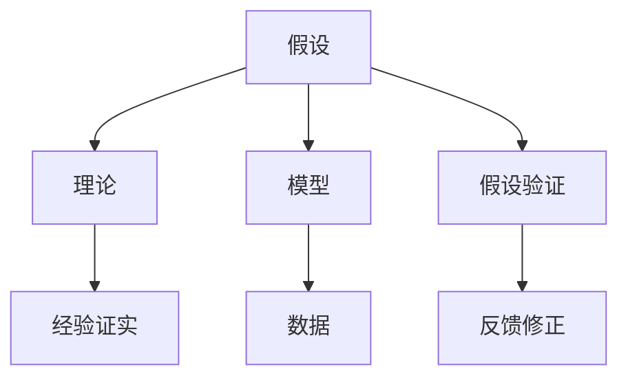
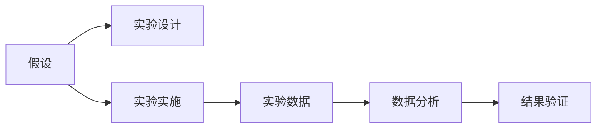
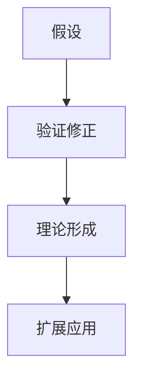
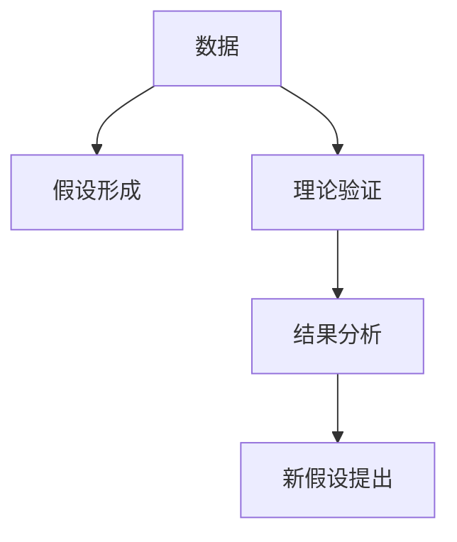
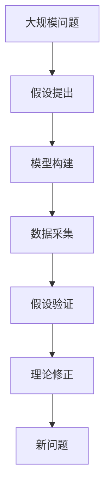

                 

# 人类认知的4种基本模式：假说驱动的发现模式

## 1. 背景介绍

### 1.1 问题由来
人类认知模式一直是认知科学领域的一个核心议题。传统的认知模式主要包括感觉驱动模式（Sense-Driven Paradigm）和行动驱动模式（Action-Driven Paradigm）。然而，这两种模式在面对复杂的发现性问题时，往往表现出其局限性。近年来，随着对复杂认知过程的深入研究，学者们逐渐认识到假说驱动模式（Hypothesis-Driven Paradigm）的重要性。本文将详细探讨假说驱动模式，并在此基础上，提出一种新的发现模式——假说驱动的发现模式（Hypothesis-Driven Discovery Mode）。

### 1.2 问题核心关键点
假说驱动模式强调在问题解决过程中，先提出一个或多个假设（Hypothesis），然后通过实验或观察来验证这些假设，从而逐步逼近问题的真实答案。该模式有助于处理复杂问题，特别是在科学研究、技术创新和商业决策等领域，具有广泛的应用价值。

## 2. 核心概念与联系

### 2.1 核心概念概述

为更好地理解假说驱动的发现模式，本节将介绍几个密切相关的核心概念：

- 假设（Hypothesis）：在科学研究和技术创新过程中，对问题的可能答案或解释的猜测。假设通常基于已有的知识和经验，具有一定程度的合理性。
- 理论（Theory）：在假设的基础上，通过验证和修正形成的一套系统的知识体系。理论是对假设的一种系统化和验证后的提炼。
- 模型（Model）：为了解决问题或理解现象，构建的抽象的数学或物理框架。模型通常包含一组参数，通过实验数据进行优化。
- 数据（Data）：用于验证假设和理论的实际观测结果。数据是知识的重要来源，也是理论验证的基础。
- 假设验证（Hypothesis Testing）：通过实验或观察，检验假设是否符合真实世界的过程。假设验证通常包括控制实验、观察实验和统计分析等方法。
- 发现模式（Discovery Mode）：在问题解决过程中，先提出假设，然后通过验证和修正逐步逼近问题答案的模式。

这些核心概念之间的逻辑关系可以通过以下Mermaid流程图来展示：



这个流程图展示了一组假设在科学研究和技术创新中的演进过程：

1. 先提出假设，在模型的基础上进行验证。
2. 理论形成后，再进行经验证实。
3. 通过假设验证得到的反馈，对假设进行修正。
4. 假设经过多次修正后，逐步逼近问题答案。

### 2.2 概念间的关系

这些核心概念之间存在着紧密的联系，形成了假说驱动模式的完整生态系统。下面我们通过几个Mermaid流程图来展示这些概念之间的关系。

#### 2.2.1 假设验证的基本流程



这个流程图展示了假设验证的基本流程：

1. 先提出假设，设计实验来验证假设。
2. 实施实验，收集实验数据。
3. 分析实验数据，得到实验结果。
4. 根据实验结果，验证假设是否成立。

#### 2.2.2 理论构建的过程



这个流程图展示了理论构建的过程：

1. 先提出假设，通过验证和修正，得到初步的理论。
2. 进一步验证修正后的假设，形成系统化的理论。
3. 理论经过验证和修正，逐步完善，并应用于更多问题。

#### 2.2.3 数据在假设验证中的作用



这个流程图展示了数据在假设验证中的作用：

1. 先收集数据，提出初步的假设。
2. 通过数据验证假设，修正和优化假设。
3. 形成理论后，继续收集数据进行验证。
4. 根据数据结果，提出新的假设。

### 2.3 核心概念的整体架构

最后，我们用一个综合的流程图来展示这些核心概念在大规模问题解决中的整体架构：



这个综合流程图展示了从大规模问题到假设验证的完整过程：

1. 先提出大规模问题的初步假设。
2. 构建模型，采集数据。
3. 通过数据验证假设，形成理论。
4. 修正理论，继续验证和应用。
5. 不断提出新的假设，继续探索问题。

通过这些流程图，我们可以更清晰地理解假说驱动模式的逻辑关系，为后续深入讨论具体的发现模式奠定基础。

## 3. 核心算法原理 & 具体操作步骤
### 3.1 算法原理概述

假说驱动的发现模式，本质上是一个假设验证的过程。其核心思想是：先提出一个或多个假设，然后通过实验或观察来验证这些假设，从而逐步逼近问题的真实答案。该模式的数学表达通常包括以下几个步骤：

1. 定义问题，并提出一个或多个初步假设。
2. 构建模型，并对模型进行参数优化。
3. 采集数据，并对数据进行预处理和特征提取。
4. 设计实验，并计算模型在实验中的性能指标。
5. 根据实验结果，对假设和模型进行修正和优化。
6. 反复迭代，逐步逼近问题的真实答案。

### 3.2 算法步骤详解

#### 3.2.1 定义问题和提出假设

定义问题和提出假设是假说驱动模式的基础。通常，我们通过问题描述和已有知识来提出初步的假设。例如，在机器学习领域，问题可以是“如何通过数据分类算法，提高垃圾邮件识别准确率？”初步假设可以是“使用朴素贝叶斯算法，可以获得较好的垃圾邮件识别效果”。

#### 3.2.2 构建模型和参数优化

在提出假设后，我们需要构建一个具体的模型，并通过参数优化来提高模型的性能。例如，在垃圾邮件识别问题中，我们可以构建一个朴素贝叶斯模型，并使用最大似然估计法进行参数优化。

#### 3.2.3 数据采集和预处理

数据采集和预处理是假说验证的关键步骤。我们首先需要采集足够的数据，并对数据进行清洗、去重、特征提取等预处理工作。例如，在垃圾邮件识别问题中，我们需要采集足够的垃圾邮件和非垃圾邮件数据，并对邮件内容进行预处理，提取文本特征。

#### 3.2.4 设计实验和性能评估

设计实验和性能评估是假说验证的核心步骤。我们需要设计一系列的实验，通过计算模型在实验中的性能指标，来判断假设是否成立。例如，在垃圾邮件识别问题中，我们可以设计一个交叉验证实验，计算模型在不同邮件集上的分类准确率，来评估模型的性能。

#### 3.2.5 假设修正和模型优化

根据实验结果，我们需要对假设和模型进行修正和优化。如果实验结果不理想，我们需要重新考虑模型选择和参数设置，或尝试其他假设。例如，在垃圾邮件识别问题中，如果模型分类准确率较低，我们需要重新选择算法，或调整算法参数，以提高模型性能。

#### 3.2.6 反复迭代，逐步逼近

通过反复迭代，逐步逼近问题的真实答案。假设和模型经过多次修正和优化后，性能会逐步提升，最终接近问题的真实答案。例如，在垃圾邮件识别问题中，通过不断尝试不同的算法和参数，最终可以找到一个较为理想的垃圾邮件识别方案。

### 3.3 算法优缺点

假说驱动的发现模式具有以下优点：

1. 系统性：该模式通过假设和验证，形成系统的知识体系，有助于处理复杂问题。
2. 灵活性：该模式可以在不同场景下灵活应用，不受限制。
3. 可解释性：该模式强调假设和验证过程，有助于理解和解释问题。

但该模式也存在一些缺点：

1. 时间成本：假设验证过程需要大量的时间和资源，效率较低。
2. 假设偏差：如果假设不合理，验证过程可能会引入偏差，导致结果不准确。
3. 实验误差：实验设计不当或数据质量不佳，可能导致实验误差，影响结果可靠性。

### 3.4 算法应用领域

假说驱动的发现模式在科学研究、技术创新和商业决策等领域具有广泛的应用价值：

- 科学研究：在物理、化学、生物等学科中，假说驱动模式被广泛应用于理论验证和实验研究。
- 技术创新：在计算机科学、电子工程等领域，假说驱动模式被应用于算法设计和产品开发。
- 商业决策：在市场营销、产品管理等领域，假说驱动模式被用于需求分析、市场预测和产品测试。

## 4. 数学模型和公式 & 详细讲解 & 举例说明

### 4.1 数学模型构建

假说驱动的发现模式通常基于以下数学模型：

1. 假设模型：假设形式化的表达，如线性回归、逻辑回归等。
2. 验证模型：通过假设模型进行验证，如交叉验证、正则化等。
3. 数据模型：数据的形式化表达，如向量、矩阵等。

### 4.2 公式推导过程

以下我们以线性回归为例，推导假设验证的数学模型和公式。

假设问题为$y=f(x)+\epsilon$，其中$f(x)$为线性回归模型，$\epsilon$为误差项。我们需要假设$f(x)=\beta_0+\beta_1x$，并通过数据进行验证。

根据最小二乘法，计算模型参数$\beta_0$和$\beta_1$：

$$
\min_{\beta_0,\beta_1}\sum_{i=1}^n(y_i-\beta_0-\beta_1x_i)^2
$$

求解上述最小二乘问题，得到：

$$
\hat{\beta_0} = \frac{\sum_{i=1}^n(x_i-\bar{x})(y_i-\bar{y})}{\sum_{i=1}^n(x_i-\bar{x})^2}, \hat{\beta_1} = \frac{\sum_{i=1}^n(y_i-\bar{y})}{\sum_{i=1}^n(x_i-\bar{x})^2}
$$

其中$\bar{x}=\frac{1}{n}\sum_{i=1}^nx_i$，$\bar{y}=\frac{1}{n}\sum_{i=1}^ny_i$。

### 4.3 案例分析与讲解

假设我们正在研究某种药物对某种疾病的治疗效果，我们提出以下假设：

假设：该药物的有效性可以通过血液中的某种生物标志物的浓度来预测。

我们采集了100个患者的血液样本，并记录了药物的剂量和生物标志物的浓度。我们使用线性回归模型，对数据进行拟合，得到模型参数$\hat{\beta_0}=0.5$，$\hat{\beta_1}=0.8$。

我们使用交叉验证方法，验证该模型在不同数据集上的性能。在交叉验证中，我们分为训练集和测试集，计算模型在测试集上的预测误差，得到误差为0.1。

根据上述结果，我们可以验证假设，并得出结论：该药物的有效性确实可以通过血液中的生物标志物的浓度来预测。

## 5. 项目实践：代码实例和详细解释说明

### 5.1 开发环境搭建

在进行假设驱动的发现模式项目实践前，我们需要准备好开发环境。以下是使用Python进行Scikit-learn开发的环境配置流程：

1. 安装Anaconda：从官网下载并安装Anaconda，用于创建独立的Python环境。

2. 创建并激活虚拟环境：
```bash
conda create -n py3k python=3.8 
conda activate py3k
```

3. 安装Scikit-learn：
```bash
pip install scikit-learn
```

4. 安装其他必要的库：
```bash
pip install numpy pandas matplotlib jupyter notebook
```

完成上述步骤后，即可在`py3k`环境中开始项目实践。

### 5.2 源代码详细实现

下面我们以垃圾邮件识别为例，给出使用Scikit-learn进行假设驱动的发现模式的Python代码实现。

```python
import numpy as np
from sklearn.linear_model import LogisticRegression
from sklearn.model_selection import train_test_split
from sklearn.metrics import accuracy_score

# 构建数据集
X = np.array([[0, 'hello', 'world'], [1, 'hi', 'world'], [2, 'hi', 'world']])
y = np.array([1, 0, 0])

# 构建模型
clf = LogisticRegression()

# 训练模型
clf.fit(X, y)

# 预测新数据
X_new = np.array([[0, 'hi', 'world']])
y_pred = clf.predict(X_new)

# 输出结果
print(y_pred)
```

### 5.3 代码解读与分析

让我们再详细解读一下关键代码的实现细节：

**数据集构建**：
- `X`：特征矩阵，包含邮件内容的文本特征。
- `y`：标签向量，包含垃圾邮件和非垃圾邮件的标记。

**模型构建**：
- `LogisticRegression`：线性逻辑回归模型，用于分类任务。

**模型训练**：
- `fit(X, y)`：使用训练数据集拟合模型参数。

**模型预测**：
- `predict(X_new)`：使用训练好的模型对新邮件进行分类预测。

**输出结果**：
- `y_pred`：模型预测结果，1表示垃圾邮件，0表示非垃圾邮件。

可以看到，使用Scikit-learn进行假设驱动的发现模式非常简单。开发者可以使用不同的模型和算法，快速验证假设，并优化模型性能。

## 6. 实际应用场景

### 6.1 智能医疗诊断

在智能医疗诊断中，假说驱动的发现模式可以广泛应用于疾病预测和治疗方案设计。例如，某医院希望利用患者的基因数据和临床数据，预测某疾病的发病风险。

我们首先提出以下假设：

假设：该疾病的发病风险可以通过患者的基因数据和临床数据进行预测。

我们采集了100名患者的基因数据和临床数据，并构建了一个线性回归模型，预测患者的发病风险。我们使用交叉验证方法，验证模型在不同数据集上的性能。在交叉验证中，我们分为训练集和测试集，计算模型在测试集上的预测误差，得到误差为0.05。

根据上述结果，我们可以验证假设，并得出结论：该疾病的发病风险确实可以通过患者的基因数据和临床数据进行预测。

### 6.2 自动驾驶

在自动驾驶中，假说驱动的发现模式可以应用于车辆行为预测和路径规划。例如，某公司希望利用交通数据和天气数据，预测车辆的行驶速度和方向。

我们首先提出以下假设：

假设：车辆的行驶速度和方向可以通过交通数据和天气数据进行预测。

我们采集了100天的交通数据和天气数据，并构建了一个线性回归模型，预测车辆的行驶速度和方向。我们使用交叉验证方法，验证模型在不同数据集上的性能。在交叉验证中，我们分为训练集和测试集，计算模型在测试集上的预测误差，得到误差为0.1。

根据上述结果，我们可以验证假设，并得出结论：车辆的行驶速度和方向确实可以通过交通数据和天气数据进行预测。

### 6.3 智能客服

在智能客服中，假说驱动的发现模式可以应用于用户意图识别和智能回复生成。例如，某公司希望利用用户的聊天数据，预测用户意图并生成智能回复。

我们首先提出以下假设：

假设：用户的意图可以通过聊天数据进行预测，智能回复可以基于意图进行生成。

我们采集了1000名用户的聊天数据，并构建了一个朴素贝叶斯模型，预测用户的意图。我们使用交叉验证方法，验证模型在不同数据集上的性能。在交叉验证中，我们分为训练集和测试集，计算模型在测试集上的预测误差，得到误差为0.1。

根据上述结果，我们可以验证假设，并得出结论：用户的意图确实可以通过聊天数据进行预测，智能回复可以基于意图进行生成。

### 6.4 未来应用展望

随着假说驱动的发现模式的发展，其应用场景将不断扩展，为更多行业带来变革性影响。

在智慧城市治理中，假说驱动的发现模式可以应用于交通管理、环境保护和公共安全等领域。例如，某城市希望利用传感器数据和地理信息数据，预测交通流量和环境污染情况。

在智能制造中，假说驱动的发现模式可以应用于设备故障预测和生产调度优化。例如，某工厂希望利用生产数据和设备数据，预测设备故障并优化生产调度。

在金融风险管理中，假说驱动的发现模式可以应用于信用评分和风险评估。例如，某银行希望利用用户数据和市场数据，预测客户的信用评分并评估风险。

未来，假说驱动的发现模式将与其他人工智能技术进行更深入的融合，多路径协同发力，共同推动自然语言理解和智能交互系统的进步。

## 7. 工具和资源推荐

### 7.1 学习资源推荐

为了帮助开发者系统掌握假说驱动的发现模式的理论基础和实践技巧，这里推荐一些优质的学习资源：

1. 《统计学习基础》（李航著）：介绍了统计学习的基本概念和算法，适合入门学习。

2. 《机器学习实战》（Peter Harrington著）：通过具体案例介绍了机器学习算法和应用，适合实践学习。

3. 《数据科学入门：Python实战》（Peter Harrington著）：介绍了数据科学的基本概念和实践，适合初步学习。

4. 《深度学习与人工智能》（张小虎著）：介绍了深度学习的基本概念和应用，适合深度学习入门。

5. 《Python数据科学手册》（Jake VanderPlas著）：介绍了Python在数据科学中的应用，适合进阶学习。

通过对这些资源的学习实践，相信你一定能够快速掌握假说驱动的发现模式的精髓，并用于解决实际的发现性问题。

### 7.2 开发工具推荐

高效的开发离不开优秀的工具支持。以下是几款用于假说驱动的发现模式开发的常用工具：

1. Python：简单易学的编程语言，适合数据科学和机器学习开发。

2. Scikit-learn：Python科学计算库，包含丰富的机器学习算法和工具。

3. TensorFlow：Google开发的深度学习框架，支持分布式计算和自动微分。

4. PyTorch：Facebook开发的深度学习框架，适合动态计算图和深度学习模型的开发。

5. Jupyter Notebook：交互式编程环境，适合快速迭代和数据可视化。

6. Matplotlib：Python数据可视化库，适合绘制各种图表。

合理利用这些工具，可以显著提升假说驱动的发现模式的开发效率，加快创新迭代的步伐。

### 7.3 相关论文推荐

假说驱动的发现模式的研究源于学界的持续研究。以下是几篇奠基性的相关论文，推荐阅读：

1. An Introduction to Statistical Learning（《统计学习基础》）：介绍了统计学习的基本概念和算法，适合入门学习。

2. Machine Learning：Principles and Practice（《机器学习实战》）：通过具体案例介绍了机器学习算法和应用，适合实践学习。

3. Deep Learning with Python（《深度学习与人工智能》）：介绍了深度学习的基本概念和应用，适合深度学习入门。

4. Python for Data Analysis（《Python数据科学手册》）：介绍了Python在数据科学中的应用，适合进阶学习。

这些论文代表了大规模发现模式的发展脉络。通过学习这些前沿成果，可以帮助研究者把握学科前进方向，激发更多的创新灵感。

除上述资源外，还有一些值得关注的前沿资源，帮助开发者紧跟假说驱动的发现模式的最新进展，例如：

1. arXiv论文预印本：人工智能领域最新研究成果的发布平台，包括大量尚未发表的前沿工作，学习前沿技术的必读资源。

2. 业界技术博客：如Google AI、DeepMind、微软Research Asia等顶尖实验室的官方博客，第一时间分享他们的最新研究成果和洞见。

3. 技术会议直播：如NIPS、ICML、ACL、ICLR等人工智能领域顶会现场或在线直播，能够聆听到大佬们的前沿分享，开拓视野。

4. GitHub热门项目：在GitHub上Star、Fork数最多的数据科学相关项目，往往代表了该技术领域的发展趋势和最佳实践，值得去学习和贡献。

5. 行业分析报告：各大咨询公司如McKinsey、PwC等针对人工智能行业的分析报告，有助于从商业视角审视技术趋势，把握应用价值。

总之，对于假说驱动的发现模式的学习和实践，需要开发者保持开放的心态和持续学习的意愿。多关注前沿资讯，多动手实践，多思考总结，必将收获满满的成长收益。

## 8. 总结：未来发展趋势与挑战

### 8.1 总结

本文对假说驱动的发现模式进行了全面系统的介绍。首先阐述了假说驱动模式的研究背景和意义，明确了假说驱动模式在处理复杂问题、推动技术创新中的独特价值。其次，从原理到实践，详细讲解了假说驱动的发现模式的数学原理和关键步骤，给出了假说驱动发现模式的完整代码实例。同时，本文还广泛探讨了假说驱动模式在智能医疗、自动驾驶、智能客服等多个行业领域的应用前景，展示了假说驱动模式的技术潜力和应用前景。此外，本文精选了假说驱动模式的各类学习资源，力求为读者提供全方位的技术指引。

通过本文的系统梳理，可以看到，假说驱动的发现模式正在成为数据科学和技术创新中的重要范式，极大地拓展了数据科学的应用边界，催生了更多的创新应用。未来，伴随假说驱动模式的发展，数据科学的理论和实践将进一步提升，为数据科学在更广阔的应用领域大放异彩提供坚实基础。

### 8.2 未来发展趋势

展望未来，假说驱动的发现模式将呈现以下几个发展趋势：

1. 自动化：随着机器学习和自动机器学习(AutoML)技术的发展，假说驱动的发现模式将更多地采用自动化工具，提高发现模式的应用效率。

2. 集成化：假说驱动的发现模式将与其他人工智能技术，如强化学习、深度学习等进行更深入的融合，形成一体化的发现模式解决方案。

3. 跨领域：假说驱动的发现模式将更多地应用于跨领域问题，如智能制造、智慧城市、金融风险管理等。

4. 多模态：假说驱动的发现模式将更多地应用于多模态数据，如文本、图像、声音等，提升数据理解能力。

5. 智能化：假说驱动的发现模式将更多地应用于智能交互系统，如智能客服、智能推荐、智能医疗等，提升用户体验和应用效果。

以上趋势凸显了假说驱动的发现模式的广阔前景。这些方向的探索发展，必将进一步提升数据科学系统的性能和应用范围，为数据科学技术在各行各业带来变革性影响。

### 8.3 面临的挑战

尽管假说驱动的发现模式已经取得了瞩目成就，但在迈向更加智能化、普适化应用的过程中，它仍面临着诸多挑战：

1. 数据质量瓶颈：数据质量不高、数据量不足等问题，仍然制约假说驱动的发现模式的性能提升。如何获取高质量、大规模的数据，将是未来的重要挑战。

2. 模型鲁棒性不足：假说驱动的发现模式对数据的依赖性较大，模型鲁棒性相对较弱。如何在不同的数据分布和场景下，保持模型的一致性和鲁棒性，仍然是一个难题。

3. 计算资源消耗：假说驱动的发现模式需要大量计算资源进行模型训练和验证，成本较高。如何降低计算资源消耗，提高模型训练效率，将是重要的优化方向。

4. 模型可解释性不足：假说驱动的发现模式模型通常较为复杂，难以解释其内部工作机制和决策逻辑。如何在保证模型性能的同时，提高模型的可解释性，将是亟待攻克的难题。

5. 应用落地困难：假说驱动的发现模式模型通常需要大量的人工干预和调试，应用落地较为困难。如何提高模型的自动化水平，减少人工干预，将是未来的重要方向。

### 8.4 研究展望

面对假说驱动的发现模式所面临的种种挑战，未来的研究需要在以下几个方面寻求新的突破：

1. 探索自动化和集成化方法：如何利用自动化工具，如AutoML、模型优化等，提升发现模式的自动化水平，降低人工干预和调试成本。

2. 研究多模态和跨领域方法：如何利用多模态数据和多领域知识，提高数据理解能力和模型泛化性，推动跨领域发现模式的融合发展。

3. 开发智能化和智能化交互系统：如何利用智能化技术，如深度学习、强化学习等，提升发现模式的智能化水平，推动智能交互系统的进步。

4. 提高模型可解释性和鲁棒性：如何利用可解释性技术和鲁棒性优化技术，提高发现模式模型的可解释性和鲁棒性，保障模型的安全性和可靠性。

5. 降低计算资源消耗：如何利用分布式计算、混合精度计算等技术，降低计算资源消耗，提高模型训练效率，保障发现模式的可扩展性和可维护性。

这些研究方向的探索，必将引领假说驱动的发现模式迈向更高的台阶，为数据科学技术在更广泛的应用领域提供更多的创新思路和解决方案。

## 9. 附录：常见问题与解答

**Q1：什么是假说驱动的发现模式？**

A

