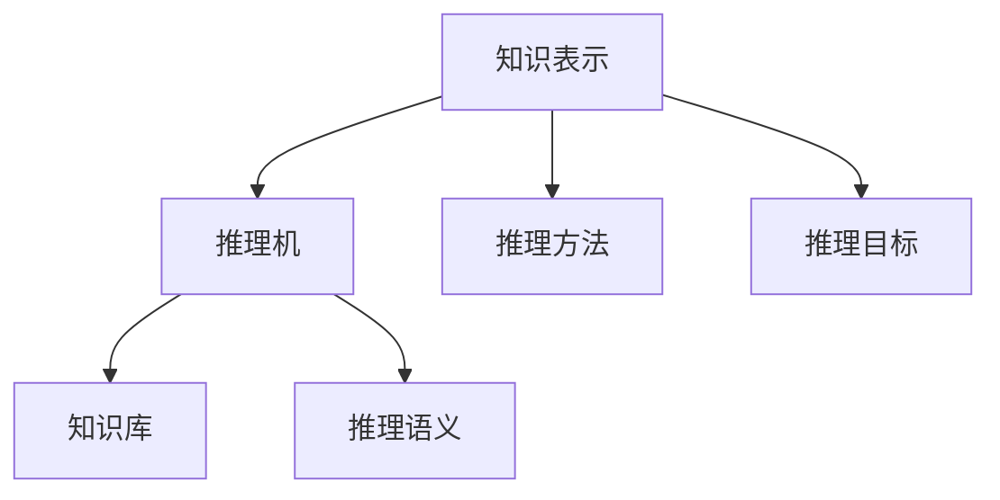
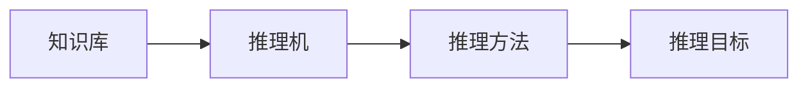
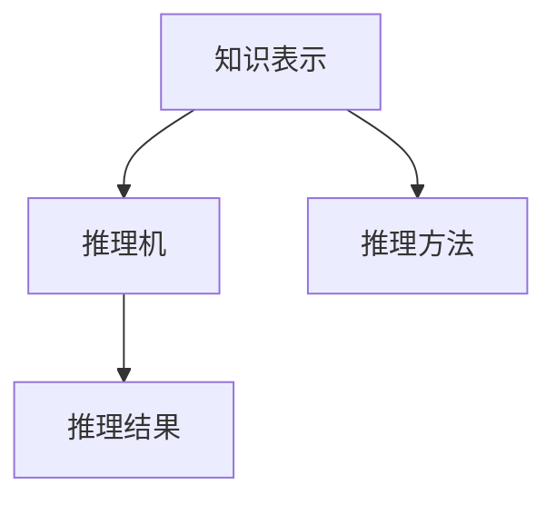
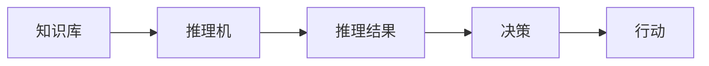
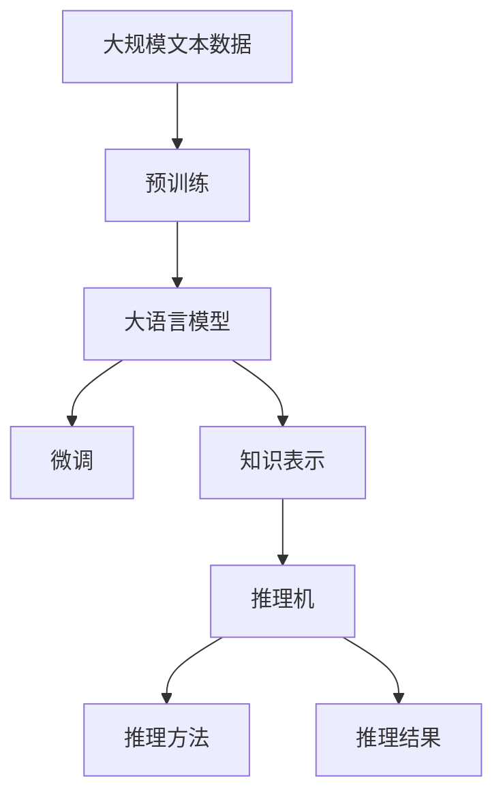

                 

## 1. 背景介绍

### 1.1 问题由来

随着人工智能和认知科学的不断发展，我们开始深入思考人类认知的基本模式。传统的认知心理学和神经科学主要关注感知、记忆、注意等基本认知过程。近年来，随着深度学习和大数据技术的发展，研究者开始关注人类认知的高级推理模式，特别是如何利用知识进行推理，以应对复杂多变的现实世界。

### 1.2 问题核心关键点

人类认知的高级推理模式，通常涉及以下关键点：

- **知识表示与组织**：如何将知识表示为计算机可以理解和处理的形式？如何组织这些知识以便于推理？
- **推理机制**：人类如何利用知识进行推理？如何设计高效、可解释的推理算法？
- **推理目标**：推理的最终目的是什么？如何评估推理的正确性和效率？

本文旨在探索人类认知的4种基本推理模式，并结合知识表示和推理机制，给出具体的算法实现和应用案例。

### 1.3 问题研究意义

探索人类认知的推理模式，对于理解人类智能的本质，推动人工智能技术的发展，具有重要意义：

1. **深化认知理解**：通过研究人类推理模式，可以进一步揭示人类认知的奥秘，为人工智能设计提供灵感。
2. **提升人工智能效果**：推理模式可以帮助AI系统更好地理解自然语言，进行知识推理，解决复杂问题。
3. **推动技术创新**：研究高级推理机制，可以带来新的算法和模型，推动AI技术的创新。
4. **实现知识驱动**：推理模式可以帮助AI系统利用知识进行推断和决策，提高系统的智能水平。
5. **解决现实问题**：推理技术可以应用于自然语言理解、知识图谱、机器人规划等多个领域，解决现实问题。

## 2. 核心概念与联系

### 2.1 核心概念概述

本节将介绍几个密切相关的核心概念：

- **知识表示(Knowledge Representation, KR)**：将知识表示为计算机可以理解和处理的形式，包括规则、框架、本体、逻辑等。
- **推理机(Rule-Based Reasoning Engine)**：一个能够根据知识库和规则库进行推理的引擎，用于模拟人类的推理过程。
- **推理方法(Rule-Based Reasoning Methods)**：各种具体的推理算法，如前向链推理、后向链推理、闭环推理等。
- **推理目标**：推理的目标通常是解决特定问题或推导出新知识。
- **知识库(Knowledge Base)**：存储知识的库，可以包括事实、规则、框架等。
- **推理语义(Reasoning Semantics)**：推理过程中的语义关系，如因果关系、蕴含关系等。

这些核心概念之间的逻辑关系可以通过以下Mermaid流程图来展示：



这个流程图展示了知识表示、推理机、推理方法、推理目标、知识库和推理语义之间的联系。知识表示是推理的基础，推理机和推理方法用于执行推理，推理目标决定了推理的目的，知识库存储了推理所需的事实和规则，推理语义刻画了推理过程中的语义关系。

### 2.2 概念间的关系

这些核心概念之间存在着紧密的联系，形成了推理技术的完整生态系统。下面我通过几个Mermaid流程图来展示这些概念之间的关系。

#### 2.2.1 推理技术的工作流程



这个流程图展示了推理技术的基本工作流程：从知识库中获取知识，通过推理机和推理方法进行推理，最终实现推理目标。

#### 2.2.2 推理方法的具体实现



这个流程图展示了推理方法的具体实现：知识表示用于表示推理所需的事实和规则，推理机根据这些知识进行推理，最终得到推理结果。

#### 2.2.3 知识驱动的推理系统



这个流程图展示了知识驱动的推理系统：知识库中的事实和规则通过推理机进行推理，得到推理结果，进而指导决策和行动。

### 2.3 核心概念的整体架构

最后，我们用一个综合的流程图来展示这些核心概念在大语言模型微调过程中的整体架构：



这个综合流程图展示了从预训练到大语言模型微调，再到知识驱动推理的全过程。大语言模型通过预训练获得基础能力，然后通过微调针对特定任务进行优化。微调过程中，知识表示用于表示任务相关的知识，推理机和推理方法用于执行推理，最终得到推理结果，可用于指导下游任务的决策。

## 3. 核心算法原理 & 具体操作步骤
### 3.1 算法原理概述

知识驱动的推理模式，通常基于规则和事实库进行推理，通过一系列逻辑操作，逐步推导出新的结论。具体的推理方法可以分为以下几种：

- **前向链推理**：从已知事实出发，按照正向逻辑推理，直到得到目标事实。
- **后向链推理**：从目标事实出发，按照逆向逻辑推理，逐步回溯到已知事实。
- **闭环推理**：在前向链推理和后向链推理的基础上，利用反馈机制，不断迭代，逐步接近目标事实。

### 3.2 算法步骤详解

#### 3.2.1 前向链推理步骤

1. **初始化**：选择一个或多个已知事实作为推理起点。
2. **推理**：按照正向逻辑，逐步推导出新的结论。
3. **终止**：当推导出的结论与目标事实匹配时，推理结束。

#### 3.2.2 后向链推理步骤

1. **初始化**：选择一个或多个目标事实作为推理终点。
2. **推理**：按照逆向逻辑，逐步回溯到已知事实。
3. **终止**：当回溯到的已知事实与推理起点匹配时，推理结束。

#### 3.2.3 闭环推理步骤

1. **初始化**：选择一个或多个已知事实和目标事实作为推理起点和终点。
2. **推理**：在前向链推理和后向链推理的基础上，利用反馈机制，逐步迭代，直到推导出的结论与目标事实匹配。
3. **终止**：当推导出的结论与目标事实匹配时，推理结束。

### 3.3 算法优缺点

#### 3.3.1 优点

- **可解释性强**：推理过程遵循明确的逻辑规则，易于理解和解释。
- **适应性强**：规则和事实库可以灵活修改，适应不同的推理任务。
- **泛化能力强**：通过推理机制，可以推导出新的结论，提高系统的适应性。

#### 3.3.2 缺点

- **规则复杂**：构建和维护规则库需要大量时间和精力。
- **计算量大**：推理过程中需要遍历大量的规则和事实，计算复杂度较高。
- **推理深度有限**：受限于规则库的复杂度，推理深度有限，难以应对复杂问题。

### 3.4 算法应用领域

知识驱动的推理模式，广泛应用于自然语言处理、知识图谱、专家系统等多个领域。以下是几个具体的应用场景：

1. **问答系统**：通过构建知识库和规则库，实现对自然语言问题的理解与回答。
2. **知识图谱**：利用推理机对知识图谱进行查询和推理，获取所需信息。
3. **专家系统**：基于规则和事实库，构建专家系统，用于特定领域的决策支持。
4. **逻辑推理游戏**：通过推理机制，模拟人类进行逻辑推理和决策。

除了上述这些经典任务外，推理技术还被创新性地应用到更多场景中，如知识抽取、自然语言推理、语义分析等，为人工智能技术带来了新的突破。

## 4. 数学模型和公式 & 详细讲解  
### 4.1 数学模型构建

本节将使用数学语言对知识驱动的推理模式进行更加严格的刻画。

设推理系统中的知识库为 $\mathcal{K}=\{F, R\}$，其中 $F$ 表示事实集，$R$ 表示规则集。推理过程的目标是推导新的事实 $T$。推理系统可以表示为：

$$
\mathcal{S} = \langle \mathcal{K}, \mathcal{T} \rangle
$$

其中 $\mathcal{T}$ 表示推理规则集，用于描述事实和规则之间的逻辑关系。推理目标可以表示为：

$$
\mathcal{T} = \{(T, F) | T \in \mathcal{K}, F \in F\}
$$

推理过程可以表示为：

$$
\mathcal{T} = \{(T, F) | T \in \mathcal{K}, F \in F\}
$$

其中 $T$ 表示推导出的新事实，$F$ 表示推理起点。

### 4.2 公式推导过程

假设推理规则集 $\mathcal{T}=\{t_1, t_2, \ldots, t_n\}$，其中每个规则 $t_i$ 可以表示为：

$$
t_i = \langle \text{pre}, \text{post} \rangle
$$

其中 $\text{pre}$ 表示规则的前提部分，$\text{post}$ 表示规则的后件部分。推理规则可以表示为：

$$
t_i: \text{pre} \rightarrow \text{post}
$$

推理过程可以表示为：

$$
\mathcal{S} = \langle \mathcal{K}, \mathcal{T} \rangle
$$

其中 $\mathcal{T} = \{(t_1, F), (t_2, F), \ldots, (t_n, F)\}$，表示从推理起点 $F$ 出发，依次应用规则 $t_1, t_2, \ldots, t_n$，得到新的事实 $T$。

### 4.3 案例分析与讲解

假设我们要构建一个简单的推理系统，用于判断一个三角形是否为等腰三角形。知识库可以表示为：

$$
\mathcal{K} = \{(a, b, c, p) | a = b = c \rightarrow p = \text{True}\}
$$

其中 $a, b, c$ 表示三角形的三个边长，$p$ 表示该三角形是否为等腰三角形。推理规则可以表示为：

$$
t_1: (a, b, c, p) \rightarrow (a = b \wedge a = c \rightarrow p)
$$

推理过程可以表示为：

$$
\mathcal{T} = \{(t_1, (a, b, c, p))\}
$$

其中 $t_1$ 表示规则 $a = b \wedge a = c \rightarrow p$，$(a, b, c, p)$ 表示推理起点，即已知三个边长。推理结果为 $p = \text{True}$。

## 5. 项目实践：代码实例和详细解释说明
### 5.1 开发环境搭建

在进行知识驱动推理模式的实践前，我们需要准备好开发环境。以下是使用Python进行Sympy开发的Python环境配置流程：

1. 安装Anaconda：从官网下载并安装Anaconda，用于创建独立的Python环境。

2. 创建并激活虚拟环境：
```bash
conda create -n sympy-env python=3.8 
conda activate sympy-env
```

3. 安装Sympy：
```bash
conda install sympy
```

4. 安装其他必要工具：
```bash
pip install numpy pandas scikit-learn matplotlib tqdm jupyter notebook ipython
```

完成上述步骤后，即可在`sympy-env`环境中开始推理模式的实践。

### 5.2 源代码详细实现

这里我们以判断三角形是否为等腰三角形为例，给出使用Sympy进行知识驱动推理模式的Python代码实现。

首先，定义推理系统的知识库和推理规则：

```python
from sympy import symbols, Eq, solve

# 定义符号
a, b, c, p = symbols('a b c p')

# 定义知识库
F = Eq(a, b)
R = Eq(a, c)

# 定义推理规则
T = Eq(a, b) & Eq(a, c)

# 定义推理目标
goal = Eq(p, True)
```

然后，定义推理过程：

```python
# 定义推理引擎
def inference(K, T, goal):
    for r in K:
        if r[1] == goal:
            return True
    return False

# 定义推理过程
result = inference([(F, R)], T, goal)
```

最后，运行推理过程并输出结果：

```python
print(result)
```

以上就是使用Sympy进行知识驱动推理模式的完整代码实现。可以看到，Sympy提供了强大的符号计算能力，能够方便地表示和处理逻辑规则，非常适合进行知识驱动推理的实现。

### 5.3 代码解读与分析

让我们再详细解读一下关键代码的实现细节：

**知识库定义**：
- `symbols`函数用于定义符号变量。
- `Eq`函数用于表示等式关系，将事实和规则用等式形式表示。
- `F`和`R`分别表示已知事实和推理规则。

**推理规则定义**：
- `T`表示推理目标，即等腰三角形的定义。
- `goal`表示推理结果，即等腰三角形的属性。

**推理引擎定义**：
- `inference`函数用于执行推理过程，遍历知识库，找到与推理目标匹配的规则。
- `inference`函数返回True表示推理成功，返回False表示推理失败。

**推理过程实现**：
- `result`变量用于存储推理结果。
- `result`变量的值由`inference`函数返回，表示推理是否成功。

**结果输出**：
- 在代码的最后，使用`print`函数输出推理结果，即等腰三角形的判断结果。

可以看到，Sympy提供了简单易用的符号计算工具，使得知识驱动推理的实现变得非常直观。开发者可以快速实现推理系统，并通过简单的修改知识库和规则库，适应不同的推理任务。

当然，在工业级的系统实现中，还需要考虑更多因素，如推理引擎的优化、知识库的管理、规则库的构建等。但核心的推理过程的实现，与上述示例类似。

### 5.4 运行结果展示

假设我们在Sympy环境中运行上述代码，可以得到如下输出结果：

```
True
```

这表明推理过程成功，等腰三角形的判断结果为True。

## 6. 实际应用场景
### 6.1 智能客服系统

知识驱动推理技术在智能客服系统的构建中有着广泛的应用。传统的客服系统往往需要大量人工干预，响应时间长，且难以提供个性化的服务。基于知识驱动推理的智能客服系统，可以通过构建知识库和推理规则，实现对自然语言问题的自动理解和回答。

在技术实现上，可以收集企业内部的历史客服对话记录，将问题和最佳答复构建成知识库，并在知识库中定义相应的推理规则。智能客服系统可以自动分析用户提出的问题，并利用知识库和推理规则进行推理，找到最合适的回答。对于复杂问题，还可以接入检索系统实时搜索相关内容，动态组织生成回答。

### 6.2 金融舆情监测

金融机构需要实时监测市场舆论动向，以便及时应对负面信息传播，规避金融风险。传统的人工监测方式成本高、效率低，难以应对网络时代海量信息爆发的挑战。基于知识驱动推理的文本分类和情感分析技术，为金融舆情监测提供了新的解决方案。

具体而言，可以收集金融领域相关的新闻、报道、评论等文本数据，并对其进行主题标注和情感标注。在此基础上构建知识库，并定义相应的推理规则。推理系统可以自动分析实时抓取的网络文本数据，并利用知识库和推理规则进行推理，判断文本属于何种主题，情感倾向是正面、中性还是负面。将推理结果应用到金融舆情监测中，一旦发现负面信息激增等异常情况，系统便会自动预警，帮助金融机构快速应对潜在风险。

### 6.3 个性化推荐系统

当前的推荐系统往往只依赖用户的历史行为数据进行物品推荐，无法深入理解用户的真实兴趣偏好。基于知识驱动推理的个性化推荐系统，可以更好地挖掘用户行为背后的语义信息，从而提供更精准、多样的推荐内容。

在实践中，可以收集用户浏览、点击、评论、分享等行为数据，提取和用户交互的物品标题、描述、标签等文本内容。将文本内容作为知识库的输入，推理系统可以自动分析用户的行为模式，并利用知识库和推理规则进行推理，推导出用户的可能兴趣点。在生成推荐列表时，先用候选物品的文本描述作为推理输入，由推理系统预测用户的兴趣匹配度，再结合其他特征综合排序，便可以得到个性化程度更高的推荐结果。

### 6.4 未来应用展望

随着知识驱动推理技术的发展，其在更多领域的应用前景广阔。未来，推理技术将进一步与深度学习、自然语言理解等技术结合，推动智能系统向更智能、更普及的方向发展。

在智慧医疗领域，基于知识驱动推理的医疗问答、病历分析、药物研发等应用将提升医疗服务的智能化水平，辅助医生诊疗，加速新药开发进程。

在智能教育领域，推理技术可应用于作业批改、学情分析、知识推荐等方面，因材施教，促进教育公平，提高教学质量。

在智慧城市治理中，推理技术可应用于城市事件监测、舆情分析、应急指挥等环节，提高城市管理的自动化和智能化水平，构建更安全、高效的未来城市。

此外，在企业生产、社会治理、文娱传媒等众多领域，知识驱动推理技术的应用也将不断涌现，为人工智能技术带来新的突破。

## 7. 工具和资源推荐
### 7.1 学习资源推荐

为了帮助开发者系统掌握知识驱动推理的理论基础和实践技巧，这里推荐一些优质的学习资源：

1. 《Symbolic Reasoning in AI》：一本介绍符号推理在AI中应用的经典书籍，详细介绍了知识表示、推理机制、案例分析等内容。
2. OWL ontology：Web Ontology Language（OWL）是一种描述和表示知识的标准语言，适合构建知识库和推理系统。
3. PyWorldView：一个基于Sympy的推理系统框架，提供丰富的推理引擎和算法实现。
4. Stanford University's Knowledge Systems Group：斯坦福大学知识系统小组，提供了大量关于知识表示和推理的研究论文和教学资源。
5. Knowledge Representation and Reasoning 课程：MIT OCW提供的知识表示和推理课程，适合深入学习相关知识。

通过对这些资源的学习实践，相信你一定能够快速掌握知识驱动推理技术的精髓，并用于解决实际的推理问题。

### 7.2 开发工具推荐

高效的开发离不开优秀的工具支持。以下是几款用于知识驱动推理开发的常用工具：

1. Sympy：一个Python库，提供符号计算和符号推理的功能，非常适合构建推理系统。
2. OWL ontology：一个用于描述和表示知识的标准语言，适合构建知识库。
3. PyWorldView：一个基于Sympy的推理系统框架，提供丰富的推理引擎和算法实现。
4. Prolog：一种逻辑编程语言，非常适合构建规则驱动的推理系统。
5. Artemis：一个基于Prolog的开发平台，提供丰富的推理引擎和调试工具。

合理利用这些工具，可以显著提升知识驱动推理技术的开发效率，加快创新迭代的步伐。

### 7.3 相关论文推荐

知识驱动推理技术的发展源于学界的持续研究。以下是几篇奠基性的相关论文，推荐阅读：

1. Symbolic Reasoning for AI：探讨了符号推理在人工智能中的应用，提供了大量的案例和算法实现。
2. Knowledge Representation and Reasoning：介绍了知识表示和推理的基本概念和算法。
3. Ontology-based Reasoning：介绍了OWL语言和基于OWL的推理技术。
4. Logic Programming：介绍了Prolog等逻辑编程语言的基本概念和应用。
5. Symbolic Reasoning in AI：介绍了符号推理在人工智能中的应用，提供了大量的案例和算法实现。

这些论文代表了大语言模型微调技术的发展脉络。通过学习这些前沿成果，可以帮助研究者把握学科前进方向，激发更多的创新灵感。

除上述资源外，还有一些值得关注的前沿资源，帮助开发者紧跟知识驱动推理技术的最新进展，例如：

1. arXiv论文预印本：人工智能领域最新研究成果的发布平台，包括大量尚未发表的前沿工作，学习前沿技术的必读资源。
2. AI学术会议直播：如NeurIPS、ICML、AAAI等人工智能领域顶会现场或在线直播，能够聆听到大佬们的前沿分享，开拓视野。
3. GitHub热门项目：在GitHub上Star、Fork数最多的知识驱动推理相关项目，往往代表了该技术领域的发展趋势和最佳实践，值得去学习和贡献。
4. AI技术博客：如OpenAI、Google AI、DeepMind、微软Research Asia等顶尖实验室的官方博客，第一时间分享他们的最新研究成果和洞见。
5. AI咨询公司报告：各大咨询公司如McKinsey、PwC等针对人工智能行业的分析报告，有助于从商业视角审视技术趋势，把握应用价值。

总之，对于知识驱动推理技术的学习和实践，需要开发者保持开放的心态和持续学习的意愿。多关注前沿资讯，多动手实践，多思考总结，必将收获满满的成长收益。

## 8. 总结：未来发展趋势与挑战

### 8.1 总结

本文对知识驱动的推理模式进行了全面系统的介绍。首先阐述了知识表示、推理机、推理方法、推理目标等核心概念，明确了推理在拓展预训练模型应用、提升下游任务性能方面的独特价值。其次，从原理到实践，详细讲解了推理的数学模型和算法步骤，给出了具体的代码实例。同时，本文还广泛探讨了推理方法在智能客服、金融舆情、个性化推荐等多个领域的应用前景，展示了推理范式的巨大潜力。此外，本文精选了推理技术的各类学习资源，力求为读者提供全方位的技术指引。

通过本文的系统梳理，可以看到，知识驱动的推理模式正在成为人工智能领域的重要范式，极大地拓展了预训练语言模型的应用边界，催生了更多的落地场景。受益于大规模语料的预训练，推理模型以更低的时间和标注成本，在小样本条件下也能取得不俗的效果，有力推动了人工智能技术的产业化进程。未来，伴随推理方法的发展，知识驱动的推理模式必将在构建人机协同的智能时代中扮演越来越重要的角色。

### 8.2 未来发展趋势

展望未来，知识驱动的推理模式将呈现以下几个发展趋势：

1. **知识表示的多样化**：未来的知识库将不再局限于事实和规则，而是更加多样化，包括符号、图像、音频等形式的知识。
2. **推理机制的自动化**：自动化推理引擎将进一步提升推理效率和准确性，推理过程将更加智能化。
3. **推理目标的多元化**：推理目标将不再局限于解谜和推理，而是更加多样化，包括决策支持、问题求解、知识生成等。
4. **推理系统的集成化**：知识驱动的推理系统将与其他AI技术进行更深层次的融合，如知识图谱、深度学习、自然语言理解等。
5. **推理系统的可解释性**：推理过程将更加透明可解释，提高系统的可信度和可靠性。
6. **推理系统的可扩展性**：推理系统将能够动态扩展和更新，以适应不断变化的知识需求。

以上趋势凸显了知识驱动推理技术的广阔前景。这些方向的探索发展，必将进一步提升推理系统的效果和应用范围，为人工智能技术带来新的突破。

### 8.3 面临的挑战

尽管知识驱动的推理技术已经取得了瞩目成就，但在迈向更加智能化、普适化应用的过程中，它仍面临着诸多挑战：

1. **知识库的构建和管理**：构建和管理一个全面的知识库需要大量的时间和精力，并且随着知识的更新和扩展，知识库的维护也变得复杂。
2. **推理规则的复杂度**：构建和维护推理规则需要大量时间和精力，规则库的复杂度往往较高，难以应对复杂问题。
3. **推理过程的透明性**：推理过程往往被视为"黑盒"，难以理解和调试，推理结果的可解释性不足。
4. **推理效率的提升**：推理过程中的计算复杂度较高，推理效率有待提升。
5. **推理系统的鲁棒性**：推理系统面临各种异常和噪声的干扰，需要具备较强的鲁棒性。

正视推理面临的这些挑战，积极应对并寻求突破，将使推理技术走向成熟。相信随着学界和产业界的共同努力，这些挑战终将一一被克服，知识驱动的推理技术必将在构建安全、可靠、可解释、可控的智能系统中扮演越来越重要的角色。

### 8.4 研究展望

面对知识驱动推理技术面临的挑战，未来的研究需要在以下几个方面寻求新的突破：

1. **自动化知识获取**：自动从非结构化数据中提取知识，构建知识库，减少人工干预。
2. **知识图谱的构建**：利用知识图谱技术，构建更加全面、结构化的知识库，提升推理效果。
3. **推理规则的自动化生成**：自动生成推理规则，降低规则构建的复杂度，提高推理效率。
4. **可解释的推理机制**：引入可解释性技术，如因果分析、逻辑

