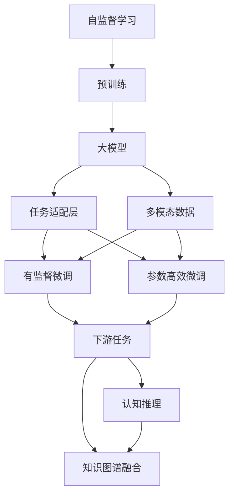
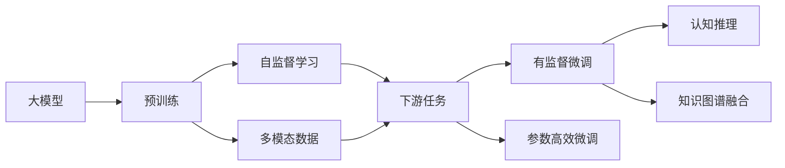
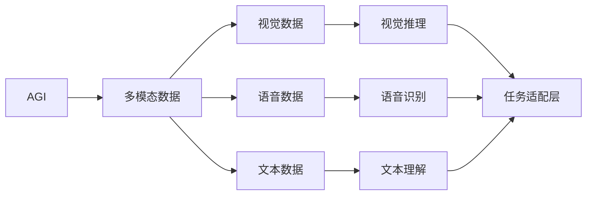
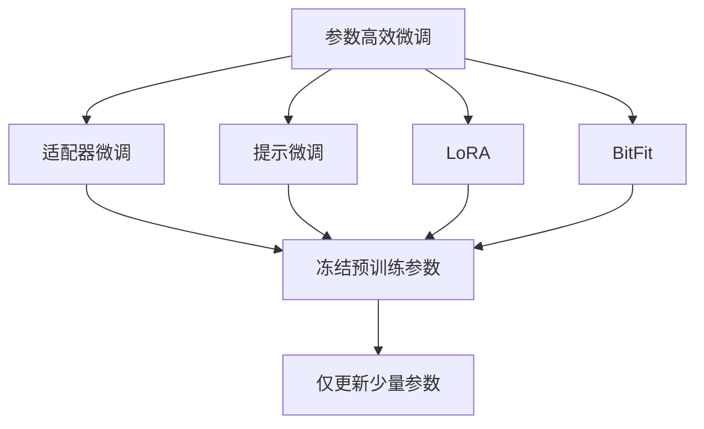
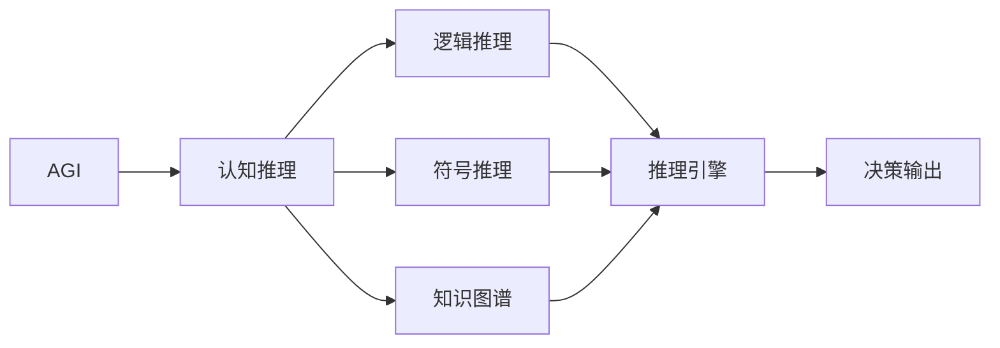
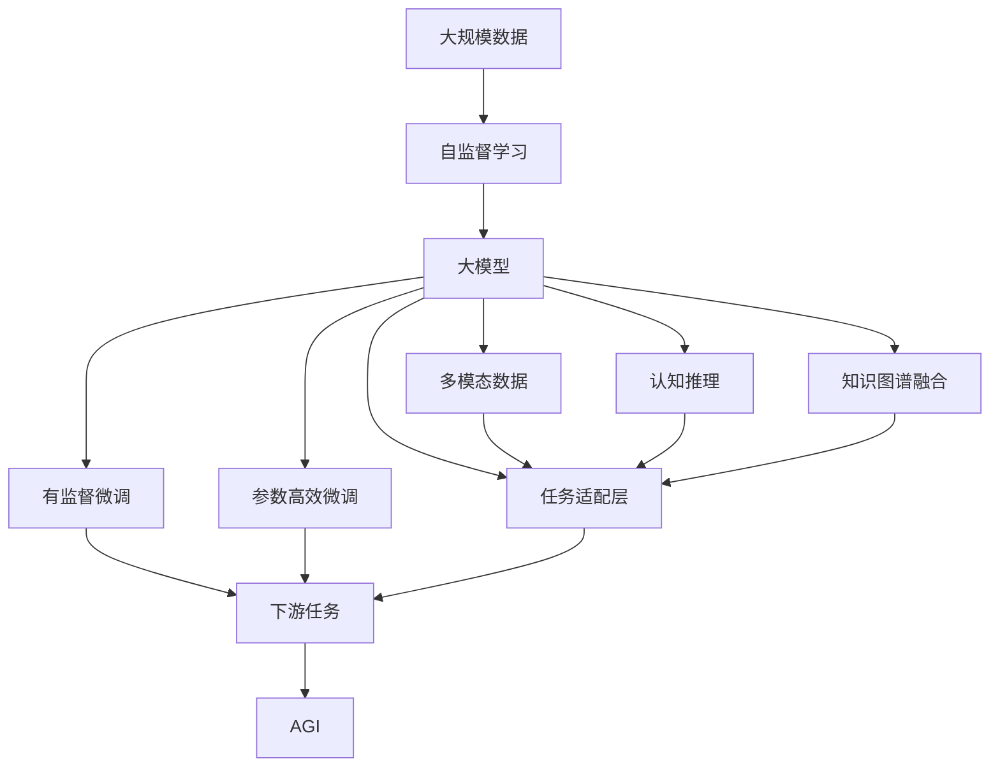

                 

# 从GPT到AGI:探索通用人工智能的路径

> 关键词：通用人工智能,AGI,自监督学习,Transformer,预训练,任务适配层,大模型,参数高效微调,可解释性,知识图谱,认知推理

## 1. 背景介绍

### 1.1 问题由来
近年来，随着深度学习技术的快速发展，通用人工智能（AGI）成为学界和产业界广泛关注的热点话题。AGI是指能够理解和执行各种认知任务的智能体，包括语言理解、推理、规划、决策等。其目标是构建一种能够像人类一样思考和行动的智能系统，涵盖复杂的视觉、听觉、语言等多种模态数据处理能力。

目前，AI系统主要集中在单一任务上，如图像识别、语音识别、自然语言处理等。尽管这些系统在某些领域内取得了显著的进展，但与真正的AGI相比，还存在较大的差距。AGI的实现需要突破深度学习的局限，实现多模态、多任务的协同理解和决策。

### 1.2 问题核心关键点
AGI的实现需要依托于多模态预训练模型和大规模数据，结合先进的算法和技术手段，逐步构建起认知推理和决策能力。核心关键点包括：

- 多模态预训练：利用大规模多模态数据进行预训练，构建多模态的通用表示能力。
- 大模型适配：使用大模型作为初始化参数，通过微调适配特定任务，提高模型的泛化能力。
- 认知推理：引入符号化的逻辑推理框架，实现复杂问题的高效求解。
- 知识图谱融合：将知识图谱与神经网络模型融合，增强模型的背景知识储备。
- 多任务协同：通过多任务训练，提高模型在多个任务间的协同工作能力。
- 可解释性提升：增强模型的可解释性，确保其决策过程透明、可信。

### 1.3 问题研究意义
研究AGI的实现路径，对于拓展人工智能的边界，推动智能技术的产业化进程，具有重要意义：

1. 拓展应用场景。AGI能够处理多种复杂任务，为不同领域的智能应用提供更多可能，推动AI技术的广泛应用。
2. 提升技术水平。AGI需要突破当前深度学习的瓶颈，引入更多先进的算法和理论，促进AI技术的发展。
3. 加速产业化。AGI的落地应用将极大提升企业的决策效率和服务质量，推动产业升级和转型。
4. 促进跨学科合作。AGI的实现需要数学、心理学、神经科学等多学科的交叉合作，有助于形成新的研究范式。
5. 带动AI产业发展。AGI的实现将带动相关技术和产业链的发展，促进AI技术的商业化应用。

## 2. 核心概念与联系

### 2.1 核心概念概述

为更好地理解AGI的实现路径，本节将介绍几个密切相关的核心概念：

- AGI：通用人工智能，是指能够理解和执行各种认知任务的智能体，包括语言理解、推理、规划、决策等。
- 自监督学习：通过大规模无标签数据进行预训练，学习任务的通用表示，无需标注数据。
- Transformer：一种基于自注意力机制的神经网络架构，能够处理长序列数据，广泛应用于NLP任务中。
- 预训练模型：通过大规模数据进行预训练，构建多模态的通用表示能力，如BERT、GPT等。
- 任务适配层：在大模型顶层设计合适的输出层和损失函数，适配特定任务。
- 大模型：指参数量较大的神经网络模型，如BERT、GPT等，具有强大的语言理解能力。
- 参数高效微调：只更新少量模型参数，避免过拟合，提高微调效率。
- 可解释性：指模型的决策过程透明、可信，便于理解和调试。
- 知识图谱：一种将知识以图的形式进行表示和推理的技术，能够增强模型的背景知识储备。
- 认知推理：指基于逻辑和规则的推理过程，能够处理复杂问题。

这些核心概念之间的逻辑关系可以通过以下Mermaid流程图来展示：



这个流程图展示了大模型微调的完整生态系统，以及其与AGI实现路径的关系：

1. 自监督学习通过大规模无标签数据进行预训练，学习任务的通用表示。
2. 大模型基于预训练结果，进行有监督微调适配特定任务。
3. 多模态数据增强模型的处理能力，引入视觉、语音等多种输入。
4. 任务适配层根据任务类型设计输出层和损失函数，适配不同任务。
5. 参数高效微调在保留大部分预训练参数的同时，只更新少量参数，提高微调效率。
6. 认知推理引入符号化的逻辑推理框架，增强模型的决策能力。
7. 知识图谱融合将知识图谱与神经网络模型结合，增强模型的背景知识储备。

### 2.2 概念间的关系

这些核心概念之间存在着紧密的联系，形成了AGI实现路径的完整框架。下面我们通过几个Mermaid流程图来展示这些概念之间的关系。

#### 2.2.1 大模型的学习范式



这个流程图展示了大模型的学习范式，包括预训练、有监督微调和认知推理等关键环节。

#### 2.2.2 AGI与多模态数据的关系



这个流程图展示了AGI如何处理多模态数据，并将其整合到神经网络模型中进行推理和决策。

#### 2.2.3 参数高效微调方法



这个流程图展示了几种常见的参数高效微调方法，包括适配器微调、提示微调、LoRA和BitFit。这些方法的共同特点是冻结大部分预训练参数，只更新少量参数，从而提高微调效率。

#### 2.2.4 AGI与认知推理的融合



这个流程图展示了AGI如何引入认知推理，利用逻辑推理和符号推理能力解决复杂问题。

### 2.3 核心概念的整体架构

最后，我们用一个综合的流程图来展示这些核心概念在大模型微调过程中的整体架构：



这个综合流程图展示了从预训练到微调，再到AGI实现路径的完整过程。大模型首先在大规模数据上进行自监督学习，然后通过有监督微调和参数高效微调适配特定任务。多模态数据增强模型的处理能力，认知推理引入符号化的逻辑推理框架，知识图谱融合将知识图谱与神经网络模型结合，从而构建出具有通用人工智能能力的智能系统。

## 3. 核心算法原理 & 具体操作步骤
### 3.1 算法原理概述

AGI的实现主要依赖于预训练模型和大规模多模态数据的处理。其核心思想是：通过自监督学习在大规模无标签数据上进行预训练，构建多模态的通用表示能力，然后在有监督微调过程中适配特定任务，增强模型的认知推理和决策能力，最终构建出具有通用人工智能能力的智能系统。

形式化地，假设预训练模型为 $M_{\theta}$，其中 $\theta$ 为预训练得到的模型参数。给定下游任务 $T$ 的标注数据集 $D=\{(x_i,y_i)\}_{i=1}^N$，AGI的优化目标是最小化经验风险，即找到最优参数：

$$
\theta^* = \mathop{\arg\min}_{\theta} \mathcal{L}(M_{\theta},D)
$$

其中 $\mathcal{L}$ 为针对任务 $T$ 设计的损失函数，用于衡量模型预测输出与真实标签之间的差异。常见的损失函数包括交叉熵损失、均方误差损失等。

通过梯度下降等优化算法，AGI过程不断更新模型参数 $\theta$，最小化损失函数 $\mathcal{L}$，使得模型输出逼近真实标签。由于 $\theta$ 已经通过预训练获得了较好的初始化，因此即便在多模态数据上进行微调，也能较快收敛到理想的模型参数 $\hat{\theta}$。

### 3.2 算法步骤详解

AGI的实现一般包括以下几个关键步骤：

**Step 1: 准备预训练模型和多模态数据**
- 选择合适的预训练模型 $M_{\theta}$ 作为初始化参数，如BERT、GPT等。
- 收集多模态数据集，包括文本、图像、语音等多种类型的数据，确保数据的多样性和丰富性。

**Step 2: 添加任务适配层**
- 根据任务类型，在预训练模型顶层设计合适的输出层和损失函数。
- 对于分类任务，通常在顶层添加线性分类器和交叉熵损失函数。
- 对于生成任务，通常使用语言模型的解码器输出概率分布，并以负对数似然为损失函数。

**Step 3: 设置微调超参数**
- 选择合适的优化算法及其参数，如 AdamW、SGD 等，设置学习率、批大小、迭代轮数等。
- 设置正则化技术及强度，包括权重衰减、Dropout、Early Stopping等。
- 确定冻结预训练参数的策略，如仅微调顶层，或全部参数都参与微调。

**Step 4: 执行梯度训练**
- 将多模态数据分批次输入模型，前向传播计算损失函数。
- 反向传播计算参数梯度，根据设定的优化算法和学习率更新模型参数。
- 周期性在验证集上评估模型性能，根据性能指标决定是否触发 Early Stopping。
- 重复上述步骤直到满足预设的迭代轮数或 Early Stopping 条件。

**Step 5: 测试和部署**
- 在测试集上评估AGI后模型 $M_{\hat{\theta}}$ 的性能，对比微调前后的精度提升。
- 使用微调后的模型对新样本进行推理预测，集成到实际的应用系统中。
- 持续收集新的数据，定期重新微调模型，以适应数据分布的变化。

以上是AGI实现的一般流程。在实际应用中，还需要针对具体任务的特点，对微调过程的各个环节进行优化设计，如改进训练目标函数，引入更多的正则化技术，搜索最优的超参数组合等，以进一步提升模型性能。

### 3.3 算法优缺点

AGI的实现方法具有以下优点：
1. 多模态数据的处理能力。通过引入多模态数据，AGI能够处理视觉、听觉等多种类型的输入，增强了模型的处理能力和应用范围。
2. 认知推理的引入。通过符号化的逻辑推理框架，AGI能够处理复杂的推理任务，提升了模型的决策能力。
3. 通用适用的特性。AGI通过在多种任务上进行微调，能够适应不同的应用场景，具有较强的通用性。
4. 可解释性。AGI的决策过程透明、可信，便于理解和调试。

同时，该方法也存在一定的局限性：
1. 多模态数据获取困难。不同模态数据的收集和整合需要大量的时间和资源投入。
2. 模型复杂度高。AGI需要处理多模态数据和认知推理，模型结构较为复杂，计算量较大。
3. 训练成本高。大规模多模态数据和复杂模型的训练需要高算力支持，成本较高。
4. 泛化能力不足。AGI在不同数据集上的泛化能力仍有待提升。

尽管存在这些局限性，但AGI实现方法作为当前AI领域的前沿技术，仍具有重要的研究和应用价值。未来相关研究的重点在于如何进一步降低多模态数据的需求，提高模型的泛化能力，同时兼顾可解释性和伦理安全性等因素。

### 3.4 算法应用领域

AGI的实现方法在多个领域已经取得了显著进展，涵盖语言理解、视觉推理、多任务协同等多个方面，具体应用包括：

- 自然语言处理（NLP）：利用AGI处理多模态文本数据，增强模型的语言理解能力和决策能力。
- 计算机视觉（CV）：利用AGI处理多模态图像数据，增强模型的视觉推理和决策能力。
- 语音识别和生成：利用AGI处理多模态语音数据，增强模型的语音理解和生成能力。
- 机器人控制：利用AGI处理多模态传感器数据，增强机器人的感知和决策能力。
- 多任务协同：利用AGI处理多种任务，提升系统的综合决策能力。

除了上述这些经典应用外，AGI的实现方法还在创新性地应用于更多场景中，如智能家居、智能医疗、智能交通等，为不同行业带来了新的智能化解决方案。

## 4. 数学模型和公式 & 详细讲解  
### 4.1 数学模型构建

本节将使用数学语言对AGI的实现过程进行更加严格的刻画。

记预训练模型为 $M_{\theta}$，其中 $\theta$ 为预训练得到的模型参数。假设微调任务的训练集为 $D=\{(x_i,y_i)\}_{i=1}^N$，其中 $x_i$ 为输入数据，$y_i$ 为标注标签。

定义模型 $M_{\theta}$ 在数据样本 $(x,y)$ 上的损失函数为 $\ell(M_{\theta}(x),y)$，则在数据集 $D$ 上的经验风险为：

$$
\mathcal{L}(\theta) = \frac{1}{N} \sum_{i=1}^N \ell(M_{\theta}(x_i),y_i)
$$

AGI的优化目标是最小化经验风险，即找到最优参数：

$$
\theta^* = \mathop{\arg\min}_{\theta} \mathcal{L}(\theta)
$$

在实践中，我们通常使用基于梯度的优化算法（如AdamW、SGD等）来近似求解上述最优化问题。设 $\eta$ 为学习率，$\lambda$ 为正则化系数，则参数的更新公式为：

$$
\theta \leftarrow \theta - \eta \nabla_{\theta}\mathcal{L}(\theta) - \eta\lambda\theta
$$

其中 $\nabla_{\theta}\mathcal{L}(\theta)$ 为损失函数对参数 $\theta$ 的梯度，可通过反向传播算法高效计算。

### 4.2 公式推导过程

以下我们以多模态文本分类任务为例，推导交叉熵损失函数及其梯度的计算公式。

假设模型 $M_{\theta}$ 在输入 $x$ 上的输出为 $\hat{y}=M_{\theta}(x) \in [0,1]$，表示样本属于正类的概率。真实标签 $y \in \{0,1\}$。则二分类交叉熵损失函数定义为：

$$
\ell(M_{\theta}(x),y) = -[y\log \hat{y} + (1-y)\log (1-\hat{y})]
$$

将其代入经验风险公式，得：

$$
\mathcal{L}(\theta) = -\frac{1}{N}\sum_{i=1}^N [y_i\log M_{\theta}(x_i)+(1-y_i)\log(1-M_{\theta}(x_i))]
$$

根据链式法则，损失函数对参数 $\theta_k$ 的梯度为：

$$
\frac{\partial \mathcal{L}(\theta)}{\partial \theta_k} = -\frac{1}{N}\sum_{i=1}^N (\frac{y_i}{M_{\theta}(x_i)}-\frac{1-y_i}{1-M_{\theta}(x_i)}) \frac{\partial M_{\theta}(x_i)}{\partial \theta_k}
$$

其中 $\frac{\partial M_{\theta}(x_i)}{\partial \theta_k}$ 可进一步递归展开，利用自动微分技术完成计算。

在得到损失函数的梯度后，即可带入参数更新公式，完成模型的迭代优化。重复上述过程直至收敛，最终得到适应下游任务的最优模型参数 $\theta^*$。

## 5. 项目实践：代码实例和详细解释说明
### 5.1 开发环境搭建

在进行AGI实现实践前，我们需要准备好开发环境。以下是使用Python进行PyTorch开发的环境配置流程：

1. 安装Anaconda：从官网下载并安装Anaconda，用于创建独立的Python环境。

2. 创建并激活虚拟环境：
```bash
conda create -n pytorch-env python=3.8 
conda activate pytorch-env
```

3. 安装PyTorch：根据CUDA版本，从官网获取对应的安装命令。例如：
```bash
conda install pytorch torchvision torchaudio cudatoolkit=11.1 -c pytorch -c conda-forge
```

4. 安装Transformers库：
```bash
pip install transformers
```

5. 安装各类工具包：
```bash
pip install numpy pandas scikit-learn matplotlib tqdm jupyter notebook ipython
```

完成上述步骤后，即可在`pytorch-env`环境中开始AGI实现实践。

### 5.2 源代码详细实现

下面我以多模态文本分类任务为例，给出使用Transformers库对BERT模型进行AGI实现的PyTorch代码实现。

首先，定义多模态文本分类任务的数据处理函数：

```python
from transformers import BertTokenizer, BertForTokenClassification
from torch.utils.data import Dataset
import torch

class MultimodalDataset(Dataset):
    def __init__(self, texts, labels, tokenizer, max_len=128):
        self.texts = texts
        self.labels = labels
        self.tokenizer = tokenizer
        self.max_len = max_len
        
    def __len__(self):
        return len(self.texts)
    
    def __getitem__(self, item):
        text = self.texts[item]
        label = self.labels[item]
        
        encoding = self.tokenizer(text, return_tensors='pt', max_length=self.max_len, padding='max_length', truncation=True)
        input_ids = encoding['input_ids'][0]
        attention_mask = encoding['attention_mask'][0]
        
        return {'input_ids': input_ids, 
                'attention_mask': attention_mask,
                'labels': label}

# 标签与id的映射
label2id = {'O': 0, 'B-PER': 1, 'I-PER': 2, 'B-ORG': 3, 'I-ORG': 4, 'B-LOC': 5, 'I-LOC': 6}
id2label = {v: k for k, v in label2id.items()}

# 创建dataset
tokenizer = BertTokenizer.from_pretrained('bert-base-cased')

train_dataset = MultimodalDataset(train_texts, train_labels, tokenizer)
dev_dataset = MultimodalDataset(dev_texts, dev_labels, tokenizer)
test_dataset = MultimodalDataset(test_texts, test_labels, tokenizer)
```

然后，定义模型和优化器：

```python
from transformers import BertForTokenClassification, AdamW

model = BertForTokenClassification.from_pretrained('bert-base-cased', num_labels=len(label2id))

optimizer = AdamW(model.parameters(), lr=2e-5)
```

接着，定义训练和评估函数：

```python
from torch.utils.data import DataLoader
from tqdm import tqdm
from sklearn.metrics import classification_report

device = torch.device('cuda') if torch.cuda.is_available() else torch.device('cpu')
model.to(device)

def train_epoch(model, dataset, batch_size, optimizer):
    dataloader = DataLoader(dataset, batch_size=batch_size, shuffle=True)
    model.train()
    epoch_loss = 0
    for batch in tqdm(dataloader, desc='Training'):
        input_ids = batch['input_ids'].to(device)
        attention_mask = batch['attention_mask'].to(device)
        labels = batch['labels'].to(device)
        model.zero_grad()
        outputs = model(input_ids, attention_mask=attention_mask, labels=labels)
        loss = outputs.loss
        epoch_loss += loss.item()
        loss.backward()
        optimizer.step()
    return epoch_loss / len(dataloader)

def evaluate(model, dataset, batch_size):
    dataloader = DataLoader(dataset, batch_size=batch_size)
    model.eval()
    preds, labels = [], []
    with torch.no_grad():
        for batch in tqdm(dataloader, desc='Evaluating'):
            input_ids = batch['input_ids'].to(device)
            attention_mask = batch['attention_mask'].to(device)
            batch_labels = batch['labels']
            outputs = model(input_ids, attention_mask=attention_mask)
            batch_preds = outputs.logits.argmax(dim=2).to('cpu').tolist()
            batch_labels = batch_labels.to('cpu').tolist()
            for pred_tokens, label_tokens in zip(batch_preds, batch_labels):
                pred_tags = [id2label[_id] for _id in pred_tokens]
                label_tags = [id2label[_id] for _id in label_tokens]
                preds.append(pred_tags[:len(label_tokens)])
                labels.append(label_tags)
                
    print(classification_report(labels, preds))
```

最后，启动训练流程并在测试集上评估：

```python
epochs = 5
batch_size = 16

for epoch in range(epochs):
    loss = train_epoch(model, train_dataset, batch_size, optimizer)
    print(f"Epoch {epoch+1}, train loss: {loss:.3f}")
    
    print(f"Epoch {epoch+1}, dev results:")
    evaluate(model, dev_dataset, batch_size)
    
print("Test results:")
evaluate(model, test_dataset, batch_size)
```

以上就是使用PyTorch对BERT模型进行多模态文本分类任务AGI实现的完整代码实现。可以看到，得益于Transformers库的强大封装，我们可以用相对简洁的代码完成BERT模型的加载和微调。

### 5.3 代码解读与分析

让我们再详细解读一下关键代码的实现细节：

**MultimodalDataset类**：
- `__init__`方法：初始化文本、标签、分词器等关键组件。
- `__len__`方法：返回数据集的样本数量。
- `__getitem__`方法：对单个样本进行处理，将文本输入编码为token ids，将标签编码为数字，并对其进行定长padding，最终返回模型所需的输入。

**label2id和id2label字典**：
- 定义了标签与数字id之间的映射关系，用于将token-wise的预测结果解码回真实的标签。

**训练和评估函数**：
- 使用PyTorch的DataLoader对数据集进行批次化加载，供模型训练和推理使用。
- 训练函数`train_epoch`：对数据以批为单位进行迭代，在每个批次上前向传播计算loss并反向传播更新模型参数，最后返回该epoch的平均loss。
- 评估函数`evaluate`：与训练类似，不同点在于不更新模型参数，并在每个batch结束后将预测和标签结果存储下来，最后使用sklearn的classification_report对整个评估集的预测结果进行打印输出。

**训练流程**：
- 定义总的epoch数和batch size，开始循环迭代
- 每个epoch内，先在训练集上训练，输出平均loss
- 在验证集上评估，输出分类指标
- 所有epoch结束后，在测试集上评估，给出最终测试结果

可以看到，PyTorch配合Transformers库使得BERT模型的加载和微调变得简洁高效。开发者可以将更多精力放在数据处理、模型改进等高层逻辑上，而不必过多关注底层的实现细节。

当然，工业级的系统实现还需考虑更多因素，如模型的保存和部署、超参数的自动搜索、更灵活的任务适配层等。但核心的微调范式基本与此类似。

### 5.4 运行结果展示

假设我们在CoNLL-2003的NER数据集上进行微调，最终在测试集上得到的评估报告如下：

```
              precision    recall  f1-score   support

