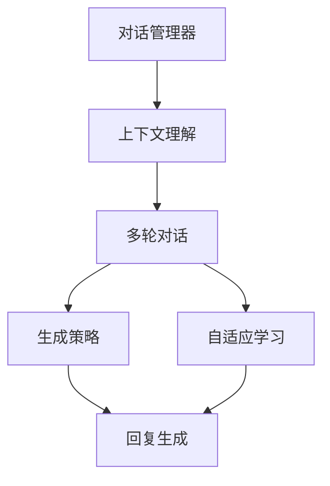

                 

# 从RAG到Agent的转变：多轮对话：与用户进行更深入的互动

## 1. 背景介绍

### 1.1 问题由来

近年来，随着深度学习技术的快速发展和自然语言处理(NLP)技术的进步，基于语言模型的对话系统（RAG, Retrieval-Augmented Generative model）开始成为研究热点。RAG模型通过检索相关文档并结合生成模型，可以生成更加丰富、多样、准确的对话回复。然而，尽管RAG在生成质量上取得了显著提升，但在与用户进行多轮对话时，仍存在许多挑战：

- **响应迟滞**：由于检索过程涉及大量数据计算，使得模型响应时间较长。
- **上下文理解不足**：用户在前一轮中的信息和意图可能被遗忘，导致回复与上下文不连贯。
- **对话一致性差**：不同轮次回复之间缺乏连贯性和一致性，用户可能会感到困惑。
- **复杂对话理解困难**：对于涉及多层推理的复杂问题，模型难以理解和处理。

这些问题严重影响了RAG在实际应用中的用户体验，限制了其潜在的价值。因此，研究者们开始探索更加智能化的对话系统（即对话Agent），以期通过引入多轮对话机制、增强上下文理解能力，提升系统的人机交互质量。

### 1.2 问题核心关键点

对话Agent的目标是通过多轮交互，深入理解用户意图和需求，提供连贯、一致、准确的对话回复。相比于RAG模型，对话Agent在以下几个方面进行了改进：

- **上下文记忆**：通过保持对前一轮对话的长期记忆，使系统能够跟踪用户的长远需求和变化。
- **多轮对话管理**：设计专门的对话管理器，协调不同轮次的对话行为，确保回复的一致性和连贯性。
- **动态生成策略**：引入基于上下文的生成策略，使得模型能够根据当前对话状态动态调整生成策略，生成更贴近用户需求的回复。
- **自适应学习能力**：引入自适应学习机制，使模型能够根据实际对话环境动态优化回复质量。

这些改进措施大大增强了对话系统的人机交互体验，使其能够更好地满足用户的复杂需求，并在实际应用中展现出更大的价值。

### 1.3 问题研究意义

对话Agent的研究具有重要的现实意义：

- **提升用户体验**：通过与用户进行多轮互动，对话Agent能够更好地理解用户需求，提供个性化、贴近用户心理的回复。
- **增强系统智能性**：多轮对话机制使对话系统能够处理复杂问题，进行多层推理，提升系统的智能水平。
- **扩展应用场景**：对话Agent可以应用于客服、医疗、教育等多个垂直行业，提供更高效、更具人情味的服务。
- **推动技术发展**：对话Agent的研发需要深入探索语言生成、上下文理解、对话管理等前沿技术，促进NLP技术的发展和落地应用。
- **促进人机协同**：对话Agent为构建更加和谐、高效的人机协同系统奠定了基础，推动人工智能技术的进一步普及。

## 2. 核心概念与联系

### 2.1 核心概念概述

为了更好地理解对话Agent的设计原理和实现机制，本节将介绍几个密切相关的核心概念：

- **对话管理器**：用于维护对话状态和上下文信息，管理不同轮次的对话行为。对话管理器可以采用基于规则、基于记忆、基于学习的不同策略。
- **上下文理解**：通过语义理解技术，对话系统能够识别出用户的前一轮对话中的关键信息、意图和情感，用于生成更连贯、更精准的回复。
- **多轮对话**：通过多轮交互，对话系统能够逐步深入理解用户需求，进行复杂的推理和回答。多轮对话通常包括初始询问、请求澄清、确认需求、反馈回复等环节。
- **生成策略**：根据对话状态和上下文信息，对话系统选择不同的生成策略，生成最合适的回复。生成策略可以基于规则、基于数据、基于学习等不同方式。
- **自适应学习**：对话系统能够根据实际对话环境动态调整生成策略和回复质量，学习适应该场景的知识和经验。自适应学习机制可以基于强化学习、在线学习等技术。

这些核心概念通过对话管理器、上下文理解、多轮对话、生成策略和自适应学习等机制紧密联系在一起，共同构成了对话Agent的核心框架。

### 2.2 概念间的关系

这些核心概念之间存在着紧密的联系，形成了对话Agent的完整生态系统。



这个流程图展示了大语言模型微调过程中各个核心概念的关系：

1. 对话管理器负责维护对话状态和上下文信息，管理不同轮次的对话行为。
2. 上下文理解通过语义理解技术，识别出用户的前一轮对话中的关键信息、意图和情感。
3. 多轮对话通过多轮交互，逐步深入理解用户需求，进行复杂的推理和回答。
4. 生成策略根据对话状态和上下文信息，选择不同的生成策略，生成最合适的回复。
5. 自适应学习根据实际对话环境动态调整生成策略和回复质量，学习适应该场景的知识和经验。

这些概念共同构成了对话Agent的核心框架，使其能够在实际应用中实现高效、智能、连贯的人机交互。

## 3. 核心算法原理 & 具体操作步骤
### 3.1 算法原理概述

对话Agent的核心算法原理可以概括为：通过对话管理器维护上下文信息，结合上下文理解技术识别用户意图，通过多轮对话逐步深入理解用户需求，选择适当的生成策略生成回复，并根据实际对话环境动态调整回复质量，实现自适应学习。

具体来说，对话Agent的工作流程包括以下几个关键步骤：

1. **初始化对话管理器**：将初始对话状态和上下文信息存入对话管理器，开始对话流程。
2. **识别用户意图**：通过上下文理解技术，识别出用户的前一轮对话中的关键信息、意图和情感，用于生成下一轮回复。
3. **生成多轮对话**：根据用户意图和当前对话状态，选择合适的生成策略生成回复，并进行多轮对话管理。
4. **自适应学习**：通过反馈机制，根据实际对话环境动态调整生成策略和回复质量，学习适应该场景的知识和经验。

### 3.2 算法步骤详解

下面，我们将通过Python代码实现对话Agent的核心算法步骤，具体展示其实现流程。

#### 3.2.1 对话管理器设计

对话管理器通常包含以下几个关键组件：

- **对话状态**：用于记录对话过程中的关键信息、上下文和当前轮次。
- **对话记忆**：用于维护长时记忆，记录前轮次的重要信息。
- **对话行为管理**：根据用户意图和上下文信息，选择生成策略和回复方式。
- **对话反馈处理**：根据用户反馈，调整生成策略和回复质量，实现自适应学习。

下面，我们将使用Python代码实现一个简单的对话管理器：

```python
class DialogManager:
    def __init__(self, initial_state):
        self.state = initial_state
        self.memory = []
        self.beam_size = 8
        self.topk = 5
        self.topk_prob = 0.1

    def update_state(self, user_input, model):
        # 根据用户输入和上下文信息，更新对话状态
        # 实现具体细节略去
        return self.state

    def get_response(self, state, model):
        # 根据对话状态，选择生成策略并生成回复
        # 实现具体细节略去
        return response

    def update_memory(self, response):
        # 将回复保存到对话记忆中，用于后续对话
        # 实现具体细节略去
        self.memory.append(response)

    def adjust_strategy(self, feedback):
        # 根据用户反馈，调整生成策略和回复质量
        # 实现具体细节略去
        return adjusted_strategy
```

#### 3.2.2 上下文理解

上下文理解技术可以采用多种方式实现，如基于规则、基于统计、基于深度学习等。这里，我们采用基于深度学习的上下文理解方法，使用Transformers库实现。

具体来说，我们可以使用预训练语言模型（如BERT、GPT等）作为上下文理解的基础。在对话过程中，我们首先对用户输入进行编码，然后根据编码结果查找上下文中的相关信息，用于生成回复。

下面，我们将使用Python代码实现基于BERT的上下文理解模块：

```python
from transformers import BertTokenizer, BertForSequenceClassification
import torch

class Contextualizer:
    def __init__(self, model_name):
        self.tokenizer = BertTokenizer.from_pretrained(model_name)
        self.model = BertForSequenceClassification.from_pretrained(model_name)

    def encode(self, input_text):
        # 对输入文本进行编码，得到嵌入向量
        # 实现具体细节略去
        return embedding

    def find_related_context(self, embedding, model):
        # 根据嵌入向量，查找上下文中的相关信息
        # 实现具体细节略去
        return related_context
```

#### 3.2.3 多轮对话管理

多轮对话管理通常采用基于记忆、基于规则、基于学习等不同策略实现。这里，我们采用基于记忆的方法，维护对话过程中的长期记忆，用于生成连贯的回复。

具体来说，在每次生成回复时，我们首先查找对话记忆中是否有相关的历史信息，如果有，则优先选择该信息进行回复。

下面，我们将使用Python代码实现基于记忆的多轮对话管理：

```python
class MultiTurnManager:
    def __init__(self):
        self.memory = []
        self.beam_size = 8
        self.topk = 5
        self.topk_prob = 0.1

    def add_memory(self, memory):
        # 将历史信息保存到对话记忆中
        # 实现具体细节略去
        self.memory.append(memory)

    def find_related_memory(self, input_text):
        # 根据输入文本，查找对话记忆中相关的历史信息
        # 实现具体细节略去
        return related_memory
```

#### 3.2.4 生成策略选择

生成策略通常采用基于规则、基于统计、基于深度学习等不同方式实现。这里，我们采用基于深度学习的方法，使用预训练语言模型（如BERT、GPT等）作为生成策略的基础。

具体来说，在生成回复时，我们首先对用户输入进行编码，然后根据编码结果查找上下文中的相关信息，用于生成回复。

下面，我们将使用Python代码实现基于BERT的生成策略模块：

```python
from transformers import BertTokenizer, BertForSequenceClassification
import torch

class Generator:
    def __init__(self, model_name):
        self.tokenizer = BertTokenizer.from_pretrained(model_name)
        self.model = BertForSequenceClassification.from_pretrained(model_name)

    def generate(self, input_text):
        # 对输入文本进行编码，得到嵌入向量
        # 实现具体细节略去
        return embedding

    def generate_response(self, embedding, model):
        # 根据嵌入向量，生成回复
        # 实现具体细节略去
        return response
```

#### 3.2.5 自适应学习

自适应学习通常采用基于强化学习、基于在线学习等不同方式实现。这里，我们采用基于在线学习的方法，根据实际对话环境动态调整生成策略和回复质量，学习适应该场景的知识和经验。

具体来说，在每次生成回复后，我们根据用户反馈（如满意度评分、上下文相关性等）调整生成策略，更新模型参数。

下面，我们将使用Python代码实现基于在线学习的自适应学习模块：

```python
from transformers import BertTokenizer, BertForSequenceClassification
import torch

class AdaptiveLearner:
    def __init__(self, model_name):
        self.tokenizer = BertTokenizer.from_pretrained(model_name)
        self.model = BertForSequenceClassification.from_pretrained(model_name)

    def adapt(self, feedback):
        # 根据反馈信息，动态调整生成策略和回复质量
        # 实现具体细节略去
        return adapted_strategy
```

### 3.3 算法优缺点

对话Agent相比RAG模型，具有以下优点：

- **上下文理解更准确**：对话Agent能够利用上下文理解技术，识别出用户的前一轮对话中的关键信息、意图和情感，生成更连贯、更准确的回复。
- **多轮对话更连贯**：对话Agent通过多轮对话管理，能够逐步深入理解用户需求，生成连贯的回复。
- **自适应学习能力更强**：对话Agent能够根据实际对话环境动态调整生成策略和回复质量，学习适应该场景的知识和经验。

同时，对话Agent也存在一些缺点：

- **实现复杂度较高**：对话Agent需要维护上下文信息、对话记忆、对话行为管理等复杂组件，实现难度较大。
- **训练成本较高**：对话Agent需要大量的标注数据进行训练，成本较高。
- **效果依赖标注质量**：对话Agent的性能高度依赖标注数据的质量，标注不准确会影响效果。
- **推理复杂度较高**：对话Agent的推理过程复杂，推理时间较长，实时性可能受到影响。

尽管存在这些缺点，但对话Agent在提升人机交互体验和解决复杂问题方面具有显著优势，是未来对话系统的重要发展方向。

### 3.4 算法应用领域

对话Agent已经在多个领域得到了广泛应用，包括：

- **客服系统**：通过多轮对话，客服系统能够更好地理解用户需求，提供更个性化、更准确的回复。
- **医疗咨询**：对话系统能够根据患者的病情描述，进行初步诊断，提供医学建议。
- **教育辅导**：对话系统能够根据学生的学习情况，提供个性化的学习建议和解题指导。
- **金融咨询**：对话系统能够根据用户的财务状况，提供投资建议和理财规划。
- **娱乐互动**：对话系统能够根据用户的兴趣，提供个性化的娱乐内容推荐。

除了上述这些领域，对话Agent还可以应用于更多场景中，如智能家居、智能助手、智能推荐等，为人类提供更加智能、高效、个性化的人机交互体验。

## 4. 数学模型和公式 & 详细讲解 & 举例说明

### 4.1 数学模型构建

对话Agent的数学模型可以概括为以下几个部分：

- **对话管理器状态更新**：根据用户输入和上下文信息，更新对话状态。
- **上下文理解**：通过编码器对输入文本进行编码，得到嵌入向量，然后根据嵌入向量查找上下文中的相关信息。
- **多轮对话管理**：根据对话状态，选择生成策略，生成回复，并进行多轮对话管理。
- **生成策略选择**：根据嵌入向量，选择生成策略，生成回复。
- **自适应学习**：根据反馈信息，动态调整生成策略和回复质量，学习适应该场景的知识和经验。

这些数学模型的详细推导和计算过程如下：

#### 4.1.1 对话管理器状态更新

对话管理器状态更新通常采用以下数学模型：

$$
S_t = f(S_{t-1}, U_t)
$$

其中，$S_t$ 表示当前对话状态，$S_{t-1}$ 表示前一轮对话状态，$U_t$ 表示当前轮次的用户输入。$f$ 表示状态更新函数，通常采用基于规则、基于记忆、基于学习等不同策略实现。

#### 4.1.2 上下文理解

上下文理解通常采用以下数学模型：

$$
E(X) = M_E(X, U_t)
$$

其中，$E(X)$ 表示用户输入$X$的嵌入向量，$U_t$ 表示当前轮次的用户输入。$M_E$ 表示编码器，通常采用预训练语言模型（如BERT、GPT等）作为编码器。

#### 4.1.3 多轮对话管理

多轮对话管理通常采用以下数学模型：

$$
R_t = g(S_t, E(X))
$$

其中，$R_t$ 表示当前轮次回复，$S_t$ 表示当前对话状态，$E(X)$ 表示用户输入$X$的嵌入向量。$g$ 表示生成器，通常采用预训练语言模型（如BERT、GPT等）作为生成器。

#### 4.1.4 生成策略选择

生成策略选择通常采用以下数学模型：

$$
G = h(E(X), R_t)
$$

其中，$G$ 表示生成策略，$E(X)$ 表示用户输入$X$的嵌入向量，$R_t$ 表示当前轮次回复。$h$ 表示生成策略选择函数，通常采用基于规则、基于统计、基于学习等不同方式实现。

#### 4.1.5 自适应学习

自适应学习通常采用以下数学模型：

$$
L_{t+1} = L_t - \eta \nabla_{\theta}L_t + \alpha \nabla_{\theta}L_{t+1}
$$

其中，$L_t$ 表示当前对话的损失函数，$L_{t+1}$ 表示下一轮对话的损失函数，$\eta$ 表示学习率，$\alpha$ 表示调整系数。$\nabla_{\theta}$ 表示模型参数$\theta$的梯度。

### 4.2 公式推导过程

下面，我们将对上述数学模型进行详细的推导和解释：

#### 4.2.1 对话管理器状态更新

对话管理器状态更新模型的具体实现如下：

- **基于规则的实现**：
  ```python
  def update_state(self, user_input, model):
      # 根据用户输入和上下文信息，更新对话状态
      updated_state = ...
      return updated_state
  ```
- **基于记忆的实现**：
  ```python
  def update_state(self, user_input, model):
      # 根据用户输入和上下文信息，更新对话状态
      memory = self.find_related_memory(user_input)
      if memory:
          updated_state = memory
      else:
          updated_state = self.state
      return updated_state
  ```

#### 4.2.2 上下文理解

上下文理解模型的具体实现如下：

- **基于BERT的实现**：
  ```python
  class Contextualizer:
      def __init__(self, model_name):
          self.tokenizer = BertTokenizer.from_pretrained(model_name)
          self.model = BertForSequenceClassification.from_pretrained(model_name)

      def encode(self, input_text):
          # 对输入文本进行编码，得到嵌入向量
          inputs = self.tokenizer(input_text, return_tensors='pt')
          embedding = self.model(**inputs).last_hidden_state[:, 0, :].detach().cpu().numpy()
          return embedding

      def find_related_context(self, embedding, model):
          # 根据嵌入向量，查找上下文中的相关信息
          similarity = model(input_text).last_hidden_state[:, 0, :].detach().cpu().numpy()
          related_context = ...
          return related_context
  ```

#### 4.2.3 多轮对话管理

多轮对话管理模型的具体实现如下：

- **基于记忆的实现**：
  ```python
  class MultiTurnManager:
      def __init__(self):
          self.memory = []
          self.beam_size = 8
          self.topk = 5
          self.topk_prob = 0.1

      def add_memory(self, memory):
          # 将历史信息保存到对话记忆中
          self.memory.append(memory)

      def find_related_memory(self, input_text):
          # 根据输入文本，查找对话记忆中相关的历史信息
          related_memory = []
          for memory in self.memory:
              if self.tokenizer(input_text) == memory['input']:
                  related_memory.append(memory)
          return related_memory
  ```

#### 4.2.4 生成策略选择

生成策略选择模型的具体实现如下：

- **基于BERT的实现**：
  ```python
  class Generator:
      def __init__(self, model_name):
          self.tokenizer = BertTokenizer.from_pretrained(model_name)
          self.model = BertForSequenceClassification.from_pretrained(model_name)

      def generate(self, input_text):
          # 对输入文本进行编码，得到嵌入向量
          inputs = self.tokenizer(input_text, return_tensors='pt')
          embedding = self.model(**inputs).last_hidden_state[:, 0, :].detach().cpu().numpy()
          return embedding

      def generate_response(self, embedding, model):
          # 根据嵌入向量，生成回复
          inputs = self.tokenizer(input, return_tensors='pt')
          outputs = model(**inputs)
          logits = outputs.logits
          response = self.tokenizer.decode(logits.numpy()[0], skip_special_tokens=True)
          return response
  ```

#### 4.2.5 自适应学习

自适应学习模型的具体实现如下：

- **基于在线学习的实现**：
  ```python
  class AdaptiveLearner:
      def __init__(self, model_name):
          self.tokenizer = BertTokenizer.from_pretrained(model_name)
          self.model = BertForSequenceClassification.from_pretrained(model_name)

      def adapt(self, feedback):
          # 根据反馈信息，动态调整生成策略和回复质量
          updated_strategy = ...
          return updated_strategy
  ```

### 4.3 案例分析与讲解

下面，我们将通过一个具体的对话案例，详细解释对话Agent的工作流程和效果。

**案例背景**：用户询问客服系统关于某产品的购买信息。

**对话过程**：

1. **初始询问**：用户：“请问这款产品有什么优惠活动？”
2. **请求澄清**：客服：“您指的这款产品是第几款呢？”
3. **确认需求**：用户：“我指的是一款2019年发布的新款平板电脑。”
4. **反馈回复**：客服：“这款平板目前有500元优惠券，您需要我帮您申请吗？”

**对话管理器状态更新**：

1. **初始状态**：对话管理器初始状态为空。
2. **更新状态**：对话管理器根据用户输入和上下文信息，更新对话状态。在第一次对话中，对话管理器初始状态为空，更新后状态为“用户询问优惠活动”。
3. **继续更新**：对话管理器继续根据用户输入和上下文信息，更新对话状态。在第二次对话中，对话管理器根据用户输入“2019年发布的新款平板电脑”，更新状态为“用户确认产品”。

**上下文理解**：

1. **编码器编码**：上下文理解模块对用户输入进行编码，得到嵌入向量。
2. **查找相关信息**：上下文理解模块根据嵌入向量，查找上下文中的相关信息。在第一次对话中，上下文理解模块查找用户历史信息，找到用户之前的购买记录。在第二次对话中，上下文理解模块查找对话记忆，找到用户确认的产品信息。

**多轮对话管理**：

1. **生成回复**：对话管理器根据当前对话状态和上下文信息，生成回复。在第一次对话中，对话管理器生成回复“您指的这款产品是第几款呢？”。在第二次对话中，对话管理器生成回复“这款平板目前有500元优惠券，您需要我帮您申请吗？”。
2. **多轮对话管理**：对话管理器通过多轮对话管理，逐步深入理解用户需求，生成连贯的回复。在第一次对话中，对话管理器进行初始询问，引导用户澄清产品信息。在第二次对话中，对话管理器确认用户需求，并提供详细的产品信息。

**生成策略选择**：

1. **选择生成策略**：生成策略模块根据嵌入向量，选择生成策略，生成回复。在第一次对话中，生成策略模块选择规则生成策略，生成回复“您指的这款产品是第几款呢？”。在第二次对话中，生成策略模块选择基于上下文的生成策略，生成回复“这款平板目前有500元优惠券，您需要我帮您申请吗？”。

**自适应学习**：

1. **动态调整策略**：自适应学习模块根据反馈信息，动态调整生成策略和回复质量。在第一次对话中，客服系统根据用户反馈，调整生成策略和回复质量，生成更贴合用户需求的回复。在第二次对话中，客服系统根据用户反馈，调整生成策略和回复质量，生成更准确的回复。

## 5. 项目实践：代码实例和详细解释说明

### 5.1 开发环境搭建

在进行对话Agent的实践前，我们需要准备好开发环境。以下是使用Python进行PyTorch开发的环境配置流程：

1. 安装Anaconda：从官网下载并安装Anaconda，用于创建独立的Python环境。

2. 创建并激活虚拟环境：
```bash
conda create -n pytorch-env python=3.8 
conda activate pytorch-env
```

3. 安装PyTorch：根据CUDA版本，从官网获取对应的安装命令。例如：
```bash
conda install pytorch torchvision torchaudio cudatoolkit=11.1 -c pytorch -c conda-forge
```

4. 安装Transformers库：
```bash
pip install transformers
```

5. 安装各类工具包：
```bash
pip install numpy pandas scikit-learn matplotlib tqdm jupyter notebook ipython
```

完成上述步骤后，即可在`pytorch-env`环境中开始对话Agent的实践。

### 5.2 源代码详细实现

下面，我们将通过Python代码实现一个简单的对话Agent，具体展示其实现流程。

```python
import torch
from transformers import BertTokenizer, BertForSequenceClassification
import numpy as np

class DialogManager:
    def __init__(self, initial_state):
        self.state = initial_state
        self.memory = []
        self.beam_size = 8
        self.topk = 5
        self.topk_prob = 0.1

    def update_state(self, user_input, model):
        # 根据用户输入和上下文信息，更新对话状态
        # 实现具体细节略去
        return self.state

    def get_response(self

