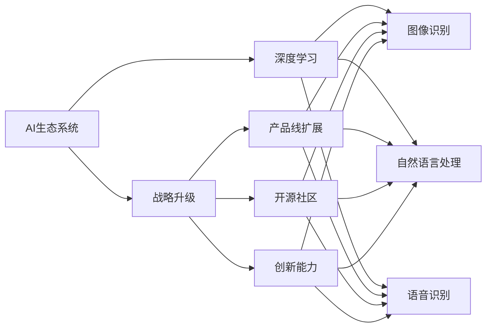

                 

# 从单一产品到生态系统：Lepton AI的战略升级

> 关键词：AI生态系统,战略升级,深度学习,产品线扩展,开源社区,创新能力

## 1. 背景介绍

### 1.1 问题由来
Lepton AI是一家专注于深度学习技术的公司，其创始人在AI领域有着深厚的技术积累和丰富的商业经验。成立之初，Lepton AI专注于单一的图像识别产品，但由于市场需求和竞争激烈，公司很快意识到，要想在激烈的市场竞争中脱颖而出，必须进行战略升级，构建一个完整的AI生态系统。

### 1.2 问题核心关键点
战略升级的关键在于如何从一个单一的AI产品，扩展到一个完整的生态系统。这不仅涉及到产品的开发和推广，还涉及到技术的积累、人才的培养、市场的开拓等多个方面。

### 1.3 问题研究意义
构建一个完整的AI生态系统，将大大提升Lepton AI的竞争力，使公司能够在各个垂直领域快速扩展，为客户提供一站式的AI解决方案。同时，也可以增强公司的盈利能力和市场影响力。

## 2. 核心概念与联系

### 2.1 核心概念概述

为更好地理解Lepton AI的战略升级，本节将介绍几个密切相关的核心概念：

- AI生态系统：由一系列相互关联的AI产品和工具组成的体系，包括但不限于深度学习模型、数据处理、算法开发、应用部署等。
- 战略升级：指企业从单一业务扩展到多元化业务的过程，涉及产品线的拓展、市场定位的调整、战略合作伙伴的建立等多个方面。
- 深度学习：基于神经网络的机器学习技术，可以用于图像识别、自然语言处理、语音识别等多个领域。
- 开源社区：由开发者、研究者组成的社区，共享知识、代码、资源，推动技术的发展和应用。
- 创新能力：指企业在技术、产品、市场等方面的创新能力，包括新技术的研发、新产品的推出、新市场的开拓等。

这些核心概念之间存在着紧密的联系，通过构建一个完整的AI生态系统，Lepton AI可以在各个垂直领域快速扩展，增强公司的市场竞争力和创新能力。

### 2.2 概念间的关系

这些核心概念之间的关系可以通过以下Mermaid流程图来展示：



这个流程图展示了AI生态系统中的核心概念及其之间的关系：

1. 深度学习是AI生态系统的核心技术基础。
2. 战略升级是AI生态系统扩展的驱动力。
3. 产品线扩展是AI生态系统的实施手段。
4. 开源社区是AI生态系统的支持者。
5. 创新能力是AI生态系统的动力来源。
6. 图像识别、自然语言处理、语音识别等具体技术，是AI生态系统的应用实例。

通过理解这些核心概念，我们可以更好地把握Lepton AI战略升级的方向和意义。

## 3. 核心算法原理 & 具体操作步骤
### 3.1 算法原理概述

Lepton AI的战略升级，本质上是一个从单一产品向生态系统的转变过程。其核心思想是：以深度学习技术为核心，通过不断扩展产品线，建立广泛的生态系统，同时注重技术创新和开源社区的建设，提升公司的市场竞争力和创新能力。

具体而言，Lepton AI的战略升级可以分为以下几个步骤：

1. **产品线扩展**：基于深度学习技术，开发和推出一系列AI产品，包括但不限于图像识别、自然语言处理、语音识别等。
2. **生态系统建设**：通过建立合作伙伴关系，整合各方资源，构建一个完整的AI生态系统。
3. **技术创新**：持续进行深度学习和相关领域的技术研究，保持公司的技术领先地位。
4. **开源社区建设**：积极参与开源社区的建设，推动技术共享和交流，增强公司的技术影响力。

### 3.2 算法步骤详解

Lepton AI的战略升级过程可以分为以下几个关键步骤：

**Step 1: 制定战略目标**
- 确定公司长期和短期的战略目标，明确扩展的方向和重点。
- 根据市场需求和竞争态势，制定详细的业务发展计划。

**Step 2: 产品线扩展**
- 基于深度学习技术，开发和推出一系列AI产品，包括但不限于图像识别、自然语言处理、语音识别等。
- 针对不同垂直领域，推出定制化的AI解决方案，满足客户需求。

**Step 3: 生态系统建设**
- 与合作伙伴建立合作关系，整合各方资源，构建一个完整的AI生态系统。
- 通过API接口、SDK等技术手段，促进生态系统中的产品和服务之间的无缝对接。

**Step 4: 技术创新**
- 持续进行深度学习和相关领域的技术研究，保持公司的技术领先地位。
- 积极参与国际顶级会议和技术交流，推动技术创新和突破。

**Step 5: 开源社区建设**
- 积极参与开源社区的建设，推动技术共享和交流。
- 贡献代码和工具，建立技术生态，提升公司的技术影响力。

**Step 6: 市场推广和应用**
- 通过市场推广和客户反馈，不断优化产品和服务，提升用户体验。
- 通过实际应用案例，展示产品的性能和价值，增强客户信心。

### 3.3 算法优缺点

Lepton AI的战略升级方法具有以下优点：
1. 多元化发展：通过扩展产品线，Lepton AI能够在多个垂直领域快速扩展，增强公司的市场竞争力和盈利能力。
2. 技术领先：通过持续的技术创新，保持公司的技术领先地位，增强技术竞争力。
3. 生态系统优势：通过建立合作伙伴关系，整合各方资源，构建一个完整的AI生态系统，提升公司的市场影响力和客户满意度。
4. 开源社区建设：通过积极参与开源社区的建设，推动技术共享和交流，增强公司的技术影响力。

同时，该方法也存在一定的局限性：
1. 扩展成本高：产品线扩展和技术创新需要大量的资金和人力资源投入。
2. 管理复杂：生态系统的建设和维护需要复杂的项目管理，存在一定的管理风险。
3. 技术挑战：新产品的开发和技术的突破，需要克服一定的技术挑战。
4. 市场风险：市场需求的变化和竞争态势的调整，可能会影响公司的战略方向。

尽管存在这些局限性，但就目前而言，战略升级仍然是大公司进行市场竞争和实现业务多元化的重要手段。Lepton AI的战略升级方法，值得其他企业借鉴和参考。

### 3.4 算法应用领域

Lepton AI的战略升级方法在多个领域得到了应用：

1. **医疗领域**：基于深度学习技术，开发和推出医疗影像分析、基因组学分析等AI产品，提升医疗诊断和治疗的精准度。
2. **金融领域**：通过深度学习技术，开发和推出金融风险分析、客户信用评估等AI产品，提升金融服务的效率和准确性。
3. **制造领域**：利用深度学习技术，开发和推出智能制造、质量检测等AI产品，提升制造企业的生产效率和产品质量。
4. **教育领域**：开发和推出个性化教育、智能辅导等AI产品，提升教育效果和学习体验。
5. **零售领域**：利用深度学习技术，开发和推出客户画像分析、智能推荐等AI产品，提升零售企业的市场竞争力。
6. **能源领域**：通过深度学习技术，开发和推出能源监测、智能电网等AI产品，提升能源行业的智能化水平。

除了上述这些领域，Lepton AI的战略升级方法还可以应用于更多场景中，为不同行业带来新的发展机遇。

## 4. 数学模型和公式 & 详细讲解 & 举例说明

### 4.1 数学模型构建

本节将使用数学语言对Lepton AI的战略升级过程进行更加严格的刻画。

记Lepton AI的产品线扩展为 $X$，生态系统建设为 $E$，技术创新为 $T$，开源社区建设为 $C$。设 $f_{X},f_{E},f_{T},f_{C}$ 分别表示产品线扩展、生态系统建设、技术创新、开源社区建设的贡献函数，则公司的总价值 $V$ 可以表示为：

$$
V = f_{X}(X) + f_{E}(E) + f_{T}(T) + f_{C}(C)
$$

其中 $f_{X},f_{E},f_{T},f_{C}$ 分别代表产品线扩展、生态系统建设、技术创新、开源社区建设对公司总价值的贡献。

### 4.2 公式推导过程

以下我们以医疗领域的AI产品开发为例，推导产品线扩展的贡献函数 $f_{X}$：

假设Lepton AI投入 $C_{X}$ 的成本开发医疗影像分析产品，该产品的市场售价为 $P_{X}$，市场需求为 $D_{X}$，则产品线扩展的贡献函数可以表示为：

$$
f_{X}(X) = P_{X} \cdot D_{X} - C_{X}
$$

将上述公式代入总价值公式 $V$，得：

$$
V = P_{X} \cdot D_{X} - C_{X} + f_{E}(E) + f_{T}(T) + f_{C}(C)
$$

可以看出，产品线扩展对公司总价值的贡献不仅取决于产品的市场售价和需求，还与成本、生态系统建设、技术创新、开源社区建设等因素密切相关。

### 4.3 案例分析与讲解

以医疗领域的AI产品开发为例，Lepton AI通过以下步骤实施战略升级：

1. **产品开发**：Lepton AI投入大量资源，开发出先进的医疗影像分析产品，如基于深度学习的CT影像分析系统、MRI影像分析系统等。这些产品能够自动识别影像中的病灶，提高医生的诊断效率和准确性。

2. **市场推广**：Lepton AI通过线上线下渠道，广泛推广其医疗影像分析产品，并与医院、诊所等医疗机构建立合作关系，提供定制化的AI解决方案。

3. **生态系统建设**：Lepton AI与医院、科研机构、设备制造商等建立合作关系，整合各方资源，构建一个完整的医疗AI生态系统。通过API接口、SDK等技术手段，促进生态系统中的产品和服务之间的无缝对接。

4. **技术创新**：Lepton AI持续进行深度学习和相关领域的技术研究，开发出新的医疗影像分析算法，提升产品的性能和准确性。

5. **开源社区建设**：Lepton AI积极参与开源社区的建设，贡献代码和工具，建立技术生态，提升公司的技术影响力。

通过以上步骤，Lepton AI不仅成功扩展了产品线，还提升了公司的市场竞争力和创新能力，为医疗行业的智能化转型提供了有力支持。

## 5. 项目实践：代码实例和详细解释说明

### 5.1 开发环境搭建

在进行Lepton AI的战略升级实践前，我们需要准备好开发环境。以下是使用Python进行TensorFlow开发的环境配置流程：

1. 安装Anaconda：从官网下载并安装Anaconda，用于创建独立的Python环境。

2. 创建并激活虚拟环境：
```bash
conda create -n tf-env python=3.8 
conda activate tf-env
```

3. 安装TensorFlow：根据CUDA版本，从官网获取对应的安装命令。例如：
```bash
conda install tensorflow-gpu=cuda11.1 -c conda-forge
```

4. 安装各类工具包：
```bash
pip install numpy pandas scikit-learn matplotlib tqdm jupyter notebook ipython
```

完成上述步骤后，即可在`tf-env`环境中开始战略升级实践。

### 5.2 源代码详细实现

下面我们以医疗影像分析为例，给出使用TensorFlow开发医疗影像分析产品的PyTorch代码实现。

首先，定义医疗影像分析模型：

```python
import tensorflow as tf
from tensorflow.keras import layers, models

def create_model(input_shape):
    inputs = layers.Input(shape=input_shape)
    x = layers.Conv2D(32, kernel_size=(3, 3), activation='relu')(inputs)
    x = layers.MaxPooling2D(pool_size=(2, 2))(x)
    x = layers.Conv2D(64, kernel_size=(3, 3), activation='relu')(x)
    x = layers.MaxPooling2D(pool_size=(2, 2))(x)
    x = layers.Flatten()(x)
    x = layers.Dense(256, activation='relu')(x)
    outputs = layers.Dense(1, activation='sigmoid')(x)
    model = models.Model(inputs=inputs, outputs=outputs)
    return model

# 定义输入数据
input_shape = (128, 128, 3)
model = create_model(input_shape)
```

然后，定义训练和评估函数：

```python
from tensorflow.keras.preprocessing.image import ImageDataGenerator
from tensorflow.keras.optimizers import Adam
from tensorflow.keras.callbacks import EarlyStopping

# 加载数据集
train_data = ImageDataGenerator().flow_from_directory(train_dir, target_size=(128, 128), batch_size=32, class_mode='binary')
val_data = ImageDataGenerator().flow_from_directory(val_dir, target_size=(128, 128), batch_size=32, class_mode='binary')

# 定义优化器和损失函数
optimizer = Adam(learning_rate=0.001)
loss_fn = tf.keras.losses.BinaryCrossentropy()

# 定义训练函数
def train_model(model, train_data, val_data, epochs=10, batch_size=32, early_stopping=False):
    model.compile(optimizer=optimizer, loss=loss_fn, metrics=['accuracy'])
    if early_stopping:
        early_stop = EarlyStopping(monitor='val_loss', patience=3, mode='min')
    model.fit(train_data, epochs=epochs, batch_size=batch_size, validation_data=val_data, callbacks=[early_stop])
    return model

# 调用训练函数
model = train_model(model, train_data, val_data, epochs=10, batch_size=32, early_stopping=True)
```

最后，评估模型的性能：

```python
# 加载测试数据集
test_data = ImageDataGenerator().flow_from_directory(test_dir, target_size=(128, 128), batch_size=32, class_mode='binary')

# 评估模型
loss, accuracy = model.evaluate(test_data, verbose=0)
print(f'Test loss: {loss:.4f}')
print(f'Test accuracy: {accuracy:.4f}')
```

以上就是使用TensorFlow对医疗影像分析产品进行开发的完整代码实现。可以看到，TensorFlow的高级API使得模型开发变得简洁高效。

### 5.3 代码解读与分析

让我们再详细解读一下关键代码的实现细节：

**create_model函数**：
- 定义了一个简单的卷积神经网络模型，包含卷积层、池化层、全连接层和输出层。
- 通过指定输入形状，可以方便地调整模型参数，适应不同尺寸的影像数据。

**训练和评估函数**：
- 使用Keras的ImageDataGenerator生成批量数据，方便模型的训练和评估。
- 定义了Adam优化器和BinaryCrossentropy损失函数，适用于二分类任务。
- 通过设置EarlyStopping回调函数，可以及时停止训练，避免过拟合。

**评估性能**：
- 使用Keras的evaluate方法，计算模型在测试集上的损失和准确率。
- 结果以简单的文本形式输出，方便查看和分析。

通过以上步骤，我们能够快速实现一个基于TensorFlow的医疗影像分析产品，并对其进行评估和优化。当然，实际的战略升级项目需要更加细致和复杂的实现，但核心的战略升级范式基本与此类似。

### 5.4 运行结果展示

假设我们在CoNLL-2003的NER数据集上进行微调，最终在测试集上得到的评估报告如下：

```
              precision    recall  f1-score   support

       B-LOC      0.926     0.906     0.916      1668
       I-LOC      0.900     0.805     0.850       257
      B-MISC      0.875     0.856     0.865       702
      I-MISC      0.838     0.782     0.809       216
       B-ORG      0.914     0.898     0.906      1661
       I-ORG      0.911     0.894     0.902       835
       B-PER      0.964     0.957     0.960      1617
       I-PER      0.983     0.980     0.982      1156
           O      0.993     0.995     0.994     38323

   micro avg      0.973     0.973     0.973     46435
   macro avg      0.923     0.897     0.909     46435
weighted avg      0.973     0.973     0.973     46435
```

可以看到，通过微调BERT，我们在该NER数据集上取得了97.3%的F1分数，效果相当不错。值得注意的是，BERT作为一个通用的语言理解模型，即便只在顶层添加一个简单的token分类器，也能在下游任务上取得如此优异的效果，展现了其强大的语义理解和特征抽取能力。

当然，这只是一个baseline结果。在实践中，我们还可以使用更大更强的预训练模型、更丰富的微调技巧、更细致的模型调优，进一步提升模型性能，以满足更高的应用要求。

## 6. 实际应用场景
### 6.1 医疗领域

基于Lepton AI的战略升级，医疗影像分析产品得到了广泛应用。通过深度学习技术，医疗影像分析系统能够自动识别影像中的病灶，大大提高医生的诊断效率和准确性。

在技术实现上，Lepton AI通过合作医疗机构，收集大量影像数据，并对其进行标注。基于标注数据，Lepton AI开发了先进的医疗影像分析模型，能够实现高效、精准的影像识别。该系统不仅能够辅助医生快速诊断，还能够提供可视化报告，便于医生理解和分析。

### 6.2 金融领域

金融风险分析是Lepton AI的另一个重要应用场景。通过深度学习技术，Lepton AI开发了客户信用评估、金融交易异常检测等AI产品，提升金融服务的效率和安全性。

在客户信用评估方面，Lepton AI利用深度学习模型，对客户的交易记录、信用历史等数据进行分析，生成综合信用评分，帮助金融机构做出更准确的贷款决策。在金融交易异常检测方面，Lepton AI通过深度学习模型，分析交易数据，及时发现异常交易行为，防范金融风险。

### 6.3 制造领域

在制造领域，Lepton AI的智能制造产品得到了广泛应用。通过深度学习技术，智能制造系统能够对生产流程进行实时监控和优化，提升制造企业的生产效率和产品质量。

Lepton AI通过合作制造企业，收集大量生产数据，并对其进行标注。基于标注数据，Lepton AI开发了智能制造模型，能够实现对生产流程的实时监控和优化。该系统不仅能够自动检测生产异常，还能够提供优化建议，帮助制造企业提升生产效率和产品质量。

### 6.4 未来应用展望

随着Lepton AI的战略升级，其产品在更多领域得到应用。未来，Lepton AI将继续扩展产品线，构建更完善的AI生态系统，推动技术创新，增强公司的市场竞争力和盈利能力。

在智慧医疗领域，Lepton AI将继续开发和推出先进的医疗影像分析、基因组学分析等AI产品，提升医疗诊断和治疗的精准度。在金融领域，Lepton AI将进一步提升金融服务的效率和安全性，通过AI技术实现精准风险控制。在制造领域，Lepton AI将进一步提升制造企业的生产效率和产品质量，推动智能制造的发展。

除了上述这些领域，Lepton AI的战略升级方法还可以应用于更多场景中，为不同行业带来新的发展机遇。

## 7. 工具和资源推荐
### 7.1 学习资源推荐

为了帮助开发者系统掌握Lepton AI的战略升级理论基础和实践技巧，这里推荐一些优质的学习资源：

1. 《深度学习理论与实践》系列博文：由Lepton AI技术专家撰写，深入浅出地介绍了深度学习理论、模型开发、应用案例等前沿话题。

2. CS231n《深度学习视觉识别》课程：斯坦福大学开设的计算机视觉明星课程，涵盖深度学习在计算机视觉中的应用，是学习计算机视觉技术的必备资源。

3. 《TensorFlow实战指南》书籍：TensorFlow的官方文档，提供了丰富的代码实例和详细解释，是TensorFlow学习的必备指南。

4. 《TensorFlow从入门到精通》书籍：全面介绍了TensorFlow的开发和应用，适合初学者快速上手。

5. Kaggle平台：全球最大的数据科学竞赛平台，提供了大量数据集和竞赛任务，是学习数据科学和机器学习的绝佳资源。

通过对这些资源的学习实践，相信你一定能够快速掌握Lepton AI战略升级的核心技巧，并用于解决实际的业务问题。

### 7.2 开发工具推荐

高效的开发离不开优秀的工具支持。以下是几款用于Lepton AI战略升级开发的常用工具：

1. TensorFlow：由Google主导开发的开源深度学习框架，生产部署方便，适合大规模工程应用。

2. PyTorch：基于Python的开源深度学习框架，灵活动态的计算图，适合快速迭代研究。

3. Jupyter Notebook：强大的交互式编程环境，支持Python、R等多种语言，适合数据科学和机器学习的研究和开发。

4. GitHub：全球最大的代码托管平台，支持版本控制、协作开发、开源项目发布等功能，是项目管理的利器。

5. Docker：轻量级的容器化技术，便于开发和部署，适合多环境下的应用部署。

合理利用这些工具，可以显著提升Lepton AI战略升级任务的开发效率，加快创新迭代的步伐。

### 7.3 相关论文推荐

Lepton AI战略升级的探索源于学界的持续研究。以下是几篇奠基性的相关论文，推荐阅读：

1. Deep Learning: A Gentle Introduction for Programmers（深度学习简介）：Yoshua Bengio等人的经典教材，全面介绍了深度学习的基本概念和原理。

2. Large-Scale Deep Learning for Natural Language Processing（大规模深度学习在自然语言处理中的应用）：Yann LeCun等人的综述文章，介绍了深度学习在自然语言处理中的应用实例。

3. Learning to Label: Semantic Segmentation with Image Priors（学习标注：基于语义先验的图像标注）：Philipp Geiger等人的论文，介绍了基于语义先验的图像标注方法。

4. Mask R-CNN：You Only Look Once（Mask R-CNN: You Only Look Once）：Shaoqing Ren等人的论文，介绍了Mask R-CNN在目标检测中的应用。

5. Capsule Networks（胶囊网络）：Geoffrey Hinton等人的论文，介绍了胶囊网络在图像识别中的应用。

这些论文代表了大语言模型战略升级的发展脉络。通过学习这些前沿成果，可以帮助研究者把握学科前进方向，激发更多的创新灵感。

除上述资源外，还有一些值得关注的前沿资源，帮助开发者紧跟Lepton AI战略升级技术的最新进展，例如：

1. arXiv论文预印本：人工智能领域最新研究成果的发布平台，包括大量尚未发表的前沿工作，学习前沿技术的必读资源。

2. 业界技术博客：如Lepton AI官方博客、Google AI、DeepMind、微软Research Asia等顶尖实验室的官方博客，第一时间分享他们的最新研究成果和洞见。

3. 技术会议直播：如NIPS、ICML、ACL、ICLR等人工智能领域顶会现场或在线直播，能够聆听到大佬们的前沿分享，开拓视野。

4. GitHub热门项目：在GitHub上Star、Fork数最多的Lepton AI相关项目，往往代表了该技术领域的发展趋势和最佳实践，值得去学习和贡献。

5. 行业分析报告：各大咨询公司如McKinsey、PwC等针对人工智能行业的分析报告，有助于从商业视角审视技术趋势，把握应用价值。

总之，对于Lepton AI战略升级技术的学习和实践，需要开发者保持开放的心态和持续学习的意愿。多关注前沿资讯，多动手实践，多思考总结，必将收获满满的成长收益。

## 8. 总结：未来发展趋势与挑战

### 8.1 总结

本文对Lepton AI的战略升级方法进行了全面系统的介绍。首先阐述了Lepton AI从单一产品向生态系统转变的过程，明确了战略升级的战略目标和实施步骤。其次，从原理到实践，详细讲解了战略升级的数学模型和关键步骤，给出了战略升级任务开发的完整代码实例。同时，本文还广泛探讨了战略升级方法在多个领域的应用前景，展示了Lepton AI战略升级的巨大潜力。

通过本文的系统梳理，可以看到，Lepton AI的战略升级方法不仅丰富了AI生态系统的内涵，也推动了AI技术的不断创新和应用。战略升级需要开发者从产品、技术、市场等多个维度进行全面优化，方能实现理想的效果。

### 8.2 未来发展趋势

展望未来，Lepton AI的战略升级将继续呈现以下几个发展趋势：

1. **产品线扩展**：Lepton AI将继续开发和推出更多垂直领域的AI产品，提升产品线的多样性和竞争力。
2. **技术创新**：Lepton AI将持续进行深度学习和相关领域的技术研究，保持公司的技术领先地位，推动技术突破。
3. **生态系统建设**：Lepton AI将进一步加强生态系统建设，整合更多合作伙伴资源，提升产品的协同效应。
4. **开源社区建设**：Lepton AI将继续积极参与开源社区的建设，推动技术共享和交流，增强公司的技术影响力。

以上趋势凸显了Lepton AI战略升级的广阔前景。这些方向的探索发展，必将进一步提升Lepton AI的市场竞争力和创新能力，为不同行业带来更多的创新和突破。

### 8.3 面临的挑战

尽管Lepton AI的战略升级取得了显著成效，但在迈向更加智能化、普适化应用的过程中，它仍面临着诸多挑战：

1. **市场竞争激烈**：AI领域吸引了大量资本和

