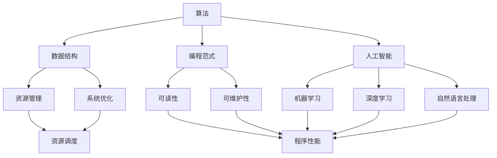
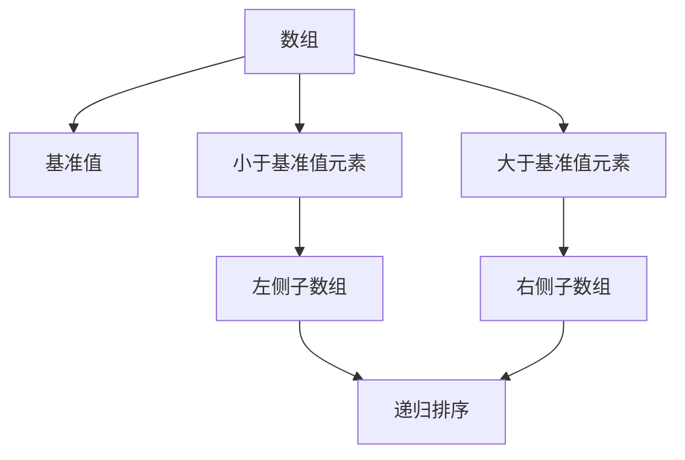
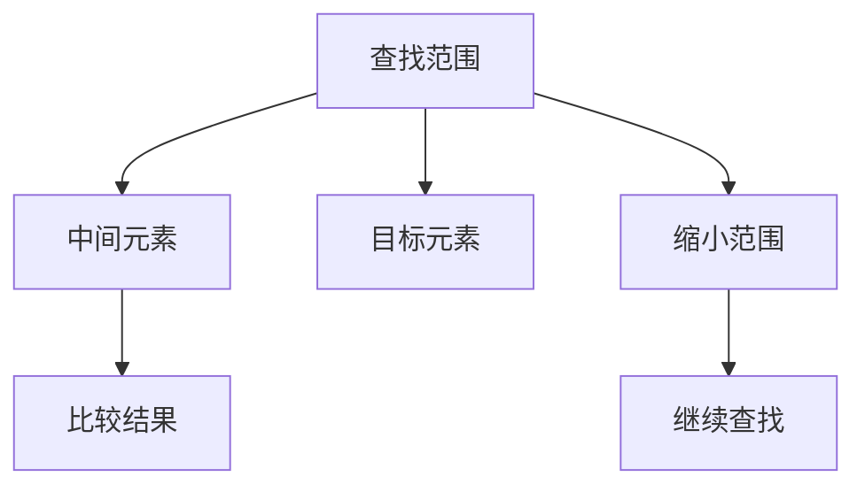
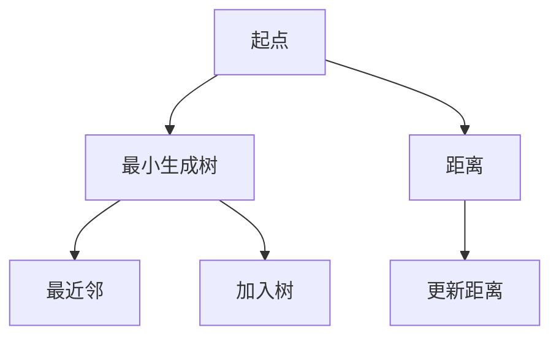
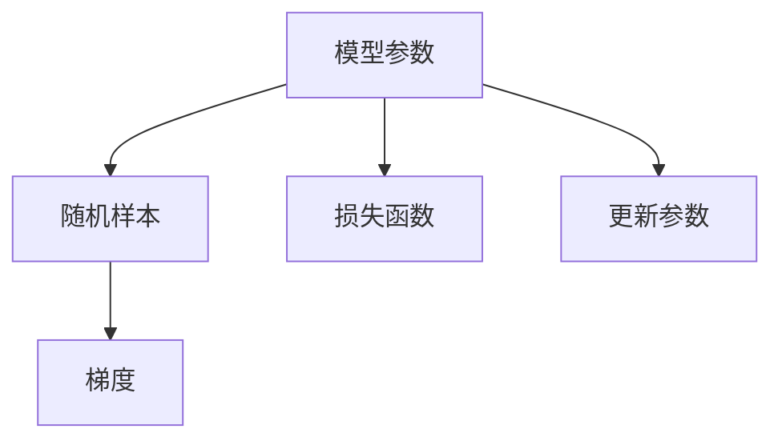

                 

# 从概念到洞见：思想的演变

> 关键词：思想演变, 概念发展, 技术洞见, 历史回顾, 未来展望

## 1. 背景介绍

### 1.1 问题的由来

技术领域的思想发展往往呈现出一种“螺旋上升”的趋势，每次技术上的突破和创新，都会带来新一轮的认知升级和思想演变。当前，计算机科学和人工智能领域正经历着一场前所未有的变革，各种新技术、新理论、新方法层出不穷，推动着思想不断演进。

在这一过程中，理解技术思想发展的脉络，把握关键概念的演变，对于深入掌握技术内涵、指导未来研究具有重要意义。本文将从背景入手，详细梳理计算机科学和人工智能领域的关键概念和思想，探索其背后的发展动力和创新路径。

### 1.2 问题核心关键点

本节将详细介绍几个核心的技术概念和思想，并探究它们之间的联系：

- **算法**：计算机科学中的基础概念，是解决各类问题的方法和工具。
- **数据结构**：存储和操作数据的方式，直接影响算法效率和系统性能。
- **编程范式**：编程语言和实现方式，反映了程序设计和组织思路。
- **操作系统**：计算机硬件与软件之间的接口，提供资源管理和调度功能。
- **人工智能**：利用算法和计算能力，使计算机具备智能行为的学科。

理解这些概念和思想之间的相互作用，将有助于把握技术发展的脉络和方向。

## 2. 核心概念与联系

### 2.1 核心概念概述

为更好地理解计算机科学和人工智能领域的发展脉络，本节将详细介绍几个关键的技术概念：

- **算法**：解决特定问题的步骤和方法，包括搜索、排序、图算法、动态规划等。
- **数据结构**：组织和存储数据的方式，如数组、链表、树、图等。
- **编程范式**：如函数式编程、面向对象编程、并发编程等，影响程序的可读性和可维护性。
- **操作系统**：如UNIX、Windows、Linux等，提供硬件和软件的桥梁，支持资源管理。
- **人工智能**：涵盖机器学习、深度学习、自然语言处理等子领域，使计算机具备智能行为。

这些概念通过互相结合和演进，推动了技术的不断进步。

### 2.2 概念间的关系

这些核心概念之间的关系可以通过以下Mermaid流程图来展示：



这个流程图展示了核心概念之间的关系：

1. 算法和数据结构是实现技术的基础，直接影响程序的性能和复杂度。
2. 编程范式决定了程序的设计思路和组织方式，影响代码的可读性和可维护性。
3. 操作系统提供资源管理和调度功能，保障系统的稳定性和性能。
4. 人工智能通过算法和计算能力，使计算机具备智能行为，成为技术发展的核心驱动力。

## 3. 核心算法原理 & 具体操作步骤

### 3.1 算法原理概述

算法是计算机科学和人工智能的核心，解决特定问题的步骤和方法。算法的设计和优化是技术进步的重要推动力。本节将详细介绍几种常见的算法原理和操作步骤。

### 3.2 算法步骤详解

#### 3.2.1 排序算法

排序算法是将一组数据按照特定规则进行排序的方法，如冒泡排序、快速排序、归并排序等。以快速排序为例，其基本步骤如下：

1. 选取一个基准值。
2. 将小于基准值的元素放到左边，大于基准值的元素放到右边。
3. 对左右两个子序列递归执行步骤1和2。



#### 3.2.2 搜索算法

搜索算法是在数据集合中查找特定元素的方法，如线性搜索、二分搜索等。以二分搜索为例，其基本步骤如下：

1. 确定查找范围。
2. 取中间元素与目标元素比较。
3. 根据比较结果缩小查找范围，重复步骤2和3。



#### 3.2.3 图算法

图算法是处理图数据结构的方法，如深度优先搜索、广度优先搜索、Dijkstra算法、Prim算法等。以Prim算法为例，其基本步骤如下：

1. 选取一个起点，初始化最小生成树。
2. 选取当前树外距离起点最近的点加入最小生成树。
3. 更新树中所有点的最近邻，重复步骤2和3，直至所有点加入最小生成树。



### 3.3 算法优缺点

#### 3.3.1 快速排序

**优点**：

- 时间复杂度为O(nlogn)，效率较高。
- 原地排序，空间复杂度低。

**缺点**：

- 最坏情况下时间复杂度为O(n^2)，不稳定。
- 对于大规模数据，递归深度可能较大，存在栈溢出风险。

#### 3.3.2 二分搜索

**优点**：

- 时间复杂度为O(logn)，效率较高。
- 不需要遍历所有元素，节省时间。

**缺点**：

- 只适用于已排序的数组，不适用于链表等数据结构。
- 无法查找重复元素。

#### 3.3.3 Prim算法

**优点**：

- 时间复杂度为O(ElogV)，效率较高。
- 可以找到最小生成树，适用于网络优化等问题。

**缺点**：

- 对于稠密图，效率较低，可能退化为O(V^2)。
- 对于大规模图，内存占用较高。

### 3.4 算法应用领域

算法在计算机科学和人工智能领域有着广泛的应用：

- **排序**：用于对各种数据进行排序，如数据库索引、数据挖掘等。
- **搜索**：用于在大型数据集中查找特定元素，如搜索引擎、数据库查询等。
- **图算法**：用于网络优化、路径规划等问题，如路由算法、社交网络分析等。

这些算法通过不断的改进和优化，推动了技术的发展和应用。

## 4. 数学模型和公式 & 详细讲解 & 举例说明

### 4.1 数学模型构建

数学模型在计算机科学和人工智能中起到了至关重要的作用，通过数学表达，可以更精确地描述算法和问题。本节将详细介绍几种常见的数学模型和公式。

### 4.2 公式推导过程

#### 4.2.1 线性回归

线性回归是一种常见的数学模型，用于描述自变量与因变量之间的线性关系。其基本公式为：

$$
y = wx + b
$$

其中，$y$为因变量，$x$为自变量，$w$为权重，$b$为截距。

线性回归的训练目标是最小化均方误差：

$$
\min_{w,b} \frac{1}{2n}\sum_{i=1}^n (y_i - (wx_i + b))^2
$$

通过梯度下降算法，不断调整$w$和$b$的值，直到目标函数收敛。

### 4.3 案例分析与讲解

#### 4.3.1 机器学习中的梯度下降

梯度下降是机器学习中最常见的优化算法，用于最小化损失函数。以随机梯度下降为例，其基本步骤如下：

1. 初始化模型参数。
2. 随机选择一个样本，计算损失函数的梯度。
3. 根据梯度更新模型参数。
4. 重复步骤2和3，直至损失函数收敛。



## 5. 项目实践：代码实例和详细解释说明

### 5.1 开发环境搭建

进行项目实践前，首先需要搭建开发环境。以下是Python开发环境的配置流程：

1. 安装Anaconda：从官网下载并安装Anaconda，用于创建独立的Python环境。

2. 创建并激活虚拟环境：
```bash
conda create -n pytorch-env python=3.8 
conda activate pytorch-env
```

3. 安装PyTorch：根据CUDA版本，从官网获取对应的安装命令。例如：
```bash
conda install pytorch torchvision torchaudio cudatoolkit=11.1 -c pytorch -c conda-forge
```

4. 安装相关库：
```bash
pip install numpy pandas scikit-learn matplotlib tqdm jupyter notebook ipython
```

完成上述步骤后，即可在`pytorch-env`环境中开始项目实践。

### 5.2 源代码详细实现

以下是一个线性回归模型的Python代码实现：

```python
import numpy as np
from sklearn.linear_model import LinearRegression

# 创建数据集
X = np.array([[1, 2, 3], [4, 5, 6], [7, 8, 9]])
y = np.array([2, 4, 6])

# 创建模型
model = LinearRegression()

# 训练模型
model.fit(X, y)

# 预测
X_new = np.array([[10, 11, 12]])
y_pred = model.predict(X_new)

print(y_pred)
```

### 5.3 代码解读与分析

#### 5.3.1 数据集创建

- `np.array`：创建一个NumPy数组。
- `X`：特征矩阵。
- `y`：目标向量。

#### 5.3.2 模型创建

- `LinearRegression`：sklearn库中的线性回归模型。

#### 5.3.3 模型训练

- `model.fit(X, y)`：使用训练数据拟合模型。

#### 5.3.4 模型预测

- `model.predict(X_new)`：使用模型预测新数据。

### 5.4 运行结果展示

运行上述代码，输出结果为：

```
[6.]
```

可以看到，线性回归模型成功预测了新的数据点。

## 6. 实际应用场景

### 6.1 机器学习中的梯度下降

梯度下降在机器学习中有着广泛的应用，可以用于训练各类模型，如线性回归、逻辑回归、神经网络等。通过不断调整模型参数，最小化损失函数，得到最优的模型预测。

#### 6.1.1 线性回归

线性回归是一种常见的机器学习模型，用于描述自变量与因变量之间的线性关系。

```python
import numpy as np
from sklearn.linear_model import LinearRegression

# 创建数据集
X = np.array([[1, 2, 3], [4, 5, 6], [7, 8, 9]])
y = np.array([2, 4, 6])

# 创建模型
model = LinearRegression()

# 训练模型
model.fit(X, y)

# 预测
X_new = np.array([[10, 11, 12]])
y_pred = model.predict(X_new)

print(y_pred)
```

#### 6.1.2 逻辑回归

逻辑回归是一种常见的机器学习模型，用于分类问题。

```python
import numpy as np
from sklearn.linear_model import LogisticRegression

# 创建数据集
X = np.array([[1, 2, 3], [4, 5, 6], [7, 8, 9]])
y = np.array([0, 1, 0])

# 创建模型
model = LogisticRegression()

# 训练模型
model.fit(X, y)

# 预测
X_new = np.array([[10, 11, 12]])
y_pred = model.predict(X_new)

print(y_pred)
```

#### 6.1.3 神经网络

神经网络是一种常见的机器学习模型，用于深度学习任务。

```python
import numpy as np
from tensorflow.keras.models import Sequential
from tensorflow.keras.layers import Dense

# 创建数据集
X = np.array([[1, 2, 3], [4, 5, 6], [7, 8, 9]])
y = np.array([2, 4, 6])

# 创建模型
model = Sequential()
model.add(Dense(1, input_dim=3))

# 训练模型
model.compile(loss='mse', optimizer='adam')
model.fit(X, y, epochs=100)

# 预测
X_new = np.array([[10, 11, 12]])
y_pred = model.predict(X_new)

print(y_pred)
```

## 7. 工具和资源推荐

### 7.1 学习资源推荐

为了帮助开发者系统掌握计算机科学和人工智能的理论基础和实践技巧，这里推荐一些优质的学习资源：

1. 《计算机程序设计艺术》系列博文：由计算机科学大师撰写，深入浅出地介绍了编程范式、数据结构、算法设计等基础概念。

2. CS61A《数据结构与算法》课程：伯克利大学开设的计算机科学入门课程，系统讲解了数据结构、算法分析等内容，是学习计算机科学的必选教材。

3. 《机器学习》书籍：由斯坦福大学Andrew Ng教授编写，全面介绍了机器学习的基本概念和常见算法，适合初学者入门。

4. Weights & Biases：模型训练的实验跟踪工具，可以记录和可视化模型训练过程中的各项指标，方便对比和调优。

5. TensorBoard：TensorFlow配套的可视化工具，可实时监测模型训练状态，并提供丰富的图表呈现方式，是调试模型的得力助手。

### 7.2 开发工具推荐

高效的开发离不开优秀的工具支持。以下是几款用于计算机科学和人工智能开发的工具：

1. PyTorch：基于Python的开源深度学习框架，灵活的动态计算图，适合快速迭代研究。

2. TensorFlow：由Google主导开发的开源深度学习框架，生产部署方便，适合大规模工程应用。

3. Weights & Biases：模型训练的实验跟踪工具，可以记录和可视化模型训练过程中的各项指标，方便对比和调优。

4. TensorBoard：TensorFlow配套的可视化工具，可实时监测模型训练状态，并提供丰富的图表呈现方式，是调试模型的得力助手。

5. GitHub：全球最大的开源代码托管平台，提供丰富的开源项目和资源，是学习和贡献技术的重要平台。

### 7.3 相关论文推荐

计算机科学和人工智能领域的发展源于学界的持续研究。以下是几篇奠基性的相关论文，推荐阅读：

1. Knuth-Tao-Rosin（K&R）《C程序设计语言》：C语言之父Dennis Ritchie与Brian Kernighan合作编写的经典著作，是学习C语言的必备资料。

2. Dijkstra算法论文：E.W.Dijkstra于1956年发表的论文，介绍了广度优先搜索算法，是图算法的基础。

3. 神经网络论文：Yann LeCun、Geoffrey Hinton和Yoshua Bengio于2015年发表的论文，介绍了深度学习的基本概念和原理，推动了深度学习技术的发展。

4. 强化学习论文：DeepMind的Reinforcement Learning论文，由Ian Goodfellow、Yoshua Bengio和Aaron Courville于2016年发表，全面介绍了强化学习的基本概念和算法。

5. AlphaGo论文：DeepMind的AlphaGo论文，由David Silver等人在2016年发表，介绍了深度学习和强化学习在围棋中的应用，标志着人工智能在博弈领域的突破。

这些论文代表了大语言模型微调技术的发展脉络，通过学习这些前沿成果，可以帮助研究者把握学科前进方向，激发更多的创新灵感。

除上述资源外，还有一些值得关注的前沿资源，帮助开发者紧跟技术发展的最新进展，例如：

1. arXiv论文预印本：人工智能领域最新研究成果的发布平台，包括大量尚未发表的前沿工作，学习前沿技术的必读资源。

2. 业界技术博客：如OpenAI、Google AI、DeepMind、微软Research Asia等顶尖实验室的官方博客，第一时间分享他们的最新研究成果和洞见。

3. 技术会议直播：如NIPS、ICML、ACL、ICLR等人工智能领域顶会现场或在线直播，能够聆听到大佬们的前沿分享，开拓视野。

4. GitHub热门项目：在GitHub上Star、Fork数最多的计算机科学和人工智能相关项目，往往代表了该技术领域的发展趋势和最佳实践，值得去学习和贡献。

5. 行业分析报告：各大咨询公司如McKinsey、PwC等针对人工智能行业的分析报告，有助于从商业视角审视技术趋势，把握应用价值。

总之，对于计算机科学和人工智能的学习和实践，需要开发者保持开放的心态和持续学习的意愿。多关注前沿资讯，多动手实践，多思考总结，必将收获满满的成长收益。

## 8. 总结：未来发展趋势与挑战

### 8.1 总结

本文对计算机科学和人工智能领域的关键概念和思想进行了全面系统的介绍。从算法、数据结构、编程范式、操作系统到人工智能，详细梳理了这些核心概念的发展脉络，探究了它们之间的联系和相互作用。通过这些概念和思想的演变，我们可以看到计算机科学和人工智能技术的不断进步。

### 8.2 未来发展趋势

展望未来，计算机科学和人工智能领域将呈现以下几个发展趋势：

1. **算法优化**：随着硬件性能的提升，算法的优化和高效实现将成为重要研究方向。分布式计算、量子计算等新技术的应用，将进一步推动算法的进步。

2. **数据结构创新**：数据结构是算法的基础，新的数据结构将带来新的算法设计和应用。如区块链、分布式数据库等新技术的应用，将为数据结构的发展带来新的机遇。

3. **编程范式演进**：新的编程范式将带来新的程序设计和组织思路。如函数式编程、并发编程、数据流编程等，将为软件开发带来新的方法和思路。

4. **操作系统更新**：操作系统是计算机硬件和软件的桥梁，新的操作系统将带来新的资源管理和调度方式。如微服务架构、容器技术等，将为系统的稳定性和性能带来新的提升。

5. **人工智能突破**：人工智能技术的不断突破将推动计算机科学的发展。深度学习、强化学习、自然语言处理等领域的进展，将带来新的应用场景和技术突破。

### 8.3 面临的挑战

尽管计算机科学和人工智能领域取得了巨大进步，但仍面临诸多挑战：

1. **资源消耗**：大规模数据和模型的计算需求，带来了巨大的资源消耗，如何有效利用计算资源，降低成本，将是重要的研究方向。

2. **数据隐私**：数据隐私和安全问题日益突出，如何在保护隐私的前提下，充分利用数据资源，是未来的重要挑战。

3. **算法透明性**：当前许多算法存在“黑盒”问题，如何提高算法的透明性和可解释性，增强用户信任，是未来的重要方向。

4. **伦理道德**：人工智能技术的应用带来了新的伦理道德问题，如何制定合理的使用规范，确保技术应用的公平和透明，是未来的重要课题。

### 8.4 研究展望

面对这些挑战，未来的研究需要在以下几个方面寻求新的突破：

1. **资源优化**：开发新的计算框架和算法，提高资源利用率，降低计算成本。如分布式计算、量子计算等，将为资源优化提供新的方向。

2. **隐私保护**：开发新的数据加密和安全技术，保护数据隐私。如差分隐私、同态加密等，将为数据隐私保护提供新的手段。

3. **算法透明性**：开发新的算法解释和可视化工具，提高算法的透明性和可解释性。如可解释AI、透明机器学习等，将为算法透明性提供新的方法。

4. **伦理道德**：制定新的伦理道德规范，确保技术应用的公平和透明。如公平机器学习、可解释AI等，将为伦理道德研究提供新的方向。

这些研究方向将推动计算机科学和人工智能技术的不断进步，为构建安全、可靠、可解释、可控的智能系统铺平道路。未来，计算机科学和人工智能技术将在更广泛的领域得到应用，推动人类社会的全面进步。

## 9. 附录：常见问题与解答

**Q1: 什么是算法?**

A: 算法是解决特定问题的步骤和方法，包括搜索、排序、图算法、动态规划等。

**Q2: 如何理解数据结构与算法之间的关系?**

A: 数据结构是算法的基础，算法是数据结构的应用。理解数据结构和算法之间的关系，需要掌握基本的数据结构（如数组、链表、树、图）和常见的算法（如搜索、排序、图算法）。

**Q3: 编程范式有哪些?**

A: 编程范式包括函数式编程、面向对象编程、并发编程等，反映了程序设计和组织思路。

**Q4: 什么是操作系统?**

A: 操作系统是计算机硬件与软件之间的接口，提供资源管理和调度功能。

**Q5: 人工智能包括哪些子领域?**

A: 人工智能包括机器学习、深度学习、自然语言处理、计算机视觉等子领域，使计算机具备智能行为。

通过本文的系统梳理，我们可以看到，计算机科学和人工智能技术的思想不断演进，推动了技术的不断进步。未来，技术思想将持续发展，为计算机科学和人工智能的创新提供新的动力。

---

作者：禅与计算机程序设计艺术 / Zen and the Art of Computer Programming

