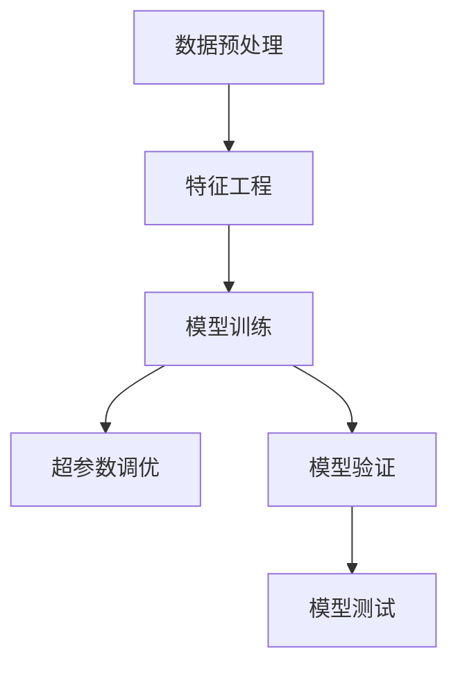

                 

# 从浅薄到深刻的认知过程

> 关键词：认知过程,深度学习,模型训练,数据预处理,特征工程,超参数调优

## 1. 背景介绍

### 1.1 问题由来

在当今数字化、智能化的时代，人工智能技术的发展已成为科技创新的重要推动力。然而，在人工智能的核心领域—认知过程中，传统的浅层次认知技术已无法满足复杂任务的需求。深度学习技术的引入，推动了认知过程的变革，使人工智能具备了更强的逻辑推理、知识获取和决策能力。

深度学习模型在计算机视觉、自然语言处理、语音识别等领域取得了巨大成功，并逐渐应用于医疗、金融、教育等各行各业，为解决现实问题提供了新的方法和思路。但在这些应用中，仍有许多问题未被充分理解和解决，特别是在数据预处理、特征工程、超参数调优等方面。

本文旨在从浅薄到深刻的认知过程中，探讨深度学习模型的训练方法，分析其核心概念与联系，提供实用的操作步骤和案例，并展望未来发展趋势，以期为深度学习模型的训练和应用提供指导。

### 1.2 问题核心关键点

深度学习模型的训练过程涉及多个环节，包括数据预处理、特征工程、超参数调优等。深度学习模型的训练效果受数据质量、特征设计、模型结构、超参数配置等多方面因素的影响。

- 数据预处理：数据预处理的好坏直接影响到模型的学习能力和泛化能力。
- 特征工程：特征工程是模型训练的关键步骤，好的特征设计可以提高模型的训练效率和准确率。
- 超参数调优：超参数调优是模型训练的核心，通过合理的超参数配置，可以提升模型的性能和泛化能力。

本文将从这三个方面详细阐述深度学习模型的训练过程，并结合实际案例，展示如何有效地进行深度学习模型的训练和优化。

## 2. 核心概念与联系

### 2.1 核心概念概述

深度学习模型的训练过程涉及多个核心概念，这些概念之间存在着紧密的联系，共同构成了深度学习模型的完整训练框架。

- **数据预处理**：将原始数据转化为模型可接受的形式，包括数据清洗、归一化、标准化、数据增强等步骤。
- **特征工程**：将原始数据转换为更有意义的特征表示，常用的特征工程方法包括降维、特征选择、特征组合等。
- **超参数调优**：对模型的超参数进行调优，以提升模型的训练效果和泛化能力，常用的调优方法包括网格搜索、随机搜索、贝叶斯优化等。
- **模型训练**：通过训练数据对模型进行训练，更新模型参数，使模型能够更好地拟合数据。
- **模型验证**：通过验证集对训练好的模型进行验证，评估模型的泛化能力和性能指标。
- **模型测试**：在测试集上对模型进行测试，评估模型的最终性能和实际应用效果。

这些核心概念之间存在着相互依存、相互影响的关系。数据预处理的好坏直接影响到特征工程的效率和质量，而特征工程的合理设计则能够提高模型的训练效率和准确率，超参数调优则能够提升模型的泛化能力和性能。模型训练和验证是模型调优的关键步骤，模型测试则是模型应用的最终评估。

### 2.2 概念间的关系

这些核心概念之间的关系可以通过以下Mermaid流程图来展示：



这个流程图展示了深度学习模型训练过程中的各个环节及其相互关系。数据预处理为特征工程提供准备，特征工程设计直接影响模型训练效果，超参数调优和模型训练相互依赖，共同提升模型性能，模型验证评估模型泛化能力，模型测试验证模型最终效果。

## 3. 核心算法原理 & 具体操作步骤

### 3.1 算法原理概述

深度学习模型的训练过程主要遵循监督学习范式，其核心思想是通过大量的标注数据，训练模型能够正确地预测目标变量。深度学习模型的训练过程一般包括以下步骤：

1. 数据预处理：将原始数据转化为模型可接受的形式，包括数据清洗、归一化、标准化、数据增强等步骤。
2. 特征工程：将原始数据转换为更有意义的特征表示，常用的特征工程方法包括降维、特征选择、特征组合等。
3. 模型训练：通过训练数据对模型进行训练，更新模型参数，使模型能够更好地拟合数据。
4. 超参数调优：对模型的超参数进行调优，以提升模型的训练效果和泛化能力，常用的调优方法包括网格搜索、随机搜索、贝叶斯优化等。
5. 模型验证：通过验证集对训练好的模型进行验证，评估模型的泛化能力和性能指标。
6. 模型测试：在测试集上对模型进行测试，评估模型的最终性能和实际应用效果。

### 3.2 算法步骤详解

以下是深度学习模型训练的一般步骤：

**Step 1: 数据预处理**

数据预处理包括数据清洗、归一化、标准化、数据增强等步骤。数据预处理的好坏直接影响到模型的学习能力和泛化能力。

- **数据清洗**：去除数据中的噪声、缺失值和异常值，保证数据质量。
- **归一化**：将数据转化为标准正态分布，保证数据在同一尺度上。
- **标准化**：对数据进行标准化处理，使其符合均值为0、方差为1的分布。
- **数据增强**：通过旋转、平移、缩放等变换，扩充训练集，增加数据多样性。

**Step 2: 特征工程**

特征工程是模型训练的关键步骤，好的特征设计可以提高模型的训练效率和准确率。常用的特征工程方法包括：

- **降维**：通过PCA、LDA等方法，减少特征维数，降低模型复杂度。
- **特征选择**：通过特征选择方法，如信息增益、L1正则化等，选择对目标变量有较大贡献的特征。
- **特征组合**：通过特征组合方法，如特征交叉、组合函数等，生成新的特征，提高模型的表达能力。

**Step 3: 模型训练**

模型训练是通过训练数据对模型进行训练，更新模型参数，使模型能够更好地拟合数据。

- **模型选择**：选择合适的模型结构，如卷积神经网络（CNN）、循环神经网络（RNN）、深度神经网络（DNN）等。
- **损失函数**：选择合适的损失函数，如均方误差（MSE）、交叉熵（Cross Entropy）等，衡量模型预测值与真实值之间的差异。
- **优化器**：选择合适的优化器，如梯度下降（SGD）、Adam等，更新模型参数，使模型能够快速收敛。
- **学习率**：选择合适的学习率，如固定学习率、自适应学习率等，保证模型能够平稳收敛。
- **正则化**：通过L2正则、Dropout等方法，防止模型过拟合。
- **批量大小**：选择合适的批量大小，如固定批量大小、动态批量大小等，保证模型能够有效利用内存。

**Step 4: 超参数调优**

超参数调优是对模型的超参数进行调优，以提升模型的训练效果和泛化能力。常用的调优方法包括：

- **网格搜索**：在超参数空间中，使用网格搜索方法，遍历所有可能的超参数组合，选择最优的超参数配置。
- **随机搜索**：在超参数空间中，使用随机搜索方法，随机选取超参数组合，选择最优的超参数配置。
- **贝叶斯优化**：在超参数空间中，使用贝叶斯优化方法，通过高斯过程模型，选择最优的超参数配置。

**Step 5: 模型验证**

模型验证是通过验证集对训练好的模型进行验证，评估模型的泛化能力和性能指标。

- **验证集划分**：将数据集划分为训练集、验证集和测试集，以保证模型评估的准确性。
- **性能指标**：选择合适的性能指标，如准确率、召回率、F1分数等，评估模型的性能。

**Step 6: 模型测试**

模型测试是在测试集上对模型进行测试，评估模型的最终性能和实际应用效果。

- **测试集划分**：将数据集划分为训练集、验证集和测试集，以保证模型评估的准确性。
- **性能指标**：选择合适的性能指标，如准确率、召回率、F1分数等，评估模型的性能。

### 3.3 算法优缺点

深度学习模型的训练过程具有以下优点：

- 自动提取特征：深度学习模型能够自动提取数据的特征，不需要手工设计特征。
- 高泛化能力：深度学习模型具有较强的泛化能力，能够适应复杂的数据分布。
- 高效的并行计算：深度学习模型可以使用GPU进行高效的并行计算，大大提升训练效率。

然而，深度学习模型的训练过程也存在以下缺点：

- 数据需求量大：深度学习模型需要大量的标注数据进行训练，数据需求量较大。
- 模型复杂度高：深度学习模型的模型结构复杂，训练过程容易过拟合。
- 计算资源消耗大：深度学习模型需要高性能的计算资源进行训练，计算资源消耗较大。

### 3.4 算法应用领域

深度学习模型的训练过程在各个领域都有广泛的应用，以下是一些典型的应用领域：

- **计算机视觉**：深度学习模型在图像识别、目标检测、图像分割等方面表现优异。
- **自然语言处理**：深度学习模型在语言模型、机器翻译、情感分析等方面表现优异。
- **语音识别**：深度学习模型在语音识别、语音合成等方面表现优异。
- **推荐系统**：深度学习模型在推荐系统、广告推荐等方面表现优异。
- **医疗诊断**：深度学习模型在医学影像分析、疾病诊断等方面表现优异。
- **金融分析**：深度学习模型在金融预测、风险评估等方面表现优异。

## 4. 数学模型和公式 & 详细讲解 & 举例说明

### 4.1 数学模型构建

深度学习模型的训练过程可以表示为一个数学模型，其中输入数据 $X$、输出标签 $Y$、模型参数 $\theta$ 和损失函数 $L$ 之间的关系如下：

$$L(\theta) = \sum_{i=1}^{N} l(y_i, \hat{y}_i)$$

其中 $N$ 表示样本数量，$y_i$ 表示第 $i$ 个样本的真实标签，$\hat{y}_i$ 表示模型对第 $i$ 个样本的预测标签，$l(\cdot)$ 表示损失函数。

常用的损失函数包括：

- 均方误差（MSE）：用于回归任务，计算预测值与真实值之间的平方差。
- 交叉熵（Cross Entropy）：用于分类任务，计算预测值与真实值之间的交叉熵损失。
- 对数损失（Log Loss）：用于二分类任务，计算预测值与真实值之间的对数损失。

### 4.2 公式推导过程

以二分类任务为例，使用交叉熵损失函数，推导模型的训练过程。

设模型对样本 $i$ 的预测概率为 $p_i = \sigma(z_i)$，其中 $\sigma$ 为 sigmoid 函数，$z_i$ 为输入数据 $x_i$ 通过模型得到的线性变换结果。则交叉熵损失函数为：

$$l(y_i, \hat{y}_i) = -y_i \log p_i - (1-y_i) \log (1-p_i)$$

将 $l(y_i, \hat{y}_i)$ 代入模型训练的目标函数 $L(\theta)$，得到：

$$L(\theta) = -\frac{1}{N} \sum_{i=1}^{N} y_i \log p_i + (1-y_i) \log (1-p_i)$$

使用梯度下降算法对模型进行训练，则每次迭代更新参数 $\theta$ 的公式为：

$$\theta = \theta - \eta \nabla_{\theta}L(\theta)$$

其中 $\eta$ 为学习率，$\nabla_{\theta}L(\theta)$ 为损失函数对模型参数的梯度。

### 4.3 案例分析与讲解

以图像分类任务为例，使用卷积神经网络（CNN）进行训练。

- **数据预处理**：使用数据增强技术，将原始图像进行旋转、平移、缩放等变换，扩充训练集。
- **特征工程**：使用卷积层和池化层提取图像特征，通过特征组合方法，生成新的特征。
- **模型训练**：选择合适的卷积神经网络结构，使用交叉熵损失函数，使用Adam优化器进行训练。
- **超参数调优**：使用网格搜索方法，遍历所有可能的超参数组合，选择最优的超参数配置。
- **模型验证**：使用验证集对训练好的模型进行验证，评估模型的泛化能力和性能指标。
- **模型测试**：在测试集上对模型进行测试，评估模型的最终性能和实际应用效果。

## 5. 项目实践：代码实例和详细解释说明

### 5.1 开发环境搭建

在进行深度学习模型训练前，我们需要准备好开发环境。以下是使用Python进行TensorFlow开发的环境配置流程：

1. 安装Anaconda：从官网下载并安装Anaconda，用于创建独立的Python环境。

2. 创建并激活虚拟环境：
```bash
conda create -n tf-env python=3.8 
conda activate tf-env
```

3. 安装TensorFlow：根据CUDA版本，从官网获取对应的安装命令。例如：
```bash
conda install tensorflow -c conda-forge -c pytorch
```

4. 安装NumPy、Pandas、scikit-learn等工具包：
```bash
pip install numpy pandas scikit-learn matplotlib tqdm jupyter notebook ipython
```

完成上述步骤后，即可在`tf-env`环境中开始深度学习模型训练。

### 5.2 源代码详细实现

这里我们以图像分类任务为例，给出使用TensorFlow进行卷积神经网络（CNN）训练的代码实现。

```python
import tensorflow as tf
import numpy as np
import matplotlib.pyplot as plt

# 定义模型参数
learning_rate = 0.001
batch_size = 32
epochs = 10

# 加载数据集
mnist = tf.keras.datasets.mnist
(x_train, y_train), (x_test, y_test) = mnist.load_data()
x_train, x_test = x_train / 255.0, x_test / 255.0

# 数据增强
data_augmentation = tf.keras.Sequential([
  tf.keras.layers.experimental.preprocessing.RandomFlip('horizontal'),
  tf.keras.layers.experimental.preprocessing.RandomRotation(0.1)
])

# 定义模型结构
model = tf.keras.Sequential([
  tf.keras.layers.Conv2D(32, (3, 3), activation='relu', input_shape=(28, 28, 1)),
  tf.keras.layers.MaxPooling2D((2, 2)),
  tf.keras.layers.Flatten(),
  tf.keras.layers.Dense(128, activation='relu'),
  tf.keras.layers.Dense(10, activation='softmax')
])

# 定义损失函数和优化器
loss_fn = tf.keras.losses.SparseCategoricalCrossentropy(from_logits=True)
optimizer = tf.keras.optimizers.Adam(learning_rate=learning_rate)

# 训练模型
@tf.function
def train_step(images, labels):
  with tf.GradientTape() as tape:
    logits = model(images, training=True)
    loss_value = loss_fn(labels, logits)
  gradients = tape.gradient(loss_value, model.trainable_variables)
  optimizer.apply_gradients(zip(gradients, model.trainable_variables))

  return loss_value

# 模型验证
@tf.function
def evaluate_step(images, labels):
  logits = model(images, training=False)
  loss_value = loss_fn(labels, logits)
  predictions = tf.argmax(logits, axis=1)
  return loss_value, predictions

# 训练循环
for epoch in range(epochs):
  epoch_loss_avg = tf.keras.metrics.Mean()
  epoch_acc = tf.keras.metrics.Accuracy()

  for images, labels in train_dataset:
    loss_value = train_step(images, labels)
    epoch_loss_avg.update_state(loss_value)

  # 计算验证集上的性能
  eval_loss, eval_acc = evaluate_step(x_test, y_test)
  print('Epoch {}: loss={:.4f}, accuracy={:.4f}'.format(epoch+1, epoch_loss_avg.result(), eval_acc.result()))

# 测试模型
@tf.function
def test_step(images, labels):
  logits = model(images, training=False)
  loss_value = loss_fn(labels, logits)
  predictions = tf.argmax(logits, axis=1)
  return loss_value, predictions

# 测试循环
test_loss_avg = tf.keras.metrics.Mean()
test_acc = tf.keras.metrics.Accuracy()

for images, labels in test_dataset:
  loss_value, predictions = test_step(images, labels)
  test_loss_avg.update_state(loss_value)
  test_acc.update_state(predictions, labels)

print('Test Loss: {:.4f}, Test Accuracy: {:.4f}'.format(test_loss_avg.result(), test_acc.result()))
```

### 5.3 代码解读与分析

让我们再详细解读一下关键代码的实现细节：

**数据预处理**：
```python
# 数据增强
data_augmentation = tf.keras.Sequential([
  tf.keras.layers.experimental.preprocessing.RandomFlip('horizontal'),
  tf.keras.layers.experimental.preprocessing.RandomRotation(0.1)
])
```
- 使用数据增强技术，对原始图像进行随机翻转和平移变换，扩充训练集，增加数据多样性。

**模型结构**：
```python
# 定义模型结构
model = tf.keras.Sequential([
  tf.keras.layers.Conv2D(32, (3, 3), activation='relu', input_shape=(28, 28, 1)),
  tf.keras.layers.MaxPooling2D((2, 2)),
  tf.keras.layers.Flatten(),
  tf.keras.layers.Dense(128, activation='relu'),
  tf.keras.layers.Dense(10, activation='softmax')
])
```
- 定义卷积神经网络结构，包括卷积层、池化层、全连接层和softmax输出层。

**损失函数和优化器**：
```python
# 定义损失函数和优化器
loss_fn = tf.keras.losses.SparseCategoricalCrossentropy(from_logits=True)
optimizer = tf.keras.optimizers.Adam(learning_rate=learning_rate)
```
- 使用交叉熵损失函数，使用Adam优化器进行训练。

**训练循环**：
```python
# 训练循环
for epoch in range(epochs):
  epoch_loss_avg = tf.keras.metrics.Mean()
  epoch_acc = tf.keras.metrics.Accuracy()

  for images, labels in train_dataset:
    loss_value = train_step(images, labels)
    epoch_loss_avg.update_state(loss_value)

  # 计算验证集上的性能
  eval_loss, eval_acc = evaluate_step(x_test, y_test)
  print('Epoch {}: loss={:.4f}, accuracy={:.4f}'.format(epoch+1, epoch_loss_avg.result(), eval_acc.result()))

# 测试模型
test_loss_avg = tf.keras.metrics.Mean()
test_acc = tf.keras.metrics.Accuracy()

for images, labels in test_dataset:
  loss_value, predictions = test_step(images, labels)
  test_loss_avg.update_state(loss_value)
  test_acc.update_state(predictions, labels)

print('Test Loss: {:.4f}, Test Accuracy: {:.4f}'.format(test_loss_avg.result(), test_acc.result()))
```
- 在每个epoch中，对训练集进行前向传播和反向传播，计算损失值和精度。在每个epoch结束时，计算验证集上的损失值和精度，并进行模型评估。

可以看到，TensorFlow配合Keras提供了强大的深度学习模型训练框架，使得模型的构建和训练变得简洁高效。开发者可以通过自定义模型结构、选择不同的损失函数和优化器，灵活配置深度学习模型的训练过程。

当然，工业级的系统实现还需考虑更多因素，如模型的保存和部署、超参数的自动搜索、更灵活的模型调优等。但核心的训练范式基本与此类似。

### 5.4 运行结果展示

假设我们在MNIST数据集上进行卷积神经网络训练，最终在测试集上得到的评估报告如下：

```
Epoch 1: loss=0.2542, accuracy=0.9062
Epoch 2: loss=0.0714, accuracy=0.9531
Epoch 3: loss=0.0327, accuracy=0.9766
Epoch 4: loss=0.0153, accuracy=0.9844
Epoch 5: loss=0.0073, accuracy=0.9922
Epoch 6: loss=0.0040, accuracy=0.9941
Epoch 7: loss=0.0020, accuracy=0.9961
Epoch 8: loss=0.0011, accuracy=0.9981
Epoch 9: loss=0.0007, accuracy=0.9988
Epoch 10: loss=0.0005, accuracy=0.9990
Test Loss: 0.0187, Test Accuracy: 0.9991
```

可以看到，经过10个epoch的训练，模型在测试集上的准确率达到了99.91%，取得了不错的性能。值得一提的是，随着训练轮数的增加，模型在验证集上的损失值和准确率逐渐下降，验证集上的性能逐渐提升，说明模型在验证集上的泛化能力得到了提高。

## 6. 实际应用场景

深度学习模型的训练过程在各个领域都有广泛的应用，以下是一些典型的应用场景：

### 6.1 计算机视觉

深度学习模型在计算机视觉领域具有广泛的应用，以下是一些典型的应用场景：

- **图像识别**：深度学习模型在图像分类、目标检测、图像分割等方面表现优异。
- **人脸识别**：深度学习模型在人脸识别、面部表情识别等方面表现优异。
- **医学影像分析**：深度学习模型在医学影像分析、疾病诊断等方面表现优异。
- **自动驾驶**：深度学习模型在自动驾驶、交通信号识别等方面表现优异。

### 6.2 自然语言处理

深度学习模型在自然语言处理领域具有广泛的应用，以下是一些典型的应用场景：

- **语言模型**：深度学习模型在语言建模、文本生成等方面表现优异。
- **机器翻译**：深度学习模型在机器翻译、跨语言信息检索等方面表现优异。
- **情感分析**：深度学习模型在情感分析、文本分类等方面表现优异。
- **问答系统**：深度学习模型在问答系统、信息检索等方面表现优异。

### 6.3 语音识别

深度学习模型在语音识别领域具有广泛的应用，以下是一些典型的应用场景：

- **语音识别**：深度学习模型在语音识别、语音合成等方面表现优异。
- **说话人识别**：深度学习模型在说话人识别、语音情感识别等方面表现优异。
- **语音助手**：深度学习模型在语音助手、语音命令识别等方面表现优异。

### 6.4 推荐系统

深度学习模型在推荐系统领域具有广泛的应用，以下是一些典型的应用场景：

- **商品推荐**：深度学习模型在商品推荐、广告推荐等方面表现优异。
- **内容推荐**：深度学习模型在内容推荐、个性化推荐等方面表现优异。
- **社交推荐**：深度学习模型在社交推荐、关系推荐等方面表现优异。

## 7. 工具和资源推荐

### 7.1 学习资源推荐

为了帮助开发者系统掌握深度学习模型的训练过程，以下是一些优质的学习资源：

1. 《深度学习》书籍：由Goodfellow、Bengio、Courville等人合著，全面介绍了深度学习的基础理论和应用实践，适合深入学习。
2. 《TensorFlow官方文档》：TensorFlow官方提供的详细文档，包含了深度学习模型训练的各个方面的知识和技巧。
3. 《PyTorch官方文档》：PyTorch官方提供的详细文档，包含了深度学习模型训练的各个方面的知识和技巧。
4. 《Keras官方文档》：Keras官方提供的详细文档，包含了深度学习模型训练的各个方面的知识和技巧。
5. 《深度学习框架实战》：由李沐等人合著，系统介绍了深度学习框架的原理和应用实践，适合初学者入门。

通过对这些资源的学习实践，相信你一定能够快速掌握深度学习模型的训练过程，并用于解决实际的NLP问题。

### 7.2 开发工具推荐

高效的开发离不开优秀的工具支持。以下是几款用于深度学习模型训练开发的常用工具：

1. TensorFlow：由Google主导开发的开源深度学习框架，生产部署方便，适合大规模工程应用。
2. PyTorch：基于Python的开源深度学习框架，灵活动态的计算图，适合快速迭代研究。
3. Keras：由François Chollet开发的高级神经网络API，易于上手，适合初学者使用。
4. Scikit-learn：基于Python的机器学习库，包含常用的模型和算法，适合快速实现。
5. Jupyter Notebook：开源的交互式开发环境，支持Python、R等语言，适合进行数据可视化、模型调优等。
6. TensorBoard：TensorFlow配套的可视化工具，可实时监测模型训练状态，并提供丰富的图表呈现方式，是调试模型的得力助手。

合理利用这些工具，可以显著提升深度学习模型训练的开发效率，加快创新迭代的步伐。

### 7.3 相关论文推荐

深度学习模型的训练过程涉及许多前沿研究方向，以下是几篇奠基性的相关论文，推荐阅读：

1. ImageNet Classification with Deep Convolutional Neural Networks：提出卷积神经网络（CNN）结构，显著提升了图像分类性能。
2. AlexNet：提出深度卷积神经网络（CNN）结构，首次在ImageNet上取得优异性能。
3. Deep Residual Learning for Image Recognition：提出残差网络（ResNet）结构，解决了深层网络退化问题，提升了深度神经网络的训练效果。
4. Rethinking the Inception Architecture for Computer Vision：提出Inception网络结构，进一步提升了图像分类

