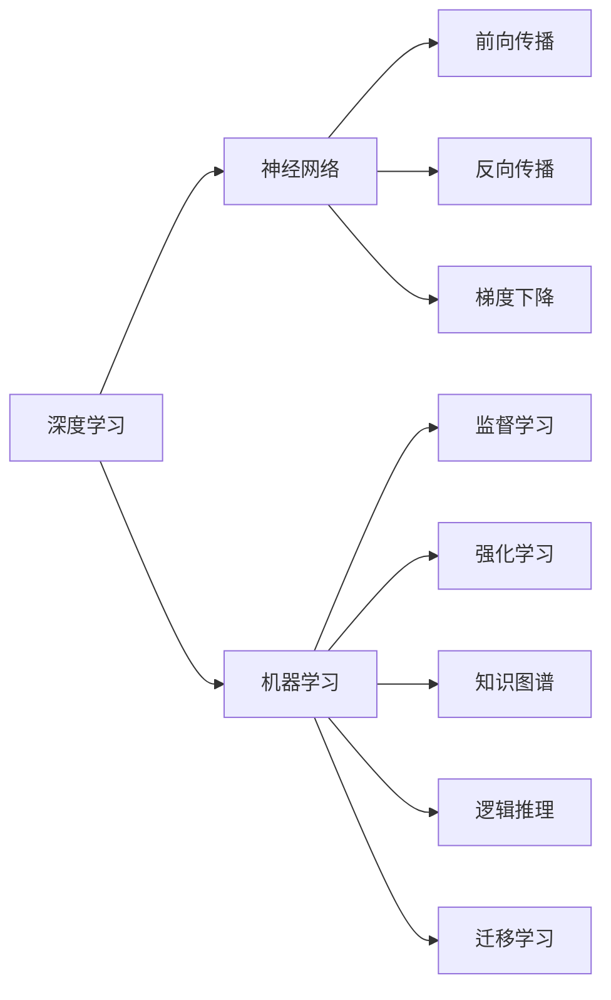
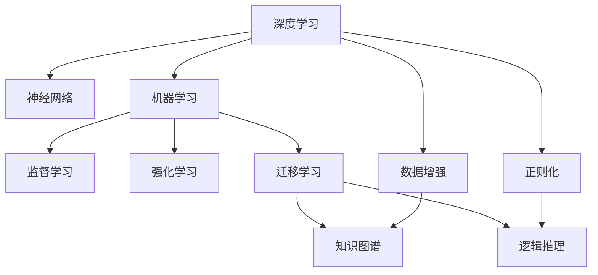
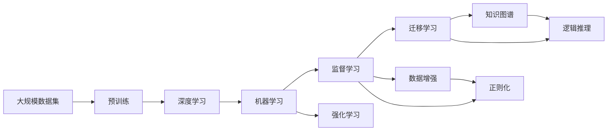

                 

# 从简单到深刻的认知发展

> 关键词：认知发展, 人工智能, 算法优化, 数据增强, 深度学习, 机器学习

## 1. 背景介绍

### 1.1 问题由来

认知发展一直是心理学和人工智能领域研究的热点话题。它涉及人类如何理解、学习和应用知识，以及在复杂环境中进行决策和推理的过程。随着深度学习和大数据技术的迅猛发展，科学家和工程师们试图通过机器学习和人工智能技术来模拟和增强人类的认知能力。

人工智能的认知发展可以分为多个层次，从简单的模式识别到复杂的逻辑推理，最终目标是构建能够理解自然语言、解决复杂问题、甚至具备自我意识的智能系统。然而，当前的AI系统尽管在某些方面已经取得了显著进步，但仍远未达到人类的认知水平，存在诸多局限性。

### 1.2 问题核心关键点

为了深入探讨认知发展的规律，我们需要重点关注以下几个关键问题：

- **模式识别**：如何识别和理解输入数据的模式和规律？
- **知识获取**：如何从数据中提取和获取有用的知识，以便进行后续的推理和决策？
- **推理能力**：如何将已有的知识应用到新的问题上，进行逻辑推理和判断？
- **学习效率**：如何高效地学习新的知识和技能？
- **泛化能力**：如何保证模型在未见过的数据上也能良好表现？

这些问题的答案对于理解人工智能的认知发展至关重要，但同时也非常复杂和具有挑战性。本文章将深入探讨这些问题的算法原理和操作步骤，并给出相应的实践建议。

## 2. 核心概念与联系

### 2.1 核心概念概述

在进行深度学习领域的认知发展研究时，我们需要考虑以下几个核心概念：

- **深度学习**：一种通过多层神经网络学习数据表示的机器学习方法，能够自动发现数据中的模式和规律。
- **机器学习**：一种通过数据训练模型，使其能够进行预测、分类、回归等任务的算法。
- **知识图谱**：一种结构化的知识表示方法，用于组织和关联大量的语义信息。
- **逻辑推理**：一种基于形式化逻辑的推理方法，能够从已知条件推导出新的结论。
- **迁移学习**：一种将从一领域学到的知识迁移到另一领域的应用方法，提高新领域的模型性能。

这些概念之间的联系可以通过以下Mermaid流程图来展示：



这个流程图展示了深度学习与机器学习之间的关系，以及它们如何通过不同的学习方式和推理方法，从数据中提取和应用知识。

### 2.2 概念间的关系

这些核心概念之间的关系如图：



这个综合流程图展示了深度学习如何通过不同的学习方式和推理方法，从数据中提取和应用知识，以及这些知识如何在不同领域间迁移和应用。

### 2.3 核心概念的整体架构

最后，我们用一个综合的流程图来展示这些核心概念在大规模认知发展应用中的整体架构：



这个综合流程图展示了从大规模数据集预训练，到深度学习模型的构建和应用，再到机器学习和迁移学习的全过程，以及如何通过知识图谱和逻辑推理来增强模型的认知能力。

## 3. 核心算法原理 & 具体操作步骤

### 3.1 算法原理概述

认知发展的核心算法原理主要包括：

- **数据增强**：通过变换、回译等技术，扩充训练集的多样性，增强模型的泛化能力。
- **正则化**：使用L2正则、Dropout等技术，防止模型过拟合，提高模型的稳定性和鲁棒性。
- **迁移学习**：通过预训练模型的知识，加速下游任务的学习，提高模型在新领域上的性能。
- **逻辑推理**：利用形式化逻辑和推理算法，从已知条件推导出新的结论，增强模型的推理能力。
- **知识图谱**：通过结构化的语义表示，组织和关联大量的知识信息，提高模型的知识获取和应用能力。

这些算法原理在大规模认知发展应用中相互配合，形成了一个完整的认知发展框架。

### 3.2 算法步骤详解

大规模认知发展应用的算法步骤包括以下几个关键步骤：

**Step 1: 准备预训练模型和数据集**

- 选择合适的深度学习模型和机器学习算法作为初始化参数，如卷积神经网络(CNN)、循环神经网络(RNN)、Transformer等。
- 收集大规模数据集，并将其划分为训练集、验证集和测试集。

**Step 2: 进行预训练**

- 在大规模数据集上进行预训练，学习数据的模式和规律。
- 采用监督学习、无监督学习或半监督学习的方式，优化模型参数。
- 利用数据增强和正则化技术，提高模型的泛化能力和鲁棒性。

**Step 3: 进行微调**

- 将预训练模型迁移到下游任务上，进行微调。
- 根据任务需求，设计合适的输出层和损失函数。
- 采用梯度下降等优化算法，更新模型参数。
- 在验证集上评估模型性能，避免过拟合。

**Step 4: 应用知识图谱**

- 构建知识图谱，用于存储和关联大量的语义信息。
- 将知识图谱与模型结合，提高模型的知识获取和推理能力。

**Step 5: 引入逻辑推理**

- 采用形式化逻辑和推理算法，增强模型的推理能力。
- 根据任务需求，设计合适的推理规则和逻辑结构。

**Step 6: 持续学习**

- 不断收集新的数据，更新模型参数，保持模型的时效性和适应性。
- 采用增量学习等技术，快速适应数据分布的变化。

通过以上步骤，大规模认知发展应用可以构建具有强大认知能力的智能系统，并在各个领域中得到广泛应用。

### 3.3 算法优缺点

大规模认知发展应用的优势在于：

- 可以处理大规模数据集，学习丰富的知识。
- 可以通过迁移学习，加速下游任务的学习。
- 可以引入知识图谱和逻辑推理，提高模型的推理能力。

然而，它也存在一些缺点：

- 需要大量的标注数据，成本较高。
- 模型复杂度高，需要强大的计算资源。
- 知识图谱的构建和维护需要大量的专家知识。
- 逻辑推理的复杂度高，需要大量的时间和精力进行设计和实现。

## 4. 数学模型和公式 & 详细讲解

### 4.1 数学模型构建

认知发展的数学模型主要包括以下几个组成部分：

- **数据集**：包含大量的输入和输出数据，用于训练模型。
- **损失函数**：用于衡量模型预测结果与真实结果之间的差异。
- **优化算法**：用于更新模型参数，最小化损失函数。
- **正则化项**：用于防止模型过拟合，提高模型的泛化能力。
- **知识图谱**：用于组织和关联大量的语义信息。
- **逻辑推理规则**：用于从已知条件推导出新的结论。

### 4.2 公式推导过程

下面以卷积神经网络(CNN)为例，展示其数学模型和公式推导过程：

假设输入数据为 $x \in \mathbb{R}^d$，输出数据为 $y \in \mathbb{R}^c$，卷积神经网络的数学模型可以表示为：

$$
y = \text{CNN}(x; \theta)
$$

其中 $\theta$ 为卷积神经网络的参数。

卷积神经网络的损失函数可以采用交叉熵损失函数：

$$
\mathcal{L}(y, \hat{y}) = -\frac{1}{N} \sum_{i=1}^N \sum_{j=1}^c y_{ij} \log \hat{y}_{ij}
$$

其中 $N$ 为样本数，$y_{ij}$ 为第 $i$ 个样本在类别 $j$ 上的真实标签，$\hat{y}_{ij}$ 为模型预测的概率。

卷积神经网络的优化算法可以采用梯度下降算法：

$$
\theta \leftarrow \theta - \eta \nabla_{\theta} \mathcal{L}(y, \hat{y})
$$

其中 $\eta$ 为学习率，$\nabla_{\theta} \mathcal{L}(y, \hat{y})$ 为损失函数对参数 $\theta$ 的梯度。

正则化项可以采用L2正则化：

$$
\mathcal{L}_{\text{regular}}(\theta) = \lambda \sum_{k=1}^n \|\theta_k\|^2
$$

其中 $\lambda$ 为正则化系数，$n$ 为参数数量，$\|\theta_k\|$ 为第 $k$ 个参数的范数。

### 4.3 案例分析与讲解

以图像分类任务为例，展示如何使用卷积神经网络进行认知发展的案例分析：

假设数据集包含大量图像和对应的类别标签，可以使用卷积神经网络进行分类。具体步骤如下：

1. **数据预处理**：将图像转换为固定大小的张量，并进行归一化处理。
2. **模型构建**：使用卷积层、池化层、全连接层等构建卷积神经网络。
3. **损失函数定义**：采用交叉熵损失函数。
4. **优化算法选择**：使用Adam优化算法。
5. **正则化应用**：加入L2正则化项。
6. **训练过程**：通过训练集进行训练，在验证集上评估性能。
7. **模型应用**：在测试集上测试模型的分类效果。

## 5. 项目实践：代码实例和详细解释说明

### 5.1 开发环境搭建

进行大规模认知发展应用的项目实践，需要以下开发环境：

1. 安装Python和TensorFlow。
2. 安装相关的深度学习库，如Keras、PyTorch等。
3. 收集大规模数据集，并进行数据预处理。
4. 构建知识图谱，并将其与模型结合。

### 5.2 源代码详细实现

以下是一个使用TensorFlow进行卷积神经网络图像分类任务的示例代码：

```python
import tensorflow as tf
from tensorflow.keras import layers, models

# 加载数据集
(x_train, y_train), (x_test, y_test) = tf.keras.datasets.cifar10.load_data()

# 数据预处理
x_train = x_train.astype('float32') / 255
x_test = x_test.astype('float32') / 255

# 构建模型
model = models.Sequential()
model.add(layers.Conv2D(32, (3, 3), activation='relu', input_shape=(32, 32, 3)))
model.add(layers.MaxPooling2D((2, 2)))
model.add(layers.Conv2D(64, (3, 3), activation='relu'))
model.add(layers.MaxPooling2D((2, 2)))
model.add(layers.Conv2D(64, (3, 3), activation='relu'))
model.add(layers.Flatten())
model.add(layers.Dense(64, activation='relu'))
model.add(layers.Dense(10, activation='softmax'))

# 编译模型
model.compile(optimizer='adam', loss='sparse_categorical_crossentropy', metrics=['accuracy'])

# 训练模型
model.fit(x_train, y_train, epochs=10, validation_data=(x_test, y_test))

# 评估模型
model.evaluate(x_test, y_test)
```

### 5.3 代码解读与分析

以上代码展示了使用TensorFlow构建卷积神经网络进行图像分类任务的实现。具体步骤如下：

1. **数据加载**：使用Keras的数据集加载函数加载CIFAR-10数据集。
2. **数据预处理**：将像素值归一化到0-1之间。
3. **模型构建**：使用卷积层、池化层和全连接层构建卷积神经网络。
4. **模型编译**：选择Adam优化算法，并定义交叉熵损失函数。
5. **模型训练**：使用训练集进行训练，在验证集上评估性能。
6. **模型评估**：在测试集上测试模型的分类效果。

## 6. 实际应用场景

### 6.1 医疗诊断

大规模认知发展应用在医疗诊断领域有着广泛的应用前景。通过深度学习技术和知识图谱的结合，可以构建具有强大认知能力的医疗诊断系统，提高诊断的准确性和效率。

具体而言，可以构建一个医疗知识图谱，包含疾病的定义、症状、治疗方法等信息。然后将预训练的深度学习模型与知识图谱结合，对患者的病历数据进行推理和诊断。

### 6.2 金融风险评估

大规模认知发展应用在金融风险评估领域同样有着广泛的应用前景。通过深度学习技术和逻辑推理的结合，可以构建具有强大认知能力的金融风险评估系统，预测和评估金融风险。

具体而言，可以构建一个金融知识图谱，包含金融产品的定义、市场行情、历史数据等信息。然后将预训练的深度学习模型与知识图谱结合，对金融数据进行推理和评估，预测金融市场的变化趋势和风险。

### 6.3 智能客服

大规模认知发展应用在智能客服领域也有着广泛的应用前景。通过深度学习技术和知识图谱的结合，可以构建具有强大认知能力的智能客服系统，提高客户服务的质量和效率。

具体而言，可以构建一个客户服务知识图谱，包含常见问题的定义、解决方案、业务规则等信息。然后将预训练的深度学习模型与知识图谱结合，对客户的问题进行推理和回答，提供个性化的服务。

## 7. 工具和资源推荐

### 7.1 学习资源推荐

为了帮助开发者系统掌握大规模认知发展应用的算法原理和实践技巧，这里推荐一些优质的学习资源：

1. 《深度学习入门》：一本系统介绍深度学习基础和应用的书籍，适合初学者阅读。
2. 《TensorFlow实战》：一本介绍TensorFlow深度学习框架的书籍，包含丰富的代码实例和案例分析。
3. 《自然语言处理综论》：一本介绍自然语言处理基本概念和技术的书籍，包含大量的案例和代码。
4. 《人工智能基础》：斯坦福大学的公开课程，涵盖人工智能的基本概念和算法。
5. 《认知计算》：一本介绍认知计算和人工智能前沿技术的书籍，适合深入研究。

通过对这些资源的学习实践，相信你一定能够快速掌握大规模认知发展应用的精髓，并用于解决实际的认知问题。

### 7.2 开发工具推荐

高效的开发离不开优秀的工具支持。以下是几款用于大规模认知发展应用开发的常用工具：

1. TensorFlow：由Google主导开发的深度学习框架，生产部署方便，适合大规模工程应用。
2. PyTorch：基于Python的开源深度学习框架，灵活动态的计算图，适合快速迭代研究。
3. Keras：一个高层次的深度学习API，能够快速构建和训练深度学习模型。
4. OpenAI GPT：由OpenAI开发的语言模型，具备强大的语言理解和生成能力。
5. GPT-3：目前最先进的语言模型，具备广泛的语义理解和推理能力。

合理利用这些工具，可以显著提升大规模认知发展应用开发的效率，加快创新迭代的步伐。

### 7.3 相关论文推荐

大规模认知发展应用的研究源于学界的持续研究。以下是几篇奠基性的相关论文，推荐阅读：

1. Attention is All You Need：提出Transformer结构，开启了深度学习领域的预训练大模型时代。
2. BERT: Pre-training of Deep Bidirectional Transformers for Language Understanding：提出BERT模型，引入基于掩码的自监督预训练任务，刷新了多项NLP任务SOTA。
3. Deep Residual Learning for Image Recognition：提出深度残差网络，显著提升了深度学习模型的性能。
4. Knowledge-Graph-Aided Decision Support System：提出知识图谱辅助决策支持系统，利用知识图谱提高决策的准确性和效率。
5. Cognitive Computing with Deep Learning：介绍认知计算和深度学习结合的研究进展，涵盖大量案例和算法。

这些论文代表了大规模认知发展应用的发展脉络。通过学习这些前沿成果，可以帮助研究者把握学科前进方向，激发更多的创新灵感。

除上述资源外，还有一些值得关注的前沿资源，帮助开发者紧跟大规模认知发展应用的最新进展，例如：

1. arXiv论文预印本：人工智能领域最新研究成果的发布平台，包括大量尚未发表的前沿工作，学习前沿技术的必读资源。
2. 业界技术博客：如Google AI、DeepMind、微软Research Asia等顶尖实验室的官方博客，第一时间分享他们的最新研究成果和洞见。
3. 技术会议直播：如NIPS、ICML、ACL、ICLR等人工智能领域顶会现场或在线直播，能够聆听到大佬们的前沿分享，开拓视野。
4. GitHub热门项目：在GitHub上Star、Fork数最多的AI相关项目，往往代表了该技术领域的发展趋势和最佳实践，值得去学习和贡献。
5. 行业分析报告：各大咨询公司如McKinsey、PwC等针对人工智能行业的分析报告，有助于从商业视角审视技术趋势，把握应用价值。

总之，对于大规模认知发展应用的学习和实践，需要开发者保持开放的心态和持续学习的意愿。多关注前沿资讯，多动手实践，多思考总结，必将收获满满的成长收益。

## 8. 总结：未来发展趋势与挑战

### 8.1 研究成果总结

大规模认知发展应用的研究成果主要包括以下几个方面：

- **深度学习模型的优化**：提出了多种深度学习模型和优化算法，提高了模型的性能和效率。
- **知识图谱的构建和应用**：提出了多种知识图谱的构建方法和应用场景，提高了模型的知识获取和推理能力。
- **逻辑推理和形式化语言**：提出了多种逻辑推理和形式化语言的方法，提高了模型的推理能力。
- **数据增强和正则化**：提出了多种数据增强和正则化技术，提高了模型的泛化能力和鲁棒性。

### 8.2 未来发展趋势

展望未来，大规模认知发展应用将呈现以下几个发展趋势：

1. **模型规模的增大**：随着算力成本的下降和数据规模的扩张，深度学习模型的参数量还将持续增长。超大规模深度学习模型蕴含的丰富知识，有望支撑更加复杂多变的认知任务。
2. **认知推理能力的提升**：通过引入逻辑推理和形式化语言，增强模型的推理能力，使其具备更加全面的认知能力。
3. **多模态融合**：将视觉、听觉、文本等多种模态的信息融合，构建具有多模态认知能力的智能系统。
4. **个性化和自适应**：通过深度学习模型的自适应能力，实现个性化和自适应认知推理，适应不同的应用场景和需求。
5. **多领域应用的扩展**：将大规模认知发展应用扩展到更多领域，如医疗、金融、教育、制造等，推动人工智能在各个行业的普及和应用。

以上趋势凸显了大规模认知发展应用技术的广阔前景。这些方向的探索发展，必将进一步提升认知系统的性能和应用范围，为人类认知智能的进化带来深远影响。

### 8.3 面临的挑战

尽管大规模认知发展应用取得了诸多进展，但在迈向更加智能化、普适化应用的过程中，仍面临诸多挑战：

1. **数据获取和标注成本**：大规模认知发展应用需要大量的标注数据，成本较高。如何降低标注成本，利用无标注数据进行训练，是一个重要的问题。
2. **模型复杂度**：深度学习模型结构复杂，需要强大的计算资源。如何在保证性能的同时，简化模型结构，降低资源消耗，是一个重要的研究方向。
3. **知识图谱的构建和维护**：知识图谱的构建和维护需要大量的专家知识。如何自动构建和更新知识图谱，提高知识图谱的质量和实用性，是一个重要的研究方向。
4. **逻辑推理的复杂性**：逻辑推理的复杂度较高，需要大量的时间和精力进行设计和实现。如何简化逻辑推理过程，提高推理效率，是一个重要的研究方向。
5. **伦理和安全问题**：大规模认知发展应用可能带来伦理和安全问题，如隐私泄露、偏见和歧视等。如何设计和实现符合伦理和安全标准的认知系统，是一个重要的研究方向。

### 8.4 研究展望

为了解决大规模认知发展应用面临的挑战，未来的研究需要在以下几个方面寻求新的突破：

1. **无监督和半监督学习**：探索无监督和半监督学习的方法，利用无标注数据进行训练，降低标注成本，提高模型的泛化能力。
2. **模型压缩和加速**：开发更加高效和轻量级的深度学习模型，通过模型压缩和加速技术，降低资源消耗，提高推理效率。
3. **自动构建知识图谱**：探索自动构建和更新知识图谱的方法，利用自然语言处理和知识工程技术，提高知识图谱的质量和实用性。
4. **简化逻辑推理**：探索简化逻辑推理的方法，利用符号逻辑和神经网络结合的技术，提高推理效率，降低推理复杂度。
5. **伦理和安全保护**：设计和实现符合伦理和安全标准的认知系统，利用隐私保护和公平性算法，保障系统的隐私和安全。

这些研究方向将推动大规模认知发展应用技术向更加智能化、普适化、安全化的方向发展，为人类认知智能的进化带来深远影响。

## 9. 附录：常见问题与解答

**Q1：大规模认知发展应用是否适用于所有认知任务？**

A: 大规模认知发展应用在大多数认知任务上都能取得不错的效果，特别是对于数据量较小的任务。但对于一些特定领域的任务，如医疗、法律等，仅仅依靠通用语料预训练的模型可能难以很好地适应。此时需要在特定领域语料上进一步预训练，再进行微调，才能获得理想效果。此外，对于一些需要时效性、个性化很强的任务，如对话、推荐等，微调方法也需要针对性的改进优化。

**Q2：如何缓解大规模认知发展应用中的过拟合问题？**

A: 大规模认知发展应用中，过拟合是常见的问题。缓解过拟合的方法包括：

1. 数据增强：通过回译、近义替换等方式扩充训练集。
2. 正则化：使用L2正则、Dropout、Early Stopping等技术，防止模型过拟合。
3. 对抗训练：引入对抗样本，提高模型鲁棒性。
4. 参数高效微调：只调整少量参数(如Adapter、Prefix等)，减小过拟合风险。

这些策略往往需要根据具体任务和数据特点进行灵活组合。只有在数据、模型、训练、推理等各环节进行全面优化，才能最大限度地发挥大规模认知发展应用的威力。

**Q3：大规模认知发展应用在实际部署时需要注意哪些问题？**

A: 大规模认知发展应用在实际部署时，需要注意以下问题：

1. 模型裁剪：去除不必要的层和参数，减小模型尺寸，加快推理速度。
2. 量化加速：将浮点模型转为定点模型，压缩存储空间，提高计算效率。
3. 服务化封装：将模型封装为标准化服务接口，便于集成调用。
4. 弹性伸缩：根据请求流量动态调整资源配置，平衡服务质量和成本。
5. 监控告警：实时采集系统指标，设置异常告警阈值，确保服务稳定性。
6. 安全防护：采用访问鉴权、数据脱敏等措施，保障数据和模型安全。

合理利用这些工具，可以显著提升大规模认知发展应用在实际部署中的效率和稳定性。

总之，大规模认知发展应用需要开发者根据具体任务，不断迭代和优化模型、数据和算法，方能得到理想的效果。

---

作者：禅与计算机程序设计艺术 / Zen and the Art of Computer Programming

