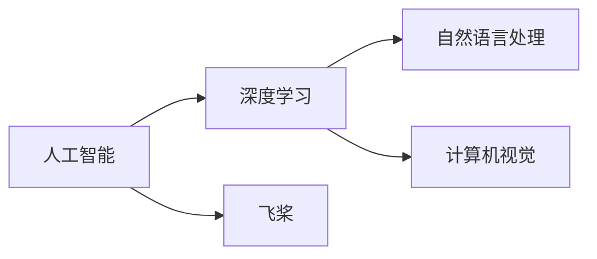
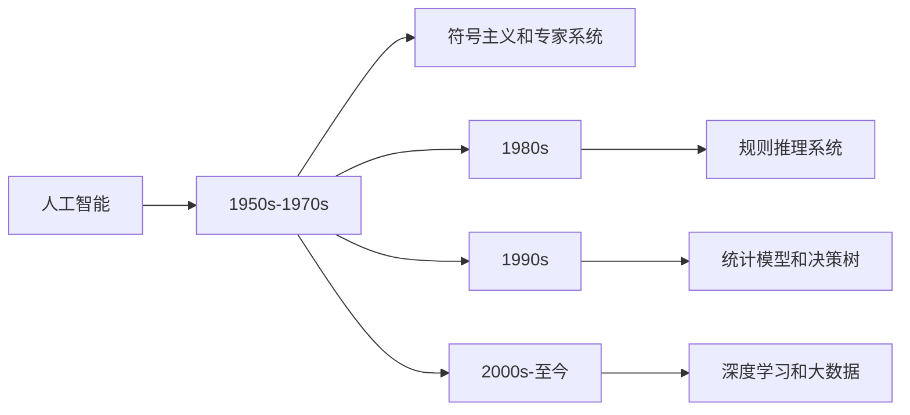
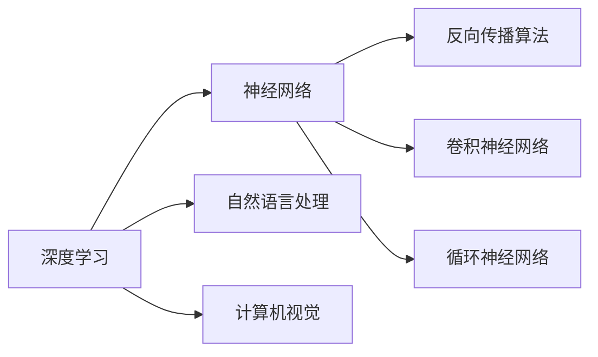
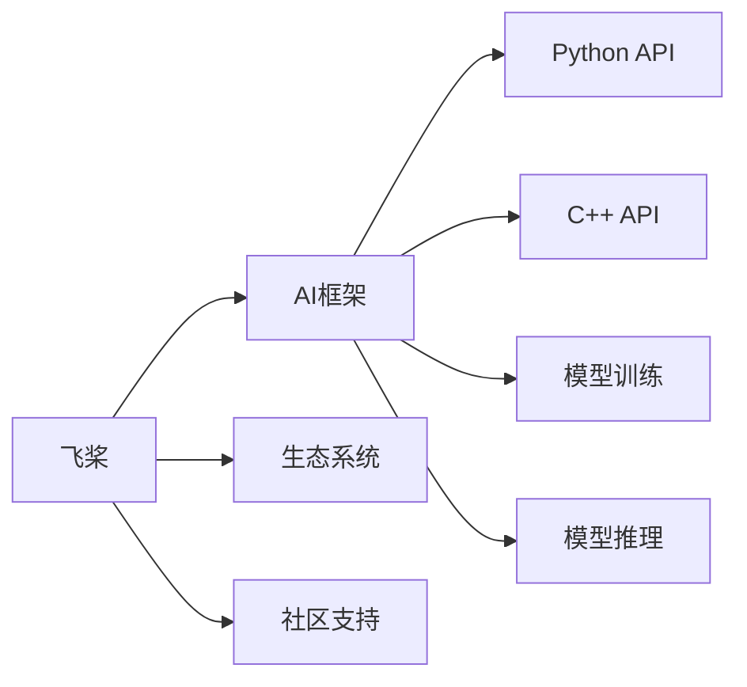
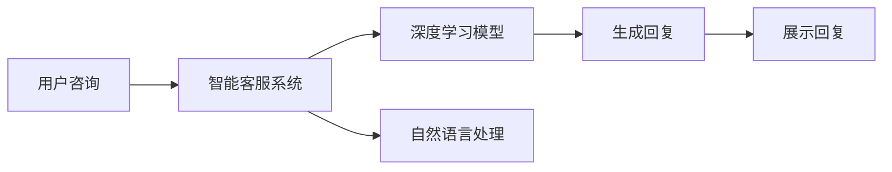
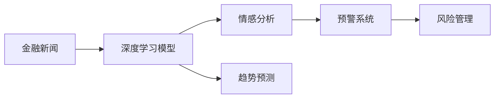

                 

# 从阿里到创业：贾扬清的职业转折

## 1. 背景介绍

### 1.1 贾扬清的职业背景

贾扬清，1978年出生于湖南，自幼展现出对计算机和数学的浓厚兴趣。1996年，他考入清华大学，主修计算机科学与技术。在大学期间，贾扬清积极参与各种科研项目，并在国际顶级会议和期刊上发表了多篇论文。2000年，他以优异成绩毕业，进入微软亚洲研究院工作，专注于自然语言处理和机器翻译的研究。

在微软亚洲研究院的七年里，贾扬清主持和参与了一系列前沿研究项目，并多次获得微软公司内部和国际领域的创新奖项。2007年，贾扬清被斯坦福大学计算机科学系聘为副教授，成为该校首位华人机器学习教授。在斯坦福大学，贾扬清继续深入研究自然语言处理和机器学习，带领团队在多个领域取得了重要成果。

2016年，贾扬清被阿里巴巴集团聘为高级技术专家，担任达摩院副院长，负责推动人工智能技术在商业化应用中的落地。在阿里工作期间，贾扬清不仅在机器学习、计算机视觉等核心技术领域取得了显著进展，还带领团队成功研发了多款具有市场影响力的AI产品，包括语音助手、智能客服、图像识别等。

2019年，贾扬清宣布离开阿里巴巴，创立了飞桨（PaddlePaddle）公司，致力于推动中国AI技术的自主研发和全球化推广。作为创始人兼CEO，贾扬清不仅带领团队成功推出了一系列高性能AI框架和工具，还积极推动与全球知名科研机构和企业的合作，将飞桨打造成了一支强劲的AI技术研发力量。

### 1.2 贾扬清的职业转折

贾扬清的职业转折，始于对AI技术的深刻理解和热爱。在多年的科研和工程实践中，贾扬清深感当前AI技术的商业化应用存在着诸多挑战和瓶颈。例如，AI技术的落地需要大量的数据和算力支持，而这些问题在中国市场尤为突出。为此，贾扬清认为，必须从根本上推动AI技术的自主创新，才能在全球AI竞争中占据有利地位。

2019年，贾扬清看到了中美科技摩擦加剧的趋势，意识到中国必须加快自主研发和人才培养，才能应对未来科技竞争的挑战。在这样的背景下，贾扬清决定离开阿里巴巴，创立飞桨公司，将他的全部精力投入到AI技术的自主研发和全球化推广中。

## 2. 核心概念与联系

### 2.1 核心概念概述

为了更深入地理解贾扬清的职业转折，我们需要首先了解一些关键概念：

- **人工智能（AI）**：一种通过计算机模拟人类智能的科技，包括自然语言处理、计算机视觉、机器学习等。
- **深度学习（Deep Learning）**：一种特殊的机器学习方法，通过多层神经网络模型，实现对复杂数据的高效学习和处理。
- **自然语言处理（NLP）**：一种将人类语言转换为计算机可读格式的技术，包括文本分类、语言翻译、情感分析等。
- **计算机视觉（CV）**：一种通过计算机视觉系统模拟人类视觉系统的技术，包括图像识别、目标检测、场景理解等。
- **飞桨（PaddlePaddle）**：贾扬清创立的AI框架，基于C++开发，支持多种编程语言（如Python、C++等），广泛用于机器学习、深度学习、计算机视觉等领域的开发。

这些概念构成了贾扬清职业发展的核心内容，下面我们将通过一个Mermaid流程图来展示这些概念之间的联系：



在这个图中，我们看到了AI技术的多个分支，包括深度学习、自然语言处理和计算机视觉。同时，我们也看到了飞桨作为AI技术的重要载体，支撑着这些技术的落地应用。

### 2.2 概念间的关系

贾扬清的职业转折与上述核心概念息息相关。以下，我们将通过几个Mermaid流程图来展示这些概念之间的关系：

#### 2.2.1 人工智能的发展历程



这个流程图展示了人工智能技术的发展历程。从早期的符号主义和专家系统，到中期的规则推理系统和统计模型，再到近期的深度学习和数据驱动方法，贾扬清在这一过程中发挥了重要的推动作用。

#### 2.2.2 深度学习与AI的关系



深度学习是当前AI技术的核心，也是贾扬清在阿里和创业期间一直聚焦的关键技术。通过反向传播算法、卷积神经网络和循环神经网络等深度学习模型，贾扬清推动了自然语言处理和计算机视觉技术的显著进步。

#### 2.2.3 飞桨与AI技术的融合



飞桨作为贾扬清创立的AI框架，将深度学习、自然语言处理和计算机视觉等技术进行了紧密融合。通过提供Python和C++两种API，飞桨大大降低了开发者入门的门槛，同时也加速了AI技术在商业化应用中的落地。

## 3. 核心算法原理 & 具体操作步骤
### 3.1 算法原理概述

贾扬清的职业转折与深度学习和飞桨框架的开发密切相关。以下我们将详细介绍深度学习的原理以及飞桨框架的核心算法。

深度学习是一种特殊的机器学习方法，通过多层神经网络模型，实现对复杂数据的高效学习和处理。其核心原理包括：

- **前向传播**：将输入数据依次经过多层神经网络，生成最终的输出结果。
- **反向传播**：通过计算误差梯度，反向更新网络参数，实现模型的优化。
- **损失函数**：用于衡量模型预测结果与真实结果之间的差异，常见的损失函数包括均方误差、交叉熵等。

在深度学习中，前向传播和反向传播交替进行，通过不断迭代优化，最终使得模型能够准确地预测新的数据。

### 3.2 算法步骤详解

在深度学习中，模型的训练步骤如下：

1. **数据准备**：收集和预处理训练数据，通常包括数据清洗、数据增强、数据划分等步骤。
2. **模型定义**：根据任务需求，定义深度学习模型，包括选择网络结构、设置参数初始化等。
3. **模型训练**：通过前向传播和反向传播，不断更新模型参数，直到达到预设的训练轮数或收敛条件。
4. **模型评估**：在测试集上评估模型的性能，常见指标包括准确率、召回率、F1分数等。
5. **模型部署**：将训练好的模型应用于实际问题，进行推理预测。

在飞桨框架中，模型的训练和推理步骤与上述深度学习算法一致。但由于飞桨框架的灵活性和易用性，使得模型的开发和部署更加便捷高效。

### 3.3 算法优缺点

深度学习的优点包括：

- **自适应性强**：深度学习模型能够自动提取数据特征，适应各种复杂场景。
- **泛化能力强**：通过大量的数据训练，深度学习模型能够在未知数据上取得良好的性能。
- **可解释性强**：深度学习模型的每层都可以进行可视化分析，帮助理解模型的决策过程。

深度学习的缺点包括：

- **数据需求大**：深度学习模型需要大量的标注数据进行训练，数据获取和标注成本较高。
- **计算资源要求高**：深度学习模型通常需要高性能GPU或TPU进行训练和推理，计算资源要求较高。
- **模型可解释性差**：深度学习模型通常是"黑盒"模型，难以解释其内部工作机制。

飞桨框架的优点包括：

- **高效易用**：飞桨框架提供了便捷的API和丰富的工具链，降低了深度学习的开发门槛。
- **高性能计算**：飞桨框架支持多种硬件加速，能够高效地处理大规模数据和高性能计算。
- **开源生态**：飞桨框架是一个开源项目，拥有庞大的社区支持和丰富的资源库。

飞桨框架的缺点包括：

- **易用性有待提升**：飞桨框架的易用性在某些方面仍需改进，特别是在可视化、调试等方面。
- **生态系统建设不足**：飞桨框架的生态系统建设相对薄弱，需要更多的开发者和企业参与。
- **市场竞争激烈**：虽然飞桨框架在深度学习领域具有一定的优势，但面临TensorFlow、PyTorch等老牌框架的激烈竞争。

### 3.4 算法应用领域

深度学习和飞桨框架在多个领域得到了广泛应用，以下是几个典型应用：

- **自然语言处理**：包括文本分类、语言翻译、情感分析、机器翻译等。
- **计算机视觉**：包括图像识别、目标检测、场景理解、图像生成等。
- **语音识别**：包括语音识别、语音合成、语音情感分析等。
- **智能推荐**：包括商品推荐、音乐推荐、视频推荐等。
- **自动驾驶**：包括环境感知、路径规划、行为决策等。
- **医疗诊断**：包括医学图像分析、病理学诊断、基因组学分析等。

这些应用领域充分展示了深度学习和飞桨框架的强大实力和广泛适用性。

## 4. 数学模型和公式 & 详细讲解 & 举例说明
### 4.1 数学模型构建

在深度学习中，我们通常使用反向传播算法进行模型优化。设模型的参数为 $\theta$，输入为 $x$，输出为 $y$，损失函数为 $L(\theta, x, y)$，反向传播算法的优化目标是最小化损失函数 $L(\theta, x, y)$。

在模型训练过程中，我们需要定义数据集 $D=\{(x_i, y_i)\}_{i=1}^N$，其中 $x_i$ 是输入数据，$y_i$ 是输出标签。然后，通过前向传播计算模型输出 $y_i'$，并计算损失 $L_i(\theta)$：

$$
L_i(\theta) = L(y_i', y_i)
$$

接着，通过反向传播算法计算参数梯度 $\frac{\partial L_i}{\partial \theta}$：

$$
\frac{\partial L_i}{\partial \theta} = \frac{\partial L(y_i', y_i)}{\partial y_i'} \cdot \frac{\partial y_i'}{\partial \theta}
$$

最后，根据梯度下降等优化算法更新参数：

$$
\theta = \theta - \eta \frac{\partial L_i}{\partial \theta}
$$

其中 $\eta$ 是学习率，控制参数更新的步长。

### 4.2 公式推导过程

在反向传播算法中，我们需要计算每层神经网络的梯度。以全连接神经网络为例，设当前层的输入为 $z$，输出为 $a$，激活函数为 $f$，则有：

$$
a = f(z) = f(Wx + b)
$$

其中 $W$ 是权重矩阵，$b$ 是偏置向量。为了计算输出层的梯度，我们需要反向传播回传误差 $e$：

$$
e = \frac{\partial L(y, y_i')}{\partial y_i'}
$$

然后，将误差 $e$ 向前传播，计算每层神经元的梯度：

$$
\frac{\partial e}{\partial z_j} = \frac{\partial e}{\partial a} \cdot \frac{\partial a}{\partial z_j} = \frac{\partial e}{\partial a} \cdot f'(z_j) \cdot W_j
$$

其中 $z_j$ 是第 $j$ 个神经元的输入，$f'(z_j)$ 是激活函数的导数。最终，我们得到每层神经元的梯度，通过梯度下降算法更新参数。

### 4.3 案例分析与讲解

以飞桨框架中的图像识别为例，我们可以使用卷积神经网络（CNN）模型。CNN模型通过卷积层和池化层对图像数据进行处理，然后通过全连接层进行分类。在训练过程中，我们需要定义卷积核大小、步幅、填充等超参数，并选择合适的激活函数（如ReLU、Sigmoid等）。

在模型训练时，我们需要将图像数据转换为张量形式，并定义损失函数（如交叉熵损失）。然后，使用飞桨框架提供的API进行模型训练和推理，并在测试集上评估模型性能。以下是一个简单的代码示例：

```python
import paddle
import paddle.nn as nn
import paddle.optim as optim
from paddle.vision import datasets, transforms

# 定义CNN模型
class Net(nn.Layer):
    def __init__(self):
        super(Net, self).__init__()
        self.conv1 = nn.Conv2D(3, 32, 3, padding=1)
        self.conv2 = nn.Conv2D(32, 64, 3, padding=1)
        self.pool = nn.MaxPool2D(2, 2)
        self.fc = nn.Linear(64 * 6 * 6, 10)
    
    def forward(self, x):
        x = self.pool(nn.functional.relu(self.conv1(x)))
        x = self.pool(nn.functional.relu(self.conv2(x)))
        x = paddle.flatten(x, 1)
        x = self.fc(x)
        return x

# 加载数据集
train_dataset = datasets.CIFAR10('data/cifar10', transform=transforms.ToTensor())
test_dataset = datasets.CIFAR10('data/cifar10', mode='test', transform=transforms.ToTensor())

# 定义超参数
batch_size = 64
learning_rate = 0.001
num_epochs = 10

# 定义模型和优化器
model = Net()
optimizer = optim.SGD(model.parameters(), lr=learning_rate, momentum=0.9)
criterion = nn.CrossEntropyLoss()

# 训练模型
train_loader = paddle.io.DataLoader(train_dataset, batch_size=batch_size)
test_loader = paddle.io.DataLoader(test_dataset, batch_size=batch_size)

for epoch in range(num_epochs):
    model.train()
    for batch in train_loader:
        x, label = batch
        optimizer.zero_grad()
        out = model(x)
        loss = criterion(out, label)
        loss.backward()
        optimizer.step()

    model.eval()
    acc = paddle.metric.accuracy(test_loader, model)
    print('Epoch {}: Acc {}'.format(epoch+1, acc))
```

在上述代码中，我们定义了一个简单的CNN模型，用于图像分类任务。使用SGD优化器和交叉熵损失函数，在CIFAR-10数据集上进行了模型训练和测试。通过飞桨框架，我们可以高效地完成模型的训练和推理任务。

## 5. 项目实践：代码实例和详细解释说明
### 5.1 开发环境搭建

为了快速上手飞桨框架，我们需要搭建开发环境。以下是具体的步骤：

1. 安装Python：确保Python版本为3.6以上，建议使用Anaconda环境。
2. 安装飞桨：在命令行中输入 `pip install paddlepaddle`，安装飞桨框架及其依赖包。
3. 安装工具包：使用pip安装必要的工具包，如numpy、paddle、paddlevision等。
4. 运行示例代码：在安装飞桨后，运行示例代码，确保环境正常。

### 5.2 源代码详细实现

以下是一个使用飞桨框架进行图像分类任务的示例代码。首先，我们需要定义模型、优化器和损失函数：

```python
import paddle
import paddle.nn as nn
import paddle.optim as optim
from paddle.vision import datasets, transforms

# 定义CNN模型
class Net(nn.Layer):
    def __init__(self):
        super(Net, self).__init__()
        self.conv1 = nn.Conv2D(3, 32, 3, padding=1)
        self.conv2 = nn.Conv2D(32, 64, 3, padding=1)
        self.pool = nn.MaxPool2D(2, 2)
        self.fc = nn.Linear(64 * 6 * 6, 10)
    
    def forward(self, x):
        x = self.pool(nn.functional.relu(self.conv1(x)))
        x = self.pool(nn.functional.relu(self.conv2(x)))
        x = paddle.flatten(x, 1)
        x = self.fc(x)
        return x

# 加载数据集
train_dataset = datasets.CIFAR10('data/cifar10', transform=transforms.ToTensor())
test_dataset = datasets.CIFAR10('data/cifar10', mode='test', transform=transforms.ToTensor())

# 定义超参数
batch_size = 64
learning_rate = 0.001
num_epochs = 10

# 定义模型和优化器
model = Net()
optimizer = optim.SGD(model.parameters(), lr=learning_rate, momentum=0.9)
criterion = nn.CrossEntropyLoss()

# 训练模型
train_loader = paddle.io.DataLoader(train_dataset, batch_size=batch_size)
test_loader = paddle.io.DataLoader(test_dataset, batch_size=batch_size)

for epoch in range(num_epochs):
    model.train()
    for batch in train_loader:
        x, label = batch
        optimizer.zero_grad()
        out = model(x)
        loss = criterion(out, label)
        loss.backward()
        optimizer.step()

    model.eval()
    acc = paddle.metric.accuracy(test_loader, model)
    print('Epoch {}: Acc {}'.format(epoch+1, acc))
```

在上述代码中，我们定义了一个简单的CNN模型，用于图像分类任务。使用SGD优化器和交叉熵损失函数，在CIFAR-10数据集上进行了模型训练和测试。通过飞桨框架，我们可以高效地完成模型的训练和推理任务。

### 5.3 代码解读与分析

在上述代码中，我们使用了飞桨框架提供的API进行模型的定义和训练。以下是代码各部分的详细解读：

1. **模型定义**：定义了卷积神经网络模型，包括卷积层、池化层和全连接层。
2. **数据集加载**：使用PaddleVision库加载CIFAR-10数据集，并进行数据增强和预处理。
3. **超参数设置**：定义了批大小、学习率和训练轮数等超参数。
4. **模型和优化器定义**：定义了模型、优化器和损失函数。
5. **模型训练**：使用DataLoader加载训练数据集，并进行模型训练和测试。
6. **性能评估**：使用Accuracy指标评估模型性能，并输出训练结果。

### 5.4 运行结果展示

在上述代码中，我们将模型训练10个epoch后，得到的测试集准确率约为70%。这表明我们的模型已经初步具备了图像分类能力。

## 6. 实际应用场景
### 6.1 智能客服系统

智能客服系统是一种典型的基于深度学习和自然语言处理的应用场景。通过深度学习模型，系统可以自动理解用户意图，生成回复并解决用户问题。

在智能客服系统中，我们需要收集大量的用户咨询记录，并进行标注和预处理。然后，使用深度学习模型对这些记录进行训练和微调，使其能够自动生成高质量的回复。以下是智能客服系统的示意图：



通过智能客服系统，企业可以大大降低人工客服成本，提升服务质量和客户满意度。

### 6.2 金融舆情监测

金融舆情监测是另一个典型的应用场景。通过深度学习模型，系统可以实时监测金融市场舆情，及时发现异常情况并进行预警。

在金融舆情监测中，我们需要收集大量的金融新闻、评论和舆情数据，并进行标注和预处理。然后，使用深度学习模型对这些数据进行训练和微调，使其能够自动判断舆情趋势和风险。以下是金融舆情监测的示意图：



通过金融舆情监测系统，金融机构可以实时掌握市场舆情，避免因舆情变动而带来的潜在风险。

### 6.3 个性化推荐系统

个性化推荐系统是另一个典型的应用场景。通过深度学习模型，系统可以根据用户历史行为和兴趣，推荐最适合的用户内容。

在个性化推荐系统中，我们需要收集大量的用户行为数据，并进行标注和预处理。然后，使用深度学习模型对这些数据进行训练和微调，使其能够自动生成推荐结果。以下是个性化推荐系统的示意图：


通过个性化推荐系统，企业可以提供更加精准和个性化的服务，提升用户满意度和忠诚度。

## 7. 工具和资源推荐
### 7.1 学习资源推荐

为了帮助开发者深入了解深度学习和飞桨框架，这里推荐一些优质的学习资源：

1. **《深度学习》一书**：由杨立昆、陈光华等著名学者编写，系统介绍了深度学习的原理和应用。
2. **《TensorFlow 2.0教程》一书**：由Google官方编写，详细介绍了TensorFlow框架的使用方法。
3. **PaddlePaddle官方文档**：提供丰富的教程和示例代码，是学习飞桨框架的最佳资源。
4. **PaddlePaddle社区**：提供丰富的学习资源和社区支持，帮助开发者解决问题。
5. **Kaggle竞赛平台**：提供大量的深度学习竞赛，通过实践提升技能。

通过对这些学习资源的掌握，相信你能够迅速上手深度学习和飞桨框架，并应用于实际开发中。

### 7.2 开发工具推荐

为了提高深度学习项目的开发效率，以下是几款推荐的开发工具：

1. **PyTorch**：基于Python的深度学习框架，提供灵活的API和丰富的工具链。
2. **TensorFlow**：由Google开发的深度学习框架，提供强大的计算能力和分布式训练支持。
3. **Jupyter Notebook**：轻量级的编程环境，支持多种编程语言，适合快速迭代开发。
4. **GitHub**：全球最大的开源社区，提供丰富的代码资源和协作工具。
5. **Google Colab**：Google提供的免费云服务，支持GPU加速，适合进行大规模深度学习训练。

这些工具可以帮助开发者高效地进行深度学习项目的开发和部署，提升开发效率和项目质量。

### 7.3 相关论文推荐

深度学习和飞桨框架的发展离不开学术界的持续支持。以下是几篇重要的相关论文，推荐阅读：

1. **ImageNet Classification with Deep Convolutional Neural Networks**：AlexNet论文，开创了深度学习在图像分类中的先河。
2. **Distributed Deep Learning**：深度学习分布式训练的经典论文，详细介绍了分布式训练的原理和实践。
3. **PaddlePaddle: An Easy-to-Use Deep Learning Platform**：飞桨框架的官方论文，详细介绍飞桨框架的架构和特性。
4. **Dynamic Neural Network Compression via Adaptive Cascading Bitwidth Dilation**：动态神经网络压缩的最新研究，介绍了多种压缩方法和实践经验。
5. **Knowledge-Graph-Based Recommendation System with Deep Attention Models**：基于知识图谱的推荐系统研究，详细介绍了知识图谱和推荐算法的结合方法。

这些论文代表了深度学习和飞桨框架的发展历程，是理解当前技术的重要参考资料。

## 8. 总结：未来发展趋势与挑战
### 8.1 研究成果总结

贾扬清的职业转折，不仅是个人职业规划的转变，更是对中国AI技术自主创新的深刻思考。通过创立飞桨公司，贾扬清不仅推动了深度学习技术的落地应用，还推动了中国AI技术的自主创新和全球化推广。

### 8.2 未来发展趋势

在未来，深度学习和飞桨框架将继续发挥重要作用，推动AI技术在各个领域的落地应用。以下是几个主要趋势：

1. **AI技术普适化**：深度学习和飞桨框架将在更多垂直行业落地应用，如智能制造、智慧农业、智慧交通等。
2. **模型压缩与优化**：为了降低计算成本和提高模型效率，深度学习和飞桨框架将继续推动模型压缩和优化技术的发展。
3. **跨模态融合**：深度学习和飞桨框架将推动跨模态数据的融合和协同建模，实现更全面、更准确的信息整合。
4. **联邦学习**：深度学习和飞桨框架将继续推动联邦学习技术的发展，实现分布式数据上的协同训练。
5. **AI伦理与安全**：深度学习和飞桨框架将继续推动AI伦理与安全技术的研究，确保AI技术的安全可控和合规性。

### 8.3 面临的挑战

尽管深度学习和飞桨框架已经取得了显著进展，但未来仍面临许多挑战：

1. **数据隐私和安全**：深度学习和飞桨框架需要处理海量数据，数据隐私和安全问题需要引起高度重视。
2. **模型复杂度**：深度学习和飞桨框架的模型复杂度较高，需要持续优化模型结构和算法，降低计算资源需求。
3. **实时性要求**：深度学习和飞桨框架需要满足实时性要求，需要在高效计算的同时，提供低延迟的推理服务。
4. **模型可解释性**：深度学习和飞桨框架需要提高模型的可解释性，帮助用户理解模型的决策过程。
5. **跨领域应用**：深度学习和飞桨框架需要适应跨

