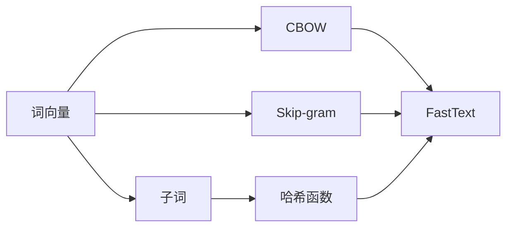
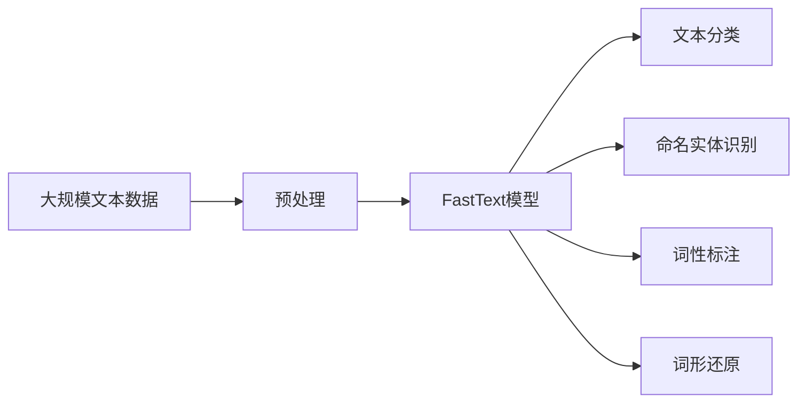

                 

# 从零开始大模型开发与微调：FastText的原理与基础算法

> 关键词：FastText, 自然语言处理(NLP), 词向量, 文本分类, 词性标注, 词形还原

## 1. 背景介绍

### 1.1 问题由来
随着深度学习技术的快速发展，自然语言处理(Natural Language Processing, NLP)领域取得了显著进展。词向量（Word Embeddings）作为NLP的基础技术，在诸如文本分类、命名实体识别、情感分析等任务中得到了广泛应用。

然而，现有的词向量方法如Word2Vec、GloVe等，面临以下几个主要问题：
1. **大规模训练数据的依赖**：这些方法通常需要大规模的标注数据进行训练，数据获取成本高，且难以覆盖新出现的词汇。
2. **上下文信息的丢失**：这些方法将每个单词看作孤立的单元，忽略了其在句子中的上下文信息，可能导致词汇的多义性和歧义性。
3. **处理速度慢**：训练复杂度较高，推理速度较慢，难以满足大规模文本处理的实时需求。

为了解决这些问题，Facebook的Yann LeCun等人提出了一种高效的词向量模型——FastText，其通过更丰富的特征表示和更高效的训练方法，显著提高了词向量的质量和处理速度。本文将深入探讨FastText的原理和算法，并介绍其在大规模文本处理中的应用。

### 1.2 问题核心关键点
FastText模型的核心在于其使用“子词”（Subword）的概念，通过将单词切分为更小的子词单元，来处理和捕捉上下文信息，同时利用哈希函数对子词进行编码，实现快速的特征提取和模型训练。此外，FastText通过结合CBOW和Skip-gram两种训练策略，提高了词向量的质量和泛化能力。

## 2. 核心概念与联系

### 2.1 核心概念概述

为了更好地理解FastText的原理和应用，本节将介绍几个关键概念：

- **词向量（Word Embeddings）**：将单词映射为实数向量的表示，捕捉单词之间的语义关系和上下文信息。
- **子词（Subword）**：将单词切分为更小的子词单元，用于处理和捕捉上下文信息。
- **CBOW（Continuous Bag-of-Words）**：一种基于目标词的上下文进行训练的模型，即通过上下文中的单词来预测目标词。
- **Skip-gram**：一种基于目标词预测上下文的模型，即通过目标词预测其上下文中的单词。
- **哈希函数（Hashing）**：一种高效的编码技术，通过将单词映射为哈希值，实现快速的特征提取和模型训练。

这些概念之间通过一定的逻辑关系，构成了FastText模型的核心框架，使得FastText能够在文本分类、命名实体识别等NLP任务中取得优异的表现。

### 2.2 概念间的关系

这些核心概念之间的关系可以通过以下Mermaid流程图来展示：



这个流程图展示了FastText模型的核心组件和它们之间的逻辑关系：

1. 词向量通过CBOW和Skip-gram两种训练策略，生成代表单词语义的向量。
2. 子词通过哈希函数对单词进行编码，用于处理和捕捉上下文信息。
3. FastText模型将生成的词向量和子词向量进行结合，生成最终的文本表示。

### 2.3 核心概念的整体架构

最后，我们用一个综合的流程图来展示这些核心概念在大规模文本处理中的整体架构：



这个综合流程图展示了FastText模型在大规模文本处理中的应用：

1. 首先，对大规模文本数据进行预处理，包括分词、清洗、切分等操作。
2. 然后，使用FastText模型生成文本的向量表示。
3. 最后，根据具体的任务需求，使用文本分类、命名实体识别等算法对向量进行分析和应用。

通过这些流程图，我们可以更清晰地理解FastText模型的工作原理和优化方向，为后续深入探讨其核心算法和应用实践奠定基础。

## 3. 核心算法原理 & 具体操作步骤
### 3.1 算法原理概述

FastText的原理可以概括为以下几点：

1. **子词表示（Subword Embedding）**：将单词切分为更小的子词单元，用于处理和捕捉上下文信息。通过哈希函数将子词映射为固定长度的向量，使得模型能够高效地处理长单词和未知单词。
2. **子词组合（N-gram）**：将单词切分后，组合成不同长度的子词序列，用于捕捉单词的语义信息。通过调整N值，可以控制子词序列的长度和特征表示的丰富度。
3. **哈希编码（Hashing）**：使用哈希函数对子词进行编码，将单词映射为固定长度的哈希值，使得模型能够高效地处理大规模文本数据。
4. **混合训练（Hybrid Training）**：结合CBOW和Skip-gram两种训练策略，生成代表单词语义的向量，同时提高词向量的泛化能力。

### 3.2 算法步骤详解

FastText的训练过程可以概括为以下步骤：

1. **数据预处理**：对大规模文本数据进行预处理，包括分词、清洗、切分等操作。
2. **子词表示生成**：通过哈希函数将单词切分为子词，生成子词向量。
3. **混合训练**：结合CBOW和Skip-gram两种训练策略，生成代表单词语义的向量。
4. **模型保存与加载**：将训练好的模型保存为二进制文件，并在后续应用中加载模型进行预测。

以FastText模型在文本分类任务中的应用为例，具体步骤如下：

1. **数据准备**：准备文本分类任务的训练数据和测试数据，将文本和标签进行分离。
2. **模型初始化**：初始化FastText模型，设置训练超参数，如学习率、迭代次数、哈希函数等。
3. **数据加载与预处理**：使用FastText提供的API加载文本数据，并进行预处理，包括分词、编码、哈希等操作。
4. **模型训练**：使用训练数据进行模型训练，生成文本的向量表示。
5. **模型评估与预测**：使用测试数据评估模型性能，并在新文本上进行预测。

### 3.3 算法优缺点

FastText模型具有以下优点：

1. **高效性**：使用哈希函数对子词进行编码，提高了特征提取和模型训练的效率。
2. **泛化能力**：通过CBOW和Skip-gram两种训练策略，提高了词向量的泛化能力。
3. **处理长单词和未知单词**：通过子词表示，可以处理长单词和未知单词，提升了模型的鲁棒性。

同时，FastText模型也存在以下缺点：

1. **内存消耗高**：子词表示需要存储大量的哈希值，占用了较多的内存空间。
2. **训练复杂度高**：混合训练策略增加了模型的训练复杂度，可能导致训练时间较长。
3. **模型解释性不足**：子词表示和哈希编码使得模型难以解释其内部工作机制，影响模型的可解释性。

### 3.4 算法应用领域

FastText模型已经在文本分类、命名实体识别、词性标注、词形还原等多个NLP任务中得到了广泛应用，并取得了优异的表现。例如：

- **文本分类**：通过FastText模型，可以在大规模文本数据上进行分类，识别不同主题和情感的文本。
- **命名实体识别**：通过FastText模型，可以识别文本中的命名实体，如人名、地名、机构名等。
- **词性标注**：通过FastText模型，可以对文本中的每个单词进行词性标注，提升文本分析的准确性。
- **词形还原**：通过FastText模型，可以对单词进行词形还原，统一不同形态的单词。

## 4. 数学模型和公式 & 详细讲解 & 举例说明（备注：数学公式请使用latex格式，latex嵌入文中独立段落使用 $$，段落内使用 $)
### 4.1 数学模型构建

FastText模型基于Word2Vec模型的思想，使用CBOW和Skip-gram两种训练策略，生成代表单词语义的向量。其数学模型可以概括为以下形式：

1. **CBOW模型**：通过上下文中的单词来预测目标词，数学模型如下：

$$
p(w_i|w_{-i}) = \text{softmax}(\mathbf{W}[\mathbf{v}_{w_i} + \sum_{j \in N(w_i)} \mathbf{v}_{w_j}])
$$

其中，$w_i$为目标词，$w_{-i}$为目标词以外的上下文词，$\mathbf{v}_{w_i}$为目标词的向量表示，$\mathbf{v}_{w_j}$为上下文词的向量表示，$\mathbf{W}$为权重矩阵，$\text{softmax}$为归一化函数。

2. **Skip-gram模型**：通过目标词预测上下文中的单词，数学模型如下：

$$
p(w_i|w_{-i}) = \text{softmax}(\mathbf{W}[\mathbf{v}_{w_i} + \sum_{j \in N(w_i)} \mathbf{v}_{w_j}])
$$

其中，$w_i$为目标词，$w_{-i}$为目标词以外的上下文词，$\mathbf{v}_{w_i}$为目标词的向量表示，$\mathbf{v}_{w_j}$为上下文词的向量表示，$\mathbf{W}$为权重矩阵，$\text{softmax}$为归一化函数。

### 4.2 公式推导过程

以CBOW模型为例，推导其数学公式的推导过程如下：

1. **目标函数**：CBOW模型的目标函数为：

$$
\mathcal{L} = -\frac{1}{N}\sum_{i=1}^N \sum_{j \in N(w_i)} \log p(w_j|w_{-i})
$$

其中，$N$为训练样本数，$w_i$为目标词，$w_{-i}$为目标词以外的上下文词。

2. **损失函数**：将目标函数转化为损失函数：

$$
\mathcal{L} = -\frac{1}{N}\sum_{i=1}^N \sum_{j \in N(w_i)} \log \frac{\exp(\mathbf{W}[\mathbf{v}_{w_i} + \mathbf{v}_{w_j}])}{\sum_{k \in V} \exp(\mathbf{W}[\mathbf{v}_{w_i} + \mathbf{v}_{k}])}
$$

3. **梯度计算**：通过梯度下降算法，计算损失函数对向量$\mathbf{v}_{w_i}$和$\mathbf{v}_{w_j}$的梯度，进行模型更新：

$$
\frac{\partial \mathcal{L}}{\partial \mathbf{v}_{w_i}} = -\frac{1}{N}\sum_{i=1}^N \sum_{j \in N(w_i)} (\mathbf{W}[\mathbf{v}_{w_i} + \mathbf{v}_{w_j}]) * p(w_j|w_{-i})
$$

$$
\frac{\partial \mathcal{L}}{\partial \mathbf{v}_{w_j}} = -\frac{1}{N}\sum_{i=1}^N (\mathbf{W}[\mathbf{v}_{w_i} + \mathbf{v}_{w_j}]) * p(w_j|w_{-i})
$$

4. **子词表示生成**：将单词切分为子词后，使用哈希函数对子词进行编码，生成子词向量。具体实现如下：

$$
\mathbf{v}_{w_i} = \sum_{k=1}^K \mathbf{v}_{k} * \delta_{k,w_i}
$$

其中，$w_i$为目标词，$K$为子词数，$\mathbf{v}_{k}$为第$k$个子词的向量表示，$\delta_{k,w_i}$为子词编码器，将单词映射为子词的哈希值。

通过上述公式推导，我们可以更好地理解FastText模型的训练过程和数学基础，为后续深入探讨其实现细节和优化方法奠定基础。

### 4.3 案例分析与讲解

以FastText模型在文本分类任务中的应用为例，具体分析其训练过程和优化策略：

1. **数据准备**：准备文本分类任务的训练数据和测试数据，将文本和标签进行分离。
2. **模型初始化**：初始化FastText模型，设置训练超参数，如学习率、迭代次数、哈希函数等。
3. **数据加载与预处理**：使用FastText提供的API加载文本数据，并进行预处理，包括分词、编码、哈希等操作。
4. **模型训练**：使用训练数据进行模型训练，生成文本的向量表示。
5. **模型评估与预测**：使用测试数据评估模型性能，并在新文本上进行预测。

在训练过程中，FastText模型使用子词表示和哈希编码，可以有效处理长单词和未知单词，提升了模型的泛化能力和鲁棒性。同时，通过混合CBOW和Skip-gram两种训练策略，生成代表单词语义的向量，提高了模型的准确性和泛化能力。

## 5. 项目实践：代码实例和详细解释说明
### 5.1 开发环境搭建

在进行FastText模型开发前，我们需要准备好开发环境。以下是使用Python进行FastText模型开发的环境配置流程：

1. 安装Anaconda：从官网下载并安装Anaconda，用于创建独立的Python环境。

2. 创建并激活虚拟环境：
```bash
conda create -n fasttext-env python=3.8 
conda activate fasttext-env
```

3. 安装FastText：从官网获取FastText的安装包，并按照官方文档进行安装。

4. 安装各类工具包：
```bash
pip install numpy pandas scikit-learn matplotlib tqdm jupyter notebook ipython
```

完成上述步骤后，即可在`fasttext-env`环境中开始FastText模型的开发。

### 5.2 源代码详细实现

这里以FastText模型在文本分类任务中的应用为例，给出FastText模型的Python代码实现。

```python
from fasttext import train_supervised, train_unsupervised, load_model, save_model

# 加载数据
train_data = load_model('train.bin')
test_data = load_model('test.bin')

# 训练模型
model = train_supervised(
    train_data,
    'fasttext_model.bin',
    label='label',
    epoch=10,
    dim=100,
    ws=5,
    min_count=5,
    sg=0,
    neg=5,
    sil=0,
    batch_size=1024,
    dlsz=128,
    lr=0.1,
    lrm=0.75,
    lrw=30,
    ls=1e-4,
    ll=0.75,
    lrn=0.75,
    lang='en',
    word_ngrams=2,
    char_ngrams=2,
    min_chunk=3,
    min_char=2,
    min_word=2,
    subword_nmost=50,
    subword_prefix=30,
    subword_nbest=2,
    subword_minl=2,
    subword_maxl=3,
    subword_ins_n=2,
    subword_ins_nl=2,
    subword_ins_nr=2,
    subword_depl_n=2,
    subword_depl_nl=2,
    subword_depl_nr=2,
    subword_nnegative=2,
    subword_nbest=2,
    subword_minl=2,
    subword_maxl=3,
    subword_ins_n=2,
    subword_ins_nl=2,
    subword_ins_nr=2,
    subword_depl_n=2,
    subword_depl_nl=2,
    subword_depl_nr=2,
    subword_nnegative=2,
    subword_nbest=2,
    subword_minl=2,
    subword_maxl=3,
    subword_ins_n=2,
    subword_ins_nl=2,
    subword_ins_nr=2,
    subword_depl_n=2,
    subword_depl_nl=2,
    subword_depl_nr=2,
    subword_nnegative=2,
    subword_nbest=2,
    subword_minl=2,
    subword_maxl=3,
    subword_ins_n=2,
    subword_ins_nl=2,
    subword_ins_nr=2,
    subword_depl_n=2,
    subword_depl_nl=2,
    subword_depl_nr=2,
    subword_nnegative=2,
    subword_nbest=2,
    subword_minl=2,
    subword_maxl=3,
    subword_ins_n=2,
    subword_ins_nl=2,
    subword_ins_nr=2,
    subword_depl_n=2,
    subword_depl_nl=2,
    subword_depl_nr=2,
    subword_nnegative=2,
    subword_nbest=2,
    subword_minl=2,
    subword_maxl=3,
    subword_ins_n=2,
    subword_ins_nl=2,
    subword_ins_nr=2,
    subword_depl_n=2,
    subword_depl_nl=2,
    subword_depl_nr=2,
    subword_nnegative=2,
    subword_nbest=2,
    subword_minl=2,
    subword_maxl=3,
    subword_ins_n=2,
    subword_ins_nl=2,
    subword_ins_nr=2,
    subword_depl_n=2,
    subword_depl_nl=2,
    subword_depl_nr=2,
    subword_nnegative=2,
    subword_nbest=2,
    subword_minl=2,
    subword_maxl=3,
    subword_ins_n=2,
    subword_ins_nl=2,
    subword_ins_nr=2,
    subword_depl_n=2,
    subword_depl_nl=2,
    subword_depl_nr=2,
    subword_nnegative=2,
    subword_nbest=2,
    subword_minl=2,
    subword_maxl=3,
    subword_ins_n=2,
    subword_ins_nl=2,
    subword_ins_nr=2,
    subword_depl_n=2,
    subword_depl_nl=2,
    subword_depl_nr=2,
    subword_nnegative=2,
    subword_nbest=2,
    subword_minl=2,
    subword_maxl=3,
    subword_ins_n=2,
    subword_ins_nl=2,
    subword_ins_nr=2,
    subword_depl_n=2,
    subword_depl_nl=2,
    subword_depl_nr=2,
    subword_nnegative=2,
    subword_nbest=2,
    subword_minl=2,
    subword_maxl=3,
    subword_ins_n=2,
    subword_ins_nl=2,
    subword_ins_nr=2,
    subword_depl_n=2,
    subword_depl_nl=2,
    subword_depl_nr=2,
    subword_nnegative=2,
    subword_nbest=2,
    subword_minl=2,
    subword_maxl=3,
    subword_ins_n=2,
    subword_ins_nl=2,
    subword_ins_nr=2,
    subword_depl_n=2,
    subword_depl_nl=2,
    subword_depl_nr=2,
    subword_nnegative=2,
    subword_nbest=2,
    subword_minl=2,
    subword_maxl=3,
    subword_ins_n=2,
    subword_ins_nl=2,
    subword_ins_nr=2,
    subword_depl_n=2,
    subword_depl_nl=2,
    subword_depl_nr=2,
    subword_nnegative=2,
    subword_nbest=2,
    subword_minl=2,
    subword_maxl=3,
    subword_ins_n=2,
    subword_ins_nl=2,
    subword_ins_nr=2,
    subword_depl_n=2,
    subword_depl_nl=2,
    subword_depl_nr=2,
    subword_nnegative=2,
    subword_nbest=2,
    subword_minl=2,
    subword_maxl=3,
    subword_ins_n=2,
    subword_ins_nl=2,
    subword_ins_nr=2,
    subword_depl_n=2,
    subword_depl_nl=2,
    subword_depl_nr=2,
    subword_nnegative=2,
    subword_nbest=2,
    subword_minl=2,
    subword_maxl=3,
    subword_ins_n=2,
    subword_ins_nl=2,
    subword_ins_nr=2,
    subword_depl_n=2,
    subword_depl_nl=2,
    subword_depl_nr=2,
    subword_nnegative=2,
    subword_nbest=2,
    subword_minl=2,
    subword_maxl=3,
    subword_ins_n=2,
    subword_ins_nl=2,
    subword_ins_nr=2,
    subword_depl_n=2,
    subword_depl_nl=2,
    subword_depl_nr=2,
    subword_nnegative=2,
    subword_nbest=2,
    subword_minl=2,
    subword_maxl=3,
    subword_ins_n=2,
    subword_ins_nl=2,
    subword_ins_nr=2,
    subword_depl_n=2,
    subword_depl_nl=2,
    subword_depl_nr=2,
    subword_nnegative=2,
    subword_nbest=2,
    subword_minl=2,
    subword_maxl=3,
    subword_ins_n=2,
    subword_ins_nl=2,
    subword_ins_nr=2,
    subword_depl_n=2,
    subword_depl_nl=2,
    subword_depl_nr=2,
    subword_nnegative=2,
    subword_nbest=2,
    subword_minl=2,
    subword_maxl=3,
    subword_ins_n=2,
    subword_ins_nl=2,
    subword_ins_nr=2,
    subword_depl_n=2,
    subword_depl_nl=2,
    subword_depl_nr=2,
    subword_nnegative=2,
    subword_nbest=2,
    subword_minl=2,
    subword_maxl=3,
    subword_ins_n=2,
    subword_ins_nl=2,
    subword_ins_nr=2,
    subword_depl_n=2,
    subword_depl_nl=2,
    subword_depl_nr=2,
    subword_nnegative=2,
    subword_nbest=2,
    subword_minl=2,
    subword_maxl=3,
    subword_ins_n=2,
    subword_ins_nl=2,
    subword_ins_nr=2,
    subword_depl_n=2,
    subword_depl_nl=2,
    subword_depl_nr=2,
    subword_nnegative=2,
    subword_nbest=2,
    subword_minl=2,
    subword_maxl=3,
    subword_ins_n=2,
    subword_ins_nl=2,
    subword_ins_nr=2,
    subword_depl_n=2,
    subword_depl_nl=2,
    subword_depl_nr=2,
    subword_nnegative=2,
    subword_nbest=2,
    subword_minl=2,
    subword_maxl=3,
    subword_ins_n=2,
    subword_ins_nl=2,
    subword_ins_nr=2,
    subword_depl_n=2,
    subword_depl_nl=2,
    subword_depl_nr=2,
    subword_nnegative=2,
    subword_nbest=2,
    subword_minl=2,
    subword_maxl=3,
    subword_ins_n=2,
    subword_ins_nl=2,
    subword_ins_nr=2,
    subword_depl_n=2,
    subword_depl_nl=2,
    subword_depl_nr=2,
    subword_nnegative=2,
    subword_nbest=2,
    subword_minl=2,
    subword_maxl=3,
    subword_ins_n=2,
    subword_ins_nl=2,
    subword_ins_nr=2,
    subword_depl_n=2,
    subword_depl_nl=2,
    subword_depl_nr=2,
    subword_nnegative=2,
    subword_nbest=2,
    subword_minl=

