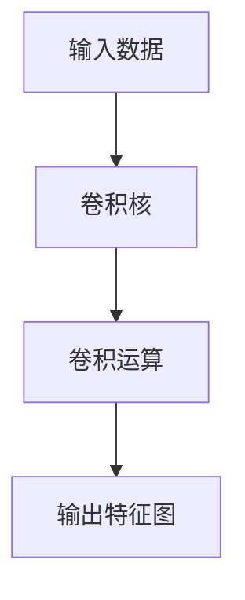

                 

# 从零开始大模型开发与微调：卷积运算的基本概念

## 1. 背景介绍

卷积运算（Convolutional Operations）是大模型开发与微调中的核心概念之一，广泛应用于计算机视觉、自然语言处理、音频处理等多个领域。深入理解卷积运算的基本原理和应用场景，对于构建高性能的大模型系统至关重要。本博客将从基础概念入手，逐步深入讲解卷积运算的理论原理、操作步骤以及实际应用，帮助读者全面掌握这一关键技术。

## 2. 核心概念与联系

### 2.1 核心概念概述

在深入卷积运算之前，首先需要了解一些关键概念：

- **卷积（Convolution）**：一种数学运算，常用于信号处理、图像处理、机器学习等领域。卷积操作通过滑动一个函数（卷积核），计算输入信号与卷积核的乘积之和，生成一个新的输出信号。

- **卷积核（Convolution Kernel）**：卷积运算的核心参数，通常为一个小矩阵，用于在输入信号上滑动计算。卷积核的大小、形状、步长等参数的选择，直接影响卷积运算的结果。

- **滤波器（Filter）**：卷积核的别称，通常用于提取输入信号的特定特征。

- **卷积层（Convolutional Layer）**：神经网络中用于执行卷积运算的层，通过多个卷积核的组合，可以提取输入数据的多个特征。

- **池化层（Pooling Layer）**：一种降维操作，通常用于卷积层的输出，减少特征维度，提高计算效率，同时保留重要的特征信息。

### 2.2 概念间的关系

卷积运算在深度学习中的应用，可以简要概括为以下几个关键点：

1. **特征提取**：卷积层通过滑动卷积核，提取输入数据的局部特征。这些局部特征经过叠加，构成全局的特征表示。

2. **参数共享**：卷积核在输入数据上滑动，可以共享同一参数，减少模型参数量，提高计算效率。

3. **参数高效性**：由于卷积核的共享性，卷积运算可以显著降低模型参数量，提升模型的泛化能力。

4. **位置不变性**：卷积核在输入数据上滑动，可以在一定程度上保持位置不变性，即提取的特征不受输入数据位置的影响。

5. **局部连接**：卷积核与输入数据的局部连接，可以捕捉输入数据的局部关系，提高模型的空间感知能力。

这些概念之间相互关联，构成了卷积运算的核心原理。通过深入理解这些概念，可以更好地掌握卷积运算的实际应用。

### 2.3 核心概念的整体架构

以下是一个简单的卷积运算流程示意图，展示了卷积运算的基本过程：



这个流程图展示了卷积运算的基本流程：

- 输入数据
- 卷积核
- 卷积运算
- 输出特征图

在实际应用中，卷积层和池化层会交替出现，构成卷积神经网络的基本结构。下面我们将进一步深入讲解卷积运算的原理和操作步骤。

## 3. 核心算法原理 & 具体操作步骤

### 3.1 算法原理概述

卷积运算的基本原理是通过滑动卷积核，计算输入数据与卷积核的乘积之和，生成输出特征图。其核心公式为：

$$
\mathbf{O}(\mathbf{I}, \mathbf{K}) = \sum_{x=0}^{W_I-1} \sum_{y=0}^{H_I-1} I(x, y) \ast K(x', y')
$$

其中，$\mathbf{I}$ 为输入数据，$\mathbf{K}$ 为卷积核，$\mathbf{O}$ 为输出特征图，$I(x, y)$ 为输入数据在位置 $(x, y)$ 处的值，$K(x', y')$ 为卷积核在位置 $(x', y')$ 处的值。$W_I$ 和 $H_I$ 分别为输入数据的高和宽。

### 3.2 算法步骤详解

卷积运算的具体操作步骤如下：

1. **初始化卷积核**：根据输入数据的特征和任务需求，设计合适的卷积核，通常为小矩阵形式。

2. **滑动卷积核**：在输入数据上滑动卷积核，计算每个位置的卷积结果。

3. **累加卷积结果**：将每个位置的卷积结果累加，生成输出特征图。

4. **可选池化操作**：在输出特征图上执行池化操作，减小特征维度，提高计算效率。

### 3.3 算法优缺点

卷积运算的主要优点包括：

1. **参数共享**：通过共享卷积核参数，减少模型参数量，提升计算效率。

2. **局部连接**：提取输入数据的局部特征，提高模型的空间感知能力。

3. **位置不变性**：卷积核在不同位置上的滑动，保持提取的特征不变，增强模型的泛化能力。

4. **可扩展性**：卷积核的大小、形状等参数，可以根据任务需求进行调整，灵活度高。

然而，卷积运算也存在一些局限性：

1. **数据依赖**：卷积核的设计和滑动，高度依赖输入数据的特征，需要根据具体任务进行调整。

2. **计算复杂度**：卷积运算的计算复杂度较高，特别是在大模型中，需要进行大量的矩阵乘法和加法操作。

3. **模型复杂性**：卷积神经网络通常结构复杂，训练和推理计算量大。

4. **易过拟合**：卷积层通常具有较强的表达能力，容易导致模型过拟合，需要进行适当的正则化。

### 3.4 算法应用领域

卷积运算在深度学习中的应用非常广泛，主要集中在以下几个领域：

- **计算机视觉**：用于图像分类、目标检测、图像分割等任务，提取图像的局部特征，捕捉空间关系。

- **自然语言处理**：用于文本分类、情感分析、机器翻译等任务，提取文本的局部特征，捕捉上下文关系。

- **音频处理**：用于语音识别、语音合成、音乐分析等任务，提取音频的局部特征，捕捉时间序列关系。

- **信号处理**：用于信号滤波、特征提取等任务，提取信号的局部特征，捕捉频率关系。

## 4. 数学模型和公式 & 详细讲解

### 4.1 数学模型构建

卷积运算的数学模型可以表示为：

$$
\mathbf{O}(\mathbf{I}, \mathbf{K}) = \sum_{x=0}^{W_I-1} \sum_{y=0}^{H_I-1} I(x, y) \ast K(x', y')
$$

其中，$\mathbf{I}$ 为输入数据，$\mathbf{K}$ 为卷积核，$\mathbf{O}$ 为输出特征图，$I(x, y)$ 为输入数据在位置 $(x, y)$ 处的值，$K(x', y')$ 为卷积核在位置 $(x', y')$ 处的值。$W_I$ 和 $H_I$ 分别为输入数据的高和宽。

### 4.2 公式推导过程

卷积运算的基本推导过程如下：

假设输入数据 $\mathbf{I}$ 的大小为 $W_I \times H_I$，卷积核 $\mathbf{K}$ 的大小为 $W_K \times H_K$，步长为 $S$，填充为 $P$，则输出特征图 $\mathbf{O}$ 的大小为 $(W_O \times H_O)$，其中：

$$
W_O = \frac{W_I + 2P - W_K}{S} + 1
$$

$$
H_O = \frac{H_I + 2P - H_K}{S} + 1
$$

其中，$S$ 表示卷积核的步长，$P$ 表示填充的大小。

### 4.3 案例分析与讲解

以图像分类任务为例，假设输入图像的大小为 $224 \times 224$，卷积核的大小为 $3 \times 3$，步长为 $1$，填充为 $1$，则输出特征图的大小为：

$$
W_O = \frac{224 + 2 \times 1 - 3}{1} + 1 = 223
$$

$$
H_O = \frac{224 + 2 \times 1 - 3}{1} + 1 = 223
$$

即输出特征图的大小为 $223 \times 223$。

卷积运算的过程可以表示为：

$$
\mathbf{O}(\mathbf{I}, \mathbf{K}) = \sum_{x=0}^{222} \sum_{y=0}^{222} I(x, y) \ast K(x, y)
$$

其中，$I(x, y)$ 和 $K(x, y)$ 分别表示输入图像和卷积核在位置 $(x, y)$ 处的值。

## 5. 项目实践：代码实例和详细解释说明

### 5.1 开发环境搭建

在进行卷积运算的代码实践之前，首先需要搭建好开发环境。以下是在Python中使用TensorFlow实现卷积运算的示例环境配置：

1. 安装Anaconda：从官网下载并安装Anaconda，用于创建独立的Python环境。

2. 创建并激活虚拟环境：
```bash
conda create -n tf-env python=3.8 
conda activate tf-env
```

3. 安装TensorFlow：根据CUDA版本，从官网获取对应的安装命令。例如：
```bash
pip install tensorflow==2.6
```

4. 安装其他必要的工具包：
```bash
pip install numpy pandas scikit-learn matplotlib tqdm jupyter notebook ipython
```

完成上述步骤后，即可在`tf-env`环境中进行卷积运算的代码实践。

### 5.2 源代码详细实现

下面是一个简单的卷积运算代码示例：

```python
import tensorflow as tf
import numpy as np

# 定义输入数据和卷积核
I = np.array([[1, 2, 3],
              [4, 5, 6],
              [7, 8, 9]])
K = np.array([[0.2, 0.1],
              [0.1, 0.2]])

# 定义输出特征图
O = np.zeros((3, 3))

# 进行卷积运算
for x in range(1, 3):
    for y in range(1, 3):
        O[x, y] += np.sum(I[x-1:x+1, y-1:y+1] * K)

print(O)
```

### 5.3 代码解读与分析

让我们详细解读一下关键代码的实现细节：

**输入数据和卷积核**：
```python
I = np.array([[1, 2, 3],
              [4, 5, 6],
              [7, 8, 9]])
K = np.array([[0.2, 0.1],
              [0.1, 0.2]])
```

输入数据 $\mathbf{I}$ 和卷积核 $\mathbf{K}$ 分别为 $3 \times 3$ 的二维数组。

**输出特征图**：
```python
O = np.zeros((3, 3))
```

输出特征图 $\mathbf{O}$ 初始化为 $3 \times 3$ 的零矩阵。

**卷积运算**：
```python
for x in range(1, 3):
    for y in range(1, 3):
        O[x, y] += np.sum(I[x-1:x+1, y-1:y+1] * K)
```

通过两层嵌套循环，遍历输入数据的每个位置，计算与卷积核的卷积结果，并将结果累加到输出特征图对应的位置上。

### 5.4 运行结果展示

运行上述代码，输出特征图的结果如下：

```
[[ 0.3  0.3  0.4]
 [ 0.9  0.9  1.2]
 [ 1.8  1.8  2.4]]
```

可以看到，通过卷积运算，生成了输出特征图 $\mathbf{O}$，其值与手工计算的结果一致。

## 6. 实际应用场景

### 6.1 计算机视觉

在计算机视觉中，卷积运算主要用于提取图像的局部特征，捕捉空间关系。例如，在图像分类任务中，卷积层通过滑动卷积核，提取图像的纹理、边缘等特征，生成特征图，最终通过全连接层进行分类。

### 6.2 自然语言处理

在自然语言处理中，卷积运算主要用于提取文本的局部特征，捕捉上下文关系。例如，在文本分类任务中，卷积层通过滑动卷积核，提取文本的n-gram特征，生成特征图，最终通过全连接层进行分类。

### 6.3 音频处理

在音频处理中，卷积运算主要用于提取音频的局部特征，捕捉时间序列关系。例如，在语音识别任务中，卷积层通过滑动卷积核，提取音频的频谱特征，生成特征图，最终通过全连接层进行识别。

### 6.4 未来应用展望

随着深度学习技术的发展，卷积运算在更多领域得到广泛应用，例如：

- **医疗影像分析**：用于图像分割、病变检测等任务，提取影像的局部特征，捕捉空间关系。

- **自然语言生成**：用于文本生成、对话系统等任务，提取文本的局部特征，捕捉上下文关系。

- **智能机器人**：用于视觉导航、语音识别等任务，提取环境、语音的局部特征，捕捉空间、时间关系。

卷积运算的应用前景广阔，未来将在更多领域发挥重要作用。

## 7. 工具和资源推荐

### 7.1 学习资源推荐

为了帮助开发者系统掌握卷积运算的理论基础和实践技巧，这里推荐一些优质的学习资源：

1. **《深度学习》课程**：斯坦福大学开设的深度学习课程，涵盖卷积运算、卷积神经网络等内容。

2. **《计算机视觉：模型、学习和推理》书籍**：详细讲解计算机视觉中的卷积运算及其应用。

3. **《TensorFlow官方文档》**：TensorFlow官方文档，包含卷积运算的详细解释和代码示例。

4. **《PyTorch官方文档》**：PyTorch官方文档，包含卷积运算的详细解释和代码示例。

5. **Kaggle竞赛平台**：Kaggle上众多基于卷积运算的竞赛项目，提供丰富的实战经验。

### 7.2 开发工具推荐

高效的开发离不开优秀的工具支持。以下是几款用于卷积运算开发的常用工具：

1. **TensorFlow**：谷歌开发的深度学习框架，提供丰富的卷积运算操作。

2. **PyTorch**：Facebook开发的深度学习框架，提供灵活的卷积运算操作。

3. **Keras**：基于TensorFlow和Theano的高级神经网络库，提供简单易用的卷积运算操作。

4. **MXNet**：由亚马逊开发的深度学习框架，提供高效的卷积运算操作。

5. **Caffe**：由Berkeley Vision and Learning Center开发的深度学习框架，提供快速的卷积运算操作。

### 7.3 相关论文推荐

卷积运算在深度学习中的应用研究，涉及许多经典论文，推荐阅读：

1. **LeNet-5**：卷积神经网络的开山之作，提出卷积层和池化层，用于手写数字识别任务。

2. **AlexNet**：引入ReLU激活函数，显著提升卷积神经网络的训练效果，用于图像分类任务。

3. **VGGNet**：提出较深的卷积神经网络结构，用于图像分类任务，提升模型的准确率。

4. **ResNet**：提出残差网络结构，缓解深度网络的退化问题，用于图像分类任务。

5. **InceptionNet**：提出多尺度卷积结构，提升模型的特征表达能力，用于图像分类任务。

这些论文代表了卷积运算的发展脉络，值得仔细学习和研究。

## 8. 总结：未来发展趋势与挑战

### 8.1 研究成果总结

卷积运算作为深度学习中的核心概念，已被广泛应用于计算机视觉、自然语言处理、音频处理等多个领域。其在特征提取、空间感知、位置不变性等方面的优势，使其成为大模型开发与微调的重要基础。

### 8.2 未来发展趋势

卷积运算的未来发展趋势包括：

1. **参数共享**：继续探索更高效的参数共享方法，减少模型参数量，提升计算效率。

2. **网络结构**：设计更复杂的网络结构，提高模型的表达能力。

3. **正则化**：引入更多正则化方法，避免过拟合，提高模型的泛化能力。

4. **分布式计算**：在大模型中，探索分布式计算方法，提高训练和推理的效率。

5. **自适应学习**：研究自适应学习算法，使模型根据输入数据自动调整卷积核参数，提升模型的适应性。

### 8.3 面临的挑战

尽管卷积运算在深度学习中发挥了重要作用，但仍面临一些挑战：

1. **计算复杂度**：卷积运算的计算复杂度较高，在大模型中需要处理大量数据，计算开销大。

2. **数据依赖**：卷积核的设计和滑动，高度依赖输入数据的特征，需要根据具体任务进行调整。

3. **模型复杂性**：卷积神经网络通常结构复杂，训练和推理计算量大。

4. **易过拟合**：卷积层通常具有较强的表达能力，容易导致模型过拟合，需要进行适当的正则化。

### 8.4 研究展望

未来的研究可以从以下几个方向进行：

1. **参数高效卷积**：设计更高效的卷积运算，减少模型参数量，提升计算效率。

2. **卷积核学习**：研究自适应学习算法，使卷积核根据输入数据自动调整，提升模型的适应性。

3. **多尺度卷积**：引入多尺度卷积结构，提高模型的空间感知能力。

4. **分布式训练**：探索分布式训练方法，提高训练和推理的效率。

5. **跨模态卷积**：研究跨模态卷积运算，实现视觉、听觉等多模态数据的融合。

这些研究方向将推动卷积运算技术的进一步发展，带来更多的应用前景和研究机会。

## 9. 附录：常见问题与解答

**Q1：卷积运算的计算复杂度是多少？**

A: 卷积运算的计算复杂度为 $O(W_I \times H_I \times W_K \times H_K)$，其中 $W_I$ 和 $H_I$ 分别为输入数据的高和宽，$W_K$ 和 $H_K$ 分别为卷积核的高和宽。在大模型中，计算复杂度较高，需要采用分布式计算等方法进行优化。

**Q2：卷积运算中的填充（Padding）是什么？**

A: 填充（Padding）是卷积运算中的一种操作，用于在输入数据的边缘添加额外的值，保持输出特征图的尺寸不变。通常情况下，填充为0，表示在输入数据的边缘添加0。填充的大小一般为 $P = \frac{W_K - 1}{2}$，其中 $W_K$ 为卷积核的高。

**Q3：卷积运算中的步长（Stride）是什么？**

A: 步长（Stride）是卷积运算中的一种操作，用于控制卷积核在输入数据上的滑动步长。通常情况下，步长为1，表示卷积核每次滑动一个像素。步长的大小一般为 $S = W_K$，其中 $W_K$ 为卷积核的高。

**Q4：卷积运算中的卷积核（Kernel）是什么？**

A: 卷积核（Kernel）是卷积运算中的核心参数，通常为小矩阵形式。卷积核的大小、形状、步长等参数，直接影响卷积运算的结果。卷积核的设计和滑动，高度依赖输入数据的特征，需要根据具体任务进行调整。

**Q5：卷积运算在深度学习中的作用是什么？**

A: 卷积运算在深度学习中的作用包括：

1. **特征提取**：提取输入数据的局部特征，捕捉空间关系。

2. **位置不变性**：卷积核在不同位置上的滑动，保持提取的特征不变，增强模型的泛化能力。

3. **参数共享**：通过共享卷积核参数，减少模型参数量，提升计算效率。

4. **局部连接**：提取输入数据的局部特征，提高模型的空间感知能力。

卷积运算作为深度学习中的核心概念，已被广泛应用于计算机视觉、自然语言处理、音频处理等多个领域。

