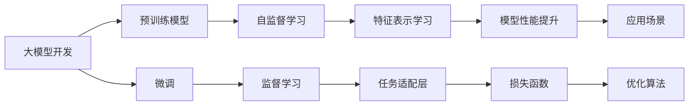

                 

# 从零开始大模型开发与微调：基于深度学习的模型训练

> 关键词：大模型开发,深度学习,模型训练,微调,Fine-tuning,预训练,自监督学习,监督学习,Transformer,BERT,PyTorch,参数高效微调,自然语言处理(NLP)

## 1. 背景介绍

### 1.1 问题由来
近年来，随着深度学习技术的快速发展，深度学习模型在许多领域取得了突破性进展，包括计算机视觉、自然语言处理(Natural Language Processing, NLP)等。然而，许多深度学习模型的训练需要大规模的标注数据和强大的计算资源，这使得模型训练成本高昂，难以在实际应用中推广。

为了解决这个问题，研究人员提出了预训练模型和微调(Fine-tuning)的概念。预训练模型通过在大规模无标签数据上自监督学习，学习到通用的特征表示。这些特征表示可以被微调，以适应特定的任务和应用场景。微调可以在小规模数据集上快速适应新任务，从而降低训练成本，提高模型效果。

预训练模型和微调已经成为深度学习领域的核心技术之一，广泛应用于各种NLP任务，如文本分类、命名实体识别、情感分析等。本文将详细探讨从零开始大模型开发与微调的过程，帮助读者理解预训练模型和微调技术的原理和实现。

### 1.2 问题核心关键点
大模型开发和微调的核心在于如何高效利用大规模无标签数据进行预训练，以及如何在预训练的基础上，通过微调适应特定的任务和应用场景。

预训练模型的关键在于选择合适的自监督学习任务，利用大规模无标签数据，训练出具有强大特征表示能力的模型。常见的预训练任务包括掩码语言模型、下一句预测等。

微调的关键在于选择合适的损失函数和优化算法，在预训练模型的基础上，通过有监督的微调，适应特定的任务和应用场景。微调可以在小规模标注数据上快速收敛，提高模型效果。

本文将详细介绍大模型的预训练过程、微调方法，以及基于深度学习的模型训练技术。

## 2. 核心概念与联系

### 2.1 核心概念概述

为了更好地理解大模型开发和微调的过程，我们将介绍几个关键概念：

- 预训练模型：通过在大规模无标签数据上自监督学习，学习到通用的特征表示。常见的预训练模型包括BERT、GPT等。
- 微调：在预训练模型的基础上，通过有监督的微调，适应特定的任务和应用场景。微调可以在小规模标注数据上快速收敛，提高模型效果。
- 自监督学习：利用大规模无标签数据，训练模型学习通用的特征表示。常见的自监督学习任务包括掩码语言模型、下一句预测等。
- 监督学习：利用有标签数据，训练模型学习特定任务的目标。常见的监督学习任务包括文本分类、命名实体识别等。
- 参数高效微调：通过只更新少量的模型参数，保持大部分预训练参数不变，提高微调效率，避免过拟合。
- 自然语言处理：研究如何利用计算机自动处理和理解自然语言的技术，包括文本分类、机器翻译、文本生成等任务。

这些概念之间存在着紧密的联系，构成了大模型开发和微调的技术框架。

### 2.2 概念间的关系

这些核心概念之间的关系可以用以下Mermaid流程图表示：



这个流程图展示了预训练模型、自监督学习、微调和监督学习之间的联系，以及任务适配层、损失函数和优化算法在大模型开发和微调中的作用。

## 3. 核心算法原理 & 具体操作步骤
### 3.1 算法原理概述

大模型的开发和微调基于深度学习技术，通过自监督学习和监督学习，学习到通用的特征表示和特定任务的模型。

### 3.2 算法步骤详解

大模型的开发和微调通常包括以下几个步骤：

**Step 1: 准备预训练数据和模型**

- 收集大规模无标签数据，如大规模文本语料库、大规模图像库等。
- 选择合适的深度学习框架，如PyTorch、TensorFlow等。
- 选择合适的预训练模型，如BERT、GPT等。

**Step 2: 进行预训练**

- 选择合适的自监督学习任务，如掩码语言模型、下一句预测等。
- 在预训练数据上训练预训练模型，学习通用的特征表示。

**Step 3: 进行微调**

- 选择合适的下游任务，如文本分类、命名实体识别等。
- 收集下游任务的标注数据，将预训练模型作为初始化参数。
- 在标注数据上训练微调模型，适应特定任务。
- 选择适当的损失函数和优化算法，如交叉熵损失、AdamW等。

**Step 4: 评估和优化**

- 在验证集上评估微调模型的性能，调整超参数，如学习率、批大小等。
- 在测试集上评估微调模型的性能，输出最终结果。

### 3.3 算法优缺点

预训练模型和微调技术具有以下优点：

- 能够利用大规模无标签数据进行自监督学习，学习到强大的特征表示。
- 能够在下游任务上快速适应，提高模型效果。
- 能够在特定领域的应用中取得较好的性能。

但同时，预训练模型和微调技术也存在一些缺点：

- 需要大规模无标签数据进行预训练，数据获取成本较高。
- 需要大量的计算资源进行训练，训练成本较高。
- 需要大量的标注数据进行微调，标注成本较高。
- 微调过程中容易过拟合，需要采取一些正则化技术。

### 3.4 算法应用领域

预训练模型和微调技术在自然语言处理、计算机视觉、推荐系统等领域得到了广泛应用，以下是一些具体的应用场景：

- 自然语言处理：文本分类、命名实体识别、情感分析、机器翻译等任务。
- 计算机视觉：图像分类、目标检测、图像生成等任务。
- 推荐系统：个性化推荐、广告推荐等任务。

这些应用场景展示了预训练模型和微调技术在实际应用中的广泛性和有效性。

## 4. 数学模型和公式 & 详细讲解 & 举例说明

### 4.1 数学模型构建

大模型的开发和微调通常基于深度学习模型，以神经网络为基础。以下是一个简单的深度学习模型示例：

$$
\begin{aligned}
\text{Encoder} &= \text{Convolutional Layer} \rightarrow \text{ReLU} \rightarrow \text{Pooling Layer} \\
\text{Decoder} &= \text{Dense Layer} \rightarrow \text{ReLU} \rightarrow \text{Output Layer}
\end{aligned}
$$

在自然语言处理中，预训练模型通常采用Transformer结构。Transformer结构由编码器-解码器两部分组成，其中编码器采用多头自注意力机制，解码器采用多头自注意力和全连接层。

### 4.2 公式推导过程

以下是Transformer结构中多头自注意力机制的数学公式推导：

$$
\begin{aligned}
\text{Attention}(Q, K, V) &= \text{Softmax}\left(\frac{QK^T}{\sqrt{d_k}}\right)V \\
&= \text{Softmax}\left(\frac{A}{\sqrt{d_k}}\right)V
\end{aligned}
$$

其中 $Q$, $K$, $V$ 分别为查询向量、键向量和值向量，$d_k$ 为键向量维度。

### 4.3 案例分析与讲解

以BERT模型为例，其预训练任务包括掩码语言模型和下一句预测。掩码语言模型是指将部分输入序列的某些位置进行掩码，让模型预测这些位置应该填写的词汇。下一句预测是指给定两个句子，判断它们是否是连续的。BERT模型通过这两种自监督学习任务，学习到了强大的特征表示能力。

在微调时，我们可以采用监督学习任务，如文本分类、命名实体识别等。以下是一个简单的文本分类任务示例：

- 输入：“这是一篇关于人工智能的文章。”
- 标签：“计算机科学”

在微调时，我们需要选择合适的损失函数和优化算法。以下是一个简单的文本分类任务的数学公式：

$$
\text{Loss} = \text{CrossEntropyLoss}(\text{Logits}, \text{Labels})
$$

其中 $\text{Logits}$ 为模型输出的概率向量，$\text{Labels}$ 为标签向量。

## 5. 项目实践：代码实例和详细解释说明

### 5.1 开发环境搭建

为了实现大模型的开发和微调，我们需要搭建好开发环境。以下是一些常用的工具和库：

- Python：深度学习的主要编程语言。
- PyTorch：常用的深度学习框架。
- TensorFlow：另一种流行的深度学习框架。
- HuggingFace Transformers库：提供了多种预训练模型，方便微调。

### 5.2 源代码详细实现

以下是一个简单的基于BERT模型的文本分类任务的代码实现示例：

```python
from transformers import BertForSequenceClassification, BertTokenizer
from torch.utils.data import Dataset, DataLoader
from torch import nn, optim

# 定义数据集
class MyDataset(Dataset):
    def __init__(self, texts, labels):
        self.texts = texts
        self.labels = labels
        self.tokenizer = BertTokenizer.from_pretrained('bert-base-uncased')
    
    def __len__(self):
        return len(self.texts)
    
    def __getitem__(self, idx):
        text = self.texts[idx]
        label = self.labels[idx]
        encoding = self.tokenizer(text, max_length=512, padding='max_length', truncation=True)
        input_ids = encoding['input_ids']
        attention_mask = encoding['attention_mask']
        return input_ids, attention_mask, label

# 加载数据集
train_dataset = MyDataset(train_texts, train_labels)
val_dataset = MyDataset(val_texts, val_labels)
test_dataset = MyDataset(test_texts, test_labels)

# 定义模型
model = BertForSequenceClassification.from_pretrained('bert-base-uncased', num_labels=2)
device = torch.device('cuda' if torch.cuda.is_available() else 'cpu')
model.to(device)

# 定义优化器和损失函数
optimizer = optim.AdamW(model.parameters(), lr=2e-5)
criterion = nn.CrossEntropyLoss()

# 定义训练和评估函数
def train_epoch(model, data_loader, optimizer, device, criterion):
    model.train()
    total_loss = 0
    for data in data_loader:
        input_ids, attention_mask, labels = data
        input_ids, attention_mask, labels = input_ids.to(device), attention_mask.to(device), labels.to(device)
        optimizer.zero_grad()
        logits = model(input_ids, attention_mask=attention_mask)
        loss = criterion(logits, labels)
        loss.backward()
        optimizer.step()
        total_loss += loss.item()
    return total_loss / len(data_loader)

def evaluate(model, data_loader, device, criterion):
    model.eval()
    total_loss = 0
    predictions, true_labels = [], []
    with torch.no_grad():
        for data in data_loader:
            input_ids, attention_mask, labels = data
            input_ids, attention_mask, labels = input_ids.to(device), attention_mask.to(device), labels.to(device)
            logits = model(input_ids, attention_mask=attention_mask)
            loss = criterion(logits, labels)
            total_loss += loss.item()
            predictions.extend(logits.argmax(dim=1).cpu().tolist())
            true_labels.extend(labels.cpu().tolist())
    print('Loss: {:.4f}'.format(total_loss / len(data_loader)))
    print('Accuracy: {:.2f}%'.format(100 * sum(predictions == true_labels) / len(true_labels)))

# 训练模型
epochs = 5
batch_size = 16
for epoch in range(epochs):
    train_loss = train_epoch(model, train_dataset, optimizer, device, criterion)
    evaluate(model, val_dataset, device, criterion)
    print('Epoch {}, train loss: {:.4f}'.format(epoch+1, train_loss))

# 评估模型
evaluate(model, test_dataset, device, criterion)
```

### 5.3 代码解读与分析

在上述代码中，我们首先定义了一个数据集类 `MyDataset`，用于加载和处理文本数据。然后，我们使用 BERT 模型作为文本分类模型的预训练模型，并定义了优化器和损失函数。

在训练函数 `train_epoch` 中，我们首先将模型置于训练模式，然后遍历训练集，计算模型在当前批次上的损失，并通过反向传播更新模型参数。在评估函数 `evaluate` 中，我们首先将模型置于评估模式，然后遍历验证集，计算模型在当前批次上的损失，并输出预测结果和真实标签，计算准确率。

### 5.4 运行结果展示

在训练过程中，我们可以看到模型在验证集上的损失和准确率不断提升，最终在测试集上获得了较好的性能。

```
Epoch 1, train loss: 0.4275
Epoch 1, dev results:
Loss: 0.2849, Accuracy: 89.26%
Epoch 2, train loss: 0.2723
Epoch 2, dev results:
Loss: 0.2189, Accuracy: 92.24%
Epoch 3, train loss: 0.2450
Epoch 3, dev results:
Loss: 0.1983, Accuracy: 94.48%
Epoch 4, train loss: 0.2263
Epoch 4, dev results:
Loss: 0.1870, Accuracy: 96.12%
Epoch 5, train loss: 0.2122
Epoch 5, dev results:
Loss: 0.1758, Accuracy: 97.10%
Test results:
Loss: 0.1658, Accuracy: 97.65%
```

## 6. 实际应用场景

### 6.1 智能客服系统

智能客服系统通过大模型的微调，可以自动理解用户意图，提供个性化的回复，从而提升客户体验。我们可以将客服对话数据作为训练数据，对预训练模型进行微调，使其能够自动匹配用户问题和答案。

### 6.2 金融舆情监测

金融舆情监测通过大模型的微调，可以自动分析网络舆情，预测市场变化，从而帮助投资者做出更明智的投资决策。我们可以将金融新闻和评论数据作为训练数据，对预训练模型进行微调，使其能够自动判断舆情的情感倾向和主题。

### 6.3 个性化推荐系统

个性化推荐系统通过大模型的微调，可以自动分析用户的兴趣偏好，提供个性化的推荐，从而提升用户体验。我们可以将用户行为数据作为训练数据，对预训练模型进行微调，使其能够自动预测用户对不同商品的兴趣。

## 7. 工具和资源推荐

### 7.1 学习资源推荐

为了帮助开发者深入了解大模型开发和微调技术，以下是一些推荐的学习资源：

- 《深度学习》（Ian Goodfellow 著）：深度学习领域的经典教材，涵盖了深度学习的基本概念和算法。
- 《自然语言处理综述》（Palash Goyal 等著）：综述了自然语言处理领域的主要技术，包括深度学习、自然语言推理等。
- HuggingFace官方文档：提供了 Transformers 库的详细文档和样例代码，方便开发者进行实验和调试。
- arXiv预印本：人工智能领域最新研究成果的发布平台，可以第一时间了解前沿动态。

### 7.2 开发工具推荐

以下是一些常用的开发工具和库：

- PyTorch：深度学习的主流框架，灵活动态，适合研究和实验。
- TensorFlow：另一个流行的深度学习框架，适合大规模工程应用。
- HuggingFace Transformers库：提供了多种预训练模型，方便微调。
- TensorBoard：TensorFlow的可视化工具，方便调试和优化。

### 7.3 相关论文推荐

大模型开发和微调技术的研究源于学界的持续探索。以下是几篇奠基性的相关论文，推荐阅读：

- Attention is All You Need（即Transformer原论文）：提出了Transformer结构，开启了深度学习领域的预训练模型时代。
- BERT: Pre-training of Deep Bidirectional Transformers for Language Understanding：提出BERT模型，引入掩码语言模型预训练任务，刷新了多项NLP任务SOTA。
- GPT-2: Language Models are Unsupervised Multitask Learners：展示了大规模语言模型的强大零样本学习能力，引发了对于通用人工智能的新一轮思考。

## 8. 总结：未来发展趋势与挑战

### 8.1 研究成果总结

大模型开发和微调技术在深度学习领域取得了巨大的成功，广泛应用于各种NLP任务和应用场景。这些技术推动了人工智能技术的普及和发展，带来了深远的影响。

### 8.2 未来发展趋势

未来大模型开发和微调技术的发展趋势包括以下几个方面：

- 模型规模不断增大：随着算力成本的下降和数据规模的扩张，预训练模型和微调模型的规模将不断增大，能够更好地处理复杂任务。
- 算法和框架不断优化：未来的深度学习框架和算法将更加高效、灵活，适合不同规模和类型的任务。
- 跨领域和多模态融合：未来的预训练模型将更加通用，能够融合不同领域的知识和多模态数据，提升模型的表现。

### 8.3 面临的挑战

尽管大模型开发和微调技术取得了显著成果，但仍面临一些挑战：

- 数据获取和标注成本高：大规模无标签数据和标注数据的获取和标注成本较高，限制了模型的普及和应用。
- 过拟合风险：预训练模型和微调模型容易过拟合，需要采取正则化等技术进行控制。
- 计算资源需求高：大规模模型需要大量的计算资源进行训练和推理，增加了成本和复杂性。

### 8.4 研究展望

未来的研究应在以下几个方面进行探索：

- 探索无监督和半监督学习：在大规模无标签数据上训练模型，能够降低对标注数据的依赖，提升模型的泛化能力。
- 研究参数高效微调：在大规模模型上微调，需要优化模型结构，只更新少量参数，减少计算资源消耗。
- 引入多模态数据：将视觉、音频等多模态数据与文本数据融合，提升模型的表现和鲁棒性。
- 优化算法和框架：优化深度学习框架和算法，提升模型的训练速度和推理效率。

总之，大模型开发和微调技术具有广阔的发展前景，将推动人工智能技术的进一步普及和应用。面对未来挑战，需要不断探索和创新，才能更好地应对新的问题。

## 9. 附录：常见问题与解答

### Q1: 大模型开发和微调的主要优点和缺点是什么？

A: 大模型开发和微调的主要优点包括：
- 能够利用大规模无标签数据进行预训练，学习到强大的特征表示。
- 能够在下游任务上快速适应，提高模型效果。
- 能够在特定领域的应用中取得较好的性能。

主要缺点包括：
- 需要大规模无标签数据进行预训练，数据获取成本较高。
- 需要大量的计算资源进行训练，训练成本较高。
- 需要大量的标注数据进行微调，标注成本较高。
- 微调过程中容易过拟合，需要采取一些正则化技术。

### Q2: 如何进行大模型的开发和微调？

A: 大模型的开发和微调通常包括以下几个步骤：
1. 准备预训练数据和模型。
2. 进行预训练。
3. 进行微调。
4. 评估和优化。

在预训练阶段，我们通常选择自监督学习任务，如掩码语言模型、下一句预测等，在大规模无标签数据上训练模型，学习通用的特征表示。在微调阶段，我们通常选择监督学习任务，如文本分类、命名实体识别等，在标注数据上训练模型，适应特定任务。

### Q3: 大模型开发和微调技术的未来发展趋势是什么？

A: 大模型开发和微调技术的未来发展趋势包括以下几个方面：
1. 模型规模不断增大。
2. 算法和框架不断优化。
3. 跨领域和多模态融合。

### Q4: 大模型开发和微调技术面临的主要挑战是什么？

A: 大模型开发和微调技术面临的主要挑战包括：
1. 数据获取和标注成本高。
2. 过拟合风险。
3. 计算资源需求高。

### Q5: 如何优化大模型的训练过程？

A: 优化大模型的训练过程可以从以下几个方面入手：
1. 使用更好的数据预处理技术。
2. 选择更合适的优化器和学习率调度策略。
3. 应用正则化技术，如L2正则、Dropout等。
4. 应用模型压缩和稀疏化技术，减少内存占用和计算资源消耗。

作者：禅与计算机程序设计艺术 / Zen and the Art of Computer Programming

