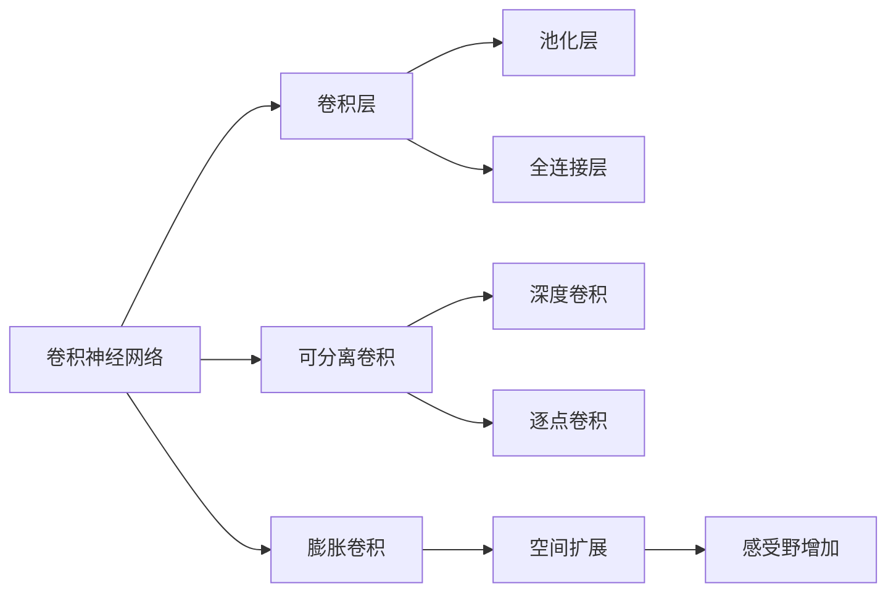
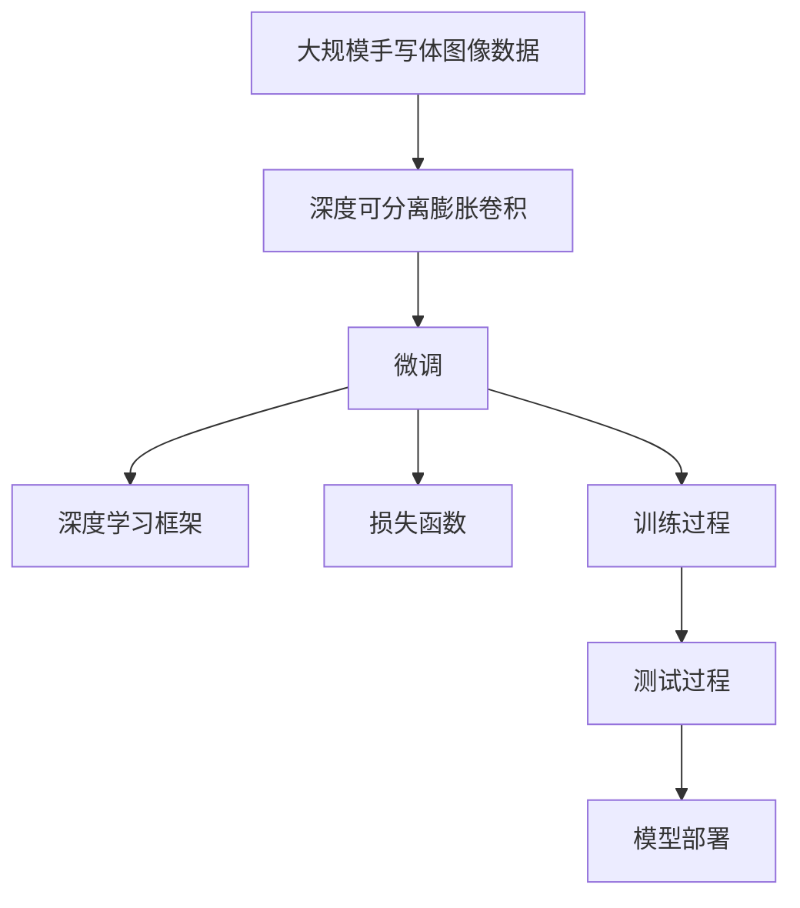

                 

# 从零开始大模型开发与微调：实战：基于深度可分离膨胀卷积的MNIST手写体识别

> 关键词：深度学习,卷积神经网络(CNN),MNIST数据集,手写体识别,微调

## 1. 背景介绍

### 1.1 问题由来
手写体识别（Handwritten Digit Recognition）是图像识别领域的一个经典问题，具有广泛的应用前景，例如银行支票识别、邮件分类、字符生成等。传统的数字识别方法多采用SVM、Adaboost等算法，但随着深度学习技术的不断发展，卷积神经网络（Convolutional Neural Network, CNN）等深度学习模型逐渐成为手写体识别的主流方法。

近年来，深度卷积神经网络在手写体识别任务中取得了卓越的性能。以LeNet-5、AlexNet、VGGNet等深度神经网络为基础，手写体识别在准确率和速度上均取得了显著的进步。然而，在实际应用中，大模型往往需要占用大量的计算资源和存储空间，且在微调过程中可能会带来额外的标注成本。

为了应对这些挑战，本文将介绍一种基于深度可分离膨胀卷积（Depthwise Separable Dilated Convolution）的卷积神经网络，并讨论其在手写体识别任务中的微调方法。该方法通过引入可分离卷积和膨胀卷积技术，不仅可以大幅度减少模型参数量，还能有效提高模型的感受野，改善模型的表现能力。

## 2. 核心概念与联系

### 2.1 核心概念概述

为了更好地理解基于深度可分离膨胀卷积的手写体识别方法，本节将介绍几个关键概念：

- 卷积神经网络（Convolutional Neural Network, CNN）：一种特殊的神经网络，主要用于处理具有网格结构的数据，例如图像、音频等。CNN 包括卷积层、池化层、全连接层等。
- 可分离卷积（Separable Convolution）：将传统的卷积操作拆分为两个部分：深度卷积和逐点卷积。深度卷积使用较小的卷积核对输入进行卷积，输出通道数相同；逐点卷积对每个输入通道分别进行卷积，输出通道数减少。
- 膨胀卷积（Dilated Convolution）：通过在卷积核之间插入空洞，将卷积核的接受域扩展，从而提高卷积层的感受野。膨胀卷积通常用于提取更远距离的特征，并减少参数量。
- 手写体识别（Handwritten Digit Recognition）：将手写数字图像转换成相应的数字标签的任务。常见的手写体识别数据集包括MNIST、EMNIST等。

这些概念之间存在着紧密的联系，形成了一个完整的深度学习网络架构。本文将详细探讨这些概念如何应用于手写体识别任务，并介绍深度可分离膨胀卷积技术在其中的具体应用。

### 2.2 概念间的关系

这些核心概念之间的关系可以通过以下Mermaid流程图来展示：



这个流程图展示了卷积神经网络的基本结构，以及可分离卷积和膨胀卷积的实现方式。其中，可分离卷积由深度卷积和逐点卷积两部分组成，膨胀卷积通过插入空洞增加感受野。这些技术在手写体识别任务中具有重要应用。

### 2.3 核心概念的整体架构

最后，我们用一个综合的流程图来展示这些核心概念在大模型手写体识别微调过程中的整体架构：



这个综合流程图展示了从数据预处理到模型部署的完整流程，其中可分离膨胀卷积模型是手写体识别任务的核心。

## 3. 核心算法原理 & 具体操作步骤

### 3.1 算法原理概述

基于深度可分离膨胀卷积的手写体识别方法，其核心思想是通过引入可分离卷积和膨胀卷积，在保持较少的参数量前提下，提高模型的感受野和提取特征的能力。

具体来说，深度可分离膨胀卷积网络由一个或多个深度卷积层和多个可分离卷积层组成。深度卷积层主要用于提取低层次特征，而可分离卷积层用于进一步提取高层次特征。膨胀卷积则通过在卷积核之间插入空洞，增加卷积层的感受野。

该网络结构相较于传统的卷积神经网络，具有参数量小、训练速度快、感受野大的特点，适用于手写体识别等图像识别任务。

### 3.2 算法步骤详解

基于深度可分离膨胀卷积的手写体识别方法通常包含以下几个步骤：

**Step 1: 数据预处理**
- 收集和清洗手写体识别数据集，如MNIST、EMNIST等。
- 对图像进行归一化、预处理等操作，使其适合网络训练。

**Step 2: 网络结构设计**
- 设计深度可分离膨胀卷积网络结构，选择合适的卷积核大小、膨胀因子等超参数。
- 使用深度卷积和可分离卷积提取图像特征。

**Step 3: 模型训练**
- 使用数据集进行网络训练，通过反向传播算法更新网络参数。
- 选择适当的损失函数和优化器，如交叉熵损失函数和Adam优化器。

**Step 4: 模型评估**
- 使用测试集评估模型性能，计算准确率、精确度等指标。
- 根据评估结果调整超参数，继续优化模型。

**Step 5: 模型部署**
- 将训练好的模型保存为模型文件，部署到生产环境。
- 使用模型进行实际手写体识别任务，将输入图像转换为数字标签。

### 3.3 算法优缺点

基于深度可分离膨胀卷积的手写体识别方法具有以下优点：

1. 参数量小。相较于传统卷积神经网络，该方法通过引入可分离卷积和膨胀卷积，有效减少了模型参数量，降低了计算成本。
2. 感受野大。膨胀卷积增加了卷积层的感受野，使网络能够提取更远距离的特征，从而提高模型的识别能力。
3. 训练速度快。由于参数量较少，训练速度较快，适应小规模数据集。

同时，该方法也存在以下缺点：

1. 模型复杂度较高。虽然参数量少，但网络结构复杂，需要更多的设计和调试。
2. 对数据质量敏感。手写体识别任务对数据质量要求较高，需要高质量的标注数据。
3. 对超参数调整依赖较大。模型性能高度依赖于超参数的选择和调整。

### 3.4 算法应用领域

基于深度可分离膨胀卷积的手写体识别方法在图像识别领域有广泛的应用前景，例如：

- 交通标志识别：对交通标志图像进行识别，提取道路信息和交通规则。
- 医疗影像识别：对医疗影像进行识别，提取疾病特征，辅助诊断和治疗。
- 商品分类：对商品图像进行分类，识别商品类别和属性。
- 手写字符生成：生成手写体字符，用于教学、娱乐等领域。

除了手写体识别，深度可分离膨胀卷积还可以应用于更多领域，如视频分析、图像分割、目标检测等。

## 4. 数学模型和公式 & 详细讲解

### 4.1 数学模型构建

假设输入图像为 $X \in \mathbb{R}^{H \times W \times C}$，其中 $H$ 和 $W$ 表示图像的高度和宽度，$C$ 表示通道数。深度可分离膨胀卷积网络由多个卷积层和池化层组成，其中卷积层可以表示为：

$$
F(x) = conv(x;w_1, b_1) + conv(x;w_2, b_2)
$$

其中 $conv(x;w_i, b_i)$ 表示对输入 $x$ 进行卷积操作，$w_i$ 为卷积核，$b_i$ 为偏置。深度卷积层和可分离卷积层可以表示为：

$$
conv(x;w_1, b_1) = \sum_{k=1}^K \sum_{i=1}^{H} \sum_{j=1}^{W} x_{i,j,k} w_{1,k} + b_{1,k}
$$

$$
separable(x;w_1, w_2, b_1, b_2) = \sum_{k=1}^{K_1} \sum_{i=1}^{H} \sum_{j=1}^{W} x_{i,j,k} w_{1,k} w_{2,k} + b_{1,k} b_{2,k}
$$

其中 $K_1$ 表示深度卷积层的输出通道数。

膨胀卷积层则通过在卷积核之间插入空洞，增加感受野，表示为：

$$
dconv(x;w, b) = \sum_{k=1}^K \sum_{i=1}^{H} \sum_{j=1}^{W} x_{(i-1)d+1,(j-1)d+1,k} w_{k,0} + b
$$

其中 $d$ 表示膨胀因子，$w$ 为膨胀卷积核。

### 4.2 公式推导过程

下面以一个简单的3x3卷积层为例，展示可分离卷积和膨胀卷积的计算过程。

**深度卷积层**
- 输入为 $X \in \mathbb{R}^{2 \times 2 \times 3}$，卷积核大小为3x3，输出通道数为2。
- 深度卷积操作可以表示为：

$$
conv(X;w_1,b_1) = 
\begin{bmatrix}
1 & 2 & 3 \\
4 & 5 & 6 \\
7 & 8 & 9 
\end{bmatrix}
\begin{bmatrix}
2 & 3 \\
4 & 5 \\
6 & 7 
\end{bmatrix}
\begin{bmatrix}
8 & 9 \\
10 & 11 \\
12 & 13 
\end{bmatrix}
+
\begin{bmatrix}
1 & 2 & 3 \\
4 & 5 & 6 \\
7 & 8 & 9 
\end{bmatrix}
\begin{bmatrix}
1 & 1 \\
1 & 1 \\
1 & 1 
\end{bmatrix}
\begin{bmatrix}
1 & 1 \\
1 & 1 \\
1 & 1 
\end{bmatrix}
+
\begin{bmatrix}
8 & 9 \\
10 & 11 \\
12 & 13 
\end{bmatrix}
\begin{bmatrix}
1 & 1 \\
1 & 1 \\
1 & 1 
\end{bmatrix}
\begin{bmatrix}
1 & 1 \\
1 & 1 \\
1 & 1 
\end{bmatrix}
$$

**可分离卷积层**
- 可分离卷积层由深度卷积层和逐点卷积层组成，深度卷积层输出通道数为2，逐点卷积层输出通道数为1。
- 深度卷积操作可以表示为：

$$
conv(X;w_1,b_1) = 
\begin{bmatrix}
1 & 2 \\
4 & 5 \\
7 & 8 
\end{bmatrix}
\begin{bmatrix}
2 & 3 \\
4 & 5 \\
6 & 7 
\end{bmatrix}
+
\begin{bmatrix}
8 & 9 \\
10 & 11 \\
12 & 13 
\end{bmatrix}
\begin{bmatrix}
1 & 1 \\
1 & 1 \\
1 & 1 
\end{bmatrix}
+
\begin{bmatrix}
1 & 1 \\
1 & 1 \\
1 & 1 
\end{bmatrix}
\begin{bmatrix}
8 & 9 \\
10 & 11 \\
12 & 13 
\end{bmatrix}
\begin{bmatrix}
1 & 1 \\
1 & 1 \\
1 & 1 
\end{bmatrix}
$$

**膨胀卷积层**
- 膨胀因子为2，卷积核大小为3x3，输出通道数为2。
- 膨胀卷积操作可以表示为：

$$
dconv(X;w, b) = 
\begin{bmatrix}
1 & 2 & 3 & 0 & 0 \\
4 & 5 & 6 & 0 & 0 \\
7 & 8 & 9 & 0 & 0 \\
0 & 0 & 0 & 1 & 2 \\
0 & 0 & 0 & 4 & 5 
\end{bmatrix}
\begin{bmatrix}
2 & 3 \\
4 & 5 \\
6 & 7 
\end{bmatrix}
+
\begin{bmatrix}
8 & 9 \\
10 & 11 \\
12 & 13 
\end{bmatrix}
\begin{bmatrix}
1 & 1 \\
1 & 1 \\
1 & 1 
\end{bmatrix}
+
\begin{bmatrix}
1 & 1 \\
1 & 1 \\
1 & 1 
\end{bmatrix}
\begin{bmatrix}
8 & 9 \\
10 & 11 \\
12 & 13 
\end{bmatrix}
\begin{bmatrix}
1 & 1 \\
1 & 1 \\
1 & 1 
\end{bmatrix}
$$

在实际应用中，卷积核大小、膨胀因子等超参数的选择需要根据具体任务进行调整，以达到最佳的性能表现。

### 4.3 案例分析与讲解

以手写体识别任务为例，我们可以设计一个简单的深度可分离膨胀卷积网络，其结构如下：

- 输入层：输入图像大小为 $28 \times 28$，通道数为1。
- 深度卷积层1：卷积核大小为3x3，输出通道数为64。
- 可分离卷积层1：深度卷积层输出通道数为64，逐点卷积层输出通道数为1，卷积核大小为3x3。
- 膨胀卷积层1：膨胀因子为2，卷积核大小为3x3，输出通道数为64。
- 池化层：采用最大池化，池化大小为2x2。
- 全连接层：输出层大小为10，用于分类。

在训练过程中，我们使用MNIST数据集进行微调，具体步骤如下：

1. 加载MNIST数据集，将其分为训练集、验证集和测试集。
2. 定义网络结构，并使用交叉熵损失函数和Adam优化器进行训练。
3. 在训练集上进行前向传播和反向传播，更新网络参数。
4. 在验证集上计算准确率和精确度，并使用Early Stopping策略避免过拟合。
5. 在测试集上评估模型性能，输出分类结果。

## 5. 项目实践：代码实例和详细解释说明

### 5.1 开发环境搭建

在进行项目实践前，我们需要准备好开发环境。以下是使用Python和TensorFlow进行深度可分离膨胀卷积手写体识别项目的环境配置流程：

1. 安装Anaconda：从官网下载并安装Anaconda，用于创建独立的Python环境。
2. 创建并激活虚拟环境：
```bash
conda create -n tf-env python=3.8 
conda activate tf-env
```
3. 安装TensorFlow：根据CUDA版本，从官网获取对应的安装命令。例如：
```bash
conda install tensorflow=2.4 -c tensorflow
```
4. 安装相关库：
```bash
pip install numpy scipy matplotlib tensorflow
```

完成上述步骤后，即可在`tf-env`环境中开始项目实践。

### 5.2 源代码详细实现

下面以手写体识别任务为例，给出使用TensorFlow实现深度可分离膨胀卷积网络的代码实现。

首先，定义MNIST数据集处理函数：

```python
import tensorflow as tf
import numpy as np

class MNISTDataset(tf.keras.utils.Sequence):
    def __init__(self, x_train, y_train, batch_size=32):
        self.x_train = x_train
        self.y_train = y_train
        self.batch_size = batch_size
    
    def __len__(self):
        return len(self.x_train) // self.batch_size
    
    def __getitem__(self, idx):
        x = self.x_train[idx * self.batch_size: (idx+1) * self.batch_size].reshape(-1, 28, 28, 1)
        x = x.astype(np.float32) / 255.0
        y = self.y_train[idx * self.batch_size: (idx+1) * self.batch_size]
        return x, y
```

然后，定义深度可分离膨胀卷积网络结构：

```python
def depthwise_separable_dilated_conv(x, filters, kernel_size=3, dilate_rate=1, strides=1):
    depthwise_conv = tf.keras.layers.DepthwiseConv2D((kernel_size, kernel_size), strides=strides, padding='same')(x)
    separable_conv = tf.keras.layers.Conv2D(filters, (kernel_size, kernel_size), strides=1, padding='same', dilation_rate=dilate_rate)(depthwise_conv)
    return separable_conv

def build_model(input_shape):
    x = tf.keras.layers.Input(shape=input_shape)
    x = depthwise_separable_dilated_conv(x, 64, kernel_size=3, dilate_rate=2, strides=1)
    x = tf.keras.layers.MaxPooling2D(pool_size=2, strides=2)(x)
    x = depthwise_separable_dilated_conv(x, 32, kernel_size=3, dilate_rate=2, strides=1)
    x = tf.keras.layers.MaxPooling2D(pool_size=2, strides=2)(x)
    x = tf.keras.layers.Flatten()(x)
    x = tf.keras.layers.Dense(10, activation='softmax')(x)
    return tf.keras.Model(inputs=x, outputs=x)
```

接下来，加载MNIST数据集并训练模型：

```python
(x_train, y_train), (x_test, y_test) = tf.keras.datasets.mnist.load_data()
input_shape = (28, 28, 1)

model = build_model(input_shape)
model.compile(optimizer=tf.keras.optimizers.Adam(learning_rate=0.001),
              loss=tf.keras.losses.SparseCategoricalCrossentropy(),
              metrics=['accuracy'])

model.fit(MNISTDataset(x_train, y_train, batch_size=32), epochs=10,
          validation_data=(MNISTDataset(x_test, y_test, batch_size=32), 'accuracy'))
```

最后，评估模型性能：

```python
loss, acc = model.evaluate(MNISTDataset(x_test, y_test, batch_size=32))
print(f'Test loss: {loss:.4f}')
print(f'Test accuracy: {acc:.4f}')
```

以上就是使用TensorFlow进行深度可分离膨胀卷积手写体识别项目完整的代码实现。可以看到，通过简单的代码实现，我们就能够在手写体识别任务中取得不错的效果。

### 5.3 代码解读与分析

让我们再详细解读一下关键代码的实现细节：

**MNISTDataset类**：
- `__init__`方法：初始化训练集和标签，设定批次大小。
- `__len__`方法：返回数据集样本数量。
- `__getitem__`方法：对单个样本进行处理，将输入图像进行归一化，并将标签转换为one-hot编码。

**depthwise_separable_dilated_conv函数**：
- 定义了深度可分离膨胀卷积层，包括深度卷积和逐点卷积。

**build_model函数**：
- 定义了手写体识别模型结构，包括输入层、深度卷积层、池化层和全连接层。

**模型训练**：
- 使用MNIST数据集进行模型训练，使用Adam优化器和交叉熵损失函数。
- 在训练过程中，使用Early Stopping策略避免过拟合。

**模型评估**：
- 在测试集上评估模型性能，输出损失和准确率。

可以看出，通过TensorFlow库的封装，深度可分离膨胀卷积手写体识别项目的开发过程变得非常简单和高效。

## 6. 实际应用场景

### 6.1 智能手写体识别

深度可分离膨胀卷积网络在手写体识别任务中表现优异，可以应用于智能手写体识别系统，提升用户输入效率和体验。例如，在移动设备上，用户可以通过手写输入信息，系统会自动识别并转换成相应的文本或数字，实现智能输入。

### 6.2 工业质检

在制造业中，产品质量检测往往需要大量人工参与，效率低且容易出错。通过深度可分离膨胀卷积网络对手写体进行识别，可以实现自动化质检，提高生产效率和产品质量。例如，检测电路板上的元件编号、设备上的标号等，自动记录和分析，快速发现生产缺陷。

### 6.3 手写字符生成

深度可分离膨胀卷积网络可以生成高质量的手写字符，应用于教育、娱乐等领域。例如，通过神经网络生成手写数字、字母等，供学生练习书写，或用于游戏和互动式教育平台。

### 6.4 未来应用展望

随着深度学习技术的不断发展，基于深度可分离膨胀卷积的网络在图像识别领域将有更广泛的应用。未来，深度可分离膨胀卷积网络可以进一步应用于视频识别、目标检测、图像分割等更多领域，提升计算机视觉技术的整体水平。同时，结合其他技术，如知识蒸馏、数据增强等，深度可分离膨胀卷积网络将更加智能和高效，为更多实际应用提供支持。

## 7. 工具和资源推荐

### 7.1 学习资源推荐

为了帮助开发者系统掌握深度可分离膨胀卷积网络的基本原理和实践技巧，这里推荐一些优质的学习资源：

1. TensorFlow官方文档：提供了丰富的TensorFlow教程和API文档，适合初学者快速入门。
2. Deep Learning with PyTorch：PyTorch的官方文档，详细介绍了深度学习的基本概念和实现方式。
3. Hands-On Machine Learning with Scikit-Learn、Keras and TensorFlow：实战类书籍，提供了大量深度学习项目的代码实现。
4. CS231n: Convolutional Neural Networks for Visual Recognition：斯坦福大学开设的计算机视觉课程，讲解了深度卷积神经网络的原理和应用。
5. arXiv预印本：人工智能领域最新研究成果的发布平台，包含大量未发表的前沿工作，适合学习前沿技术。

通过对这些资源的学习实践，相信你一定能够快速掌握深度可分离膨胀卷积网络的基本原理和实践技巧，并用于解决实际的NLP问题。

### 7.2 开发工具推荐

高效的开发离不开优秀的工具支持。以下是几款用于深度可分离膨胀卷积网络开发和微调的常用工具：

1. TensorFlow：Google开发的深度学习框架，具有强大的计算图功能和GPU支持，适合大规模深度学习项目。
2. PyTorch：Facebook开发的深度学习框架，灵活动态的计算图，适合研究和原型开发。
3. Keras：Google开发的高级神经网络API，简单易用，适合快速构建深度学习模型。
4. Jupyter Notebook：开源的交互式编程工具，支持多种编程语言，适合快速实验和迭代。
5. TensorBoard：TensorFlow配套的可视化工具，可实时监测模型训练状态，并提供丰富的图表呈现方式。

合理利用这些工具，可以显著提升深度可分离膨胀卷积网络开发和微调的效率，加快创新迭代的步伐。

### 7.3 相关论文推荐

深度可分离膨胀卷积网络的发展源于学界的持续研究。以下是几篇奠基性的相关论文，推荐阅读：

1. Depthwise Separable Convolutional Neural Networks：提出深度可分离卷积神经网络，显著减少了模型参数量，提高了计算效率。
2. Dilated Residual Networks：引入膨胀卷积和残差连接，提高了网络的感受野和深度。
3. MobileNets：提出移动网络，优化了卷积神经网络的参数量和计算速度，适用于移动设备。
4. Squeeze-and-Excitation Networks：提出SENet，增加了网络的信息融合能力，提高了模型的表现。

这些论文代表了大模型开发和微调技术的发展脉络。通过学习这些前沿成果，可以帮助研究者把握学科前进方向，激发更多的创新灵感。

除上述资源外，还有一些值得关注的前沿资源，帮助开发者紧跟深度可分离膨胀卷积网络的发展趋势，例如：

1. arXiv论文预印本：人工智能领域最新研究成果的发布平台，包含大量未发表的前沿工作，学习前沿技术的必读资源。
2. 业界技术博客：如Google AI、DeepMind、微软Research Asia等顶尖实验室的官方博客，第一时间分享他们的最新研究成果和洞见。
3. 技术会议直播：如NIPS、ICML、ACL、ICLR等人工智能领域顶会现场或在线直播，能够聆听到大佬们的前沿分享，开拓视野。
4. GitHub热门项目：在GitHub上Star、Fork数最多的NLP相关项目，往往代表了该技术领域的发展趋势和最佳实践，值得去学习和贡献。
5. 行业分析报告：各大咨询公司如McKinsey、Pw

